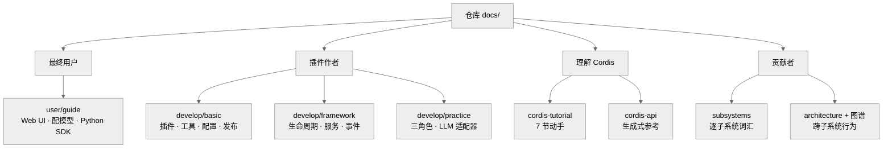

# 官方文档地图

DeepSeek Harness 仓库自带一套 `docs/` 目录，按"给谁看"分了几摞。这篇附录不逐行剖析源码，只做一件事：给你一张导航图——**哪一摞是写给谁的、从哪个文件进去、读完之后接哪一章**。与另一篇《官方文档对照》不同，那篇通读的是发布出去的官方文档站（`deepseek-harness.github.io`，一个把仓库里挑选出的双语 Markdown 投影成静态网站的 VitePress 项目 `[claimed]`），这篇则直接对着仓库里的一手 `docs/` 源文件，帮你决定"该翻哪一本"。下面按四类读者铺开。

> 图注：`docs/` 按四类读者分摞；箭头是"从这里进门"，不是依赖关系。

## 一、最终用户：guide

想把 harness 跑起来、当工具用的人，从 `user/guide/` 进。入口 `index.md` 讲最小闭环：跑起 Web UI（Web User Interface，浏览器里的操作界面）、在 Settings 里填 DeepSeek API 密钥、选工作区、发第一个任务 `[verified]`（`docs/user/guide/index.md:7-23`）。`providers.md` 讲换别的模型或自建 OpenAI 兼容端点；`python-sdk.md` 是"用程序而不是网页驱动会话"的编程式入口，装官方 Python SDK（Software Development Kit，软件开发工具包）跑一份内置 agent 组合 `[verified]`（`docs/user/guide/python-sdk.md:5`）。这一摞回答"怎么用"，与本研究 Part I 的"定位与上手"互补。

## 二、插件作者：develop

想给 harness 加能力的人，主战场是 `user/develop/`，它自己又分三层，循序渐进。

- **basic**（`develop/basic/`）——最小手把手。`index.md` 一句话定义插件："导出一个 `apply` 函数的 TypeScript 模块"，框架加载时调用它并传入 `ctx` `[verified]`（`docs/user/develop/basic/index.md:17`）；`tool.md` 教注册工具、`config.md` 教声明可校验配置、`publish.md` 教打包与安装。
- **framework**（`develop/framework/`）——机制层。`index.md` 给出 Fiber（每个插件独占的作用域）状态机 `PENDING→LOADING→ACTIVE`（或 `FAILED`）`→UNLOADING→DISPOSED` `[verified]`（`docs/user/develop/framework/index.md:9-24`）；`service.md` 讲服务与 `inject` 依赖，`events.md` 讲事件分发。
- **practice**（`develop/practice/`）——进阶范式。`index.md` 立起"能力接缝"的三角色——Service Definition / Provider / Consumer，并强调"单个角色不构成接缝" `[verified]`（`docs/user/develop/practice/index.md:9`）；`llm-adapter.md` 是最完整的实战：继承 `LlmAdapter`、实现 `async *stream()`，遵守 `StreamChunk` 流式协议，且"每个 `block-start` 都有配对的 `block-end`" `[verified]`（`docs/user/develop/practice/llm-adapter.md:52-105`）。

## 三、理解 Cordis：tutorial 与 api reference

想搞懂底座的人有两条路。`cordis-tutorial/`（7 节 + `index`）是动手派：`index.md` 一句话点题——"Cordis 是一个小运行时，连工具、LLM 适配器、文件访问、agent loop 本身都是挂到共享 ctx 上的插件" `[verified]`（`docs/cordis-tutorial/index.md:5`），每节都是可跑的例子。`cordis-api/`（`context`、`events`、`fiber`、`registry`、`service`，另加 `inherited` 汇总）是查阅派，由脚本从 vendor 源码生成 `[verified]`（`docs/cordis-api/context.md:1-6`、`docs/cordis-api/inherited.md:4-8`）。前者建立直觉，后者查签名。

## 四、贡献者：subsystems 与 architecture

想改 `packages/` 的人，先读 `architecture.md`——它讲跨子系统的行为（服务图、会话/回合/步的生命周期、事件分类法），并重申"每一部分都是插件、都可从配置替换" `[verified]`（`docs/architecture.md:11`）。`subsystems/`（见 `README.md`）是配套的参考册，一子系统一页，讲它搬运的数据结构与 `ctx` 服务/事件词汇 `[verified]`（`docs/subsystems/README.md:5`）。两张生成图谱是索引：`graph-atlas.md` 汇总关系图入口 `[verified]`（`docs/graph-atlas.md:6`），`module-graph.md` 画包间依赖 `[verified]`（`docs/module-graph.md:6`）。

## 与本研究的对应

| 官方 docs 入口 | 本研究互补章节 |
|---|---|
| `user/guide/`（index / providers / python-sdk） | Part I 第 01、04 章；集成线 ↔ 第 17 章 |
| `develop/basic/`（tool / config / publish） | 第 08、09 章（提示词/工具管线）、第 04 章（组装） |
| `develop/framework/`（index / service / events） | 第 05 章（事件分类法）、Part V 第 25、26、27 章 |
| `develop/practice/llm-adapter` | 第 10 章（流式词汇）、第 11 章（能力接缝） |
| `cordis-tutorial/`（01–07） | Part V 第 24–29 章 |
| `cordis-api/`（context…service、inherited） | Part V 第 25、26、27 章 |
| `subsystems/`（逐子系统） | Part II 第 12–18 章 |
| `architecture.md` + 图谱 | 《总纲》、第 02、05 章 |
