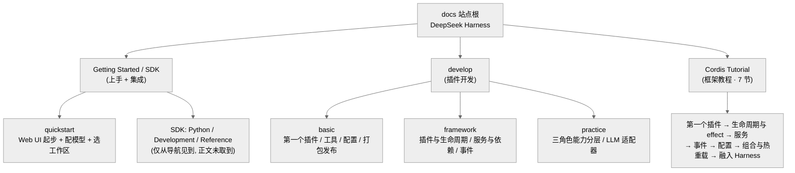

# 附录 · 官方文档对照笔记

> 这篇笔记做一件事：把 DeepSeek Harness 的**官方文档站**（<https://deepseek-harness.github.io/deepseek-harness/>）通读一遍，和本研究基于源码写出的各章逐条对照，看看哪些地方**互相印证**、哪些是官方讲了而我们**没覆盖或讲浅了**、哪些是我们据源码讲的但**官方口径更权威**。
>
> 证据等级约定：官方文档的说法标 `[official]`——它是权威口径，但请注意这是**文档口径、不是源码直证**；本研究正文里的 `文件:行号` 才是对源码的直接验证。两者冲突时，本笔记会明确点出，并说明该以谁为准。社区/推断照旧标 `[claimed]`/`[inferred]`。

## 一、官方文档站的结构与覆盖范围

官方文档站是一个多语言的 VitePress 风格站点，主干分成三大块：**上手指南（guide / SDK）**、**插件开发（develop）**、以及内嵌的 **Cordis 框架教程**。它面向的读者很明确——想给 harness 加能力的插件作者，以及想把 harness 当运行时来集成的工程师。

下面这张图把成功抓到的页按导航层级铺开，方便你对照阅读。

> 图注：本图只画出**成功抓到正文**的页与**导航里见到但正文未取到**的页（后者已标注）。它不是官方的完整站点地图，而是本次调研的实际取样范围。

### 成功抓到的页（附主题）

| 页面 | URL 尾段 | 主题要点 |
|---|---|---|
| 第一个 Harness 插件 | `develop/basic/` | plugin = 导出 `apply` 的 TS 模块 + 可选 `name`；函数/对象/类三种形态；`inject`、`ctx.effect()`、`ctx.tools.register()`；`cordis.yml` 用绝对路径注册；`pnpm dsh web --patch` 启动 |
| 开发一个工具 | `develop/basic/tool` | `ctx.tools.register()` + `defineTool()`；参数 schema、输出 schema + **render 函数**（把执行结果转成"给模型看"的内容）、`execute` 处理器 |
| 插件配置 | `develop/basic/config` | 导出 `Config` 接口 + Schemastery `Schema`（默认值内嵌）；`apply(ctx, config)` 收到已校验配置；加载期校验失败即报错；配置改动触发 HMR |
| 打包与安装插件 | `develop/basic/publish` | Bundle（`dsh.bundle` + `cordis.patch.yml`）vs Profile（`$DSH_HOME/profiles/<name>`）；`dsh plugin --profile <name> add`；四层叠加顺序；npm/git/tarball 三种分发 |
| 插件与生命周期 | `develop/framework/` | Fiber 状态机 `PENDING→LOADING→ACTIVE`(/`FAILED`)→`UNLOADING→DISPOSED`；`ctx.effect(() => cleanup)`；disposer **逆序**执行；`ctx.plugin()` 嵌套子 Fiber；HMR |
| 服务与依赖 | `develop/framework/service` | `Service` 基类 + `super(ctx, 'name')`；声明合并让 `ctx` 有类型；`inject` 必需依赖、`ctx.get()` 可选依赖；依赖消失则消费者自动卸载、回归后重载 |
| 事件系统 | `develop/framework/events` | `ctx.on/emit/serial/waterfall/bail`；`waterfall` 需 `next()` 下传；命名约定 `agent/step`、`tools/result`、`session/event`；耐久事件经 `session/event` 观测 |
| 三角色能力分层 | `develop/practice/` | Service Definition / Provider / Consumer；"单个角色不构成接缝"；shell 三包示例；"别抢先拆"（第二个 provider 出现前保持单包） |
| LLM 适配器 | `develop/practice/llm-adapter` | 继承 `LlmAdapter`、实现 `async *stream()`；`StreamChunk` 协议 `block-start→text-delta/tool-call-delta→block-end→usage→finish`；`LlmError` + 稳定错误码；`ctx.llm.registerAdapter()` |
| Cordis 教程总览 | `develop/cordis-tutorial/` | Cordis 是"一个小运行时，连工具/LLM 适配器/文件访问/agent loop 本身都是挂在共享 ctx 上的插件"；7 节循序渐进 |
| 快速上手 | `guide/quickstart` | Web UI 起步：跑起 `dsh`、Settings→Model 填 DeepSeek API key、选工作区、发任务；权限边界内可读写文件/执行命令/委派 |

### 未取到的页

- **docs 站点根首页**：抓到的正文过于稀薄（仅标题），未能取到完整导航，故本笔记的站点结构以各子页里的侧边栏链接反推。
- **SDK 区（`sdk/python`、`sdk/` 等）**：多处子页返回 404，仅在其他页的侧边栏见到 "SDK: Python / Development / Reference" 与 "CLI modes" 的入口——**存在但正文未取到**。
- **`guide/cli`、`develop/framework/lifecycle`、`cordis-tutorial/lifecycle` 等猜测路径**：返回 404 或被临时限流；生命周期正文实际落在 `develop/framework/` 页内。

## 二、官方文档 vs 本研究源码分析：三类对照

### ① 官方明确讲、我们也讲对了的（互相印证）

这一类占比最大，说明本研究的核心论断经得起官方口径的复核。

- **"一切皆插件、连 agent loop 本身都可替换"** `[official]`。Cordis 教程总览原话："a small runtime where every capability—including tools, LLM adapters, file access, and the agent loop itself—is a plugin mounted to a shared context." 这与《总纲》的"架构命题"、第 05 章"微内核 + 唯一具体 loop"完全同调。对读者的意义：这条主线不是我们从源码里过度解读出来的，官方自己就是这么定位的。

- **能力接缝的三角色（Definition/Provider/Consumer）** `[official]`。practice 页原话："any single role alone is not a seam"，并给出与第 11 章一字不差的 shell 示例（`dsh-shell` 定义、`dsh-bash-local` 提供、`dsh-tool-bash` 消费），以及"别抢先拆（don't preventively split）"的纪律。第 11 章据源码（`capability-seams.md`、`packages/README.md:67`）讲的，官方文档逐条印证。

- **四种/多种事件分发语义** `[official]`。events 页确认 `waterfall` 需 `next()` 下传、`serial` 顺序 await、命名约定 `agent/step`、`tools/result`、`session/event`，与第 05 章的分类法一致。

- **`ctx.effect()` + 自动清理 + disposer 逆序** `[official]`。framework 页明确 disposer "逆序执行"、且给出 Fiber 状态机 `PENDING→LOADING→ACTIVE→UNLOADING→DISPOSED`——这为第 02/03 章"卸载即回滚副作用"的范式命题补了一张官方的状态机口径。

- **Profile / Bundle / patch 四层叠加、按行 id 覆盖** `[official]`。publish 页确认叠加顺序（bundle → profile → home → `--patch`）且"后层按行 id 整体替换、而非深合并（complete config replacement rather than deep merging）"——与第 04 章据 `vendor/include/src/index.ts` 与 `profile-boot.ts:151` 得出的结论一致。

- **LLM 适配器的流式词汇** `[official]`。llm-adapter 页给出 `StreamChunk` 序列与 `block-start↔block-end` 配对不变量，印证第 10 章"流式词汇"的分析。

### ② 官方讲了、我们没覆盖或讲浅了的（补充点）

- **Python SDK 与 CLI 模式** `[official]`（仅导航证据，正文未取到）。文档站单列了 "SDK: Python / Development / Reference" 与 "CLI modes"，指向"把 harness 当运行时、用程序驱动会话"的用法。本研究的 Part I 更偏 Web UI 与源码，对"编程式集成"这条线着墨很少。这是最值得补的一块——它关系到"谁会用、怎么用"这个使用者最关心的问题。（注：SDK 正文页本次未取到，补写时需以实际页内容为准。）

- **插件作者视角的配置写法（Schemastery）** `[official]`。config 页给的是"作者怎么声明配置"的具体教程：导出 `Config` 接口 + `Schema.object({...}).default(...)`，`apply(ctx, config)` 收到已校验且填好默认值的配置。第 04 章讲的是 boot 期 patch 如何叠 `config`，属于"组装侧"；"作者侧如何定义一份可校验的配置 schema"我们没有成段展开。

- **工具输出的 render 函数与 `defineTool()`** `[official]`。tool 页强调工具输出分两半——`schema`（结构）与 **render 函数**（把执行结果转成"给模型看的内容"）。第 09 章讲了注册表与执行管线，但"输出结果如何被渲染成模型可见内容"这一步，以及 `defineTool()` 这个作者常用的糖，值得补一句。

- **打包/分发/安装的完整工作流** `[official]`。publish 页给了 `dsh plugin --profile <name> add <path>`、npm/git/tarball 三种分发、git 安装需作者提供 `prepare` 脚本等操作细节。第 04 章讲清了"层怎么叠"，但"作者如何把插件做成 bundle 发出去、用户如何装进 profile"这条端到端链路可补。

- **Web UI 的上手流程** `[official]`。quickstart 页给了 Settings→Model 填 key、选工作区、权限审批等最小闭环。若面向"想快速判断值不值得用"的读者，这段可作为 Part I 的一个轻量入口补充。

### ③ 我们据源码讲的、但官方口径不同/更权威的（以官方为准的修正点）

真正的冲突很少——大多是**术语与文件名的口径差**，值得点名以免读者踩坑：

- **patch 文件名分两种语境** `[official]`。入口页讲"本地 scratch 插件"时用的是 `cordis.yml`（配合 `--patch ./scratch-plugin/cordis.yml` 启动）；而 publish 页讲"发布成 bundle"时，patch 文件名是 `cordis.patch.yml`。两者都对，但**是两个不同场景下的不同文件名**。凡是正文里出现 patch 文件名的地方，应按"本地覆盖用 `cordis.yml` / bundle 内置用 `cordis.patch.yml`"区分，避免读者以为是同一个文件。

- **事件分发里的 `bail`** `[official]`。events 页把 `ctx.bail`（取"首个非 null/false/undefined 返回值为最终结果"）与 waterfall/serial 并列列出。第 05 章的分类法聚焦 dsh 自己用到的 waterfall/serial/parallel/emit 四模式，未展开 Cordis 层面还存在的 `bail`。这不构成冲突（`bail` 是 Cordis 能力、未必进 dsh 的 loop 分类法），但如读者从官方文档来，会看到比我们四模式更长的一张分发方法表——正文可加一句说明"dsh 的 loop 只用了其中四种"。

> 关于证据边界的一句提醒：`[official]` 是**权威口径**，但它描述的是"文档想让你理解的样子"，未必逐字等于当前源码。文档偶有滞后（比如站点根首页与部分 SDK 页本次就取不全）。因此当官方文档与本研究的 `文件:行号` 直证冲突时，**机制细节以源码为准、设计意图以官方为准**——前者是"它现在怎么跑"，后者是"作者想让它怎么被理解"。

## 三、如何结合官方文档使用本研究

一句话：**官方文档回答"怎么用、怎么写一个插件"，本研究回答"它为什么这么设计、内部怎么跑通"。** 两者互补，建议这样配合着读：

- **想动手写插件**：先看官方 `develop/basic/`（第一个插件→工具→配置→发布）跑通最小闭环，再回头读第 09（工具管线）、第 11（能力接缝）、第 04（组装）章，理解你写的东西在整棵插件树里坐在哪个位置、被谁调用。
- **想做架构评审**：以本研究 Part II 的源码剖析为主，用官方 `develop/framework/` 与 practice 页做"口径校验"——凡本研究标 `[verified]` 又能在官方文档找到对应说法的，可信度最高。
- **想集成/二次开发**：优先追官方 SDK 与 CLI 区（本研究覆盖较浅），再用第 05 章的事件分类法理解你能挂在哪些扩展点上。
- **遇到冲突**：机制细节信源码（本研究的 `文件:行号`），设计意图与推荐用法信官方（`[official]`）。
