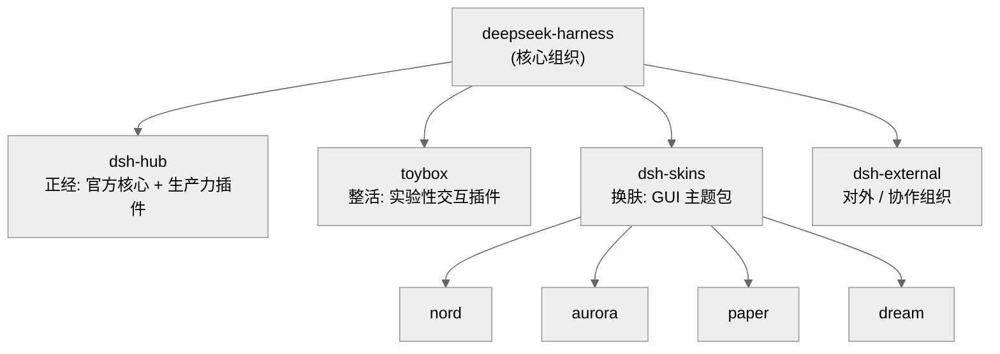
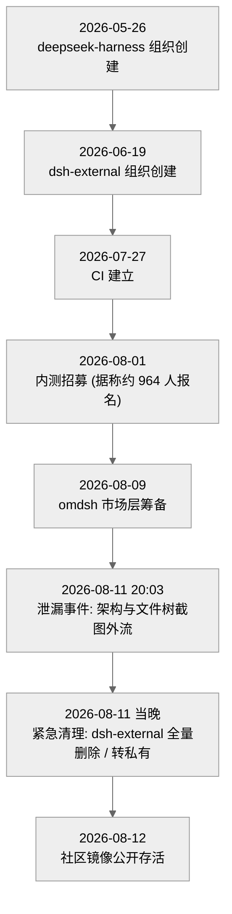
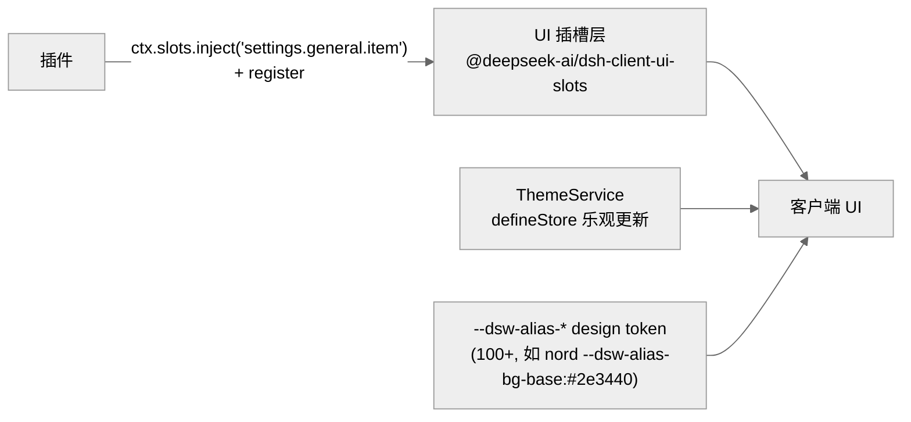

# 附录 · 生态反推与泄漏复盘

> **证据边界声明（先读这一段）**：本附录**不是**基于本研究 vendored 的官方一手源码写成的，而是整理自一份**社区第三方反推报告**——《DeepSeek Harness (DSH) 深度技术架构与生态反推报告 v2.1》（作者 cjh）。那份报告的证据基底是：**泄漏截图**（其 `01-evidence` 目录）、**社区镜像仓库**（`02-repos`：`dsh-vision`/`dsh-skins`/`termrender` 等）、**termrender 集成文档**、以及一张 **url-map 生态追踪表**。
>
> 因此，本附录的内容**默认全部按 `[claimed]`（社区/泄漏口径）对待**——它记录的是"社区依据泄漏证据推断出的样子"，不等于官方事实。只有当某条说法能与本研究 vendored 的官方源码**交叉核实**时，才升级级别，并明确标注：能对上的写「与官方源码一致 `[verified]`」，对不上的写「与官方源码不符 `[存疑]`」，方向对但细节无从坐实的写 `[inferred]`。**凡是日期、人名、招募人数、组织是否被删这类事项，都是该报告依泄漏证据的推断，读者应始终知道它们的来源、不宜当成定论。** 这也是把这些材料单独收进附录、而不掺进正文各章的原因：正文的 `文件:行号` 是对源码的直接验证，两者的证据强度不同，不该混为一谈。

---

## 一、生态三叉戟：社区看到的仓库版图

该报告的图 2 把泄漏与镜像里能观察到的仓库，归纳成一个"三叉戟"结构 `[claimed]`。用大白话说，就是把一堆插件按"给谁用、正不正经"分成了三条线，外加一个对外协作的组织：

- **`dsh-hub`**——正经线：官方核心与生产力插件，是"要拿来干活"的那一批。
- **`toybox`**——整活线：实验性、玩票性质的交互插件，用来试探边界、快速验证点子。
- **`dsh-skins`**——换肤线：GUI（Graphical User Interface，图形用户界面）主题包，报告里点名的有 `nord`/`aurora`/`paper`/`dream` 四套。
- 另有一个组织 **`dsh-external`**，承担对外/协作用途（也正是后文泄漏事件里被紧急清理的那个）。

<div style="background: #ffffff !important; background-color: #ffffff !important; padding: 16px; border-radius: 8px; margin: 16px 0;" bgcolor="#ffffff">



</div>

<p>图注：社区反推的仓库版图（该报告图 2 口径，全部 [claimed]）。三条线的划分标准是"用途与成熟度"，不是官方公布的组织架构；读者宜理解为社区观察到的经验分类，而非权威结论。</p>

## 二、组织生命周期与泄漏复盘时间线

这是本附录里"泄漏料"最集中的一节。下面的时间线综合了该报告图 6 与 url-map 追踪表，**每一条都是 `[claimed]`**——即社区依据仓库创建时间、CI 配置、社交媒体帖子与镜像备份，反推出来的一条事件链。人名、报名人数、组织存亡等细节，请一律当作"泄漏证据下的推断"来读。

<div style="background: #ffffff !important; background-color: #ffffff !important; padding: 16px; border-radius: 8px; margin: 16px 0;" bgcolor="#ffffff">



</div>

<p>图注：组织生命周期与泄漏复盘时间线（该报告图 6 + url-map 口径，全部 [claimed]）。所有日期与数字来自泄漏证据的推断，非官方披露。</p>

把图里的关键节点展开说：

- **2026-05-26** `deepseek-harness` 组织创建；**06-19** 增设 `dsh-external`；**07-27** CI（Continuous Integration，持续集成，指每次改动都自动跑构建与测试的流水线）落地——这三步勾出一个"从建组织到工程化"的节奏。
- **2026-08-01 内测招募** `[claimed]`：据该报告，Tianyi Cui（崔添翼）在 X（原 Twitter，现已更名为 X 的社交平台）发出招募帖，约 **964 人**报名；linuxdo 上也出现了相关泄漏帖。人名与人数均为泄漏口径。
- **2026-08-09** `omdsh`（一个市场/分发层）开始筹备。
- **2026-08-11 20:03 泄漏事件** `[claimed]`：musistudio 在 X 转发了一份不知名来源的截图，内容是 `@deepseek-ai/dsh` 的架构图与文件树。
- **2026-08-11 当晚紧急清理** `[claimed]`：`dsh-external` 组织被全量删除或转为私有，多个仓库随后呈 `404`（HTTP 状态码，表示页面已不存在）。
- **2026-08-12 社区镜像** `[claimed]`：`c0de3`、`zhouwumu2-lab` 等备份镜像公开存活，成为后续社区反推的主要素材来源——本附录能引用的"源级"细节，大多也来自这些镜像。

> 换个角度看，这条时间线之所以能被拼出来，恰恰是因为"删得掉仓库、删不掉镜像与截图"。这也提醒读者：镜像里的东西是某个时间点的快照，未必等于官方当前状态。

## 三、社区插件与模型细节：dsh-vision 的一个有意思的选择

该报告把 `dsh-vision` 插件列在"源"级——因为它能直接读镜像仓库里的 `src/index.ts`。但要强调：**这份"源"来自社区镜像仓库，不是官方一手源码，故仍标 `[claimed]`**。

据镜像里的 `src/index.ts` `[claimed]`：该插件用 `defineTool` 注册了一个 `view_image` 工具——参数 `source` 必填、`question` 可选，带 `timeoutMs`，`isConcurrencySafe` 返回 `true`（即声明"并发安全"），`execute` 最终转交给一个 `visionChat` 函数处理。它还通过 `systemPrompt.section` 注入了一段提示词，section 名为 `tool:dsh-vision`、`order` 为 `116`——这正是本研究正文反复讲的"提示词随插件分段分发、用 order 决定拼接位置"的写法。

真正有意思的一点 `[claimed]`：这个社区插件的**默认 `baseURL` 指向的是智谱**（`https://open.bigmodel.cn/api/paas/v4`），默认 `model` 是 `glm-4.6v-flash`。也就是说，**这个视觉插件走的是智谱 GLM（智谱推出的一系列大模型的统称），而不是 DeepSeek 自家的 API（Application Programming Interface，应用程序编程接口，这里指模型服务对外的调用地址）**。这要读清楚：它反映的是**某个社区插件作者的选择**（视觉能力挑了个现成好用的多模态模型），**不代表官方默认、更不代表 harness 只能配某一家**。恰恰相反，它侧面印证了本研究的一个论断——LLM（Large Language Model，大语言模型）适配器是可插拔的接缝，换个后端只是换个 provider 而已。

## 四、遥测实拍：截图里的一行状态栏

该报告图 5 是一张遥测状态栏的实拍 `[claimed]`，一行信息量不小：

```
1 turns · 3 steps | Tool call 14.5s | Context 1% of 1M | Cache hit 66% | Input 39.2K tok · Output 447 tok
```

同一截图里还能看到：权限为 `Workspace Write`；模型标注为 `DeepSeek-V4-Flash High`；以及一条行为细节——`<think>` 思考块在 `maxTokens >= 2048` 时会被**自动剥离**。

这些指标的**机制**与本研究从源码推出的结论是吻合的：回合/步（turns/steps）的计数对应第 06 章《AgentLoop 与回合流》讲的回合结构；上下文占比与缓存命中对应第 16 章《上下文治理》的治理口径；思考块的处理与流式词汇对应第 10 章《LLM 适配器与流式词汇》。**但必须说清楚：这里的具体数字（14.5s、66%、39.2K tok 等）来自泄漏截图，是某一次真实运行的采样，并非我们能复现的基准。** 机制可印证，数字只作参考。

## 五、双 Surface 客户端：宿主与前端的分离

该报告图 2/图 4 描述了一个"双 Surface"（双前端表面）结构 `[claimed]`：一个是宿主/服务侧，一个是可换肤的客户端 UI（User Interface，用户界面）侧，两者通过插槽（slot）解耦。

<div style="background: #ffffff !important; background-color: #ffffff !important; padding: 16px; border-radius: 8px; margin: 16px 0;" bgcolor="#ffffff">



</div>

<p>图注：双 Surface 的插槽 + design token 换肤路径（该报告图 2/图 4 口径，[claimed]）。插件通过插槽注入 UI 项、主题通过 design token 换肤，彼此零侵入——与第 17 章的 host/client 分离互证。</p>

据报告 `[claimed]`：插件用 `ctx.slots.inject('settings.general.item', …)` 配合 `register` 把自己的设置项挂进 UI；换肤靠一套 `--dsw-alias-*` design token（超过 100 个，例如 `nord` 主题的 `--dsw-alias-bg-base:#2e3440`）；主题切换由 `ThemeService` 与 `defineStore` 做乐观更新（先立刻更新界面、再等后端确认，让切换看起来无延迟）；插槽契约包名为 `@deepseek-ai/dsh-client-ui-slots`。这套"插槽 + token"的思路，和本研究第 17 章《持久化检索与远程接入》里讲的 host/client 分离是互证的——UI 只认插槽和 token，换主题、加设置项都不用改宿主逻辑。

## 六、skills-manager → memory-evolve 的合并

该报告图 4 记录了一次仓库合并 `[claimed]`：旧仓库 `dsh-skills-manager`（对外提供 `/skills-manager` API，状态落在 `state.json`）被并入了 `dsh-memory-evolve`。合并后的形态是：会话页里有一个"记忆 Tab"（Tab 即界面上的标签页），其下再挂一个"技能管理"子 Tab。换句话说，"技能"被收编成了"记忆"的一个子能力。这与本研究第 16 章《上下文治理》讲的记忆/技能治理方向是呼应的——把可演化的知识（记忆）与可复用的能力（技能）放在同一套治理面板下。

## 七、Cordis fork "魔改"的交叉核实（重点）

这是本附录**唯一能大面积升级证据级**的一节，因为它涉及的 Cordis fork（从某个开源项目分叉出来、自行维护的独立版本），本研究恰好 vendored 了官方源码（`cordis` `4.0.0-rc.7`，见 `repo/deepseek-harness/vendor/`）。该报告 §9 称 fork 作者为 "Hieuzest/shigma"，并声称有三处深度 patch。我逐条用源码核实，结论如下——**方向对的说方向对，对不上的如实标注不符，绝不含糊**：

### 7.1 `symbols.caller` 拦截器（调用链溯源）——对上游成立、属版本差异 `[verified]`（更正）

报告称：fork 在 `logger.ts`/`utils.ts` 里劫持了 Proxy（一种能拦截"读属性/调方法"的包装对象）的 `get`/`set`，用 `symbols.caller` 做调用链溯源（把"这条日志/这次调用是谁发起的"一路追踪出来）。

**更正说明**：本条早前也只对着 dsh vendored 的 `cordis 4.0.0-rc.7` 核对——`vendor/cordis/src/utils.ts:116-211` 确有一套"caller-context 的 Proxy"（注释写着 "Wrap services/functions so method calls see the caller's active context"（`utils.ts:116`）、"bind to caller, not origin"（`utils.ts:169`）），但那一版靠的是 `symbols.shadow`（`logger.ts:253` 读 `symbols.shadow`），源码里**没有**字面的 `symbols.caller`，于是当时保守地判为 `[inferred]`（方向对、符号名存疑）。补做 Part V、把上游标准 cordis（`repo/cordis`）也读了之后，结论要更正：

- **上游 cordis 里 `symbols.caller` 是真实存在的**：`packages/core/src/utils.ts:50` 明确定义 `caller: Symbol.for('cordis.caller')`，caller-context 的 Proxy 用它对外暴露调用者（`utils.ts:165`、`:193`）；
- **logger 确实"劫持"了它**：`packages/core/src/logger.ts:228` 读 `(this as any)[symbols.caller]`，紧接着 `:229` 用 `(caller ?? this.ctx).fiber` 把这条日志归因到发起调用那个组件的 fiber——这正是报告说的"用 `symbols.caller` 做调用链溯源"。

所以报告的说法**对上游成立**（符号名与 logger 落点都能一一对上，`[verified]`），只是 **dsh 当前 pin 的 rc.7 尚未用具名的 `symbols.caller`、而用 `symbols.shadow` 达到同一效果**——这和 §7.2 的 `Reflect.apply` 一样，是**版本差异**，不是"报告说错了"。此前的 `[inferred]` 判断据此更正。（补充：论文只在形式层出现 "caller" 一词——指 effect 逆元的提供方，如 Definition 26——**并不涉及**日志归因这类实现细节，故此条纯属实现层、与论文无关。）

### 7.2 `events.ts` 用 `Reflect.apply` 替换 `bind`（降 GC）——对上游成立、属版本差异 `[verified]`（更正）

报告称：fork 把 `events.ts` 里的 `callback.bind(thisArg)` 改成 `Reflect.apply`，以减少闭包分配、降低 GC（Garbage Collection，垃圾回收，指运行时自动回收不再使用的内存）压力。

**更正说明**：本条早前只对着 **dsh vendored 的 `cordis 4.0.0-rc.7`** 核对（`vendor/cordis/src/events.ts:165/174` 仍走 `dispatch()` + `.map(hook => hook.callback.bind(thisArg))`），据此误判为"与源码不符 [存疑]"。补做 Part V、把**上游标准 cordis**（`repo/cordis`，commit `8cc9e33`）也读了之后，结论要更正：

- 上游标准 cordis 的 **5 个现役派发方法确实全部用 `Reflect.apply`**：`parallel`(events.ts:91)、`emit`(:98)、`serial`(:104)、`bail`(:112)、`waterfall`(:122)`[verified]`；
- `.bind(thisArg)` 只残留在**已废弃**的 `dispatch()`（events.ts:83-86，带 `@deprecated`）；
- 而 dsh **vendored 的是更早的 rc.7 快照**，那时派发还统一走 `dispatch()`+`.bind`（`vendor/cordis/src/events.ts:165/174`）。

所以报告的说法**对上游成立**（Reflect.apply 改造确有其事，`[verified]`），只是 **dsh 当前 pin 的 rc.7 早于该改造**——这是**版本差异**，不是"报告说错了"。之前的"不符 [存疑]"判断据此更正。详见 Part V 第 27 章《事件系统》。

### 7.3 canonical wrapped fiber（强制真实 fiber，防 HMR 状态分裂）——大体吻合 `[verified]`

报告称：fork 在 `restart()`/`update()` 里强制使用真实的 `this.ctx.fiber`，避免热重载（Hot Module Replacement，热模块替换，简称 HMR，指程序运行中直接替换某个模块而不整体重启）时出现"状态分裂"。

核实结果：**大体吻合**。`vendor/cordis/src/fiber.ts` 确实有 `restart()`（`fiber.ts:718`）与 `update()`（`fiber.ts:736`）两个方法；且 `vendor/README.md` 的本地修改日志里，**第 6 条**明确记录了"`cordis/src/fiber.ts` lifecycle hardening"（fiber 生命周期硬化，含 `Fiber.update()` 返回其 `internal/update` waterfall 结果、以便 Loader 侧 await 一次重启同时保留同步配置校验），**第 15 条**记录了"惰性 Loader 配置解析"（**移植上游** [cordiverse/cordis#41](https://github.com/cordiverse/cordis/pull/41) **进 vendored 副本**，保留 raw fiber config 待注入激活后再经 `internal/config` 解析；方向是上游→dsh，非把补丁回合并上游（cordis 仓库 git 中无 #41 合并记录，可推断其为尚未并入上游的 PR `[inferred]`）。fiber 硬化与惰性解析在 vendored 源码里确有其事，故这一条可升级为 `[verified]`。

> 补一句交叉引用：这些"本地修改"本研究已在第 21 章《参考底座 Cordis 深度对比》系统归纳过——那一章是从"我们 vendored 的官方源码 vs 上游 Cordis"角度做的对比。本节则是拿同一批源码去核实"社区报告怎么说 fork"，两者互为印证，冲突处以第 21 章的 `文件:行号` 直证为准。

## 八、报告归纳的六大工程模式

该报告 §8 归纳了六个工程模式，与本研究各章多有互证，此处简列（均 `[claimed]`，但机制在正文有源码直证）：

1. **契约优先的 invariant 门禁**——用不变量当准入闸。
2. **Prompt 分段随插件分发**——`systemPrompt.section` + `order`（见本附录 §三的 `dsh-vision` 实例）。
3. **schemastery 运行时安全 schema**（schemastery 是 Cordis 生态里声明并校验配置的库）——`.role('secret')` 藏敏感字段、`.min`/`.max` 约束取值。
4. **真实 Cordis 上下文单测**——测试里直接 `new Context()`，不做假替身。
5. **UI 插槽 + design token 零侵入换肤**——见本附录 §五。
6. **全链路 Telemetry**（Telemetry 即遥测，指程序自动采集并上报自身的运行指标）——见本附录 §四的遥测实拍。

## 九、与本研究各章的对照

最后用一张表收束：哪些是"社区/泄漏料能与正文互证"的，哪些是"本附录独有、正文并未覆盖"的，一目了然。

| 本附录主题 | 证据级 | 与本研究的关系 |
|---|---|---|
| 生态三叉戟（hub/toybox/skins/external） | `[claimed]` | **本附录独有**：正文不涉及组织/仓库版图 |
| 组织生命周期与泄漏时间线 | `[claimed]` | **本附录独有**：纯社区/泄漏料，正文无对应 |
| `dsh-vision` 走智谱 GLM | `[claimed]` | 侧面印证第 10 章"适配器可插拔"，但插件本身正文未收 |
| `systemPrompt.section` + `order` | `[claimed]` | 互证第 08 章《系统提示词与 Schema 组装》 |
| 遥测状态栏实拍 | `[claimed]` | 机制互证第 06/16/10 章；**数字不可复现，为泄漏采样** |
| 双 Surface / 插槽 + design token | `[claimed]` | 互证第 17 章 host/client 分离 |
| skills-manager → memory-evolve 合并 | `[claimed]` | 呼应第 16 章《上下文治理》 |
| §7.1 `symbols.caller` 溯源 | `[verified]`（更正） | **对上游成立**：标准 cordis `utils.ts:50` 定义 `symbols.caller`、`logger.ts:228-229` 读它做日志归因；dsh vendored 的 rc.7 更早、用 `symbols.shadow` 达到同一效果，属版本差异 |
| §7.2 `events.ts` 改 `Reflect.apply` | `[verified]`（更正） | **对上游成立**：标准 cordis 5 个派发方法用 `Reflect.apply`（events.ts:91/98/104/112/122）；dsh vendored 的 rc.7 更早、仍 `.bind`，属版本差异 |
| §7.3 fiber 硬化防 HMR 分裂 | `[verified]` | 与第 21 章 + `vendor/README.md` 第 6/15 条一致 |
| 六大工程模式 | `[claimed]` | 分别互证第 08 等章，机制在正文有源码直证 |

> 一句话总结本附录的用法：**它是一面"社区的镜子"，照出官方源码之外、生态层面正在发生的事**。镜子里的东西（组织、时间线、招募、市场层）多数无法用源码验证，请当作泄漏口径的背景来读；唯有落到 Cordis fork 那三条，我们才有官方源码可对——而对下来的结果，是三条都对上游成立（§7.1 的 `symbols.caller`、§7.2 的 `Reflect.apply` 各是一处"对上游成立、dsh pin 的 rc.7 更早"的**版本差异**，§7.3 则与 vendored 源码直接一致），这恰好说明了守好证据边界、并把"版本差异"和"说错了"分开的必要。
