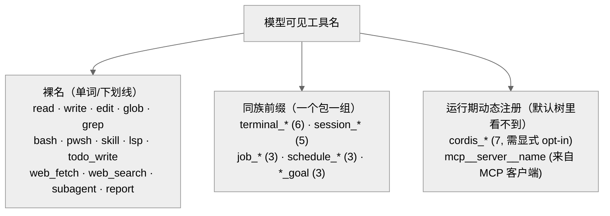

# 配置与工具参考（精编）

DeepSeek Harness 的仓库里有两份「机器生成、逐项核验」的大目录：`docs/config-catalog.md`（约 132KB，全量配置项）和 `docs/tool-catalog.md`（约 81KB，模型可见工具）。它们太大，不适合通读；这篇附录只做一件事——把它们**精编成一张索引**，讲清楚它们怎么组织、一条条目长什么样、怎么和正文对照。真要查某个字段的确切类型和默认值，请回到官方那两份文件，它们才是权威口径。

这两份目录各占一条轴：`config-catalog` 是**部署轴**——插件作者在 `cordis.yml` 里能写进 `config:` 块的东西；`tool-catalog` 是**模型可见轴**——智能体实际被递给的工具 [verified: `docs/config-catalog.md:6`]。同一个包往往在两份目录里各有一条，一条讲「怎么装」，一条讲「装完模型看到什么」。

## 一、config-catalog 的组织方式

整份文件按**可加载的插件包**分组，每个 `##` 标题就是一个 npm 包名（形如 `@deepseek-ai/dsh-*`），全篇共 108 个包 [verified: `docs/config-catalog.md` 全文 `## ` 计数]。一条配置项的固定骨架是四段：

- 包名（`## @deepseek-ai/dsh-xxx`）；
- 可选的 `Requires:` 行，列出该插件 `inject` 的服务键——它的 `cordis.yml` 树必须同时加载这些服务的提供方；
- 一个 `ts config-catalog` 代码块，原样粘贴该插件 `apply` 函数或服务构造器收到的**配置类型声明**（连 JSDoc 注释一起）；
- `Source:` 行，指向 `packages/.../src/index.ts:行` 的源码出处。

这份目录是从源码 AST 生成的，并由 `pnpm run verify-config-catalog` 核验新鲜度：生成器会把运行期 schema 与粘贴的声明交叉比对，凡是 schema 校验过的键都必须能在声明类型上找到，粘贴因此无法藏起一个 loader 会接受的字段 [verified: `docs/config-catalog.md:8`]。反过来，声明里被运行期 schema 故意排除的字段是「运行期专用接缝」，`cordis.yml` 里设不了——它自己的 JSDoc 会说明这点。

怎么和自己的部署对照？用 `dsh --dump-config`：它把 base、surface overlay、再到 `--config` 或个人 overlay 这几层**合成后的配置树**按 YAML 打到 stdout 就退出，不启动进程；配套的 `dsh --dump-default-config` 只合成到 surface overlay。把两者 diff 一下，就能精确看出用户层到底改了什么 [verified: `.agents/notes/archived/feature/2026-07-30-dsh-dump-config.md:14`]。也就是说：**config-catalog 告诉你「有哪些字段可写」，`--dump-config` 告诉你「此刻实际写成了什么」**（Profile 与 Bundle 的分层合成见正文第 04 章）。

下面挑 6 个有代表性的配置项做示例解读，每个都能在 config-catalog.md 里查到：

| 包 | 关键字段（示例） | 读法 | 源引 |
| --- | --- | --- | --- |
| `dsh-acp` | `provider?` / `model?` | 最朴素的一类：只做「选路由、选模型」，给 ACP（Agent Client Protocol）创建的每个智能体用 | `config-catalog.md:14` |
| `dsh-tool-bash` | `enableRunInBackground?`（默认 true） | 单开关型：关掉后 `run_in_background` 参数会从工具 schema 里整个消失 | `config-catalog.md:2339` |
| `dsh-mcp-client` | `transport` / `serverName` | `serverName` 是该服务器工具名的本地命名空间，须匹配 `[A-Za-z0-9_-]{1,32}`；工具名拼成 `mcp__<serverName>__<rawName>` | `config-catalog.md:1209` |
| `dsh-compaction-basic` | `thresholdRatio?`（默认 0.8）/ `retainRatio?`（默认 0.16） | 策略型：到上下文窗口的多大比例开始压缩、压缩后保留多少最近上下文 | `config-catalog.md:470` |
| `dsh-session-persistence-jsonl` | `root`（必填）/ `packChunks?`（默认 true）/ `compression?` | 持久化后端：`root` 无默认（避免随 cwd 漂移），`packChunks` 把连续 delta 事件打包成行、日志约小 60% | `config-catalog.md:1549` |
| `dsh-llm-retry` | `Record<string, never>`（空配置） | 边界型：该策略执行器**没有**可配置项，重试策略由各 provider 自己的 `retryPolicy` 拥有 | `config-catalog.md:1154` |

最后一行值得单独说：看到 `Readonly<Record<string, never>>` 这种空配置，不是漏写，而是明确告诉你「这个插件在 `cordis.yml` 里没有旋钮可拧」。

## 二、tool-catalog 的结构与工具清单概览

`tool-catalog` 收录每个已发布插件贡献给 `ctx.tools` 的**模型可见工具**：`name`、`description`、以及模型通过系统提示词组装收到的 JSON Schema 参数 [verified: `docs/tool-catalog.md:6`]。它开头有一张「Tool Package Map」表，把工具名连到背后的插件包与服务接缝；随后每个 `## 包 / ### 工具名` 给出确切 schema。

与 config-catalog 的纯 AST 扫描不同，这份目录的生成器会**真的启动**每个工具插件、读 `ctx.tools.schemas()`——因为工具 schema 不是静态可知的（枚举在运行期展开、描述是拼接出来的、名字可由配置驱动）[verified: `docs/tool-catalog.md:10`]。它只覆盖以**默认配置**启动的、`packages/*/tool-*` 下的产品工具：全文 25 个工具包、约 52 个工具条目 [verified: `docs/tool-catalog.md` 全文 `## `/`### ` 计数]。

工具名有清晰的命名规律，大致分成三类：

<em>图 1：模型可见工具名的三类命名规律。裸名（此处为示例、非全量）是核心读写与检索工具；同族前缀按能力包成组；<code>cordis_*</code> 与 <code>mcp__*</code> 是运行期才出现的动态工具，静态目录里默认不含。</em>

第三类要特别留意：`cordis_*`（`cordis_define`/`cordis_run`/`cordis_stop` 等 7 个）来自 `dsh-tool-cordis`，它**不在任何已发布的配置树里**，是一处刻意的 opt-in，因为动态包代码能触到真实运行时 [verified: `docs/tool-catalog.md:23`]。而 `mcp__<serverName>__<rawName>` 这一族根本不会出现在静态目录里——它由 `dsh-mcp-client` 在连上外部 MCP（Model Context Protocol，模型上下文协议）服务器后按 `serverName` 动态拼名注册；目录以默认配置启动、并未配置任何 MCP 服务器，所以看不到。想知道某个部署到底暴露了哪些 MCP 工具，还是得回到该部署实际连接的服务器。

同一个名字在不同包里也可能重名：`bash` 既是一次性的 `dsh-tool-bash`，也是带 PTY（伪终端）会话状态的 `dsh-tool-bash-persistent`——由部署组合选一个装 [verified: `docs/tool-catalog.md:178,504`]。

## 三、与正文哪些章互证

- **config-catalog ↔ 第 04 章「Profile 与 Bundle 组装」**：目录列出「有哪些字段可写」，第 04 章讲这些 `config:` 块如何经 bundle 补丁层、用户层逐层合成成一棵可启动的树，`--dump-config` 正是这条合成路径的免启动快照。
- **tool-catalog ↔ 第 08 章「系统提示词与 Schema 组装」**：目录里的 `name`/`description`/JSON Schema，正是第 08 章讲的、模型在系统提示词组装阶段收到的东西。
- **tool-catalog ↔ 第 09 章「工具注册表与执行管线」**：Tool Package Map 里每个工具的 `Requires`（如 `ctx.tools`、`ctx.shell`、`ctx.jobs`）与「Writes / affects」列，对应第 09 章讲的注册表接缝与 `tool/call → tool/result` 的执行管线。

一句话收尾：这篇是**索引与精编**，用来快速建立「配置怎么分组、工具怎么命名、和哪章对得上」的地图；任何字段的确切默认值、类型与出处，一律以官方 `docs/config-catalog.md`、`docs/tool-catalog.md` 为准。
