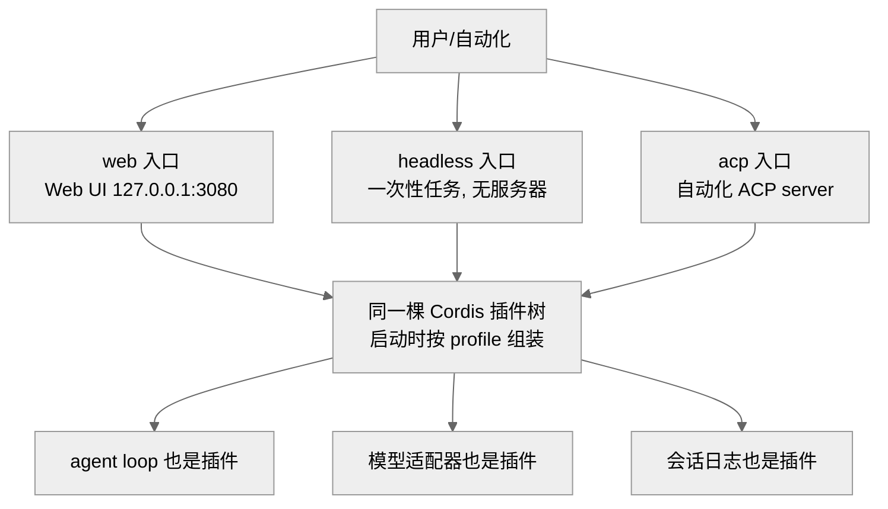
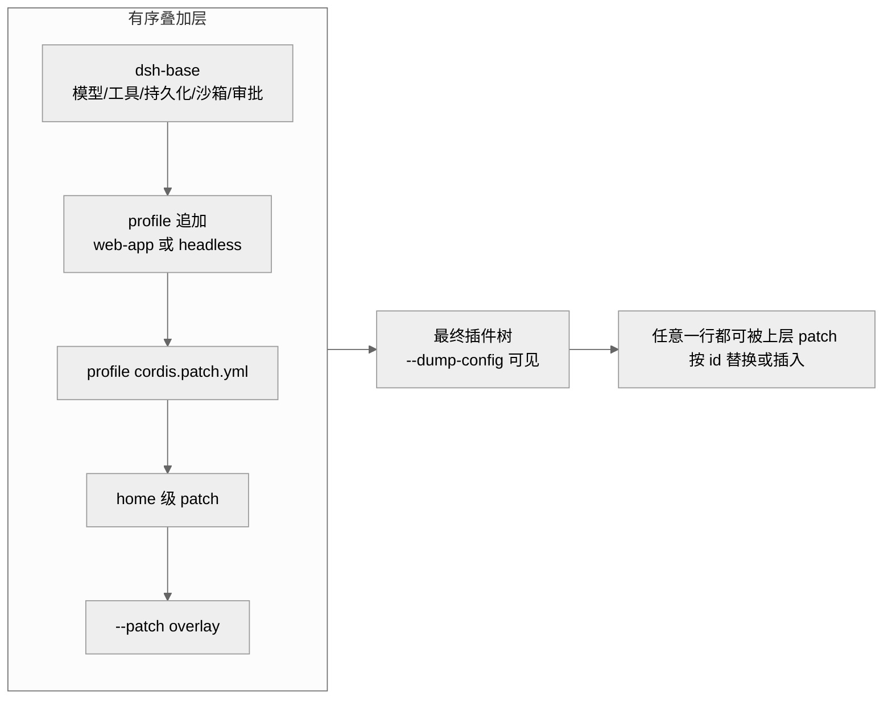
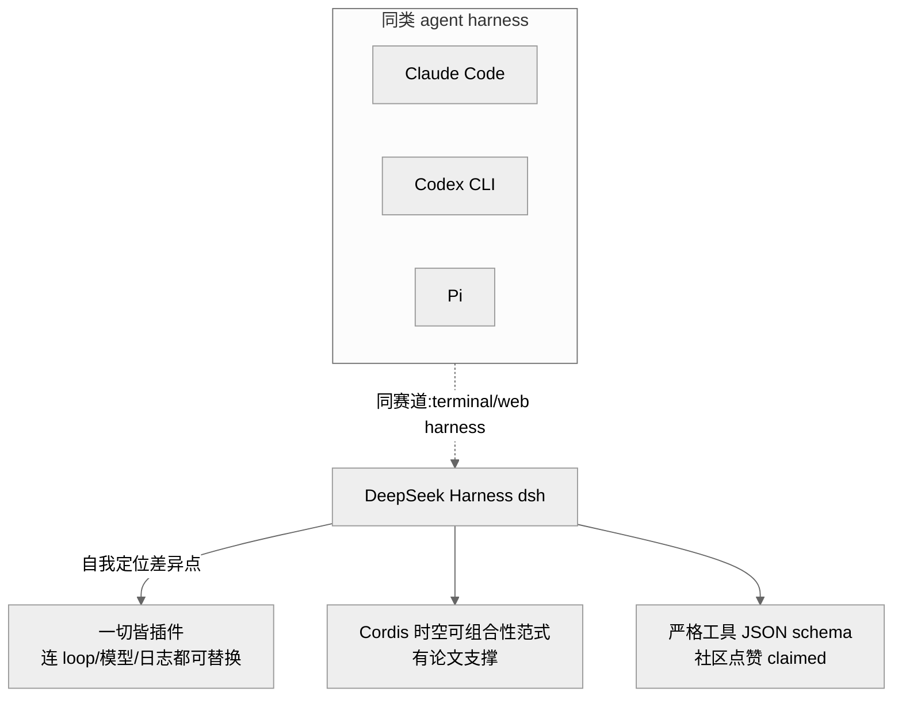
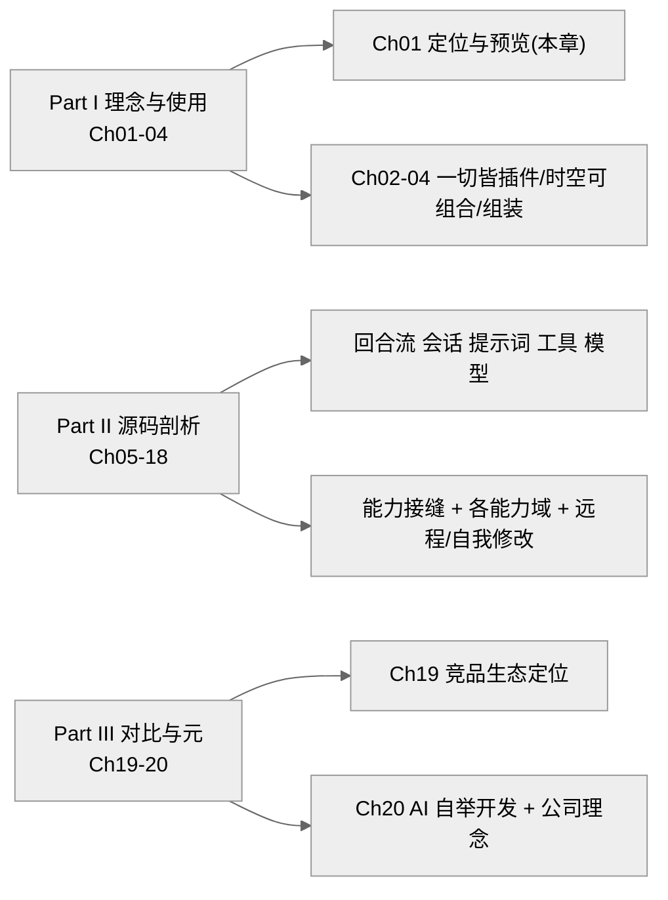

# 第 01 章 · 项目定位与开发者预览

> 本章回答三个问题：DeepSeek Harness（`dsh`）到底是什么、为什么以"开发者预览"而非正式版的姿态开源、它的运行形态与总体分层长什么样。读完你应能判断"这个项目值不值得继续读下去、该从哪一章切入"。这是全系列的入口章，末尾附带 20 章的结构导览。
>
> 证据等级约定：`[verified]` 源码可证（给 `文件:行号` 或 docs 路径）· `[inferred]` 合理推断 · `[claimed]` 仅社区/二手口径。

## 一、本质是什么：一个"一切皆插件"的 agent harness

`dsh` 是 DeepSeek AI 开发的开源 **agent harness**——一套把大模型驱动为可用智能体的运行框架，而非模型本身。README 第一句即给出自我定位：一个"everything is a plugin"的架构，由 [Cordis](https://github.com/cordiverse/cordis) 驱动，其范式见论文《A Programming Paradigm for Spatiotemporal Composability》`[verified]`（README.md:5-7；README.zh.md:5-7）。

架构文档把这句口号落到实处：模型适配器、工具注册表、会话日志、乃至 agent loop 本身都是 Cordis 插件，因此每一部分都能从配置替换；"没有需要打补丁的特权内核，你通过在其它插件旁边挂载一个插件来扩展 dsh"`[verified]`（docs/architecture.md:11-13）。这条命题是全系列的主线，后续各章都在验证它到底成立到什么程度。

版本身份很明确：根 `package.json` 标 `"@deepseek-ai/dsh-root"`、`"version": "0.1.0-rc.5"`、`"license": "MIT"`、`"type": "module"`，引擎要求 `node ^22.19.0 || >=24.0.0` `[verified]`（package.json:2-10）。仓库最后一次提交在 2026-08-13，累计 12,293 次 commit`[verified]`（本地 `git log`/`git rev-list --count`）。

运行形态有三种入口，都从同一棵插件树组装而来：

- **web**：`npx @deepseek-ai/dsh web` 启动 Web UI，默认 `http://127.0.0.1:3080``[verified]`（README.md:19-23）。
- **headless**：`pnpm dsh --profile headless "task"` 一次性跑完一个任务、无服务器`[verified]`（AGENTS.md:77；docs/architecture.md:25）。
- **acp**：`packages/acp` 提供"仅供自动化"的 Agent Client Protocol server，通过 `pnpm run demo:acp` 演示`[verified]`（AGENTS.md:41,79）。

> 图注：三种运行形态不是三套代码，而是同一棵插件树在不同 profile 下的不同组装结果。这证明了"运行形态"本身也落在"一切皆插件"的框架内。

## 二、核心问题与痛点：harness 要解决什么

在"模型即灵魂"的信念下，一个官方 harness 要回答的痛点是：模型每几个月就换一代，工具、沙箱、UI、协议也在快速演化——**如何让框架的任何一层都能被替换、而不必推倒重来**。官方口径把这一点表述为"模型是 agent 的灵魂，一切皆可替换插件"`[claimed]`（deepseek.com/harness，见《全网调研》A 节）。

`dsh` 给出的答案是把"可替换性"做成一等公民：不是提供若干扩展钩子，而是**连内核都不存在**——loop、模型、日志全是可从 `cordis.yml` 替换的行。第 03 章会展开这套可替换性背后的时空可组合性范式，本章只需记住定位：它是一个**以可组合性为卖点**的 harness，而非一个绑死某模型的固定客户端。

## 三、解决思路：profile / bundle / patch 三层组装 + 预览姿态

### 组装分层

一个运行中的 `dsh` 是"启动时由有序层组合出的插件树"`[verified]`（docs/architecture.md:17-28）：

- **profile**（如 `web`/`headless`）：存于 Harness home 的具名组合，列出它叠加的 bundles，并持有用户自己的 `cordis.patch.yml`。
- **bundle**：Cordis 配置行 + 它们挂载的代码的分发格式；`dsh-base` 是每个 profile 的第一层（模型适配器、工具、持久化、沙箱与审批策略等），`dsh-web-app` 叠加浏览器应用，`dsh-headless` 叠加一次性 runner`[verified]`（docs/architecture.md:25；packages/bundle/ 下 base/headless/web-app）。
- 各层以 `package.json` 的 `dsh` 字段声明自己：`dsh.profile` 列 bundles，`dsh.bundle` 指向 patch 文件`[verified]`（packages/bundle/web-app/package.json、headless/package.json 的 `dsh.bundle.patch`）。
- 叠加顺序：profile 列出的各 bundle → profile 的 `cordis.patch.yml` → home 级 → `--patch` overlay；patch 按 id 替换整行配置或插入新行`[verified]`（docs/architecture.md:27-28）。`dsh --profile web --dump-config` 能打印你机器真实启动的那棵树`[verified]`（docs/architecture.md:31-35）。

> 图注：分层从 `dsh-base` 起，逐层可被上面的层覆盖。这解释了为什么"运行形态"和"用户定制"能共用一套组装机制，而不需要各自的分支代码。

### 为何以"开发者预览"姿态开源

README 明确标注"developer preview，快速迭代，将出现破坏兼容性的变更"`[verified]`（README.md:9-11；README.zh.md:9-11）。AGENTS.md 顶部有一节 **"Pre-release stance: foundation over blast radius"**：在没有外部消费者时，宁可要正确的地基也不要兼容垫片，可自由改名/重新分包并同步更新所有引用；后端直接拒绝旧的磁盘格式，`dsh-session` 把 `SESSION_FORMAT_VERSION` 保持在 `0`、不作兼容承诺`[verified]`（AGENTS.md:5-7）。

> **ratify-note · 为何采用"开发者预览 + foundation over blast radius"而非直接发稳定版**
> - 候选解释：A 快地基未稳，主动声明预览以争取自由重构空间；B 只是营销话术、其实已稳定；C（基线）什么都不标、按常规半成品开源。
> - 各自利弊：A 优——把"破坏性变更"写进契约，换来重命名/重分包/拒绝旧格式的自由，AGENTS.md 甚至要求"first tagged release 时删除该节"，显示这是临时制度；缺——外部用户须承担频繁 breaking。B 优——省心；缺——与"backends reject old formats""SESSION_FORMAT_VERSION=0 无兼容承诺"的源码事实矛盾，不成立。C 优——无额外声明成本；缺——不能解释为何专门立一节纪律并挂到门禁语气上。
> - 选定 & 理由：选 A。源码把预览姿态制度化到 `AGENTS.md` 与磁盘格式版本策略里，而非仅写在 README，说明它是工程决策而非措辞。
> - 证据等级：`[verified]`（AGENTS.md:5-7 明文；package.json:5 版本 `0.1.0-rc.5`）+ 动机部分 `[inferred]`。
> - 残余风险 / pre-mortem：若半年后此判断被证伪，最可能因团队其实早已冻结格式、"预览"只是留出退路的保守措辞——则 A 被弱化为"制度化的保守"。

## 四、实现细节关键点

- **规模**：`packages/` 下按功能分成约 47 个组`[verified]`（packages/README.md 组表，47 行），实际 `packages/*/*/package.json` 展开为约 219 个 `@deepseek-ai/dsh-*` workspace 包`[verified]`（本地 `find` 计数）。（《总纲》曾记为"56 个包"，此处以直接计数为准，差异或因统计口径/时点不同 `[inferred]`。）
- **命名/模块规范**：每个 npm 包都是 `@deepseek-ai/dsh-<name>`；全仓 ESM（`"type": "module"`），跨包用包名引用、本地相对导入用 `.ts`；`@deepseek-ai/cordis` 是每个 harness 包的 peerDependency`[verified]`（AGENTS.md:100-101）。
- **底座**：Cordis 以 **vendored 源码**方式进入（`vendor/` 目录，pin 上游 SHA），rescope 为 `@deepseek-ai/cordis`、`private: true``[verified]`（AGENTS.md:12,100,147-149）。
- **核心分层**：架构文档把贡献 Cordis 树的核心包列成表——`core/session`(`ctx.sessions`)、`core/system-prompt`、`core/tools`、`core/agent`、`core/agent-loop`、`llm/llm`(`ctx.llm`) 等`[verified]`（docs/architecture.md:43-52）。这张表是 Part II 各章的路线图。
- **不变量**："model-visible ⟺ logged"——任何进入模型请求的东西都必须能从会话日志重建，且有运行时不变量断言`[verified]`（docs/architecture.md:94-96；AGENTS.md:107）。这是第 07 章的主题，也是理解整个数据流的钥匙。

## 五、易错点与注意事项

- **别把预览当稳定**：会出现破坏性变更，后端拒绝旧磁盘格式，`SESSION_FORMAT_VERSION=0` 无兼容承诺`[verified]`（AGENTS.md:5-7）——升级后旧会话可能读不回。
- **源码启动的 ESM 约束**：`dsh` CLI 源码启动走 `node --import tsx/esm`，其触达的模块必须保持 ESM（不能是 CJS-only），因为跨引擎区间拿不到 Node 原生 TS 模式`[verified]`（AGENTS.md:101，`scripts.dsh` in package.json:136）。
- **profile 不等于命令**：`web`/`headless` 是 profile 模板，`acp` 是"仅自动化"的服务器；三者共用组装机制，配错 profile 会得到与预期不同的插件树，用 `--dump-config` 自检`[verified]`（docs/architecture.md:25,31）。
- **贡献路径受限**：官方当前**不接受外部 PR**（见下节），提 issue/插件是唯一有效参与方式`[verified]`（CONTRIBUTING.md:9-18）。

## 六、竞品与横向对比

社区普遍把 `dsh` 与 Claude Code、Codex CLI、Pi、Cascade 归为同类——terminal/web agent harness`[claimed]`（《全网调研》E.1）。其被点名的差异点是"工具调用的严格 JSON schema"被赞、以及 Cordis 论文带来的"研究味"`[claimed]`（《全网调研》E.2-3）。

> **ratify-note · 一方（自家）harness 是否天然优于第三方**
> - 候选解释：A 官方 harness + 自家模型协同更强；B 一方 harness 未必胜第三方，其真正价值在"可替换性/生态"而非模型绑定。
> - 各自利弊：A 优——协同调优、首发适配；缺——易滑向绑死单模型，与 dsh 自身"一切皆插件、模型是可替换插件"的定位相悖。B 优——与源码事实一致（模型适配器只是 `ctx.llm` 上的一个 provider，docs/architecture.md:51,110）；缺——"生态价值"需 Part II（尤其第 11 章能力接缝）用源码兑现，本章还不能直证。
> - 选定 & 理由：倾向 B。README 与架构文档反复强调可替换性而非模型绑定，HN 讨论亦有"一方 harness 未必胜"的声音（rco8786）。
> - 证据等级：定位部分 `[verified]`（docs/architecture.md:11,110）；竞品优劣部分 `[claimed]`（《全网调研》D 节）。
> - 残余风险 / pre-mortem：若被证伪，最可能因实测中 DeepSeek 模型与 dsh 的协同确实显著优于第三方组合，使"可替换性"退为次要卖点。

> 图注：dsh 与三个竞品同赛道，其被反复强调的区别在"可替换性 + 范式"而非模型本身。实线为源码可证的定位，虚线/K3 为社区口径。

## 七、仍存在的问题与局限

- **不收外部 PR**：CONTRIBUTING 明说"早期阶段、暂不接受外部 PR"，转而鼓励做插件、加 `dsh-plugin` topic、写教程`[verified]`（CONTRIBUTING.md:9-18）。

> **ratify-note · 为何"暂不收外部 PR"却大力推插件生态**
> - 候选解释：A 主内核仍高频重构（见预览姿态），外部 PR 会与"自由重命名/重分包"冲突，故先关 PR、把外部能量导向解耦的插件层；B 纯粹人手不足；C（基线）照常收 PR。
> - 各自利弊：A 优——与 foundation-over-blast-radius 自洽：内核可任意改而不伤外部插件（插件只依赖 Service Definition，packages/README.md:67）；缺——牺牲近期外部代码贡献。B 优——CONTRIBUTING 自陈"very small team"，部分成立；缺——不能单独解释"却明确推插件生态"。C 缺——与预览期频繁 breaking 直接冲突。
> - 选定 & 理由：A 为主、B 为辅。CONTRIBUTING 同时"关 PR"与"开生态"，且强调"官方仓库的包并不比社区包更重要"，与插件只依赖接缝的架构一致。
> - 证据等级：`[verified]`（CONTRIBUTING.md:9-19；packages/README.md:67）+ 动机 `[inferred]`。
> - 残余风险 / pre-mortem：若被证伪，最可能因首个 tagged release 后迅速放开 PR，说明关闭只是临时人力/节奏问题而非架构策略。

- **预览期不稳定**：破坏性变更、格式不兼容（上文已列）。
- **体积与选型质疑**：社区提到下载体积大、TypeScript 选型、npm 供应链等担忧`[claimed]`（《全网调研》D 节，留待第 19 章讨论）。

## 八、本系列结构导览

本解析分三部分、20 章，均遵循七维框架 + 承重判断走 ratify-note + 每章 ≥4 图的纪律（见《总纲》）：

> 图注：本章位于 Part I 的入口。想快速判断"值不值得用"，走 Ch01 → Ch19 → Ch20；想懂架构，走 Ch02 → Ch05 → Ch11。

## 小结与衔接

`dsh` 是 DeepSeek 官方的、以"一切皆插件"为核心信念、由 vendored Cordis 驱动、MIT 许可、当前 `0.1.0-rc.5` 的开发者预览版 agent harness；三种运行形态（web/headless/acp）共用一套 profile→bundle→patch 的组装分层；它主动以"foundation over blast radius"的姿态换取重构自由，并暂以插件生态而非外部 PR 承接社区能量。这些都是**定位层**的判断——它凭什么真能"一切皆替换"，属于范式与机制问题，正是第 02 章《一切皆插件》与第 03 章《时空可组合性》要用源码回答的。

## 源码索引

- README.md:5-11,19-23（定位、预览、web 运行）；README.zh.md:5-11（中文对应）
- AGENTS.md:5-7（foundation over blast radius / 格式版本策略）、41/77/79（acp/headless/demo）、100-101（命名/ESM/peerDep）、107（model-visible ⟺ logged）、147-149（vendoring）
- docs/architecture.md:11-13（无特权内核）、17-35（profile/bundle/patch 分层与 dump-config）、43-52（核心包与 ctx key）、94-96（会话日志不变量）、110（模型作为 ctx.llm provider）
- package.json:2-10（name/version 0.1.0-rc.5/license MIT/type module/engines）、136（`dsh` 源码启动）
- CONTRIBUTING.md:9-19（暂不收外部 PR、推插件生态）
- LICENSE:1-3（MIT，Copyright 2026 DeepSeek）
- packages/README.md:11-61（约 47 个功能组表）、67（插件只依赖 Service Definition）
- 本地 `git`/`find`：12,293 commits、末次提交 2026-08-13、约 219 个 dsh-* workspace 包
- 外部：《总纲-DeepSeek-Harness技术主线分析.md》、《全网调研-社区认知地图.md》A/D/E 节（`[claimed]`）
