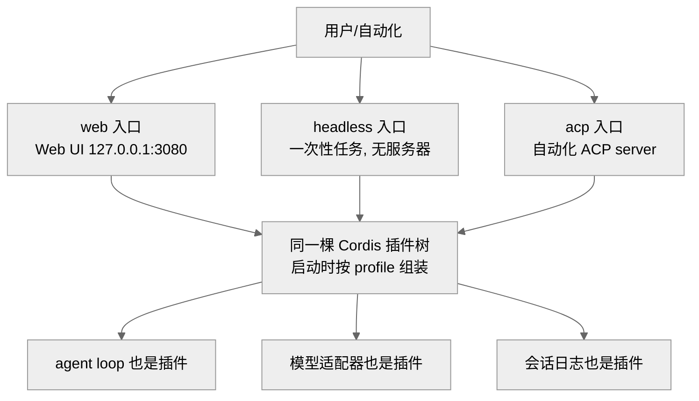
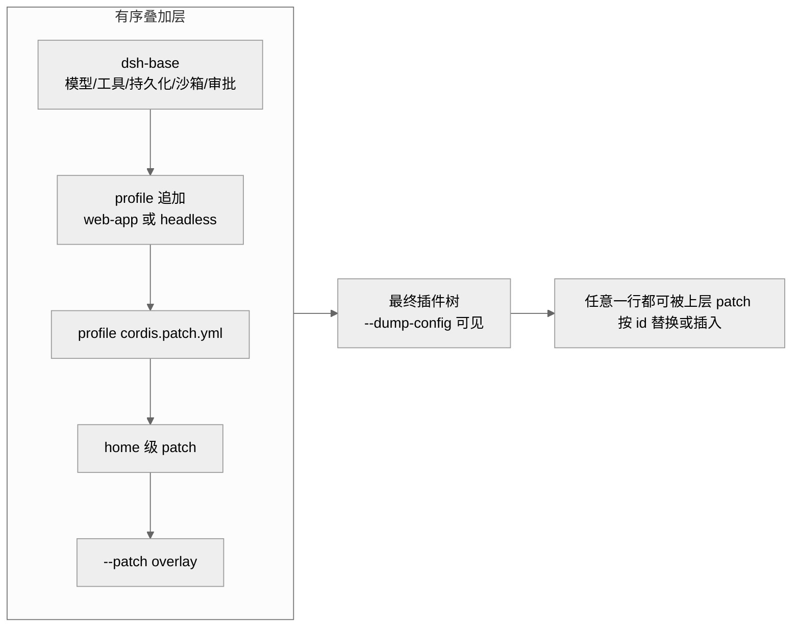
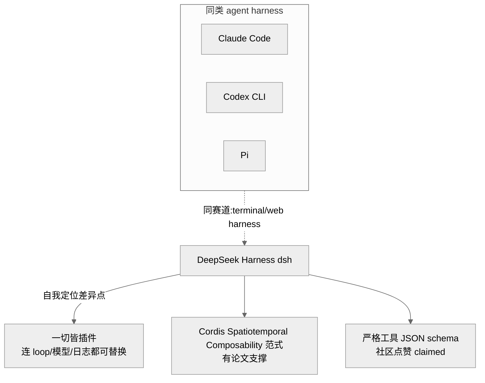
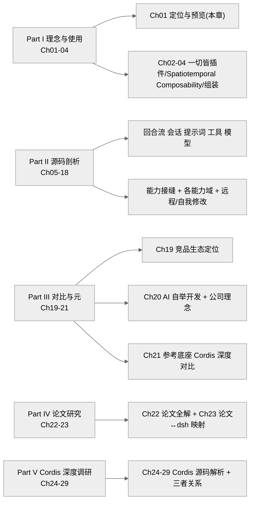

# 第 01 章 · 项目定位与开发者预览

> 本章回答三个问题：DeepSeek Harness（`dsh`）到底是什么、为什么以"开发者预览"而非正式版的姿态开源、它的运行形态与总体分层长什么样。读完你应能判断"这个项目值不值得继续读下去、该从哪一章切入"。这是全系列的入口章，末尾附带全 5 部分、29 章的结构导览。
>
> 证据等级约定：`[verified]` 源码可证（给 `文件:行号` 或 docs 路径）· `[inferred]` 合理推断 · `[claimed]` 仅社区/二手口径。

## 一、本质是什么：一个"一切皆插件"的 agent harness

先厘清一个容易混淆的词：**agent harness**（智能体运行框架）不是模型本身，而是"托着模型干活"的那套外壳。可以打个比方——模型像一台发动机，harness 则是把发动机装进车里的底盘、传动、仪表和方向盘：负责接收任务、调用工具、记录过程、管理会话。`dsh` 就是 DeepSeek AI 开源的这样一套框架。README 第一句即给出自我定位：一个"everything is a plugin"（一切皆插件）的架构，由 [Cordis](https://github.com/cordiverse/cordis)（一套插件化的应用框架）驱动，其范式见论文《A Programming Paradigm for Spatiotemporal Composability》`[verified]`（README.md:5-7；README.zh.md:5-7）。

架构文档把这句口号落到实处：模型适配器、工具注册表、会话日志、乃至 agent loop（智能体的"思考—调用工具—再思考"主循环）本身，都是 Cordis 插件，因此每一部分都能从配置里替换掉。用文档原话说，"没有需要打补丁的特权内核，你通过在其它插件旁边挂载一个插件来扩展 dsh"`[verified]`（docs/architecture.md:11-13）。换个说法：多数软件都有一个"动不得的核心"，改它就得打补丁；而 dsh 声称连核心都不特殊，扩展的方式就是"再挂一个插件上去"。这条命题是全系列的主线，后续各章都在验证它到底成立到什么程度。

版本身份很明确：根 `package.json` 标 `"@deepseek-ai/dsh-root"`、`"version": "0.1.0-rc.5"`、`"license": "MIT"`、`"type": "module"`，引擎要求 `node ^22.19.0 || >=24.0.0` `[verified]`（package.json:2-10）。这里的 MIT 是一种极为宽松的开源许可证（许可名，保留原文）——它允许任何人自由使用、修改、再分发这份代码，几乎唯一的义务是保留版权与许可声明。`0.1.0-rc.5` 这个号本身就透露了心态——主版本还是 0，尚未到 1.0 的稳定线。仓库最后一次提交在 2026-08-13，累计 12,293 次 commit`[verified]`（本地 `git log`/`git rev-list --count`）。本研究以此 rc.5 快照为一手基线；截至 2026-08-17，官方已在四天内连发 rc.6、rc.7（版本号现为 `0.1.0-rc.7`、累计 12,404 commit、包数仍为 219），这段增量的逐条核实见附录《[版本更新追踪 · rc.5→rc.7](../Appendix/更新追踪.md)》`[verified]`。

运行形态有三种入口，但它们不是三套独立程序，而是从同一棵插件树组装而来：

- **web**：`npx @deepseek-ai/dsh web` 启动 Web UI（Web User Interface，网页图形界面），默认在浏览器里打开 `http://127.0.0.1:3080``[verified]`（README.md:19-23）。适合人坐在屏幕前交互式地用。
- **headless**：`pnpm dsh --profile headless "task"` 一次性跑完一个任务就退出、不起服务器`[verified]`（AGENTS.md:77；docs/architecture.md:25）。headless（无头）指没有界面，适合脚本或 CI（continuous integration，持续集成：代码一提交就自动跑构建与测试的流水线）里"丢一个任务、拿一个结果"。
- **acp**：`packages/acp` 提供"仅供自动化"的 Agent Client Protocol（智能体客户端协议，简称 ACP）server（一种给程序对接、而非给人用的协议接口），通过 `pnpm run demo:acp` 演示`[verified]`（AGENTS.md:41,79）。

> 图注：三种运行形态不是三套代码，而是同一棵插件树在不同 profile 下的不同组装结果。这证明了"运行形态"本身也落在"一切皆插件"的框架内。

## 二、核心问题与痛点：harness 要解决什么

想象一个现实场景：你去年基于某模型搭了一套 agent，今年模型换代、工具升级、UI 改版、协议演进，结果发现动一处就得改一片。这正是官方 harness 要回答的痛点——模型每几个月就换一代，工具、沙箱、UI、协议也在快速演化，**如何让框架的任何一层都能被替换、而不必推倒重来**。官方口径把这一点表述为"模型是 agent 的灵魂，一切皆可替换插件"`[claimed]`（deepseek.com/harness，见《全网调研》A 节）。

`dsh` 给出的答案是把"可替换性"做成一等公民（即最优先保证的属性）：不是像多数框架那样"预留几个扩展钩子"，而是**连内核都不存在**——loop、模型、日志全都是可以从 `cordis.yml` 配置里替换的一行。第 03 章会展开这套可替换性背后的 Spatiotemporal Composability 范式，本章只需记住定位：它是一个**以可组合性为卖点**的 harness，而不是一个绑死某个模型的固定客户端。

## 三、解决思路：profile / bundle / patch 三层组装 + 预览姿态

### 组装分层

这三个词可以先用一个比喻串起来：装电脑时，profile 像"整机配置单"，bundle 像"一个个配件套装"，patch 像"临时替换某个零件的便签"。一个运行中的 `dsh` 就是"启动时由有序层组合出的插件树"`[verified]`（docs/architecture.md:17-28）：

- **profile**（如 `web`/`headless`，即一份具名的启动配置）：存于 Harness home 的具名组合，列出它要叠加哪些 bundles，并持有用户自己的 `cordis.patch.yml`（用户的私人改动清单）。
- **bundle**：一组 Cordis 配置行 + 它们挂载的代码，打包成的分发单位；`dsh-base` 是每个 profile 的第一层地基（模型适配器、工具、持久化、沙箱与审批策略等），`dsh-web-app` 在上面叠加浏览器应用，`dsh-headless` 则叠加一次性 runner`[verified]`（docs/architecture.md:25；packages/bundle/ 下 base/headless/web-app）。
- 各层通过 `package.json` 里的 `dsh` 字段声明自己：`dsh.profile` 列出要装的 bundles，`dsh.bundle` 指向自己的 patch 文件`[verified]`（packages/bundle/web-app/package.json、headless/package.json 的 `dsh.bundle.patch`）。
- 叠加顺序（越靠后越有权覆盖前面）：profile 列出的各 bundle → profile 的 `cordis.patch.yml` → home 级 → `--patch` overlay；patch 的作用是按 id 替换掉某一整行配置、或插入新行`[verified]`（docs/architecture.md:27-28）。想看你这台机器真实启动的那棵树长什么样，跑 `dsh --profile web --dump-config` 就能把它打印出来`[verified]`（docs/architecture.md:31-35）。

> 图注：分层从 `dsh-base` 起，逐层可被上面的层覆盖。这解释了为什么"运行形态"和"用户定制"能共用一套组装机制，而不需要各自的分支代码。

### 为何以"开发者预览"姿态开源

README 明确标注"developer preview（开发者预览），快速迭代，将出现破坏兼容性的变更"`[verified]`（README.md:9-11；README.zh.md:9-11）。AGENTS.md 顶部有一节 **"Pre-release stance: foundation over blast radius"**（预发布姿态：地基优先于波及面）：在还没有外部使用者时，宁可先把地基打对，也不为了兼容而加"垫片"（compatibility shim，指为迁就旧接口而临时加的适配层），因此可以自由改名、重新分包，只要同步更新所有引用即可。落到实处：后端直接拒绝读取旧的磁盘格式，`dsh-session` 把 `SESSION_FORMAT_VERSION` 保持在 `0`、不作任何兼容承诺`[verified]`（AGENTS.md:5-7）。换句话说，团队宁愿现在多改，也不愿背上历史包袱。值得注意的是，这套预览姿态被制度化进了 `AGENTS.md` 与磁盘格式版本策略、而非仅写在 README——AGENTS.md 甚至要求"first tagged release 时删除该节"，可见它是一项换取重构自由的临时工程决策，而非一句营销措辞`[verified]`（AGENTS.md:5-7；package.json:5 版本 `0.1.0-rc.5`）。

## 四、实现细节关键点

- **规模**：`packages/` 下按功能分成约 47 个组`[verified]`（packages/README.md 组表，47 行），实际把 `packages/*/*/package.json` 展开来数，是约 219 个 `@deepseek-ai/dsh-*` workspace 包`[verified]`（本地 `find` 计数）。（此处以直接计数 219 为准。）这个包数也从侧面印证了"一切皆插件"不是口号——功能被切得很细，才好一块块替换。
- **命名/模块规范**：每个 npm（Node.js 的包管理器与公共包仓库）包都叫 `@deepseek-ai/dsh-<name>`；全仓采用 ESM（ECMAScript Modules，ECMAScript 模块）——即 `"type": "module"`、用 `import/export` 而非老式 `require` 的现代模块规范，跨包时用包名引用、本地文件相对导入用 `.ts` 后缀；`@deepseek-ai/cordis` 是每个 harness 包的 peerDependency（同伴依赖，指"由使用方统一提供、大家共享同一份"的依赖）`[verified]`（AGENTS.md:100-101）。
- **底座**：Cordis 不是当普通依赖装进来，而是以 **vendored 源码**方式进入——即把上游代码直接拷进 `vendor/` 目录并 pin 住上游某个 SHA（锁定到某次具体提交），再 rescope 改名为 `@deepseek-ai/cordis`、标 `private: true``[verified]`（AGENTS.md:12,100,147-149）。这样做的好处是底座的每一行都在自己掌控之内，改起来不受上游发版节奏牵制。
- **核心分层**：架构文档把向 Cordis 树贡献能力的核心包列成一张表——`core/session`(`ctx.sessions`)、`core/system-prompt`、`core/tools`、`core/agent`、`core/agent-loop`、`llm/llm`(`ctx.llm`) 等`[verified]`（docs/architecture.md:43-52）。括号里的 `ctx.xxx` 是这些能力在运行时的挂载点（后文会展开）。这张表就是 Part II 各章的路线图。
- **不变量**："model-visible ⟺ logged"（凡是模型看得见的，就一定被记录下来）——任何进入模型请求的东西都必须能从会话日志里原样重建，而且有运行时断言在守着这条规则`[verified]`（docs/architecture.md:94-96；AGENTS.md:107）。为什么这条重要？因为它保证了"模型当时到底看到了什么"永远可复盘、可回放。这是第 07 章的主题，也是理解整个数据流的钥匙。

## 五、易错点与注意事项

- **别把预览当稳定**：会出现破坏性变更，后端拒绝旧磁盘格式，`SESSION_FORMAT_VERSION=0` 无兼容承诺`[verified]`（AGENTS.md:5-7）——很实际的后果是：升级一次，旧会话可能就读不回来了，别把它当长期存档。
- **源码启动的 ESM 约束**：从源码启动 `dsh` CLI（Command-Line Interface，命令行界面）时走的是 `node --import tsx/esm`，因此它触达的所有模块都必须是 ESM（不能是只支持老式 `require` 的 CJS（CommonJS，Node.js 早期的模块规范）包），因为在它要兼容的跨 Node 引擎区间里，拿不到 Node 原生的 TypeScript 运行模式`[verified]`（AGENTS.md:101，`scripts.dsh` in package.json:136）。踩坑信号：引入一个只支持 CJS 的依赖后源码启动报错，多半是这里。
- **profile 不等于命令**：`web`/`headless` 是 profile 模板，`acp` 是"仅自动化"的服务器；三者共用同一套组装机制，一旦选错 profile，你拿到的就是一棵与预期不同的插件树——先用 `--dump-config` 打印出来自检`[verified]`（docs/architecture.md:25,31）。
- **贡献路径受限**：官方当前**不接受外部 PR**（Pull Request，拉取请求：把自己的代码改动提交给项目、请求合并进主仓库的标准方式）（见下节），提 issue、做插件才是目前有效的参与方式`[verified]`（CONTRIBUTING.md:9-18）。

## 六、竞品与横向对比

社区普遍把 `dsh` 与 Claude Code、Codex CLI、Pi、Cascade 归为同类——都是跑在终端/网页里的 agent harness`[claimed]`（《全网调研》E.1）。被社区点名夸的差异点有两处：工具调用采用"严格的 JSON（JavaScript Object Notation，一种通用的数据交换格式）schema"（即对工具的输入输出格式有明确、强校验的定义），以及 Cordis 论文带来的一股"研究味"`[claimed]`（《全网调研》E.2-3）。这里有个容易先入为主的判断——"官方 harness 配自家模型必然更强"；但源码事实指向另一面：模型适配器在 dsh 里也只是 `ctx.llm` 上的一个 provider `[verified]`（docs/architecture.md:11,110），因此它的真正差异点更可能在"可替换性/生态"而非与自家模型的绑定；HN（Hacker News，一个技术圈常用的新闻讨论社区）讨论里亦有"一方 harness 未必胜第三方"的声音 `[claimed]`（《全网调研》D 节）。

> 图注：dsh 与三个竞品同赛道，其被反复强调的区别在"可替换性 + 范式"而非模型本身。实线为源码可证的定位，虚线/K3 为社区口径。

## 七、仍存在的问题与局限

- **不收外部 PR**：CONTRIBUTING 明说"早期阶段、暂不接受外部 PR"，转而鼓励大家做插件、给仓库打上 `dsh-plugin` topic 标签、写教程`[verified]`（CONTRIBUTING.md:9-18）。这看似矛盾（拒代码却推生态），其实自洽：内核仍在预览期高频重构，外部 PR 会与"自由重命名/重分包"冲突，于是先关 PR、把外部能量导向只依赖 Service Definition、因而与内核解耦的插件层——CONTRIBUTING 也强调"官方仓库的包并不比社区包更重要"`[verified]`（CONTRIBUTING.md:9-19；packages/README.md:67）。
- **预览期不稳定**：破坏性变更、格式不兼容（上文已列）。
- **体积与选型质疑**：社区提到下载体积偏大、为何选 TypeScript、以及 npm 供应链安全等担忧`[claimed]`（《全网调研》D 节，留待第 19 章讨论）。

## 八、本系列结构导览

本解析分五部分、29 章，均遵循七维框架 + 承重判断 + 每章 ≥4 图的纪律（见《总纲》）：

> 图注：本章位于 Part I 的入口。想快速判断"值不值得用"，走 Ch01 → Ch19 → Ch20；想懂架构，走 Ch02 → Ch05 → Ch11。

## 小结与衔接

一句话收束本章：`dsh` 是 DeepSeek 官方的、以"一切皆插件"为核心信念、由 vendored Cordis 驱动、MIT 许可、当前 `0.1.0-rc.5` 的开发者预览版 agent harness；三种运行形态（web/headless/acp）共用同一套 profile→bundle→patch 的组装分层；它主动以"foundation over blast radius"的姿态换取重构自由，并暂时用插件生态、而非外部 PR 来承接社区能量。要注意的是，这些都还只是**定位层**的判断——它凭什么真能"一切皆替换"，属于范式与机制问题，正是第 02 章《一切皆插件》与第 03 章《Spatiotemporal Composability》要用源码来回答的。

## 源码索引

- README.md:5-11,19-23（定位、预览、web 运行）；README.zh.md:5-11（中文对应）
- AGENTS.md:5-7（foundation over blast radius / 格式版本策略）、41/77/79（acp/headless/demo）、100-101（命名/ESM/peerDep）、107（model-visible ⟺ logged）、147-149（vendoring）
- docs/architecture.md:11-13（无特权内核）、17-35（profile/bundle/patch 分层与 dump-config）、43-52（核心包与 ctx key）、94-96（会话日志不变量）、110（模型作为 ctx.llm provider）
- package.json:2-10（name/version 0.1.0-rc.5/license MIT/type module/engines）、136（`dsh` 源码启动）
- CONTRIBUTING.md:9-19（暂不收外部 PR、推插件生态）
- LICENSE:1-3（MIT，Copyright 2026 DeepSeek）
- packages/README.md:11-61（约 47 个功能组表）、67（插件只依赖 Service Definition）
- 本地 `git`/`find`：12,293 commits、末次提交 2026-08-13、约 219 个 dsh-* workspace 包（rc.7 增量：12,404 commits、2026-08-17、包数仍 219，见 [Appendix/更新追踪](../Appendix/更新追踪.md)）
- 外部：《总纲-DeepSeek-Harness技术主线分析.md》、《全网调研-社区认知地图.md》A/D/E 节（`[claimed]`）
