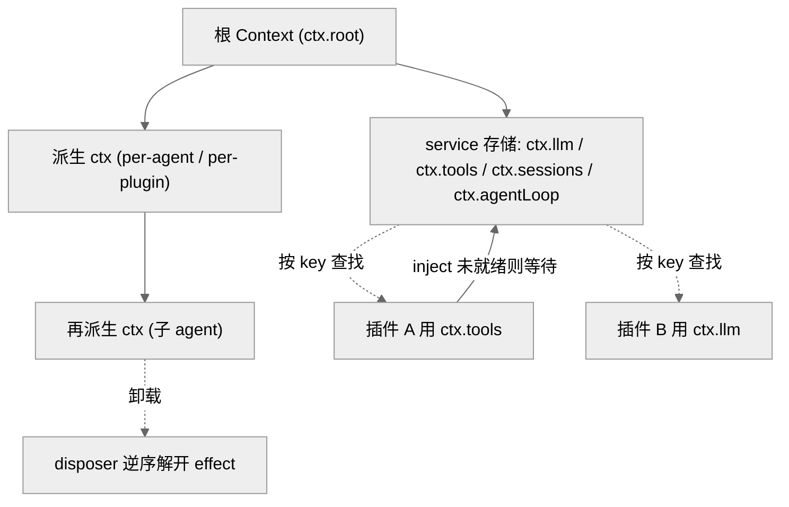
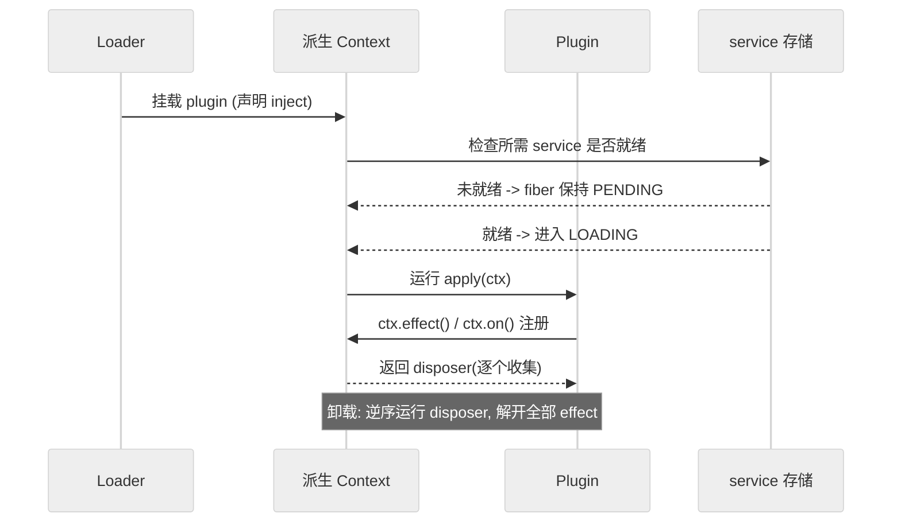
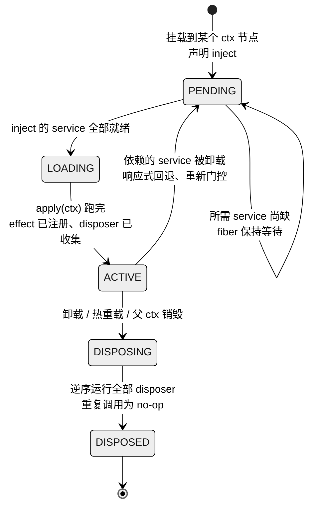
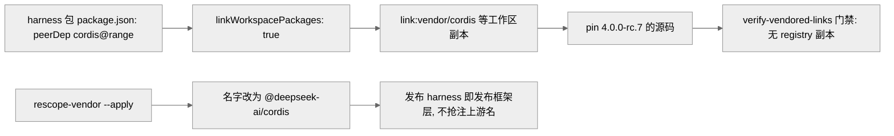

# 第 02 章 · 一切皆插件与 Cordis 底座

> 本章回答一个问题：dsh 说的"everything is a plugin"到底凭什么成立？答案落在它的底座 Cordis 上——一套把"上下文即服务仓库""注册即可回滚副作用"制度化的 TypeScript 元框架。读完本章，你应能说清 `ctx` 上下文树、service/plugin/effect 三件套、"Registrations are effects"这条铁律的运行机制，以及 dsh 为何把 Cordis 以 vendored 源码而非 npm 依赖的方式收进仓库。

## 一、本质是什么

dsh 的架构自白只有一句话，写在根 `AGENTS.md` 开头和 `docs/architecture.md` 里：**"everything is a plugin"**。这句话的具体含义是：连模型适配器（`ctx.llm`）、工具注册表（`ctx.tools`）、会话日志（`ctx.sessions`）、乃至 agent loop 本身（`ctx.agentLoop`）都是 Cordis 插件，因而**全部可从配置替换** `[verified]`（`docs/architecture.md:11`）。

紧接着的一句更关键：**"There is no privileged core to patch"**——没有一个需要打补丁的特权内核；你扩展 dsh 的方式，是在其他插件旁边挂载一个新插件，而"注册就是会在插件卸载时自动解开的副作用" `[verified]`（`docs/architecture.md:13`）。

所以 dsh 的"本质"不在任何一个具体子系统，而在它的**装配模型**：一个运行中的 `dsh` 就是一棵在启动时由有序层组装出来的插件树 `[verified]`（`docs/architecture.md:17`）。这棵树的语法、生命周期、依赖解析全部由底座 Cordis 提供。要理解 dsh，先得理解 Cordis。

## 二、核心问题与痛点

一个 agent harness 要长期演化，会撞上三类结构性难题：

1. **可替换性**：模型、工具、沙箱、会话存储都应能整体替换，而不是靠 if/else 硬编码分支。若替换点分散在核心代码里，"换一个模型 provider"就会牵动全局。
2. **生命周期与副作用回滚**：agent 运行时要动态挂载/卸载能力（子 agent、临时工具、热重载的插件）。一个插件在运行期注册了监听器、定时器、服务、文件监视，卸载时若不能干净地全部撤销，就会泄漏、串扰、状态残留。
3. **依赖顺序**：插件 A 需要 `ctx.tools` 就绪才能注册工具。手工编排 boot 顺序既脆弱又不可组合。

Cordis 对这三点分别给出了"上下文即服务仓库""注册即可回滚 effect""按服务依赖声明 inject"的答案。这也是《社区认知地图》里被反复标记为"本项目最有研究味的部分"的那套时空可组合性范式（详细形式化留到第 03 章）`[claimed]`（`全网调研-社区认知地图.md` B 节）。

## 三、解决思路与方案

### Cordis 的五个核心概念

`docs/cordis-primer.md` 把插件作者需要知道的 Cordis 压缩成五点 `[verified]`（`docs/cordis-primer.md:9-14`）：

- **插件是一个实现了 Service 的对象**：既可以是带可选 `inject` / `apply(ctx)` 字段的函数，也可以是一个 `Service` 子类，其生命周期由 Cordis 挂载进当前上下文。
- **上下文是服务的仓库**：一个服务占据稳定的 `ctx.<key>`（如 `ctx.tools`、`ctx.llm`、`ctx.sessions`），其他插件通过 key 找服务，而非 import 某个具体实现。
- **通过 `inject` 声明服务依赖**：命名了所需服务的插件会**等到那些服务存在**才激活——加载顺序由服务需求表达，而非手工 boot 编排。
- **用类型化事件通信**：服务通过 TypeScript 声明合并声明事件名，再按 `emit` / `waterfall` / `parallel` / `serial` 四种派发模式分发。
- **注册即可回滚的 effect**：prompt 段、工具 schema、适配器、provider、监听器都经 `ctx.effect()` 或 `ctx.on()` 安装，使得重载与拆卸能可预测地解开它们。

这五点合起来，正是"一切皆插件"能够成立的机械基础：**没有特权内核**，是因为每个能力都以同一种方式（占一个 `ctx` key、经 effect 注册、按 inject 排序）挂上同一棵树。

图注：上下文是一棵可派生的树；服务按稳定 key 存放，插件按 key（而非 import 具体类）查找并用 inject 声明依赖；任一子上下文卸载时其 effect 被逆序解开。此图证明"可替换性"来自"按 key 解耦 + 树形作用域"。

### 为何 vendored 而非 npm 依赖

dsh 没有把 Cordis 当成普通 npm 依赖装进 `node_modules`，而是把 Cordis core 及其基础库（cosmokit、schemastery）以**源码**形式复制进 `vendor/`，共 9 个目录 `[verified]`（`vendor/README.md:13-23`，目录：cordis / cosmokit / schemastery / loader / include / group / timer / hmr / logger-console），pin 在 `cordis@4.0.0-rc.7`（commit `56b3d4f…`）`[verified]`（`vendor/README.md:17`）。

> **ratify-note · 为何 vendored 而非 npm 依赖**
> - 候选解释：A 直接 npm 依赖 `cordis@4.0.0-rc.6/7`（沿用现状/最省事的基线）；B 源码 vendored 进仓库、pin commit、维护本地修改日志。
> - 各自利弊：A 优——零维护、自动获得上游更新、体积小；缺——core 当时是 release candidate，dsh 的 agent loop 正确性保证依赖 fiber 生命周期、effect 拆卸、waterfall 派发这些**框架内部行为**，一次 RC 版本跳变就可能在无本地修复路径的情况下打破它们 `[verified]`（`.agents/notes/…/2026-06-11-vendor-cordis-as-source.md:9,19`）。B 优——完全拥有框架层：可审计、可打补丁、被 pin 住；上游 RC 动不了它，框架 bug 可就地在树内修（该日志现已积累 18 条本地修改，其中第 6 条"fiber 生命周期加固"就地闭合了三个可重入拆卸缺口）`[verified]`（`vendor/README.md:30-50`，尤其条目 6）；缺——上游同步是手工的，需按 manifest 流程重放本地修改，维护成本上移。
> - 选定 & 理由：选 B。第一性判断——当被依赖物尚在 RC、且你依赖它的**内部不变量**（而非稳定公共 API）时，"拥有"比"依赖"更能守住正确性边界；ADR 明确把 A 列为 rejected `[verified]`（同上 :17-20）。同时它只 vendored"内部行为要紧的框架层"，真正的第三方依赖（js-yaml、chokidar、@standard-schema/spec 等）仍留在 npm，边界克制 `[verified]`（`vendor/README.md:25`、ADR :20）。
> - 证据等级：`[verified]`（ADR 决策与 alternatives + vendor manifest 均源码可证）。
> - 残余风险 / pre-mortem：若半年后此判断被证伪，最可能因上游 Cordis 迭代过快、18 条本地修改与上游持续 diff 冲突，使"手工同步"成本超过"拥有"收益——届时应把已被上游采纳的修改（如条目 15 已回合并的 PR#41）逐条退役、缩小 diff 面。

### rescope 到 @deepseek-ai/cordis

vendored 之外还有一步：所有 vendored 包被**重命名进 `@deepseek-ai` 作用域**（`cordis` → `@deepseek-ai/cordis`，`@cordisjs/plugin-<x>` → `@deepseek-ai/cordis-plugin-<x>`）`[verified]`（`vendor/README.md:5`、本地修改条目 17 `:49`）。原因有二 `[verified]`（`vendor/README.md:5`）：其一，每个 harness 包把 `cordis` 声明为 peerDependency，所以**发布 harness 就会一并发布这一框架层**；其二，若用上游原名发布，等于在 registry 上抢注（squat）上游包名。目录名与版本号则**刻意保持不变**，使 manifest 仍读作一份上游快照，便于比对同步。

## 四、实现细节关键点

### effect 与 disposer 的确切契约

`ctx.effect(execute, label?)` 是整套"可回滚"的原语。看 vendored 源码里它的签名与文档 `[verified]`（`vendor/cordis/src/fiber.ts:415-418`）：

- 同步 effect 返回 `Disposable<Promise<void>>`，异步 effect 返回 `AsyncDisposable<Promise<void>>`——**注册即得到一个 disposer**。
- `execute` 立即运行；它产生的 disposer 被收集，并在"返回的 disposer 被调用"或"fiber 卸载"两者中较早者发生时**逆序（reverse order）运行** `[verified]`（`fiber.ts:405-407`）。
- disposer 调用两次是 no-op；若 fiber 已卸载再创建 effect，抛 `CordisError('INACTIVE_EFFECT')`；`execute` 返回非法形状抛 `TypeError` `[verified]`（`fiber.ts:407-409,420-422`）。

这正是根 `AGENTS.md` 里那条铁律的落点——**"Registrations are effects: 每一处贡献都经 `ctx.effect()` / `ctx.on()`，registry 的 `register()` 返回 disposer"** `[verified]`（`AGENTS.md` Conventions 节）。"逆序解开"与"两次调用幂等"两条，是插件热卸载不泄漏、不串扰的直接保证。

图注：插件加载先按 inject 门控（未就绪则 fiber 停在 PENDING），激活后每次注册都返回并收集一个 disposer，卸载时逆序解开。此图证明"依赖顺序由声明表达""副作用可完全回滚"两点由同一套 fiber 机制承载。

### Service 子类与 Context 树

`Service` 是一个抽象类，子类在构造器里 `super(ctx, name)`，name 缺省取静态 `provide` 字段 `[verified]`（`vendor/cordis/src/service.ts:11,42-43`）。一个 service 实例挂载后就占据它的 `ctx.<key>`，成为其他插件按 key 可寻的能力。`docs/architecture.md` 的"Core packages"表把这层映射列得很清楚：`core/session` 拥有 `ctx.sessions`、`core/tools` 拥有 `ctx.tools`、`core/agent-loop` 拥有 `ctx.agentLoop` 等 `[verified]`（`docs/architecture.md:43-51`）。

Context 本身是可派生的：per-agent、per-plugin 的子上下文构成一棵树，子上下文卸载即触发其名下 effect 的逆序解开。这就是"没有特权内核"的运行时形态——任何能力都活在某个 `ctx` 节点上，替换一个能力等于在配置里替换挂载它的那一行。

把"注册即 effect、卸载即回滚"沿时间轴摊开，就是每个 fiber（一个 `ctx` 节点上的插件实例）都在跑同一套状态机：

图注：同一个 fiber 的生命周期状态机。与前两图（树形结构、加载时序）不同，本图强调状态迁移本身——尤其是 ACTIVE 在所依赖 service 消失时会"响应式回退"到 PENDING 重新门控，以及卸载路径必经 DISPOSING 逆序解开全部 disposer 才落到 DISPOSED。此图证明"注册即 effect、卸载即回滚"是一套可重入、幂等的受控状态迁移，而非一次性动作。

### 四种派发模式

事件是扩展点，其派发模式是公共契约的一部分 `[verified]`（`docs/cordis-primer.md:19-26`）：

| 模式 | 是否 await | 顺序 | 有返回值 |
|---|---|---|---|
| `emit` | 否 | 注册序观察 | 无 |
| `waterfall` | 否 | 注册序观察 | 有 |
| `parallel` | 是 | 并行观察 | 无 |
| `serial` | 是 | 注册序观察 | 有 |

其中 `waterfall` 是"环绕中间件"：监听器收到 `(...args, next)`，调用 `next()` 委托给下一个服务，不调用则短路 `[verified]`（`docs/cordis-primer.md:29-35`）。这条语义被提升为一条独立铁律（"Waterfall listeners MUST call next()"），并直接支撑了第 06 章 agent loop 里 `agent/request`、`tools/*` 那些拦截点的行为。

### vendored 如何被解析

`pnpm-workspace.yaml` 里 `linkWorkspacePackages: true`，并把 `@deepseek-ai/cosmokit`、`@deepseek-ai/schemastery` 等显式 `link:vendor/<dir>` `[verified]`（`pnpm-workspace.yaml:25,28-29`）。这样，harness 包里保留的上游 semver range 会解析到这些被 pin 的工作区副本——**源码执行与构建产物执行跑的是同一份 vendored Cordis 代**。`hygiene` 门禁 `verify-vendored-links` 断言每个 vendored 名字都解析到 `pnpm-lock.yaml` 里的 `link:`、且旁边没有 registry 副本 `[verified]`（`vendor/README.md:5`）。

图注：保留的 semver range 经 workspace linking 落到被 pin 的 vendored 源码，再经 rescope 改名并由 hygiene 门禁守住"只此一份"。此图证明"拥有框架层"是靠 linking + rescope + 门禁三者共同锁定的，而非仅靠复制文件。

## 五、易错点与注意事项

- **服务代理是拓扑敏感的**。`ctx.<name>` 属性代理只应用于**已声明的 inject**；读可选服务要用 `ctx.get(name)`（读全局服务存储）。混用会踩到 topology-sensitive 的坑 `[verified]`（`packages/AGENTS.md` 及其引用的 postmortem 0001）。
- **函数插件与 service 类不可混形**。service 包默认导出 service 类；函数插件命名导出 `name`/`inject`/`Config`/`apply` 且**不得有默认导出**——混用会让 Loader 丢弃函数插件的命名空间（有专门 postmortem 0001 记录）`[verified]`（`packages/AGENTS.md`）。
- **每个注册都要有 disposer**。若拆卸顺序要紧，把相关工作放进同一个 effect，让 disposal 按预期顺序解开 `[verified]`（`docs/cordis-primer.md:44`）。
- **vendored 源码不可随意改**。任何对 `vendor/*/src/` 的改动都必须在 `vendor/README.md` 的"Local modifications"里穷尽登记，pre-commit guard（`check-vendor-manifest.sh`）会拒绝未同步 manifest 的改动 `[verified]`（`vendor/CLAUDE.md`、ADR :15）。`tsconfig.json` 是唯一例外（为适配 monorepo 构建而重生成）。
- **lint/strictness 门禁豁免 vendored**。vendored 包保留上游代码风格，其 tsconfig 本地放宽了较新的编译器标志 `[verified]`（ADR :27）。

## 六、竞品/横向对比

同类 harness（Claude Code / Codex CLI / Pi 等）多把"可扩展性"实现为**扩展点回调 / 钩子（hooks）+ 配置**，扩展被宿主内核调用；而 dsh 把宿主本身也化成插件，扩展与内核在同一棵 Cordis 树上平权。

> **ratify-note · "一切皆插件"相对"内核+扩展点"孰优**
> - 候选解释：A 传统"特权内核 + 扩展点/hook"（多数 harness 现状，也是 dsh 若不用 Cordis 的默认基线）；B dsh 的"无特权内核、连 loop 都是可替换插件"。
> - 各自利弊：A 优——心智简单、内核可做强不变量、扩展面收敛、上手快；缺——内核成为不可替换的中心，"换模型接缝/换会话存储/换 loop"要动内核或穿 hook 参数。B 优——一次 provider 替换即可改变整个产品（如把 fs/subprocess provider 指向远程沙箱，Bash/PTY/LSP 一起迁移，无需 fork）`[verified]`（`docs/architecture.md:100-102`），扩展与内核同构、可热卸载回滚；缺——DI/跨插件依赖的实际收益社区存疑（HN 有"跨插件 DI 收益存疑"的声音），"一切皆插件"抬高了作者的心智门槛（要懂 inject 门控、effect 拆卸、waterfall 语义）`[claimed]`（`全网调研-社区认知地图.md` D 节）。
> - 选定 & 理由：dsh 选 B，第一性动机可回溯到其"模型是灵魂、一切皆可替换"的产品命题——若 loop 本身不可替换，"可替换性"就有一个不可动的中心，命题即破。源码侧的"能力接缝三角色（Definition/Provider/Consumer）让一次 provider 替换改变整个产品"是 B 相对 A 的可验证差异点 `[verified]`（`docs/architecture.md:98-102`）。
> - 证据等级：机制层 `[verified]`（architecture.md）；"孰优"的价值判断 `[inferred]`——源码只能证明 dsh 用 B 实现了什么，证明不了 B 在一切场景下优于 A。
> - 残余风险 / pre-mortem：若被证伪，最可能因"无特权内核"的自由度在实践中主要被少数官方 bundle 用到，第三方极少真的替换 loop，则 B 的多数收益未被兑现，A 的简单性反而更划算。

## 七、仍存在的问题与局限

- **上游同步是手工的、且 diff 面在增长**。18 条本地修改要在每次 sync 时逐条重放或退役 `[verified]`（`vendor/README.md:52-60`、条目 1-18）。这是"拥有框架层"的直接代价，也是本章第一条 ratify-note 的核心残余风险。
- **pin 在 RC**。`cordis@4.0.0-rc.7` 仍是 release candidate `[verified]`（`vendor/README.md:17`）；正式版的 API/行为变化届时需要一次有成本的迁移。
- **心智门槛与"体积/供应链"质疑**。社区对 TS 选型、下载/构建体积、npm 供应链有质疑，记为已知局限，留待第 19 章展开 `[claimed]`（`全网调研-社区认知地图.md` D 节）。
- **发布即发布框架层**。rescope 让 harness 发布连带发布 `@deepseek-ai/cordis*`，好处是消费者拿到一致的框架层，代价是这批"改了名的上游包"要由 DeepSeek 一直维护对齐 `[verified]`（`vendor/README.md:5`）。

## 小结与衔接

本章确立了 dsh 的地基：**Cordis 提供"上下文即服务仓库 + 注册即可回滚 effect + 按 inject 声明依赖"三件套，使"一切皆插件、无特权内核"从口号变成可运行的机械事实**；dsh 又以 vendored + pin + rescope 的方式完全拥有这一层，用 hygiene 门禁把"只此一份"锁死。理解了 `ctx` 树、effect/disposer 契约、四种派发模式，就握住了后续所有章节的公共语汇。

下一章（第 03 章）深入 Cordis 背后的"时空可组合性"范式与那篇形式化论文——为何 effect 是"时间可组合"（卸载能完全回滚副作用）、coeffect 是"空间可组合"（响应式声明依赖），把本章的机械事实提升到范式层面。第 04 章则接着讲这棵插件树在启动时如何由 profile / bundle / `cordis.patch.yml` 有序组装出来。

## 源码索引

- `docs/architecture.md:11-17`（everything is a plugin / no privileged core / 插件树）、`:43-51`（Core packages 与 ctx key）、`:98-102`（能力接缝三角色）
- `docs/cordis-primer.md:9-14`（五个核心概念）、`:19-26`（四种派发模式）、`:29-35`（waterfall 语义）、`:44`（每个注册要有 disposer）
- `vendor/README.md:5`（rescope 理由 + verify-vendored-links）、`:13-23`（manifest，cordis 4.0.0-rc.7）、`:25`（第三方留 npm）、`:30-50`（18 条本地修改，条目 6 fiber 加固、条目 17 rescope）、`:52-60`（sync 流程）
- `.agents/notes/implemented/process/2026-06-11-vendor-cordis-as-source.md:9,17-20,27`（vendored 决策、alternatives、豁免）
- `vendor/cordis/src/fiber.ts:405-422`（effect 契约与 disposer 语义）、`vendor/cordis/src/service.ts:11,42-43`（Service 抽象类）
- `pnpm-workspace.yaml:25,28-29`（linkWorkspacePackages + link:vendor）
- `AGENTS.md` Conventions 节（Registrations are effects / cordis peerDependency）、`packages/AGENTS.md`（ctx.get vs ctx.<name>、插件导出形态）、`vendor/CLAUDE.md`（vendored 源码修改纪律）
- `全网调研-社区认知地图.md` B/D 节（Cordis 血缘与争议，`[claimed]`）
