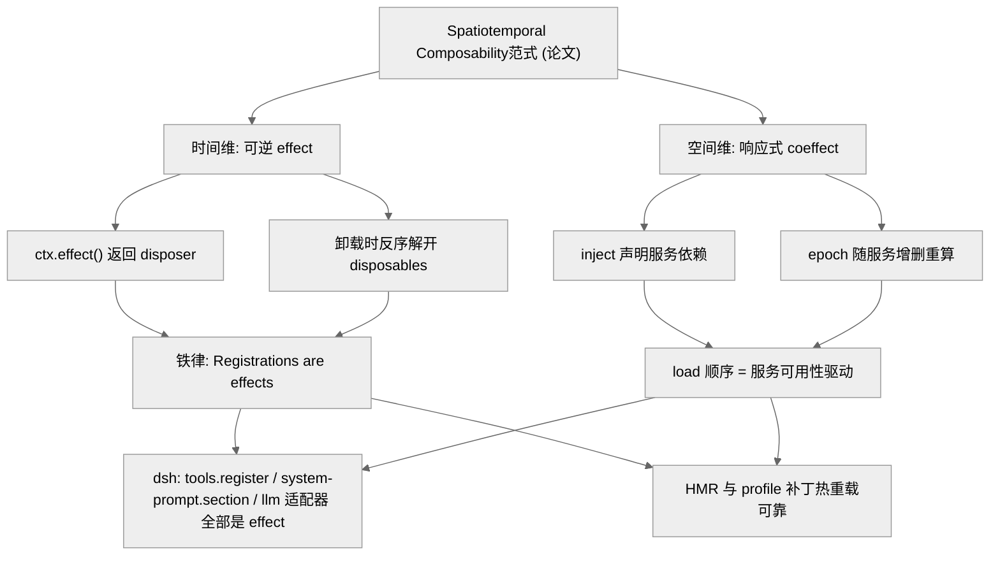
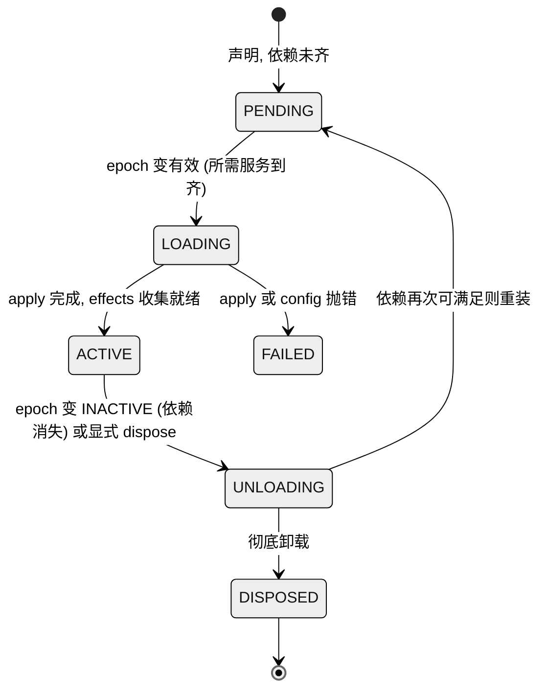

# 第 03 章 · Spatiotemporal Composability

> 本章讲一件事：dsh「一切皆插件」的可替换性，凭什么是可靠的，而不是脆弱的。答案落在它的底座 Cordis 上——一套被形式化为「Spatiotemporal Composability」的范式：**时间维**保证组件卸载时副作用能完全回滚（可逆 effect），**空间维**让组件间依赖以响应式方式声明（响应式 coeffect）。读完本章，你能回答：dsh 里的 `ctx.effect()` / disposer / waterfall / epoch 分别对应范式的哪一半，以及 HMR（Hot Module Replacement，热模块替换，俗称热重载：不重启进程就把运行中的模块换成新版本）与卸载回滚在一个 agent harness 里到底意味着什么。
>
> 证据纪律：dsh 源码可证的机制标 `[verified]`（给 `文件:行号`）；论文范式的内部论断与 Koishi 血缘属**外部一手/二手**，标 `[claimed]`/`[inferred]`，措辞从严。

## 一、本质是什么

先说 Cordis 是什么：它是一套「插件运行时」——一个负责装载插件、管理插件依赖、并在插件卸载时收拾残局的底层框架（类似 Node 世界里的一套依赖注入 + 生命周期内核）。dsh 整个产品就跑在它上面。

dsh 的 README 第一段就把底座和它的理论出处摆在明面：项目「powered by Cordis」，而 Cordis 的设计「described in *A Programming Paradigm for Spatiotemporal Composability*」`[verified]`（README.md:7 直接给出论文链接 `cordiverse/paper`）。这不是营销辞令——它是理解整份代码库的钥匙。

值得先点明一件事：这篇论文并非无关第三方之作，而是**北大 × DeepSeek-AI 的联合论文**——PDF（Portable Document Format，便携文档格式）标题页署名 Yifan Shi（北大/DeepSeek）、Wei Zhang（北大）、Tianyi Cui（DeepSeek），而 **Tianyi Cui 正是 dsh 的头号提交者** `[verified]`（论文标题页；git shortlog 显示其提交约 5235 次、居首）。换句话说，写这套框架论文的人，也在写这个 harness。论文的完整精读见《[Part IV · Spatiotemporal Composability论文全解](../Part%20IV%20Foundational%20Paper/22-A-Programming-Paradigm-for-Spatiotemporal-Composability.md)》，论文范式↔dsh 源码的逐条映射见《[Part IV · 论文与 dsh 映射](../Part%20IV%20Foundational%20Paper/23-论文与dsh映射.md)》；本章聚焦"范式如何落到 dsh 源码"。

**Spatiotemporal Composability**这一范式的核心主张，可以用两句话概括（论文内部论断，`[claimed]`，据公开摘要）：

- **时间可组合性（Temporal）**：组件被卸载时，能**完全回滚**它在生命周期内造成的一切副作用——这被形式化为「可逆 effect（Revertible Effect）」，即一次上下文变换总带着可追踪的逆操作。打个比方：装插件时不只做「安装」，还顺手把「怎么拆」的说明书一并留下；将来要卸载，照着说明书原样撤回即可，绝不会在系统里留下一堆没人清理的垃圾。
- **空间可组合性（Spatial）**：组件间的依赖以**响应式**方式声明——被形式化为「响应式 coeffect（Reactive Coeffect）」，当上下文匹配某个 spec（某服务出现/消失）时，依赖它的组件被通知并随之激活/失活。这里的「响应式」类比电路里的自动开关：插件不用自己盯着「我依赖的服务到了没」，而是声明「我需要 X」，等 X 一出现框架就自动把它点亮，X 一消失就自动让它熄灭——顺序全由框架算，无需人排。

这里先交代两个反复出现的词：`ctx.effect()` 是「登记一次带副作用的动作」的标准入口，调用它就会返回一个 **disposer**——一个「撤销刚才那次动作」的函数（disposer 直译就是「拆除器」，可以想成你安装家电时随手贴上的那张「拆卸/退货凭条」）。`teardown` 则指插件卸载时那一整套拆除流程。

dsh 把这两条直接翻译成了工程铁律。它的 Cordis primer 把整个框架浓缩为五点，最后一点几乎是论文的逐字工程化：「**Registrations are reversible effects**——提示词片段、工具 schema、适配器、provider、监听器都通过 `ctx.effect()` 或 `ctx.on()` 安装，于是 reload 与 teardown 可预测地把它们逆向解开」`[verified]`（docs/cordis-primer.md:13）。而 AGENTS.md 把它列为不可协商的仓库约定：「**Registrations are effects**: every contribution goes through `ctx.effect()` / `ctx.on()`; a registry's `register()` returns the disposer」`[verified]`（AGENTS.md:102）。换成大白话：在 dsh 里，凡是「往系统里加东西」的操作，都必须同时交出「怎么把它拿掉」的那把钥匙，没有例外。

一句话定位：**dsh 的「一切皆插件」不是一个隐喻，而是建立在一个有形式化论文支撑的可组合性范式之上的工程承诺**。

## 二、核心问题与痛点

放到 agent harness 的语境里，「一切皆插件」要求的远不止「能加载插件」。它要求的是**在一个长期运行、状态密集的进程里安全地装卸组件**：

1. **回滚问题**：一个工具、一段系统提示词、一个模型适配器被卸载后，它注册进全局的东西（工具表条目、提示词 section、事件监听器、定时器、文件监听）必须干净地消失。漏掉任何一个，就是一次泄漏或一次「幽灵监听器在死上下文上触发」的 bug。
2. **依赖顺序问题**：LLM provider 依赖 credentials 服务，工具 Consumer 依赖 `ctx.tools`，subagent 依赖 `ctx.agents`。若靠手写 boot 顺序，任何一次插件增删都要重排启动序列——这就像每加一个新家电就得回去重画一遍全屋的通电顺序表，在数百个包（219 个 workspace 包）、可任意组合的 profile 下根本不可维护。
3. **热替换问题**：开发时改一行插件代码要能立刻生效；运行时用户改 profile 补丁要能不重启就重新组装。这要求「卸旧 + 装新」是一个可靠的原子操作。

传统插件系统往往只解决「加载」，把「卸载回滚」和「依赖响应」留给插件作者自觉——于是脆弱。Spatiotemporal Composability范式的价值，正是把这三件事变成**框架的内建不变量**而非作者的纪律。这也正是它区别于"热重载插件系统"的地方——普通插件系统不敢把内核也做成插件，因为回滚不可靠；只有当卸载回滚可靠到近乎无损，dsh 才敢让连 agent loop 本身都是可替换插件（`@deepseek-ai/dsh-agent-loop` 是唯一具体 loop 实现，且"nothing outside it may depend on it"）`[verified]`（微内核 event-taxonomy 笔记）。

## 三、解决思路与方案

dsh 不自造轮子，而是 vendored（源码内嵌，即把第三方代码直接拷进自己仓库、随自己一起维护，而非从 npm 拉取）了 Cordis `4.0.0-rc.7`，rescope 为 `@deepseek-ai/cordis`，并把它作为每个 harness 包的 peer dependency（peer dependency 意为「由宿主统一提供、大家共用同一份」的依赖）`[verified]`（vendor/README.md 清单，AGENTS.md:100）。范式的两个轴由 Cordis 的两套机制承载，再由 dsh 的铁律与事件分类学落地。下图是这条映射链的全貌，从最上层的论文范式，一路落到最下层的具体代码路径。

<div style="background: #ffffff !important; background-color: #ffffff !important; padding: 16px; border-radius: 8px; margin: 16px 0;" bgcolor="#ffffff">



</div>

> 图注：范式两轴 → Cordis 两套机制 → dsh 两条铁律 → 产品级后果。它证明了「时间/空间可组合性」不是抽象概念，而是逐层落到 `ctx.effect()` 与 `inject`/epoch 上的具体代码路径。

## 四、实现细节关键点

### 4.1 时间维：effect 与反序卸载 `[verified]`

Cordis 里每个加载的插件实例拥有一个 **fiber**——可以把它理解为「这个插件实例的管家」，专门记账、看护它的生命周期。fiber 维护一张 `_disposables` 列表（就是那叠「拆卸凭条」）；`ctx.effect(execute)` 立即运行 `execute`，把它返回的 disposer 收集进列表，并返回一个「拆除该 effect 并 settle」的 disposer（fiber.ts:403-418 的 JSDoc〈JavaScript 源码里以 `/** */` 写在函数上方的文档注释〉明确写：「disposers … run (in reverse order) either when the returned disposer is called or when the fiber unloads, whichever comes first」）`[verified]`。

这里的**反序**（reverse order）不是随口一提：拆除总是「后装的先拆」，就像叠盘子时最后放上去的最先拿下来。因为后登记的动作往往建立在先登记的之上，倒着拆才不会踩到还没拆的依赖。

卸载路径 `_unload()` 是可逆性的核心（fiber.ts:675-687）：

```
this._disposables.clear().map(dispose => runDisposable(dispose))  // 按反序解开（异步 disposer 实为并发，见下文）
```

一个关键的顺序契约：disposer **按注册的反序**开始，但多个**异步** disposer 是**并发**运行的——若拆除步骤必须严格串行，就得把它们放进**同一个** effect 里 await（docs/cordis-tutorial/02-lifecycle-and-effects.md:94 明确教了这条陷阱）`[verified]`。

dsh 侧最直白的落地是工具注册表：`ToolRegistry.register(definition)` 的返回值就是「注销该工具的 disposer」，其体是 `this.layers.effect(...)`（packages/core/tools/src/index.ts:1037-1061）`[verified]`。提示词 section、工具限制、guard 全部同一模式——`register()` 返回 disposer，AGENTS.md:102 把它钉成铁律，`packages/AGENTS.md` 进一步要求每个注册型贡献都用「dispose the fiber and observe removal」的 HMR-safety 测试来**证明**自己可拆 `[verified]`。

### 4.2 空间维：inject 与 epoch 响应式激活 `[verified]`

响应式 coeffect 的实现藏在 fiber 的 `_refresh()` / `_setEpoch()`（fiber.ts:611-639）。这里的 **epoch 字符串**可以理解成一张「当前依赖快照」的指纹：一个 fiber 把它 `inject`（声明依赖）的每个服务的当前实现（provider fiber 的 `uid`，即那个实现的唯一编号）拼成一个字符串；只要有一个所需服务缺失，epoch 就变为 `INACTIVE`。指纹一旦和上次不同，就说明「我依赖的东西换了或没了」，插件该重算状态了：

```
for (const name of Object.keys(this.inject)) {
  const impl = this._store[name]
  if (!impl) { epoch = INACTIVE; break }
  epoch += ':' + impl.fiber.uid
}
this._setEpoch(epoch)
```

`_setEpoch` 一旦发现 epoch 变化，就触发状态迁移：从 `INACTIVE` 变有效 → `_reload()`（LOADING）；从有效变 `INACTIVE` → `_unload()`（UNLOADING）。**这就是「上下文匹配 spec 时通知组件」的字面实现**：服务出现，依赖它的插件自动激活；服务消失（比如 provider 被卸载），依赖它的插件自动失活并回滚——无需任何人排 boot 顺序。

这也解释了 base bundle 那句注释：「Row order carries no load semantics (activation is service-availability driven)」`[verified]`（packages/bundle/base/cordis.patch.yml:12-13）。配置里插件的书写顺序不决定加载顺序，epoch 才决定。

<div style="background: #ffffff !important; background-color: #ffffff !important; padding: 16px; border-radius: 8px; margin: 16px 0;" bgcolor="#ffffff">



</div>

> 图注：fiber 状态机由 epoch 驱动。PENDING↔ACTIVE 的往返正是响应式 coeffect——依赖的到齐与消失自动推动激活/失活，`_unload()` 保证每次失活都反序解开该实例的全部 effect。这就是「空间维」与「时间维」在同一状态机里的交汇点。

### 4.3 waterfall：around-middleware 形态的可组合拦截 `[verified]`

前面讲的是「谁依赖谁」（服务依赖），这一节讲「谁能插手谁的行为」——插件间的**行为组合**通过类型化事件完成。dsh 的微内核笔记把扩展点定义为「纯 Cordis 事件分类学」，四种 dispatch（分发）模式各司其职：`waterfall`（环绕中间件，可变换/短路/包裹）、`serial`（有序 checkpoint，一个接一个按序过关）、`parallel`（须人人有份的 fan-out，如 `session/flush` 持久化，同时广播给所有人）、`emit`（fire-and-forget 通知，发完不等回音）`[verified]`（2026-06-11-microkernel-event-taxonomy.md）。

先解释 `waterfall` 里最绕的「环绕中间件（around-middleware）」：想象一场接力赛，每个监听器手里拿着待加工的数据（接力棒），它可以先改一改，再调 `next()` 把棒传给下一棒；下一棒处理完把结果交回来，它还能对返回值再加工一遍才往上传。于是每个监听器都「环绕」在后续处理之外——既能在传下去之前动手，也能在拿回来之后动手；而只要某一棒**不调 `next()`**，接力就此中断（短路），后面的人再也碰不到这根棒。

`waterfall` 是最能体现「可组合」的一种。监听器签名是 `(...args, next)`：调 `next()` 把（可能已被包裹的）结果委托给下一个监听器，**不调 `next()` 就短路**整条链（docs/cordis-primer.md:29-35；events.ts:77-86 的 JSDoc）。`system-prompt/assemble` 是典型：dispatch 点在 `ctx.waterfall(scopeTarget(...), 'system-prompt/assemble', assembly, context, () => Promise.resolve(assembly))`（packages/core/system-prompt/src/index.ts:532-535），返回值是权威结果；一个协作型监听器如 `agentCtx.on('system-prompt/assemble', async (_assembly, _context, next) => {...})`（packages/core/agent/src/model-selection.ts:40）在加工后委托 `next()`；而注册为 `complete` 的 section 会在 waterfall 后被**恢复**，使其它监听器无法增删该 scope 的提示词——这本身就是一次「先允许协作、再回滚到指定态」的可逆语义 `[verified]`（同文件:20-31）。工具管线的 `tools/pre-execute` 是另一组同形态监听器（如 packages/jobs/tool-jobs/src/index.ts:233-237，`return next()` 委托）`[verified]`。

<div style="background: #ffffff !important; background-color: #ffffff !important; padding: 16px; border-radius: 8px; margin: 16px 0;" bgcolor="#ffffff">

```mermaid
%%{init: {'theme':'neutral'}}%%
sequenceDiagram
  participant Loop as 调用方 (waterfall)
  participant L1 as 监听器A (注解)
  participant L2 as 监听器B (策略)
  participant Core as 内置默认 (next 末端)
  Loop->>L1: (assembly, ctx, next)
  L1->>L1: 修改共享 assembly
  L1->>L2: 调 next() 委托
  L2->>L2: 判定: 我拥有此决策
  L2-->>L1: 返回 (不调 next 即短路)
  Note over L2,Core: Core 未被触达
  L1-->>Loop: 传播 L2 的结果
```

</div>

> 图注：waterfall 的环绕语义。监听器 B 短路后，内置默认不被触达，但 A 的「后半段」仍可加工返回值。这让「拦截 + 变换 + 否决」可在不改内核的前提下由插件叠加——组合发生在事件层，而每个监听器本身又是一个 effect（`ctx.on` 返回 disposer），卸载即解绑。

### 4.4 HMR 与卸载回滚在 harness 里的实际意义 `[verified]`

时间/空间两轴叠加，才让 **HMR（热重载，见本章开头定义——不重启进程就把某个运行中的模块换成新版本）** 成为可能：卸载释放全部 effect（时间维），加载依赖驱动（空间维），于是「替换一个运行中的插件 = 卸旧 + 装新」。这有点像给一辆正在行驶的车换轮胎却不用熄火停车——听着悬，但前提正是「旧轮胎能干净利落地卸下」。dsh 没把 HMR 当玩具——`@deepseek-ai/cordis-plugin-hmr` 被写进了**每个 profile 的共享底座** base bundle（packages/bundle/base/cordis.patch.yml:19-22，`root: ['.']`）`[verified]`。app-boot 进一步用 HMR 服务**监听用户 profile 补丁层**，改动即事务化重新应用到 boot include（packages/boot/app-boot/src/index.ts:226-241）`[verified]`。

对一个 agent harness，这意味着：**用户改 `cordis.patch.yml` 或开发者改插件源码，不必重启进程、不必丢失会话，运行时就能重组能力集**。而这只有在「卸载能完全回滚」时才安全——否则每次热重载都在泄漏监听器与句柄。vendor 本地补丁 6/8/9/12 大段修补 fiber 与 loader 的「reentrant disposal / 事务回滚 / 死锁」正是为把这条路径打磨到生产可用 `[verified]`（vendor/README.md 本地修改日志）。

<div style="background: #ffffff !important; background-color: #ffffff !important; padding: 16px; border-radius: 8px; margin: 16px 0;" bgcolor="#ffffff">


</div>

> 图注：一次 HMR 的完整数据流。核心是中段的「反序回滚」——它把时间维的可逆 effect 变成用户可感知的产品能力（不重启改配置）。dsh 自我修改工具集（`cordis_run`/`cordis_stop`）是同一机制的产品化：宿主半边用 `group.ctx.plugin(guardedPlugin(...))` 把沙箱产出的插件挂成子 fiber，失败或 `cordis_stop` 时 `await fiber.dispose()` 让该 fiber 上所有 effect 级联卸载（packages/extensions/cordis-host-runner/src/lifecycle.ts:28,32；index.ts:1224）`[verified]`——即模型自己触发一次可逆 effect 的装卸，「定义留存、可再次运行」（tool-cordis README）。

## 五、易错点与注意事项

- **waterfall 必须调 `next()`**：注解型/观察型监听器忘了 `next()` 就会静默短路整条链，吞掉下游与内置默认。AGENTS.md:106 把它列为硬约束 `[verified]`。
- **PENDING 是合法状态，且静默**：`inject` 了一个无人提供的服务，插件会永远停在 PENDING、不报错、什么都不打印（docs/cordis-tutorial/06:61-63）。诊断法是枚举 `ctx.registry` 看 fiber 状态 `[verified]`。
- **异步 disposer 并发**：多个异步拆除步骤并行跑；需要串行拆除就必须收进同一个 effect 内 await（tutorial 02:94）`[verified]`。
- **UNLOADING 期间禁止新建 effect**：fiber 在 `UNLOADING` 态创建 effect 抛 `INACTIVE_EFFECT`（fiber.ts:420-421），防止「清理时又注册」逃出卸载快照——这正是 vendor 补丁 6 修补的一类 gap `[verified]`。
- **façade 无 `effect()`**：façade 即「门面」，是给动态包看的一层受限 `ctx` 外壳。自我修改工具集给动态包的这层门面**不**暴露 `effect()`，于是包代码只能用 `on`/`provide`/`tools.register` 这些自带 disposer 的路径来保证可清理——等于把「不留干净拆卸凭条的动作」从入口就堵死 `[verified]`（tool-cordis README「Known Limitations」）。
- **`ctx.<name>` 拓扑敏感**：所谓拓扑敏感，是说「你处在依赖图的哪个位置，能看到的服务就不同」。因此只对声明（`inject`）过的服务用 `ctx.<name>` 直接取；对没声明的可选服务，改用 `ctx.get(name)` 去读全局 store，免得踩空（packages/AGENTS.md，源自 postmortem 0001）`[verified]`。

## 六、竞品/横向对比

同类 harness（Claude Code / Codex CLI 一类）多用 hooks（钩子：在固定生命周期点插入回调）+ MCP（Model Context Protocol，模型上下文协议：让外部工具/数据源以标准方式接入模型的开放协议）+ slash-command（斜杠命令，如 `/help`）做扩展：这是被验证过、跨厂商、心智负担小的成熟扩展面，但 hooks 通常只是「在固定生命周期点插回调」，扩展点由宿主枚举，缺少统一的卸载回滚与依赖响应。dsh 则把扩展统一到一个带可逆 effect 与响应式依赖的 DI（dependency injection，依赖注入：由框架把依赖「喂」给组件，而非组件自己去创建）内核上——扩展点即类型化事件、任何能力都能自定义并热插拔、卸载有框架级回滚保证。二者的差异是**结构性**的、而非功能清单的多寡：dsh 的扩展粒度做到了「连 agent loop、模型适配器、会话日志都是可替换插件」，这在 hooks/MCP 模型里没有对应物 `[verified]`（event-taxonomy 笔记、AGENTS.md）。但这只是「区别点」的准确描述，并不主张它在**产品体验**上必然更优——绝大多数用户可能只需 hooks 级扩展，HN（Hacker News，一个技术圈常用的新闻讨论社区）上 rco8786「一方 harness 未必胜第三方」的质疑正指向这点 `[claimed]`（社区口径，详见《全网调研》D 节）。

关于 Cordis 的血缘：其作者 @shigma 亦是知名聊天机器人框架 **Koishi** 的作者，Cordis 被普遍视为从 Koishi 抽象出的通用内核（共享插件市场/HMR/DI 的架构 DNA）`[inferred]`（未取得逐字一手表述，见《全网调研》B 节）。**一个顶级 AI 实验室把 agent harness 建在源自社区聊天机器人框架的 DI/插件内核上**，是本主题最被低估的事实。

## 七、仍存在的问题与局限

需要诚实讲清一个边界：**「完全回滚」是对合规代码的保证，而非对任意代码的物理保证**。`ctx.effect()` 只能回滚**通过它注册**的东西——一个插件若直接 `setInterval` 而不包进 effect，卸载时就会漏（tutorial 02 专门演示了「必须包进 effect」，正因默认不追踪）。框架自身的回滚也并非天生无洞：vendor 补丁 6 就列举并修补了「setup 期内启动的卸载」「异步 cleanup 的 owner 可见性」「UNLOADING 期拒绝新 effect」三类 reentrant gap；façade 刻意不暴露 `effect()`，同样说明「任意资源都能被 Cordis 追踪」并不成立 `[verified]`（vendor/README.md 补丁 6/8/9/12；tutorial 02:5-9；tool-cordis README Known Limitations）。

其它已知局限：`SESSION_FORMAT_VERSION` 保持 `0`、无兼容承诺（发布前姿态，AGENTS.md）；vendor 与上游的分叉需靠 sync 流程持续 re-apply 本地补丁，长期维护成本真实存在；HMR 依赖 Node loader internals（经 tsx/ESM，ECMAScript Modules，ECMAScript 模块），跨 Windows 短名路径等边界曾多次踩坑并被补丁修复（vendor 补丁 9/12）`[verified]`。

## 小结与衔接

Spatiotemporal Composability范式给了 dsh 一个别的 harness 少有的底气：**可逆 effect（时间维）让卸载无残留，响应式 coeffect（空间维）让依赖免排序**，两者叠加使「连内核都是插件」的激进主张在工程上站得住。它不是「热重载插件系统」的花名，而是把回滚与依赖响应做成框架级不变量的一套范式——尽管「完全回滚」在实现里仍有靠补丁与约定兜底的边界。

> **↔ 论文对应**：把上述局部的可逆 effect（时间维）与响应式 coeffect（空间维）抬成系统级不变量，正是论文用**五条元理论定理**给出的Spatiotemporal Composability证明——Preservation（Thm.59；Thm. = Theorem，定理，Cor. = Corollary，推论，下同）、Temporal（Recovery exactness Thm.61 + Terminal recovery Cor.62）、Spatial（Ordering Thm.63、Resolution coherence Thm.64）、Progress（Thm.66）、Confluence（Thm.73）。五条定理的完整陈述、前提与证明骨架已在 [Part IV §2.3.4](../Part%20IV%20Foundational%20Paper/22-A-Programming-Paradigm-for-Spatiotemporal-Composability.md) 完整给出，此处不再重复展开 `[verified]`。

承上启下：本章解释了「凭什么可替换」；下一章（Ch04 profile/bundle 组装）将展示这套可组合性**如何被组织成用户可选的 profile 与 bundle 补丁层**，即 base bundle 里那句「activation is service-availability driven」在配置面的完整故事。而 waterfall/事件分类学作为扩展点的细节，留待 Ch05；agent loop 作为唯一具体 loop 插件的实现，见 Ch06。

## 源码索引

- `README.md:7` — 引用论文《A Programming Paradigm for Spatiotemporal Composability》，链接 `cordiverse/paper`
- `docs/cordis-primer.md:13`（五要点之 Registrations are reversible effects）、`:29-35`（waterfall 语义）
- `docs/cordis-tutorial/02-lifecycle-and-effects.md:5-9`（effect 必包裹外部资源）、`:73-82`（fiber 状态机）、`:94`（异步 disposer 并发陷阱）
- `docs/cordis-tutorial/06-composition-and-hmr.md:24-25`（HMR = 卸载+加载）、`:61-63`（PENDING 静默）
- `AGENTS.md:100`（cordis 为 peer dep）、`:102`（Registrations are effects 铁律）、`:106`（waterfall 必调 next）
- `vendor/README.md` — vendored Cordis `4.0.0-rc.7` 清单；本地修改日志补丁 6/8/9/12（reentrant disposal / 事务回滚 / HMR 路径修补）
- `vendor/cordis/src/fiber.ts:403-418`（effect 语义 JSDoc）、`:418-442`（effect 反序 dispose 实现）、`:611-639`（`_refresh`/`_setEpoch` epoch 响应式）、`:675-687`（`_unload` 反序解开）、`:420-421`（UNLOADING 拒绝新 effect）
- `vendor/cordis/src/events.ts:32`（`DispatchMode` 联合类型共 5 种：`emit` / `parallel` / `serial` / `bail` / `waterfall`；dsh 的事件分类学只用其中 `emit`/`waterfall`/`parallel`/`serial` 四种，`bail` 未在 harness 里使用，故正文只讲四种）、`:77-86`（waterfall/next JSDoc）
- `packages/core/tools/src/index.ts:1037-1061`（`register()` 返回 disposer，体为 `layers.effect`）
- `packages/core/system-prompt/src/index.ts:20-31`（`system-prompt/assemble` 事件声明 + `@mode waterfall` + `complete` section 恢复）、`:532-535`（waterfall dispatch 点）
- `packages/core/agent/src/model-selection.ts:40`、`packages/jobs/tool-jobs/src/index.ts:233-237`（协作型 waterfall 监听器，委托 `next()`）
- `packages/core/agent-loop/src/index.ts:297`（`inject = ['agents','sessions','llm','tools','systemPrompt']` 声明服务依赖）
- `packages/host/webserver/src/index.ts:228-238`（`ctx.effect()` 获取 HTTP server 并返回异步清理）
- `packages/extensions/cordis-host-runner/src/lifecycle.ts:28,32`、`index.ts:1224`（运行时 `ctx.plugin` 挂载 / `fiber.dispose()` 卸载自身插件）
- `packages/bundle/base/cordis.patch.yml:12-13, 19-22`（HMR 入 base bundle；activation 由服务可用性驱动）
- `packages/boot/app-boot/src/index.ts:226-241`（用 HMR 监听用户 patch 层并事务化重应用）
- `packages/extensions/tool-cordis/README.md`（自我修改工具集 `cordis_run`/`cordis_stop` = 产品级可逆 effect；façade 无 `effect()` 的局限）
- `.agents/notes/implemented/architecture/2026-06-11-microkernel-event-taxonomy.md`（纯 Cordis 事件分类学；agent-loop 为唯一具体 loop 插件）
- `packages/CLAUDE.md`（注册型贡献须用 HMR-safety 测试证明可拆；`ctx.get` vs `ctx.<name>`）
