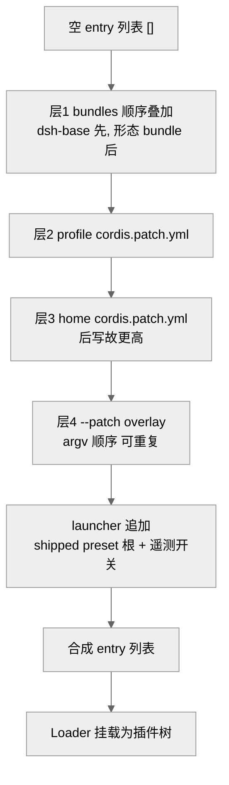
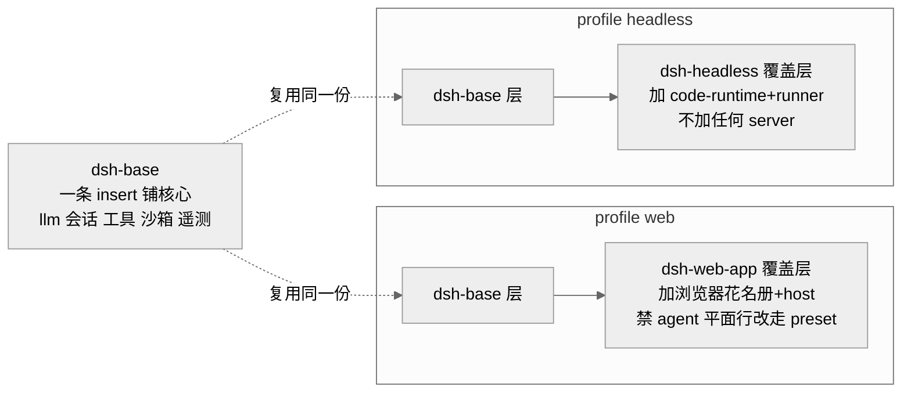
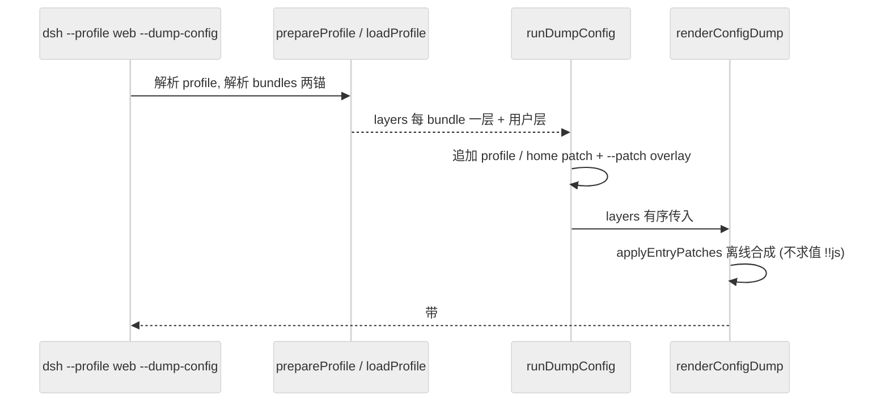
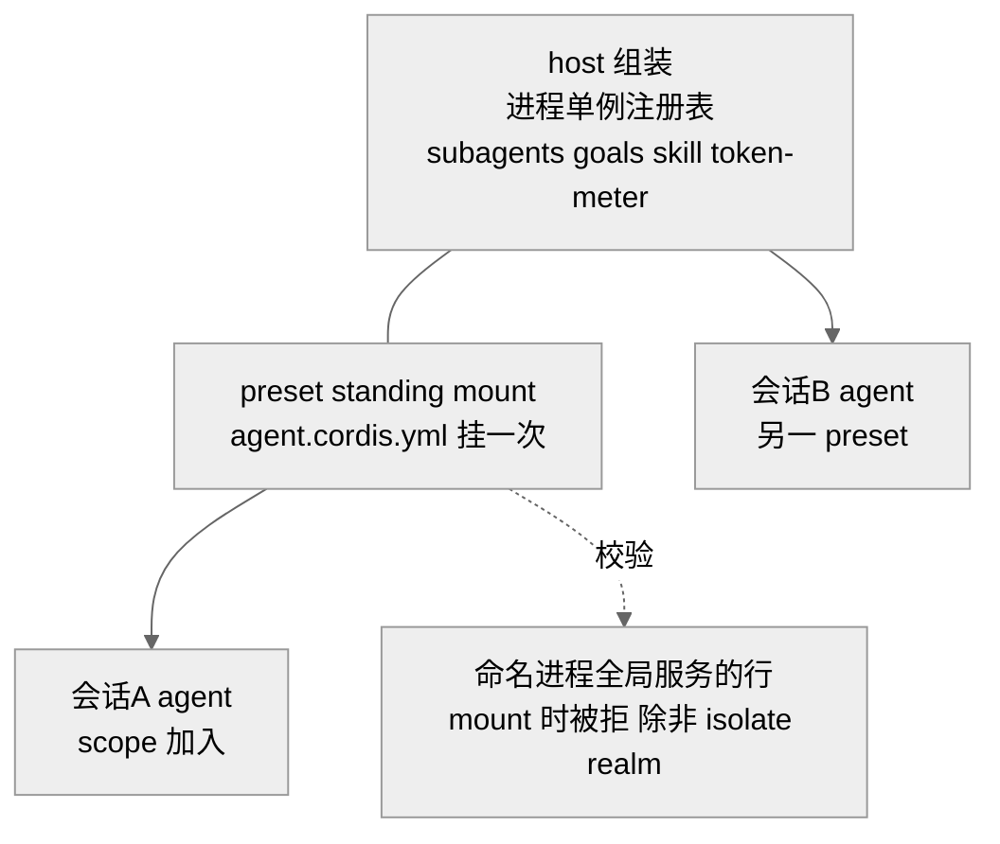

# 第 04 章 · Profile 与 Bundle 组装

> 本章讲一件事：一个跑起来的 `dsh` 进程，它的插件树不是写死在某个配置文件里，而是 boot 时按有序层"组装"出来的。读完你应能回答：profile、bundle、`cordis.patch.yml`、`--patch` 这四者是什么关系？它们以什么顺序叠加？`dsh-base`/`dsh-web-app`/`dsh-headless` 各自往树里塞了什么？为什么"改一行配置换掉整块能力"是可能的？以及 `dsh --dump-config` 到底打印的是什么。

前三章确立了"一切皆插件、组件可逆卸载、依赖响应式声明"。但插件写好了，谁决定"这次进程加载哪些、以什么配置加载"？答案是本章的组装层：它把散落在各包里的插件，按 profile → bundles → patch 的分层规则拼成一棵具体的 Cordis 树，再交给 Loader 挂载。

## 一、本质：运行时是 boot 时组装的一棵树

架构文档开门见山：`A running dsh is a plugin tree composed at boot from ordered layers`（docs/architecture.md:17）。这句话有两个含义。

其一，**没有特权内核**。模型适配器、工具注册表、会话日志、agent loop 本身都是插件行（row），全部可从配置替换（docs/architecture.md:11）。组装层不例外地对待它们——它不认识"核心"，只认识一串带 `id` 的 entry。

其二，**最终形态是数据，不是代码**。组装的产物是一份 `EntryOptions[]`（cordis include 的 entry 列表），每个 entry 是 `{ id, name, config, disabled, ... }` 这样的普通 JSON 数据（vendor/include/src/index.ts:58）。因此"这台机器实际 boot 的树"可以被完整地离线打印出来——这正是 `--dump-config` 的基础。

三个关键名词，各有一处 `package.json` 声明来锚定身份（docs/architecture.md:23）：

- **profile**：Harness home 下的一个命名组装（`$DSH_HOME/profiles/<name>`）。它的 `package.json` 用 `dsh.profile.bundles` 列出要叠的 bundle，附带一份用户自己的 `cordis.patch.yml`，以及 out-of-tree 插件的 `dependencies`（app-boot/README.md:38）。
- **bundle**：一种"Cordis 配置行 + 它挂载的代码"的分发格式。它的 `package.json` 用 `dsh.bundle.patch` 指向自己的 patch 文件。它插入的东西"对上层仍然可打补丁"。
- **patch**：一条针对某 `id` 的覆盖，或一批 `insert` 新行。这是分层叠加的原子操作。

## 二、核心问题：可组合性要落到"谁先谁后"

前一章的时空可组合性是范式层的保证；到了产品层，真正要回答的痛点很具体：**同一个 `dsh` 二进制，如何既能起一个带浏览器界面的长驻应用，又能起一个跑完一个任务就退出的无头 runner，还允许用户在不改任何源码的前提下换掉沙箱后端、关掉遥测、加装一个自建插件？**

朴素做法是给每种形态写一个完整的 `cordis.yml`。但这样一来，"web 和 headless 共享的那 60 多行核心配置"就会被复制两份，任何一处改动都要同步；用户想微调一行，就得 fork 整份文件。dsh 的选择是**分层覆盖**：把共享核心沉到最底层的 bundle，形态差异叠在上面，用户偏好叠在最上面，每一层只写自己关心的那几行。

## 三、解决思路：四层有序叠加，patch 按 id 覆盖整行

组装的核心算法是 include 插件的 `applyEntryPatches`：从一个**空的 entry 列表**出发，按顺序应用每一层的 patch 列表（vendor/include/src/index.ts:58）。规则只有两条：

- 带 `insert` 的 patch：把新行追加进列表，并**立即索引**，好让同一列表里更靠后的 patch 能定位到它（vendor/include/src/index.ts:80-101）。
- 带 `id` 的 patch：用 `target[key] = value` 把匹配行的顶层键逐个覆盖（vendor/include/src/index.ts:121-124）。这意味着一个 `config:` patch **整个替换**掉该行的 `config`，不做深合并；`disabled: true` 则覆盖该行的启停位。匹配不到任何行的 patch，只告警并跳过（vendor/include/src/index.ts:110-113）。

层的顺序在 `apps/cli/src/profile-boot.ts:151` 一处坐实——`composeEntries` 收到的层数组是：

```
[ bundlePatches, profile.patches, homePatches, overlays ]
```

展开成人类语言（docs/architecture.md:27、app-boot/README.md:43）：

1. **profile 列出的每个 bundle**，按 `dsh.profile.bundles` 的顺序（`dsh-base` 永远第一层）。
2. **profile 自己的 `cordis.patch.yml`**（`$DSH_HOME/profiles/<name>/`）。
3. **home 级 `cordis.patch.yml`**（`$DSH_HOME/`）——机器级偏好，对所有 profile 生效，故排在 per-profile 之后、**反而更高**。
4. **`--patch` 覆盖层**，按 argv 顺序（可重复）。

后写覆盖先写，逐行结算。这里有个易被误读的点：home 层"outranks"per-profile 层，不是因为它更"重要"，纯粹因为它应用得更晚（app-boot/README.md:43）。

<div style="background: #ffffff !important; background-color: #ffffff !important; padding: 16px; border-radius: 8px; margin: 16px 0;" bgcolor="#ffffff">



</div>

> 图注：分层覆盖的骨架。每层只是一批 patch，`applyEntryPatches` 从空列表起逐层结算；箭头方向即"后写覆盖先写"的优先级方向。这证明了运行树是层叠出来的，而非单一文件。

需要补一点：`composeProfile` 在 `overlays` 之上还会程序化追加两条——若树里有 `agent-presets` 行，追加一条把 shipped preset 根目录 patch 进去的 overlay（profile-boot.ts:159-167）；再根据 `DSH_TELEMETRY_DISABLED` 追加遥测开关 patch（profile-boot.ts:168）。这两条是 launcher 拥有的、用户层之上的最后修饰。

> **ratify-note · 为什么用分层覆盖，而不是每种形态一份完整配置**
> - 候选解释：A 分层 patch（现状）——共享核心一份，差异叠加；B 每 profile 一份自包含 `cordis.yml`；C 代码里 if/else 按 mode 拼装。
> - 各自利弊：A 优在共享核心零重复、用户只改自己那几行、`--dump-config` 能离线复现；缺在 patch 整替 `config` 不深合并，profile 覆写要重述保留字段（app-boot/README.md:60）。B 优在每份自解释、无叠加心智负担；缺在核心 60+ 行复制多份、漂移风险高、用户微调要 fork 整文件。C 优在灵活；缺在组装逻辑埋进代码、无法离线 dump、违背"一切皆配置行"。
> - 选定 & 理由：选 A。第一性上，harness 要"改一行换整块能力"，就必须让配置成为可叠加、可复现的数据；`composeEntries` 与 boot 走同一次 `applyEntryPatches`（profile.ts:405-420），保证 dump 与实跑不漂移，这是 B/C 都给不了的不变量。
> - 证据等级：[verified]（profile-boot.ts:151；vendor/include/src/index.ts:58；profile.ts:413）。
> - 残余风险 / pre-mortem：若半年后被证伪，最可能因"整替而非深合并"在 profile 数量增长后成为维护负担——用户为改一个字段被迫重述整个 `config`，催生出社区自建的深合并预处理层，架空官方分层语义。

## 四、实现细节：三个 bundle 各加什么

`PROFILE_TEMPLATES` 把两个内置模板钉死（profile.ts:114-117）：`web = [dsh-base, dsh-web-app]`，`headless = [dsh-base, dsh-headless]`。名字不在模板里的 profile 用 `DEFAULT_PROFILE_BUNDLES = [dsh-base]` 起步（profile.ts:125），并要显式 `dsh plugin` 创建。`loadProfile` 对每个 bundle 名两锚解析（先 dsh 安装目录、再 profile 目录），列出的包若没有 `dsh.bundle` 声明则 fail loud（profile.ts:388-397）。

**`dsh-base`——每个 profile 的第一层，一条 `insert` 铺满核心行**（base/cordis.patch.yml）。它塞进的是 harness 的"共享核心"：LLM 适配器（`llm`、`llm-pi-ai`）、默认模型选择（`agent-default-model`，`provider: deepseek-official / model: deepseek-v4-flash`）、会话与持久化（`session`、`session-persistence-jsonl`）、工具栈（`tool-bash`/`tool-fs`/`tool-skill`/`tool-subagent` 等）、沙箱与审批策略（`sandbox`、`sandbox-policy`、`approval`、`permission`）、设置与凭据（`settings`、`credentials`）、遥测（`session-telemetry-otel`，默认 DISABLED）。一个巧思：shell 栈按平台在各自行上门禁——`bash-sandbox`/`tool-bash` 带 `disabled: !!js process.platform === 'win32'`，孪生的 `pwsh-sandbox`/`tool-pwsh` 用反向表达式，同一份 patch、每台主机恰好一套 shell（base/README.md:6）。Codex 与 Claude Code provider 以 dormant 方式加载。

**`dsh-web-app`——骑在 base 之上**（web-app/cordis.patch.yml）。它做三件事：(1) 覆写 base 的少数行——设 `system-prompt.persona` 的编码人格、`hmr.disabled: true`；(2) `insert` 一大批 web 专属行——webserver、api-gateway、workspace、投影缓存、存储，以及整个浏览器插件花名册（`ui-*` 系列）和 `web-runtime` 胶水插件；(3) 关键的一步：把**属于"单个 agent"的行整体 `disabled`**（`tool-bash`、`tool-fs`、`tool-skill`、`tool-subagent`、`plan-mode` 等），让它们改由 per-session 的 agent preset 来挂（web-app/README.md、web-app/cordis.patch.yml 末段）。注释解释了为什么"禁用而非删除"：base 是共享的，overlay 里删掉的行会在有人重排组装时悄悄复活。而注册表类的进程单例（`goals`、`subagents`、`skill` 注册表、`token-meter`）明确**留在 host 平面**，只把面向模型的工具行下沉。

**`dsh-headless`——同样骑在 base 之上，但极简**（headless/cordis.patch.yml）。设人格、关 HMR、挂 Code Mode 的 worker（`code-runtime`）、插入 `headless-runner`。它**不挂任何 Host、HTTP server、Web runtime 或浏览器插件**（headless/README.md:5）。runner 在 Loader settle 后读 `ctx.agentDefaultModel`，通过 `ctx.agents` 建一个持久化 Agent，把命令行位置参数当成普通 user message 提交，等到静默后把最后一条非空 assistant 文本写 stdout，再经 `ctx.appExit` 请求退出（headless/README.md:7）。

<div style="background: #ffffff !important; background-color: #ffffff !important; padding: 16px; border-radius: 8px; margin: 16px 0;" bgcolor="#ffffff">



</div>

> 图注：同一个 `dsh-base` 被两个 profile 共享为第一层，形态差异各自叠一层。这证明"共享核心零重复"——web 与 headless 的分歧只发生在第二层。

**离线复现：`dsh --dump-config`。** `dsh --profile web --dump-config` 打印出这台机器实际会 boot 的树（docs/architecture.md:31-33）。它走 `renderConfigDump`：用 include 自己的 parser 和 patch 算法离线合成 base 配置与带标签的 overlay 层，**不 boot、不求值 `!!js`**，结果等于 `boot()` 会挂的东西；每段共享同一源文件和同一组 patch 层的行前面加一行 `# ==` 注释标明出处，整个输出仍是一份可加载的文档（app-boot/README.md:22）。`--dump-default-config` 则省掉用户层与 overlay，只打印 bundle 层——这是当 `cordis.patch.yml` 写坏时的恢复诊断（dump-config.ts:25）。打印出的任何一行，都能被你自己的 patch 替换（docs/architecture.md:35）。

<div style="background: #ffffff !important; background-color: #ffffff !important; padding: 16px; border-radius: 8px; margin: 16px 0;" bgcolor="#ffffff">



</div>

> 图注：dump 与 boot 复用同一 patch 算法这一点，是"打印即真相"的技术根据；`!!js` 保持字面量原样输出，故 dump 无副作用。

## 五、preset：把组装机制推进到"每会话一棵子树"

分层覆盖解决的是"整个进程"的组装。preset 把同一套思路缩小到"单个会话"：一个 agent preset 是一个含 `agent.cordis.yml` 的目录（preset/agent-presets/src/discovery.ts:26），挂到某 agent 的 scope 上，就赋予该会话自己的工具与 prompt section，而其他在线会话各留各的——一个进程因而能同时跑多个组装不同的 agent（preset/README.md:5）。

机制是"**standing mount + scope 加入**"（preset/agent-presets/src/index.ts:1-14）：每个 preset 只挂载一次（standing scope），插件实例、工具注册、prompt section、投影单元都只存在一份，会话内部按 session 键区分；一个 agent 通过把自己的 scope 键 parent 到该 mount（`bindScopeParent`）来"加入"，使 mount 的注册对该 agent 可见、mount 的监听器能收到该 agent 的事件。唯一支持的加入点是 agent factory 的 `setup(agentCtx)` 钩子——只有那里 join 是在 agent 尚未发布时装上的，故一个被拒的组装能把整次创建回滚（index.ts:16-20）。

这里有一条硬约束：preset 只能贡献"一个 agent 拿到什么"，跨会话的注册表/设施是进程单例，必须留在 host 组装里。一个 preset 若命名了会发布**进程全局服务**的行，会在 mount 时被拒（preset/README.md:14；invariant.ts:35-41），除非该服务坐在一个 `isolate` realm 之后。app-boot 因此在 `cordis:include` 旁边一起注册了 `cordis:group`，好让一个组装把 `isolate` realm 同时给到 provider 和它的 consumer（app-boot/README.md:30）。这正是 `dsh-web-app` 把 `tool-bash` 等下沉、却把 `subagents`/`goals` 注册表留在 host 的原因。

<div style="background: #ffffff !important; background-color: #ffffff !important; padding: 16px; border-radius: 8px; margin: 16px 0;" bgcolor="#ffffff">



</div>

> 图注：preset 让"每会话不同能力集"成立，同时用"进程全局服务必须留 host 或进 isolate realm"的不变量守住多会话共存。这解释了 web 花名册为何禁用工具行却保留注册表行。

## 六、竞品/横向对比

> **ratify-note · dsh 的分层组装 vs 主流 harness 的配置策略**
> - 候选解释：A dsh 式"profile→bundle→patch 分层、运行树=可 dump 的数据"；B Claude Code/Codex 式"settings.json + 扁平 MCP/工具开关"；C 传统框架式"一份 config 文件 + 代码内条件分支"。
> - 各自利弊：A 优在把"换整块能力"降为一次 provider/行替换、离线可复现、用户层与分发层解耦；缺在心智门槛高（要懂 Cordis entry 与 patch 语义）、整替不深合并。B 优在直观、上手快、生态工具多；缺在能力边界由宿主写死，替换核心组件通常要改代码或等官方支持 [claimed]。C 优在简单；缺在组装逻辑不可见、不可 dump。
> - 选定 & 理由：就 dsh 的目标（"模型是灵魂、一切皆可替换插件"）而言 A 是自洽解——它把可替换性从"宿主给的开关"升维成"配置行的替换"，`--dump-config` 让这份可替换性可审计。这与社区把 dsh 的价值定位在"可替换性/生态"而非"绑定自家模型"一致（全网调研 D 节 [inferred]）。
> - 证据等级：[verified]（dsh 侧机制：docs/architecture.md、profile-boot.ts）；[claimed]（B/C 竞品细节为二手口径）。
> - 残余风险 / pre-mortem：若被证伪，最可能因大多数用户其实只想要 B 那样的"几个开关"，dsh 的分层被感知为过度工程，真实使用退化为"照抄官方模板、从不改 patch"。

## 七、仍存在的问题与局限

三处已在 README 明记为 deferred 的边界，都源自组装机制本身：

- **patch 整替、不深合并**（app-boot/README.md:60；base/README.md:20）。profile 覆写一行时必须重述它要保留的每个字段，否则会连带清空。字段一多，覆写就变脆。
- **bare 包解析依赖 Loader 内部**（app-boot/README.md:57）。生产 bin 需要 Loader 的可选 native helper；一个自带模块解析的 in-process 调用方若没有它，只能用可解析的相对/file specifier。这限制了"任意环境嵌入 dsh"的便利。
- **home 层对所有 profile 生效**。这是设计（机器级偏好），但也意味着一条写在 home `cordis.patch.yml` 里、只想影响 web 的 patch，会同时命中 headless——正确做法是放进 per-profile 层，但顺序上 per-profile 反而低于 home，一个想被 home 覆盖的 profile 默认值需要额外注意。

> **ratify-note · "整替不深合并"是不是设计缺陷**
> - 候选解释：A 是刻意取舍（保持 patch 语义简单、可逆、可离线复现）；B 是待补的能力空洞（应加深合并层）。
> - 各自利弊：A 优在 `applyEntryPatches` 只有"整替顶层键 / insert"两条规则，热重载能干净回退被移除的 patch（vendor/include/src/index.ts:44-52）；缺在覆写啰嗦。B 优在覆写简洁；缺在深合并的回退语义复杂——半合并状态如何在 HMR 中可逆是难题，且"某字段来自哪一层"变得难以 dump。
> - 选定 & 理由：判为 A 刻意取舍而非缺陷。第一性上，dsh 的组装不变量是"dump 等于 boot、移除 patch 能干净回退"，深合并会同时威胁这两者；README 把它列为"Known Limitations"而非 bug，措辞是"there is no deep-merge layer"（陈述边界，非承认缺失）。
> - 证据等级：[verified]（vendor/include/src/index.ts:121-124 的整替实现；app-boot/README.md:60 的 deferred 表述）。
> - 残余风险 / pre-mortem：若被证伪，最可能因大型部署的 profile 覆写字段膨胀到不可维护，社区先行实现一个"合并预处理器"，倒逼官方把深合并纳入——届时需重新论证 HMR 可逆性。

## 小结与衔接

本章确立了 dsh 的组装模型：运行树是 boot 时从空列表起、按 `bundles → profile patch → home patch → --patch` 四层有序叠加出来的数据；patch 按 `id` 整替整行的 `config` 或 `insert` 新行；`dsh-base` 铺共享核心，`dsh-web-app`/`dsh-headless` 各叠形态差异；`--dump-config` 用与 boot 同一套算法离线复现整棵树；preset 把同一分层思路缩到"每会话一棵子树"，并用"进程全局服务必须留 host / 进 isolate realm"守住多会话共存。

至此 Part I 的四章合起来回答了"dsh 是什么、凭什么可替换"。从下一章起进入 Part II 源码剖析：Ch05 展开"扩展点=类型化事件"的分派机制，Ch06 深入本章反复提到、却始终当作黑盒的那个唯一具体 agent loop 实现——正是它，消费着本章组装出来的这棵树。

## 源码索引

- docs/architecture.md:11,17,23,27,31-35 — Profiles and bundles 一节、分层顺序、`--dump-config`
- packages/boot/app-boot/README.md:18,22,30,38,43,57,60 — patch 加载、`renderConfigDump`、`cordis:group`、profile 机制、home 层排序、已知局限
- packages/boot/app-boot/src/profile.ts:114-117（PROFILE_TEMPLATES）,125（DEFAULT_PROFILE_BUNDLES）,371-403（loadProfile 两锚解析）,405-420（composeEntries）
- apps/cli/src/profile-boot.ts:105-129（层结构与 allPatches）,142-171（composeProfile 顺序与 launcher 追加）
- apps/cli/src/dump-config.ts:1-52 — `--dump-config`/`--dump-default-config` 分派
- apps/cli/src/args.ts:132-134 — `--patch`/`--dump-config` 标志定义
- vendor/include/src/index.ts:44-52（patch 语义说明）,58-128（applyEntryPatches：insert 索引、id 整替、无匹配告警）
- packages/bundle/base/cordis.patch.yml — 单条 insert 的核心行集；shell 栈按平台门禁
- packages/bundle/base/README.md:6,20 — base 定位与"整替"局限
- packages/bundle/web-app/cordis.patch.yml、README.md:5 — 覆盖 base、插入浏览器花名册、下沉 agent 平面行
- packages/bundle/headless/cordis.patch.yml、README.md:5-7 — 无 server 的一次性 runner
- packages/preset/README.md:5,14 — agent preset 定义与"进程全局服务被拒"约束
- packages/preset/agent-presets/src/index.ts:1-20、discovery.ts:26、invariant.ts:35-41 — standing mount、scope 加入、isolate 约束
