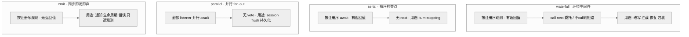
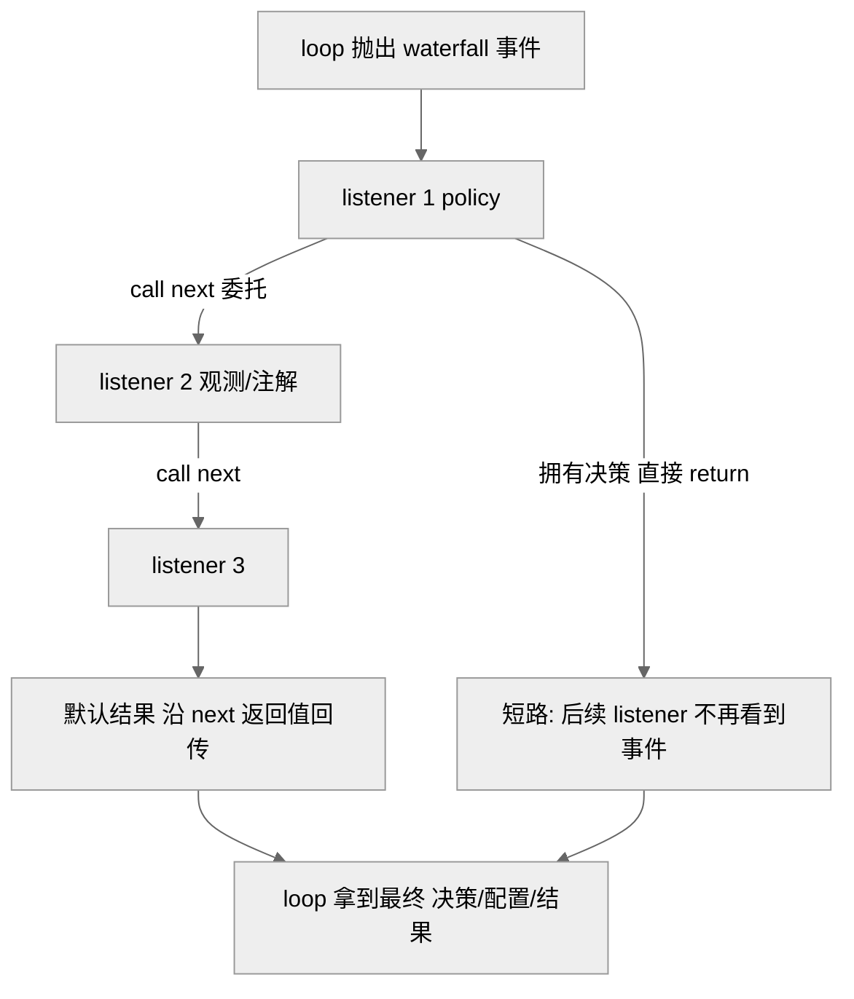
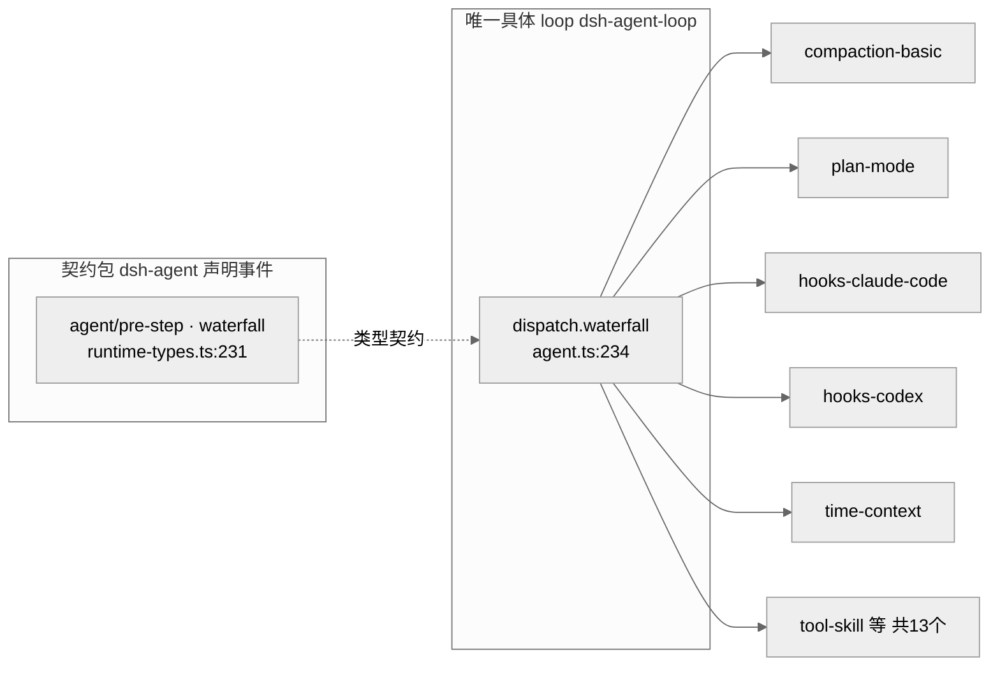
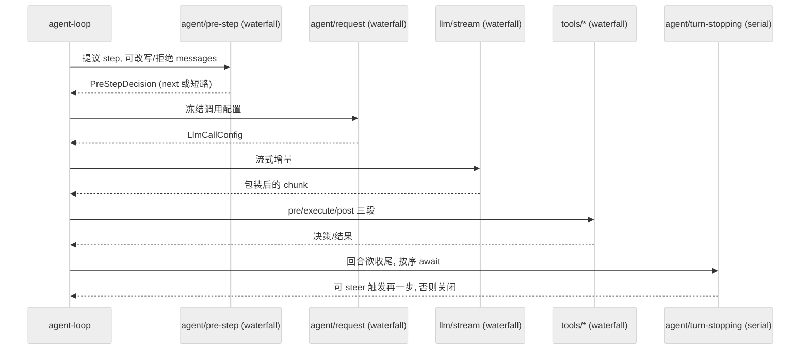

# 第 05 章 · 微内核与事件分类法

> 本章讲 dsh 的"内核"到底是什么。读完你能回答三个问题：为什么这个 harness 声称"没有特权内核、一切皆插件"却仍能跑起来；扩展点为什么是**四种 dispatch 模式的类型化事件**而不是一套中间件框架；以及那条"唯一具体 loop 且谁都不许依赖它"的红线在源码里如何成立。

## 一、本质是什么

先说一个类比：老式电脑的操作系统内核什么都管，鼠标驱动、声卡、文件系统都编进内核；而"微内核"反过来，内核只保留最基础的机制（比如进程调度、消息传递），驱动和服务全搬到外面当独立模块。dsh 借的就是这个思路——只不过它的"内核"连一段独立代码都算不上。

dsh 的内核不是一段代码，而是一套**事件词汇表 + 分发语义的约定**。这里的"事件词汇表"可以理解成一份公开的接口清单：回合驱动器（agent loop，也就是驱动 AI 一问一答一步步往下跑的那段主循环）在关键节点抛出带明确 dispatch 模式（分发模式，即"这个事件该怎么派发给监听者"）的类型化事件，插件挂到这些事件上完成拦截、改写、观测或收尾——内核本身不知道 hooks、compaction、plan mode、permission 是谁，它只知道"在 pre-step 处开一个 waterfall"。换句话说，内核只认识"事件"这个抽象，不认识任何具体功能。

Agent Note 把这套设计命名为 "microkernel — extension via Cordis event taxonomy, one concrete loop"，一句话概括为：**loop 的扩展点是带 deliberate dispatch mode 的类型化事件**（`.agents/notes/implemented/architecture/2026-06-11-microkernel-event-taxonomy.md:13` `[verified]`）。这里的"微内核"取其本义：内核只提供最小的机制（事件分发、生命周期、副作用回滚），一切策略都外置为插件。（Cordis 是本项目的插件框架底座，后文会多次出现；这里只需记住它负责"插件注册、卸载、热重载"这类通用能力。）

它在总纲主线里对应"架构命题"——连模型适配器、工具注册表、会话日志、agent loop 本身都是 Cordis 插件，全部可从配置替换。本章负责把这句口号落到"扩展点=类型化事件"这一层的实现。

## 二、核心问题与痛点

产品原则是 "everything is a plugin"：hooks、`/goal`、`/loop`、动态 workflow、compaction（把过长的历史压成摘要以省 token 的"上下文压缩"）、sandboxing、permissions、UI（User Interface，用户界面）、persistence、MCP（Model Context Protocol，模型上下文协议，一种让外部工具与数据源接入模型的开放协议）、skills，**全部**要能写成插件而不改核心（Agent Note Problem 节，`microkernel-event-taxonomy.md:9` `[verified]`）。

这带来一个真实难题：一个 agent 回合里有大量"可被干预的点"——模型看到什么消息、请求配置长什么样、请求失败要不要重试、工具能不能执行、执行结果要不要改写、回合该不该收尾。可以把一个回合想象成一条流水线，上面预留了若干工位，每个工位都可能有人想插手。如果这些工位都硬编码进 loop，那么加一个权限策略、换一个压缩算法、接一个 Claude Code hook，都要动内核代码，"可替换"就是空话。

痛点因此收敛为一个问题：**用什么机制把这些干预点暴露出去，既让插件能改写/短路/观测，又让 loop 自身可被整体替换而不牵连任何人？**

## 三、解决思路与方案

答案是"纯 Cordis 事件分类法"。所谓"分类法"，就是把这些干预点按"插件在这里要做什么"归成四类，每类配一种 dispatch 模式。四种模式可以先用一句话记住：waterfall 像"接力赛，每棒能改交接的东西也能中途叫停"，serial 像"排队安检，一个个过"，parallel 像"群发通知，人人一份、互不等待"，emit 像"广播喇叭，喊完就走"。

- **waterfall**（around-middleware，环绕中间件）——插件要 transform / short-circuit / recover / wrap（改写 / 短路 / 恢复 / 包裹）的地方：`agent/pre-step`、`agent/request`、`agent/request-error`、`tools/pre-execute`、`tools/execute`、`tools/post-execute`、`llm/stream`、`system-prompt/assemble`。
- **serial**（按注册顺序 await，即逐个等待前一个跑完）——需要有序检查点：`agent/turn-stopping`。
- **parallel**（fan-out 并行 await；fan-out 即"扇出"，一次把事件同时派发给所有监听者再一起等）——每个 listener 都必须独立拿到一次机会：`session/flush` 持久化检查点。
- **emit**（同步 fire-and-forget，即"发出去就不管了"）——纯通知：inbox 迁移、生命周期、错误，以及那条只读不可变的 `tools/result` 观测。

（四模式清单 `microkernel-event-taxonomy.md:15-18` `[verified]`；分发语义表 `docs/cordis-primer.md:19-24` `[verified]`。）

配套两条制度性约束（可以理解成"把接口和实现分开"的纪律）：

1. **事件词汇住在契约包**——`dsh-agent` 声明全部 `agent/*` 事件（`microkernel-event-taxonomy.md:20`；声明确在 `packages/core/agent/src/runtime-types.ts:159-290` `[verified]`）。契约包只登记"有哪些事件、各是什么模式"，不含任何实现，就像一份对外发布的接口规格书。
2. **`@deepseek-ai/dsh-agent-loop` 是唯一具体 loop 插件，本身可换，loop 之外任何东西都不许依赖它**（`microkernel-event-taxonomy.md:20` `[verified]`）。也就是说，大家都对着规格书编程，没人绑死到那台具体的"机器"上，于是这台机器随时能被整台换掉。

之所以直接复用 Cordis 原生事件、而不是另起一套 koa-compose（Koa 是一个 Node.js Web 框架，koa-compose 是它把一串中间件首尾串起来的经典工具）式中间件栈或显式"阶段状态机"，根子上是因为整个 harness 已经建在 Cordis 底座上：listener 本身就是 Cordis effect，天然带热重载与卸载回滚，再造一套 dispatch / disposal / reload 语义等于在框架之上重复造框架，还得自己保证卸载正确性（`microkernel-event-taxonomy.md:24` `[verified]`）。

> 图注：四种模式的区分维度是"是否 await、是否有返回值、能否短路"。它证明 dispatch 模式不是随意起名，而是按"插件在此要干什么"精确切分——想改结果用 waterfall，想有序把关用 serial，想人人有份用 parallel，只想被通知用 emit。

## 四、实现细节关键点

### 4.1 四模式的分发签名

四种模式在 Cordis 层有严格的方法对应（`docs/cordis-primer.md:17`：每个事件只能被对应方法分发）。看回合驱动器的实际分发点（`packages/core/agent-loop/src/agent.ts`）：

- `pre-step` / `request` / `request-error` 走 `this.dispatch.waterfall(...)`（`agent.ts:234`、`438`、`355` `[verified]`）；
- `turn-stopping` 走 `this.dispatch.serial('agent/turn-stopping', ...)`（`agent.ts:296` `[verified]`）；
- `session/flush` 由 `core/session` 以 parallel 分发，注释直言"Awaited parallel durability checkpoint: every listener runs ... with no waterfall veto"（`packages/core/session/src/index.ts:78-86` `[verified]`）；
- `tools/result` 是 emit，签名返回 `undefined`、观测"frozen, lossless-JSON final outcome"、listener failures are contained（`packages/core/tools/src/index.ts:190-197` `[verified]`）。

事件的 dispatch 模式是**公共契约的一部分**：新事件用 `@mode` JSDoc 标注（一行写在注释里的声明，标明"我是 waterfall / serial / …"），生成的 catalog 会拿声明去核对分发点（`cordis-primer.md:26`；例见 `runtime-types.ts:229` 的 `@mode waterfall`、`:276` 的 `@mode serial` `[verified]`）。这意味着"某个事件到底该怎么派发"不是散落在实现里的口头约定，而是写进契约、可被自动核对的白纸黑字。

### 4.2 waterfall 必须 call `next()` 否则短路

这是全章最反直觉、也最承重的一条不变量（不变量，指全程必须成立、不能被破坏的约定）。`ctx.waterfall` 是**环绕中间件**：可以想成一串套娃，每个 listener 都把内层包在自己里面。listener 收到 `(...args, next)`，调用 `next()` 把（可能已包装的）结果委托给下一个 service，**不调用 `next()` 直接 return 则短路整条链**，值通过 `next()` 的返回值传播（`docs/cordis-primer.md:30-32` `[verified]`）。类比一下就是接力赛：接了棒还想继续跑就把棒传下去（`next()`），如果直接冲线不传棒，后面的人就再也拿不到棒了。AGENTS.md 把它升格为铁律："Waterfall listeners MUST call `next()` to delegate; returning without it short-circuits the chain"。

设计上短路是**特性而非 bug**：单决策事件里，拥有决策权的 policy listener 直接 return 就是"我说了算，后面不用再问"，而只做注解/观测的 listener 必须委托（`cordis-primer.md:34`）。cookbook（扩展示例手册）的权限门例子把这点写死——不允许（`isAllowed` 为假）就直接 `return { kind: 'deny' }` 一票否决，允许就 `return next()` 把决定权交给后面（`docs/cookbook/extension-cookbook.md:24-29` `[verified]`）。这就像门口的保安：判定不放行时当场拦下、不必再往里通报；放行时才让你继续走后面的流程。

> 图注：waterfall 的两种合法走向——短路（policy 拿走决策）与委托（层层包装后回传）。它证明"忘记 `next()`"在这套模型里不是崩溃而是**静默改变语义**，所以必须靠教学 + 组合测试兜底（Agent Note Consequences 节 `microkernel-event-taxonomy.md:30`）。

> **↔ 论文对应**：监听器注册即 Cordis effect（`ctx.on` 返回 disposer、卸载时回滚），在《Spatiotemporal Composability》论文里属于**可逆 effect**（见 [Part IV 论文全解](../Part%20IV%20Foundational%20Paper/22-A-Programming-Paradigm-for-Spatiotemporal-Composability.md) §3.1，Def.12、Thm.16）`[verified]`；而 waterfall 的环绕（around-middleware）语义、以及"扩展点"作为多插件汇聚的**组合点**，可类比论文把 context 视作组件交汇处、用 effect 组合子 $\diamond$ 顺序拼接各组件贡献的定位 `[inferred]`。

### 4.3 事件声明住在契约包，与具体 loop 解耦

`agent/*` 全部在 `packages/core/agent/src/runtime-types.ts` 里用 TypeScript 声明合并（declaration merging，一种把多处声明的同名类型自动拼成一个的机制）声明（`:159-290` `[verified]`），而真正分发它们的是 `core/agent-loop`。声明的和分发的分属两个包，这就把"事件契约"和"事件实现"劈开了：`core/agent` 里 `AgentFactory` 接口的 JSDoc 明确写着 "depending on the concrete `dsh-agent-loop` package"（依赖那个具体的 loop 包）是要被避免的（`packages/core/agent/src/index.ts:181` `[verified]`），具体 loop 通过 `setFactory` 注册（声明在 `agent/src/index.ts:372`；`:248` 处为 `@link` 提及）。

生成的《Event Producer And Consumer Matrix》（事件的"生产者-消费者"对照表）是这套解耦的全景证据（`docs/event-producer-consumer.md` `[verified]`）：每个事件标了 Mode、声明位置、dispatchers（谁抛出）、listeners（谁监听）。例如 `agent/pre-step`（waterfall）由 `agent-loop` 分发，被 13 个包监听——agent-instructions、compaction-basic、goal-round-driver、hooks-claude-code、hooks-codex、plan-mode、repeat-tool-reminder、time-context、tmux-context、tool-cordis、tool-skill 等（`event-producer-consumer.md:18` `[verified]`）。一个扩展点，十几个互不知晓的插件各取所需——它们谁也不认识谁，却能同时挂在同一个点上干自己的活，这正是"解耦"最直观的画面。

> 图注：声明（契约包）、分发（唯一 loop）、消费（十几个插件）三者分离。它证明 loop 只面向"事件契约"编程、不认识任何具体 listener，因此换掉 loop 不牵连 listener，换掉 listener 也不牵连 loop。

### 4.4 每个 MVP 特性映射到一个 listener

Agent Note 立了一条"证明义务"：**每个 MVP（Minimum Viable Product，最小可行产品，即第一个可交付版本要具备的核心功能集）特性都必须映射到某个扩展点上的 listener**。这话反过来读更有力——如果哪个功能找不到对应的 listener、只能靠改内核实现，"一切皆插件"就露馅了。所以这张 feature→mechanism map（功能到机制的对照表）就是"微内核"主张的可检查凭据，且要求保持最新（`microkernel-event-taxonomy.md:28`；表在 `docs/cookbook/extension-cookbook.md:101-129` `[verified]`）。抽样：

| 产品特性 | 落到哪个 listener/机制 |
|---|---|
| Hook 系统 | `agent/session-start`+`agent/pre-step`+`agent/request`+`tools/pre-execute`+`tools/post-execute`+`agent/turn-stopping` 上的 listener |
| 自动/手动 compaction | seam + `agent/pre-step`（压力触发）+ `agent/request-error`（溢出恢复） |
| 权限 / AskUserQuestion | `tools/pre-execute` 返回 `ask`，经 `ctx.approval` 应答 |
| Plan mode | logged `plan/mode` 状态 + section + `/plan` 命令 |
| `/loop` | 监听 `turn/end` 会话事件后 `followup()` 下一轮 |
| 插件热重载 | 每个 registration 是 `ctx.effect` → vendored HMR（Hot Module Replacement，热模块替换/热重载，即不重启进程就换掉一段代码）直接可用 |

表头一句话点破全部：No row modifies the loop（`extension-cookbook.md:97` `[verified]`）。

### 4.5 回合流里的模式分布

架构文档给了一张回合时序（`docs/architecture.md:67-84` `[verified]`）：`agent/pre-step`、`agent/request`、`llm/stream`、三个 `tools/*` 是 waterfall，其 listener 必须 `next()`；`agent/turn-stopping` 是 serial、没有 `next()`。而 `turn/*`、`step/*`、`user/message`、`assistant/*`、`tool/*` 是耐久会话事件（durable，指会被落盘记录、能重放的事件，区别于上面那些只在内存里一闪而过的拦截点）——这条边界连着第 07 章的"model-visible ⟺ logged"（模型看得到的 ⟺ 被记录下来的）不变量。

> 图注：一个 step 内部四个 waterfall 拦截点各司其职，收尾用 serial。它证明 dispatch 模式不是全局一刀切，而是逐点按需选择：拦改写的地方全用 waterfall，收尾把关用 serial。

## 五、易错点与注意事项

- **忘记 `next()`**：waterfall listener 只想观测却不 `next()`，会静默吃掉后续所有 listener——Agent Note 明列"non-obvious and must be taught"，靠 AGENTS.md + composition tests 兜（`microkernel-event-taxonomy.md:30` `[verified]`）。
- **serial 事件不要依赖 listener 顺序决定结果**：`agent/turn-stopping` 的 JSDoc 写死"Data decides, so listener order cannot change the outcome"——收不收尾由数据（是否有 fresh steering、`concludesTurn`）决定，而非哪个 listener 先跑（`runtime-types.ts:262-278` `[verified]`）。
- **emit 是即发即弃 + 容错**：`tools/result` 观测的是**冻结不可变**的最终结果，listener 抛错被 contained（`tools/src/index.ts:191` `[verified]`）；想改结果得用 `tools/post-execute`（waterfall），别指望在 emit 里改。
- **scope-filtered dispatch（按作用域过滤的分发）**：`agent/*` 多数带 `@dshScopeScan`，agent-scoped listener 只收到自己那个 agent 的事件（好比群里@你才响，别人的消息不打扰你）；但 `tools/change` 故意**不**过滤，因为全局工具集变化关系到每个 agent（`tools/src/index.ts:198-207` `[verified]`）。
- **loop 必须防御**：插件异常在 turn 级被容纳，任意扩展点发起的 steering 永不 stranded（回归测试守着，`microkernel-event-taxonomy.md:31`）。
- **谁都不许依赖 `dsh-agent-loop`**：实测除 `agent-spine-demo`（合法：它是组装 loop 的 bundle）外，`core/session`、`core/agent`、`core/tools` 只在 JSDoc 注释里**提到** `dsh-agent-loop`，无一 `import`（grep 直证 `[verified]`）——依赖指向 `Agent` 接口 / `ctx.agents`，不指向具体包。

## 六、竞品 / 横向对比

社区侧的普遍印象是 dsh 与 Claude Code / Codex CLI（CLI = Command-Line Interface，命令行界面）/ Pi 同类（都是 terminal/web agent harness，即跑在终端或网页里、负责驱动 AI agent 的"外壳程序"，《全网调研》E1 `[claimed]`），其工具调用的严格 JSON schema 被赞（同 E2 `[claimed]`）。值得点出的是，dsh 的 hook 本身就是挂在 `tools/pre-execute` 等拦截点上的普通 Cordis 插件，"needs no external protocol"（`extension-cookbook.md:13` `[verified]`）——因为整个产品都在 Cordis 上，hook 复用同一套类型化事件、生命周期与 HMR 的边际成本近乎零；至于 Claude Code / Codex 那种外部 hook 配置文件，则由 `dsh-hooks-claude-code` / `dsh-hooks-codex` 把它们**映射**到这些扩展点（`extension-cookbook.md:103`、`event-producer-consumer.md:18` `[verified]`），即"内生用事件、兼容外部协议用桥"。但"扩展点=类型化事件+四模式"这一层，社区几乎没展开——它更像是 Cordis 血缘（论文《Spatiotemporal Composability》）在 harness 上的直接投影，而非 harness 自身发明。

## 七、仍存在的问题与局限

- **waterfall 心智成本是结构性负债**：Agent Note 自己把它列为 Consequence 而非已消除的问题——`next()` 语义"non-obvious and must be taught"（`microkernel-event-taxonomy.md:30`）。随插件生态扩大，这类"忘记 `next()`"或"该短路却委托"的 bug 是可预期的长期噪声。
- **顺序敏感的 waterfall 政策层组合脆弱**：`system-prompt/assemble` 被描述为"expert cooperative whole-assembly transform"，listener 作者要**自己负责**保留 Code Mode 与结构化输出协议的贡献（`extension-cookbook.md:99` `[verified]`）——多个改写型 listener 叠加时，正确性依赖作者自觉而非机制强制。
- **"每特性映射一个 listener"是持续维护负担**：feature→mechanism map 被要求"kept current"（`microkernel-event-taxonomy.md:28`），一旦 loop 演进，这张表和 `docs/architecture.md` 必须同改（AGENTS.md 铁律"changing `agent-loop` requires updating docs/architecture.md"），属制度化的 deferred cost 而非一次性成本。

## 小结与衔接

回到开头那个类比：dsh 的"微内核"落到实处，就是一张**四种 dispatch 模式的类型化事件表**——内核只提供"事件分发"这套最小机制，功能全在外面。四种模式各管一摊：waterfall 拦改写、serial 有序把关、parallel 人人有份、emit 只作通知；事件契约住在 `dsh-agent` 这类契约包，唯一具体 loop `dsh-agent-loop` 只面向契约编程、谁都不许依赖它；每个 MVP 特性都被要求映射到某个 listener，让"一切皆插件"从口号变成可核对的证明义务。

这一章讲清了"扩展点长什么样"。下一章（第 06 章）进入那个"唯一具体 loop"内部，看它如何把 turn/step 驱动起来、如何在四个 waterfall 拦截点之间编织出一个可被整体替换的回合机器；而这些事件里哪些是耐久会话事件、"model-visible ⟺ logged"如何成为硬不变量，留给第 07 章。

## 源码索引

- `.agents/notes/implemented/architecture/2026-06-11-microkernel-event-taxonomy.md:9,13,15-18,20,24,28,30,31` — 微内核 ADR（Architecture Decision Record，架构决策记录，即把"为什么这么设计"沉淀成文档）：四模式、契约包声明、唯一 loop、证明义务、waterfall 教学负债
- `docs/architecture.md:9-14,55-61,67-84` — Cordis 定位、事件即扩展点、回合流与模式分布
- `docs/cordis-primer.md:15-34` — 分发模式表、`@mode` 契约、waterfall 环绕中间件语义与短路
- `docs/event-producer-consumer.md:8-66` — 事件生产者-消费者矩阵（Mode/声明位置/dispatchers/listeners）
- `docs/cookbook/extension-cookbook.md:13,24-29,95-129` — native hook 无需外部协议、权限门例子、feature→mechanism map
- `packages/core/agent/src/runtime-types.ts:159-290` — `agent/*` 全部事件声明与 `@mode` 标注
- `packages/core/agent/src/index.ts:181,372` — `AgentFactory` 接口须避免依赖具体 loop、`setFactory` 声明
- `packages/core/agent-loop/src/agent.ts:234,296,355,438` — waterfall/serial 实际分发点
- `packages/core/tools/src/index.ts:152-207` — `tools/*` 事件（waterfall 三段 + emit 的 `tools/result` + 不过滤的 `tools/change`）
- `packages/core/session/src/index.ts:78-86` — `session/flush` parallel 持久化检查点
- AGENTS.md（repo 根）— 铁律："Waterfall listeners MUST call `next()`"、"Plugins, not loop changes"
