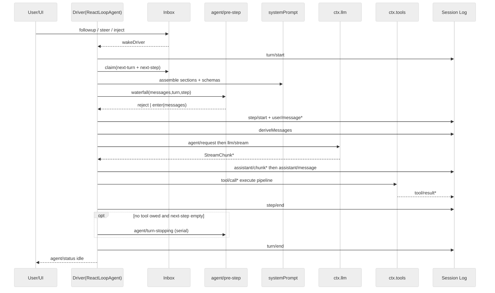
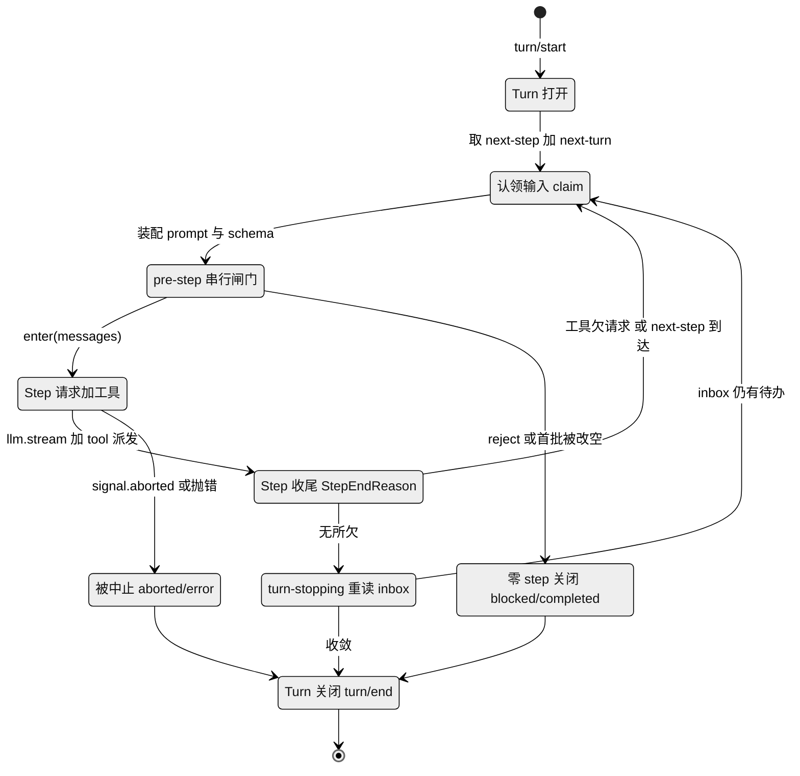
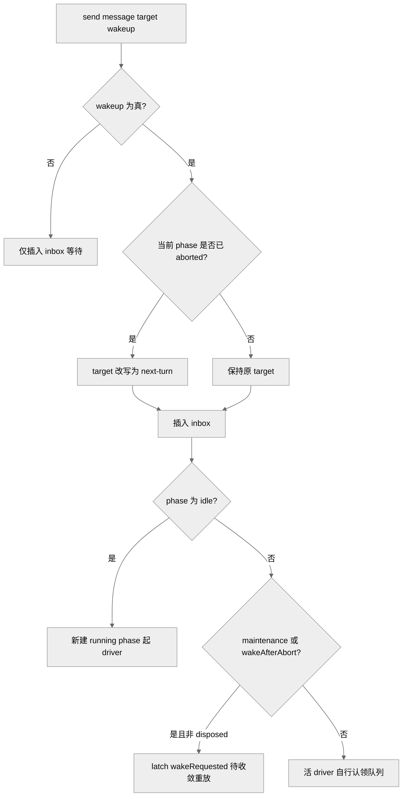
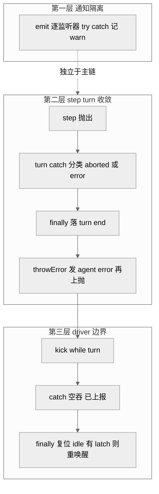

# 第 06 章 · Agent Loop 与回合流

> 本章讲 `dsh` 的心脏：那个把"用户输入→模型请求→工具调用→再请求"驱动起来的具体循环。读完你能回答四个问题——一个 turn 和一个 step 到底怎么划界？外部输入怎么进到循环里、哪些会立刻把它唤醒？pre-step 这个改写闸门能做什么、被拒会怎样？以及当模型报错、插件抛异常、用户中途取消时，循环靠什么不崩、不脏、不悬挂。

## 一、本质：唯一具体的产品循环

在"一切皆插件"的架构里（第 05 章），几乎所有东西都可替换，但**回合流的具体驱动只有一个实现**：`packages/core/agent-loop` 里的 `ReactLoopAgent`（`agent.ts:64`）。这里的"回合流"，指的就是那台把"用户说话→模型请求→工具执行→再请求"一圈圈转起来的引擎。它实现了 `agent/` 包声明的公开 `Agent` 契约（契约 = 一份只规定"能做哪些操作"、不规定"怎么做"的接口约定），是"harness 的默认产品循环"（`docs/subsystems/core.md`）。扩展插件只认这份抽象的 `agent` 契约、从不直接依赖 `agent-loop`，所以循环本身仍可整体换掉——就像家电只认插座标准、不认发电厂，换一套发电方式也不用改家电。

这一层做的事，`docs/subsystems/core.md` 概括为"六个包一趟走完"：`agent-loop` 的 driver 认领一条排队的 prompt，在会话日志上开一个 turn，经 `system-prompt` 装配请求前缀、从日志派生历史，经 LLM 接缝流式取回响应，经工具注册表派发工具调用，再把每一条"模型可见事实"追加回日志——下一步就从它派生。这里的"事件溯源"（event-sourcing）思路，就是不在内存里维护一份会被随手改写的对话状态，而是把发生过的每件事按顺序记成一条条不可改的日志，需要什么状态都从日志重新算出来。一句话：**日志是唯一真相，请求是日志的投影。**

## 二、turn 与 step：边界怎么划

`docs/architecture.md:65` 给了一句定义式的话：

> **A step is one model request plus the tools it calls. A turn is zero or more steps: it opens before its first input is claimed and closes once nothing is owed.**

翻译成机制：一个 **step = 一次模型请求 + 该请求引发的那批工具调用**；一个 **turn = 零或多个 step**，它在认领第一批输入之前就已打开，在"再无所欠"时关闭。打个比方：turn 像一次完整的"接待"——用户提一个诉求，agent 忙到把该做的都做完才结束；step 则是这次接待里的每一"轮"——问一次模型、跑一批它点名的工具，工具的结果又可能让它接着问下一轮。一次接待可能只问一轮就答完，也可能来回好几轮。`agent-lifecycle.md` 与 `architecture.md:67-82` 给出的规范序列是：

```
turn/start
  claim next-step input + one queued message
  assemble prompt + tool schemas
  -> agent/pre-step        reject | enter(messages)
     step/start
     append entered messages as user/message
     derive model history
     agent/request -> llm/stream -> assistant/chunk* -> assistant/message
     tool/call* -> tools/pre -> tools/execute -> tools/post -> tool/result*
     step/end
     tools owe another request, or next-step input arrived -> claim -> next step
  -> agent/turn-stopping
turn/end
```

其中 `turn/*`、`step/*`、`user/message`、`assistant/*`、`tool/*` 是**落盘的会话事件**（durable，意即写进持久日志、日后能原样回放），其余是**活的扩展点**（运行时才存在、供插件挂钩的时机，不落盘）。这条序列在 `turn()` 方法（`agent.ts:246-330`）里逐字对应：`turn/start` 追加后进 `while(true)` 步循环，每一圈调 `preStep`（`agent.ts:225`）→ 若 enter 则 `step/start` + `step()`（`agent.ts:332`）→ 循环退出后关 `turn/end`。也就是说，上面那段看似抽象的伪代码，几乎是这个方法的逐行"字幕"。

<div style="background: #ffffff !important; background-color: #ffffff !important; padding: 16px; border-radius: 8px; margin: 16px 0;" bgcolor="#ffffff">



图注：一趟完整回合的时序。它证明了"落盘事件"（对 S 的写）与"活扩展点"（pre-step / request / turn-stopping）在同一循环里交替发生，且每个 step 严格是"一次请求 + 其工具"。`[verified]` `agent.ts:246-401`、`agent-lifecycle.md`。

</div>

step 是否结束、turn 是否续步，由数据决定而非监听器顺序——换句话说，是"事实长什么样"说了算，不是"谁先被通知到"说了算。`step()` 返回 `StepEndReason`：模型自然收尾无工具调用 → `completed`；命中输出上限 → `max-tokens`（`agent.ts:391`）；有工具调用则跑 `executeToolCalls` 后按是否 `concluded` 返回（`agent.ts:393-399`）。`max-tokens` 是**粘性**的：一旦某 step 触顶，后续正常完成的 step 不能把 turn 结局降级（`agent.ts:285-290`）——好比一次接待里只要有一轮被"字数上限"截断，整场接待的结论就记为"被截断过"，后面几轮答得再顺也不会把这个事实抹掉。turn 续步的条件很直接——`turnEnds` 已定且 `nextStep` 为空才允许收尾，否则 `target='next-step'` 再转一圈（`agent.ts:295-300`）。之所以把最小单元定在"一次模型请求"而非"一次用户输入到一次答复"，根子上是为了让计费（`usage`）、`request/header` 变更、失败重试都能稳定地挂在每个 step 上——`assistant/message` 事件正是"记录每一次成功的 provider 调用，包括空内容与 max-tokens 收尾"，这只有在 step 是记账单元时才成立（`agent.ts:332-401`、`architecture.md:65` `[verified]`）；若按"输入到答复"划界，工具循环里的多次请求就无法被独立定位、独立记账、独立重试。

把同一条循环换成"状态"视角看，就是一台以数据（而非时间顺序）决定迁移的状态机：turn 一旦 open 便反复 claim→pre-step→step，直到"再无所欠"才走 turn-stopping 收尾，而 reject（被拒）、空首批、以及信号 abort（被中止）各是三条不经过任何完整 step 的旁路出口——它们让一个 turn 可以"什么都没做就体面收场"，这一点下面第四节会细讲。

<div style="background: #ffffff !important; background-color: #ffffff !important; padding: 16px; border-radius: 8px; margin: 16px 0;" bgcolor="#ffffff">



图注：turn/step 的状态机视角。它证明续步与收尾都由数据触发（工具是否欠请求、inbox 是否有待办），而 reject、空首批、abort 三条旁路都不经完整 step 却仍汇入同一个 `turn/end`——与"零 step 也关一个 durable turn"的不变量一致。`[verified]` `agent.ts:246-330`、`architecture.md:65-82`。

</div>

> **↔ 论文对应**：turn 内 step 的"多步可中断 + step 边界"，在《Spatiotemporal Composability》论文里被形式化为 **effect iterator**（reified delimited continuation）——一次激活顺序执行多步 effect、每步 yield 逆元并 LIFO 累积，续延 $\mathsf{Maybe}(\mathfrak E^{iter})$ 在两次迭代之间提供一个天然中断边界（见 [Part IV 论文全解](../Part%20IV%20Foundational%20Paper/22-A-Programming-Paradigm-for-Spatiotemporal-Composability.md) §4.3.2，Def.51/52；带转移态的生命周期见 Figure 2）。dsh 的 step 边界与之同构：都是"可迭代、可在边界处改道/中止"的转移过程，而非一步到位的原子激活 `[inferred]`。

## 三、Inbox：单一入口与"谁能唤醒"

外部输入只有一条通道——`Inbox`（`inbox.ts:25`，可以理解成 driver 的"收件箱"），driver 从它认领工作。把入口收成一条，好处是"谁能唤醒循环、什么时候唤醒"只有一处需要讲清楚。`Agent` 暴露统一的 `send(message, target, wakeup)`（`agent.ts:113`），其中 `target` 指"放进哪个队列"、`wakeup` 指"要不要立刻叫醒循环"；`followup`/`steer`/`inject` 是它的三个预设别名：

- `followup` → `('next-turn', wake=true)`：排一个普通后续回合并唤醒（`agent.ts:122`）。相当于用户答完一题又追问下一题。
- `steer` → `('next-step', wake=true)`：给最近的 step 塞转向，空闲则开新 turn，运行中在下个 step 边界消费（`agent.ts:126`）。相当于 agent 干到一半时你插一句"方向改一下"，它会在下一轮请求前听进去。
- `inject` → `('next-step', wake=false)`：塞模型可见上下文但**不唤醒**，等别的消息来了才被顺带带上（`agent.ts:130`）。相当于往收件箱里放张便签，不催它现在看，等它下次因别的事醒来时一并带上。

这正好对应 `docs/architecture.md:86`："输入经由一个 inbox 到达 driver；有些消息立即唤醒它，注入的上下文则在 inbox 里等，直到另一条消息把它带出去。"关键在于：哪些"立即唤醒"由 `wakeup` 布尔位显式决定，而非由消息类型隐含——要不要叫醒循环，是调用方明说的，不靠"猜这条消息该不该急"。

真正精细的是 `wakeDriver`（`agent.ts:172-193`）与取消的交界。`send` 里有一处关键判断（`agent.ts:116`）：若唤醒发生在一个**已被取消（aborted）的活动**上，就把 target 强制改写为 `next-turn`——因为"唤醒输入无法加入一个已中止的活动，它必须开启下一个 turn"。你不能往一场已经喊停的接待里再塞话，只能另起一场。这个分类在插入 inbox **之前**就先算好，是为了防止 splice（往数组里插删元素）的观察者里又触发一次 cancel、反过来把它重新分类——先定好性质，再动手，免得中途被搅乱。运行中的 driver 会自己认领队列；maintenance（维护态）与 aborted 状态下的唤醒则被"latch"起来（latch = 先把这次唤醒请求闩住记下、暂不起步），等收敛时重放（`agent.ts:177-180`）；而 `disposed`（拆卸）因由的取消从不 latch，保证拆卸不必等任何模型回合——要关门时就立刻关，不被没跑完的回合拖住。

<div style="background: #ffffff !important; background-color: #ffffff !important; padding: 16px; border-radius: 8px; margin: 16px 0;" bgcolor="#ffffff">



图注：单入口下的唤醒分类。它证明"是否唤醒"是显式布尔，且取消收敛期的唤醒被降级为 latch 而非立即起步——这是取消恢复正确性的基础。`[verified]` `agent.ts:113-193`。

</div>

认领动作 `claim`（`inbox.ts:71-78`）本身是"纯删除"splice：它移走整批 `next-step`，在 turn 边界再取一条 `next-turn`，通过 spliced 记录删除但**不发 discarded 通知**，再由 loop 单独逐条发 `agent/inbox/claimed`。为什么要区分？因为"被认领去干活"和"被丢弃不理"是两回事：让 `claim` 只管移走、由 loop 另发"已认领"事件，事件流上就能一眼看出某条消息是被拿去处理了、还是被扔掉了，回放和审计不会把两者混为一谈。

## 四、pre-step：可改写、可拒绝的唯一串行闸门

`agent/pre-step` 是"请求派生之前唯一的串行监听链"（`core.md`），也是决定"模型看到什么"的地方。这里的 waterfall（瀑布）是一种监听器链式处理：一条消息批次依次流过每个监听器，前一个的输出是后一个的输入，最后汇成一个决策——像流水线上逐道工序加工同一批料。串行则意味着这些工序一个接一个、不并发，所以"模型这一步到底看到什么"有唯一确定的答案，而不是多个插件抢着改。`preStep`（`agent.ts:225-243`）先 `claim` 出候选批次，装配 prompt sections 与工具 schema，再跑 waterfall，默认决策是 `enter`：把 claimed 消息（外加运行时上下文投影）原样带入。监听器可以返回：

- `{ kind: 'enter'; messages }`——替换进入 step 的消息批次；
- `{ kind: 'reject' }`——不开 step。

被拒有一个不直观但重要的后果：**空 claim / 被拒仍然关闭一个花了零 step 的 durable turn**。也就是说，哪怕这一趟一次模型都没请求，日志里照样留下一对"turn 开了又关"的记录。`turn()` 里，`reject` 令 `turnEnds={kind:'blocked'}` 直接 `return false`（`agent.ts:267-269`）；而"首个 enter 被改写为空"（`phase.step===0 && messages.length===0`）令 `turnEnds={kind:'completed'}` 也 `return false`（`agent.ts:274-277`）。无论哪种，`finally` 都会追加 `turn/end`（`agent.ts:316-322`）。对应 `agent/inbox/claimed` 的文档："若 step 被拒，被认领的消息就此终结——既不丢弃也不重发为 user/message，turn 无 step 而关闭。"为什么值得这么做？根子在于 `claim` 已经对 durable inbox 做了纯删除（`inbox.ts:71`），若不落这一对 turn 事件，这次删除就"无主"、回放时 inbox 投影与事件流对不上，等于制造了一处隐性状态；反过来记一条零 step 的 `turn/start`+`turn/end`，"model-visible ⟺ logged"不变量就不被破坏——`architecture.md:88` 因此明确"a rejected or empty first claim still closes a durable turn that spent no step, so the log records the attempt"（`agent.ts:267-277` `[verified]`）。

请求配置的改写走另一个 waterfall `agent/request`（`agent.ts:438-441`），它只能换 provider/model/采样参数（即换哪家模型、哪个型号、温度等旋钮），**不能改消息**——模型可见内容必须走已落盘的通道。换句话说，"给模型多看一句话"和"给模型换个大脑"是两件严格分开的事：前者必须先记进日志，后者才允许在请求组装时临时调整。这条红线由 `invariant.ts` 强制校验（见第六节）。

## 五、防御式容错：三层容器化

回合流跑在插件世界里，任何 waterfall/serial 监听器、任何 provider、任何工具都可能抛异常或永不返回。`dsh` 的对策是**分层容器化**——把每一层可能的爆炸都圈在一个"隔间"里，不让它蔓延，而不是让异常一路冒泡炸掉整个 agent。这有点像船的水密舱：某一舱进水，关上舱门，船照样航行。在"插件/provider/工具都是第三方且可热插拔"的语境下，这套重容错不是过度设计，而是被写成了仓库级纪律——`AGENTS.md` 要求任何 lifecycle / concurrency / teardown 工作动手前先读 `docs/defensive-patterns.md`（`[verified]`）。

**第一层：通知 emit 逐监听器隔离。** `agent/*` 里的 emit 类事件（`inserted`/`claimed`/`status`/`error` 等，都是"广播一声、不等回话"的通知）通过自建循环派发（`dispatch.ts:120-137`）：每个回调的同步 throw 与返回 promise 的 rejection 各自 `try/catch`、只记 `warn`，"通知不能否决生命周期推进，也不能饿死后来的观察者"。这是刻意绕开 Cordis 原生 emit 的做法——后者用 `Array.map` 挨个调监听器，其中一个同步 throw 就会让排在后面的监听器再也收不到通知（这就是所谓"饿死")。

**第二层：step/turn 内异常收敛为结构化结局。** 意思是不管出了什么岔子，都把它整理成一条"有类型、可记录"的结局，而不是一团散乱的错误。`turn()` 的 catch（`agent.ts:302-315`）区分两类：若 `signal.aborted`（是被主动取消的），结局记 `{kind:'aborted', reason}`；否则记 `{kind:'error', error}`，其中 `LlmError` 保留其 `failure` 事实，其它都塌缩为 `errorChain` 文本 + `UNKNOWN` 码。无论哪条路，`finally` 都会落 `turn/end`（`agent.ts:316-322`），再经 `throwError`（`agent.ts:203-208`）发 `agent/error` 并把异常上抛给驱动边界——先如实记账、再对外报警，两件事都不落下。

**第三层：driver 边界吞掉。** `kick()`（`agent.ts:210-223`）用 `while(await this.turn()){}` 驱动，外层 `catch(_error){}` 空吞（把异常接住、不再往上抛）——注释写明"已上报的失败与取消，在 driver 边界被容器化"；`finally` 里把 phase 复位 idle，并在有 latch 且仍有 pending 时重新唤醒。这里"空吞"不是偷懒，而是因为该报的警第二层已经报过了，到最外圈只需保证循环别把异常再往外炸。这样一次失败最多毁掉当前回合，agent 本身回到可用的 idle，还能接着干下一件事。

<div style="background: #ffffff !important; background-color: #ffffff !important; padding: 16px; border-radius: 8px; margin: 16px 0;" bgcolor="#ffffff">



图注：容错分三层。它证明失败被"就地上报（agent/error）＋落盘（turn/end）＋边界吞掉（kick）"三步处理，agent 不因单次回合失败而死。`[verified]` `dispatch.ts:120-137`、`agent.ts:203-223`、`agent.ts:302-322`。

</div>

取消恢复更细。`cancel(cause, options)`（`agent.ts:134-140`）默认清空 inbox 并 abort 活动信号；`keepInbox` 则保住待办、只中止当前回合——相当于"叫停当前这场接待，但排队等着的活儿先留着"。取消的因由是 TypeScript 强制的四种 `AgentCancelCause`（`user`/`parent`/`hook`/`disposed`，见 `core.md`；分别是用户主动、上级 agent 传导、钩子触发、拆卸销毁），持有者把它拷进 `AbortSignal.reason`，让"为什么被取消"一路可查。工具调度层（`tool-calls.ts`）对取消尤为讲究：中止会为"还没开跑的调用"补记一条合成的错误结果（`appendSkippedToolCall`，`tool-calls.ts:249-259`），保证 `tool/call`（发起调用）与 `tool/result`（调用结果）成对出现、回放时不缺胳膊少腿；而调度器自身失败则**不伪造结果**，保留已记的 `tool/call` 后上抛——该有结果的补齐，不该假装有结果的绝不编造。

## 六、请求可重构：不变量兜底

回合流最硬的约束是"模型可见 ⟺ 已记录"——凡是模型能看到的内容，必定先在日志里有据可查，反之亦然，两边严格对等。`buildRequest`（`agent.ts:407-495`）把请求组装成一个 `deepFreeze` 的冻结对象（冻结 = 组装好后就不许再改，任何偷偷改动都会失败），并用 `markAgentLoopRequest` 打标；派生的历史来自 `session.deriveMessages()`。包自带的运行时不变量 `invariant.ts`（不变量 = 一条"任何时候都必须成立"的规则，自带校验、违反即报错）在 `llm/stream` 上 `prepend` 一个全局监听器，对每个 loop 构建的请求校验：必须冻结、必须带 live session id、日志里必须有 `step/start` 与 `request/header`，且 `JSON.stringify(options.messages)` 必须逐字等于 `deriveMessages()` 的派生结果，否则 `fail('log-reconstruction desync')`（`invariant.ts:39-42`）。这一步的意义是：把"日志是唯一真相"从一句口头约定，升格成一道代码强制执行的门禁——谁想绕过日志偷偷给模型塞话，请求发出前就会被当场拦下。

## 七、易错点与横向对比

几处容易踩的边界，值得单独点名：pre-step 的 `enter` 决策是**权威**的——它说这一步带哪些消息就是哪些，被最终决策省略的 claimed 消息**保持移除**、不会自动回到 inbox（`core.md`），别指望"这条我没带上，它会自己排回队里"；`agent/request` **不能改消息**，想加模型可见上下文得用 `agent.inject()` 走日志通道；`agent/turn-stopping` 是 serial 且靠"重读 inbox"决定去留，监听器顺序不影响结果——反向的"提前结束工具循环"同样是数据驱动（工具结果带 `concludesTurn` 标记，一个工具就能宣布"这一回合到此为止"）。`request-error` 只在失败 step 关闭后、失败 turn 关闭前跑，返回 `{kind:'retry'}` 才重试，默认 `undefined` 让失败终结（`agent.ts:354-371`）；`dsh-compaction-basic`（上下文压缩插件）正是借这个窗口，在上下文溢出（对话太长、塞不进模型的窗口）时先裁剪历史、再开一个新的重试 turn（`agent-lifecycle.md`）——把"太长了"这种失败，就地变成"压一压再来一次"。

把这套回合流放到横向看：多数开源 harness 走的是"消息数组在内存里增长、循环直接读写"的老路，直观、上手快，但历史即内存、回放与审计弱，粘性 `max-tokens`、零 step turn 这类跨请求语义无处安放。dsh 反其道而行——请求 100% 从 append-only 日志派生并被不变量校验（`invariant.ts`、`agent.ts` `[verified]`），fork / resume / 回放 / UI 全部从同一事件流导出，取消与失败都留痕可续。这与它"模型是灵魂、一切皆插件"的主线是一件事的两面：只有把回合流做成"事件的投影"，driver、provider、工具才能整体替换而不失一致性。社区亦公认其严格 JSON schema 与"研究味"是区别点（`全网调研` E 节 `[claimed]`）；不过与竞品无逐字对照，此处措辞从弱。

## 八、小结与衔接

`ReactLoopAgent` 是 `dsh` 唯一具体的产品回合流：step 以"一次模型请求 + 其工具"为原子，turn 是其容器；输入经单一 inbox 进入、由显式 `wakeup` 位与取消状态共同决定是否起步；`agent/pre-step` 是请求派生前唯一可改写/可拒绝的串行闸门，被拒的空 claim 也照样关一个零 step 的 durable turn；失败与取消经"逐监听器隔离 + step/turn 收敛 + driver 边界吞掉"三层容器化，并靠 append-only 日志与运行时不变量保证请求随时可重构。

下一章（第 07 章）转向这条循环的"真相之源"——append-only 会话日志本身：`SessionEvent` 的十二种变体、`deriveMessages()` 的投影规则，以及"model-visible ⟺ logged"不变量在持久化与回放中的完整含义。本章反复引用的"日志派生请求""事件即扩展点"，都将在那里落到数据结构层面。

## 源码索引

- `docs/architecture.md:63-90` — Turn flow 定义与规范序列（step/turn 定义、waterfall 列表、pre-step 语义）
- `docs/agent-lifecycle.md` — 完整回合时序图 + `assistant/message` 记账、compaction 恢复说明
- `docs/subsystems/core.md` — Agent 句柄契约、inbox 词汇、`AgentCancelCause`、pre-step/request-error 决策类型、`agent/*` 事件目录
- `packages/core/agent-loop/src/agent.ts:64` — `ReactLoopAgent`；`:38-46` Phase；`:113-193` send/wakeDriver；`:225-243` preStep；`:246-330` turn；`:332-401` step；`:407-495` buildRequest；`:203-223` 容错边界
- `packages/core/agent-loop/src/tool-calls.ts:59-101` — `executeToolCalls` 调度；`:249-259` 取消合成结果
- `packages/core/agent-loop/src/index.ts:296` — `AgentLoop` 工厂/服务、配置驱动 create/resume、`FactoryOwnership`
- `packages/core/agent-loop/src/invariant.ts` — 请求可重构不变量（frozen / live session / 日志派生逐字相等）
- `packages/core/agent/src/inbox.ts:25` — `Inbox`；`:71-78` claim 纯删除
- `packages/core/agent/src/dispatch.ts:120-137` — emit 逐监听器容器化
- `AGENTS.md` — Defensive patterns / Model-visible ⟺ logged / Plugins-not-loop-changes 纪律
