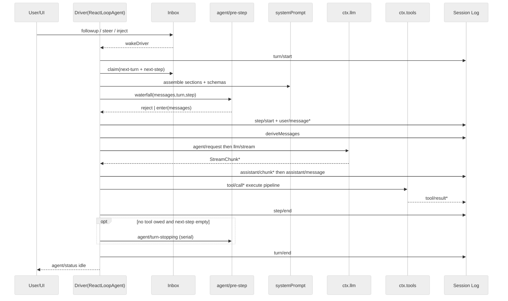
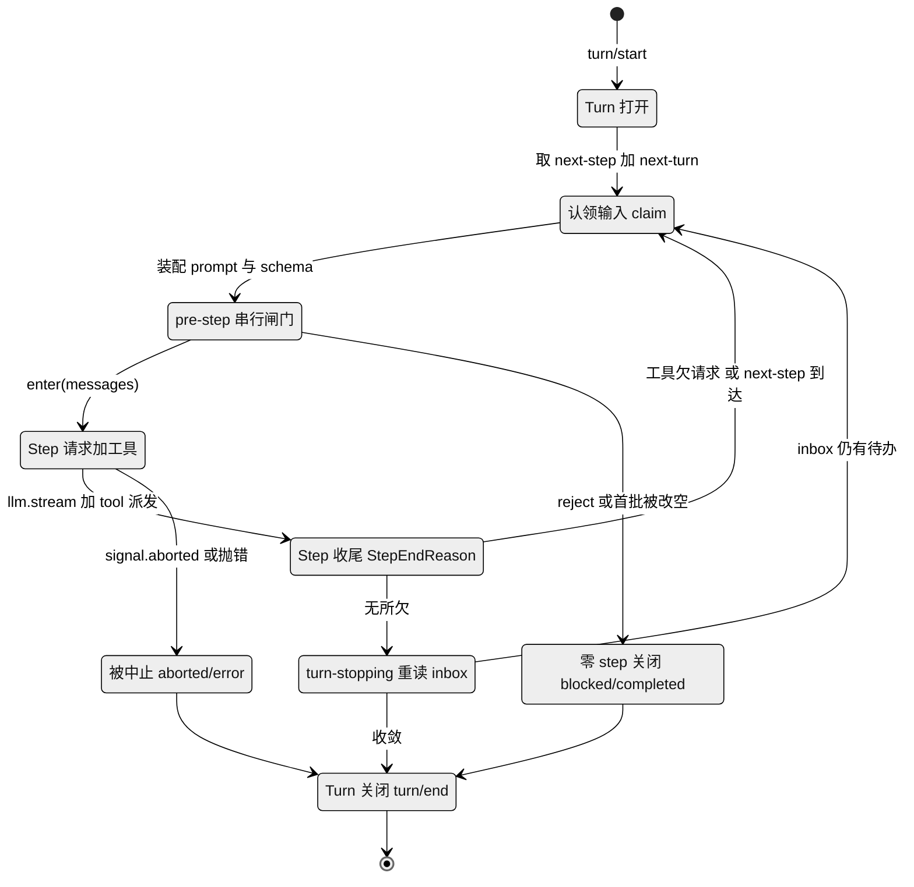
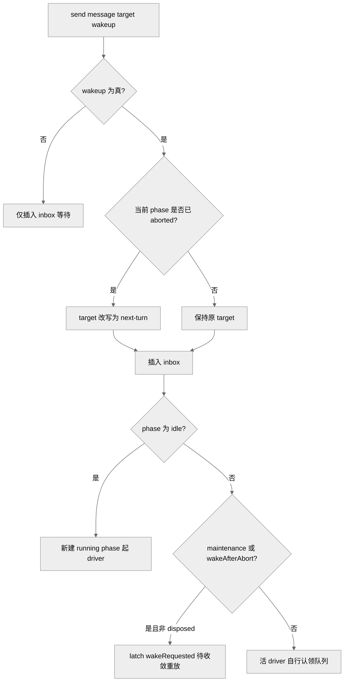
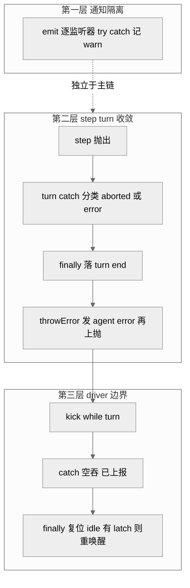

# 第 06 章 · Agent Loop 与回合流

> 本章讲 `dsh` 的心脏：那个把"用户输入→模型请求→工具调用→再请求"驱动起来的具体循环。读完你能回答四个问题——一个 turn 和一个 step 到底怎么划界？外部输入怎么进到循环里、哪些会立刻把它唤醒？pre-step 这个改写闸门能做什么、被拒会怎样？以及当模型报错、插件抛异常、用户中途取消时，循环靠什么不崩、不脏、不悬挂。

## 一、本质：唯一具体的产品循环

在"一切皆插件"的架构里（第 05 章），几乎所有东西都可替换，但**回合流的具体驱动只有一个实现**：`packages/core/agent-loop` 里的 `ReactLoopAgent`（`agent.ts:64`）。它实现了 `agent/` 包声明的公开 `Agent` 契约，是"harness 的默认产品循环"（`docs/subsystems/core.md`）。扩展插件依赖抽象的 `agent`、从不直接依赖 `agent-loop`，所以循环本身仍可整体换掉。

这一层做的事，`docs/subsystems/core.md` 概括为"六个包一趟走完"：`agent-loop` 的 driver 认领一条排队的 prompt，在会话日志上开一个 turn，经 `system-prompt` 装配请求前缀、从日志派生历史，经 LLM 接缝流式取回响应，经工具注册表派发工具调用，再把每一条"模型可见事实"追加回日志——下一步就从它派生。**日志是唯一真相，请求是日志的投影。**

## 二、turn 与 step：边界怎么划

`docs/architecture.md:65` 给了一句定义式的话：

> **A step is one model request plus the tools it calls. A turn is zero or more steps: it opens before its first input is claimed and closes once nothing is owed.**

翻译成机制：一个 **step = 一次模型请求 + 该请求引发的那批工具调用**；一个 **turn = 零或多个 step**，它在认领第一批输入之前就已打开，在"再无所欠"时关闭。`agent-lifecycle.md` 与 `architecture.md:67-82` 给出的规范序列是：

```
turn/start
  claim next-step input + one queued message
  assemble prompt + tool schemas
  -> agent/pre-step        reject | enter(messages)
     step/start
     append entered messages as user/message
     derive model history
     agent/request -> llm/stream -> assistant/chunk* -> assistant/message
     tool/call* -> tools/pre -> tools/execute -> tools/post -> tool/result*
     step/end
     tools owe another request, or next-step input arrived -> claim -> next step
  -> agent/turn-stopping
turn/end
```

其中 `turn/*`、`step/*`、`user/message`、`assistant/*`、`tool/*` 是**落盘的会话事件**（durable，可回放），其余是**活的扩展点**。这条序列在 `turn()` 方法（`agent.ts:246-330`）里逐字对应：`turn/start` 追加后进 `while(true)` 步循环，每一圈调 `preStep`（`agent.ts:225`）→ 若 enter 则 `step/start` + `step()`（`agent.ts:332`）→ 循环退出后关 `turn/end`。

<div style="background: #ffffff !important; background-color: #ffffff !important; padding: 16px; border-radius: 8px; margin: 16px 0;" bgcolor="#ffffff">



图注：一趟完整回合的时序。它证明了"落盘事件"（对 S 的写）与"活扩展点"（pre-step / request / turn-stopping）在同一循环里交替发生，且每个 step 严格是"一次请求 + 其工具"。`[verified]` `agent.ts:246-401`、`agent-lifecycle.md`。

</div>

step 是否结束、turn 是否续步，由数据决定而非监听器顺序。`step()` 返回 `StepEndReason`：模型自然收尾无工具调用 → `completed`；命中输出上限 → `max-tokens`（`agent.ts:391`）；有工具调用则跑 `executeToolCalls` 后按是否 `concluded` 返回（`agent.ts:393-399`）。`max-tokens` 是**粘性**的：一旦某 step 触顶，后续正常完成的 step 不能把 turn 结局降级（`agent.ts:285-290`）。turn 续步的条件很直接——`turnEnds` 已定且 `nextStep` 为空才允许收尾，否则 `target='next-step'` 再转一圈（`agent.ts:295-300`）。

把同一条循环换成"状态"视角看，就是一台以数据（而非时间顺序）决定迁移的状态机：turn 一旦 open 便反复 claim→pre-step→step，直到"再无所欠"才走 turn-stopping 收尾，而 reject、空首批、以及信号 abort 各是三条不经过任何完整 step 的旁路出口。

<div style="background: #ffffff !important; background-color: #ffffff !important; padding: 16px; border-radius: 8px; margin: 16px 0;" bgcolor="#ffffff">



图注：turn/step 的状态机视角。它证明续步与收尾都由数据触发（工具是否欠请求、inbox 是否有待办），而 reject、空首批、abort 三条旁路都不经完整 step 却仍汇入同一个 `turn/end`——与"零 step 也关一个 durable turn"的不变量一致。`[verified]` `agent.ts:246-330`、`architecture.md:65-82`。

</div>

> **ratify-note · turn/step 边界为何这样划**
> - 候选解释：A 以"一次模型请求"为最小单元（step），turn 只是它的容器；B 以"一次用户输入到一次完整答复"为回合单元，内部请求不单独命名。
> - 各自利弊：A 优——边界与"落盘一条 `assistant/message`＋其 `tool/result`"天然对齐，回放、计费(`usage`)、`request/header` 变更都挂在 step 上，粒度稳定；缺——概念多一层，使用者要理解"一个 turn 可能好几个 step"。B 优——贴近用户直觉；缺——工具循环里多次请求无法被独立定位、独立记账、独立重试，`max-tokens` 粘性这类跨请求语义无处安放。
> - 选定 & 理由：源码选 A。`step()` 每圈一次 `llm.stream` + 一批工具，`assistant/message` 事件"记录每一次成功的 provider 调用，包括空内容与 max-tokens 收尾"（`agent-lifecycle.md`），这只有在 step 是记账单元时才成立。
> - 证据等级：`[verified]`（`agent.ts:332-401`、`architecture.md:65`）。
> - 残余风险：若将来单请求内出现"部分工具跨请求流式续传"，step 的原子性假设会被冲击，需要更细的子边界。

## 三、Inbox：单一入口与"谁能唤醒"

外部输入只有一条通道——`Inbox`（`inbox.ts:25`），driver 从它认领工作。`Agent` 暴露统一的 `send(message, target, wakeup)`（`agent.ts:113`），`followup`/`steer`/`inject` 是它的三个预设别名：

- `followup` → `('next-turn', wake=true)`：排一个普通后续回合并唤醒（`agent.ts:122`）。
- `steer` → `('next-step', wake=true)`：给最近的 step 塞转向，空闲则开新 turn，运行中在下个 step 边界消费（`agent.ts:126`）。
- `inject` → `('next-step', wake=false)`：塞模型可见上下文但**不唤醒**，等别的消息来了才被顺带带上（`agent.ts:130`）。

这正好对应 `docs/architecture.md:86`："输入经由一个 inbox 到达 driver；有些消息立即唤醒它，注入的上下文则在 inbox 里等，直到另一条消息把它带出去。"哪些"立即唤醒"由 `wakeup` 布尔位显式决定，而非消息类型隐含。

真正精细的是 `wakeDriver`（`agent.ts:172-193`）与取消的交界。`send` 里有一处关键判断（`agent.ts:116`）：若唤醒发生在一个**已被取消（aborted）的活动**上，就把 target 强制改写为 `next-turn`——因为"唤醒输入无法加入一个已中止的活动，它必须开启下一个 turn"。这个分类在插入 inbox **之前**就先算好，防止 splice 观察者里的重入 cancel 反过来把它重分类。运行中的 driver 会自己认领队列；maintenance 与 aborted 状态下的唤醒则被"latch"起来，等收敛时重放（`agent.ts:177-180`）；而 `disposed` 因由的取消从不 latch，保证拆卸不必等任何模型回合。

<div style="background: #ffffff !important; background-color: #ffffff !important; padding: 16px; border-radius: 8px; margin: 16px 0;" bgcolor="#ffffff">



图注：单入口下的唤醒分类。它证明"是否唤醒"是显式布尔，且取消收敛期的唤醒被降级为 latch 而非立即起步——这是取消恢复正确性的基础。`[verified]` `agent.ts:113-193`。

</div>

认领动作 `claim`（`inbox.ts:71-78`）本身是"纯删除"splice：它移走整批 `next-step`，在 turn 边界再取一条 `next-turn`，通过 spliced 记录删除但**不发 discarded 通知**，再由 loop 单独逐条发 `agent/inbox/claimed`。这保证"被认领"与"被丢弃"在事件流上语义可分。

## 四、pre-step：可改写、可拒绝的唯一串行闸门

`agent/pre-step` 是"请求派生之前唯一的串行监听链"（`core.md`），也是决定"模型看到什么"的地方。`preStep`（`agent.ts:225-243`）先 `claim` 出候选批次，装配 prompt sections 与工具 schema，再跑 waterfall，默认决策是 `enter`：把 claimed 消息（外加运行时上下文投影）原样带入。监听器可以返回：

- `{ kind: 'enter'; messages }`——替换进入 step 的消息批次；
- `{ kind: 'reject' }`——不开 step。

被拒有一个不直观但重要的后果：**空 claim / 被拒仍然关闭一个花了零 step 的 durable turn**。`turn()` 里，`reject` 令 `turnEnds={kind:'blocked'}` 直接 `return false`（`agent.ts:267-269`）；而"首个 enter 被改写为空"（`phase.step===0 && messages.length===0`）令 `turnEnds={kind:'completed'}` 也 `return false`（`agent.ts:274-277`）。无论哪种，`finally` 都会追加 `turn/end`（`agent.ts:316-322`）。对应 `agent/inbox/claimed` 的文档："若 step 被拒，被认领的消息就此终结——既不丢弃也不重发为 user/message，turn 无 step 而关闭。"

> **ratify-note · 被拒的空 claim 为何仍关一个 durable turn**
> - 候选解释：A 记一条零 step 的 `turn/start`+`turn/end`；B 直接吞掉，什么都不落盘（沿用"没发生就不记"）。
> - 各自利弊：A 优——日志忠实记录"曾尝试过一个回合但被门禁挡下"，回放、审计、UI 状态与真实驱动一致，"model-visible ⟺ logged"不变量不被破坏；缺——多出看似"空"的回合事件对。B 优——日志更短；缺——一次真实的认领动作（inbox 已被 `claim` 纯删除）却无任何 turn 事件承载，回放时 inbox 投影与事件流对不上，等于制造了一处隐性状态。
> - 选定 & 理由：源码选 A。`claim` 已经改动了 durable inbox（`inbox.ts:71`），若不落 turn 事件，删除就"无主"；`architecture.md:88` 明确"a rejected or empty first claim still closes a durable turn that spent no step, so the log records the attempt"。
> - 证据等级：`[verified]`（`agent.ts:267-277`、`architecture.md:88`、`core.md` `agent/inbox/claimed`）。
> - 残余风险：若消费者按"turn 必含 ≥1 step"做假设统计，会把这些零 step turn 误计；文档已提示，属已知边界。

请求配置的改写走另一个 waterfall `agent/request`（`agent.ts:438-441`），它只能换 provider/model/采样参数，**不能改消息**——模型可见内容必须走已落盘的通道，这由 `invariant.ts` 强制校验（见第六节）。

## 五、防御式容错：三层容器化

回合流跑在插件世界里，任何 waterfall/serial 监听器、任何 provider、任何工具都可能抛异常或永不返回。`dsh` 的对策是**分层容器化**，而不是让异常冒泡炸掉整个 agent。

**第一层：通知 emit 逐监听器隔离。** `agent/*` 里的 emit 类事件（`inserted`/`claimed`/`status`/`error` 等）通过自建循环派发（`dispatch.ts:120-137`）：每个回调的同步 throw 与返回 promise 的 rejection 各自 `try/catch`、只记 `warn`，"通知不能否决生命周期推进，也不能饿死后来的观察者"。这是刻意绕开 Cordis 原生 emit（用 `Array.map`，一个同步 throw 会饿死后续监听器）的做法。

**第二层：step/turn 内异常收敛为结构化结局。** `turn()` 的 catch（`agent.ts:302-315`）区分两类：若 `signal.aborted`，结局记 `{kind:'aborted', reason}`；否则记 `{kind:'error', error}`，其中 `LlmError` 保留其 `failure` 事实，其它都塌缩为 `errorChain` 文本 + `UNKNOWN` 码。无论哪条路，`finally` 都会落 `turn/end`（`agent.ts:316-322`），再经 `throwError`（`agent.ts:203-208`）发 `agent/error` 并把异常上抛给驱动边界。

**第三层：driver 边界吞掉。** `kick()`（`agent.ts:210-223`）用 `while(await this.turn()){}` 驱动，外层 `catch(_error){}` 空吞——注释写明"已上报的失败与取消，在 driver 边界被容器化"；`finally` 里把 phase 复位 idle，并在有 latch 且仍有 pending 时重新唤醒。这样一次失败最多毁掉当前回合，agent 本身回到可用的 idle。

<div style="background: #ffffff !important; background-color: #ffffff !important; padding: 16px; border-radius: 8px; margin: 16px 0;" bgcolor="#ffffff">



图注：容错分三层。它证明失败被"就地上报（agent/error）＋落盘（turn/end）＋边界吞掉（kick）"三步处理，agent 不因单次回合失败而死。`[verified]` `dispatch.ts:120-137`、`agent.ts:203-223`、`agent.ts:302-322`。

</div>

取消恢复更细。`cancel(cause, options)`（`agent.ts:134-140`）默认清空 inbox 并 abort 活动信号；`keepInbox` 则保住待办、只中止当前回合。因由是 TypeScript 强制的四种 `AgentCancelCause`（`user`/`parent`/`hook`/`disposed`，见 `core.md`），持有者把它拷进 `AbortSignal.reason`。工具调度层（`tool-calls.ts`）对取消尤为讲究：中止会为"未开始的调用"补记合成错误结果（`appendSkippedToolCall`，`tool-calls.ts:249-259`），保证 `tool/call` 与 `tool/result` 成对、回放合法；而调度器自身失败则**不伪造结果**，保留已记的 `tool/call` 后上抛。

> **ratify-note · 这么重的防御式容错，是必要还是过度**
> - 候选解释：A 分层容器化（现状）；B 让异常自然冒泡、由顶层统一兜底（更少代码）。
> - 各自利弊：A 优——插件/provider/工具是第三方且可热插拔，单点故障不该让整个长会话崩溃或悬挂；落盘边界（turn/end、合成 tool/result）保证崩溃后仍可回放、可续接；缺——代码显著变重，三处 catch、latch、raceAbort 等增加理解成本。B 优——路径直、易读；缺——一个行为不良的 emit 监听器同步 throw 就能饿死状态更新（Cordis 原生 emit 的已知陷阱），一个悬挂的 provider 就能把 agent 永久钉住。
> - 选定 & 理由：源码选 A，且这是仓库级纪律——`AGENTS.md` 要求"lifecycle/concurrency/teardown 工作前先读 `docs/defensive-patterns.md`"，`dispatch.ts` 注释直接点名要绕开 Cordis emit 的 `Array.map` 陷阱。在"AI 大规模并行写、插件皆第三方"的语境下，把容错做成制度是合理取舍。
> - 证据等级：`[verified]`（`dispatch.ts:120-137`、`tool-calls.ts:1-12` 模块说明、`agent.ts:210-223`）；"必要性"判断含 `[inferred]` 成分（动机不可直证）。
> - 残余风险：若半年后被证伪，最可能因这层容错掩盖了本该暴露的 bug——空吞的 `catch(_error){}` 依赖"已上报"前提，一旦某路径漏了上报，故障会静默。

## 六、请求可重构：不变量兜底

回合流最硬的约束是"模型可见 ⟺ 已记录"。`buildRequest`（`agent.ts:407-495`）把请求组装成一个 `deepFreeze` 的冻结对象，并用 `markAgentLoopRequest` 打标；派生的历史来自 `session.deriveMessages()`。包自带的运行时不变量 `invariant.ts` 在 `llm/stream` 上 `prepend` 一个全局监听器，对每个 loop 构建的请求校验：必须冻结、必须带 live session id、日志里必须有 `step/start` 与 `request/header`，且 `JSON.stringify(options.messages)` 必须逐字等于 `deriveMessages()` 的派生结果，否则 `fail('log-reconstruction desync')`（`invariant.ts:39-42`）。这把"日志是唯一真相"从约定升格为可执行门禁。

## 七、易错点与横向对比

几处容易踩的边界：pre-step 的 `enter` 决策是**权威**的，被最终决策省略的 claimed 消息**保持移除**、不会自动回到 inbox（`core.md`）；`agent/request` **不能改消息**，想加模型可见上下文得用 `agent.inject()` 走日志通道；`agent/turn-stopping` 是 serial 且靠"重读 inbox"决定去留，监听器顺序不影响结果——反向的"提前结束工具循环"也是数据驱动（工具结果带 `concludesTurn`）。`request-error` 只在失败 step 关闭后、失败 turn 关闭前跑，返回 `{kind:'retry'}` 才重试，默认 `undefined` 让失败终结（`agent.ts:354-371`）；`dsh-compaction-basic` 正是借这个窗口，在上下文溢出时先裁剪再开一个新的重试 turn（`agent-lifecycle.md`）。

> **ratify-note · 相比 Claude Code / Codex，这套回合流特别在哪**
> - 候选解释：A 事件溯源 + 唯一可换 driver + 强不变量（dsh 现状）；B 传统"消息数组在内存里增长、循环直接读写"的 agent loop（多数开源 harness 的通行做法）。
> - 各自利弊：A 优——请求 100% 从 append-only 日志派生并被不变量校验，fork/resume/回放/UI 全部从同一事件流导出，取消/失败都留痕可续；缺——概念开销大（turn/step/inbox/waterfall/scope），落地门槛高。B 优——直观、上手快；缺——历史即内存，回放与审计弱，跨请求语义（粘性 max-tokens、零 step turn）难表达。
> - 选定 & 理由：dsh 选 A 与其"模型是灵魂、一切皆插件"主线一致——只有把回合流做成"事件的投影"，才能让 driver、provider、工具都可整体替换而不失一致性。社区亦公认其严格 JSON schema 与"研究味"是区别点（`全网调研` E 节，`[claimed]`）。
> - 证据等级：dsh 侧 `[verified]`（`invariant.ts`、`agent.ts`）；竞品对比为 `[inferred]/[claimed]`，无逐字对照，措辞从弱。
> - 残余风险：若竞品同样采用事件溯源（如某些 Codex 分支），则此"特别性"被稀释，区别退回到不变量强度与插件粒度。

## 八、小结与衔接

`ReactLoopAgent` 是 `dsh` 唯一具体的产品回合流：step 以"一次模型请求 + 其工具"为原子，turn 是其容器；输入经单一 inbox 进入、由显式 `wakeup` 位与取消状态共同决定是否起步；`agent/pre-step` 是请求派生前唯一可改写/可拒绝的串行闸门，被拒的空 claim 也照样关一个零 step 的 durable turn；失败与取消经"逐监听器隔离 + step/turn 收敛 + driver 边界吞掉"三层容器化，并靠 append-only 日志与运行时不变量保证请求随时可重构。

下一章（第 07 章）转向这条循环的"真相之源"——append-only 会话日志本身：`SessionEvent` 的十二种变体、`deriveMessages()` 的投影规则，以及"model-visible ⟺ logged"不变量在持久化与回放中的完整含义。本章反复引用的"日志派生请求""事件即扩展点"，都将在那里落到数据结构层面。

## 源码索引

- `docs/architecture.md:63-90` — Turn flow 定义与规范序列（step/turn 定义、waterfall 列表、pre-step 语义）
- `docs/agent-lifecycle.md` — 完整回合时序图 + `assistant/message` 记账、compaction 恢复说明
- `docs/subsystems/core.md` — Agent 句柄契约、inbox 词汇、`AgentCancelCause`、pre-step/request-error 决策类型、`agent/*` 事件目录
- `packages/core/agent-loop/src/agent.ts:64` — `ReactLoopAgent`；`:38-46` Phase；`:113-193` send/wakeDriver；`:225-243` preStep；`:246-330` turn；`:332-401` step；`:407-495` buildRequest；`:203-223` 容错边界
- `packages/core/agent-loop/src/tool-calls.ts:59-101` — `executeToolCalls` 调度；`:249-259` 取消合成结果
- `packages/core/agent-loop/src/index.ts:296` — `AgentLoop` 工厂/服务、配置驱动 create/resume、`FactoryOwnership`
- `packages/core/agent-loop/src/invariant.ts` — 请求可重构不变量（frozen / live session / 日志派生逐字相等）
- `packages/core/agent/src/inbox.ts:25` — `Inbox`；`:71-78` claim 纯删除
- `packages/core/agent/src/dispatch.ts:120-137` — emit 逐监听器容器化
- `AGENTS.md` — Defensive patterns / Model-visible ⟺ logged / Plugins-not-loop-changes 纪律
