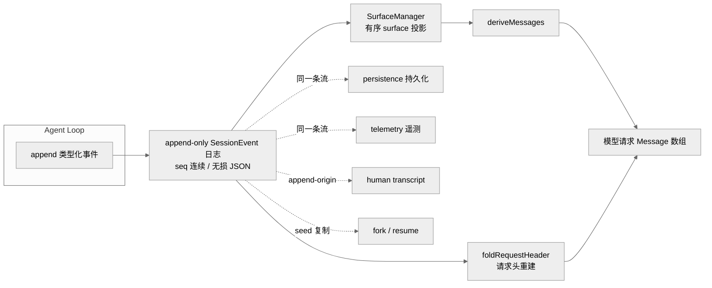
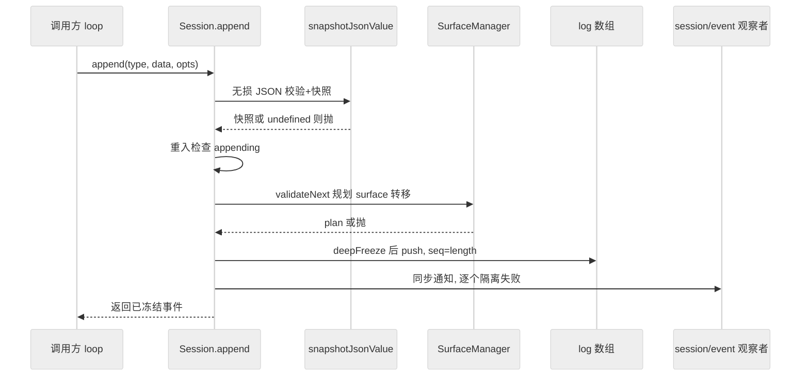
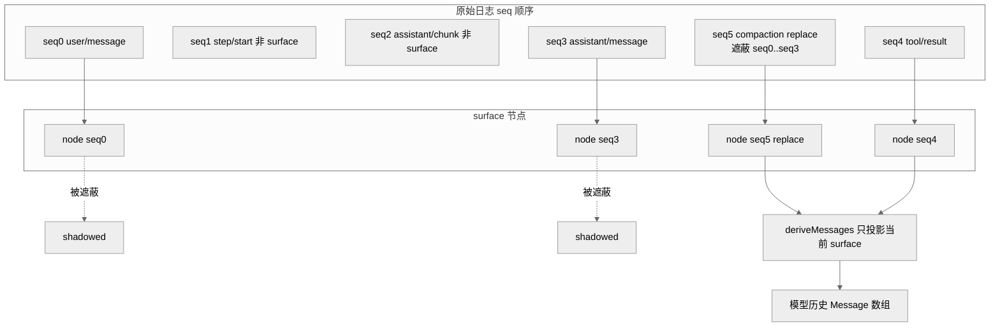
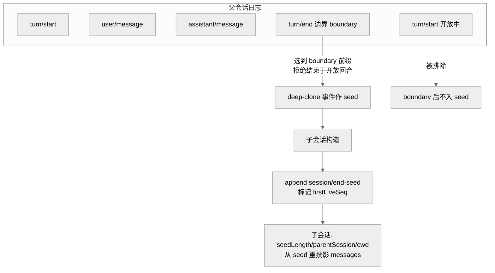

# 第 07 章 · 事件溯源会话日志

> 本章讲 `dsh` 如何把"一个 agent 的整段交互史"表达为一条 **append-only 的类型化事件流**（`SessionEvent`），并从这条流投影出模型看到的消息历史。读完你能回答：为什么这里用事件溯源而不是直接存一个消息数组？"模型可见 ⟺ 已记录"这条不变量在运行时是怎么被断言的？`deriveMessages` 如何从日志重建请求？fork / resume / transcript / telemetry / persistence 为什么全都能从同一条流派生？以及版本号为什么停在 `0`。

---

## 一、本质是什么

先说清楚"事件溯源"（event-sourcing）是什么：它不是把"当前状态"存下来，而是把"发生过的每一件事"按顺序记成一条只增不改的流水账——想知道现在的状态，就把这本账从头念一遍算出来。银行账户就是这个套路：它不直接存"你现在有多少钱"，而是存每一笔进出账，余额是把流水加总算出来的；对账、追溯任何一天的余额，靠的都是这同一本流水。

`Session` 走的正是这条路。它不是"一个存着消息数组的对象"，而是**一条只追加的、按序号连续的类型化事件日志**——它是一个 agent 全部交互史的唯一真相源（single source of truth）。模型实际看到的 `Message[]` 历史不单独存储，而是从这条日志**投影**（derive，即"由日志算出来"）出来的；replay（回放）就是用同一批事件重新投影一次 `[verified]`（`docs/subsystems/session.md:5`；`packages/core/session/README.md`）。

这条日志的形态由两个类型定义：`SessionEventMap` 是事件词表（每个 key 是一种事件类型、value 是其 payload），`SessionEvent<T>` 是日志里的一条条目（`packages/core/session/src/types.ts:236` 与 `:404`）。一条事件带三个固定字段——`seq`（单调序号，恒等于 `log.length`）、`time`（epoch 毫秒）、`data`（payload）`[verified]`（`types.ts:405-411`）。

在第 06 章的 agent loop 语境里，这条流是"回合流"落地的那张账本：loop 每推进一步就往里 `append` 事件，而它需要给模型发请求时，就从账本投影出历史。一切下游——持久化、崩溃恢复、fork、transcript、telemetry、标题——都不是各自维护状态，而是**再读一遍这条流** `[verified]`（`packages/session/README.md`）。

---

## 二、核心问题与痛点

agent harness 里，"模型现在看到的对话历史"和"我们记录下来供回放/审计的东西"是两件事，一旦分头维护就极易发生**漂移**（divergence，指两份数据本该一致却悄悄对不上）：注入了一段 system-reminder 却忘了记录、compaction（把长历史压缩成摘要以省 token）把一段历史压缩了但 replay 时又冒出来、崩溃重启后重建出的 transcript（人类可读的对话记录）与崩溃前模型实际看到的不一致。一旦这种漂移发生，"可回放"就成了空话——你回放出的不是当时真正跑过的东西。这就像账本和实际余额对不上：账本还在，却已经不能说明发生过什么。

`dsh` 的思路不是"更小心地手动同步这两份数据"，而是干脆只留一份。它用一条根律把漂移从"要靠纪律去避免的工程约束"提升为**结构性不可能**——只有一个状态源，就没有第二份可以跟它对不上：

> **模型可见 ⟺ 已记录**：任何到达模型请求的东西都必须能从会话日志重建；一个新的模型可见输入必须对应一个会话事件 `[verified]`（`AGENTS.md` "Model-visible ⟺ logged"）。

痛点因此收敛为三条具体工程需求：(1) 状态与日志不能分家；(2) 事件词表要能被插件扩展（compaction、hook 桥、workflow 都要加自己的事件），又不能因此让老 reader 误读；(3) 日志必须无损、可作为磁盘格式逐字持久化，包括 token 级的原始 chunk。

---

## 三、解决思路与方案

**核心决策：日志即状态。** `Session` 是一条 `SessionEvent[]`，消息历史用 `deriveMessages()` 投影而来；原始流 chunk 也进日志以保留 token 级回放保真度，而组装好的 `assistant/message` 事件才是投影的权威来源 `[verified]`（`.agents/notes/implemented/architecture/2026-06-11-event-sourced-sessions.md`）。

> 图注：一切都从同一条 append-only 日志派生——模型历史走 surface 投影，请求头走 fold，持久化/遥测/transcript/fork 都只是这条流的不同读法。这证明了"日志即状态"：不存在第二个可能与它漂移的状态源。

**分层：raw log → surface → messages。** 原始日志里什么都记（每一步、每个 token chunk、各种内部记录），但真正会变成"发给模型的一条消息"的只是其中一小部分。为此在原始日志之上维护一层 **surface**（可理解为"日志的一层过滤视图"）——它是一个有序序列，只收纳那些"会产生 LLM 消息"的事件，供高效派生与 compaction 使用 `[verified]`（`surface.ts:1-9`）。打个比方：原始日志像一段完整录像，surface 则是从里面剪出的"只保留有台词的镜头"的粗剪版，模型看到的最终对话再从这版粗剪算出来。只有三种事件类型是 `SurfaceEventType`——`user/message`、`assistant/message`、`tool/result` `[verified]`（`types.ts:343`、`surface.ts:15`）。它们必须携带 `surfaceOp` 标记声明"如何加入 surface"：`'append'` 就是接到粗剪的末尾，`{op:'replace',start,end}` 则是用一段新内容盖住原来的一段区间（compaction 压缩历史就是这么干的）`[verified]`（`types.ts:372`）。其余事件（`turn/*`、`step/*`、`assistant/chunk`、各种 log-only 记录）都不进 surface，投影时被正确略过。

> **ratify-note · 事件溯源 vs 直接存消息数组**
> - 候选解释：A 直接维护一个可变的 `Message[]`，事件只作为旁路通知；B 事件溯源，日志即状态、消息从日志投影。
> - 各自利弊：A 实现更简单、派生零成本，但**状态与日志是两份**，忘记同步/顺序错位/compaction 就会让二者漂移，"可回放"失真，且漂移是运行时偶发、难以门禁；B 让漂移在结构上不可能（日志 IS the state），replay/trace/telemetry 是结构性保证而非事后附加，代价是派生成本随日志长度增长、需要 compaction 缓解，以及一层 surface 投影机制的复杂度。
> - 选定 & 理由：选 B。Agent Note 明确记录了 A 被否掉的理由——"state and log can diverge; with event-sourcing the log IS the state, so divergence is structurally impossible" `[verified]`（`2026-06-11-event-sourced-sessions.md` Alternatives）。这与根律"模型可见⟺已记录"是同一件事的两面。
> - 证据等级：[verified]（Agent Note + `deriveMessages` 实现 `index.ts:726`）。
> - 残余风险 / pre-mortem：若半年后被证伪，最可能因派生+surface 的复杂度成本超过了它防住的漂移收益（surface.ts 已达 460 行），或 compaction 之外出现新的高频 surface 重写场景使缓存频繁失效。

---

## 四、实现细节关键点

### 4.1 `append`：唯一的写入闸门，也是无损性与不变量的把关点

既然日志是唯一真相源，那"往日志里写"这个动作就必须只有一道门、并且守得极严。所有写入都经过 `Session.append(type, data, opts?)`——它是这条流唯一的入口。它在把事件推进日志**之前**先做完全部校验：一旦发现问题，就在写入点当场失败，而不是先塞进去、等到后端往磁盘 flush 时才炸 `[verified]`（`index.ts:604-655`）。这样做的好处是把错误挡在最靠近源头、也最好排查的地方，而不是留到几步之后才暴露：

1. **无损 JSON 快照**：`snapshotJsonValue(data)` 一次递归 pass 同时校验+拷贝，凡是不能被 JSON 无损表达的东西一律拒（`undefined`、BigInt、函数、symbol、`-0`、非有限数、循环引用、稀疏数组、Map/Set/Date/类实例都被拒）`[verified]`（`index.ts:614-617`）。为什么要"同一 pass 里读取+校验+拷贝"？因为若先校验、再拷贝，中间数据被人改了就会出岔子——比如一个有状态的 getter 校验时返回一个值、存储时返回另一个值，一次成型才能杜绝这种偷梁换柱。
2. **surface 校验**：`surfaceManager.validateNext(event)` 在事件进 `log` 前先把它"如何加入 surface"规划好（plan-then-commit，即"先算清楚再落地"），一旦失败就整体放弃、绝不半改 surface `[verified]`（`index.ts:634`、`surface.ts:421`）。
3. **重入拒绝**：一次 append 尚未收尾（发布边界还开着）时又发起一次 append，会被直接拒掉——防止写到一半被打断、留下不完整的状态 `[verified]`（`index.ts:624-626`）。
4. 事件被 `deepFreeze` 后 `push`，然后同步通知 `session/event` 观察者（观察者失败被逐个隔离、不影响已提交的 append）`[verified]`（`index.ts:627-654`）。

TypeScript 类型层面还有一个巧妙的约束，把上面的规则前移到了编译期：`append` 的第三参数用条件类型 `T extends SurfaceEventType ? [opts: SurfaceIntent] : []`——意思是"如果这是三种消息事件之一，就**必须**传 `surfaceOp`；否则传了反而报错"。于是"消息事件要声明怎么进 surface、非消息事件不许声明"这件事根本写不错，编译器就把关了 `[verified]`（`index.ts:604-608`、`types.ts:423`）。`sourceEventSeqs`/`surfaceOp` 字段在类型上也只存在于 surface 事件变体（`types.ts:423-435`）。

> 图注：append 是唯一写入闸门。校验全部发生在 `push` 之前，坏事件在源头失败——这保证了 `session.events` 永远等于后端能持久化的东西，也是"无损 JSON 逐字持久化"契约的地基。

### 4.2 surface 与 `deriveMessages`：从日志投影模型历史

`deriveMessages()` 沿 surface 维护的有序节点序列走一遍，对每个节点跑 `deriveEventMessage` 投影成一条消息 `[verified]`（`index.ts:726-747`）。如果每次都从头把整条 surface 投影一遍，日志越长就越慢，所以它是**带缓存**的：每个 surface 节点只投影一次（首见时），之后直接复用，因此一次调用的成本只跟"这次新增了多少节点"成正比（O(新节点数)），而不是跟日志总长成正比。只有当 surface 发生 `replace` 重写（体现为 `replaceGeneration` 变化）时才把缓存整个重建——因为遮蔽区间一变，之前算出来的历史就未必还成立了。返回的是每次调用一份新数组，但其中的 `Message` 是共享且深度冻结的——直接复用已冻结的事件 data，无需二次深拷贝，消费者也无法借投影改写日志 `[verified]`（`index.ts:701-747`）。

`deriveEventMessage` 的投影规则（`surface.ts:83-114`）：

- `user/message` → user 消息，`content` 逐字透传（框架不在这里加 `<context>` 之类包裹，包裹是生产者自己烘进 `content` 的）`[verified]`（`surface.ts:96-98`）。
- `assistant/message` → assistant 消息；但**空 content 的 assistant/message 被跳过**——举个具体场景：某一步刚开口就撞上 max-tokens 上限被截断，内容为空，系统仍会记一条 `assistant/message` 把它的 `usage`（token 用量）/provider/model 记下来（记账要完整），但这条空轮次绝不能塞进发给 provider 的 transcript，否则等于给模型看了一句"什么都没说的话" `[verified]`（`surface.ts:99-105`、`index.ts:743`）。
- `tool/result` → 带 `tool-result` 块的 user 消息。
- 原始 `assistant/chunk` 是 replay/UI 数据，在派生中被跳过（组装好的 message 才权威）；`turn/*`、`step/*`、log-only 事件都投影为 null `[verified]`（`surface.ts:109-113`）。

**`assistant/chunk` 为什么既留在日志里、又不参与投影？** 关键区分是：组装好的 `assistant/message` 是"这一步最终说了什么"的权威版本，而一个个 `assistant/chunk` 是模型逐字吐出来的原始流片段。投影模型历史只认权威版本，所以 chunk 不投影；但 chunk 本身仍有不可替代的用处，得完整留着：token 级重放、UI 逐字打字机式渲染、以及 token 计费（计费读 per-step 的 `assistant/chunk {type:'usage'}`，`assistant/message.usage` 只是没有 usage chunk 时的兜底）`[verified]`（`docs/subsystems/session.md:530`）。持久化契约要求它**逐字保留**、`seq` 连续，不能被过滤出规范日志（JSONL 后端用 packed chunk rows 编码它，但 `load` 必须还原出逐字相同的事件）`[verified]`（`session.md` Durability contract；`chunk-rows.ts`）。

> 图注：非 surface 事件（step/start、chunk）不进 surface；`replace` 节点遮蔽 seq0..3 后，模型历史只由当前 surface（replace 节点 + tool/result）投影。这解释了为什么 compaction 无需改动或删除历史事件——它只是往日志尾追加一个 replace 事件遮蔽旧区间。

**replace 的完整性由 append 时校验强制**：`assertProvenance` 要求 `sourceEventSeqs` 必须包含被遮蔽的每一个 surface 节点、必须引用更早的事件、不得重复 `[verified]`（`surface.ts:211-243`）；`replacementRange` 校验 start/end 都在当前 surface 中且顺序正确 `[verified]`（`surface.ts:246-266`）；`tool/result` 的 replace 被限制为"只能改一个当前节点、且只能改 content"（`assertToolResultRewrite`，`surface.ts:287-318`）。

### 4.3 "模型可见 ⟺ 已记录"的运行时断言

"模型可见 ⟺ 已记录"不止是写在文档里的口号——它在 `agent-loop` 里有一个专门的守卫（invariant companion，即"随 loop 运行、专门核对不变量的伴随检查"），会在真正发请求前**逐字节**核对。做法很直接：每次 loop 构建好 LLM 请求、即将发出前，`llm/stream` 监听器（用 `prepend` 挂到最前面，防止被别的监听器抢先短路掉）会做两件对账：把即将发出的 `options.messages` 和"从日志现算一遍"的 `session.deriveMessages()` 做 `JSON.stringify` 比对，只要不完全相等就 `fail("...diverges from the dispatch-time durable derivation (log-reconstruction desync)")`；再把请求头和 `foldRequestHeader(events)` 逐字段比对 `[verified]`（`packages/core/agent-loop/src/invariant.ts:39-52`）。

这意味着：万一真有某条模型可见输入没有对应地进日志（漂移发生了），请求就发不出去——这条 invariant 会当场炸掉。它把前面说的"结构性不可能"从一句设计承诺变成了一道每次发请求都跑的可执行门禁：即便代码某天写错了，漂移也会在第一时间被拦下，而不是悄悄污染回放。`deriveMessages` 的真实消费者正是 loop 本身（`agent-loop/src/agent.ts:341`），以及 api-proxy 判断历史里是否含图片（`host/apiproxy/src/api-proxy.ts:2297`）`[verified]`。

### 4.4 请求头也是日志状态

不只是消息历史，连"这次请求用什么配置发出去"也一并进日志。请求信封（`EpochHeader` = call config + adapter 默认标记 + 渲染后的 system prompt + 组装好的 tool schemas）通过 `request/header` 事件记下来，所以"每次会话请求都是日志的纯函数"——纯函数的意思是：给同一条日志，永远算出同一个请求，不依赖任何日志之外的隐藏状态，因此完全可复现 `[verified]`（`session.md` request/header 一节；`types.ts:201-210`、`:300-304`）。`foldRequestHeader` 选最新快照重建它；`reason` 区分 `initial`/`resume`/`change`。路由容量元数据（`request/context`）单独记，且只在 provider/model/capacity 变化时记，刻意留在 `EpochHeader` 之外，避免容量变化被误判为请求信封 `change` `[verified]`（`session.md` request/context 一节；`types.ts:212-220`）。

### 4.5 词表扩展：声明合并、required-on-read、ignorable、版本号 0

词表不是写死的——`SessionEventMap` 是 **merge-extensible**（可合并扩展）的。这里用到 TypeScript 的"声明合并"：插件不用改核心代码，只要在自己那边声明"我还要往这张表里加这么几种事件类型"，编译器就会把它们并进同一张词表。于是各子系统各加各的：compaction 加 `compaction/*`，hook 桥加 log-only 的 `hook/invoked`/`hook/result`，workflow 加 `tool-workflow/*` `[verified]`（`session.md:11`、`known-event-types.ts:19-64` 列了 44 种）。这些扩展事件都是 log-only，不是 `SurfaceEventType`、不进派生历史。因为词表可扩展，`switch (event.type)` **禁止**用 `assertNever`——插件加的变体是合法的未知值，走 `default` 落地 `[verified]`（`session.md:247`、`surface.ts:110-112`）。

词表能被随意扩展，就带来一个读侧风险：老版本 harness 读到一条它没见过的事件类型，该怎么办？关键的安全机制是**每事件的 `ignorable` 标记**（`types.ts:412-422`）：reader 遇到不认识的 `type` 时，**默认拒绝**重建整个会话，除非这条事件明确标了 `ignorable: true`（意思是"就算你不认识我，跳过我也不影响正确性"）。为什么默认是"拒绝"（required）而不是"忽略"？这是一个刻意选的安全默认值：忘了标 `ignorable` 顶多"过度拒绝一个本可恢复的会话"（只是不便，能改），而如果默认忽略，就可能"静默恢复一个被掏空了关键事件的会话"——用户以为一切正常，实则历史已经缺斤少两，这是真正的安全故障 `[verified]`（`2026-08-10-session-log-version-mechanism.md` Decision）。持久化读路径用生成的 `KNOWN_SESSION_EVENT_TYPES` 集合做门禁：遇到集合外且未标 ignorable 的类型就抛 `SessionFormatUnsupportedError`，明确提示"likely written by a newer harness" `[verified]`（`coordinator.ts:1063-1064`）。

> **ratify-note · 版本机制为何停在 `SESSION_FORMAT_VERSION = 0`**
> - 候选解释：A 沿用现状——单调整数、pin 在 0、无兼容承诺、不兼容日志直接拒；B 现在就上 major/minor 双段版本号，预留兼容分级；C 每插件运行时注册自己的已知事件类型集。
> - 各自利弊：A 简单、与 SQLite 的 `SCHEMA_VERSION` 先例一致，"是否可升级"是每个升级步骤的属性（由其 upgrader 是否存在决定），而非提前用数字形状承诺；缺点是发布后必须靠 upgrader 链补迁移。B 把"可转换"这个 bit 提前编进数字形状，而你在设计时很少知道下一个改动是不是"major"，容易做出错误承诺。C 会让"已知集合"依赖 composition——更精简的同版本组合会拒掉更全组合写出的日志，破坏同版本读的一致性。
> - 选定 & 理由：选 A。version bump 由**写方**决定（老 runtime 无法再语义正确地处理新日志时才 bump），"parses without error" 不是及格线；只有结构性改动（header 形状、事件信封、核心事件语义、surface 机制）才 bump，普通加事件类型由 `ignorable` 覆盖、不 bump `[verified]`（`types.ts:33-56`；`2026-08-10` Decision + Alternatives）。pin 在 0 是发布前姿态——`AGENTS.md` "Pre-release stance" 明确 "no compatibility promise"。
> - 证据等级：[verified]（常量与 JSDoc `types.ts:56`；Agent Note；`AGENTS.md`）。
> - 残余风险 / pre-mortem：若被证伪，最可能因 upgrader 链迟迟未落地（Note 里 v0→v1 upgrader 是 deferred，`ignorable` 目前无生产者写入），第一个真实结构性改动到来时缺乏可测的迁移路径而临时补救。

---

## 五、易错点与注意事项

- **seq 连续是全系统依赖的契约**：每条事件的序号恒等于它写入前的日志长度（`seq === log.length`），seed（构造会话时喂进去的一段起始事件）也必须从 0 起、一个不缺地连续。所以构造函数对 seed 施加了和 `append` 一模一样的不变量（无损 JSON、连续 seq、surface 转移）——如果放松这道检查，坏 seed 就会拖到后端拒绝、或"活日志与磁盘静默漂移"时才暴露，那时排查就难得多 `[verified]`（`index.ts:508-537`）。
- **`session/end-seed` 边界易被误写**：这个 log-only 事件标记构造 seed 结束，是 `firstLiveSeq` 的持久化投影；只有 `Session` 构造函数是合法写者，插件写它会把它之前的所有 live bracket 静默归类为 seed 历史 `[verified]`（`types.ts:310-333`、`index.ts:545-547`）。读时要找**最后一个** `session/end-seed`（seed 已以它结尾就不重标，所以未改动地重开会话不会每次增长日志）。
- **injected context 也是 `user/message`**：`agent.inject()` 的合成上下文（文件变更通知、子目录 AGENTS.md、skill 内容、cron 通知）都以 `user/message` 记录、`content` 逐字投影，靠 `source` 区分来源 `[verified]`（`types.ts:257-264`）。忘了记录 = 违反根律。
- **transcript 必须读 append-origin，不能读 surface**：人类 transcript 用 `isAppendSurfaceEvent`（append 来源、非 replace 拷贝）投影，因为 surface 刻意遮蔽被 compaction 压缩的区间——直接读 surface 会抹掉用户已经看过的对话 `[verified]`（`surface.ts:51-55`、`packages/core/session/README.md`）。这是同一条流"两种投影"的经典分叉。
- **append-time 只做无损/surface 校验，不做词表校验**：`appendCore` 拒绝退休的 legacy 形状，但**不**对新类型做词表检查——append 时拒绝会中断活会话的 durability，代价高于在下次 load 时响亮拒绝 `[verified]`（`2026-08-10` Consequences）。

---

## 六、竞品 / 横向对比

主流 harness 对"对话历史"的处理各异，但多数走的是同一条捷径：把 messages 当一个可变数组直接维护，trace/log 只是顺手记在一旁的副本（这正是 `dsh` 前面否掉的方案 A——两份数据、易漂移）。社区调研把"事件溯源的 model-visible⟺logged 不变量"列为源码复杂但被普遍忽视的盲区，官网口径也强调"append-only 可追溯会话日志" `[claimed]`（《全网调研》A 节 / F 节）。

> **ratify-note · fork/resume 从同一条流派生，对比"分叉时复制内部状态"**
> - 候选解释：A `dsh` 做法——fork 只是"取源日志的一个稳定前缀作为 seed 复制给子会话"，子会话从 seed 重新投影一切；B 竞品常见做法——分叉时深拷贝一份内部对话状态/缓存。
> - 各自利弊：A 的 fork 无需理解任何内部状态语义，只需选一个"不在开放回合内"的边界前缀，deep-clone 事件即可，子会话的 messages/header/transcript 全部自然重投影出来；因为唯一状态就是日志，fork 不可能漏拷某个隐藏状态。缺点是子会话要重跑一遍投影（有缓存兜底）。B 快，但要精确枚举并拷贝所有内部状态，漏一个就产生与父不一致的子会话。
> - 选定 & 理由：选 A。`fork(source, boundary?, childId?)` 选到 inclusive `boundary`（默认最后一条）、要求前缀不结束在开放回合内（open turn，即一个还没收尾、tool/step 边界尚未闭合的回合；从这种半截状态分叉会得到一个不完整的历史，所以直接抛 `OPEN_TURN` 拒绝）、deep-clone seed + 子元数据（`parentSession`/`seedLength`/继承 `cwd`）`[verified]`（`index.ts:1081-1138`、`_forkSeed:1097-1138`）。resume/replay 同理——`ctx.sessions.create(id,{seed})` 是底层 replay/fork 原语，crash recovery 则用 `interruptedTurnClosers` 合成缺失的 tool/step/turn 边界补一个 provider-valid 的 transcript（`repair.ts:27`）。
> - 证据等级：[verified]（`index.ts:1081`、`repair.ts`、`types.ts:74-91` 记 seedLength/parentSession）。
> - 残余风险 / pre-mortem：若被证伪，最可能因某个"模型可见但没进日志"的状态偷偷出现（违反根律），使 fork 出的子会话与父漂移——这也正是 `agent-loop/invariant.ts:39` 那条运行时断言存在的意义。

> 图注：fork 选一个"不在开放回合内"的前缀 boundary，deep-clone 成子会话 seed，子会话随即写一个 `session/end-seed` 标记 seed 结束，之后从同一批事件重投影出全部派生视图。子会话与父的一致性由"唯一状态即日志"保证。

---

## 七、仍存在的问题与局限

- **派生成本随日志增长**：`deriveMessages` 有增量缓存，但 surface 每次 `replace` 重写就全量重建缓存；官方明确 compaction 是既定缓解手段，而非改写日志 `[verified]`（`2026-06-11` Consequences）。高频重写场景下缓存收益会打折。
- **版本机制半成品**：v0→v1 upgrader 链、view-time 转换、migrate-on-continue 都已设计但 **deferred**，直到第一个真实结构性改动出现才落地；`ignorable` 目前无任何生产者写入，`Session.append` 那个字段"随第一个用户到来才补" `[verified]`（`2026-08-10` Consequences）。
- **out-of-repo 插件事件当前会被拒 resume**：已知集合是仓库范围生成的 `KNOWN_SESSION_EVENT_TYPES`，域外插件事件按构造在集合外，其注册面 deferred——发布前姿态接受"响亮拒绝而非静默" `[verified]`（`known-event-types.ts:8-18`、`2026-08-10` Alternatives）。
- **并发写者不被日志容忍**：`session/end-seed` 只覆盖本会话继承的 bracket；一个并发存活、持有同段历史开放 bracket 的会话，其边界在别处，容忍并发写者需要日志之外的 liveness 信号 `[verified]`（`session.md:589`）。

---

## 小结

第 07 章的一条主线：`dsh` 把"一个 agent 的整段交互史"表达为一条 **append-only、类型化、seq 连续、无损 JSON** 的 `SessionEvent` 流，模型历史用 `deriveMessages` 从 surface 投影而来，"模型可见 ⟺ 已记录"这条根律由 `agent-loop/invariant.ts` 的逐字节断言在运行时兜底。词表用声明合并扩展、以 required-on-read + `ignorable` 守住读侧安全、版本号在发布前 pin 在 0 且无兼容承诺。fork / resume / transcript / telemetry / persistence 全部只是这条流的不同读法——这正是上一章 agent loop 的"回合流"能被完整回放、审计、分叉的底座。下一章进入提示词组装，看这条流的 `request/header` 里那份"渲染后的 system prompt"是怎么被拼出来的。

---

## 源码索引

- `packages/core/session/src/types.ts:56` — `SESSION_FORMAT_VERSION = 0` 及版本机制 JSDoc（`:33-56`）
- `packages/core/session/src/types.ts:236-333` — `SessionEventMap` 事件词表
- `packages/core/session/src/types.ts:343-436` — `SurfaceEventType` / `SurfaceOp` / `SurfaceIntent` / `SessionEvent<T>` / `ignorable`（`:412-422`）
- `packages/core/session/src/index.ts:604-655` — `Session.append`（无损 JSON、surface 校验、重入拒绝、同步通知）
- `packages/core/session/src/index.ts:726-757` — `deriveMessages` / `deriveEventMessage`（增量缓存、空 assistant 跳过 `:743`）
- `packages/core/session/src/index.ts:499-548` — 构造 seed 校验与 `session/end-seed`（`firstLiveSeq` `:472/:539`）
- `packages/core/session/src/index.ts:1081-1138` — `fork` / `_forkSeed`（boundary、`OPEN_TURN`、lineage 元数据）
- `packages/core/session/src/surface.ts:83-114` — 投影规则；`:15-19` `SURFACE_EVENT_TYPES`；`:185-318` surfaceOp/provenance/range/tool-result rewrite 校验
- `packages/core/session/src/invariant.ts` — turn/step/tool 关系不变量（staged via `internal/dispatch` `:233-241`，apply on `session/event` `:223-231`）
- `packages/core/session/src/repair.ts:27-133` — `interruptedTurnClosers` 崩溃恢复合成 closer
- `packages/core/session/src/known-event-types.ts:19-64` — `KNOWN_SESSION_EVENT_TYPES`（44 种，生成）
- `packages/core/agent-loop/src/invariant.ts:39-52` — "模型可见⟺已记录" 运行时断言（`deriveMessages` vs 请求 messages）
- `packages/session/session-persistence/src/coordinator.ts:77-81`、`:1063-1064` — 版本方向感知拒绝 + 未知事件门禁（`SessionFormatUnsupportedError`）
- docs/ADR：`docs/subsystems/session.md`；`.agents/notes/implemented/architecture/2026-06-11-event-sourced-sessions.md`；`.agents/notes/implemented/architecture/2026-08-10-session-log-version-mechanism.md`
