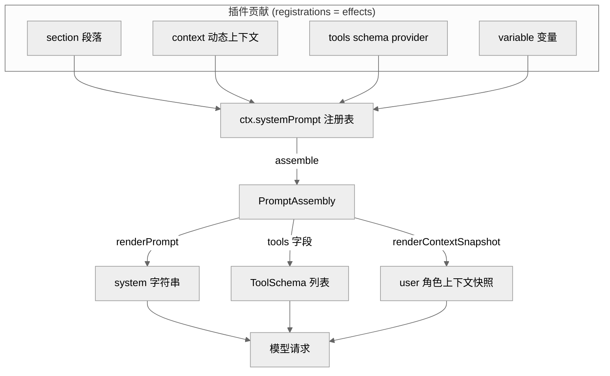
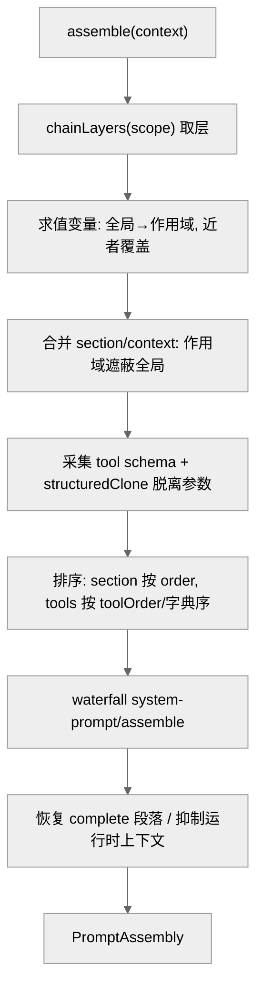
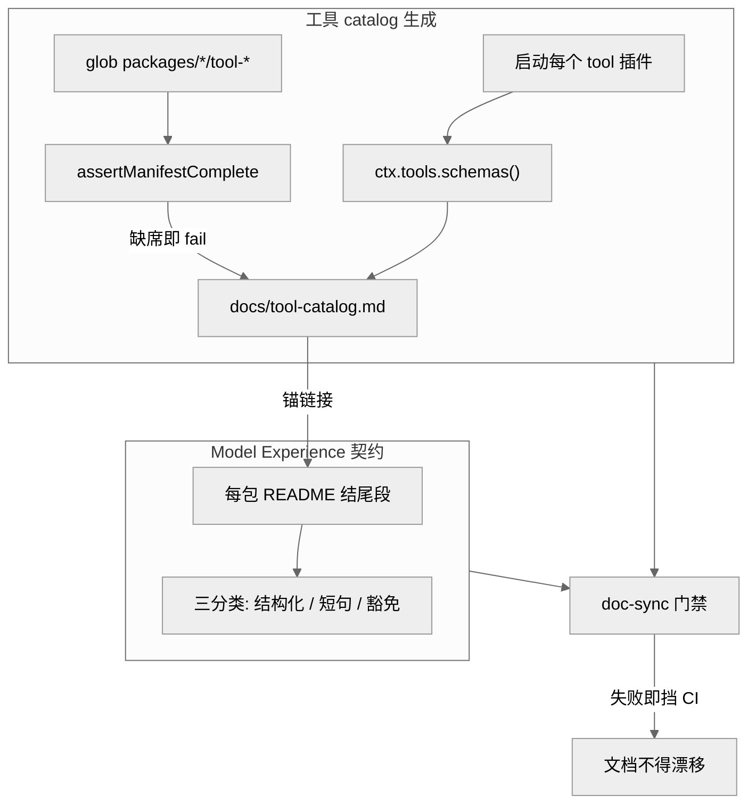

# 第 08 章 · 系统提示词与工具 Schema 组装

> 本章讲一件事：模型每一步"看到什么"是怎么被拼出来的。读完你能回答——系统提示词的各段落、工具的 JSON Schema、动态运行时上下文、模板变量，分别由谁贡献、按什么顺序在每一步合流成一次模型请求；`ctx.systemPrompt` 这个注册表服务的四类注册与一次瀑布组装如何配合；以及为什么"每个包的 README 必须写 Model Experience"、工具 Schema catalog 为何要靠"启动并采集"而非解析源码来生成门禁。

## 一、本质是什么

先说结论：DeepSeek Harness 里，模型每一步请求的"提示词面"（就是模型这一步能看到的那段文字加上可调用的工具清单）不是一段写死的字符串，而是一次**组装的产物**。承担这次组装的是 core 层的 `@deepseek-ai/dsh-system-prompt` 包，它导出一个 Cordis 服务 `SystemPrompt`，挂在 `ctx.systemPrompt` 上 [verified]（`packages/core/system-prompt/src/index.ts:13-16,338`）。（Cordis 是这套项目用的插件框架，"服务"可以理解成挂在全局 `ctx` 上、任何插件都能取用的一个共享对象。）

它的角色是一个**注册表**。打个比方：它像一块公告栏——各个插件把自己拥有的"提示词事实"贴上去，服务在每一步真正要发请求时，把公告栏上所有贴纸收齐、排好序、再跑一遍"大家轮流过目并可修改"的协作式瀑布，最后产出一个 `PromptAssembly`（组装成品）。

它能收四类可注册的贡献 [verified]（`index.ts:381-455`）：

- **section**（`PromptSection`）——系统提示词里的一个有序段落（比如"你是谁""bash 工具怎么用"各是一段）；
- **context**（`PromptContext`）——动态运行时上下文，也就是随时会变的现场信息（当前时间、打开了哪些文件等），最终以 user 角色的快照落进模型历史；
- **tools**（tool-schema provider）——本次组装里模型可见的工具 Schema 集合（每个工具长什么样、收哪些参数）；
- **variable**——段落文本里用 `{{name}}` 引用的模板变量，组装时才被填进实际值。

这与总纲的架构命题一致：连"模型看到的提示词"本身都不是内核特权，而是由插件贡献、可组合、可按作用域覆盖的东西。`SystemPrompt` 自己只握着两段最基础的文本——固定的 harness 身份行，和留给部署方填 persona 的一个槽位——其余全部来自贡献者 [verified]（`index.ts:356-370`）。对使用者来说，这意味着想改模型看到的某段话，改的是"拥有那段话的那个插件"，而不是去动一个中心大模板。

<div style="background: #ffffff !important; background-color: #ffffff !important; padding: 16px; border-radius: 8px; margin: 16px 0;" bgcolor="#ffffff">



</div>

> 图注：四类贡献汇入同一注册表，一次 `assemble()` 产出 `PromptAssembly`，再分别渲染成 system 字符串、tools 字段、上下文快照三路进入模型请求。证明了"提示词面"是组装出来的，而非单一模板。

## 二、核心问题与痛点

一个 agent harness 的提示词面临三重张力。**其一，谁拥有哪段文字？** bash 工具的用法说明理应由 bash 包写，plan 模式的说明理应由 plan 包写，不能全塞进一个中心模板——否则每加一个工具都要回去改那个模板，谁都动它、谁都可能改坏。**其二，同一份组装要按作用域分叉。** 一个进程里可能同时跑主 agent 和多个 subagent，每个 agent 的 persona、可见工具、可见段落都可能不同，但底层注册表是共享的一份——好比同一份原料，要按不同菜谱端出不同的菜。**其三，模型看见的必须可复现。** 总纲的"model-visible ⟺ logged"（凡模型看得见的，都必须被记进日志）不变量要求：任何进入模型请求的东西都要能从会话日志重建——所以动态上下文不能只是临时拼进 prompt 就算了，而要作为可溯源的快照事件落库。

waterfall（瀑布式）组装正是对这三重张力的回答，一句话概括就是：**贡献分散、组装集中、作用域分叉、渲染可溯源**。

## 三、解决思路与方案

### 3.1 瀑布组装的六个阶段

`assemble(context)` 是整章的枢纽 [verified]（`index.ts:467-542`）。它接收一个 merge-extensible 的 `AssembleContext`（一个可被各方补充字段的上下文对象，携带可选 `scope` 作用域与 `signal` 取消信号），按固定顺序做六件事：

1. **取作用域链**：`chainLayers(scope)` 拿到全局层 + 作用域链上各层（像"全局 → 当前 agent"这样一条从远到近的链）；顺带判断运行时上下文是否被抑制。
2. **解析变量**：先算全局、再沿作用域链"由远及近"求值，近作用域的同名变量覆盖全局 [verified]（`index.ts:473-482`）——即"离得越近说了算"。
3. **合并段落与上下文**：`merge(scope, …)` 让作用域段落遮蔽同名全局段落（某 agent 想改写某段，就在自己这层放一个同名段盖住全局那段）。
4. **采集工具 Schema**：遍历全局 + 作用域的 tool provider，对每个返回的 `parameters` 做 `structuredClone` **脱离**（detach，即深拷贝出一份独立副本），并累积 `knownNames` 预限制名集 [verified]（`index.ts:487-503`）。
5. **规范排序**：段落按 `order` 升序排；工具按 `orderTools` 施加 `toolOrder`，没配就退化为字典序 [verified]（`index.ts:164-178,504,529`）。
6. **跑瀑布**：`ctx.waterfall(scopeTarget(this, scope), 'system-prompt/assemble', assembly, context, …)`，其返回值**权威**（以瀑布跑完的结果为准）；之后若存在 `complete` 段落则把它恢复为唯一段落，若上下文被抑制则清空 contexts [verified]（`index.ts:532-542`）。

关键设计点是**排序发生在瀑布之前**。段落 order 排序与 `toolOrder` 都是对"注册表里贡献了什么"的规范化——因为注册顺序只是插件加载先后的偶然产物，不该让它决定模型看到的次序。至于瀑布监听器若还要再改动列表，那它就得自己对输出的确定性负责 [verified]（README `Config.toolOrder` 条目）。这一步的意义在于：把"排出一个确定次序"和"允许大家协作改写"拆成两件事，谁也不踩谁。

<div style="background: #ffffff !important; background-color: #ffffff !important; padding: 16px; border-radius: 8px; margin: 16px 0;" bgcolor="#ffffff">



</div>

> 图注：一次组装的六阶段流水线。排序在瀑布之前完成、脱离拷贝在采集时完成，证明了"规范化"与"协作式改写"被刻意分成两个不同责任段。

### 3.2 order 波段：谁排在模型眼前

段落顺序由 `order` 数字决定（数字小的排在前面），并有一套"波段"约定——把号段划给不同用途，就像给楼层分区 [verified]（`index.ts:56-61`）：`-100` 是 harness 身份行、`0` 是部署 persona（`PERSONA_SECTION`/`PERSONA_ORDER`）、工具用法指引占 `100–199` 这一段。`SystemPrompt` 在构造时就先注册了身份行与 persona 槽这两段，而且身份行独立于所选的 loop 插件，保证不管换哪套主循环，"harness 开场白"都稳定不变 [verified]（`index.ts:356-370`）。工具顺序同理走中心化的 `toolOrder` 显式列表（含一个 `<unlisted-tools>` rest 标记安置未列出的工具），没配到的退化为字典序——而且是 code-unit 比较、locale 无关，保证跨机器确定 [verified]（`index.ts:164-183`）。之所以不给每个插件发一个"优先级权重"再归并，第一性的理由是"模型读到的顺序"是一个需要被单点掌控、可复现的事实，分散权重会让全局顺序无处可读、冲突难裁决。

### 3.3 作用域分叉：一份注册表，多个 agent 视图

注册是通过 `ctx.effect()` 完成的，它会落在**当前调用上下文的作用域层**里（`PromptLayer`/`ScopedLayers`）。在 `agent.ctx` 上注册的段落/变量只对该 agent 生效，并遮蔽掉同名的全局项 [verified]（`index.ts:316-324,381-390`）。工具这一侧更复杂一点：`ToolRuntime` 在构造时把自己注册成一个 tool provider——`ctx.systemPrompt.tools(context => this.wireSchemas(context.scope))` [verified]（`packages/core/tools/src/index.ts:832`）。于是"某个作用域到底能看见哪些工具"不是事先固定的，而是由 `view(scope)` 当场现算：先对**继承面**（从上层继承下来的工具）施加限制——`restrict()` 只允许在本作用域内调用——再叠加本层自己新注册的工具和保留的 code-mode 传输位 [verified]（`tools/src/index.ts:1152-1192,1071-1096`）。

正因如此，`ToolProviderResult` 带了两个字段：`schemas`（本次实际可见的那一集）与 `knownNames`（做限制之前的已知全集）。留着后者是为了让 `toolOrder` 校验能分清两种情况——一个名字是"根本拼错了/没这个工具"，还是"这工具存在、只是本作用域故意把它藏起来了" [verified]（`index.ts:103-109`；docs/subsystems/system-prompt.md:27-38）。

## 四、实现细节关键点

**每步一次组装。** 模型每走一步，都会重新组装一次。agent-loop 在 `preStep` 里调用 `this.loopCtx.systemPrompt.assemble(assembleContextFor(this, signal))` [verified]（`packages/core/agent-loop/src/agent.ts:230`）；随后 `renderContextSections` + `joinContextSections` 把动态上下文投影成一条 user 角色的快照消息（`runtimeContext.project`，`agent.ts:232-233`），`step()` 里 `renderPrompt(assembly)` 把各段落插值成 system 字符串 [verified]（`agent.ts:337`），`assembly.tools` 则作为一个独立的 wire 字段随请求发出。这里正是"model-visible ⟺ logged"的落点：现场上下文被做成一条消息事件，而不是悄悄拼进 prompt，所以事后能从日志一字不差地重建。

**严格变量插值。** `renderPrompt` 只认完整成对的 `{{name}}`，名字还须匹配 `^[a-z][a-z0-9_]*$`；遇到未知引用（用 `Object.hasOwn` 查，像 `{{constructor}}` 这种原型上的名字也算未知）、已注册但取值为 `undefined`、或残缺不成对的组，一律直接抛错；只有孤立的 `{{`（后面根本没有 `}}`）才当普通字面量原样透传，而且替换进去的值不会被再扫一遍（避免值里恰好含 `{{…}}` 被二次解释）[verified]（`index.ts:212-295`）。这是"误配 fail-loud"（配错就当场大声报错）在提示词层的体现——宁可让这一步失败，也不把一段畸形提示词发给模型。

**complete 段落。** 一个标了 `complete: true` 的段落等于宣告"我就是完整的系统提示词，别的段都不算"。即便如此瀑布照样跑（好让 tools/上下文/变量仍被正常解析），跑完再把这一段恢复成唯一段落；若同时出现不止一个有效的 complete 段落，则组装直接失败 [verified]（`index.ts:505-517,536-541`）。这个口子留给兼容型部署用——比如要把整段 prompt 交给某个外部协议接管时。

**参数脱离拷贝。** 采集时对每个工具的 `parameters` 都做一次 `structuredClone`（`index.ts:495-499`），所以瀑布监听器拿到的是副本；它爱怎么改都行，动不到注册表里那份原始 Schema。这相当于把"改稿只改复印件、原件不动"落实到组装内部，也是"发布点才提交状态"纪律的一次应用。

<div style="background: #ffffff !important; background-color: #ffffff !important; padding: 16px; border-radius: 8px; margin: 16px 0;" bgcolor="#ffffff">

```mermaid
%%{init: {'theme':'neutral'}}%%
sequenceDiagram
  participant Loop as agent-loop
  participant SP as ctx.systemPrompt
  participant WF as assemble 监听器
  participant LLM as ctx.llm
  Loop->>SP: assemble(assembleContextFor(agent, signal))
  SP->>SP: 合并/排序 sections·contexts·tools·variables
  SP->>WF: waterfall system-prompt/assemble
  WF-->>SP: 权威 PromptAssembly (须 next 传递)
  SP-->>Loop: PromptAssembly (complete/抑制已应用)
  Loop->>Loop: renderPrompt → system
  Loop->>Loop: renderContextSections → user 快照消息
  Loop->>LLM: stream(request: system + tools + messages)
```

</div>

> 图注：一步之内组装与请求的时序。证明了 assemble 是同步聚合 + 异步瀑布的混合，且渲染分成 system 与 user 快照两路，呼应事件溯源不变量。

## 五、易错点与注意事项

- **瀑布监听器必须 `next()`**：`system-prompt/assemble` 是 expert waterfall（一条各监听器接力传递的链），谁不调用 `next()` 就等于把整条链掐断在自己这里——后面的贡献全丢，而 `agent.ts` 又只认瀑布返回的那个最终值 [verified]（AGENTS.md "Waterfall listeners MUST call next()"）。
- **`toolOrder` 误配会延后才暴露**：形状层面的错（有重复项、漏了 rest 标记）在 load 时就抛错；但"列了一个根本没注册的工具名"这种错，要等到第一次 `assemble()` 才被 reject——好在那就是首轮，一样会 fail、不会带病跑很久 [verified]（README 已知局限；`index.ts:146-157,170-173`）。
- **`order` 相同的段落靠注册顺序决胜负（tie-break）**，而注册顺序是加载先后的偶然产物；所以确定性靠的是"不同段用不同 order 波段"这个约定，它不像工具顺序那样被强制规范化 [verified]（README 已知局限）。
- **`restrict()` 只能限本作用域内的调用**：如果拿它做全局限制，会一下遮蔽掉所有 agent，因此被显式拒绝；而且它只过滤"从上层继承来的那部分工具"，不碰作用域**自己**注册的工具——这就保证了 subagent 的 report/结构化输出这类它自带的工具，不会被"允许能力"清单的过滤给误删掉 [verified]（`tools/src/index.ts:1071-1096,1137-1148`）。
- **signal 只对本次请求有效**，用完即弃，不能留着给后续回合复用——否则本次的一个取消动作会误伤到未来的 turn [verified]（`index.ts:44-49`；docs 说明）。

## 六、工具 Schema catalog 与 Model Experience 契约

前面讲的都是机制本身；这两者则是把这些机制"制度化"、用自动检查兜住的两道门禁。

**工具 Schema catalog（`docs/tool-catalog.md`）**：它是一份清单，列出每个随发行插件贡献给 `ctx.tools` 的工具的 name/description/JSON-Schema。关键不在这份清单长什么样，而在它怎么生成的——`scripts/gen-tool-catalog.ts` 会真的把每个工具插件**启动**到一个真实 Context 上，再调 `ctx.tools.schemas()` 读出模型运行时真正会收到的 `ToolSchema[]`，而不是去解析源码"看它写了什么" [verified]（2026-07-02 note；`gen-tool-catalog.ts:622-634`）。一句话：以运行时真值为准，不以代码字面为准。之所以不能走"纯 AST 遍历源码"这条更省事的路，根子在于工具 Schema **静态不可知**——`tool-todo` 的 `enum` 是运行时 spread、description 靠字符串拼接、`tool-subagent` 的名字来自 `config.toolName`、MCP 插件更是直接注册裸 JSON Schema，硬解析源码只会产出"说谎的文档"；代价是无源码声明集可枚举、新工具包可能被漏掉，于是用**完整性守卫** `assertManifestComplete`（glob `packages/*/tool-*`、任何包缺席 boot 清单即 hard-fail）把 AST 免费获得的"不漏"属性重建回来 [verified]（`gen-tool-catalog.ts:581-588,622-623`）。

生成出来的这份清单还会被 `verify-tool-catalog`（`doc-sync` 里的一环）持续验鲜：只要 Schema 变了而提交进仓库的文件没跟着更新，CI 就失败；有新的 `tool-*` 包没被收进清单，完整性守卫会直接报错 [verified]（tool-catalog.md:8）。这与 cordis catalog 形成对照——后者用纯 AST pass（静态扫源码）就够，因为事件名/服务名都是能从源码回溯的静态字符串字面量。同一条"验实际的世界、而不是听它自述"的纪律，针对两类文档各自挑了合适的技术。

**Model Experience 契约（每个包的 README 必写）**：2026-07-12 note 规定，凡是带"模型可见/与模型邻接"契约的 workspace 包，其 README 结尾都必须有一段 `## Model Experience`，且放在 `## Known Limitations` 之前 [verified]（`2026-07-12-...contract.md`）。这段按三种情形分类写：真正影响模型输入的，用结构化写法——"每个上下文面一个 H3 + 三个有序 H4：What the model sees（模型看到什么）/ Token effect（占多少 token）/ KV Cache effect（对缓存前缀的影响）"；对模型零影响或只是纯转发的，用审计过的固定短句（`None, as …` / `Indirectly, through …`）交代清楚；与模型完全无关的通用包，则经 `NO_MODEL_EXPERIENCE_SECTION` 显式豁免。`verify-package-readme-model-experience` 会在 doc-sync 里逐项校验：分类对不对、段落次序对不对、字段的深度与顺序对不对、逐字内容是否用 H5 承载、以及到工具 catalog 的锚链接是否有效 [verified]（cookbook adding-a-package.md:105-107）。system-prompt 包自己的 README 就作了示范，写了 System prompt 与 Tool schemas 两个 H3 [verified]（README:49-83）。

它想解决的痛点是：在插件架构下，"到底哪些 token 进了模型请求、进的条件是什么、会留存多久、KV-cache 前缀稳不稳"这些问题极难审计——consumer 可能把后端结果转成一条 tool 消息、policy 插件可能把一次成功悄悄换成错误、compaction 可能删掉旧历史、agent-scoped 注册可能只动其中一个 agent。有了逐包一段的结构化契约，审阅者从任意一个与模型邻接的包读起，就能看清它对模型输入贡献了什么，而不必先在脑子里把整张插件关系图重建一遍。

<div style="background: #ffffff !important; background-color: #ffffff !important; padding: 16px; border-radius: 8px; margin: 16px 0;" bgcolor="#ffffff">



</div>

> 图注：两道门禁——catalog 靠"启动采集 + 完整性守卫"防漏防漂，README 靠分类校验强制每包自述模型体验，二者都汇入 doc-sync。证明了"模型看到什么"在此仓库是被门禁托底的可审计事实。

## 七、竞品/横向对比与仍存的局限

社区对 dsh 工具调用采用严格 JSON Schema 有正面评价（HN 上 JonChesterfield 称其超过 Codex）[claimed]（社区认知地图 E 节）。但那更多是外在观感；从本章看到的机制层面，真正的区别在于：**提示词与 Schema 都被从"内核特权"降格为可组合、可按作用域覆盖、可用门禁验鲜的普通插件贡献**。不过这并不等于"注册表 + 作用域瀑布全面更优"：分散所有权与门禁是应对"多 agent、可替换插件、大规模并行开发"的必要代价，而对只跑单一 persona、固定工具集的小型部署，中心模板的简单未必更差——机制层已 [verified]，"更优"则是语境依赖的 [inferred] 判断。

**仍存的局限**（以下均 [verified] 于 README 已知局限）：`{{…}}` 没有字面量转义语法（想在提示词里原样输出两个花括号目前没有官方写法），这一项被 deferred，等真有 prompt 需要再补；`toolOrder` 误配要延后到首轮 assemble 才报；同 order 段落的 tie-break 靠注册顺序、依赖波段约定而非强制规范化；部署方也没有一个面向终端用户的 prompt 编辑 API——想改提示词文本，只能走 config/composition，或者去改拥有那段文字的那个插件。

## 小结与衔接

回头看，本章把"模型每步看到什么"这件事，还原成了一次 `assemble()`：四类插件贡献（section/context/tools/variable）先合并、按作用域遮蔽、规范排序、再跑一遍协作式瀑布，产出 `PromptAssembly`，最后渲染成 system 字符串、tools 字段与可溯源的 user 上下文快照，兵分三路进入请求。而两道门禁——boot-and-harvest（启动采集）生成的工具 catalog，与逐包必写的 Model Experience 契约——则把"模型到底看到了什么"托底成可审计、防漂移的事实。

上游是第 07 章的会话日志（上下文快照为何必须是事件、"model-visible ⟺ logged"从哪来），下游是第 09 章的工具注册表与执行管线（`ToolRuntime` 如何把 `assembly.tools` 背后的定义真正执行、`restrict()` 如何在执行点而非仅 Schema 层强制），以及第 11 章能力接缝三角色（工具 Schema 稳定、provider 可替换的接缝根源）。

## 源码索引

- `packages/core/system-prompt/src/index.ts:13-39` — `ctx.systemPrompt` 声明合并、`system-prompt/assemble` 瀑布与 `system-prompt/change` emit 事件。
- `packages/core/system-prompt/src/index.ts:41-120` — `AssembleContext`/`PromptSection`/`PromptContext`/`ToolProviderResult`/`PromptAssembly` 类型。
- `packages/core/system-prompt/src/index.ts:128-183` — `PERSONA_SECTION`/`PERSONA_ORDER`、`TOOL_ORDER_REST`、`validateToolOrder`/`orderTools`/`compareToolNames`。
- `packages/core/system-prompt/src/index.ts:212-295` — `renderPrompt`/`renderContextSnapshot`/`interpolate` 严格变量插值。
- `packages/core/system-prompt/src/index.ts:356-370` — 构造时注册 harness 身份行与 persona 槽。
- `packages/core/system-prompt/src/index.ts:381-455` — `section`/`context`/`suppressRuntimeContext`/`tools`/`variable` 四类注册。
- `packages/core/system-prompt/src/index.ts:467-542` — `assemble()` 六阶段组装、complete 恢复、上下文抑制。
- `packages/core/tools/src/index.ts:832` — `ToolRuntime` 自注册为 tool provider。
- `packages/core/tools/src/index.ts:1071-1096,1152-1192` — `restrict()` 作用域限制与 `view(scope)` 派生可见集。
- `packages/core/agent-loop/src/agent.ts:230-243,337` — 每步 `assemble` 与 `renderPrompt`/上下文快照投影。
- `docs/subsystems/system-prompt.md` — 组装契约与生成的 Cordis API 区。
- `docs/tool-catalog.md`、`scripts/gen-tool-catalog.ts:581-634` — boot-and-harvest 生成与 `assertManifestComplete` 完整性守卫。
- `.agents/notes/implemented/process/2026-07-02-tool-schema-catalog.md` — "启动而非解析"的决策与理由。
- `.agents/notes/implemented/process/2026-07-12-package-model-experience-contract.md`、`docs/cookbook/adding-a-package.md:105-107` — Model Experience 契约与门禁。
