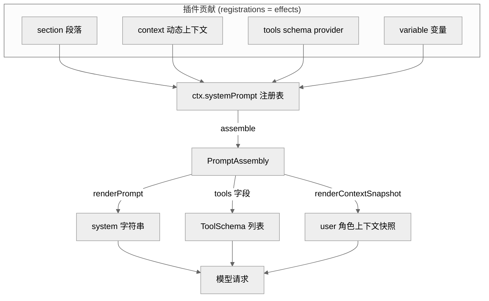
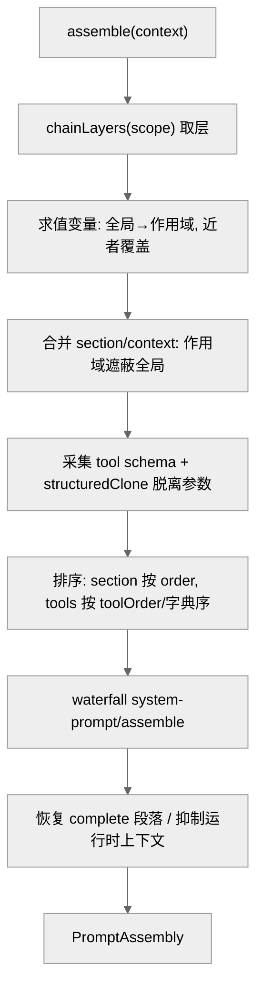
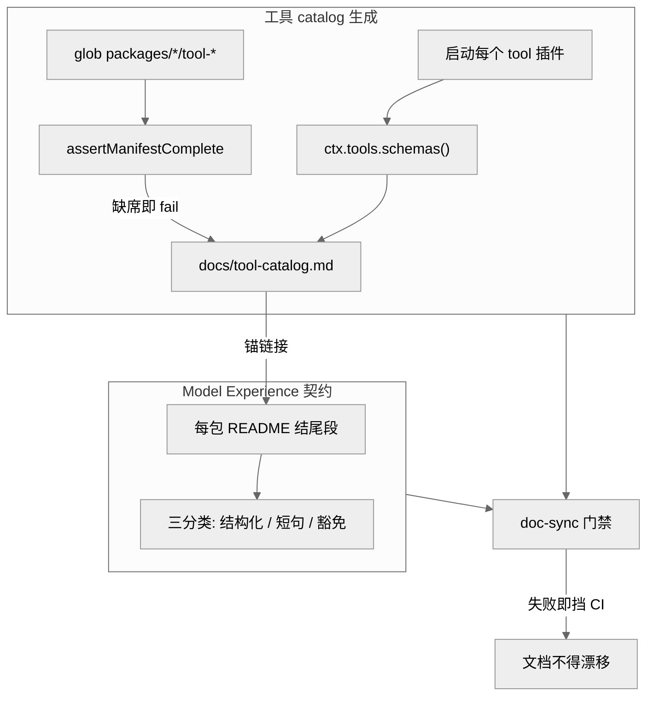

# 第 08 章 · 系统提示词与工具 Schema 组装

> 本章讲一件事：模型每一步"看到什么"是怎么被拼出来的。读完你能回答——系统提示词的各段落、工具的 JSON Schema、动态运行时上下文、模板变量，分别由谁贡献、按什么顺序在每一步合流成一次模型请求；`ctx.systemPrompt` 这个注册表服务的四类注册与一次瀑布组装如何配合；以及为什么"每个包的 README 必须写 Model Experience"、工具 Schema catalog 为何要靠"启动并采集"而非解析源码来生成门禁。

## 一、本质是什么

DeepSeek Harness 里，模型每一步请求的"提示词面"不是一段写死的字符串，而是一次**组装的产物**。承担这次组装的是 core 层的 `@deepseek-ai/dsh-system-prompt` 包，它导出一个 Cordis 服务 `SystemPrompt`，挂在 `ctx.systemPrompt` 上 [verified]（`packages/core/system-prompt/src/index.ts:13-16,338`）。它是一个**注册表**：插件把自己拥有的"提示词事实"注册进来，服务在每步组装时把所有贡献合流、排序、跑一遍协作式瀑布，产出一个 `PromptAssembly`。

它管四类可注册的贡献 [verified]（`index.ts:381-455`）：

- **section**（`PromptSection`）——系统提示词的有序段落；
- **context**（`PromptContext`）——动态运行时上下文，最终以 user 角色快照落进模型历史；
- **tools**（tool-schema provider）——本次组装模型可见的工具 Schema 集合；
- **variable**——段落文本里 `{{name}}` 引用的模板变量。

这与总纲的架构命题一致：连"模型看到的提示词"本身都不是内核特权，而是由插件贡献、可组合、可按作用域覆盖的东西。`SystemPrompt` 只拥有两段最基础的文本——固定的 harness 身份行与部署 persona 槽——其余全部来自贡献者 [verified]（`index.ts:356-370`）。

<div style="background: #ffffff !important; background-color: #ffffff !important; padding: 16px; border-radius: 8px; margin: 16px 0;" bgcolor="#ffffff">



</div>

> 图注：四类贡献汇入同一注册表，一次 `assemble()` 产出 `PromptAssembly`，再分别渲染成 system 字符串、tools 字段、上下文快照三路进入模型请求。证明了"提示词面"是组装出来的，而非单一模板。

## 二、核心问题与痛点

一个 agent harness 的提示词面临三重张力。**其一，谁拥有哪段文字？** bash 工具的用法说明该由 bash 包写，plan 模式的说明该由 plan 包写，不能全塞进一个中心模板。**其二，同一份组装要按作用域分叉。** 一个进程里可能同时跑主 agent 和多个 subagent，每个 agent 的 persona、可见工具、可见段落都可能不同，但底层注册表是共享的。**其三，模型看见的必须可复现。** 总纲的"model-visible ⟺ logged"不变量要求：任何进入模型请求的东西都要能从会话日志重建——所以动态上下文不能只是拼进 prompt，而要作为可溯源的快照事件落库。

waterfall 组装正是对这三重张力的回答：**贡献分散、组装集中、作用域分叉、渲染可溯源**。

## 三、解决思路与方案

### 3.1 瀑布组装的六个阶段

`assemble(context)` 是整章的枢纽 [verified]（`index.ts:467-542`）。它接收一个 merge-extensible 的 `AssembleContext`（携带可选 `scope` 与 `signal`），按固定顺序做六件事：

1. **取作用域链**：`chainLayers(scope)` 拿到全局层 + 作用域链上各层；判断运行时上下文是否被抑制。
2. **解析变量**：先全局、再沿作用域链"由远及近"求值，近作用域同名变量覆盖全局 [verified]（`index.ts:473-482`）。
3. **合并段落与上下文**：`merge(scope, …)` 让作用域段落遮蔽同名全局段落。
4. **采集工具 Schema**：遍历全局 + 作用域的 tool provider，对每个返回的 `parameters` 做 `structuredClone` **脱离**（detach），并累积 `knownNames` 预限制名集 [verified]（`index.ts:487-503`）。
5. **规范排序**：段落按 `order` 升序；工具按 `orderTools` 施加 `toolOrder` 或退化为字典序 [verified]（`index.ts:164-178,504,529`）。
6. **跑瀑布**：`ctx.waterfall(scopeTarget(this, scope), 'system-prompt/assemble', assembly, context, …)`，返回值**权威**；之后若存在 `complete` 段落则将其恢复为唯一段落，若上下文被抑制则清空 contexts [verified]（`index.ts:532-542`）。

关键设计点是**排序发生在瀑布之前**：段落 order 排序与 `toolOrder` 都是对"注册表贡献了什么"的规范化（注册顺序只是插件加载的偶然产物），瀑布监听器若要再改动列表，则自己负责它输出的确定性 [verified]（README `Config.toolOrder` 条目）。

<div style="background: #ffffff !important; background-color: #ffffff !important; padding: 16px; border-radius: 8px; margin: 16px 0;" bgcolor="#ffffff">



</div>

> 图注：一次组装的六阶段流水线。排序在瀑布之前完成、脱离拷贝在采集时完成，证明了"规范化"与"协作式改写"被刻意分成两个不同责任段。

### 3.2 order 波段：谁排在模型眼前

段落顺序由 `order` 数字决定，并有一套波段约定 [verified]（`index.ts:56-61`）：`-100` 是 harness 身份行、`0` 是部署 persona（`PERSONA_SECTION`/`PERSONA_ORDER`）、工具用法指引占 `100–199`。`SystemPrompt` 构造时就注册了身份行与 persona 槽两段，且身份行独立于所选 loop 插件，保证"harness 开场白"稳定 [verified]（`index.ts:356-370`）。

> **ratify-note · 为什么用一个中心 `toolOrder` + order 数字，而非每插件权重**
> - 候选解释：A 中心化列表（`toolOrder` 显式列全，含一个 `<unlisted-tools>` rest 标记）+ 段落 order 数字；B 每个插件自带优先级权重，组装时归并；C 沿注册顺序（什么都不做）。
> - 各自利弊：A 优——顺序在一处可读、跨机器确定（字典序 code-unit 比较，locale 无关，`index.ts:180-183`）、误配 fail-loud；缺——`toolOrder` 误配要到首次 assemble 才报未知名（README 已知局限）。B 优——插件自治；缺——全局顺序无处可读、权重冲突难裁决。C 优——零成本；缺——顺序随加载而漂移，不可复现。
> - 选定 & 理由：选 A。第一性上"模型读到的顺序"是一个需要被单点掌控且可复现的事实；源码用字典序兜底 + rest 标记插入未列工具，兼顾显式与省心 [verified]（`index.ts:164-178`）。
> - 证据等级：[verified]（`index.ts:146-183`；README `toolOrder` 条目）。
> - 残余风险 / pre-mortem：若半年后被证伪，最可能因大型部署里 `toolOrder` 维护成本超过其可读收益，退回"分组权重"。

### 3.3 作用域分叉：一份注册表，多个 agent 视图

注册通过 `ctx.effect()`，落在**调用上下文的作用域层**里（`PromptLayer`/`ScopedLayers`）。`agent.ctx` 上注册的段落/变量只对该 agent 生效并遮蔽同名全局项 [verified]（`index.ts:316-324,381-390`）。工具侧更复杂：`ToolRuntime` 在构造时把自己注册为一个 tool provider——`ctx.systemPrompt.tools(context => this.wireSchemas(context.scope))` [verified]（`packages/core/tools/src/index.ts:832`），于是"某作用域可见哪些工具"由 `view(scope)` 现算：先对**继承面**施加限制（`restrict()` 仅允许作用域内调用），再叠加本层自有注册与保留的 code-mode 传输位 [verified]（`tools/src/index.ts:1152-1192,1071-1096`）。`ToolProviderResult` 因此带两个字段：`schemas`（本次可见集）与 `knownNames`（预限制全集，供 `toolOrder` 校验区分"配错的名字"与"本作用域故意隐藏的已知工具"）[verified]（`index.ts:103-109`；docs/subsystems/system-prompt.md:27-38）。

## 四、实现细节关键点

**每步一次组装。** agent-loop 在 `preStep` 里调用 `this.loopCtx.systemPrompt.assemble(assembleContextFor(this, signal))` [verified]（`packages/core/agent-loop/src/agent.ts:230`）；随后 `renderContextSections` + `joinContextSections` 把动态上下文投影成一条 user 角色快照消息（`runtimeContext.project`，`agent.ts:232-233`），`step()` 里 `renderPrompt(assembly)` 把段落插值成 system 字符串 [verified]（`agent.ts:337`），`assembly.tools` 作为独立 wire 字段随请求发出。这正是"model-visible ⟺ logged"的落点：上下文快照是消息事件，可从日志重建。

**严格变量插值。** `renderPrompt` 只认完整的 `{{name}}` 组，名字须匹配 `^[a-z][a-z0-9_]*$`；未知引用（用 `Object.hasOwn` 查，`{{constructor}}` 这类原型名算未知）、已注册但取值为 `undefined`、畸形组，一律抛错；孤立 `{{`（其后无 `}}`）当字面量透传，替换值不再二次扫描 [verified]（`index.ts:212-295`）。这是"误配 fail-loud"在提示词层的体现——宁可让这步失败，也不发出畸形提示词。

**complete 段落。** 一个 `complete: true` 的段落声明"我就是完整系统提示词"：瀑布照跑（好让 tools/上下文/变量仍被解析），跑完把该段恢复为唯一段落；多于一个有效 complete 段落则组装失败 [verified]（`index.ts:505-517,536-541`）。兼容型部署（如把整段 prompt 交给外部协议）用它接管。

**参数脱离拷贝。** 采集时对每个工具的 `parameters` 做 `structuredClone`（`index.ts:495-499`），瀑布监听器拿到的是副本，改动不会污染注册表里的原始 Schema——这是"发布点才提交状态"纪律在组装内部的一次应用。

<div style="background: #ffffff !important; background-color: #ffffff !important; padding: 16px; border-radius: 8px; margin: 16px 0;" bgcolor="#ffffff">

```mermaid
%%{init: {'theme':'neutral'}}%%
sequenceDiagram
  participant Loop as agent-loop
  participant SP as ctx.systemPrompt
  participant WF as assemble 监听器
  participant LLM as ctx.llm
  Loop->>SP: assemble(assembleContextFor(agent, signal))
  SP->>SP: 合并/排序 sections·contexts·tools·variables
  SP->>WF: waterfall system-prompt/assemble
  WF-->>SP: 权威 PromptAssembly (须 next 传递)
  SP-->>Loop: PromptAssembly (complete/抑制已应用)
  Loop->>Loop: renderPrompt → system
  Loop->>Loop: renderContextSections → user 快照消息
  Loop->>LLM: stream(request: system + tools + messages)
```

</div>

> 图注：一步之内组装与请求的时序。证明了 assemble 是同步聚合 + 异步瀑布的混合，且渲染分成 system 与 user 快照两路，呼应事件溯源不变量。

## 五、易错点与注意事项

- **瀑布监听器必须 `next()`**：`system-prompt/assemble` 是 expert waterfall，不调用 `next()` 会短路整条链（`agent.ts` 依赖返回值权威性）[verified]（AGENTS.md "Waterfall listeners MUST call next()"）。
- **`toolOrder` 误配延后暴露**：形状错误（重复项、缺 rest 标记）在 load 抛错；但"列了一个没注册的工具名"要到首次 `assemble()` 才 reject——首轮就 fail [verified]（README 已知局限；`index.ts:146-157,170-173`）。
- **同 `order` 段落按注册顺序 tie-break**，是加载偶然产物；确定性依赖"不同 order 波段"约定，不像工具顺序被规范化 [verified]（README 已知局限）。
- **`restrict()` 只能作用域调用**：全局限制会遮蔽所有 agent，被显式拒绝；且限制只过滤"继承面"，不过滤作用域**自有**注册——这保证 subagent 的 report/结构化输出工具不会被"允许能力"的过滤误删 [verified]（`tools/src/index.ts:1071-1096,1137-1148`）。
- **signal 是本次请求值**，不得留存用于后续回合（否则一次取消会误伤未来 turn）[verified]（`index.ts:44-49`；docs 说明）。

## 六、工具 Schema catalog 与 Model Experience 契约

这两者是把上述机制"制度化"的两道门禁。

**工具 Schema catalog（`docs/tool-catalog.md`）**：它列出每个 shipped 插件贡献给 `ctx.tools` 的 name/description/JSON-Schema。关键在生成方式——`scripts/gen-tool-catalog.ts` **启动**每个工具插件到真实 Context 上，调 `ctx.tools.schemas()` 读取模型真正会收到的 `ToolSchema[]`，而非解析源码 [verified]（2026-07-02 note；`gen-tool-catalog.ts:622-634`）。

> **ratify-note · 为什么"启动并采集"而非"解析 AST"生成工具 catalog**
> - 候选解释：A boot-and-harvest（启动插件读注册表）；B 纯 TypeScript AST 遍历（像 cordis catalog 那样）。
> - 各自利弊：A 优——读到的是运行时真值；缺——无源码声明集可枚举，新工具包可能被漏掉。B 优——枚举源码天然完备、无需启动；缺——工具 Schema **静态不可知**：`tool-todo` 的 `enum:[...STATUSES]` 是运行时 spread、description 由字符串拼接、`tool-subagent` 名字是 `config.toolName`、MCP 插件可直接注册裸 JSON Schema——AST 会产出"说谎的文档"。
> - 选定 & 理由：选 A，并用**完整性守卫** `assertManifestComplete` glob `packages/*/tool-*`、任何包缺席 boot 清单即 hard-fail，把 B 免费获得的"不漏"属性重建出来 [verified]（`gen-tool-catalog.ts:581-588,622-623`）。
> - 证据等级：[verified]（`.agents/notes/.../2026-07-02-tool-schema-catalog.md`）。
> - 残余风险 / pre-mortem：若被证伪，最可能因 boot 清单的手写"启动配方"维护负担增长——但该 note 明确论证 provider/config 是策略、不可从布局安全推断，故保留手写。

生成物由 `verify-tool-catalog`（`doc-sync` 一环）验鲜：Schema 变了而提交文件没跟上即 CI 失败；新 `tool-*` 包没进清单则完整性守卫直接报错 [verified]（tool-catalog.md:8）。这与 cordis catalog（纯 AST pass，因为事件/服务名都是可回溯静态声明的字符串字面量）形成对照——同一"验世界而非自述"的纪律，对两类文档用了两种恰当技术。

**Model Experience 契约（包 README 必写）**：2026-07-12 note 规定，每个带模型可见/邻接契约的 workspace 包 README 结尾必须有 `## Model Experience` 段（在 `## Known Limitations` 之前）[verified]（`2026-07-12-...contract.md`）。它按三种分类：结构化形式用"每上下文面一个 H3 + 三个有序 H4：What the model sees / Token effect / KV Cache effect"；零影响或纯转发用审计过的短句（`None, as …` / `Indirectly, through …`）；模型无关的通用包经 `NO_MODEL_EXPERIENCE_SECTION` 豁免。`verify-package-readme-model-experience` 在 doc-sync 校验分类、段序、字段深度与顺序、H5 承载逐字块、工具-catalog 锚链接 [verified]（cookbook adding-a-package.md:105-107）。system-prompt 包自己的 README 就示范了 System prompt 与 Tool schemas 两个 H3 [verified]（README:49-83）。

其解决的问题是：插件架构下"哪些 token 进了模型请求、条件是什么、留存多久、KV-cache 前缀是否稳定"极难审计——consumer 可能把后端结果变成 tool 消息、policy 插件可能把成功替换成错误、compaction 可能删旧史、agent-scoped 注册可能只改一个 agent。逐包一段结构化契约，让审阅者从任一模型邻接包起步即可看清其贡献，而无需重建整张插件图。

<div style="background: #ffffff !important; background-color: #ffffff !important; padding: 16px; border-radius: 8px; margin: 16px 0;" bgcolor="#ffffff">



</div>

> 图注：两道门禁——catalog 靠"启动采集 + 完整性守卫"防漏防漂，README 靠分类校验强制每包自述模型体验，二者都汇入 doc-sync。证明了"模型看到什么"在此仓库是被门禁托底的可审计事实。

## 七、竞品/横向对比与仍存的局限

社区对 dsh 工具调用的严格 JSON Schema 有正面评价（HN JonChesterfield 称超过 Codex）[claimed]（社区认知地图 E 节）。但那是表象，本章看到的机制层面区别在于：**提示词与 Schema 都被降格为可组合、可按作用域覆盖、可门禁验鲜的插件贡献**。

> **ratify-note · dsh 的 waterfall 组装相较通用 harness 是否更优**
> - 候选解释：A 单一中心模板/常量拼接（多数轻量 harness 的默认）；B dsh 的注册表 + 作用域瀑布 + 门禁。
> - 各自利弊：A 优——简单、少抽象、易读一眼看全；缺——所有权集中、无作用域分叉、加工具即改中心文件。B 优——所有权分散到拥有该事实的包、天然支持多 agent 视图、误配 fail-loud、文档由 catalog/README 门禁托底；缺——机制复杂（层、瀑布、脱离拷贝、complete 语义），首次阅读成本高。
> - 选定 & 理由：在"多 agent、可替换插件、AI 大规模并行开发"的语境下选 B——分散所有权与门禁是应对规模的必要代价；但对小型单-agent 部署，A 的简单未必更差。故不下"B 全面更优"的定论，只说"B 匹配 dsh 的规模与可替换性目标"。
> - 证据等级：[inferred]（机制 [verified] 于本章源码；"更优"是语境依赖判断）。
> - 残余风险 / pre-mortem：若被证伪，最可能因绝大多数真实部署只跑单一 persona + 固定工具集，此时瀑布/作用域的表达力闲置而复杂度全额付出。

**仍存的局限**（均 [verified] 于 README 已知局限）：`{{…}}` 无字面量转义语法，deferred 到真有 prompt 需要；`toolOrder` 误配延后到首轮 assemble 才报；同 order 段落 tie-break 靠注册顺序、依赖波段约定而非规范化；部署方无端用户级 prompt 编辑 API——提示词文本只能经 config/composition 或拥有该事实的插件贡献。

## 小结与衔接

本章把"模型每步看到什么"拆成一次 `assemble()`：四类插件贡献（section/context/tools/variable）经合并、作用域遮蔽、规范排序、协作式瀑布，产出 `PromptAssembly`，再渲染成 system 字符串、tools 字段与可溯源的 user 上下文快照三路进入请求。两道门禁——boot-and-harvest 的工具 catalog 与逐包 Model Experience 契约——把"模型看到什么"托底成可审计、防漂移的事实。

上游是第 07 章的会话日志（上下文快照为何必须是事件、"model-visible ⟺ logged"从哪来），下游是第 09 章的工具注册表与执行管线（`ToolRuntime` 如何把 `assembly.tools` 背后的定义真正执行、`restrict()` 如何在执行点而非仅 Schema 层强制），以及第 11 章能力接缝三角色（工具 Schema 稳定、provider 可替换的接缝根源）。

## 源码索引

- `packages/core/system-prompt/src/index.ts:13-39` — `ctx.systemPrompt` 声明合并、`system-prompt/assemble` 瀑布与 `system-prompt/change` emit 事件。
- `packages/core/system-prompt/src/index.ts:41-120` — `AssembleContext`/`PromptSection`/`PromptContext`/`ToolProviderResult`/`PromptAssembly` 类型。
- `packages/core/system-prompt/src/index.ts:128-183` — `PERSONA_SECTION`/`PERSONA_ORDER`、`TOOL_ORDER_REST`、`validateToolOrder`/`orderTools`/`compareToolNames`。
- `packages/core/system-prompt/src/index.ts:212-295` — `renderPrompt`/`renderContextSnapshot`/`interpolate` 严格变量插值。
- `packages/core/system-prompt/src/index.ts:356-370` — 构造时注册 harness 身份行与 persona 槽。
- `packages/core/system-prompt/src/index.ts:381-455` — `section`/`context`/`suppressRuntimeContext`/`tools`/`variable` 四类注册。
- `packages/core/system-prompt/src/index.ts:467-542` — `assemble()` 六阶段组装、complete 恢复、上下文抑制。
- `packages/core/tools/src/index.ts:832` — `ToolRuntime` 自注册为 tool provider。
- `packages/core/tools/src/index.ts:1071-1096,1152-1192` — `restrict()` 作用域限制与 `view(scope)` 派生可见集。
- `packages/core/agent-loop/src/agent.ts:230-243,337` — 每步 `assemble` 与 `renderPrompt`/上下文快照投影。
- `docs/subsystems/system-prompt.md` — 组装契约与生成的 Cordis API 区。
- `docs/tool-catalog.md`、`scripts/gen-tool-catalog.ts:581-634` — boot-and-harvest 生成与 `assertManifestComplete` 完整性守卫。
- `.agents/notes/implemented/process/2026-07-02-tool-schema-catalog.md` — "启动而非解析"的决策与理由。
- `.agents/notes/implemented/process/2026-07-12-package-model-experience-contract.md`、`docs/cookbook/adding-a-package.md:105-107` — Model Experience 契约与门禁。
