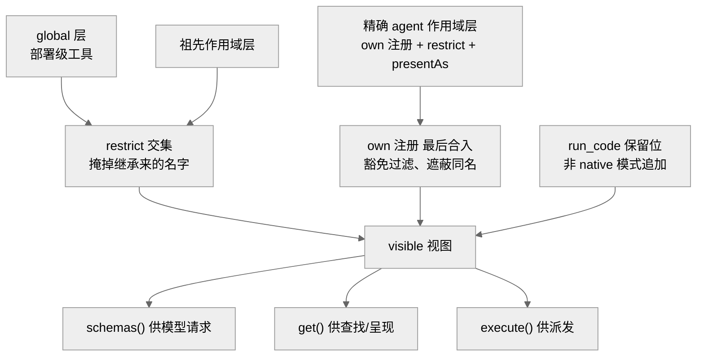
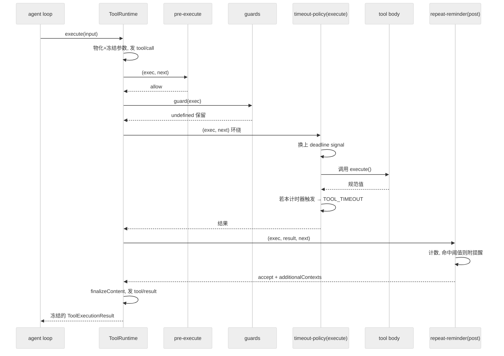
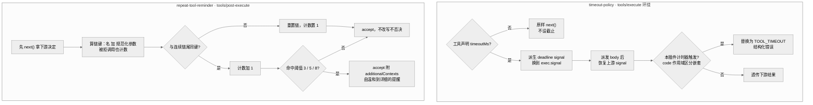

# 第 09 章 · 工具注册表与执行管线

> 本章讲 `dsh` 如何把"一个模型想调用的工具"从一句 JSON 请求，安全地送到真正的副作用执行，再把结果送回模型与 UI（User Interface，用户界面）。读完你能回答：工具在哪里注册、作用域怎么隔离；一次调用要穿过哪几道闸；`guard` 如何做超时与循环卫生；以及为什么工具的 UI 呈现是"参数的纯函数"。

## 一、本质是什么

可以把工具子系统想成一道海关：模型想"对外面的世界做点什么"（写文件、跑一条 shell 命令），都必须从这一道关口过检，别无旁路。它就是 agent loop 与"外部世界的副作用"之间唯一的受控闸门，由两个概念组成：**注册表**（`ctx.tools`，类型 `ToolRuntime`）持有所有 `ToolDefinition`，回答"这个作用域现在能看到、能调用哪些工具"——相当于海关手里那份"允许通行的清单"；**执行管线**把一次被接受的调用，按固定顺序穿过若干可扩展的 waterfall 与单调 guard，最终产出一个不可变的 `ToolExecutionResult`——相当于过检的流水线，每一关盖一个章，最后给出不能再改的结论。

这里先解释两个反复出现的词。**waterfall**（瀑布）指一串监听器排成队，前一个处理完主动调 `next()` 把控制权交给下一个，任何一个都可以中途拦下、短路整条链——像一层层筛子，谁都能喊停。**guard**（守卫）则是单独一道只能"收紧、不能放松"的闸——它只会降权，不会开绿灯。

`ctx.tools` 的服务契约在 `packages/core/tools/src/index.ts:787` 定义 `[verified]`。它一句话概括了自己的设计：作用域注册遮蔽全局（scoped shadows global），一个可见性解析器同时喂给呈现、查找与派发三条路径（`index.ts:784`）`[verified]`。也就是说，"模型看到什么工具"和"真正能执行什么工具"由同一份解析结果保证一致，避免了"schema 里有、执行时没有"这类漂移。对使用者来说，这意味着模型不会请求一个它根本调不动的工具，也不会有"藏着的工具"绕过展示层被偷偷执行。

## 二、核心问题与痛点

放到 agent harness 语境，工具执行要同时满足几组彼此拉扯的诉求：

- **安全**：模型生成的参数不可信，副作用（写文件、跑 shell）必须先过权限/审批；同一进程里的多个 agent 不能互相看到不该看的工具。
- **可扩展**：超时、重试、审批、沙箱、结果改写、循环检测……这些横切策略不能塞进每个工具，也不能改动 agent-loop 本体（AGENTS.md 铁律"Plugins, not loop changes"）。
- **可追溯**：凡是模型能看到的输入，必须能从会话日志重建（"Model-visible ⟺ logged"）。
- **可呈现**：同一次调用要在 CLI（Command-Line Interface，命令行界面）、编辑器等多种前端里有像样的卡片，却不能让 UI 词汇污染模型请求。

难点在于：这些策略必须**有序**且**语义清晰**——审批能问、能拒，但"拒了不能被后面的监听器翻案"（否则一条恶意或写错的监听器就能把"不许"改成"许"）；超时能改 signal（用来通知工具"该停了"），但不能把调用身份改掉（否则日志里记的和真正执行的对不上）。换句话说，这里既要留出足够的可扩展空间，又要守住几条不容商量的底线。

## 三、解决思路与方案

`dsh` 的答案是一条"三段 waterfall + 中间夹一道单调 guard"的执行管线，加上作用域化的注册表。`ctx.tools.execute()` 接收调用输入，把参数一次性物化并冻结（"物化"即把它拷成一份不可变的定值、之后谁都改不动），然后依次跑：`tools/pre-execute`（可重排的 allow/deny/ask waterfall，"这次调用放不放行、要不要先问用户"）→ 注册的单调 guards（只减权的兜底闸）→ `tools/execute`（around-dispatch 包装器，即在真正派发前后各裹一层，比如计时、重试）→ tool body（工具本体真正干活）→ `tools/post-execute`（检查/替换结果）→ 定义自带的 `finalizeContent` → `tools/result`（不可变权威结局）`[verified]`（`docs/subsystems/tools.md`；`index.ts:1342` 的 `execute()` 与各事件 `index.ts:152/163/175/197`）。顺序是固定的，这样任何一次调用都会以完全相同的步骤过检，行为可预测、可复盘。

<div style="background: #ffffff !important; background-color: #ffffff !important; padding: 16px; border-radius: 8px; margin: 16px 0;" bgcolor="#ffffff">

```mermaid
%%{init: {'theme':'neutral'}}%%
flowchart TD
  call["ctx.tools.execute(input)"]
  freeze["物化并冻结参数<br/>分配 opaque token"]
  pre["tools/pre-execute waterfall<br/>allow / deny / ask"]
  guard["单调 guards<br/>只能降权，不能放行"]
  around["tools/execute waterfall<br/>超时/重试/度量 环绕派发"]
  body["注册工具 execute() 本体"]
  postx["tools/post-execute waterfall<br/>accept / block / replace / 附带上下文"]
  fin["finalizeContent<br/>内容级最后一公里"]
  res["tools/result emit<br/>冻结的权威结局"]
  call --> freeze --> pre --> guard --> around --> body --> postx --> fin --> res
  pre -.deny/ask 拒绝.-> postx
  guard -.deny.-> postx
```
<div align="center"><sub>图 1：执行管线的固定顺序。三段 waterfall 各司其职，中间夹一道无法被翻案的单调 guard；拒绝路径也要流经 post-execute。</sub></div>
</div>

三段 waterfall 的返回值都是"典型化 Decision"（用一组固定的、语义明确的结论来回话，而不是随手返回布尔值；与 `agent/*` waterfall 同惯用法）：`pre-execute` 返回 `PreToolDecision`（`allow`/`deny`/`ask`——放行、拒绝、或先问用户），`post-execute` 返回 `PostToolDecision`（`accept`/`block`，可替换 content 或 value 之一，或附 `additionalContexts`）`[verified]`（`tools.md` 的两个 `type-equiv`）。关键的非对称设计是 **guard 没有 allow 结果**：`ToolGuard` 返回 `undefined` 保留决定、返回 reason 只能减权，所以监听器顺序无法把一次拒绝翻回许可（`tools.md:313-325`）`[verified]`。这就像一道单向阀门——只能往"更严"的方向拧，任凭后面排多少个监听器，也没有哪个能把已经拒掉的调用重新放行。

### 作用域化注册

注册表不是一张平表，而是**分层作用域视图**——不妨类比操作系统里的目录权限：全局是"系统默认"，每个 agent 有自己的"用户目录"，同名时用户目录里的东西盖过系统默认。`register(definition)` 既可注册到全局，也可注册到调用方的 agent 作用域，scoped 遮蔽 global，同层重名与保留名 `run_code` 都会失败（`index.ts:1037`）`[verified]`。可见性解析器 `view(scope)`（`index.ts:1152`）按"最远祖先在前、精确作用域在后"合并链上各层：继承面里近祖遮蔽远祖，而作用域**自己**的注册排在最后、且不受过滤器约束（`index.ts:1176-1183`）`[verified]`。"近祖遮蔽远祖"可以理解成一层层往下继承时，离你越近的那层说了算。

`restrict(filter)` 是一个作用域对它**继承**到的工具施加的 allow/deny 掩码：多个 restriction 求交集（越叠越窄），但作用域自己的注册永远豁免——这样一个被委派的子 agent 不会因为一条过滤器而丢掉它赖以应答的机制工具（`tools.md:153-168`、`index.ts:1174` 的 `layers.every(...admits)`）`[verified]`。这条设计的用意是：过滤器只用来收窄"从上面继承来的"能力，而不该殃及子 agent 自带、干活离不开的那几件工具。`presentAs(mode)` 则是作用域级"以某种呈现模式（native / code）示人"的声明，每作用域仅一条，用于 agent preset 在同一进程里让 Code Mode agent 与原生 agent 并存（`index.ts:946`）`[verified]`。

<div style="background: #ffffff !important; background-color: #ffffff !important; padding: 16px; border-radius: 8px; margin: 16px 0;" bgcolor="#ffffff">


<div align="center"><sub>图 2：一个可见性解析结果同时喂给 schemas/get/execute，保证"模型看到"与"实际可调"一致。restrict 只作用于继承层，own 注册豁免。</sub></div>
</div>

## 四、实现细节关键点

**身份保护与参数冻结**。进入策略前，`createExecution()`（`index.ts:1364`）先把 `arguments` 用 `snapshotJsonValue` 做一次无损 JSON 物化（原样拷成一份 JSON 快照），非 JSON 输入直接 `TypeError` 拒绝，再 `deepFreeze` 冻结（连嵌套字段一起锁死，之后谁也改不动），并分配一个不透明的 `ToolExecutionToken`（一个 `Symbol`，仅供身份比较——就像一张只能用来核对"是不是同一次调用"的号牌，看不出内容、也伪造不了）`[verified]`。`callId`、`name`、`arguments`、`agent`、`token`、必需的 `signal` 与可选的 `parent` token 全程只读。唯一能被改的是 signal——但只能在 `tools/execute` 环绕包装器里"替换而不能移除"，注册表在进 body 前会把调用方原始 signal 重新融合回去（`ToolDispatchExecution`，`tools.md:299-311`）`[verified]`。

**参数不可改写，是有意的**。`PreToolDecision` 明确排除了输入改写，因为"历史、审计、UI、执行必须一致"（`tools.md:402`）`[verified]`——参数在调用被接受时就已经记录并呈现，事后再偷偷改写会让日志里写的和实际跑的对不上。设想一下：UI 上显示"删除 /tmp/a"，执行时却被改成删了别的目录，事后翻日志根本还原不出真相——冻结参数正是为了堵死这种分叉。

**guard 家族：loop-hygiene 与超时闸**。这里的 "loop-hygiene"（循环卫生）指的是别让模型陷进"同一个动作反复做、原地打转"的死循环。`packages/guard` 下两个插件是执行管线扩展点的示范用户，正好展示了"横切策略如何以插件形式挂上去、而不动 loop 本体"：

- `timeout-policy`（`packages/guard/timeout-policy/src/index.ts`）注册一个 `tools/execute` 环绕包装器：读出工具声明的 `timeoutMs`（工具自己声明"我最多跑这么久"），无预算就原样 `next()`；有预算则用 `deadline(exec.signal, timeoutMs, TOOL_TIMEOUT)` 派生一个带截止的 signal 换到 `exec.signal` 上（等于给这次执行装了个闹钟），派发后再恢复上游 signal；**只有当本插件自己的计时器触发**（用 code 作用域区分嵌套外层的 deadline，避免把别人的超时算到自己头上）才把结果替换成结构化的 `TOOL_TIMEOUT` 错误（`index.ts:56-80`）`[verified]`。它是协作式的——工具声明 `timeoutMs` 就等于承诺会转发 `exec.signal` 并能在收到中止时干净地停下；注册表无法硬杀同进程代码（就像闹钟只能提醒你，却不能替你按停一个不理会闹钟的人）。
- `repeat-tool-reminder`（`packages/guard/repeat-tool-reminder/src/index.ts`）是**咨询式循环卫生**（只提醒、不强制）：它按 agent 维护一条"连续重复链"，把调用名 + 深度键排序后的规范化参数作为链键（把参数整理成一个稳定、可比对的指纹），命中阈值（默认 `[3,5,8]`）时，通过 `tools/post-execute` 的 `additionalContexts` 注入一条 `{kind:'plugin'}` 来源的提醒——先温和、后详细，不否决、不改写（`index.ts:189-224`）`[verified]`。像同事看你连着三次点同一个失灵的按钮，先轻声提一句、还不停再详细说明，但绝不动手替你决定。两个精妙点：**计数放在 post-execute** 而非 pre，因为被拒的调用也流经这条 waterfall，"模型反复捶一个被拒的调用"正是最该打断的循环（`index.ts:181-188` 注释）`[verified]`；用户插话则在 `agent/pre-step` 清空链，因为跨越用户消息的重复不算循环（`index.ts:229-232`）`[verified]`。

<div style="background: #ffffff !important; background-color: #ffffff !important; padding: 16px; border-radius: 8px; margin: 16px 0;" bgcolor="#ffffff">


<div align="center"><sub>图 3：一次调用穿过管线的时序。timeout-policy 环绕 body 并只在自己计时器触发时改写结果；repeat-reminder 在 post 阶段计数并搭车提醒。</sub></div>
</div>

把两个 guard 单独看其判定逻辑，能更清楚"闸怎么合、提醒怎么发"：timeout-policy 只有在预算存在且**本插件自己的计时器**触发时才改写结果，否则一律透传；repeat-tool-reminder 先取下游决定再折叠提醒，且对被拒调用同样计数。

<div style="background: #ffffff !important; background-color: #ffffff !important; padding: 16px; border-radius: 8px; margin: 16px 0;" bgcolor="#ffffff">


<div align="center"><sub>图 4：guard 卫生机制的两条判定流。左：超时闸只在自身计时器触发时替换为 TOOL_TIMEOUT，否则透传；右：重复调用提醒按链键计数、命中阈值才搭车注入，全程不否决不改写。</sub></div>
</div>

**结果结构与 spill**。`ToolExecutionResult` 是判别联合（一个"要么成功、要么失败"的二选一类型，靠一个标志区分两种形态，避免出现"既有结果又有错误"的模糊状态）：成功携带执行局部的规范 `value`（`JsonValue`）、`content`、可选 `meta`、`additionalContexts` 与 `concludesTurn`；失败只有 `error`、无 `value`（`tools.md:337-367`）`[verified]`。规范 `value` 是**执行局部**的（只在这一次执行过程里存在、事后不保存）：loop 只持久化 `content`/`error`/`meta`，重放能重建呈现但重建不出中间规范值（`tools.md:370`）`[verified]`。当工具产出的文本过大时，结果不进模型上下文而是**溢出（spill）**到私有会话文件——好比一封超厚的资料不硬塞进信封，而是存进档案柜、信里只放一张取件条：这是一条独立可选能力接缝 `dsh-spill`（"能力接缝"即一组可插拔、可替换的服务约定；这里包含 Service Definition `ctx.spillStore` + local provider + `tools/post-execute` 的 spill-policy），它保存文本并回给模型一个 locator 与取回指引，而非塞满上下文（`docs/subsystems/spill.md:5`）`[verified]`。Code Mode 的子派发则走 `tools/code-dispatch-log` waterfall，溢出策略在那里替换的是**持久日志副本**里的 content，程序本身仍收到完整 value（`tools.md:601-626`）`[verified]`。

**UI render intent 是参数的纯函数**。"纯函数"指同样的输入永远给出同样的输出，不碰外部世界（不读文件、不看时钟、不掷随机数）。工具的呈现与 `output.render`（面向模型的内容）是两件事——一件给人看（卡片长什么样），一件给模型读（内容是什么），刻意分开，免得 UI 用词污染模型请求：`presentCall(args)` 返回 pending 卡（调用发起时"进行中"的卡片）、`presentResult(args, result)` 返回 completed 卡（结果出来后的成品卡片），都是 `card`-tagged 判别联合——`ToolCallView` 有 `generic`/`terminal`/`diff` 三种，`ToolResultView` 另加 `search`/`read`/`web`（`presentation.ts:46/140`）`[verified]`。`generic` 卡带 `locations`（`{path, line?}[]`，供编辑器"跟随/跳转"到调用读写的文件）、`terminal` 卡把命令渲染成终端卡、`diff` 卡把 `{path, oldText, newText}` 渲成内联 diff（`presentation.ts:15-117`）`[verified]`。硬规则：这些方法在实时流式与会话日志**重放**两种场景都会被调用，所以必须是 `args`（+结果）的纯函数——无 I/O、无读会话状态、无时钟/随机（`docs/cookbook/adding-a-tool.md:86`）`[verified]`。道理很直白：几个月后回放一段旧会话，磁盘上的文件早就变了，若卡片渲染时还去读当前文件，画出来的就不是当时那一幕。所以卡片只能由当时记下的参数决定。AGENTS.md 把这条上升为铁律："工具的 UI render intent 是其设计的一部分，前置决定"。

## 五、易错点与注意事项

- **`timeoutMs`/`isConcurrencySafe`/`presentCall` 等绝不能上线**（"上线"指进到发给模型的 schema 里）：`schemas()` 用显式白名单只投影 name/description/parameters（只挑这三样露出去，其余一概拦下），其余回调若泄进模型请求即是 bug（`tools.md:11`、`index.ts:1234`）`[verified]`。
- **声明 `timeoutMs` 是一种承诺**：它断言该工具会转发 `exec.signal` 给一个能在中止时停稳的协作式实现，否则超时无效（`tools.md:56-60`）`[verified]`。
- **waterfall 监听器必须调 `next()`**：不调即短路整条链（AGENTS.md 铁律）；`repeat-reminder` 就是先 `next()` 拿到下游决定，再把提醒折叠上去（`index.ts:213-224`）`[verified]`。
- **post-execute 只能替换 content 或 value 之一**：替换 content 保留规范 value（呈现策略），要藏掉程序值必须 `block` 或替换 value（保密策略）——两者语义不同（`tools.md:404`）`[verified]`。
- **`presentCall` 里想拿"文件旧内容/工作目录"就是信号**：那属于持久结果元数据或 UI 适配器，不属于纯函数呈现器（cookbook:86）`[verified]`。
- **Code Mode 下模型直呼原生工具会被拒**（Code Mode 即模型写代码、由代码去转呼工具，而非直接点名调用）：`mode:'code'` 时只有带 `parent` token 的转呼可执行原生工具名，模型直呼（无 parent）在策略管线前就以 `UNKNOWN_TOOL` 拒绝（`tools.md:204`）`[verified]`。这个 `parent` token 就是前面那张身份号牌，证明"这次调用确实是从代码转过来的"。

## 六、竞品/横向对比

社区注意到 `dsh` 的工具调用采用严格 JSON schema（用 JSON 精确描述每个工具收哪些参数、类型与约束），有评论称其超过 Codex（HN（Hacker News，技术圈常逛的新闻与讨论社区）上的 JonChesterfield）`[claimed]`（社区认知地图 E 节）。但比外在观感更本质的区别在机制层：多数 harness 把工具执行做成"loop 里的一个 if/switch + 若干硬编码钩子"，超时/审批/沙箱/循环检测彼此纠缠，加一道横切策略就得改 loop、易引入顺序 bug；dsh 则把每道策略都做成类型化事件（waterfall/emit）的可插拔扩展点，工具本体只负责产出一个规范 JSON 值——`tool-execution-pipeline.md` 明说这条管线让 hook"跨工具族而不与某个策略服务耦合"。与 Claude Code / Codex 的具体内部实现无法逐行对照（属 `[inferred]`），但从公开的严格 schema 与可插拔策略看，dsh 把"横切策略与工具本体解耦"做得更彻底。

## 七、仍存在的问题与局限

先厘清一个常被当成缺陷的边界：注册表**无法硬杀同进程代码**。这不是再加一层 waterfall 就能修掉的漏洞，而是 Node 单进程模型的物理事实——文档明确写了"cannot hard-kill same-process code"（`tools.md:35` `[verified]`），设计已把责任前置为工具声明 `timeoutMs` 时的协作式承诺（承诺会转发 `exec.signal` 并在中止时停稳）；真正的硬隔离要靠 subprocess / E2B（一个面向 AI agent 的云端沙箱服务）沙箱能力接缝（另章）。若某高价值工具长期不转发 signal，`timeoutMs` 会形同虚设，但那是工具实现违约、可由 e2e（end-to-end，端到端测试，即把整条链路当真跑一遍来验收）/snapshot 暴露。

其余已知边界：规范 `value` 不持久化，重放只能重建呈现而非中间值（`tools.md:370`）`[verified]`；`SESSION_FORMAT_VERSION` 仍为 `0`、无兼容承诺（AGENTS.md）`[verified]`，属预发布阶段有意为之；`timeout-policy` 自身还挂着一条改名 `dsh-timeout-guard` 的 FIXME（`index.ts:6-9`）`[verified]`，说明包边界仍在收敛。

## 小结与衔接

工具子系统把"模型的一句调用"变成一条可审计、可扩展、可呈现的受控流水线：作用域注册表用一份可见性解析保证"看得到 ⟺ 调得到"；三段 waterfall 承载可协商策略、中间一道单调 guard 承载不可翻案的拒绝；`guard` 家族用超时闸与循环卫生守住 agent loop 的健康；`presentCall`/`presentResult` 让每次调用在多种前端里有像样的卡片，且始终是参数的纯函数。这条管线正是上一章"agent loop 唯一具体实现"派发工具的落点，也是下一章"能力接缝 Definition/Provider/Consumer"的上游——shell、fs、web、subagent 等能力，最终都以 `ToolDefinition` 的形态注册进这张表、走这条管线。

## 源码索引

- `packages/core/tools/src/index.ts:787`（`ctx.tools` = `ToolRuntime` 服务契约）
- `packages/core/tools/src/index.ts:1342`（`execute()` 入口）、`:1364`（`createExecution` 物化/冻结/token）、`:1152`（`view()` 可见性解析）、`:1037`（`register`）、`:1071`（`restrict`）、`:1110`（`guard`）、`:946`（`presentAs`）、`:1234`（`schemas`）、`:1276`（`executionMode`）
- `tools/*` 事件：`index.ts:152`（pre-execute）、`:163`（execute）、`:175`（post-execute）、`:189`（code-dispatch-log）、`:197`（result）、`:207`（change）
- 错误码：`index.ts:469`（`TOOL_ABORTED`）、`:472`（`TOOL_ABORTED_BEFORE_DISPATCH`）、`:490`（`UNKNOWN_TOOL`）
- `packages/guard/timeout-policy/src/index.ts:25/56-80`（`TOOL_TIMEOUT` + `tools/execute` 环绕）
- `packages/guard/repeat-tool-reminder/src/index.ts:189-232`（`observe`/post-execute/pre-step 复位）；默认阈值 `[3,5,8]` 于 `:29/46`
- `packages/core/tools/src/presentation.ts:15/23/46/140`（`ToolCallKind`/`FileLocation`/`ToolCallView`/`ToolResultView`）
- 文档：`docs/subsystems/tools.md`、`docs/tool-execution-pipeline.md`、`docs/cookbook/adding-a-tool.md`、`docs/subsystems/spill.md`
- AGENTS.md 铁律："Plugins, not loop changes"、"Model-visible ⟺ logged"、"A tool's UI render intent is part of its design"
