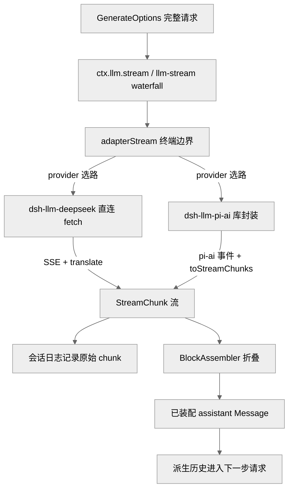
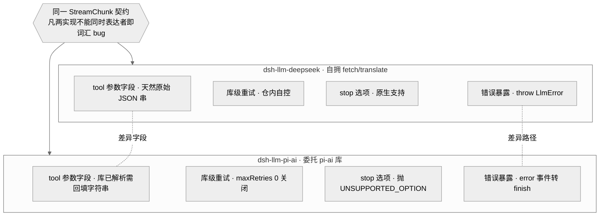
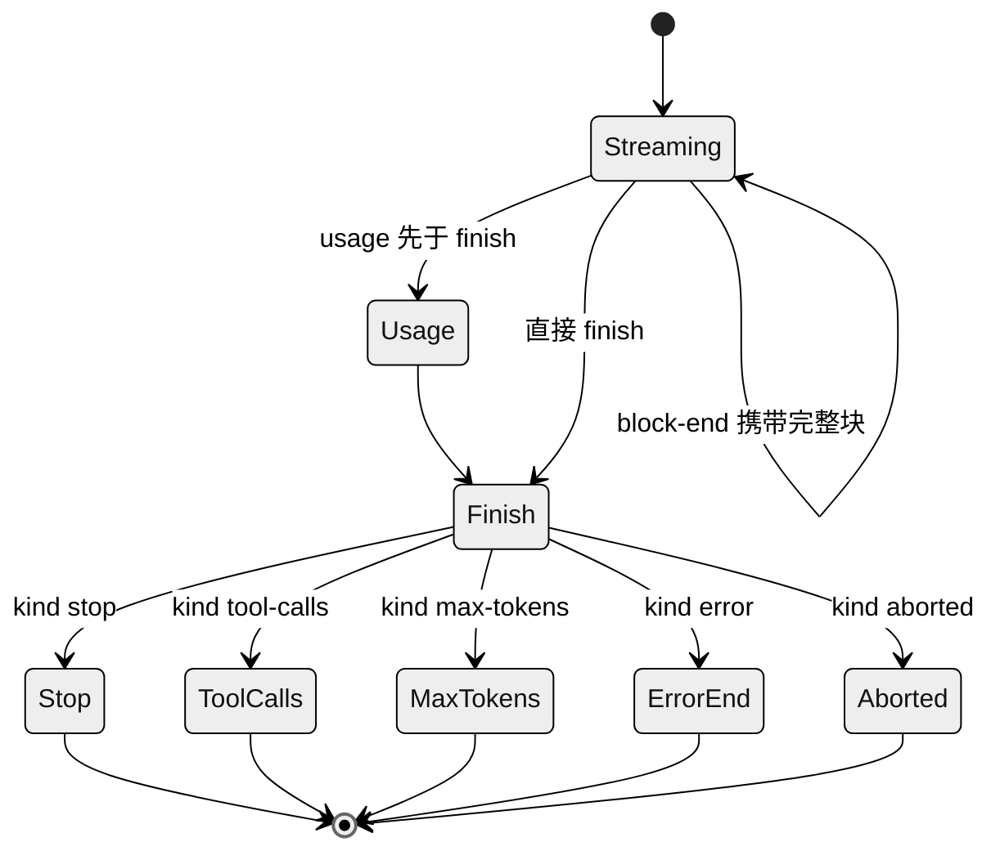
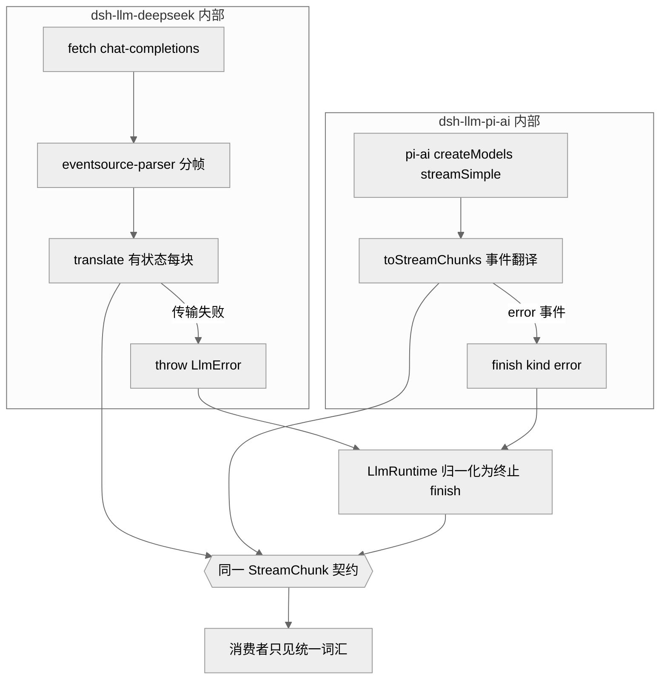

# 第 10 章 · LLM 适配器与流式词汇

> 本章讲 `dsh` 如何把大语言模型（Large Language Model，简称 LLM，即会话式 AI 背后的那个模型）"输出的内容"这件事抽象成一套 provider 中立的词汇：`StreamChunk` 原始流式协议、以内容块（content block）为单位的消息表示，以及一个抽象的 `LlmAdapter` 接缝。读完你能回答三个问题：模型的流式响应在 harness 内部长什么样、这套词汇凭什么敢自称"中立"、以及两个真实适配器（直连 fetch 的 `dsh-llm-deepseek` 与库封装的 `dsh-llm-pi-ai`）如何互为"设计验证孪生"。

证据等级沿用全书约定：`[verified]` 源码可证 · `[inferred]` 合理推断 · `[claimed]` 二手口径。

## 一、本质是什么

`dsh` 的信念是"模型是 agent 的灵魂、一切皆可替换插件"。要让模型可替换，就必须先有一层不依赖任何具体 provider 的内部语言：agent loop、会话日志、所有插件都只说这门语言，具体某家 provider 的 SSE（Server-Sent Events，服务器发送事件，即服务器沿一条 HTTP 连接把结果一小段一小段推送过来的机制）分帧、字段命名、错误编码都被挡在一层适配器之后。

打个比方：这就像联合国开会用一门统一的工作语言，各国代表说自己的母语，但都由同声传译转成这门共同语言，会场里的人无需懂任何一门外语就能跟上讨论。这里的"共同语言"由 `packages/llm` 定义，"同声传译"就是每家 provider 各自的适配器。

它由三组东西构成 `[verified]`：

1. **内容块词汇**——一条 `Message` 不是一整段字符串，而是一组带 `type` 标签的内容块数组，块类型由可合并扩展的 `ContentBlockMap` 派生（`types.ts:99`）：`text`（正文）、`reasoning`（思维过程）、`image`（图片）、`tool-call`（工具调用）、`tool-result`（工具结果）。就像一封富文本邮件由若干段落、图片、附件拼成，而不是一大团纯文本。
2. **`StreamChunk` 原始流式协议**——适配器吐出的 token 级增量（`types.ts:291`），也就是模型"一个字一个字往外蹦"时，每蹦一小段所对应的最小事件。
3. **`LlmAdapter` 抽象类 + `ctx.llm` 服务**——provider 后端的唯一接入点，唯一必实现方法是 `stream()`（`index.ts:180`、`index.ts:284`）。想接一家新模型，本质就是实现好这一个方法。

`ctx.llm` 本身是一个 Cordis 服务（`class LlmRuntime extends Service`，`index.ts:284`；Cordis 是本项目的插件/依赖注入框架，"服务"即挂在共享上下文上、供各处按名取用的能力）。它是"能力接缝"（Ch11）在模型域的实例：Service Definition 是 `LlmAdapter` 契约，Provider 是各家适配器插件，Consumer 是 agent loop。所谓"接缝"，就像墙上的标准插座——`registerAdapter` 换一次适配器，等于换一只灯泡，背后接的电路（agent loop、日志、插件）一根线都不用动，整个产品背后的模型就换掉了。

## 二、核心问题与痛点

一个 agent harness 面对模型输出，天然有几个难题：

- **多块交错**。开启思维模式后，一次响应里 `reasoning` 与 `text`、甚至多个并行 `tool-call` 会交错到达——好比几个人同时往一条传送带上放零件，先后混在一起。消费者需要知道哪个增量属于哪个块。
- **provider 词汇各异**。DeepSeek 走 OpenAI 兼容的 chat-completions SSE，`finish_reason`（结束原因）是 `stop`/`length`/`tool_calls`；pi-ai 库有自己的一套事件（`text_delta`/`thinking_delta`/`toolcall_end`/`done`/`error`）。连"工具参数"这一项，一家给的是原始 JSON（JavaScript Object Notation，一种通用的文本数据格式）串、另一家给的是已解析好的对象。
- **错误来得方式不同**。有的 provider 在传输层直接抛（连接被拒、TLS（Transport Layer Security，传输层安全，即 HTTPS 背后那层加密握手）失败），有的把错误当作流内的一个终止事件送达——一个是"电话直接打不通"，一个是"电话接通了、对方说了句'出错了'再挂断"。
- **"中立"很容易被第一个实现污染**。如果只对着一个 provider 来定义所谓的"中立协议"，就会把那个 provider 的怪癖悄悄固化成事实标准，直到第二家接入才暴露，那时修复代价已经很高（`2026-06-13-twin-llm-adapters.md`）。

## 三、解决思路与方案

### 内容块作为唯一内部语言

`dsh` 选择**自有词汇**：消息是内容块数组，翻译成本留在适配器里（`2026-06-11-content-block-vocabulary.md`）。这不是零成本方案——每个适配器都要付翻译代价——但换来的好处是：reasoning（思维过程）有了一个专门的落脚点、工具结果是结构化的嵌套块，而不必迁就某一家 chat-completions 把什么都压平成一层的扁平 shape（数据形状）。用一句话概括这个取舍：宁可让每个适配器多干点翻译活，也不让内核被某一家 API（Application Programming Interface，应用程序接口，即两段程序之间约定好的调用方式）的形状绑架。

### StreamChunk：一套七成员的原始协议

`StreamChunk` 是一个**闭合**判别联合（`types.ts:291`）`[verified]`。"判别联合"可以理解成"一个带标签的信封族"：每个信封贴着 `type` 标签，拆开才知道里面装的是哪种内容；而"闭合"意味着信封的种类就这么固定的几种、不允许悄悄新增。这里一共七种：

- `block-start { index, blockType }` / `block-end { index, block }`
- `text-delta` / `reasoning-delta { index, text }`
- `tool-call-delta { index, id, name?, argumentsDelta }`
- `usage { usage }`
- `finish { reason, replayState? }`

关键设计有二。其一，`index` 把交错的增量关联回各自的块——好比传送带上每个零件都印了编号，消费者靠 index 就知道这段 delta 属于哪个块。其二，`block-end` 直接携带**已装配好的完整 `ContentBlock`**，消费者不必自己把碎片重新拼回去。因为它是闭合联合，装配器的 `switch` 以 `assertNever` 收尾（`assembler.ts:92`）：一旦有人给它新增一个成员，每个必须处理它的消费者都会在编译期立刻报错，逼你补全处理逻辑，而不是运行时才悄悄漏掉。这与内容块那种"可合并扩展、走文档化默认分支"的开放联合形成刻意对照（`never.ts` 注释明确区分两者）`[verified]`。

图注：一次模型调用的数据流。两个真实适配器把各自的 provider 词汇翻译成同一套 `StreamChunk`，之后的路径（记录、装配、入历史）对 provider 完全无感。此图证明"provider 差异止于适配器"。

### 双真实适配器：设计验证孪生

`dsh` 从第一天就对着同一份契约发布**两个**刻意采用不同内部实现的适配器（`2026-06-13-twin-llm-adapters.md`）`[verified]`：

- `dsh-llm-deepseek`：直连 `fetch` + 仓内翻译，SSE 分帧委托给 `eventsource-parser`。孪生身份的关键是"自己拥有 fetch/translate 内部"，而非把活儿整个甩给某个完整的 provider SDK（Software Development Kit，软件开发工具包，即厂商封装好、拿来即用的一套客户端库）。
- `dsh-llm-pi-ai`：连的是同一个 DeepSeek 端点，但走 `@earendil-works/pi-ai` 库，用库自己的一套事件词汇。

它们强制执行的规则是：**凡 `StreamChunk` 词汇无法为两个实现同时表达的东西，就是核心词汇的 bug**——当场发现，而非等到下一个 provider 接入才暴雷。道理很朴素：一句话如果只有一个人能听懂，那多半是这句话有歧义；能让两个说不同"方言"的实现都准确表达，才算真正中立。这一对孪生钉死了如今写在 `types.ts` 上的若干约定。

图注：设计验证孪生的字段级对照。中央是唯一的 `StreamChunk` 契约，两侧是内部实现刻意不同的真实适配器；标出的正是各自暴露的差异字段（tool 参数形态、库级重试、`stop` 支持、错误暴露风格）。此图证明"中立"不是自我声明，而是被两个必须同时满足契约的真实实现逼出来的。

## 四、实现细节关键点

### 三条铁约定，两条错误路径

契约文档（`llm-streaming.md` "The adapter contract"）与 ADR（Architecture Decision Record，架构决策记录，即把一次关键设计取舍的来龙去脉写下来存档的文档）共同固定了这些不变量 `[verified]`：

1. **`usage` 在 `finish` 前，`finish` 后无任何内容。**（`usage` 是这次调用花了多少 token 的用量统计。）稳健做法是把 finish/usage 攒着不发，等到 provider 的流末标记再一次性 flush（冲刷发出），这样即便用量数据拖在最后才来也能兜住。DeepSeek 适配器正是把 `block-end`、`usage`、`finish` 全部推迟到 `[DONE]` 哨兵才发出（`translate.ts:101-118`）。
2. **工具调用 `arguments` 全程是原始 JSON 串。** 参数片段经 `argumentsDelta` 一段段流式到达；provider 若返回的是已解析对象，就得在 `block-end` 处重新字符串化。pi-ai 恰好返回解析后的对象，于是在 `toolcall_end` 处 `JSON.stringify(event.toolCall.arguments)` 转回字符串（`stream.ts:184`）——相当于把别人已经拆开的包裹，按内核的要求原样再包回去。
3. **两条被认可的错误路径，一个 `LlmFailure` 类型。** 失败要么从 `stream()` **抛出**（传输/协议错误），要么以 `finish {kind:'error'|'aborted', failure}` **结束流**（provider 流内错误，适用于无法在中途抛异常的适配器）。这正是孪生暴露出的差异：DeepSeek 适配器在传输失败时抛 `LlmError`（`adapter.ts:246-258`，区分 `TIMEOUT`/`ABORTED`/`TRANSPORT`），而 pi-ai **从不中途抛**——它把失败当作一个 `error` 事件收下来，再映射成 error/aborted 的 finish chunk（`stream.ts:196-201`，代码注释直书"the harness's other sanctioned error path besides throwing"，意为"这是 harness 认可的、除抛出之外的另一条报错途径"）。两条路殊途同归，只是"报错的姿势"不同。

图注：`StreamChunk` 流的状态机。`usage` 必须先于终止的 `finish`，`finish` 之后不再有任何 chunk；`finish.reason` 是可合并扩展的 `FinishReasonMap`（`types.ts:116`），其中 `error`/`aborted` 携带 `LlmFailure`。此图证明流的时序约定与终止形态是有限且封闭的。

### BlockAssembler：唯一的装配算法

`BlockAssembler`（`assembler.ts:36`）是把 `StreamChunk` 流折回 `ContentBlock`、usage、finish、replayState 的**唯一共享实现** `[verified]`。它扮演的角色，就是流水线尽头那个把零散碎片拼回整件成品的装配工。agent loop 一边把原始 chunk 记进日志（供保真重放），一边用同一批 chunk 喂给装配器，再把装配结果连同 provider/model 一起存下来。

它的容错值得一提：即便对方是没有 block-start/end 标记的 delta-only 协议，它也能装配；对一个已经被 `block-end` 关闭的 index，后到的散落 delta 会被直接忽略（`assembler.ts:63`、`assembler.ts:78`），这样行为错乱的适配器也没法撑爆内存或污染已经完工的块——好比订单已封箱，再塞进来的零件一律不收。另有一处产品语义：当 finish 是 `max-tokens`（回答被长度上限截断）时，`blocks()` 会丢弃无法安全执行的 tool-call（`assembler.ts:134-139`）——截断处那半个工具调用参数可能都没拼全，自然不应拿去执行。

### LlmRuntime.stream 的错误归一化

前面那两条不同的错误路径，最终都在 `LlmRuntime` 这里汇成一条。`adapterStream`（`index.ts:843`）把**适配器选路、dispatch、迭代器构造、迭代**这几步里冒出的抛出，统一转成一个终止的 finish chunk（`adapterFailureChunk`，`index.ts:931`）——如果 caller 已经主动 abort、或错误 code 是 `ABORTED`，就记成 `aborted`，否则记成 `error`。换句话说，从消费者的视角看，即便直连适配器在底层"抛"了异常，最终露到面前的仍是一个规规矩矩的终止 finish，不用为哪家适配器写两套接错误的代码。而中间件、嵌套调用、清理逻辑与下游消费者本身的失败，则仍然保持抛出（`index.ts` `stream()` 的 JSDoc 对这条边界有明确划分）。`normalizeLlmFailure`（`adapter-failure.ts:16`）负责把任意抛出的值"脱水"成一个可序列化、provider 中立的 `LlmFailure`；它只信任 harness 自家的 error code，绝不把第三方 SDK 的 code 直接当成本方的分类标准。

图注：孪生适配器内部实现迥异（直连 fetch/抛出 vs 库封装/流内 error 事件），却在同一 `StreamChunk` 契约处汇合；两条错误路径都被 `LlmRuntime` 归一化。此图证明"抽象中立性"由两个真实实现同时验证，而非由单一实现独断。

### 其余共享约定

- **一次适配器调用 = 一次 provider 尝试。** 适配器把库自带的重试关掉（pi-ai `maxRetries: 0`，`adapter.ts:97`）；真要重试，由 agent 级恢复另开一个持久编号的回合去做。这样"重试"这件事只在一个地方发生，不会库里悄悄重一次、外层又重一次。
- **provider 停顿在传输层设界。** 两个远程适配器都暴露一个正有限的 `streamIdleTimeoutMs`，默认五分钟（`llm-deepseek/adapter.ts:89` `DEFAULT_STREAM_IDLE_TIMEOUT_MS = 300_000`）；这个 idle watchdog（空闲看门狗）只在迭代器 `next()` 挂起、迟迟等不到下一段时才启动计时，超时就映射为 `TIMEOUT`，而更早发生的 caller abort 则仍保持 `ABORTED`。
- **上下文溢出有唯一规范码。** 输入太长撑爆模型上下文窗口这件事，两个适配器都经 `isContextWindowExceededError()` 归到同一个 `CONTEXT_WINDOW_EXCEEDED`，无论错误是以抛出的 HTTP（HyperText Transfer Protocol，超文本传输协议，即网页与接口请求走的那套网络协议）`LlmError` 形式来，还是以流内 finish 形式来（`llm-deepseek/adapter.ts:144`、`llm-pi-ai/stream.ts:73-86`）。
- **空补全是可重试错误，不是静默成功。** 模型说了句"我说完了"（`stop` 收尾）却一个内容块都没吐出，这种"交白卷"被两个适配器都映射成 `EMPTY_RESPONSE` 的 error finish（`translate.ts:110-115`、`stream.ts:92-99`），而不是当成一次正常的空回答蒙混过去。
- **每个 provider HTTP 请求都带 app 归属头。** 两适配器都发 `attributionHeaders()`（以 `User-Agent` 为基线，`llm-deepseek/adapter.ts:287`），并有线缆级测试为证。
- **replay 状态归适配器所有。** 成功的 finish 可以捎带一段无损 JSON 的 `replayState`（供适配器日后重放用）；`LlmRuntime` 只在历史里那次的 provider 与当前目标 provider 恰好注册到**同一个适配器实例**时，才把它交回去（`index.ts:823` `forAdapter` 过滤）——换了适配器就作废，免得把一家的内部状态喂给另一家。

## 五、易错点与注意事项

- **`finish` 后不得再发任何 chunk。** 图省事的写法很容易在 finish 之后又冒出一个只带用量的 usage-only chunk。正确做法是先攒着，等流末标记到了再统一 flush（`translate.ts` 里 `[DONE]` 集中发射就是范例）。
- **tool-call 参数别提前解析。** 内核自始至终把它当原始 JSON 串对待；真正的解析交给工具执行管线（Ch09）去做。pi-ai 因为库已经替你解析好了，反倒必须"回填字符串"再交出去（`stream.ts:184`）——这是接入库封装型 provider 的一个典型坑。
- **闭合联合的 `assertNever` 是道门禁。** 给 `StreamChunk` 加成员，会在所有必须处理它的消费者那里触发编译错误，逼你逐个补齐——这是特性不是负担（`never.ts` 注释）。反过来，内容块 / finish-reason 是开放联合，切勿对它们用 `assertNever`，要走文档化的默认分支，否则别人加一个块类型就把你的代码编译崩了。
- **不要把不支持的字段静默丢弃。** provider 履行不了的 `GenerateOptions` 字段，应当明确抛 `LlmError(..., 'UNSUPPORTED_OPTION')`；pi-ai 对 `stop` 就是直接抛（`adapter.ts:278`）。宁可当场报错，也别假装收到、然后悄悄不做。
- **catalog 是建议性的，不是请求白名单。** `listModels()`/`resolveModel()` 返回的那份模型清单只供选择器展示；适配器完全可以接受清单里没列出的 model id（`index.ts` 中 `listModels` 与 `resolveModelInfo` 的 JSDoc 反复强调这一点），消费者不得把"清单里没有"擅自升级成"拒绝这个请求"。

## 六、竞品/横向对比

`StreamChunk` 的定位，类似 Vercel AI SDK 里的 stream part、或 LangChain 的 streaming callback：大家都想给"多 provider"这件事一个统一的增量协议，好让上层只对一套接口编程。HN（Hacker News，一个技术圈常去的新闻/讨论社区）讨论里，`dsh` 工具调用所用的严格 JSON schema 得到好评（有人称其超过 Codex）`[claimed]`（社区认知地图 E 节）。

要比出个高下，得先说清语境。就 `dsh` 自家的目标（自家模型的官方 harness + 可替换接缝）而言，它这套"闭合 `StreamChunk` 的编译期穷尽 + reasoning 一等公民 + replay 状态归属清晰"再叠加双真实孪生的机制化验证，比通用 SDK 靠海量集成堆出来的中立性更贴合——后者那种"最大公约数"式抽象往往把 reasoning、工具参数这些细节压平。但这个"更优"只在此语境成立、不构成通用结论：一旦 `dsh` 要广接第三方 provider，Vercel AI SDK / LangChain 成熟的集成面反而可能反超（机制对比源码可证 `types.ts:291`/ADR `[inferred]`，竞品口碑 `[claimed]`）。

## 七、仍存在的问题与局限

- **孪生的维护成本翻倍，且这是有意为之的临时态。** ADR 自陈：适配器与需要 key 门禁的 e2e 测试都翻倍，等未来一致性测试套件成熟后可能退役其中一个（`2026-06-13-twin-llm-adapters.md` "Consequences"）。这是主动押后的取舍，不是缺陷 `[verified]`。
- **两个适配器目前对着同一 DeepSeek 端点。** 严格说，"真对真"里第二个"真"指的是不同的**内部实现**（fetch vs 库），而不是不同的**厂商**。跨厂商的语义差异到底能不能被这套词汇兜住，仍要等真正的第三方 provider 接入才验证得了 `[inferred]`。
- **pi-ai 错误分类靠字符串模式匹配。** 因为 pi-ai 上游把原始 Error 和 `cause` 链拍平成了一句 `error.message`，`classifyPiAiError` 只能对着措辞做正则匹配（`stream.ts:31-62`，代码 `XXX` 注释已标注：一旦上游肯转发原始 Error，就改回按 code/cause 分类）。靠字面词判类型，措辞一变就可能失准，是个脆弱点。
- **多模态尚未回归。** image 块要等适配器、UI、压缩、持久重放这几条路径都协调支持之后，才会重新进入 `ContentBlockMap`（`2026-06-11-content-block-vocabulary.md` "Consequences"）。

## 小结与衔接

回到开头那三个问题，本章的答案是：模型响应在 `dsh` 内部长成**内容块数组 + `StreamChunk` 原始流**的样子；这套词汇之所以敢称"中立"，是靠**两个内部实现迥异的真实适配器**在同一份契约上持续互证，而不是靠单一实现自说自话；`ctx.llm` 则是模型域的那道能力接缝，一次 `registerAdapter` 就能替换整个产品背后的模型。往下，第 11 章会展开"能力接缝"三个角色（Service Definition / Provider / Consumer）的通用机制——本章的 `ctx.llm` 正是它落在模型域的一个具体样本；工具参数如何从原始 JSON 串一路走到执行，见第 9 章工具管线；`StreamChunk` 如何被记录、并保证"模型可见 ⟺ 已记录"，见第 7 章会话日志。

## 源码索引

- `packages/llm/llm/src/types.ts:99` — `ContentBlockMap`（可合并扩展内容块）
- `packages/llm/llm/src/types.ts:116` — `FinishReasonMap`（开放联合，error/aborted 携 `LlmFailure`）
- `packages/llm/llm/src/types.ts:135` — `TokenUsage`（disjoint 计数）
- `packages/llm/llm/src/types.ts:291` — `StreamChunk`（七成员闭合联合）
- `packages/llm/llm/src/types.ts:40` — `LlmFailure`
- `packages/llm/llm/src/index.ts:180` — `LlmAdapter` 抽象类（唯一必实现 `stream()`）
- `packages/llm/llm/src/index.ts:284` — `LlmRuntime`（`ctx.llm` 服务）
- `packages/llm/llm/src/index.ts:823` — `forAdapter`（replay 状态归属过滤）
- `packages/llm/llm/src/index.ts:843` — `adapterStream`（终端边界与错误归一化）
- `packages/llm/llm/src/index.ts:913` — `LlmRuntime.stream()`
- `packages/llm/llm/src/index.ts:931` — `adapterFailureChunk`
- `packages/llm/llm/src/assembler.ts:36` — `BlockAssembler`（唯一装配算法；`:63/:78` 散落 delta 忽略；`:134` max-tokens 丢 tool-call）
- `packages/llm/llm/src/adapter-failure.ts:16` — `normalizeLlmFailure`
- `packages/llm/llm/src/never.ts:16` — `assertNever`（闭合 vs 开放联合区分）
- `packages/llm/llm-deepseek/src/adapter.ts:158` — `DeepSeekAdapter`（`:246` 三类抛出、`:287` 归属头、`:89` idle 默认 5 分钟）
- `packages/llm/llm-deepseek/src/translate.ts:31/:53/:101/:110` — finish/usage 映射、`[DONE]` 集中发射、EMPTY_RESPONSE
- `packages/llm/llm-pi-ai/src/adapter.ts:186` — `PiAiAdapter`（`:97` maxRetries 0、`:277` 不支持 stop）
- `packages/llm/llm-pi-ai/src/stream.ts:124` — `toStreamChunks`（`:184` 回填参数字符串、`:196` error 事件转 finish、`:31` 字符串分类）
- `.agents/notes/implemented/architecture/2026-06-13-twin-llm-adapters.md` — 双适配器设计验证孪生 ADR
- `.agents/notes/implemented/architecture/2026-06-11-content-block-vocabulary.md` — 内容块词汇 ADR
- `docs/subsystems/llm-streaming.md` — LLM 流式与适配器契约
- `docs/cookbook/adding-an-llm-adapter.md` — 新增适配器指南
