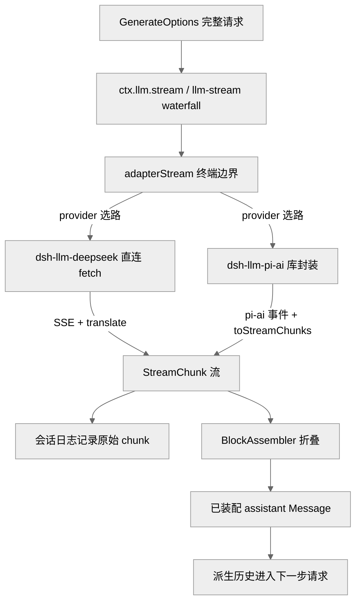
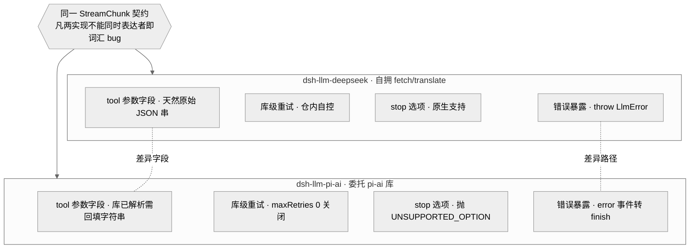
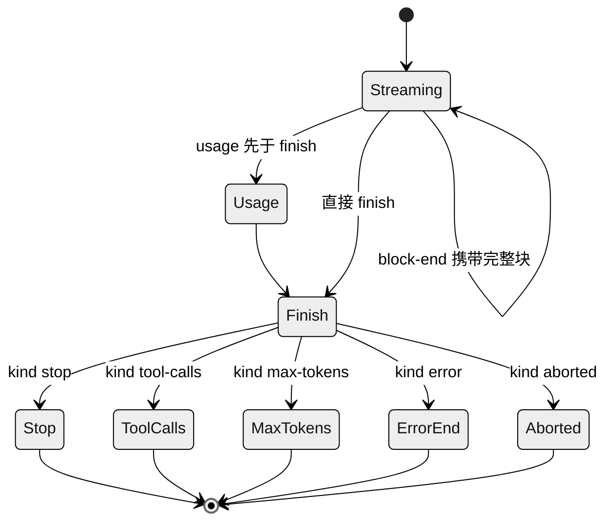
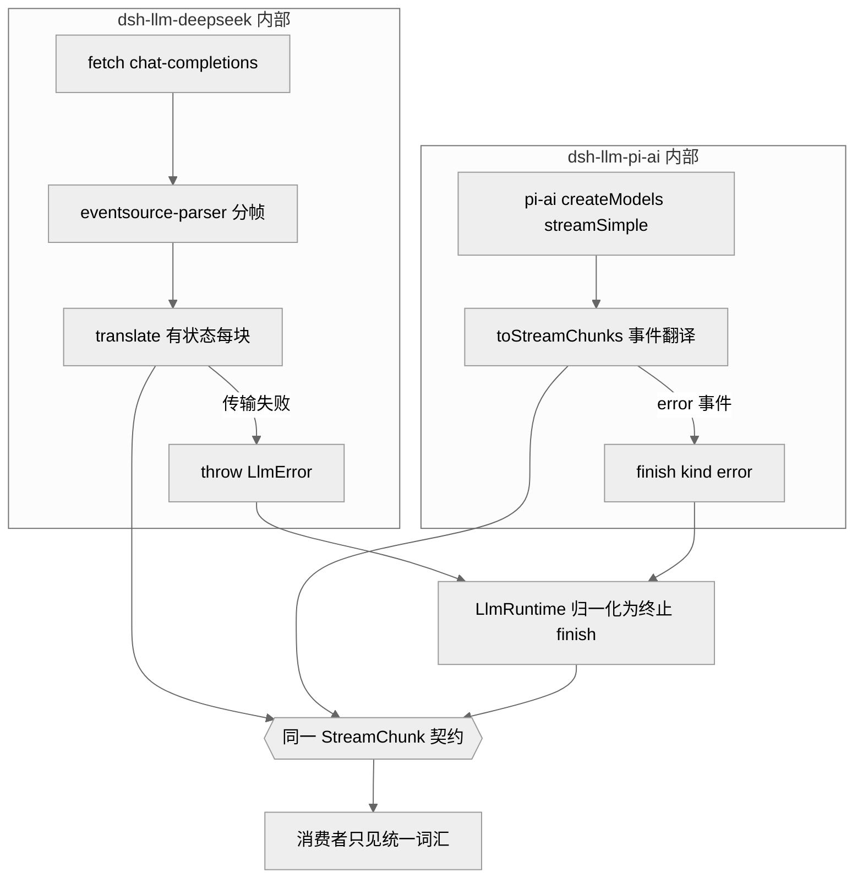

# 第 10 章 · LLM 适配器与流式词汇

> 本章讲 `dsh` 如何把"模型输出"这件事抽象成一套 provider 中立的词汇：`StreamChunk` 原始流式协议、以内容块（content block）为单位的消息表示，以及一个抽象的 `LlmAdapter` 接缝。读完你能回答三个问题：模型的流式响应在 harness 内部长什么样、这套词汇凭什么敢自称"中立"、以及两个真实适配器（直连 fetch 的 `dsh-llm-deepseek` 与库封装的 `dsh-llm-pi-ai`）如何互为"设计验证孪生"。

证据等级沿用全书约定：`[verified]` 源码可证 · `[inferred]` 合理推断 · `[claimed]` 二手口径。

## 一、本质是什么

`dsh` 的信念是"模型是 agent 的灵魂、一切皆可替换插件"。要让模型可替换，就必须先有一层不依赖任何具体 provider 的内部语言：agent loop、会话日志、所有插件都只说这门语言，具体某家 provider 的 SSE 分帧、字段命名、错误编码都被挡在一层适配器之后。`packages/llm` 就是这门语言的定义方。

它由三组东西构成 `[verified]`：

1. **内容块词汇**——一条 `Message` 是一组带 `type` 标签的内容块数组，块类型由可合并扩展的 `ContentBlockMap` 派生（`types.ts:99`）：`text`、`reasoning`、`image`、`tool-call`、`tool-result`。
2. **`StreamChunk` 原始流式协议**——适配器吐出的 token 级增量（`types.ts:291`）。
3. **`LlmAdapter` 抽象类 + `ctx.llm` 服务**——provider 后端的唯一接入点，唯一必实现方法是 `stream()`（`index.ts:180`、`index.ts:284`）。

`ctx.llm` 本身是一个 Cordis 服务（`class LlmRuntime extends Service`，`index.ts:284`），是"能力接缝"（Ch11）在模型域的实例：Service Definition 是 `LlmAdapter` 契约，Provider 是各家适配器插件，Consumer 是 agent loop。换一次 `registerAdapter` 就换掉了整个产品背后的模型。

## 二、核心问题与痛点

一个 agent harness 面对模型输出，天然有几个难题：

- **多块交错**。开启思维模式后，一次响应里 `reasoning` 与 `text`、甚至多个并行 `tool-call` 会交错到达。消费者需要知道哪个增量属于哪个块。
- **provider 词汇各异**。DeepSeek 走 OpenAI 兼容的 chat-completions SSE，`finish_reason` 是 `stop`/`length`/`tool_calls`；pi-ai 库有自己的一套事件（`text_delta`/`thinking_delta`/`toolcall_end`/`done`/`error`）。工具参数一个是原始 JSON 串、一个是已解析对象。
- **错误来得方式不同**。有的 provider 在传输层直接抛（连接被拒、TLS 失败），有的把错误当作流内的终止事件送达。
- **"中立"很容易被第一个实现污染**。只对着一个 provider 定义的"中立协议"，会把那个 provider 的怪癖悄悄固化成事实标准，直到第二家接入才暴露，那时修复代价已经很高（`2026-06-13-twin-llm-adapters.md`）。

## 三、解决思路与方案

### 内容块作为唯一内部语言

`dsh` 选择**自有词汇**：消息是内容块数组，映射成本留在适配器里（`2026-06-11-content-block-vocabulary.md`）。这不是零成本方案——每个适配器都要付翻译代价——但它换来的是 reasoning 有了一个核心归宿、工具结果是结构化嵌套块，而不必迁就某一家 chat-completions 的扁平 shape。

> **ratify-note · 为何自造内容块词汇而非镜像 OpenAI/Anthropic**
> - 候选解释：A 镜像 DeepSeek/OpenAI chat-completions shape（首个 provider 零映射）；B 照搬 Anthropic Messages 块结构（久经考验）；C 自有可合并扩展词汇。
> - 各自利弊：A 对富内容（reasoning、结构化工具结果）很别扭，且把首家 provider 的形状焊死进内核；B 成熟，但让内核类型镜像一个 harness 并不首要针对的第三方 API；C 需每个适配器付翻译成本，但把 provider 差异全部隔离在接缝之外，reasoning/tool-result 各有核心归宿。
> - 选定 & 理由：选 C。ADR 明确把 A/B 列为已考量备选并给出否决理由（`2026-06-11-content-block-vocabulary.md` "Alternatives considered"）；`ContentBlockMap` 用声明合并让插件加块类型（`types.ts:99`），与 `MessageSource`/`FinishReason` 等"stringly"字段共用同一 merge-extensible-map 模式。
> - 证据等级：[verified] `types.ts:99-116`、ADR 原文。
> - 残余风险：多模态（image）已因缺乏协调的适配器/UI/压缩支持被移除过一次；若未来某 provider 的原生形状与该词汇长期冲突，成本会转嫁到那个适配器而非内核。

### StreamChunk：一套七成员的原始协议

`StreamChunk` 是一个**闭合**判别联合（`types.ts:291`）`[verified]`：

- `block-start { index, blockType }` / `block-end { index, block }`
- `text-delta` / `reasoning-delta { index, text }`
- `tool-call-delta { index, id, name?, argumentsDelta }`
- `usage { usage }`
- `finish { reason, replayState? }`

关键设计有二。其一，`index` 把交错的增量关联回各自的块——消费者靠 index 知道这段 delta 属于哪个块。其二，`block-end` 直接携带**已装配好的完整 `ContentBlock`**，消费者不必自己重装 delta。因为它是闭合联合，装配器的 `switch` 以 `assertNever` 收尾（`assembler.ts:92`），新增一个成员会让每个必须处理它的消费者在编译期报错——这与内容块那种"可合并扩展、走文档化默认分支"的开放联合形成刻意对照（`never.ts` 注释明确区分两者）`[verified]`。

图注：一次模型调用的数据流。两个真实适配器把各自的 provider 词汇翻译成同一套 `StreamChunk`，之后的路径（记录、装配、入历史）对 provider 完全无感。此图证明"provider 差异止于适配器"。

### 双真实适配器：设计验证孪生

`dsh` 从第一天就对着同一份契约发布**两个**刻意采用不同内部实现的适配器（`2026-06-13-twin-llm-adapters.md`）`[verified]`：

- `dsh-llm-deepseek`：直连 `fetch` + 仓内翻译，SSE 分帧委托给 `eventsource-parser`。孪生身份的关键是"自己拥有 fetch/translate 内部"，而非委托给完整 provider SDK。
- `dsh-llm-pi-ai`：同一 DeepSeek 端点，但走 `@earendil-works/pi-ai` 库，用库自己的事件词汇。

它们强制执行的规则是：**凡 `StreamChunk` 词汇无法为两个实现同时表达的东西，就是核心词汇的 bug**——当场发现，而非等到下一个 provider 接入。这一对孪生钉死了如今写在 `types.ts` 上的若干约定。

图注：设计验证孪生的字段级对照。中央是唯一的 `StreamChunk` 契约，两侧是内部实现刻意不同的真实适配器；标出的正是各自暴露的差异字段（tool 参数形态、库级重试、`stop` 支持、错误暴露风格）。此图证明"中立"不是自我声明，而是被两个必须同时满足契约的真实实现逼出来的。

> **ratify-note · 为何要双真实适配器，而非单个或加一个 mock**
> - 候选解释：A 单适配器（沿用现状基线）；B 一真一 mock；C 两个真实适配器且内部实现刻意不同。
> - 各自利弊：A 代码更少、e2e 成本减半，但"provider 中立"无从验证，词汇会静默编码"DeepSeek-经由-fetch"的假设；B 更便宜，但 mock 不触碰真实 provider 的线缆怪癖，证明力弱；C 是"真对真"，持续验证接缝中立性并额外提供第二个实现范例，代价是适配器与 key 门禁 e2e 维护翻倍（都覆盖 V4 Flash/Pro 的代表性 reasoning 模式）。
> - 选定 & 理由：选 C。ADR 的 "Alternatives considered" 逐条列出 A/B 的不足并给出否决理由；库封装适配器实实在在暴露了单个直连适配器会隐藏的分歧——两条错误路径的差异（见下）正是这样被逼出来的（`2026-06-13-twin-llm-adapters.md`）。
> - 证据等级：[verified] ADR 原文 + 两适配器 `stream()` 的错误处理分别在 `llm-deepseek/adapter.ts:246-258` 与 `llm-pi-ai/stream.ts:196-201`。
> - 残余风险：ADR 自己写明"未来一套一致性测试套件（conformance suite）可能通过一份 superseding note 退役其中一个适配器"——即孪生的价值随一致性测试成熟而递减，是有意保留的可逆决策，而非永久架构。

## 四、实现细节关键点

### 三条铁约定，两条错误路径

契约文档（`llm-streaming.md` "The adapter contract"）与 ADR 共同固定了这些不变量 `[verified]`：

1. **`usage` 在 `finish` 前，`finish` 后无任何内容。** 稳健做法是把 finish/usage 缓冲到 provider 的流末标记再一次性 flush，以兼容尾随的 usage-only chunk。DeepSeek 适配器正是把 `block-end`、`usage`、`finish` 全部推迟到 `[DONE]` 哨兵才发出（`translate.ts:101-118`）。
2. **工具调用 `arguments` 全程是原始 JSON 串。** 片段经 `argumentsDelta` 流式到达；provider 若返回已解析对象，需在 `block-end` 重新字符串化。pi-ai 恰好返回解析后的对象，于是在 `toolcall_end` 处 `JSON.stringify(event.toolCall.arguments)` 回字符串（`stream.ts:184`）。
3. **两条被认可的错误路径，一个 `LlmFailure` 类型。** 失败要么从 `stream()` **抛出**（传输/协议错误），要么以 `finish {kind:'error'|'aborted', failure}` **结束流**（provider 流内错误，适用于无法中途抛的适配器）。这正是孪生暴露出的差异：DeepSeek 适配器在传输失败时抛 `LlmError`（`adapter.ts:246-258`，区分 `TIMEOUT`/`ABORTED`/`TRANSPORT`），而 pi-ai **从不中途抛**——它把失败作为 `error` 事件收到，再映射成 error/aborted 的 finish chunk（`stream.ts:196-201`，代码注释直书"the harness protocol's other error-delivery style"）。

图注：`StreamChunk` 流的状态机。`usage` 必须先于终止的 `finish`，`finish` 之后不再有任何 chunk；`finish.reason` 是可合并扩展的 `FinishReasonMap`（`types.ts:116`），其中 `error`/`aborted` 携带 `LlmFailure`。此图证明流的时序约定与终止形态是有限且封闭的。

### BlockAssembler：唯一的装配算法

`BlockAssembler`（`assembler.ts:36`）是把 `StreamChunk` 流折回 `ContentBlock`、usage、finish、replayState 的**唯一共享实现** `[verified]`。agent loop 一边把原始 chunk 记进日志（保真重放），一边用同一批 chunk 喂装配器，再把装配结果连同 provider/model 存下。

它的容错值得一提：对 delta-only 协议（没有 block-start/end）也能装配；对已被 `block-end` 关闭的 index，后到的散落 delta 直接忽略（`assembler.ts:63`、`assembler.ts:78`），使行为错乱的适配器无法撑爆内存或污染已完成的块。另有一处产品语义：当 finish 是 `max-tokens` 时，`blocks()` 丢弃无法安全执行的 tool-call（`assembler.ts:134-139`）——截断处的半个工具调用不应被执行。

### LlmRuntime.stream 的错误归一化

两条错误路径最终在 `LlmRuntime` 收敛。`adapterStream`（`index.ts:843`）把**适配器选路、dispatch、迭代器构造、迭代**中的抛出，统一转成一个终止的 finish chunk（`adapterFailureChunk`，`index.ts:931`）——caller 已 abort 或 code 为 `ABORTED` 则记 `aborted`，否则 `error`。也就是说，从消费者视角看，即便直连适配器"抛"了，暴露出来的仍是一个规规矩矩的终止 finish。而中间件、嵌套调用、清理与下游消费者的失败仍保持抛出（`index.ts` `stream()` 的 JSDoc 明确划界）。`normalizeLlmFailure`（`adapter-failure.ts:16`）负责把任意抛出的值脱水成可序列化、provider 中立的 `LlmFailure`，且只信任 harness 自有的 error code，不把第三方 SDK 的 code 当作本方分类法。

图注：孪生适配器内部实现迥异（直连 fetch/抛出 vs 库封装/流内 error 事件），却在同一 `StreamChunk` 契约处汇合；两条错误路径都被 `LlmRuntime` 归一化。此图证明"抽象中立性"由两个真实实现同时验证，而非由单一实现独断。

### 其余共享约定

- **一次适配器调用 = 一次 provider 尝试。** 适配器关闭库级重试（pi-ai `maxRetries: 0`，`adapter.ts:98`）；agent 级恢复另开一个持久编号回合。
- **provider 停顿在传输层设界。** 两个远程适配器都暴露正有限的 `streamIdleTimeoutMs`，默认五分钟（`llm-deepseek/adapter.ts:89` `DEFAULT_STREAM_IDLE_TIMEOUT_MS = 300_000`）；idle watchdog 仅在迭代器 `next()` 挂起期间武装，超时映射为 `TIMEOUT`，更早的 caller abort 保持 `ABORTED`。
- **上下文溢出有唯一规范码。** 两个适配器都经 `isContextWindowExceededError()` 归到 `CONTEXT_WINDOW_EXCEEDED`，无论错误来自抛出的 HTTP `LlmError` 还是流内 finish（`llm-deepseek/adapter.ts:144`、`llm-pi-ai/stream.ts:73-86`）。
- **空补全是可重试错误，不是静默成功。** 两个适配器都把"`stop` 收尾却没有任何内容块"映射成 `EMPTY_RESPONSE` 的 error finish（`translate.ts:110-115`、`stream.ts:92-99`）。
- **每个 provider HTTP 请求都带 app 归属头。** 两适配器都发 `attributionHeaders()`（`User-Agent` 基线，`llm-deepseek/adapter.ts:287`），并以线缆级测试证明。
- **replay 状态归适配器所有。** 成功的 finish 可携带无损 JSON 的 `replayState`；`LlmRuntime` 只在历史 provider 与目标 provider 当前注册到**同一适配器实例**时才把它交回（`index.ts:823` `forAdapter` 过滤）。

## 五、易错点与注意事项

- **`finish` 后不得再发任何 chunk。** 天真实现容易在 finish 之后再冒一个 usage-only chunk。正确做法是缓冲到流末标记统一 flush（`translate.ts` 的 `[DONE]` 集中发射就是范例）。
- **tool-call 参数别提前解析。** 内核全程按原始 JSON 串对待；解析归工具执行管线（Ch09）。pi-ai 因库已解析而必须"回填字符串"（`stream.ts:184`），这是接入库封装 provider 的典型坑。
- **闭合联合的 `assertNever` 是门禁。** 给 `StreamChunk` 加成员会在所有必须处理它的消费者处触发编译错误——这是特性不是负担（`never.ts` 注释）。反之，内容块/finish-reason 是开放联合，切勿用 `assertNever`，要走文档化默认分支。
- **不要把不支持的字段静默丢弃。** provider 无法履行的 `GenerateOptions` 字段应抛 `LlmError(..., 'UNSUPPORTED_OPTION')`；pi-ai 对 `stop` 就是直接抛（`adapter.ts:278`）。
- **catalog 是建议性的，不是请求白名单。** `listModels()`/`resolveModel()` 的返回仅供选择器展示；适配器可接受未列出的 model id（`index.ts` `listModels` 与 `resolveModelInfo` 的 JSDoc 反复强调），消费者不得把"缺席"变成"拒绝请求"。

## 六、竞品/横向对比

`StreamChunk` 的定位类似 Vercel AI SDK 的 stream part、或 LangChain 的 streaming callback：都想给多 provider 一个统一的增量协议。HN 讨论里 `dsh` 工具调用的严格 JSON schema 被赞（称超过 Codex）`[claimed]`（社区认知地图 E 节）。

> **ratify-note · dsh 的流式抽象相较通用 SDK 是否更优**
> - 候选解释：A `dsh` 的"内容块 + 闭合 StreamChunk + 双真实适配器"更严谨；B 通用 SDK（Vercel AI SDK / LangChain）覆盖 provider 更广、更成熟。
> - 各自利弊：A 有闭合联合的编译期穷尽、reasoning 一等公民、replay 状态归属清晰、且用两个真实实现验证中立性；缺点是只对着自家/单一端点验证，provider 覆盖面远不及通用 SDK。B provider 覆盖广、生态成熟；缺点是"最大公约数"式抽象常把 reasoning/工具参数等细节压平，且中立性靠海量集成而非机制保证。
> - 选定 & 理由：就 `dsh` 的目标（自家模型的官方 harness + 可替换接缝）而言，A 的机制化验证（孪生 + 闭合联合 + 契约不变量）更契合；但"更优"仅限此语境，不构成通用结论。
> - 证据等级：[inferred]（机制对比源码可证 `types.ts:291`/ADR，"孰优"含目标假设）；竞品口碑 [claimed]（社区认知地图）。
> - 残余风险：若 `dsh` 未来需要广接第三方 provider，通用 SDK 的成熟集成面可能反超；那时"双真实孪生"的边际价值下降（ADR 已预留退役闸）。

## 七、仍存在的问题与局限

- **孪生的维护成本翻倍且是有意为之的临时态。** ADR 自陈：适配器与 key 门禁 e2e 都翻倍，未来一致性测试套件成熟后可能退役其一（`2026-06-13-twin-llm-adapters.md` "Consequences"）。这是 deferred，不是缺陷 `[verified]`。
- **两个适配器目前对着同一 DeepSeek 端点。** 严格说，"真对真"的第二个"真"是不同的**内部实现**（fetch vs 库），而非不同的**厂商**。对跨厂商语义差异的验证仍待真正第三方 provider 接入 `[inferred]`。
- **pi-ai 错误分类靠字符串模式匹配。** 因 pi-ai 上游把原始 Error 与 `cause` 链拍平成 `error.message`，`classifyPiAiError` 只能对词做正则（`stream.ts:31-62`，代码 `XXX` 注释已标注：若上游能转发原始 Error 就改按 code/cause 分类）。这是脆弱点。
- **多模态尚未回归。** image 块只在适配器/UI/压缩/持久重放路径协调支持后才会重新进入 `ContentBlockMap`（`2026-06-11-content-block-vocabulary.md` "Consequences"）。

## 小结与衔接

本章的三个答案：模型响应在 `dsh` 内部是**内容块数组 + `StreamChunk` 原始流**；这套词汇的"中立性"靠**两个内部实现迥异的真实适配器**在同一契约上持续验证，而非靠单一实现自我声明；`ctx.llm` 是模型域的能力接缝，一次 `registerAdapter` 就替换整个产品背后的模型。往下，第 11 章展开"能力接缝"三角色（Service Definition / Provider / Consumer）的通用机制——本章的 `ctx.llm` 正是它在模型域的具体样本；工具参数如何从原始 JSON 串走到执行，见第 9 章工具管线；`StreamChunk` 如何被记录并保证"模型可见 ⟺ 已记录"，见第 7 章会话日志。

## 源码索引

- `packages/llm/llm/src/types.ts:99` — `ContentBlockMap`（可合并扩展内容块）
- `packages/llm/llm/src/types.ts:116` — `FinishReasonMap`（开放联合，error/aborted 携 `LlmFailure`）
- `packages/llm/llm/src/types.ts:135` — `TokenUsage`（disjoint 计数）
- `packages/llm/llm/src/types.ts:291` — `StreamChunk`（七成员闭合联合）
- `packages/llm/llm/src/types.ts:40` — `LlmFailure`
- `packages/llm/llm/src/index.ts:180` — `LlmAdapter` 抽象类（唯一必实现 `stream()`）
- `packages/llm/llm/src/index.ts:284` — `LlmRuntime`（`ctx.llm` 服务）
- `packages/llm/llm/src/index.ts:823` — `forAdapter`（replay 状态归属过滤）
- `packages/llm/llm/src/index.ts:843` — `adapterStream`（终端边界与错误归一化）
- `packages/llm/llm/src/index.ts:913` — `LlmRuntime.stream()`
- `packages/llm/llm/src/index.ts:931` — `adapterFailureChunk`
- `packages/llm/llm/src/assembler.ts:36` — `BlockAssembler`（唯一装配算法；`:63/:78` 散落 delta 忽略；`:134` max-tokens 丢 tool-call）
- `packages/llm/llm/src/adapter-failure.ts:16` — `normalizeLlmFailure`
- `packages/llm/llm/src/never.ts:16` — `assertNever`（闭合 vs 开放联合区分）
- `packages/llm/llm-deepseek/src/adapter.ts:158` — `DeepSeekAdapter`（`:246` 三类抛出、`:287` 归属头、`:89` idle 默认 5 分钟）
- `packages/llm/llm-deepseek/src/translate.ts:31/:53/:101/:110` — finish/usage 映射、`[DONE]` 集中发射、EMPTY_RESPONSE
- `packages/llm/llm-pi-ai/src/adapter.ts:186` — `PiAiAdapter`（`:98` maxRetries 0、`:277` 不支持 stop）
- `packages/llm/llm-pi-ai/src/stream.ts:124` — `toStreamChunks`（`:184` 回填参数字符串、`:196` error 事件转 finish、`:31` 字符串分类）
- `.agents/notes/implemented/architecture/2026-06-13-twin-llm-adapters.md` — 双适配器设计验证孪生 ADR
- `.agents/notes/implemented/architecture/2026-06-11-content-block-vocabulary.md` — 内容块词汇 ADR
- `docs/subsystems/llm-streaming.md` — LLM 流式与适配器契约
- `docs/cookbook/adding-an-llm-adapter.md` — 新增适配器指南
