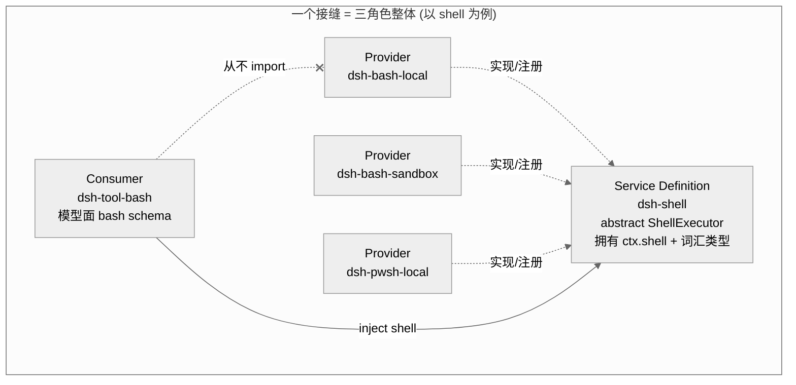
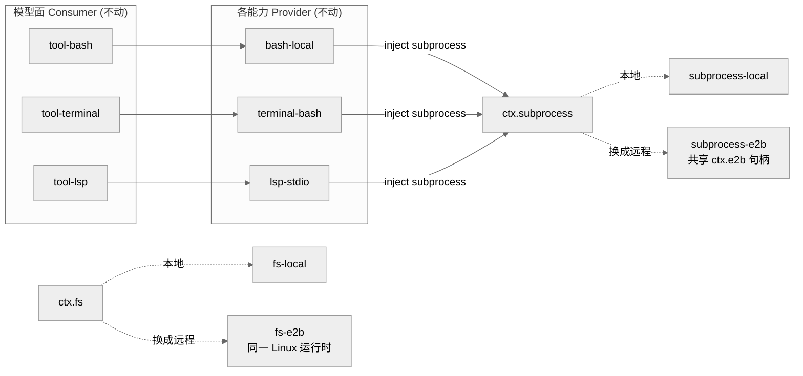
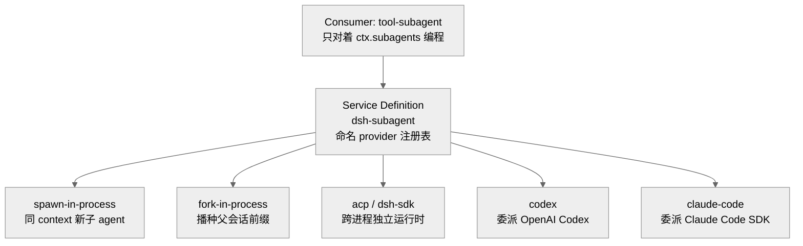
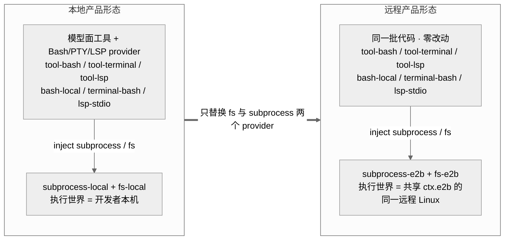

# 第 11 章 · 能力接缝架构

> 本章讲 `dsh` 如何把一个"可替换能力"拆成三个角色——**Service Definition / Service Provider / Consumer**——以及为什么这种拆法能让"换掉一个 provider"变成"换掉整个产品的一层能力"。读完你应能回答：接缝到底指什么、扩展插件为什么只依赖契约而不依赖实现、把 fs 与 subprocess 指向远程沙箱时为什么 Bash/PTY/LSP 会一起搬家、subagent 这一个接缝为什么能横跨"进程内子 agent → 委派给另一个产品"这么大的跨度。这是本系列的枢纽章：前面几章讲的会话日志、工具管线、模型适配器，都是坐在某个接缝的某个角色上。

## 一、本质是什么：接缝是"三角色的整体"，不是接口

先说清楚一个几乎所有人第一眼都会犯的误读：**seam（接缝，指一处"可以整块换掉的能力边界"）不是那个 interface**。`dsh` 的官方词表把它定义成一个"可替换能力"的三个角色的总和——一个 **Service Definition**（拥有 `ctx.<key>` 与词汇类型的 Cordis `Service`，也就是"契约"）、一个或多个 **Service Provider**（实现/注册契约的插件，也就是"干活的实现"）、一个或多个 **Consumer**（注入服务键、面向模型或其他插件编程的一方，也就是"用这个能力的人"）。

打个生活化的比方：墙上的**插座标准**就是一处接缝。标准本身（两孔/三孔、电压）是 Definition；发电厂、太阳能板、充电宝这些"往插座送电的东西"是 Provider；插上去用电的台灯、冰箱是 Consumer。台灯只认插座标准，从不关心背后是火电还是光伏——所以你把供电从市电换成太阳能，台灯一个零件都不用改。`dsh` 的接缝就是这个道理，只不过换的是"本地 bash / 沙箱 / 远程执行器"这类能力后端。

`packages/shell` 是范本：`dsh-shell` 是 Definition、`dsh-bash-local`/`dsh-bash-sandbox` 是 Provider、`dsh-tool-bash` 是 Consumer。词表明确写道："seam 是完整能力，绝不是单个角色；单独一个角色不构成接缝"（docs/glossary.md:9 `[verified]`）——就像"插座标准"这一个词，本身也必须同时预设了送电方和用电方才有意义。

为什么要把"契约/实现/消费面"这三件事分开命名、甚至分开打包？因为它们**以不同的速率、为不同的原因变化**。回到插座的比方：插座标准几十年才改一次，而"哪家发电"可能今天火电、明天光伏，"插了什么电器"更是天天在变——三者节奏完全不同，硬焊在一起只会互相拖累。Agent Note 把这层动机写得很直白：契约是"这个能力是什么"、实现是"它怎么跑"、Consumer API 是"模型和其他插件对着什么编程"；把三者塞进一个包会把这三条变化速率耦合起来——"把本地执行器换成沙箱执行器，本不该动模型看到的工具 schema，却会连带搅动它"（`.agents/notes/implemented/architecture/2026-06-13-capability-seams.md:9 [verified]`）。

> 图注：Consumer 与 Provider 都只指向 Definition；Consumer 注入 `ctx.shell` 却从不 import 任何 Provider 类型。三者缺一不成接缝——这也是本章反复要证的不变量。证据：shell/src/index.ts:65（`abstract class ShellExecutor`）、tool-bash/src/index.ts:31（`inject = ['tools','shell',...]`）`[verified]`。

## 二、核心问题与痛点：Cordis 的 inject 不回答"包边界"

一个容易混淆的点：Cordis 本身已经用 services + `inject`（依赖注入，插件声明"我需要某个服务"，框架在运行时把它递过来）回答了"谁在运行时提供、谁需要"——provider 注册 `ctx.shell`，consumer 声明 `inject: ['shell']`，其 fiber（Cordis 里承载一个插件生命周期的执行单元）会 pend（挂起等待）到服务出现为止。那还要三角色干嘛？Agent Note 的回答很关键：**inject 机制是必要的，但它不决定包边界；这份 Agent Note 才决定**（capability-seams.md:11 `[verified]`）。

换句话说，`inject` 管的是运行时的"谁等谁到位"（时序依赖，也就是空间可组合性，见第 3 章），三角色管的是源码层面的"按什么边界切成几个包"。一个是运行期的接线，一个是开发期的分包，两者正交、各管一头。痛点在于：一个 harness 的能力天生是要换的——今天本地 bash，明天沙箱、远程执行器、另一家模型。如果不在包层面把"契约"和"实现"劈开，每次换后端都要冒着改动模型面契约的风险，而模型面契约一动，工具 schema、prompt、快照全跟着抖。对使用者来说，这意味着一次"我只想换个执行后端"的小操作，可能连累模型看到的工具描述、乃至整套测试快照集体失稳。

## 三、解决思路：依赖契约，不依赖实现

三角色最硬的一条纪律写在 packages/README.md 的 Dependencies 一节：**"扩展插件依赖 Service Definition，绝不依赖具体 provider"**（packages/README.md:67 `[verified]`）。这不是口号，源码里可逐字验证：

- `dsh-tool-bash`（Consumer）的运行时 `dependencies` 只有 `schemastery`；它对 `dsh-shell`（Definition）等接口的依赖挂在 **`peerDependencies`**（意为"我要求宿主环境里有这个契约，但由别人负责装"），而具体 Provider `dsh-bash-local` 只在 `devDependencies`（仅测试装配用，正式跑起来时并不带上）——**这条 peerDependency 正是"Consumer 依赖 Definition、不依赖 Provider"在包边界上的编码**（tool-bash/package.json `[verified]`）。三种 dependency 分区，正好把"我认契约、我不认实现"这句话写死在了 `package.json` 里。
- 它 `inject = ['tools', 'shell', 'systemPrompt', 'shellEnv']`——注入的是**服务键 `shell`**，不是任何 provider（tool-bash/src/index.ts:31 `[verified]`）。
- Provider 侧则反过来 import Definition：`class LocalBashExecutor extends ShellExecutor`（bash-local/src/index.ts:102 `[verified]`），构造时 `super(ctx, 'shell')` 把自己注册成 `ctx.shell`（shell/src/index.ts:66-68 `[verified]`）。

于是依赖箭头全部指向中间的 Definition，Provider 与 Consumer 之间**没有编译期连线**——它们俩谁也不认识谁，只各自认识中间那份契约。这就像插座标准：台灯和发电厂之间没有一根直连的电线，都只接到墙上那个统一的插孔。这也正是"一次替换改变整个产品"的机械基础：换 Provider 只改注册进 `ctx.shell` 的那个类，Consumer 的工具 schema 一个字都不用动。Agent Note 用一句话收口："沙箱执行器替换 `dsh-bash-local`，不碰任何工具 schema"（capability-seams.md:24 `[verified]`）。

> **ratify-note · 为什么是"三角色分包"而不是"一个接口直连实现"**
> - 候选解释：A 三角色分包（Definition/Provider/Consumer 各自演化、各自出版本）；B 沿用现状——把契约+实现+消费面合成一个包，用 TS interface 当契约直连。
> - 各自利弊：A 优——三条变化速率解耦，新后端永不威胁模型面契约，Provider 与 Consumer 独立发版；缺——多包、多 `package.json`/`tsconfig`/README、多注入接线的样板成本（Agent Note "Consequences" 一节明列 capability-seams.md:37 `[verified]`）。B 优——包少、上手快；缺——换后端会 recouple 独立变化的三者，且 Definition 规定"永远不是 TS `interface`，而是抽象类或具体 registry service"（glossary.md:9 `[verified]`），interface 直连拿不到 Cordis 的 effect 回滚与 `inject` pend 语义。
> - 选定 & 理由：选 A。第一性看，harness 的能力**注定要换**（README 主线即"一切皆可替换插件"），把变化边界前置到包边界，是把"换后端"从跨包大改降为"加一个 sibling 包"。源码佐证：shell 三包 + fs 三 provider（fs-local/fs-sandbox/fs-e2b）已实证这套拆法可扩展。
> - 证据等级：[verified]（capability-seams.md:9-38、packages/README.md:67）。
> - 残余风险 / pre-mortem：若半年后此判断被证伪，最可能因样板成本压过收益——对只有一个可想象 provider 的能力过度分包。Agent Note 已自设护栏："别抢先拆，一个能力在出现第二个 provider 前保持单包"（capability-seams.md:25 `[verified]`），LLM 接缝正是据此把 Definition 与 Consumer 折进 `dsh-llm`。

> **↔ 论文对应**：Definition/Provider/Consumer 三角色与 `inject`/`provide`，在《时空可组合性》论文里被形式化为**响应式 coeffect**——组件把依赖声明为 specification，在 coeffect context $\Sigma$ 上 provide/get，context 每次变化经 $\mathrm{notify}$ 按激活/失活/中性三态分类（见 [Part IV 论文全解](../Part%20IV%20Foundational%20Paper/22-时空可组合性论文全解.md) §3.2，Def.22/25/26）。"换 provider 改变整个产品"对应论文的**空间可组合性**：依赖满足才转移、provider 存活严格包住 consumer（Thm.63 Ordering），且一次转移不跨两次 coeffect 解析（Thm.64 Resolution coherence）`[verified]`。

## 四、实现细节关键点：共享一个执行世界

三角色最有威力的推论，是**跨接缝的 provider 协同**——多处接缝共用同一个"底座能力"，于是换掉这一个底座，上面一排能力会一起搬家。`dsh` 的架构文档给了一句纲领："文件系统与 subprocess 的 provider 共享同一个执行世界，把它们指向远程沙箱，Bash、PTY、LSP 会随之一起搬家，不需要任何 provider 分叉"（docs/architecture.md:102 `[verified]`）。这里的 subprocess 指"起子进程"这件底层能力，PTY 指伪终端（跑交互式命令行那层），LSP 指语言服务器（给代码补全/跳转的后台服务）。

这句话的机械原理，藏在"谁 inject 了 `ctx.subprocess`"里。subprocess 是一个独立接缝（Service Definition = `dsh-subprocess`，Provider = `subprocess-local`/`subprocess-e2b`）。而它的 Consumer 是一大票别的接缝的 **Provider**——也就是说，很多能力自己是"上层的实现"，但同时又是"底层 subprocess 的用户"：

- `dsh-bash-local`（shell 的 Provider）`static inject = ['subprocess']`（bash-local/src/index.ts:103 `[verified]`）——bash 通过 subprocess 起进程；
- `dsh-terminal-bash`（terminals 的 Provider）`inject = [..., 'subprocess']`（terminal-bash/src/index.ts:25 `[verified]`）——PTY 通过 subprocess 起进程；
- `dsh-lsp-stdio`（lsp 的 Provider）`inject = ['fs', 'lsp', 'subprocess']`（lsp-stdio/src/index.ts:47 `[verified]`）——语言服务器也通过 subprocess 起进程。

于是只要把 `ctx.subprocess` 从 `subprocess-local` 换成 `subprocess-e2b`，这三条 Provider 全都在新的执行世界里起进程——它们各自的代码没动一行，只是"起进程"这件事被换到了别处发生。而 `ctx.e2b` 服务（E2B 是一个跑远程沙箱的云服务）"持有一个共享 E2B SDK 句柄与远程工作目录，让两个 E2B provider（fs-e2b、subprocess-e2b）栖身同一个 Linux 运行时"（docs/capability-seams.md:446 `[verified]`）。fs 换成 fs-e2b、subprocess 换成 subprocess-e2b，文件读写与进程执行就落在同一台远程机器上——**Bash/PTY/LSP 一次搬完**。这就像把家里的总闸从"市电"切到"备用发电机"：屋里所有插着的电器不用动，全体一起改喝新电源。

> 图注：换掉底层两个 provider（subprocess/fs 的实现），上面所有 Consumer 与中层 Provider 的代码原封不动，整个"执行世界"从本地迁到远程。证据：bash-local:103、terminal-bash:25、lsp-stdio:47、capability-seams.md:446-447 `[verified]`。

## 五、subagent：一个接缝托起的最大跨度

如果说 shell 展示了"接缝怎么切"，subagent 展示了**一个接缝能容纳多大的实现跨度**——同一个契约，背后的实现可以差得离谱。subagent 指"派一个子 agent 去干活"这件能力。它与 bash 的一个关键区别写在 Definition 的模块注释里："不像 bash（一个 context 一个执行器，第二次加载即抛错），subagent 是**命名 provider 注册表**，多个 provider 共存、调用方按名字挑一个，形状仿照 LLM 适配器注册表"（subagent/subagent/src/index.ts:6-10 `[verified]`）。换句话说，bash 那种接缝是"同一时刻只能有一个后端在岗"，subagent 则像一本电话簿：好几个后端同时登记在册，用的时候报个名字挑一个。

同一个 `ctx.subagents` 接口背后，`dsh` 已经实装了跨度极大的一排 provider：

- `subagent-spawn-in-process`：在**同一个 Cordis context** 上起一个全新子 Agent，零父上下文，最便宜的传输；
- `subagent-fork-in-process`：子 Agent **播种父会话日志的前缀**（截到最后一个 `turn/end`），继承父对话；
- `subagent-acp` / `subagent-dsh-sdk`：**跨进程**，子有自己的进程/会话/模型/工具，不共享 Cordis context；
- `subagent-codex`：每次委派起一个官方 `codex app-server --stdio` 进程；
- `subagent-claude-code`：每次委派调用官方 Agent SDK，把 SDK 生出的真实 CLI 挂到共享 subprocess owner 下。

从"进程内一个新子 agent"（最省事，就在自己家里开个新窗口）到"委派给 OpenAI Codex / Claude Code 这样的另一个产品"（等于把活儿外包给别家公司），跨度全被同一个 `ctx.subagents` 契约吸收——而模型面的 `tool-subagent` 只对着这个契约编程，它不知道也不需要知道背后跑的是自家 spawn 还是别家 CLI。对照插座的比方，这就像同一个插孔背后，既可能接着自家客厅的灯，也可能通过一条长线接到隔壁邻居的房子——用电器完全不必区分。

> 图注：进程内 → 跨进程 → 跨产品，同一接缝一网打尽。这解释了为什么"换一个 subagent provider"能从根上改变产品形态（自研 vs 编排他家）。证据：subagent/subagent/src/index.ts:6-14 与各 provider 模块注释 `[verified]`。

## 六、竞品/横向对比：跨插件 DI 到底值不值

社区对这套 DI（依赖注入）的实用性有真实分歧。全网调研记录了两种口径：一派赞"强制 cleanup 模式好"（框架逼着你写好资源清理，不容易漏），一派质疑"跨插件 DI 的实际收益存疑"（觉得为了换后端搞这么多间接层不划算）。（调研 D 节 `[claimed]`）这里必须对抗式处理——把两种说法都摆上台面认真掂量，而不是先站队。

> **ratify-note · 跨插件 DI（三角色 + Cordis inject）在 harness 语境是否真有收益**
> - 候选解释：A 有实质收益——DI + 三角色让"换后端"成为常态操作而非重构；B 收益存疑——多数 harness 用直接依赖/配置开关也能换后端，DI 徒增间接层。
> - 各自利弊：A 优——源码里已实证四类接缝各自有 ≥2 provider（shell 四：bash/pwsh × local/sandbox、fs 三、subprocess 二、subagent 六），且换 subprocess 一处即迁移 Bash/PTY/LSP，收益在"扇出"处兑现；缺——需要开发者理解 `inject` pend、effect 回滚、registry vs 单服务两种形状，认知门槛高。B 优——概念少；缺——无法解释 dsh 已经落地的远程沙箱/跨产品委派这类"一次替换、全面迁移"的行为，用配置开关做等价物会把切换逻辑散落进每个 Consumer。
> - 选定 & 理由：倾向 A，但**限定语境**。收益并非来自"DI 本身"，而来自"能力天生多 provider 且 provider 间共享执行世界"这一事实——此时 DI 的间接层正好落在真正的变化点上。对只有单 provider 的能力（如 `ctx.webServer`、`ctx.apiProxy` 等标为 `core` 而非 `seam` 的服务），dsh 自己也没上三角色。
> - 证据等级：[verified] 源码扇出（capability-seams.md 表格逐行）＋ [claimed] 社区分歧（调研 D 节）。
> - 残余风险 / pre-mortem：若被证伪，最可能是——多数用户永远只用本地 provider，远程/跨产品是长尾，DI 的样板税对 90% 用户是净负担。反驳点在于 dsh 的定位是"官方可替换 harness/生态底座"，长尾恰是它的卖点。

横向看，Claude Code、Codex CLI 等同类 harness 更多以"配置 + 内建后端"提供有限替换（后端是官方预先写死的几个，你只能在里面挑）；`dsh` 把替换点提升为**架构级的命名接缝**（任何人都能挂一个新后端上去），代价是包数量（219 个 `@deepseek-ai/dsh-*` workspace 包）与样板，收益是第三方可在不改核心的前提下加 provider。这与其"开源即贡献、护城河是团队与文化"的理念一致（此为动机层判断，`[inferred]`）。

## 七、仍存在的问题与局限

**样板成本是显性代价。** Agent Note 的 Consequences 一节自陈：分角色"增加了包和样板——`package.json`、`tsconfig`、README、注入接线"（capability-seams.md:37 `[verified]`）。这是三角色的直接税。

**何时拆、何时折，是一条需要判断力的边界。** Agent Note 给了规则但规则本身有灰度：

> **ratify-note · 何时按角色拆包 vs 折进一个包**
> - 候选解释：A 一律拆三包；B 一律合一包；C 按"角色是否独立演化"决定，genuinely 单一关注点则折叠。
> - 各自利弊：A 优——一致、无判断成本；缺——对单 provider 能力过度工程。B 优——省包；缺——recouple 独立变化的角色。C 优——成本对齐收益；缺——"是否独立演化"是主观判断，可能拆错。
> - 选定 & 理由：dsh 选 C。LLM 接缝把 Definition 与 Consumer 折进 `dsh-llm`（Consumer 就是 loop 本身，不是可换的 schema 面），adapter 作为 Provider 包；bash 则三包全开。规则是"角色独立演化才拆，别抢先拆，第二个 provider 出现前保持单包"（capability-seams.md:25 `[verified]`）。这把判断权交给"变化速率"这个第一性标准，而非教条。
> - 证据等级：[verified]（capability-seams.md:25、glossary.md:9 LLM 折叠例）。
> - 残余风险 / pre-mortem：判断"是否独立演化"依赖预判未来变化；预判错了要么过早拆包（B 的成本）要么该拆没拆（后期拆分痛）。dsh 的 pre-release stance（AGENTS.md "foundation over blast radius"）允许自由重命名/重打包来纠偏，降低了这条风险。

**一个命名陷阱被专门点名。** 这里是同一个词撞名的坑：能力接缝里说的 `capability`（"可替换能力"）和 `@cordisjs/plugin-capability` 是两码事。Agent Note 警告：不要把二者混淆——后者是**权限/安全**服务（命名权限 + 继承 + `ctx.capability.test`，管的是"谁被允许做什么"），是完全不同的轴，属于 deferred（暂缓、留待后续）的 permissions/sandbox 工作，"混淆二者正是这份 Agent Note 要命名的陷阱"（capability-seams.md:34 `[verified]`）。

## 小结与衔接

能力接缝是 `dsh` "一切皆可替换"信念的落地机制：把可替换能力切成 Service Definition / Provider / Consumer 三角色，让依赖箭头全部指向中间的契约，于是"换一个 provider"退化为"加一个 sibling 包"，而模型面契约纹丝不动。它的威力在两处兑现——**跨接缝的执行世界共享**（换 subprocess/fs 即迁移 Bash/PTY/LSP）与**单接缝的巨大实现跨度**（subagent 从进程内子 agent 到跨产品委派）。代价是包与样板，护栏是"角色独立演化才拆"的第一性判断。

把这条枢纽论点压成一张对照图：同一批模型面工具与 Bash/PTY/LSP provider 一行代码都不改，仅替换 fs 与 subprocess 两个底层 provider，整个产品的执行世界就从"跑在开发者本机"整体切到"跑在远程 E2B 沙箱"——左边是本地形态，右边是远程形态，中间那根粗箭头就是"一次 provider 替换改变整个产品"的全部动作。

图注：左右两侧的模型面工具与 Bash/PTY/LSP provider 完全相同（右侧仅标注"零改动"），差异只落在最底层被注入的那两个 provider 上；正因依赖箭头全部指向契约、Consumer 从不 import 实现，一次替换就把整个执行世界从本机迁到远程沙箱。证据：capability-seams.md:446-447、architecture.md:102、bash-local:103、terminal-bash:25、lsp-stdio:47 <code>[verified]</code>。

本章是枢纽：往前，它坐落在第 5 章的类型化事件扩展点与第 9 章的工具管线之上；往后，Ch12–14 会逐一进入 shell/terminal、fs/lsp 等具体能力域，读者可用本章的三角色框架去拆解每一个域；Ch10 的 LLM 接缝则是"折叠角色"的活样本；Ch17–18 的远程沙箱/自我修改，本质是把本章的 provider 替换推到极限。

## 源码索引

- `.agents/notes/implemented/architecture/2026-06-13-capability-seams.md:9,11,15-25,28-29,32-38` — 三角色定义、inject 与包边界正交、seam 术语、备选方案与后果
- `docs/glossary.md:9` — capability-seam 词条（Definition 是抽象类/registry，绝非 interface；LLM 折叠例）
- `docs/architecture.md:98-102` — Capability seams 一节；"一次 provider 替换改变整个产品"、共享执行世界
- `docs/capability-seams.md:446-447,415` — 生成的能力图与角色表（e2b 共享句柄、subprocess/fs 的 provider 列表、llm 折叠）
- `packages/README.md:67` — Dependencies：扩展插件依赖 Service Definition，绝不依赖具体 provider
- `packages/shell/shell/src/index.ts:40-44,65-101` — `ctx.shell` 声明、`abstract class ShellExecutor`
- `packages/shell/shell/src/types.ts:38-110` — request/spec 拆分（显式 defaulting 契约）
- `packages/shell/tool-bash/src/index.ts:31` — Consumer `inject = ['tools','shell',...]`；运行时不依赖任何 provider
- `packages/shell/bash-local/src/index.ts:102-103` — `class LocalBashExecutor extends ShellExecutor` / `static inject = ['subprocess']`
- `packages/terminal/terminal-bash/src/index.ts:25`、`packages/lsp/lsp-stdio/src/index.ts:47` — PTY 与 LSP provider 同样 inject subprocess（共享执行世界证据）
- `packages/subagent/subagent/src/index.ts:6-14` — subagent 为命名 provider 注册表；各 provider 模块注释证跨进程/跨产品跨度
- `packages/CLAUDE.md` / `AGENTS.md` — "A capability seam comprises Service Definition / Service Provider / Consumer roles"、"Design Service Definitions for all current Consumers"
