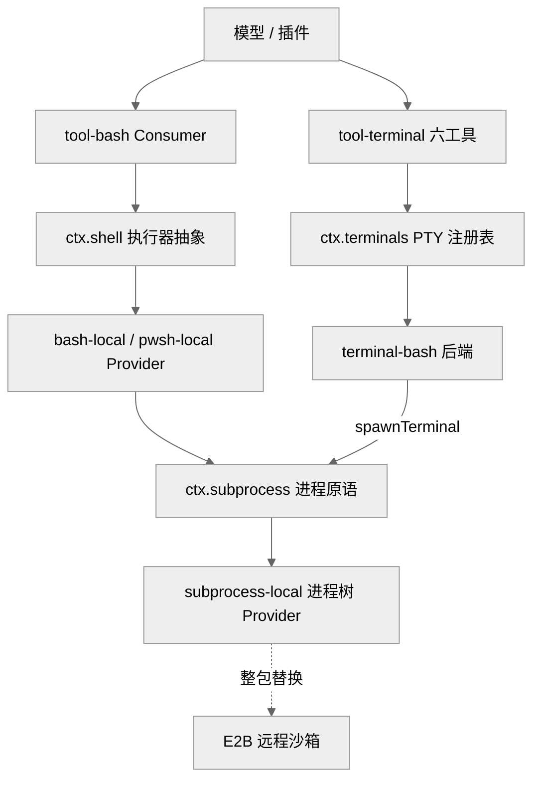
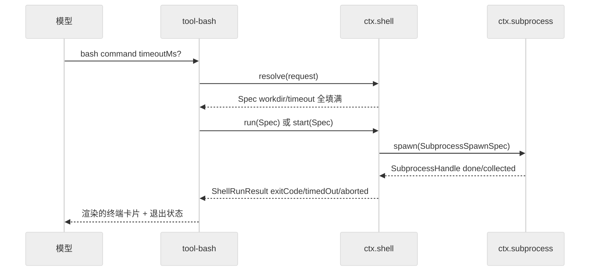
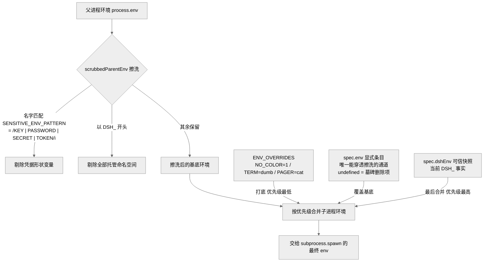
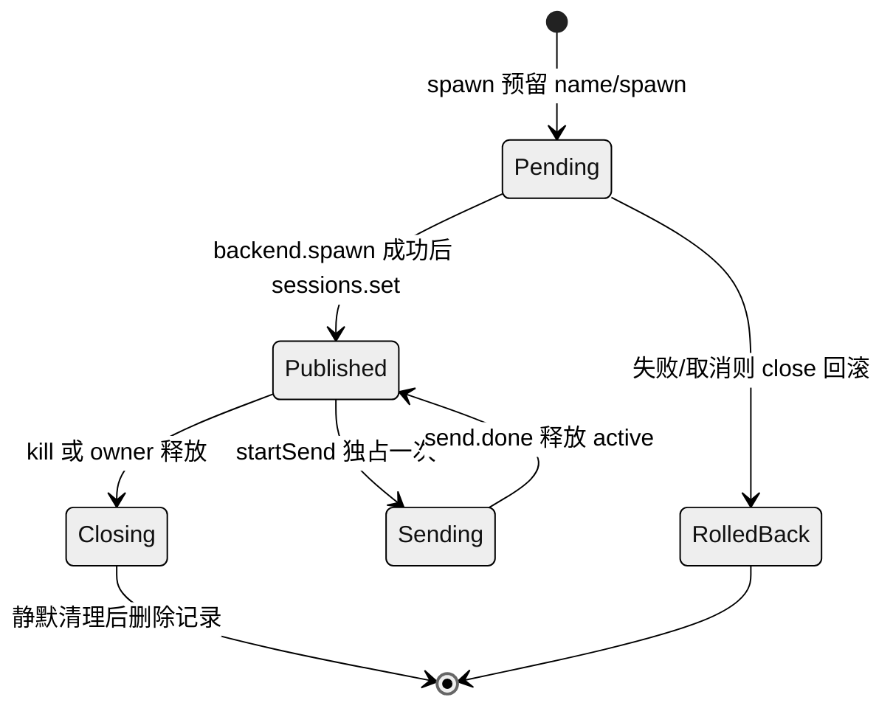

# 第 12 章 · 执行世界 Shell/Subprocess/Terminal

> 本章讲 dsh 如何把"让模型跑命令"这件事拆成三层能力接缝：`ctx.subprocess`（本地进程树）→ `ctx.shell`（bash/pwsh 执行器）→ `ctx.terminals`（持久 PTY 会话）。读完你能回答三个问题：为什么一次 `bash` 工具调用要穿过三个包；`resolve(request): Spec` 这个"显式默认化"步骤到底解决了什么；持久终端会话凭什么能跨工具调用、跨插件重载存活。

## 一、本质是什么

在一个 agent harness 里，"执行外部命令"是最危险也最高频的能力。dsh 没有把它做成一个单体"执行服务"，而是沿着**抽象层次**切成三条独立的能力接缝，每条都严格遵守仓库的 Service Definition / Provider / Consumer 三角色约定（见 CLAUDE.md `## Conventions`）：

- **`ctx.subprocess`** —— 最底层的进程原语。它只管"在这个执行世界里启动一个进程树、按显式的 stdio 处置方式收流、以进程组为单位终止"，不懂 shell 语法、不懂超时语义、不懂展示。`[verified]`（`packages/subprocess/subprocess/src/index.ts:102`）
- **`ctx.shell`** —— bash/pwsh 执行器。它把一条命令字符串包成 `bash -c` / `pwsh -Command`，负责命令默认化、超时与中断归因、模型友好环境变量、前台/后台输出合并；本地实现经 `ctx.subprocess` 落地。`[verified]`（`packages/shell/shell/src/index.ts:65`、`packages/shell/bash-local/src/index.ts:102`）
- **`ctx.terminals`** —— 持久 PTY 会话注册表。它给每个 Agent 一个能跨工具调用保留 cwd/环境/后台任务的交互式终端，会话所有权绑定到精确的 `Agent`。`[verified]`（`packages/terminal/terminal/src/index.ts:105`）

一句话定位：**subprocess 是"进程",shell 是"一次命令",terminals 是"一段会话"**——三种不同的时间尺度和状态语义，被拆成三个可独立替换的插件。

## 二、核心问题与痛点

放到 harness 语境，执行命令要同时满足几组彼此拉扯的诉求：

1. **安全**：harness 自己的 `DEEPSEEK_API_KEY` 等凭据绝不能隐式泄漏进子进程；杀进程不能留下逃逸的孙子进程。
2. **可控输出**：模型上下文有限，命令可能吐 GB 级输出，必须有界截断且保留可恢复的完整流。
3. **归因清晰**：一条命令"超时了"、"被取消了"、"退出码非零"、"被信号杀了"是四件不同的事，模型不能把"被腰斩"读成"干净成功"。
4. **状态语义分层**：`ls` 这种一次性命令、`npm run dev &` 这种后台长任务、`python` REPL 这种需要跨调用保留状态的交互会话，是三种根本不同的生命周期。
5. **可替换**：本地进程、E2B 远程沙箱、Windows pwsh——底层执行世界要能整包替换而不动上层工具。

单体"执行服务"会把这些诉求全糊在一个类里。dsh 的答案是按**关注点 + 抽象层次**双维度拆分。

## 三、解决思路与方案

### 三层依赖关系

> 图注：证明了"三层分立、单向依赖"。`ctx.shell` 与 `ctx.terminals` 都以 `ctx.subprocess` 为地基（`spawn` 走管道、`spawnTerminal` 走 PTY），而底层 Provider 可整包替换成远程沙箱——上层工具无感。`[verified]`（`bash-local` `static inject = ['subprocess']`，`packages/shell/bash-local/src/index.ts:103`；`terminal-bash` `inject = ['terminals','sandboxPolicy','subprocess']`，`packages/terminal/terminal-bash/src/index.ts`）

### 关键设计一：request/spec 的 `resolve()` 显式默认化

这是整个执行世界的**中枢约定**，也是仓库级铁律"Explicit > implicit at package boundaries"的样板（CLAUDE.md `## Conventions`）。接缝把两种形状分开：

- **`ShellExecRequest`**：模型/插件面向的**请求**，`workdir`/`timeoutMs`/`stdoutMaxBytes` 都可选。`[verified]`（`docs/subsystems/shell.md`，类型见 `packages/shell/shell/src/types.ts`）
- **`ShellExecSpec`**：执行器真正据以行动的**已解析规格**，这些字段全部必填。`[verified]`

两者之间由工具层显式调用 `ctx.shell.resolve(request)` 转换：填 `workdir`（来自 `config.cwd` 或 `process.cwd()`）、填并封顶 `timeoutMs`（`config.timeoutMs`，`clampTimeout` 到 `config.maxTimeoutMs`）。`run()`/`start()` 只接受 `Spec`，永不二次默认化。`[verified]`（`resolve`，`packages/shell/bash-local/src/index.ts:146`）

> 图注：证明了"默认化是一次显式的 `resolve` 步骤，而非藏在 `run()` 里的 `?? default`"。工具层拿到的 `Spec` 已无歧义，执行器与子进程只处理确定值。`[verified]`（`packages/shell/bash-local/src/index.ts:146,211,226`）

> **ratify-note · 为何三层分立而非一个执行服务**
> - 候选解释：A 单体"执行服务"（一个类同时管进程、shell、PTY）；B 按抽象层次三层分立（现状）。
> - 各自利弊：A 优——调用链短、无跨包样板；缺——PTY 语义、shell 引号域、进程组终止、凭据擦洗全耦合在一处，替换底层（本地→E2B）要改动整块，且违反"一个 Consumer 不得绑架服务契约"的包约定。B 优——每层可独立替换与测试（`subprocess-local` 换成远程 Provider，上层不动）、关注点清晰（subprocess 不懂 shell、shell 不懂 PTY）、复用彻底（`scrubbedParentEnv`/`CollectedOutput`/`DSH_*` 由 subprocess 独占并被 shell 再导出）；缺——一次 `bash` 调用穿三个包、有跨包类型再导出的样板。
> - 选定 & 理由：选 B。第一性看，三者的**时间尺度与状态语义根本不同**（瞬时进程 / 一次命令 / 持久会话），强行合并会让生命周期管理互相污染；源码上 `terminal-bash` 与 `bash-local` 都复用同一个 `spawnTerminal`/`spawn` 地基却互不知道对方，正是分层收益的直接体现。
> - 证据等级：[verified]（三个 Service 抽象类分处三包：`subprocess/src/index.ts:102`、`shell/src/index.ts:65`、`terminal/src/index.ts:105`）；"为何这样设计"的动机部分 [inferred]（`.agents/notes/.../2026-06-13-capability-seams.md` 记录了接缝范式，但未逐字论证三层切法）。
> - 残余风险 / pre-mortem：若半年后此判断被证伪，最可能因跨层样板（类型再导出、`resolve` 转换）的维护成本超过了替换灵活性带来的收益——即"可替换性"在实践中很少真被行使。

### 关键设计二：subprocess 层"零默认、全显式"

`ctx.subprocess` 把"显式优于隐式"推到极致：`SubprocessSpawnSpec` 上每个 stdio 处置、每个上限、每个目录都必填，"这个接缝不施加任何默认"，由调用方的 config 决定，而非藏在服务里。`argv` 永不经 shell 解释。`[verified]`（`docs/subsystems/subprocess.md`；`SubprocessSpawnSpec` 注释直言 "the `dsh-shell` request/spec split is the owning template"）

它还独占三样东西并再导出给上层：

- **`DSH_*` 托管命名空间**：harness 自有的子进程事实；实现会先丢弃环境里继承来的 `DSH_*`，再把当前快照合并进去，杜绝陈旧值。`[verified]`（`docs/subsystems/subprocess.md`）
- **凭据擦洗 `scrubbedParentEnv()`**：以 `/KEY|PASSWORD|SECRET|TOKEN/i` 匹配剔除凭据形状的环境名，再剔除全部 `DSH_*`；只有显式 `env` 条目才能穿透擦洗。它导出为普通函数，供无法走服务的 node-pty 后端共享同一份擦洗定义。`[verified]`（`packages/subprocess/subprocess/src/index.ts:44,60`）
- **`CollectedOutput`**：有界收集 + 溢出文件；截断时 `text` 保留**尾部**，完整流落盘到私有 spill 文件。`[verified]`（`docs/subsystems/subprocess.md`）

> 图注：证明了"凭据与 `DSH_*` 默认不流入子进程、只有显式 `spec.env` 能穿透擦洗"。合并顺序 `ENV_OVERRIDES → 擦洗基底 → spec.env → spec.dshEnv` 决定了可信 `DSH_*` 快照优先级最高、覆盖一切同名项。`[verified]`（`SENSITIVE_ENV_PATTERN`/`scrubbedParentEnv`，`packages/subprocess/subprocess/src/index.ts:44,60`；环境合并，`packages/shell/bash-local/src/index.ts:27,211,223`）

### 关键设计三：正交的结果归因

`ShellRunResult` 把 `timedOut`、`aborted`、`signal`、`exitCode` 各设一字段、**独立上报**——一个进程可以既超时又退出 0（它捕获了信号），调用方永远不会把腰斩的运行读成干净成功。`timedOut` 与 `aborted` 互斥：同一个"熔断 deadline"同时驱动超时和取消，先到者定因。`[verified]`（`docs/subsystems/shell.md`；`runArgv` 里 `timedOut = timeoutOf(...)`、`aborted = signal.aborted && !timedOut`，`packages/shell/bash-local/src/index.ts:230`）

## 四、实现细节关键点

**本地执行器如何落地一次命令。** `LocalBashExecutor.run(spec)` 直接转发 `runArgv(spec, ['bash','-c', spec.command])`；`runArgv` 用 `deadline(signal, timeoutMs, 'BASH_TIMEOUT')` 造一个融合了超时与上游取消的信号，`ctx.subprocess.spawn(...)` 拿到 handle，await `handle.done`，再把 collect 流投影成 `CollectedOutput`。环境层次是 `{ ...ENV_OVERRIDES, ...spec.env, ...spec.dshEnv }`——`ENV_OVERRIDES`（`NO_COLOR=1`、`TERM=dumb`、`PAGER=cat`）打底，可信 `dshEnv` 快照最后合并、优先级最高。`[verified]`（`packages/shell/bash-local/src/index.ts:27,196,211,223`）

**trusted-plugin-only 字段。** `stdin`、`env`、`stdoutMaxBytes` 是给可信进程内插件（如 hooks 桥接把 JSON 载荷写进 hook 命令的 stdin）用的，**模型面向的 bash 工具不暴露它们**——模型要写 stdin 只能用 heredoc 或管道这类 shell 语法。`[verified]`（`docs/subsystems/shell.md`；`ShellExecRequest` 注释）

**后台进程的所有权边界。** `start()` 返回一个无 id、无 owner 的 `ShellProcess` 句柄；`tool-bash` 把它适配进 `ctx.jobs` 的通用后台任务运行时，由后者拥有 job 身份与生命周期。关键不变量：后台进程的停止-等待边界是 `ctx.subprocess` 的 dispose，**所以执行器自身 reload 不会杀掉后台进程**。`[verified]`（`docs/subsystems/shell.md`；`ShellProcess` 注释）

**pwsh 是 bash 的 call-for-call 镜像。** `pwsh-local` 把命令作为**一个** argv 元素传给 `-Command`，PowerShell 自己解析，不存在 `bash -c` 那层字符串引号域；`TERM=dumb` 是 POSIX 概念、被刻意省略。源码用 `/* jscpd:ignore */` 标注它是对 `bash-local` 的**刻意逐行镜像**。`[verified]`（`packages/shell/pwsh-local/src/index.ts`）

**PTY 会话的所有权与持久性。** `TerminalSessionService` 把一个 awaited 清理挂到精确的 owner scope（`ensureOwnerCleanup`），拒绝外来操作（`expectOwned` 比对精确 `Agent` 而非名字或猜测 id），并让会话**跨后端或工具插件重载存活**。会话只在后端 setup 成功后才发布（`spawn` 里先 `backend.spawn(...)` 再 `sessions.set`），失败则回滚 `close`。一个会话同时只允许一个活跃 `send`（`SEND_ACTIVE`）。`[verified]`（`packages/terminal/terminal/src/index.ts:105,154,243,387`）

> 图注：证明了 PTY 会话"先成功再发布、失败即回滚、关闭须静默"的所有权状态机。发布区间无缝隙（`hasOwnerActivity` 覆盖 spawn-to-close 全程），杜绝了竞态下的孤儿会话。`[verified]`（`packages/terminal/terminal/src/index.ts:231,285,435`）

**两个持久 shell 的 Consumer。** `ctx.terminals` 有两类模型面向消费者：`tool-terminal` 的六个显式工具（`terminal_open/send/read/signal/close/list`），以及 `tool-bash-persistent`——一个把普通 `bash(command)` 直接**背靠一个 owner 独占的持久 shell** 的工具，让 cwd、导出变量、激活的虚拟环境、函数、后台任务跨调用保留。`[verified]`（`packages/terminal/tool-terminal/src/index.ts:163-386`；`packages/shell/tool-bash-persistent/README.md`）

## 五、易错点与注意事项

- **`resolve()` 之后不得再默认化**。`run()`/`start()` 收到的必是 `Spec`；若某执行器在 `run()` 里偷偷 `?? default`，就破坏了"默认化只发生一次、在显式点"的不变量。沙箱子类要改默认，做法是 override `resolve()` 而非动 `run()`。`[verified]`（`bash-local` 的 `resolve` 注释与 `sandboxPolicy` 透传逻辑，`src/index.ts:166`）
- **`DSH_*` 与凭据不会隐式流入子进程**。要故意转发某个凭据形状的变量或当前 `DSH_*` 事实，必须走 `spec.env` 的显式字符串条目（在擦洗之后合并）；`undefined` 是墓碑，删除一个普通环境项。`[verified]`（`packages/subprocess/subprocess/src/index.ts:60`）
- **`timedOut`/`aborted` 是"首因"分类，不是"是否发生"**。一个命令超时后又自己陷阱信号退出 0，`timedOut=true` 且 `exitCode` 可能非空——读结果要按字段各自判断，别只看 `exitCode`。`[verified]`（`docs/subsystems/shell.md`）
- **持久 shell 打开期间不能改沙箱模式**。`terminal-bash` 装了一道 fence：会话开着或正在创建时收到 `sandbox/mode` 变更事件会直接抛错，要求先关闭会话。`[verified]`（`packages/terminal/terminal-bash/src/index.ts`，`ensureSandboxModeFence`）
- **PTY 读取是消费型/有界的**。`readOutput()` 只返回自上次读以来的增量，连续读不重放；scrollback 分页有界，早期前缀被 PTY 丢弃后结果会显式说明，而非把尾部冒充完整输出。`[verified]`（`docs/subsystems/terminal.md`；`tool-bash-persistent/README.md`）

## 六、竞品/横向对比

社区普遍把 dsh 与 Claude Code / Codex CLI / Pi 归为同类 terminal/web agent harness（`[claimed]`，见《全网调研》E 节）。在"执行命令"这条线上，源码里留了几处直接对标的注释痕迹。

> **ratify-note · dsh 的执行分层 vs 竞品做法**
> - 候选解释：A dsh 三层接缝 + `resolve` 显式默认（现状）；B 竞品常见的"单一 shell 执行封装 + 硬编码环境"路线（以 Codex/Claude Code 为参照）。
> - 各自利弊：A 优——底层 Provider 可整包替换成远程沙箱，PTY/管道两种原语共用一套进程树终止与凭据擦洗；缺——分层样板、学习曲线陡。B 优——实现直接、调用链短；缺——远程化/沙箱化要侵入式改造，环境策略与执行机制耦合。
> - 选定 & 理由：源码显示 dsh 有意与竞品在细节上收敛而非发明：`ENV_OVERRIDES` 注释明确 "the same set Codex hardcodes; Claude Code achieves it via TERM=dumb"，`graceMs` 默认 3s "matches OpenCode's 3s"。这说明 dsh 在**环境/超时这类无差异细节上对齐业界**，把独创性投在**分层可替换**上。就 harness 的可替换性目标而言，A 更优。
> - 证据等级：[verified]（`packages/shell/bash-local/src/index.ts:27,35` 的对标注释）；竞品内部实现细节 [claimed]（仅 dsh 注释的转述，未独立核实竞品源码）。
> - 残余风险 / pre-mortem：若被证伪，最可能因竞品后续也走向分层/远程沙箱，使"可替换性"不再是差异化优势，dsh 的分层样板反成纯成本。

一个可验证的细节对比：dsh 的 `bash` 工具**不向模型暴露 stdin 参数**，模型需要 stdin 只能用 shell 语法——这与"工具 schema 越严格越好"的社区赞誉（HN 称其 JSON schema 超过 Codex，`[claimed]`）一致：把可信插件能力（stdin/env 注入）与模型能力**在类型层就分开**。`[verified]`（`ShellExecRequest` 注释）

## 七、仍存在的问题与局限

> **ratify-note · 持久 PTY 的能力边界是缺陷还是有意收敛**
> - 候选解释：A 这是明确记录的"有意延迟"（deferred），非缺陷；B 这是覆盖不足的功能缺口。
> - 各自利弊：A 优——PTY note 白纸黑字列出延迟项、且保留 `bash/read/write/edit` 作为可靠默认；缺——用户遇到全屏 TUI 会碰壁。B 优——从用户视角确是能力缺失；缺——无视了"PTY 是额外能力、非默认工具的替代"这一设计声明。
> - 选定 & 理由：选 A。persistent-pty Agent Note 显式声明"支持交互 shell 与行式 REPL（Linux/macOS）；全屏终端应用、按键序列、BEL 触发的控制流、进程丢失后的会话恢复、跨 agent 会话共享——明确延迟"。这是记录在案的范围收敛，不是遗漏。
> - 证据等级：[verified]（`.agents/notes/implemented/feature/2026-07-16-persistent-pty-sessions.md`）。
> - 残余风险 / pre-mortem：若被证伪，最可能因真实 agent 工作流对全屏 TUI（如 `htop`、`vim` 全屏模式）的需求远超预期，使"行式为主"的收敛显得过窄。

其余可见局限：

- **无状态前台 shell 的历史包袱**。`bash-local` 里留着 `XXX(stateful-shell)` 标记，提示"当工作流需要 shell 状态时评估持久 cwd 或 PTY 会话"——普通 `bash` 前台运行仍是每次全新 shell，状态持久化能力被拆到了独立的 terminals 家族，二者尚未统一。`[verified]`（`packages/shell/bash-local/src/index.ts:174`）
- **PTY 状态是进程本地的、不可持久化**。模型输入与有界返回输出通过既有 `tool/call`、`tool/result` 路径持久（满足"model-visible ⟺ logged"），但**原始 PTY 字节与 scrollback 只存活在进程内**——进程崩溃即丢失，无会话恢复。`[verified]`（`docs/subsystems/terminal.md` `## Ownership and durability`）
- **权限策略仍是 TODO**。`tool-bash` 顶部标注 `TODO(permissions)`：部署策略应属于 `tools/pre-execute` 与沙箱执行器，当前是接缝间的开放缝隙。`[verified]`（`packages/shell/tool-bash/src/index.ts` 模块注释）

## 小结

执行世界是 dsh"一切皆可替换插件"信念在最危险能力上的一次严格演练：**subprocess/shell/terminal 三层按抽象层次与时间尺度分立**，单向依赖、各自可替换；`resolve(request): Spec` 把默认化收敛成一次显式步骤，让下游只处理确定值；凭据擦洗、有界输出、正交归因、进程组终止全部下沉到最底层复用；持久 PTY 则用精确 owner 绑定与"先成功再发布"的状态机，换来跨调用、跨重载的会话存活。它与相邻章的衔接是：本章的底层执行是第 11 章能力接缝三角色的一个具体样板，而其沙箱策略与远程化（E2B）留待后续远程/沙箱章节展开。

## 源码索引

- `packages/subprocess/subprocess/src/index.ts:44,60,102` —— `SENSITIVE_ENV_PATTERN`、`scrubbedParentEnv()`、`SubprocessRuntime` 抽象类
- `packages/subprocess/subprocess/src/types.ts` —— `SubprocessSpawnSpec`（"零默认"、`dsh-shell` 为其模板）、`CollectedOutput`、`SubprocessTerminalSpawnSpec:204`、`SubprocessTerminalHandle:235`
- `packages/shell/shell/src/index.ts:65,85,93,100` —— `ShellExecutor` 抽象类与 `resolve/run/start`
- `packages/shell/bash-local/src/index.ts:27,103,146,196,211,223,230,255,174` —— `ENV_OVERRIDES`、`inject`、`resolve`、环境合并、`runArgv`、超时归因、`startArgv`、`XXX(stateful-shell)`
- `packages/shell/pwsh-local/src/index.ts` —— pwsh `-Command` 单 argv、call-for-call 镜像
- `packages/shell/tool-bash/src/index.ts` —— 模型面向 Consumer、`TODO(permissions)`
- `packages/shell/tool-bash-persistent/README.md` —— 背靠持久 shell 的 `bash`
- `packages/terminal/terminal/src/index.ts:105,154,231,243,285,387,435` —— `TerminalSessionService`、`spawn`、`hasOwnerActivity`、`startSend`、`kill`、`expectOwned`、`disposeAll`
- `packages/terminal/terminal-bash/src/index.ts` —— 持久 shell 后端、沙箱模式 fence
- `packages/terminal/tool-terminal/src/index.ts:163-386` —— 六个 `terminal_*` 工具
- `docs/subsystems/shell.md`、`docs/subsystems/subprocess.md`、`docs/subsystems/terminal.md` —— 三接缝的类型与语义总述
- `.agents/notes/implemented/feature/2026-07-16-persistent-pty-sessions.md` —— 持久 PTY 决策与延迟项
- CLAUDE.md `## Conventions` —— "Explicit > implicit at package boundaries"、"capability seam" 铁律
