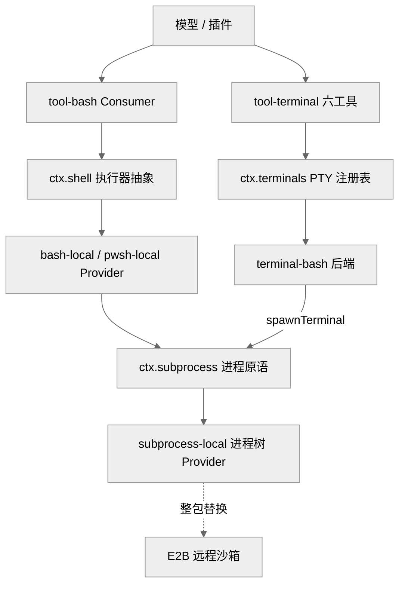
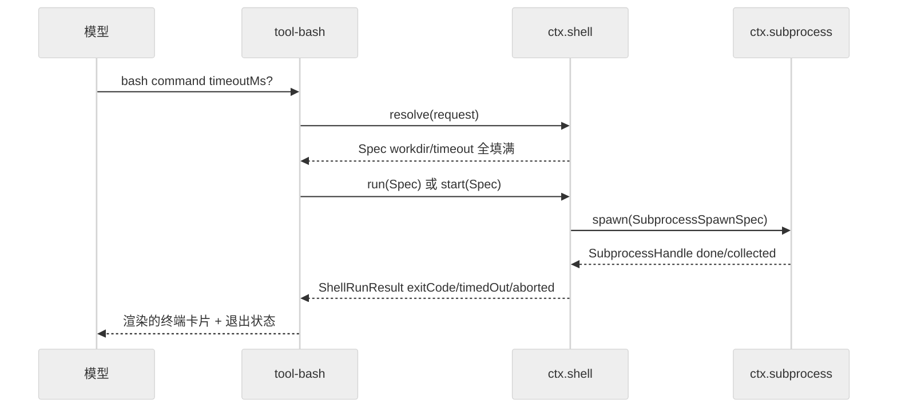
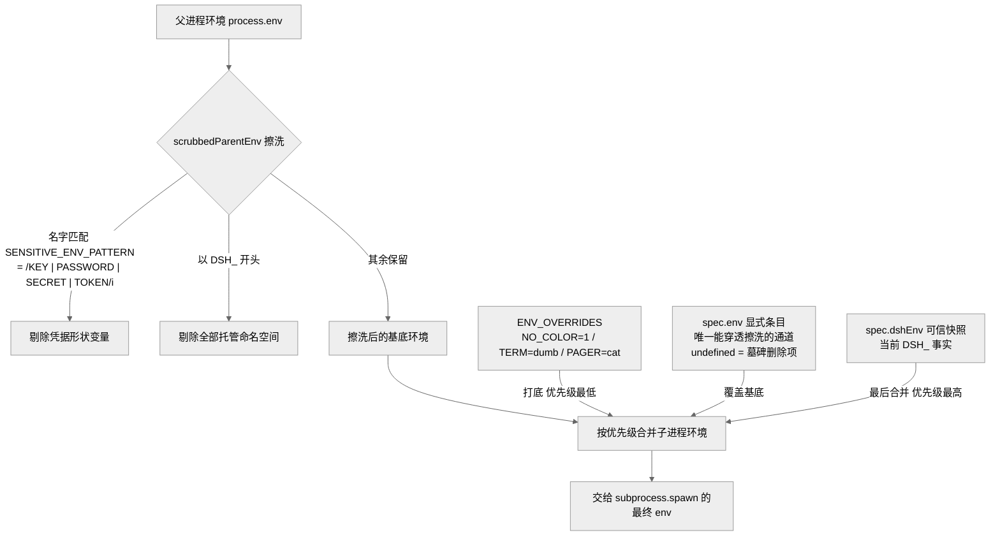
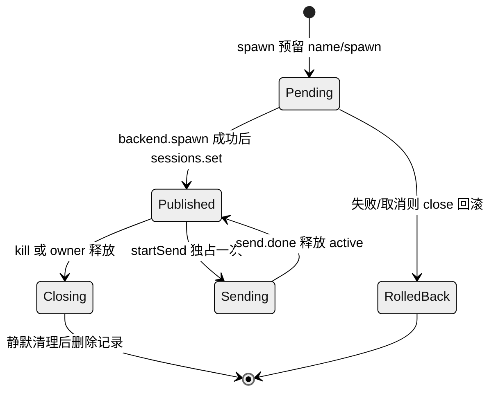

# 第 12 章 · 执行世界 Shell/Subprocess/Terminal

> 你有没有想过，当 AI 助手替你敲下一行命令时，背后到底发生了什么？本章讲 dsh 如何把"让模型跑命令"这件看似简单的事，拆成三层能力接缝（capability seam，可理解为一道"标准插槽"：接口固定，插头可整块替换）：`ctx.subprocess`（本地进程树）→ `ctx.shell`（bash/pwsh 执行器）→ `ctx.terminals`（持久 PTY 会话）。读完你能回答三个问题：为什么一次 `bash` 工具调用要穿过三个包；`resolve(request): Spec` 这个"显式默认化"步骤到底解决了什么；持久终端会话凭什么能跨工具调用、跨插件重载存活。

## 一、本质是什么

在一个 agent harness（可以理解为"给模型装工具、管权限、跑命令的运行时外壳"）里，"执行外部命令"是最危险也最高频的能力：模型跑得越顺手，一旦失控伤害越大。dsh 没有把它做成一个大而全的单体"执行服务"，而是沿着**抽象层次**切成三条独立的能力接缝，每条都严格遵守仓库的 Service Definition / Provider / Consumer 三角色约定（谁定义接口、谁提供实现、谁来消费，见 CLAUDE.md `## Conventions`）：

- **`ctx.subprocess`** —— 最底层的进程原语。它只管"在这个执行世界里启动一个进程树、按显式的 stdio 处置方式收流、以进程组为单位终止"，不懂 shell 语法、不懂超时语义、不懂展示。`[verified]`（`packages/subprocess/subprocess/src/index.ts:102`）
- **`ctx.shell`** —— bash/pwsh 执行器。它把一条命令字符串包成 `bash -c` / `pwsh -Command`，负责命令默认化、超时与中断归因、模型友好环境变量、前台/后台输出合并；本地实现经 `ctx.subprocess` 落地。`[verified]`（`packages/shell/shell/src/index.ts:65`、`packages/shell/bash-local/src/index.ts:102`）
- **`ctx.terminals`** —— 持久 PTY 会话注册表。它给每个 Agent 一个能跨工具调用保留 cwd/环境/后台任务的交互式终端，会话所有权绑定到精确的 `Agent`。`[verified]`（`packages/terminal/terminal/src/index.ts:105`）

一句话定位：**subprocess 是"进程",shell 是"一次命令",terminals 是"一段会话"**——三种不同的时间尺度和状态语义，被拆成三个可独立替换的插件。打个比方：subprocess 像"点火发动一台机器"，shell 像"下达并完成一道工序"，terminals 则像"雇一名一直在岗、记得上下文的操作员"。时间跨度和"要不要记住状态"完全不同，硬塞进一个类里只会互相绊脚。

## 二、核心问题与痛点

放到 harness 语境，执行命令要同时满足几组彼此拉扯的诉求：

1. **安全**：harness 自己的 `DEEPSEEK_API_KEY` 等凭据绝不能悄悄"随手"漏进子进程（想象你的 API 密钥被某条 `env` 命令原样打印出来）；杀进程也不能留下逃逸的孙子进程（父进程死了、子孙还在偷偷跑）。
2. **可控输出**：模型上下文（能读进去的字数）有限，而一条命令可能吐出 GB 级输出，必须有界截断，同时保留一份可恢复的完整流备查。
3. **归因清晰**：一条命令"超时了"、"被取消了"、"退出码非零"、"被信号杀了"是四件不同的事。模型不能把"被中途腰斩"错读成"干净成功"——否则它会基于假成功继续往下走。
4. **状态语义分层**：`ls` 这种一次性命令、`npm run dev &` 这种后台长任务、`python` REPL 这种需要跨调用保留状态的交互会话，是三种根本不同的生命周期。
5. **可替换**：本地进程、E2B 远程沙箱、Windows pwsh——底层执行世界要能整包换掉而不惊动上层工具，就像换了台服务器却不用重写业务代码。

单体"执行服务"会把这些诉求全糊在一个类里，越改越乱。dsh 的答案是按**关注点 + 抽象层次**双维度拆分。

## 三、解决思路与方案

### 三层依赖关系

> 图注：证明了"三层分立、单向依赖"。`ctx.shell` 与 `ctx.terminals` 都以 `ctx.subprocess` 为地基（`spawn` 走管道、`spawnTerminal` 走 PTY），而底层 Provider 可整包替换成远程沙箱——上层工具无感。`[verified]`（`bash-local` `static inject = ['subprocess']`，`packages/shell/bash-local/src/index.ts:103`；`terminal-bash` `inject = ['terminals','sandboxPolicy','subprocess']`，`packages/terminal/terminal-bash/src/index.ts`）

### 关键设计一：request/spec 的 `resolve()` 显式默认化

这是整个执行世界的**中枢约定**，也是仓库级铁律"Explicit > implicit at package boundaries"（在包与包的边界上，显式优于隐式）的样板（CLAUDE.md `## Conventions`）。核心思路是把"用户提的请求"和"执行器真正要拿去干活的规格"分成两种形状：

- **`ShellExecRequest`**：模型/插件面向的**请求**——像点菜时的口头需求，`workdir`（工作目录）/`timeoutMs`（超时毫秒）/`stdoutMaxBytes`（输出上限）都可以省略不填。`[verified]`（`docs/subsystems/shell.md`，类型见 `packages/shell/shell/src/types.ts`）
- **`ShellExecSpec`**：执行器真正据以行动的**已解析规格**——像厨房收到的正式工单，这些字段全部必填、无一空缺。`[verified]`

两者之间由工具层显式调用 `ctx.shell.resolve(request)` 完成转换：把 `workdir` 填上（来自 `config.cwd` 或 `process.cwd()`）、把 `timeoutMs` 填上并封顶（取 `config.timeoutMs`，再用 `clampTimeout` 夹到不超过 `config.maxTimeoutMs`）。`run()`/`start()` 只接受填满的 `Spec`，永不做第二次默认化。这样"缺省值到底是多少"这个问题，全程只在 `resolve` 这一个地方回答一次，下游不必再猜。`[verified]`（`resolve`，`packages/shell/bash-local/src/index.ts:146`）

> 图注：证明了"默认化是一次显式的 `resolve` 步骤，而非藏在 `run()` 里的 `?? default`"。工具层拿到的 `Spec` 已无歧义，执行器与子进程只处理确定值。`[verified]`（`packages/shell/bash-local/src/index.ts:146,211,226`）

> **ratify-note · 为何三层分立而非一个执行服务**
> - 候选解释：A 单体"执行服务"（一个类同时管进程、shell、PTY）；B 按抽象层次三层分立（现状）。
> - 各自利弊：A 优——调用链短、无跨包样板；缺——PTY 语义、shell 引号域、进程组终止、凭据擦洗全耦合在一处，替换底层（本地→E2B）要改动整块，且违反"一个 Consumer 不得绑架服务契约"的包约定。B 优——每层可独立替换与测试（`subprocess-local` 换成远程 Provider，上层不动）、关注点清晰（subprocess 不懂 shell、shell 不懂 PTY）、复用彻底（`scrubbedParentEnv`/`CollectedOutput`/`DSH_*` 由 subprocess 独占并被 shell 再导出）；缺——一次 `bash` 调用穿三个包、有跨包类型再导出的样板。
> - 选定 & 理由：选 B。第一性看，三者的**时间尺度与状态语义根本不同**（瞬时进程 / 一次命令 / 持久会话），强行合并会让生命周期管理互相污染；源码上 `terminal-bash` 与 `bash-local` 都复用同一个 `spawnTerminal`/`spawn` 地基却互不知道对方，正是分层收益的直接体现。
> - 证据等级：[verified]（三个 Service 抽象类分处三包：`subprocess/src/index.ts:102`、`shell/src/index.ts:65`、`terminal/src/index.ts:105`）；"为何这样设计"的动机部分 [inferred]（`.agents/notes/.../2026-06-13-capability-seams.md` 记录了接缝范式，但未逐字论证三层切法）。
> - 残余风险 / pre-mortem：若半年后此判断被证伪，最可能因跨层样板（类型再导出、`resolve` 转换）的维护成本超过了替换灵活性带来的收益——即"可替换性"在实践中很少真被行使。

### 关键设计二：subprocess 层"零默认、全显式"

`ctx.subprocess` 是最底层，它把"显式优于隐式"贯彻得最彻底：`SubprocessSpawnSpec` 上每个 stdio 处置（标准输入/输出/错误怎么收）、每个上限、每个目录都必填，"这个接缝不施加任何默认"——填什么由调用方的 config 决定，而不是藏在服务里替你偷偷决定。`argv`（命令参数数组）也永不经过 shell 解释，避免了引号、通配符被二次改写的意外。`[verified]`（`docs/subsystems/subprocess.md`；`SubprocessSpawnSpec` 注释直言 "the `dsh-shell` request/spec split is the owning template"）

作为地基，它还独占三样东西，并再导出给上层复用（好比水电总闸集中在一处，各房间共用同一套标准）：

- **`DSH_*` 托管命名空间**：harness 自有的一批子进程环境变量。实现会先丢弃环境里继承来的旧 `DSH_*`，再把当前快照合并进去，杜绝陈旧值误导子进程。`[verified]`（`docs/subsystems/subprocess.md`）
- **凭据擦洗 `scrubbedParentEnv()`**：像出门前的安检，用正则 `/KEY|PASSWORD|SECRET|TOKEN/i` 匹配、剔除长得像凭据的环境变量名，再剔除全部 `DSH_*`；只有显式列在 `env` 里的条目才能通过安检。它被导出为一个普通函数，好让无法走服务通道的 node-pty 后端也能共用同一份擦洗定义，不至于各写一套、留下漏洞。`[verified]`（`packages/subprocess/subprocess/src/index.ts:44,60`）
- **`CollectedOutput`**：有界收集 + 溢出文件的组合。输出被截断时，`text` 里保留的是**尾部**（因为报错信息通常在最后），而完整流会落盘到一个私有 spill 文件里备查，需要时仍能捞回来。`[verified]`（`docs/subsystems/subprocess.md`）

> 图注：证明了"凭据与 `DSH_*` 默认不流入子进程、只有显式 `spec.env` 能穿透擦洗"。合并顺序 `ENV_OVERRIDES → 擦洗基底 → spec.env → spec.dshEnv` 决定了可信 `DSH_*` 快照优先级最高、覆盖一切同名项。`[verified]`（`SENSITIVE_ENV_PATTERN`/`scrubbedParentEnv`，`packages/subprocess/subprocess/src/index.ts:44,60`；环境合并，`packages/shell/bash-local/src/index.ts:27,211,223`）

### 关键设计三：正交的结果归因

`ShellRunResult` 给 `timedOut`（是否超时）、`aborted`（是否被取消）、`signal`（被哪个信号杀）、`exitCode`（退出码）各设一个字段、**独立上报**，而不是压成一个"成功/失败"的笼统标志。为什么要这么细？因为一个进程完全可能既超时、又退出码为 0（它捕获了超时信号后自己收尾退出）——若只看退出码就会误判成功。字段分开后，调用方永远不会把"被腰斩的运行"读成"干净成功"。其中 `timedOut` 与 `aborted` 互斥：同一个"熔断 deadline"（一个到点就触发的截止闹钟）同时驱动超时和取消两条路径，谁先到谁定因。`[verified]`（`docs/subsystems/shell.md`；`runArgv` 里 `timedOut = timeoutOf(...)`、`aborted = signal.aborted && !timedOut`，`packages/shell/bash-local/src/index.ts:230`）

## 四、实现细节关键点

**本地执行器如何落地一次命令。** `LocalBashExecutor.run(spec)` 直接转发给 `runArgv(spec, ['bash','-c', spec.command])`；`runArgv` 先用 `deadline(signal, timeoutMs, 'BASH_TIMEOUT')` 造一个"融合了超时与上游取消"的信号（两根导火索并到一根），交给 `ctx.subprocess.spawn(...)` 拿到 handle，`await handle.done` 等它跑完，再把收集到的流投影成 `CollectedOutput`。环境的叠放次序是 `{ ...ENV_OVERRIDES, ...spec.env, ...spec.dshEnv }`——`ENV_OVERRIDES`（`NO_COLOR=1` 关彩色、`TERM=dumb` 关花哨终端特性、`PAGER=cat` 让分页器不卡住）打底，可信的 `dshEnv` 快照最后合并、优先级最高，谁在后谁说了算。`[verified]`（`packages/shell/bash-local/src/index.ts:27,196,211,223`）

**只给可信插件用的字段。** `stdin`、`env`、`stdoutMaxBytes` 是留给可信的进程内插件用的（例如 hooks 桥接需要把一段 JSON 载荷从 stdin 喂给 hook 命令），**模型面向的 bash 工具刻意不暴露它们**——模型若要写 stdin，只能老老实实用 heredoc 或管道这类 shell 语法。这道"类型层的隔离"确保模型拿不到本该属于可信插件的注入能力。`[verified]`（`docs/subsystems/shell.md`；`ShellExecRequest` 注释）

**后台进程的所有权边界。** `start()` 返回一个无 id、无 owner 的 `ShellProcess` 句柄；`tool-bash` 再把它适配进 `ctx.jobs` 这个通用后台任务运行时，由后者来持有 job 身份与生命周期。这里有个关键不变量：后台进程的"停止-等待"边界绑在 `ctx.subprocess` 的 dispose 上，**所以执行器插件自己 reload（热重载）时，并不会顺手杀掉正在跑的后台进程**——你的 `npm run dev` 不会因为一次插件重载而中断。`[verified]`（`docs/subsystems/shell.md`；`ShellProcess` 注释）

**pwsh 是 bash 的逐调用镜像。** `pwsh-local`（Windows PowerShell 执行器）把整条命令作为**一个** argv 元素传给 `-Command`，让 PowerShell 自己解析，因此不存在 `bash -c` 那层字符串引号域的问题；`TERM=dumb` 属于 POSIX 世界的概念，在这里被刻意省略。源码用 `/* jscpd:ignore */` 明确标注：它是对 `bash-local` 的**刻意逐行镜像**（call-for-call），而非偷懒复制——两边有意保持一一对应，方便对照维护。`[verified]`（`packages/shell/pwsh-local/src/index.ts`）

**PTY 会话的所有权与持久性。** PTY（伪终端）会话就像给模型开了一个一直亮着的终端窗口。`TerminalSessionService` 把一段 awaited 清理逻辑挂到精确的 owner scope 上（`ensureOwnerCleanup`），并拒绝任何外来操作（`expectOwned` 比对的是精确的 `Agent` 对象本身，而非它的名字或猜出来的 id，杜绝冒名顶替），还让会话**跨后端或工具插件重载依然存活**。会话只在后端 setup 成功之后才对外发布（`spawn` 里先 `backend.spawn(...)`、成功了才 `sessions.set`），一旦失败就回滚 `close`——绝不发布一个半死不活的会话。同一时刻一个会话只允许一次活跃的 `send`（`SEND_ACTIVE`），避免两条输入相互踩踏。`[verified]`（`packages/terminal/terminal/src/index.ts:105,154,243,387`）

> 图注：证明了 PTY 会话"先成功再发布、失败即回滚、关闭须静默"的所有权状态机。发布区间无缝隙（`hasOwnerActivity` 覆盖 spawn-to-close 全程），杜绝了竞态下的孤儿会话。`[verified]`（`packages/terminal/terminal/src/index.ts:231,285,435`）

**两个持久 shell 的 Consumer。** `ctx.terminals` 有两类模型面向的消费者：一是 `tool-terminal` 提供的六个显式工具（`terminal_open/send/read/signal/close/list`，开/发/读/发信号/关/列表），把终端操作摊开成一组明确的动作；二是 `tool-bash-persistent`——它让看起来普通的 `bash(command)` 调用**其实背靠一个 owner 独占的持久 shell**，于是 cwd、`export` 出的变量、激活的虚拟环境、定义的函数、后台任务都能跨多次调用保留下来。对比一下：普通 `bash` 每次都是一间用完即拆的新房间，而持久 shell 是一间你能反复回来、东西都还在原位的固定工位。`[verified]`（`packages/terminal/tool-terminal/src/index.ts:163-386`；`packages/shell/tool-bash-persistent/README.md`）

## 五、易错点与注意事项

- **`resolve()` 之后不得再默认化**。`run()`/`start()` 收到的一定是填满的 `Spec`；若某个执行器在 `run()` 里偷偷补一句 `?? default`，就破坏了"默认化只发生一次、且发生在显式的那个点"的不变量。沙箱子类想改默认值，正确姿势是 override `resolve()`，而不是去动 `run()`——把决策留在同一个地方。`[verified]`（`bash-local` 的 `resolve` 注释与 `sandboxPolicy` 透传逻辑，`src/index.ts:166`）
- **`DSH_*` 与凭据不会隐式流入子进程**。想故意转发某个凭据形状的变量、或当前的 `DSH_*` 事实，必须显式写进 `spec.env`（它在擦洗之后才合并，所以能穿透安检）；把值设成 `undefined` 则是一块"墓碑"，用来删除一个本来存在的普通环境项。`[verified]`（`packages/subprocess/subprocess/src/index.ts:60`）
- **`timedOut`/`aborted` 回答的是"首要原因是什么"，不是"有没有发生过"**。一个命令超时后又自己陷阱了信号、退出码为 0，此时 `timedOut=true` 而 `exitCode` 也可能有值——读结果时要逐字段判断，千万别只盯着 `exitCode`。`[verified]`（`docs/subsystems/shell.md`）
- **持久 shell 打开期间不能改沙箱模式**。`terminal-bash` 立了一道栅栏（fence）：只要会话开着、或正在创建，此时收到 `sandbox/mode` 变更事件就直接抛错，要求你先关闭会话。这是为了防止"半路换隔离级别"造成会话状态和权限对不上。`[verified]`（`packages/terminal/terminal-bash/src/index.ts`，`ensureSandboxModeFence`）
- **PTY 读取是"消费型"且有界的**。`readOutput()` 只返回自上次读以来的新增部分，连读两次不会重放同一段（像看消息只显示未读）；scrollback（回滚历史）分页也是有界的，早期内容一旦被 PTY 丢弃，返回结果会明说"前面丢了"，而不是拿尾部冒充完整输出蒙混过去。`[verified]`（`docs/subsystems/terminal.md`；`tool-bash-persistent/README.md`）

## 六、竞品/横向对比

社区普遍把 dsh 与 Claude Code / Codex CLI / Pi 归为同类 terminal/web agent harness（`[claimed]`，见《全网调研》E 节）。在"执行命令"这条线上，源码里留了几处直接对标同行的注释痕迹，正好让我们看清 dsh 在哪些地方选择"随大流"、又在哪些地方走自己的路。

> **ratify-note · dsh 的执行分层 vs 竞品做法**
> - 候选解释：A dsh 三层接缝 + `resolve` 显式默认（现状）；B 竞品常见的"单一 shell 执行封装 + 硬编码环境"路线（以 Codex/Claude Code 为参照）。
> - 各自利弊：A 优——底层 Provider 可整包替换成远程沙箱，PTY/管道两种原语共用一套进程树终止与凭据擦洗；缺——分层样板、学习曲线陡。B 优——实现直接、调用链短；缺——远程化/沙箱化要侵入式改造，环境策略与执行机制耦合。
> - 选定 & 理由：源码显示 dsh 有意与竞品在细节上收敛而非发明：`ENV_OVERRIDES` 注释明确 "the same set Codex hardcodes; Claude Code achieves it via TERM=dumb"，`graceMs` 默认 3s "matches OpenCode's 3s"。这说明 dsh 在**环境/超时这类无差异细节上对齐业界**，把独创性投在**分层可替换**上。就 harness 的可替换性目标而言，A 更优。
> - 证据等级：[verified]（`packages/shell/bash-local/src/index.ts:27,35` 的对标注释）；竞品内部实现细节 [claimed]（仅 dsh 注释的转述，未独立核实竞品源码）。
> - 残余风险 / pre-mortem：若被证伪，最可能因竞品后续也走向分层/远程沙箱，使"可替换性"不再是差异化优势，dsh 的分层样板反成纯成本。

一个可验证的细节对比：dsh 的 `bash` 工具**不向模型暴露 stdin 参数**，模型需要 stdin 时只能借助 shell 语法——这与"工具 schema 越严格越好"的社区评价（HN 上有人称其 JSON schema 比 Codex 更完整，`[claimed]`）方向一致：把可信插件才该有的能力（stdin/env 注入）与模型能拿到的能力**在类型层就划清界线**，而不是靠运行时临时判断。`[verified]`（`ShellExecRequest` 注释）

## 七、仍存在的问题与局限

> **ratify-note · 持久 PTY 的能力边界是缺陷还是有意收敛**
> - 候选解释：A 这是明确记录的"有意延迟"（deferred），非缺陷；B 这是覆盖不足的功能缺口。
> - 各自利弊：A 优——PTY note 白纸黑字列出延迟项、且保留 `bash/read/write/edit` 作为可靠默认；缺——用户遇到全屏 TUI 会碰壁。B 优——从用户视角确是能力缺失；缺——无视了"PTY 是额外能力、非默认工具的替代"这一设计声明。
> - 选定 & 理由：选 A。persistent-pty Agent Note 显式声明"支持交互 shell 与行式 REPL（Linux/macOS）；全屏终端应用、按键序列、BEL 触发的控制流、进程丢失后的会话恢复、跨 agent 会话共享——明确延迟"。这是记录在案的范围收敛，不是遗漏。
> - 证据等级：[verified]（`.agents/notes/implemented/feature/2026-07-16-persistent-pty-sessions.md`）。
> - 残余风险 / pre-mortem：若被证伪，最可能因真实 agent 工作流对全屏 TUI（如 `htop`、`vim` 全屏模式）的需求远超预期，使"行式为主"的收敛显得过窄。

其余可见局限：

- **无状态前台 shell 的历史包袱**。`bash-local` 里留着一个 `XXX(stateful-shell)` 标记，提示"当工作流确实需要保留 shell 状态时，评估改用持久 cwd 或 PTY 会话"——目前普通 `bash` 前台运行仍是每次开一个全新 shell，状态持久化能力被拆去了独立的 terminals 家族，两者尚未合流。换句话说，"记忆"这件事现在得显式选用持久终端，普通 `bash` 用完就忘。`[verified]`（`packages/shell/bash-local/src/index.ts:174`）
- **PTY 状态是进程本地的、无法持久化**。模型的输入和有界的返回输出，会经由既有的 `tool/call`、`tool/result` 路径落盘留存（满足"模型能看到的 ⟺ 都被记录"这条原则），但**原始的 PTY 字节流与 scrollback 只活在进程内存里**——进程一崩就没了，不支持会话恢复。`[verified]`（`docs/subsystems/terminal.md` `## Ownership and durability`）
- **权限策略仍是 TODO**。`tool-bash` 文件顶部标着 `TODO(permissions)`：部署策略本该落在 `tools/pre-execute` 与沙箱执行器上，目前还是接缝之间一处未填的开放缝隙。`[verified]`（`packages/shell/tool-bash/src/index.ts` 模块注释）

## 小结

执行世界是 dsh"一切皆可替换插件"信念在最危险那项能力上的一次严格演练：**subprocess/shell/terminal 三层按抽象层次与时间尺度分立**，单向依赖、各自可替换；`resolve(request): Spec` 把"填默认值"收敛成一次显式步骤，让下游只处理确定值、不再猜；凭据擦洗、有界输出、正交归因、进程组终止这些公共能力全部下沉到最底层复用，一处实现、处处受益；持久 PTY 则用精确的 owner 绑定加上"先成功再发布"的状态机，换来跨调用、跨重载的会话存活。回到开头那三个问题——为什么穿三个包、`resolve` 解决了什么、持久会话凭什么存活——答案都落在"分层"这两个字上。它与相邻章的衔接是：本章的底层执行，正是第 11 章能力接缝三角色的一个具体样板；而它的沙箱策略与远程化（E2B）则留待后续的远程/沙箱章节展开。

## 源码索引

- `packages/subprocess/subprocess/src/index.ts:44,60,102` —— `SENSITIVE_ENV_PATTERN`、`scrubbedParentEnv()`、`SubprocessRuntime` 抽象类
- `packages/subprocess/subprocess/src/types.ts` —— `SubprocessSpawnSpec`（"零默认"、`dsh-shell` 为其模板）、`CollectedOutput`、`SubprocessTerminalSpawnSpec:204`、`SubprocessTerminalHandle:235`
- `packages/shell/shell/src/index.ts:65,85,93,100` —— `ShellExecutor` 抽象类与 `resolve/run/start`
- `packages/shell/bash-local/src/index.ts:27,103,146,196,211,223,230,255,174` —— `ENV_OVERRIDES`、`inject`、`resolve`、环境合并、`runArgv`、超时归因、`startArgv`、`XXX(stateful-shell)`
- `packages/shell/pwsh-local/src/index.ts` —— pwsh `-Command` 单 argv、call-for-call 镜像
- `packages/shell/tool-bash/src/index.ts` —— 模型面向 Consumer、`TODO(permissions)`
- `packages/shell/tool-bash-persistent/README.md` —— 背靠持久 shell 的 `bash`
- `packages/terminal/terminal/src/index.ts:105,154,231,243,285,387,435` —— `TerminalSessionService`、`spawn`、`hasOwnerActivity`、`startSend`、`kill`、`expectOwned`、`disposeAll`
- `packages/terminal/terminal-bash/src/index.ts` —— 持久 shell 后端、沙箱模式 fence
- `packages/terminal/tool-terminal/src/index.ts:163-386` —— 六个 `terminal_*` 工具
- `docs/subsystems/shell.md`、`docs/subsystems/subprocess.md`、`docs/subsystems/terminal.md` —— 三接缝的类型与语义总述
- `.agents/notes/implemented/feature/2026-07-16-persistent-pty-sessions.md` —— 持久 PTY 决策与延迟项
- CLAUDE.md `## Conventions` —— "Explicit > implicit at package boundaries"、"capability seam" 铁律
