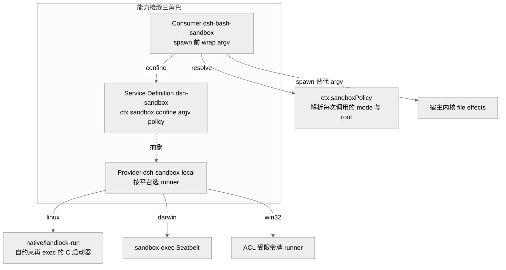
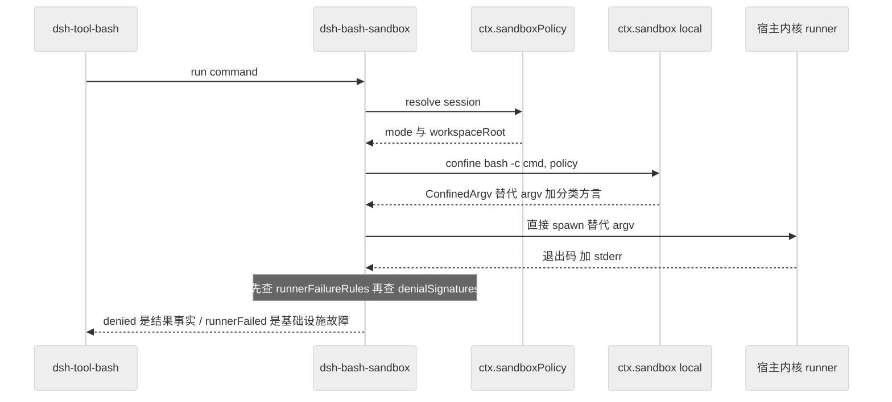
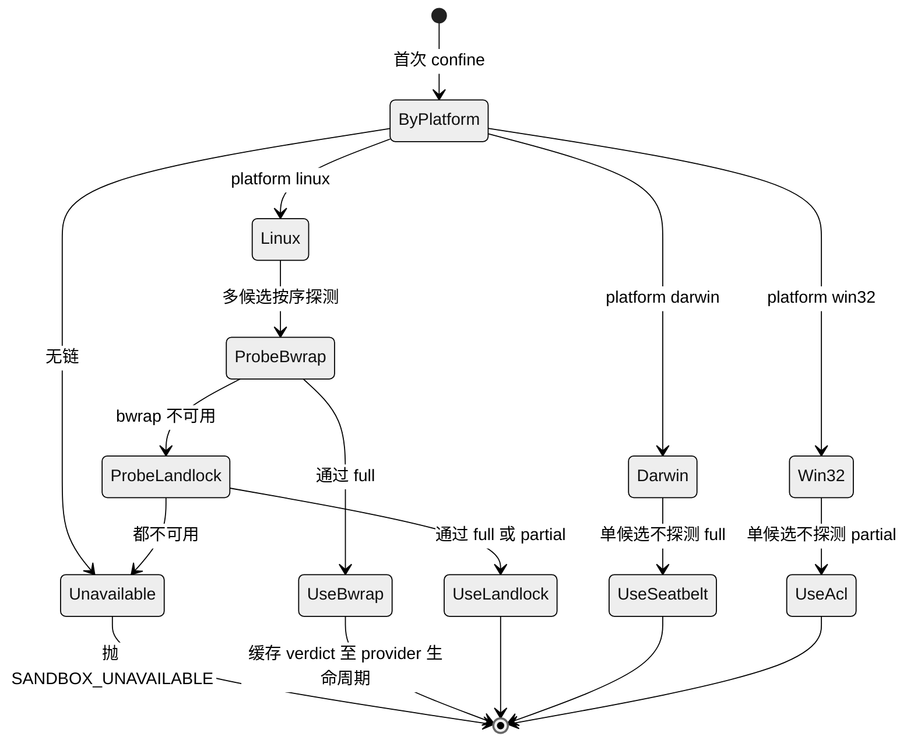
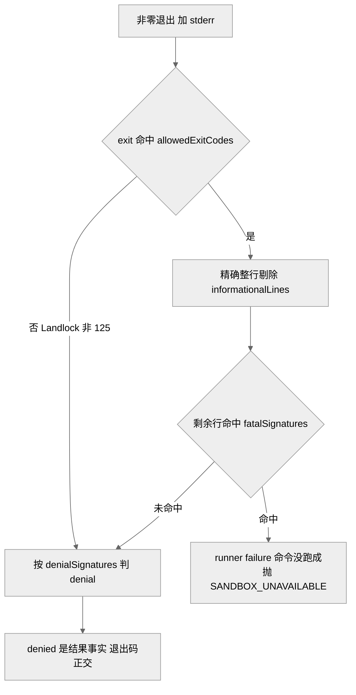

# 第 13 章 · 沙箱与进程约束

> 本章讲 `dsh` 如何在"模型可以随手 `rm -rf` "的现实下，给它执行的子进程套上一层文件效果的约束。读完你能回答三个问题：`ctx.sandbox` 这条接缝到底约束了什么、没约束什么；consumer 为什么是"在 spawn 前 wrap argv"而不是"包一层执行器"；以及为什么 dsh 反复强调"沙箱是 steering（引导）而非 containment（关押）"，这句话在哪些地方成立、在哪些地方是诚实的降级声明。

## 一、本质：一条"包裹 argv"的进程约束接缝

`ctx.sandbox` 是一个能力接缝（capability seam）的 Service Definition，它的全部职责浓缩在一个抽象方法里：

```ts
abstract confine(argv: readonly string[], policy: SandboxPolicy): ConfinedArgv
```

它接收 caller **即将 spawn 的那一串确切 argv**（不是 shell 字符串——shell 形态的 consumer 自己传 `['bash', '-c', command]`），返回一串**替代 argv**：runner + profile + `--` 分隔符 + 原 argv，caller 用它替换自己原本要执行的命令去 spawn `[verified]`（`packages/sandbox/sandbox/src/index.ts:164-176`）。

它的定位有一句被反复重申的边界声明写在模块 JSDoc 里：这是**同世界（same-world）子进程约束**——后端与宿主共享同一个内核和文件系统。容器、microVM、远程执行**不是**这条接缝的后端，它们替换的是整条能力接缝（`ctx.shell`、`ctx.fs`）的 Service Provider，作为环境一致的整组替换 `[verified]`（`index.ts:1-6`、`sandbox.md:5`）。理由很实在：一个 agent 若 bash 跑在容器里、fs 工具却写宿主盘，它就活在两个割裂的世界里。

约束的**范围**同样被刻意收窄。`SandboxMode` 只有三个值，且**只管文件效果**：

```ts
type SandboxMode = 'read-only' | 'workspace-write' | 'danger-full-access'
```

`read-only` 只放行 shell 必需的 `/dev/null` 这类 sink；`workspace-write` 额外放行 workspace 根目录与后端约定的 temp 区；`danger-full-access` 完全不约束 `[verified]`（`index.ts:23-29`）。网络与进程可见性**明确不在这套词汇里**——bwrap profile 甚至故意不 unshare pid，没有任何后端声称限制网络 `[verified]`（sandbox Agent Note FAQ，`2026-07-06-sandbox.md:191`）。这种"只承诺做得到的"是本章贯穿始终的立场。

<div style="background: #ffffff !important; background-color: #ffffff !important; padding: 16px; border-radius: 8px; margin: 16px 0;" bgcolor="#ffffff">



</div>

> 图注：这张图证明"一次 provider 替换改变整个产品"的接缝结构——consumer 只认 `ctx.sandbox` 与 `ctx.sandboxPolicy` 两个抽象，具体是 bwrap / Landlock / Seatbelt / Windows ACL 哪一个后端在约束，它并不知道。

## 二、核心问题：默认约束、可升级、绝不静默放行

放到 agent harness 语境，进程约束要同时满足几件互相拉扯的事（`2026-07-06-sandbox.md:9-13`，`[verified]`）：

- **默认就受限**：coding agent 的 bash 子进程（连同搭它便车的 hook 命令）默认跑在受限文件沙箱里，而不是等 review 时才想起来。
- **可申请升级**：当且仅当沙箱**真的**拒绝了某个操作，模型可以就同一操作请求一次用户批准，批准后以更宽的权限重试一次。没有升级路径的拒绝是"死路"——只会把运维逼着全局配 `danger-full-access`，反而废掉沙箱。
- **绝不静默放行**：拿不到可用后端时必须 fail-closed，抛结构化的 `SANDBOX_UNAVAILABLE`，而非降级成不受约束地执行 `[verified]`（`index.ts:131-144`）。
- **fallback 必须自带**：首选 runner `bwrap` 恰恰在最需要沙箱的宿主上不可用（精简容器、禁用了非特权 userns、拒绝 `mount` 的 LSM），所以 SDK 必须**自带**一个 fallback 启动器，而不能假设宿主上有 `[verified]`（`2026-07-06-sandbox.md:11`）。

## 三、解决思路：一接缝、一条 per-platform 链、两个杠杆

方案是"一条接缝、每平台一条本地后端链、一个 consumer，外加两个杠杆：per-call 升级 + per-session 运行时模式"，且一切从叶子 `cordis.yml` 组装，不碰 `agent-loop` `[verified]`（`2026-07-06-sandbox.md:16-17`）。

**后端链**在 `dsh-sandbox-local` 里是一张按平台索引的表：Linux 是 `['bwrap', 'landlock']`，darwin 是 `['seatbelt']`，win32 是 `['windows-acl']` `[verified]`（`sandbox-local/src/index.ts:159-166`）。选择**先按平台、再按探测**：多候选时按顺序做**功能性探测**（真的建一个 profile 并强制执行，而非查 `--version`），单候选则直接选、不探测——因为探测是用来"仲裁多个候选"的，只有一个时没什么可仲裁，而探测成本会拖慢每个 session 的第一条受限命令 `[verified]`（`index.ts:492-539`、`2026-07-06-sandbox.md:136`）。

**per-call 策略载体**是关键设计：策略随**每一次调用**走，而不是钉在 provider 上。`SandboxPolicy` 携带 `mode` + `workspaceRoot` + 可选 `sessionId`，两个 consumer 可以在同一瞬间用不同策略约束（bash 跑 `read-only`，同时一个受限子 agent 需要它的状态目录可写），一次被批准的升级重试就是一次携带更宽策略的**新调用** `[verified]`（`index.ts:61-72`、`sandbox.md:79-94`）。

> **ratify-note · 为何"包裹 argv"而非"包一层执行器"**
> - 候选解释：A 现状——Service Definition 只做 `confine(argv)→argv`，consumer 自己 spawn 替代 argv；B ——做一个通用 `ToolRuntime`，把任意工具包进沙箱；C ——把约束机制直接塞进 `dsh-bash-sandbox` 内部。
> - 各自利弊：A 优：约束的是"进程边界"这一真实语义，`execve` 后 ruleset 被继承，对 fs/web/todo 这类**进程内**工具诚实地不假装能约束；缺：consumer 必须自己负责 spawn 与结果归因。B 优：形式统一；缺：对进程内工具"机械性地错"——它们只是闭包在 `ctx` 上，argv wrapper 无法约束一个闭包，这是被明确否决的方案。C 优：少一个包；缺：挡住第二个 consumer（ACP 子 agent），且让未来阶段从一个 bash 插件的 config 里读 mode，也无法表达升级。
> - 选定 & 理由：选 A。第一性上，OS 级约束的最小真实单位就是"进程 + 它 spawn 的一切"，`confine(argv)` 精确对齐这个单位；进程内工具改走 `ctx.sandboxPolicy` 的 per-capability 策略围栏（见 Ch14 的 fs 沙箱），而非硬套 wrapper。
> - 证据等级：[verified]（`index.ts:164-176`；否决项见 `2026-07-06-sandbox.md:143-144`）
> - 残余风险 / pre-mortem：若半年后被证伪，最可能因新增了大量进程内、却又需要真实隔离的工具，使"进程边界 = 约束单位"不再覆盖主要威胁面。

<div style="background: #ffffff !important; background-color: #ffffff !important; padding: 16px; border-radius: 8px; margin: 16px 0;" bgcolor="#ffffff">



</div>

> 图注：这张时序图证明"策略在调用时解析、约束在 spawn 前施加、归因在返回后分两类判定"——denial（沙箱正常工作并挡住了命令）与 runner failure（沙箱本身没跑起来）是两条正交的判定，consumer **先查后者**。

## 四、实现细节：ConfinedArgv、native 启动器、方言分离

`confine` 的返回值 `ConfinedArgv` 除了替代 argv，还带三样东西 `[verified]`（`index.ts:90-116`）：

- `enforcement: 'full' | 'partial'`——后端对本次策略承诺的文件效果是**全部**还是**只governs一个子集**（旧内核 ABI 或某些后端）。要求绝对边界的 caller **不得**把 `partial` 当 `full`。
- `denialSignatures`——**该后端**拒绝某文件效果时其内核打印的 stderr 子串方言：bwrap 的 EROFS 文案、Landlock 的 EACCES、Seatbelt 的 EPERM。consumer 只匹配**这一个后端**的方言，而非跨后端的并集（并集会声称某后端根本不会产生的拒绝）`[verified]`（`sandbox-local/src/index.ts:205-213`）。
- `runnerFailureRules`——结构化的"runner 在执行命令前就失败了"的证据规则（见第五节）。

**native 启动器**是这条链上最"底层"的一块。`native/landlock-run` 是一个约 **298 行的 C 程序**（纯 C11 直接打 Landlock UAPI，除静态链接的 musl 外无任何库，审计面就是这一个文件加内核稳定的 syscall 契约），做的是"**自约束再 exec**"：`--ro <path>` / `--rw <path>` 声明授权，`--` 后是被包裹的 argv；它先 `set no_new_privs`、把 ruleset 装到自己身上，再 `exec`（ruleset 跨 `execve` 被继承）`[verified]`（`2026-07-06-sandbox.md:65`、`main.c` 298 行实测、`native/landlock-run/docs/architecture.md:22-24`）。

启动器打包成"一个 entry 包 + 每平台一个二进制包"的家族：entry 包是纯 ESM JS，拥有 CLI 契约（`launcherPath`、`probe`、常量），并在 tarball 里附带 C 源码供审计；平台包只有一个预编译静态二进制、无任何 JS，由 npm 的 `os`/`cpu` 字段在安装时选中 `[verified]`（`architecture.md:5-18`）。CLI 解析器与二进制在**同一版本家族**里绑定发布，解析器不会落后于二进制——这就是这个包拆分存在的唯一理由。dsh 刻意**不提交编译好的二进制**（diff 里的二进制不可审、且churn历史），而是"审 C 源码 + 原生 CI 构建 + 主仓库逐字节 pin 的发布演练" `[verified]`（`2026-07-06-sandbox.md:137`、`architecture.md:28`）。

**探测是功能性的**：`probe()` 让启动器在一个短命子进程里真的强制一套最大 ruleset，退出 0 才算"内核真的在执行约束"——版本检查会漏掉"有 syscall 却拒绝执行"的内核。二进制缺失与"内核不执行"都探测为 `unusable`，consumer 只有**一条**降级路径 `[verified]`（`architecture.md:18-20`）。

<div style="background: #ffffff !important; background-color: #ffffff !important; padding: 16px; border-radius: 8px; margin: 16px 0;" bgcolor="#ffffff">



</div>

> 图注：这张状态图证明"选择结果被缓存至 provider 生命周期"以及"单候选直接选、多候选才探测"——darwin 的 Seatbelt 与 win32 的 ACL runner 都是各自平台的唯一候选，选中而不探测，其执行期的 fail-closed 拒绝仍兜底。

## 五、易错点：partial-enforcement 误分类（postmortem 0004）

postmortem 0004 记录了一个精确的教训，它恰好坐落在本章两个正交判定（denial vs runner-failure）的接缝上 `[verified]`（`docs/postmortem/0004-landlock-partial-notice-misclassified-child-failures.md`）。

背景：在**旧 Landlock ABI** 的内核上，启动器每次执行子进程前都会打印一行**善意的** partial-enforcement 提示 `landlock-run: partial enforcement (older Landlock ABI)`，然后照常进入子进程；而**真正的启动器失败**会打印另一行 `landlock-run:` 前缀并以 **125** 退出、**不**执行子进程。两者共享 `landlock-run:` 前缀，但语义相反。

缺陷：早期实现把这个契约压成了单个大小写不敏感的 `'landlock-run: '` 子串，consumer 把"任何带此子串的非零退出"都判成 runner failure。于是子进程自己的退出码被"贴"到了启动器那行善意提示上——`false`、ripgrep 无匹配的退出 1、无效模式的退出 2、甚至子进程自选的退出 125，都可能被错判成 `SANDBOX_UNAVAILABLE`。当时基于 bash 的文件搜索又把结构化的 `SandboxUnavailableError` 藏在一个泛化的 `SEARCH_FAILED` 后面，二次归因错误。

关键点是：**这个缺陷没有削弱约束、也没有让命令不受约束地运行**。它的安全影响是**可用性与诊断完整性**——一个合法的受限结果被拒绝或被贴错标签 `[verified]`（postmortem 0004 "Impact" 段）。

修复把"单个子串"升级为结构化的 `RunnerFailureRule`：先按 `allowedExitCodes` 门控（Landlock 要求退出 **125**），再按 `informationalLines` 做**精确整行**排除，最后在剩余每一行里匹配 `fatalSignatures`——**退出码本身永远不能单独证明 runner 失败** `[verified]`（`index.ts:74-88`、`sandbox-local/src/index.ts:231-240`）。bwrap 与 Seatbelt 保持"仅签名"，因为它们的公开契约都没保留一个"启动器失败"状态码。

<div style="background: #ffffff !important; background-color: #ffffff !important; padding: 16px; border-radius: 8px; margin: 16px 0;" bgcolor="#ffffff">



</div>

> 图注：这张判定图证明"进程归因需要多条独立证据的合取，共享前缀不是协议"——退出码门控 + 精确整行排除 + 每行致命签名三者合取，才把善意提示行与真正的启动器失败分开。

postmortem 还留了一句诚实话：stderr 仍是**带内（in-band）**归因通道，一个已被约束的子进程可以**故意**复现 runner 的致命行与退出码，制造可用性/诊断上的错误归因。收紧后的合取只防住了本次的**意外**碰撞，并不认证写入者；带外状态协议是另一项硬化，**不是**沙箱绕过的修复 `[verified]`（postmortem 0004 "Root cause" 末段、`2026-07-06-sandbox.md:177`）。

## 六、横向对比：steering 还是 containment

"沙箱是 steering 而非 containment"这句立场，在 dsh 里其实横跨一个**光谱**，理解它需要把两类沙箱分开看。

**进程沙箱（本章主角）是真实的内核文件效果边界**——bwrap 的 mount profile、Landlock 的 ruleset、Seatbelt 的 `(deny file-write*)` profile，都是内核真的在执行的约束，不是"引导"。它诚实的地方在于**把边界的范围说清楚**：只管文件效果、不管网络与进程可见性；旧 ABI 下 Landlock 报 `partial`；Windows ACL 因 `WRITE_RESTRICTED` 必须保留 Everyone、且 NTFS 硬链接会跨路径别名一个文件对象而报 `partial`——**从不**把这些吹成 `full` `[verified]`（`sandbox-local/README.md:36-40`、`index.ts:177-187`）。

**进程内沙箱才是真正的"steering, not containment"**。`db857f62c0`（2026-07-09）这次提交把 `tool-cordis`（让模型写 JS 挂成临时插件的 `node:vm` realm）的措辞从"一切都可检查可 dispose"改成诚实的表述：sandbox 全局上的宿主 realm helper（`harness`、`console`、`btoa`）是**可达的函数**，认真找的 mount 代码能穿过它们抵达宿主 realm——traps 与小全局面只是**把诚实的代码引导（STEER）到 cordis 服务上，它们不是安全边界** `[verified]`（commit `db857f62c0`、`packages/extensions/tool-cordis/README.md:102`）。code-mode 的 worker 也是同样的"containment, not a security boundary"定位 `[verified]`（`2026-06-15-code-mode.md:84`）。

> **ratify-note · "steering not containment"立场的取舍与风险**
> - 候选解释：A 现状——分层诚实：进程沙箱是真实（但范围受限、可能 partial）的内核边界，进程内沙箱明说只是"对诚实代码的引导"；B ——统一宣称"我们有沙箱"，不细分层次；C ——把进程内工具也塞进真实内核边界后才允许运行。
> - 各自利弊：A 优：每一处的安全声明都能被源码验证，运维能据此判断该给多少信任；缺：文档更啰嗦，"沙箱"一词在不同处含义不同，易被误读。B 优：对外简单；缺：过度声明——一旦用户把"有沙箱"当成"能关押恶意代码"，`node:vm` 那层的宿主 realm 逃逸就是一次安全事故。C 优：真隔离；缺：进程内工具是闭包在 `ctx` 上的，argv wrapper 机械性地无法约束它，强行做等于重写成声明式 effect 协议，代价不合理。
> - 选定 & 理由：选 A。第一性上，一个 harness 能提供的最强诚实是"精确说明每层边界的强度"；把 `node:vm`/worker 说成"引导"，把进程沙箱说成"文件效果的真实边界且可能 partial"，让信任决策落到有依据的地方，而非营销话术。
> - 证据等级：[verified]（commit `db857f62c0`；`tool-cordis/README.md:102`；进程沙箱范围声明 `index.ts:23-29`）
> - 残余风险 / pre-mortem：若半年后被证伪，最可能因某个部署把 `tool-cordis`/code-mode 当成多租户硬隔离来用，而"steering"的措辞埋在 README 深处没被读到——诚实声明存在，但触达用户的路径不够强。

与竞品相比，Claude Code / Codex 一类 harness 同样在 macOS 用 Seatbelt、在 Linux 用 namespace/seccomp 类机制约束命令 `[claimed]`（社区认知，`全网调研` E 节）。dsh 的差异更多在**接缝化**：约束是一个可从 `cordis.yml` 组装/替换的一等公民能力，而不是钉在某个执行器内部的私有机制——删掉 `sandbox`/`permission` 两个条目、把 `bash` 换成 `dsh-bash-local` 就是完整的 opt-out，升级字段也随之从工具 schema 消失（因为它们是挂在执行器能力上、而非配置上）`[verified]`（`2026-07-06-sandbox.md:39`）。

## 七、仍存在的问题与局限

- **同世界 = 不是硬隔离**。进程沙箱共享宿主内核与文件系统，它约束的是**文件效果**，不是一个可以关押恶意代码的容器；真正的多租户硬隔离需要容器级后端替换整条能力接缝 `[verified]`（`index.ts:1-6`、`2026-06-15-code-mode.md:84`）。
- **Landlock 只与运行内核的 ABI 一样完整**。旧 ABI 报 `partial` 而非拒绝——这是"保住 fallback 在旧内核宿主上可用"的**刻意权衡** `[verified]`（`sandbox-local/README.md:37`）。
- **Seatbelt 依赖 Apple 弃用但仍随附的 `sandbox-exec`**。作为 darwin 唯一候选，它不经功能性探测被直接选中（`chainVerdict` 对单候选链直接返回、不调 `probeRunner`）；若 Apple 移除它，缺失会在执行期 spawn 失败并被归因为 runner-failure，从而 fail-closed、命令不被放行——注意此处的 fail-closed 来自执行期失败归因，而非功能性探测（探测只用于 override/多候选链）`[verified]`（`sandbox-local/src/index.ts:499-504` `chainVerdict`、:85-91）。
- **Windows 是 partial 后端**。受限令牌必须保留 Everyone、NTFS 硬链接可跨路径别名，provider 据实报 `partial` `[verified]`（`sandbox-local/README.md:36`）。
- **带内归因不认证写入者**。stderr + 退出码无法密码学地证明"是谁写的"，一个已受约束的子进程能刻意伪造 runner 的致命行制造错误归因；这是可用性/诊断问题，不是绕过，带外状态协议是独立的后续硬化 `[verified]`（postmortem 0004、`2026-07-06-sandbox.md:177`）。
- **runner 选择缓存至 provider 生命周期**。安装/移除/修复一个 runner 需要重载插件才会改变选择 `[verified]`（`sandbox-local/README.md:39`）。

## 小结

这一章的进程沙箱是 dsh"只承诺做得到的"工程审美的一个密集样本：`confine(argv)→argv` 一个方法就框定了同世界、文件效果、fail-closed 三条边界；per-platform 链把 bwrap 的理想与旧内核的现实用 `full`/`partial` 诚实地区分开；postmortem 0004 则把"共享前缀不是协议、进程归因需要证据合取"这条教训固化进了结构化的 `RunnerFailureRule`。而"steering not containment"不是一句谦辞，而是一张分层的安全声明地图——它精确到"哪层是真的内核边界、哪层只是引导诚实代码"。下一章（Ch14 · 文件系统与 LSP）会看到 `read-only`/`workspace-write` 这套同一 mode 词汇如何从 bash 的 OS runner 延伸到进程内的 `ctx.fs` 路径围栏，成为"同一 mode 含义的第四种方言"。

## 源码索引

- `packages/sandbox/sandbox/src/index.ts:23-176` — `SandboxMode` / `ConfinedArgv` / `RunnerFailureRule` / `SandboxProvider.confine` / `SANDBOX_UNAVAILABLE`
- `packages/sandbox/sandbox/src/roots.ts:1-70` — `writableRoots` / `canonicalPath`：workspace-write 的规范化可写根
- `packages/sandbox/sandbox/src/escalation.ts:1-64` — 严格更宽升级阶梯、参数配对校验
- `packages/sandbox/sandbox-local/src/index.ts:159-166,177-240,492-539` — `PLATFORM_CHAINS`、`DENIAL_SIGNATURES`、`RUNNER_FAILURE_RULES`、链选择与探测
- `packages/shell/bash-sandbox/README.md` — consumer：spawn 前 wrap、denial/runner-failure 归因
- `native/landlock-run/docs/architecture.md` + `packages/entry/src/main.c`（298 行）— 自约束再 exec 的 C 启动器、两层包家族、功能性探测
- `docs/subsystems/sandbox.md` — 接缝词汇与分类方言的规范文档
- `docs/postmortem/0004-landlock-partial-notice-misclassified-child-failures.md` — partial-enforcement 提示误分类子进程失败
- `.agents/notes/implemented/feature/2026-07-06-sandbox.md` — 完整决策记录（seam、native runner、升级、per-session 模式）
- commit `db857f62c0`（2026-07-09）+ `packages/extensions/tool-cordis/README.md:102`、`.agents/notes/implemented/feature/2026-06-15-code-mode.md:84` — "steering, not containment"立场
