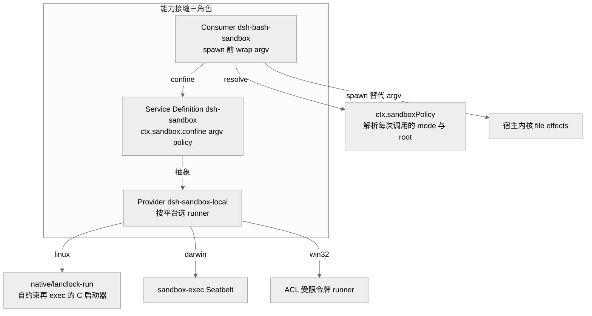
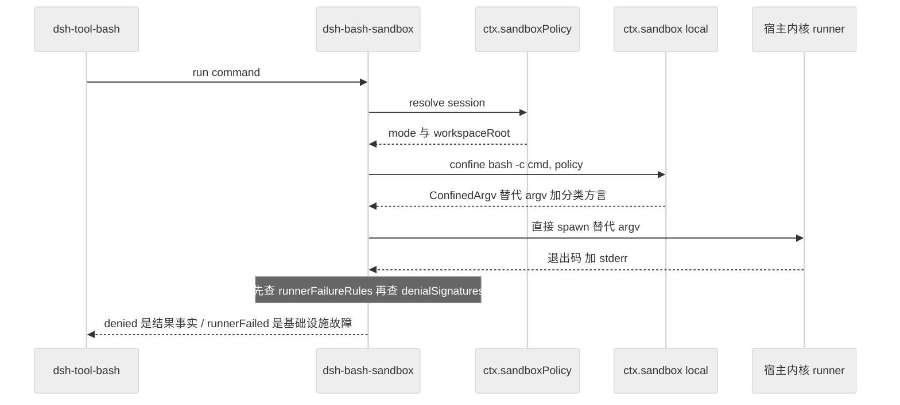
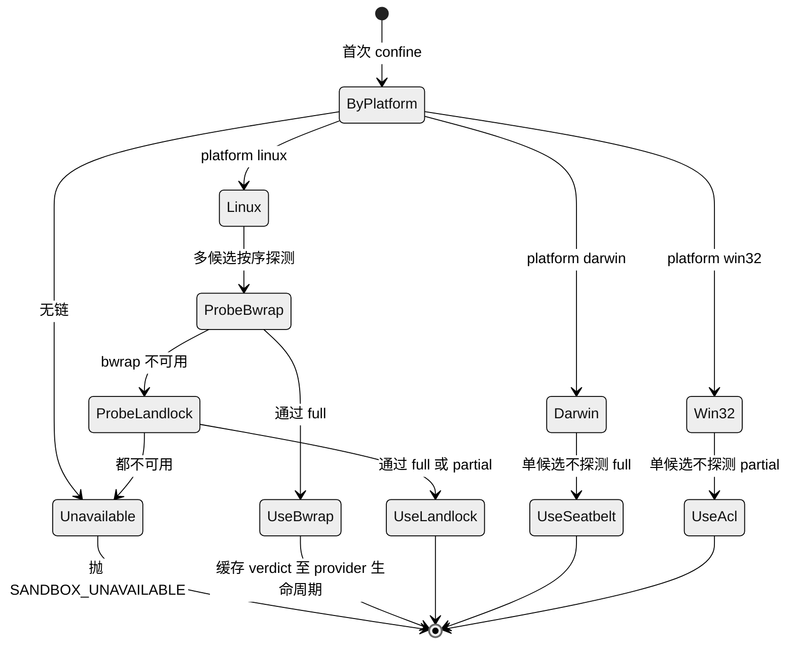
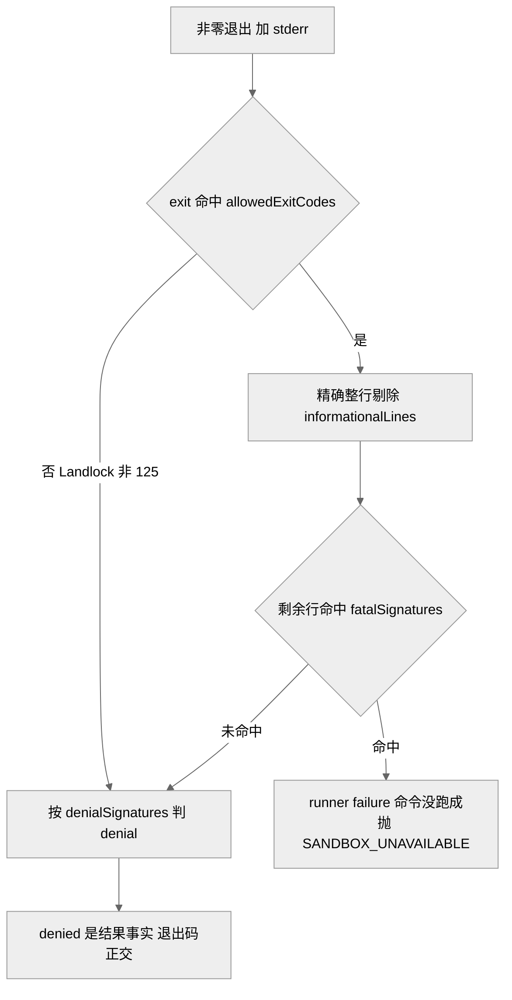

# 第 13 章 · 沙箱与进程约束

> 本章讲 `dsh` 如何在"模型可以随手 `rm -rf` "的现实下，给它执行的子进程套上一层文件效果的约束。读完你能回答三个问题：`ctx.sandbox` 这条接缝到底约束了什么、没约束什么；consumer 为什么是"在 spawn 前 wrap argv"而不是"包一层执行器"；以及为什么 dsh 反复强调"沙箱是 steering（引导）而非 containment（关押）"，这句话在哪些地方成立、在哪些地方是诚实的降级声明。

## 一、本质：一条"包裹 argv"的进程约束接缝

先说"能力接缝"（capability seam）是什么：它是一处**约定好的插槽**——上层只依赖一个抽象接口，具体是谁在背后干活可以随时替换，像墙上的插座标准，换灯泡不用改电路。`ctx.sandbox` 就是这样一个 Service Definition（服务定义，即插槽的接口那一侧），它的全部职责浓缩在一个抽象方法里：

```ts
abstract confine(argv: readonly string[], policy: SandboxPolicy): ConfinedArgv
```

`confine` 的字面意思就是"关进去"。它接收 caller **即将 spawn 的那一串确切 argv**（`argv` 就是"程序名 + 一个个参数"组成的数组，比如 `['ls', '-l', '/tmp']`；注意不是一整行 shell 字符串——需要走 shell 的 consumer 自己传 `['bash', '-c', command]`），返回一串**替代 argv**：runner + profile + `--` 分隔符 + 原 argv。换句话说，它在原命令外面套了一层"先给自己上约束、再运行原命令"的启动器，caller 用这串替代 argv 替换自己原本要执行的命令去 spawn `[verified]`（`packages/sandbox/sandbox/src/index.ts:164-176`）。

它的定位有一句被反复重申的边界声明写在模块 JSDoc 里：这是**同世界（same-world）子进程约束**——所谓"同世界"，指的是被约束的进程和宿主机共用同一个内核、同一套文件系统，只是在这套共享环境里划出一圈"哪些文件能碰"的围栏。容器、microVM、远程执行**不是**这条接缝的后端，它们做的是另一件事：整体换掉 `ctx.shell`、`ctx.fs` 这些能力接缝的 Service Provider，把 agent 整个搬进另一个环境 `[verified]`（`index.ts:1-6`、`sandbox.md:5`）。为什么不能混用？理由很实在：一个 agent 若 bash 跑在容器里、fs 工具却写宿主盘，它读到的和写出的就对不上，等于活在两个割裂的世界里。

约束的**范围**同样被刻意收窄。`SandboxMode` 只有三个值，且**只管文件效果**：

```ts
type SandboxMode = 'read-only' | 'workspace-write' | 'danger-full-access'
```

这三档像水龙头的三个开度：`read-only` 只放行 shell 必需的 `/dev/null` 这类 sink（"废水口"——写进去就丢弃，不落盘）；`workspace-write` 额外放行 workspace 根目录与后端约定的 temp 区，也就是"只让它在自己的工作目录里写"；`danger-full-access` 则完全拧开、不约束 `[verified]`（`index.ts:23-29`）。要留意的是：网络访问和进程可见性（能不能看到别的进程）**明确不在这套词汇里**——bwrap profile 甚至故意不 unshare pid（即不给子进程一个独立的进程命名空间），也没有任何后端声称能限制网络 `[verified]`（sandbox Agent Note FAQ，`2026-07-06-sandbox.md:191`）。这种"只承诺做得到的、不吹能做不到的"是本章贯穿始终的立场。

<div style="background: #ffffff !important; background-color: #ffffff !important; padding: 16px; border-radius: 8px; margin: 16px 0;" bgcolor="#ffffff">



</div>

> 图注：这张图证明"一次 provider 替换改变整个产品"的接缝结构——consumer 只认 `ctx.sandbox` 与 `ctx.sandboxPolicy` 两个抽象，具体是 bwrap / Landlock / Seatbelt / Windows ACL 哪一个后端在约束，它并不知道。

## 二、核心问题：默认约束、可升级、绝不静默放行

放到 agent harness（把模型接进工具、驱动它干活的那套外壳）的语境，进程约束要同时满足几件互相拉扯的事（`2026-07-06-sandbox.md:9-13`，`[verified]`）：

- **默认就受限**：coding agent 的 bash 子进程（连同搭它便车、跟着一起跑的 hook 命令）默认就跑在受限文件沙箱里，而不是等 review 时才想起来补上——安全兜底得是出厂设置，不是事后补丁。
- **可申请升级**：当且仅当沙箱**真的**拒绝了某个操作，模型才可以就同一操作请求一次用户批准，批准后以更宽的权限重试一次。为什么要留这条路？因为没有升级路径的拒绝是"死路"——用户一遇到卡壳就只能干脆全局配上 `danger-full-access`，反而把整个沙箱废掉了。
- **绝不静默放行**：拿不到可用后端时必须 fail-closed（"失败就关死"，即宁可报错也不放行），抛出结构化的 `SANDBOX_UNAVAILABLE`，而不是悄悄降级成"不受约束地照跑" `[verified]`（`index.ts:131-144`）。
- **fallback 必须自带**：首选 runner `bwrap` 偏偏在最需要沙箱的宿主上最容易缺席（精简过的容器、禁用了非特权 userns 的系统、拒绝 `mount` 的 LSM 安全模块）。所以 SDK 必须**自带**一个后备（fallback）启动器，而不能指望宿主机上正好装了 `[verified]`（`2026-07-06-sandbox.md:11`）。

## 三、解决思路：一接缝、一条 per-platform 链、两个杠杆

方案是"一条接缝、每平台一条本地后端链、一个 consumer，外加两个杠杆：per-call 升级 + per-session 运行时模式"，且一切从叶子 `cordis.yml` 组装，不碰 `agent-loop` `[verified]`（`2026-07-06-sandbox.md:16-17`）。这里的"叶子 `cordis.yml`"指的是最外层的组装配置——约束能力是从配置拼进去的，核心的 agent 主循环代码不为它改一行。

**后端链**在 `dsh-sandbox-local` 里就是一张按平台索引的表：Linux 是 `['bwrap', 'landlock']`，darwin 是 `['seatbelt']`，win32 是 `['windows-acl']` `[verified]`（`sandbox-local/src/index.ts:159-166`）。选择的逻辑是**先按平台定候选、再按探测挑一个**：一个平台有多个候选时，就按顺序做**功能性探测**——注意是"真的建一个 profile 并强制执行一次、看它到底管不管用"，而不是查一下 `--version` 就信。为什么单候选反而直接选、不探测？因为探测的作用是"从多个候选里仲裁出一个能用的"，只有一个候选时根本没什么可仲裁，而探测本身有成本，会拖慢每个 session 的第一条受限命令 `[verified]`（`index.ts:492-539`、`2026-07-06-sandbox.md:136`）。

**per-call 策略载体**是这里的关键设计：策略是随**每一次调用**一起传进去的，而不是一次性钉死在 provider 上。`SandboxPolicy` 携带 `mode` + `workspaceRoot` + 可选 `sessionId`。这样一来，两个 consumer 可以在同一瞬间用不同策略去约束（比如 bash 跑 `read-only`，同时一个受限子 agent 需要它的状态目录可写）；而"一次被批准的升级重试"，本质上就是拿一份更宽的策略再发起的一次**新调用**，机制上并不特殊 `[verified]`（`index.ts:61-72`、`sandbox.md:79-94`）。

这套"包裹 argv"而非"包一层执行器"的选择，根子上是因为 OS 级约束的最小真实单位就是"一个进程加它 spawn 出的一切"——`confine(argv)` 精确对齐这个单位，`execve` 之后 ruleset 被子进程继承下去 `[verified]`（`index.ts:164-176`）。至于 fs/web/todo 这类**进程内**工具，它们只是闭包在 `ctx` 上的函数、根本没有可包裹的进程边界，于是改走 `ctx.sandboxPolicy` 的 per-capability 策略围栏（见 Ch14 的 fs 沙箱），而不是硬套一个 argv wrapper——把它们塞进通用 wrapper 的方案已被明确否决（`2026-07-06-sandbox.md:143-144`）。

<div style="background: #ffffff !important; background-color: #ffffff !important; padding: 16px; border-radius: 8px; margin: 16px 0;" bgcolor="#ffffff">



</div>

> 图注：这张时序图证明"策略在调用时解析、约束在 spawn 前施加、归因在返回后分两类判定"——denial（沙箱正常工作并挡住了命令）与 runner failure（沙箱本身没跑起来）是两条正交的判定，consumer **先查后者**。

## 四、实现细节：ConfinedArgv、native 启动器、方言分离

`confine` 的返回值 `ConfinedArgv` 除了那串替代 argv，还随身带着三样东西 `[verified]`（`index.ts:90-116`）：

- `enforcement: 'full' | 'partial'`——后端对本次策略承诺的文件效果，到底是**全部都管住了**，还是**只管住其中一个子集**（比如旧内核 ABI 或某些后端能力有限）。这相当于一张诚实的自我标注：要求绝对边界的 caller **不得**把 `partial` 当 `full` 用。
- `denialSignatures`——**这个后端**在拒绝某次文件写入时，内核会往 stderr 打印的一段特征文字，各后端"方言"不同：bwrap 打的是 EROFS 文案、Landlock 是 EACCES、Seatbelt 是 EPERM。consumer 靠匹配这段文字来认出"是被沙箱挡下的"，而且只匹配**当前这一个后端**的方言，不用跨后端的并集——因为并集里会混进"某后端根本不可能打印的拒绝文案"，反而制造误判 `[verified]`（`sandbox-local/src/index.ts:205-213`）。
- `runnerFailureRules`——结构化的证据规则，用来判断"runner 还没轮到执行命令、自己就先失败了"（见第五节）。

**native 启动器**是这条链上最"贴地"的一块。`native/landlock-run` 是一个约 **298 行的 C 程序**（纯 C11 直接调用 Landlock 的 UAPI 内核接口，除了静态链接进去的 musl 之外不依赖任何库，所以要审计它，需要看的就是这一个文件加上内核那套稳定的 syscall 契约——审计面小到几乎可以逐行读完）。它干的事概括成一句话是"**先把自己关起来，再 exec 目标命令**"：命令行上用 `--ro <path>` / `--rw <path>` 声明"这些路径只读、那些路径可写"，`--` 后面跟着真正要跑的 argv；它先设置 `no_new_privs`（禁止后续再提权）、把 ruleset（授权规则集）装到自己身上，然后才 `exec` 目标命令——关键在于 ruleset 会跨 `execve` 被子进程继承下去，所以"先自缚"等于"约束了之后的一切" `[verified]`（`2026-07-06-sandbox.md:65`、`main.c` 298 行实测、`native/landlock-run/docs/architecture.md:22-24`）。

启动器打包成"一个 entry 包 + 每平台一个二进制包"的家族：entry 包是纯 ESM JS，握着 CLI 契约（`launcherPath`、`probe`、常量），并在 tarball 里附带 C 源码供审计；每个平台包则只装一个预编译好的静态二进制、不含任何 JS，靠 npm 的 `os`/`cpu` 字段在安装时自动挑中匹配当前系统的那个 `[verified]`（`architecture.md:5-18`）。为什么要这么拆？因为这样 CLI 解析器与二进制被绑在**同一个版本家族**里一起发布，解析器永远不会比二进制旧——这正是拆分存在的唯一理由。此外 dsh 刻意**不把编译好的二进制提交进仓库**（二进制在 diff 里没法审、还会把提交历史搅乱），改用"审 C 源码 + 在原生 CI 上构建 + 主仓库逐字节 pin 住的发布演练"这一整套来保证可信 `[verified]`（`2026-07-06-sandbox.md:137`、`architecture.md:28`）。

**探测是功能性的**：`probe()` 会让启动器在一个用完就丢的短命子进程里，真的强制施加一套最严 ruleset，只有它退出码为 0 才认定"这个内核确实在执行约束"——单纯查版本号会漏掉那种"syscall 存在、真跑起来却不干活"的内核。二进制缺失和"内核不执行"这两种情况都被探测归为同一个结果 `unusable`，好处是 consumer 只需要面对**一条**降级路径，不必分情况处理 `[verified]`（`architecture.md:18-20`）。

<div style="background: #ffffff !important; background-color: #ffffff !important; padding: 16px; border-radius: 8px; margin: 16px 0;" bgcolor="#ffffff">



</div>

> 图注：这张状态图证明"选择结果被缓存至 provider 生命周期"以及"单候选直接选、多候选才探测"——darwin 的 Seatbelt 与 win32 的 ACL runner 都是各自平台的唯一候选，选中而不探测，其执行期的 fail-closed 拒绝仍兜底。

## 五、易错点：partial-enforcement 误分类（postmortem 0004）

postmortem（事故复盘）0004 记录了一个很精确的教训，而它恰好就踩在本章那两个正交判定（denial 拒绝 vs runner-failure 启动器失败）的接缝上 `[verified]`（`docs/postmortem/0004-landlock-partial-notice-misclassified-child-failures.md`）。

背景：在**旧 Landlock ABI** 的内核上，启动器每次跑子进程前都会先打印一行**善意的**提示 `landlock-run: partial enforcement (older Landlock ABI)`（意思是"我这内核只能部分约束，但仍会正常往下跑"），然后照常进入子进程；而**真正的启动器失败**打印的是另一行、同样带 `landlock-run:` 前缀，但会以退出码 **125** 结束、并且**不**执行子进程。麻烦就在于：这两行文字共享同一个 `landlock-run:` 前缀，语义却完全相反——一个是"没事继续"，一个是"没跑成"。

缺陷：早期实现图省事，把这个契约压成了一个大小写不敏感的 `'landlock-run: '` 子串来匹配，于是 consumer 把"任何带这个子串的非零退出"一律判成 runner failure。结果子进程自己正常的退出码，被硬"贴"到了启动器那行善意提示上——`false` 命令、ripgrep 没匹配到内容时的退出 1、模式无效时的退出 2、甚至子进程自己恰好选了退出码 125，全都可能被误判成 `SANDBOX_UNAVAILABLE`。雪上加霜的是，当时基于 bash 的文件搜索又把结构化的 `SandboxUnavailableError` 塞进了一个笼统的 `SEARCH_FAILED` 后面，等于在错误归因上又错了第二层。

要划重点的是：**这个缺陷并没有削弱约束，也没有让任何命令逃出约束去运行**。它的安全影响落在**可用性与诊断完整性**上——一个本来合法、受了约束的结果，被误拒或被贴错了标签而已 `[verified]`（postmortem 0004 "Impact" 段）。

修复的思路是把"一个模糊的子串"升级成结构化的 `RunnerFailureRule`，要同时过三道关才判定是 runner 失败：先按 `allowedExitCodes` 门控（Landlock 明确要求退出码得是 **125**，否则直接不认），再拿 `informationalLines` 把已知的善意提示行做**精确整行**剔除（是整行完全一致才剔，不是模糊包含），最后才在剩下的每一行里去匹配 `fatalSignatures`（致命特征）——一句话概括这条铁律：**光凭退出码本身，永远不足以单独证明 runner 失败** `[verified]`（`index.ts:74-88`、`sandbox-local/src/index.ts:231-240`）。bwrap 与 Seatbelt 则保持"只看签名"，因为它们的公开契约里压根没留一个专门表示"启动器失败"的状态码，也就无从门控。

<div style="background: #ffffff !important; background-color: #ffffff !important; padding: 16px; border-radius: 8px; margin: 16px 0;" bgcolor="#ffffff">



</div>

> 图注：这张判定图证明"进程归因需要多条独立证据的合取，共享前缀不是协议"——退出码门控 + 精确整行排除 + 每行致命签名三者合取，才把善意提示行与真正的启动器失败分开。

postmortem 还留了一句很诚实的话：stderr 归根到底是**带内（in-band）**通道——也就是说，"判定用的信号"和"被约束进程自己的输出"走的是同一根管子。因此一个已经受约束的子进程完全可以**故意**照着 runner 的致命行和退出码原样复现一遍，制造出可用性/诊断层面的错误归因。收紧后的三重合取只挡住了本次这种**意外**的文字碰撞，它并不能验证"这行字究竟是谁写的"；真正认证写入者要靠带外状态协议（把判定信号从 stderr 里挪出来单独走），那是另一项独立的硬化，而且要说清楚——它**不是**用来堵沙箱绕过的，因为这里本就不存在绕过 `[verified]`（postmortem 0004 "Root cause" 末段、`2026-07-06-sandbox.md:177`）。

## 六、横向对比：steering 还是 containment

"沙箱是 steering（引导）而非 containment（关押）"这句立场，在 dsh 里其实横跨一整条**光谱**——先把两个词摆清楚：steering 是"引导本分的代码走该走的路"，containment 是"把不怀好意的代码关死、让它出不来"。理解这句话，需要把两类沙箱分开看，它们在这条光谱上站的位置不同。

**进程沙箱（也就是本章主角）是真实的内核文件效果边界**——bwrap 的 mount profile、Landlock 的 ruleset、Seatbelt 的 `(deny file-write*)` profile，这些都是内核真的在执行的约束，不是"引导"两字能概括的。它诚实的地方在于**把这道边界的范围如实说清楚**：只管文件效果、不管网络与进程可见性；旧 ABI 下 Landlock 会如实报 `partial`；Windows ACL 因为 `WRITE_RESTRICTED` 机制必须保留 Everyone 组、再加上 NTFS 硬链接会让同一个文件对象在多条路径下出现别名，也据实报 `partial`——**从不**把这些勉强的情况粉饰成 `full` `[verified]`（`sandbox-local/README.md:36-40`、`index.ts:177-187`）。

**真正配得上"steering, not containment"这句话的，是进程内沙箱**。`db857f62c0`（2026-07-09）这次提交，把 `tool-cordis`（它让模型写一段 JS、挂成临时插件跑在 `node:vm` 的 realm 里）的说明措辞，从原来乐观的"一切都可检查、可 dispose"改成了更诚实的表述：挂在 sandbox 全局上的那些宿主 realm helper（`harness`、`console`、`btoa`）本质上是**能被调用到的真函数**，一段存心去找路的代码顺着它们就能摸回宿主 realm——所以那些 traps 和被削小的全局面，作用只是**把本分的代码引导（STEER）到 cordis 服务上，它们并不是一道安全边界** `[verified]`（commit `db857f62c0`、`packages/extensions/tool-cordis/README.md:102`）。code-mode 的 worker 也是同一个"containment, not a security boundary"的定位 `[verified]`（`2026-06-15-code-mode.md:84`）。

与竞品相比，Claude Code / Codex 一类 harness 同样在 macOS 上用 Seatbelt、在 Linux 上用 namespace/seccomp 这类机制来约束命令 `[claimed]`（社区认知，`全网调研` E 节）。dsh 的不同之处更多在于**把约束"接缝化"**：约束在这里是一个可以从 `cordis.yml` 里自由组装、替换的一等公民能力，而不是焊死在某个执行器内部的私有实现。这带来一个很直接的好处——想彻底关掉沙箱，只需删掉 `sandbox`/`permission` 这两个配置条目、再把 `bash` 换成 `dsh-bash-local`，就是一次干净利落的完整 opt-out；而且连"申请升级"这个字段也会跟着从工具 schema 里消失（因为升级能力本来就是挂在执行器能力上的，不是挂在配置里的）`[verified]`（`2026-07-06-sandbox.md:39`）。

> **↔ 论文对应**："steering, not containment"以及"完整沙箱需语言外执行边界"这两条立场，在《Spatiotemporal Composability》论文里对应 **capability-based 访问控制**：`inject` 声明 = capability 请求、context proxy = capability mediator，因请求静态声明，orchestrator 可在加载时审查并批准（见 [Part IV 论文全解](../Part%20IV%20Foundational%20Paper/22-A-Programming-Paradigm-for-Spatiotemporal-Composability.md) §6.3）。论文同样明确：不可信组件下语言级控制不够，需**语言之外的执行边界**（沙箱进程/虚拟化容器）+ **bridge** 触达宿主依赖——与本章"进程内沙箱只是引导本分代码、真隔离需换掉整条能力接缝"的分层判断一致 `[verified]`。

## 七、仍存在的问题与局限

- **同世界 = 不是硬隔离**。进程沙箱和宿主共用一套内核与文件系统，它约束的是**文件效果**，而不是一个能把恶意代码关死的容器；要做到真正的多租户硬隔离，得让容器级后端把整条能力接缝整体换掉 `[verified]`（`index.ts:1-6`、`2026-06-15-code-mode.md:84`）。
- **Landlock 的完整程度，取决于运行它的那个内核的 ABI**。旧 ABI 只能报 `partial` 而非直接拒绝——这是为了"让 fallback 在旧内核宿主上也还能用起来"而**刻意做的权衡**，不是遗漏 `[verified]`（`sandbox-local/README.md:37`）。
- **Seatbelt 依赖 Apple 已弃用、但目前仍随系统附带的 `sandbox-exec`**。作为 darwin 上唯一的候选，它不经功能性探测就被直接选中（`chainVerdict` 对单候选链直接返回、不去调 `probeRunner`）。假如哪天 Apple 真把它移除了，会怎样？它的缺失会在执行期 spawn 时暴露为失败、被归因成 runner-failure，于是 fail-closed、命令不被放行——请注意，这里的 fail-closed 是执行期"跑失败了才归因"兜住的，并不是靠事前的功能性探测（探测只在 override 或多候选链的场景才用）`[verified]`（`sandbox-local/src/index.ts:499-504` `chainVerdict`、:85-91）。
- **Windows 是一个 partial 后端**。受限令牌必须保留 Everyone 组、NTFS 硬链接又可能跨路径给同一文件起别名，所以 provider 据实报 `partial`，不硬撑成 `full` `[verified]`（`sandbox-local/README.md:36`）。
- **带内归因无法认证写入者**。stderr 加退出码这套信号，没法从密码学上证明"这行字到底是谁写的"，一个已经受约束的子进程能故意伪造 runner 的致命行来制造错误归因；这依然是可用性/诊断层面的问题，不是绕过，而带外状态协议是与之独立的后续硬化 `[verified]`（postmortem 0004、`2026-07-06-sandbox.md:177`）。
- **runner 的选择结果会缓存到 provider 的整个生命周期**。也就是说，装上、移除或修好一个 runner 之后，得重载插件，选择才会跟着变 `[verified]`（`sandbox-local/README.md:39`）。

## 小结

这一章的进程沙箱，是 dsh"只承诺做得到的"这种工程审美的一个高密度样本：`confine(argv)→argv` 这一个方法，就把同世界、文件效果、fail-closed 三条边界一次框定；per-platform 链用 `full`/`partial` 两个标签，把"bwrap 的理想"与"旧内核的现实"诚实地区分开、而不是含糊过去；postmortem 0004 则把"共享前缀不能当协议、进程归因得靠多条证据合取"这条血的教训，固化进了结构化的 `RunnerFailureRule`。而"steering not containment"这句话也不是一句自谦的场面话，它更像一张分层的安全声明地图——精确标出了"哪一层是真的内核边界、哪一层只是在引导本分的代码"。下一章（Ch14 · 文件系统与 LSP）里会看到，`read-only`/`workspace-write` 这套完全相同的 mode 词汇，是如何从 bash 走的 OS runner，一路延伸到进程内 `ctx.fs` 的路径围栏，成为"同一套 mode、含义的第四种方言"。

## 源码索引

- `packages/sandbox/sandbox/src/index.ts:23-176` — `SandboxMode` / `ConfinedArgv` / `RunnerFailureRule` / `SandboxProvider.confine` / `SANDBOX_UNAVAILABLE`
- `packages/sandbox/sandbox/src/roots.ts:1-70` — `writableRoots` / `canonicalPath`：workspace-write 的规范化可写根
- `packages/sandbox/sandbox/src/escalation.ts:1-64` — 严格更宽升级阶梯、参数配对校验
- `packages/sandbox/sandbox-local/src/index.ts:159-166,177-240,492-539` — `PLATFORM_CHAINS`、`DENIAL_SIGNATURES`、`RUNNER_FAILURE_RULES`、链选择与探测
- `packages/shell/bash-sandbox/README.md` — consumer：spawn 前 wrap、denial/runner-failure 归因
- `native/landlock-run/docs/architecture.md` + `packages/entry/src/main.c`（298 行）— 自约束再 exec 的 C 启动器、两层包家族、功能性探测
- `docs/subsystems/sandbox.md` — 接缝词汇与分类方言的规范文档
- `docs/postmortem/0004-landlock-partial-notice-misclassified-child-failures.md` — partial-enforcement 提示误分类子进程失败
- `.agents/notes/implemented/feature/2026-07-06-sandbox.md` — 完整决策记录（seam、native runner、升级、per-session 模式）
- commit `db857f62c0`（2026-07-09）+ `packages/extensions/tool-cordis/README.md:102`、`.agents/notes/implemented/feature/2026-06-15-code-mode.md:84` — "steering, not containment"立场
