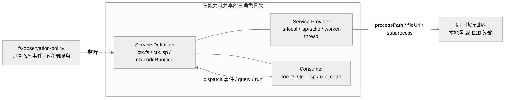
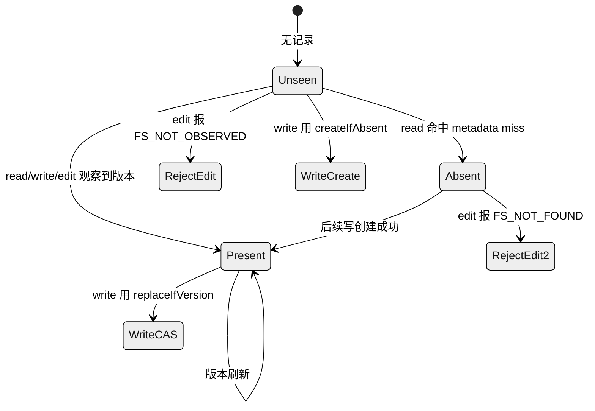
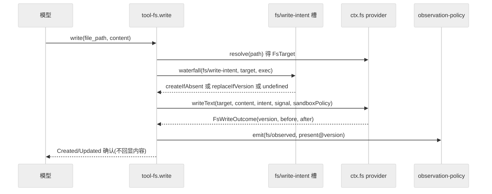
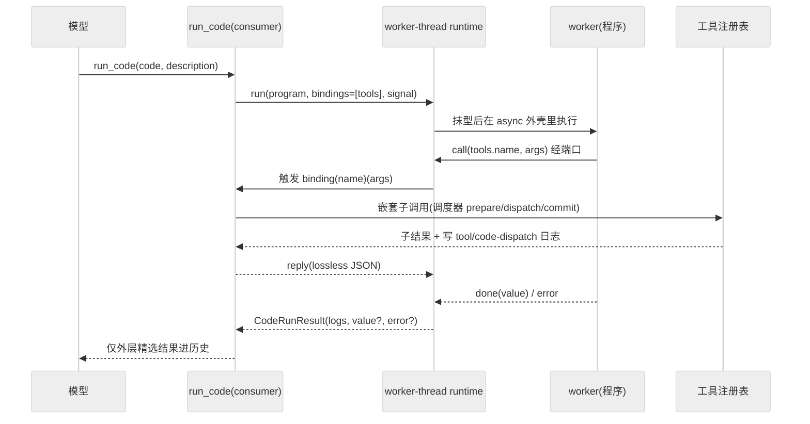

# 第 14 章 · 文件系统、LSP 与代码运行时

> 一个能读代码、能跳转定义、还能自己写小程序调工具的 agent，背后其实是三套彼此独立的能力。本章讲的正是这三条可选能力域，它们共享同一套"能力接缝三角色"骨架：文件系统（`ctx.fs`）、语义导航（`ctx.lsp`）、代码运行时（`ctx.codeRuntime`）。读完你应能回答：dsh 的读改写为什么要绕一层"观察策略"事件而非直接落盘？一个通用 stdio（standard input/output，标准输入输出，即进程之间用来收发数据的两根标准管道）LSP（Language Server Protocol，语言服务器协议）provider 如何在不引入协议类型的前提下服务四种查询？Code Mode 的 `run_code` 到底把工具调用搬进了什么样的执行世界，以及这三者与第 12 章沙箱迁移是怎么共用同一个"执行世界"的。

先说它们的共同点。三者都不在 agent-loop 主脊上，都是"可选能力"——装上就多一项本事，卸掉主流程照跑。它们都严格遵守 Def/Provider/Consumer 三角色拆分（见第 11 章）：一层定义抽象契约、一层给出具体实现、一层是模型能看见的工具。而真正把三者串成一条主线的，是一个跨能力的共同坐标——"执行世界"，也就是"这些文件、这些命令、这段程序，究竟跑在哪台机器的哪个环境里"。本章要做的，就是把这个坐标显式讲清楚。

## 一、本质是什么

先记住一个贯穿本节的角色划分（第 11 章已展开）：**Def** 只写契约（一个抽象类或接口，规定"能做什么"），**Provider** 给出某种具体实现（本地盘、worker 线程……），**Consumer** 是模型真正看得见、点得到的工具。三条能力域都照这个模子来。

- **文件系统能力**：`dsh-fs` 定义抽象服务 `ctx.fs`（`packages/fs/fs/src/index.ts:86`），只管两件事——"一个执行世界里的稳定文件身份"（同一个文件不管怎么改名、搬到哪台机器，都能被认出是同一份）和"原子读改写"（写到一半不会留下半截文件）。`dsh-fs-local` 是本地盘 provider，`dsh-tool-fs` 是模型可见的 `read`/`write`/`edit` executor（consumer），`dsh-fs-observation-policy` 则是一个**只挂事件、不注册服务**的策略插件（`docs/subsystems/filesystem.md`）——它不提供任何"服务方法"，只在旁边听事件、做记账。
- **LSP 能力**：LSP 是编辑器用来问"这个符号定义在哪、被谁引用"的一套标准。`dsh-lsp` 定义 `ctx.lsp`，只暴露 4 个语义查询；`dsh-lsp-stdio` 是一个**通用 stdio 语言服务器宿主**（通过标准输入输出和语言服务器对话），可为任意语言配置；`dsh-tool-lsp` 是 `lsp` 工具 consumer（`docs/subsystems/lsp.md`）。
- **代码运行时能力**：`dsh-code-runtime` 定义 `ctx.codeRuntime`，把一段模型写的程序跑在宿主提供的异步绑定之上（"绑定"即宿主注入给这段程序的可调用函数）；`dsh-code-runtime-worker-thread` 是 worker 线程 provider；Code Mode 的 `run_code` 工具（`packages/core/tools/src/code-mode.ts`）是 consumer（`docs/subsystems/code-runtime.md`）。

三者的定位可用一句话概括：**它们把"对代码世界的读、查、跑"分别做成一个可整体替换 provider 的接缝，而不改变模型看到的工具契约。**这个"接缝"就像插座标准——换灯泡、换电器不用重新布线；换掉 provider（比如从本地盘换成远程沙箱），模型手里的工具长得一模一样。

## 二、核心问题与痛点

放到 agent harness 语境，三个痛点各不相同：

1. **fs 的"盲写"风险**：模型若不先读就 `write`/`edit`，会覆盖它没看过的内容，或在别的进程改过之后写入陈旧版本——好比你没看当前文档就直接粘贴覆盖，可能把别人刚存的改动冲掉。这里需要一种"读过才能改、版本没变才能改"的守卫；更进一步，这套守卫策略还要能整体拆掉而不破坏工具本身。
2. **LSP 的协议噪声**：语言服务器是长驻子进程 + JSON-RPC 协议（JSON 即 JavaScript Object Notation，一种通用文本数据格式；RPC 即 Remote Procedure Call，远程过程调用——合起来就是一套基于 JSON 的远程调用规范）。若把这些协议类型泄漏进接缝，工具和 provider 就会被 LSP 的细节死死绑住，日后想换实现都难。理想做法是把"选 provider、开临时文档、发查询、归一化结果"这一整套动作都收敛到 4 个操作背后，让上层完全看不见协议。
3. **工具调用的 token 放大**：多步工具编排下，每次工具调用的中间结果都要进模型历史，白白吃掉上下文额度。Code Mode 换个思路：让模型写一段程序，在运行时里连续调用工具，只把**精选后的结果**回灌历史——中间那些啰嗦的过程数据就不占地方了。

## 三、解决思路与方案

### 3.1 fs：把策略做成"事件闸"，而非服务方法

关键的转念在于：守卫不是写在 fs 服务里的一个方法，而是挂在旁边、通过事件参与的一道"闸门"。`dsh-tool-fs` 从不调用策略方法，它只做两件事：向单槽 waterfall 事件请求一个"写/改意图"，以及在读/写/改后 `emit` 一个 `fs/observed` 记录事件（`packages/fs/tool-fs/src/write.ts:111`、`:122`）。（"waterfall 事件"可理解为一条按顺序传递、能被拦截或改写返回值的责任链；"单槽"指这里只允许一个监听者占位应答。）

策略插件监听这三个事件（`fs/write-intent`、`fs/edit-intent`、`fs/observed`，声明于 `packages/fs/fs/src/index.ts:58/66/76`），在自己的 `WeakMap` 里维护一本账——"每个 session 观察过哪些文件的哪个版本"，据此把写决策映射为 `createIfAbsent`（未见/确认缺失）或 `replaceIfVersion`（已见）。而 provider 那头只做最原始的原子检查：no-clobber（目标已存在就不覆盖）或 CAS（compare-and-swap，版本对得上才写）（`packages/fs/fs-observation-policy/src/index.ts:65-88`）。这样一来，"要不要守、怎么守"全在策略插件里，provider 只管"照令执行"。

图注：三条能力域各自是一套 Def/Provider/Consumer 三角色；fs 的策略是第四方，只经事件参与，不进接缝签名。它们经 provider 的 processPath/fileUrl 收敛到同一个"执行世界"。

> **↔ 论文对应**：把 fs 读写策略做成挂在旁边的"事件闸"、不进服务签名，在《Spatiotemporal Composability》论文里对应 **interception**（$\Sigma^{inter}$）——给依赖访问附加**横切元数据**、不改依赖值本身，从而让外层 context 在不改组件代码的前提下约束"该组件怎么用这个 coeffect"（论文正举"给文件系统依赖带哪些路径可读写的元数据"为例，见 [Part IV 论文全解](../Part%20IV%20Foundational%20Paper/22-A-Programming-Paradigm-for-Spatiotemporal-Composability.md) §3.2.3，Def.30/31）。差异在于：dsh 用独立的 `fs/*` 事件闸 + 可选 guard 承载这层横切治理，而非论文的元数据幺半群 $\oplus_k$ 合并 `[inferred]`。

### 3.2 LSP：通用 stdio 宿主 + 每工作区一进程池

`dsh-lsp-stdio` 的配置是一张"provider id → 本地服务器命令表"（`packages/lsp/lsp-stdio/src/index.ts:82-107`）：一个插件实例可注册多个 provider，每个 provider 按文件扩展名映射到对应语言。运行期，provider 为每个**规范化工作区**懒启动一个服务器进程并做单飞（`LocalLspProvider`，`:217` 起）——"懒启动"是用到才拉起，"单飞"（single-flight）指同一时刻只允许一次启动、后来者复用而非重复拉起。每次查询都是一次串行化的小流程："读源码→临时打开文档→查询→关闭"（`enqueue`，`:306`）。

如果选中的子进程在两次只读查询之间死掉、或写入失败了，宿主会悄悄换一个进程再重试一次（`:286-294`）；因为查询是只读的、不改任何状态，重来一遍是安全的。这里还有一条关键约束：它通过 `ctx.fs` 读源码、通过 `ctx.subprocess` 启动服务器（`inject = ['fs','lsp','subprocess']`，`:47`）。正因为读文件和起进程都走这两个抽象服务，本地与远程实现才能共用同一套宿主逻辑——换句话说，把底层搬到沙箱里，这段代码一个字都不用改。

### 3.3 Code Mode：把工具调用搬进 worker 里的一段程序

平常模型是"一步一工具、一来一回"；Code Mode 则让模型写一段程序，把多次工具调用打包进去一起跑。具体地，`run_code` 把注册表里模型可见的每个工具，都绑定成 worker 程序里 `tools.name(args)` 这样一个异步可调用函数（`packages/core/tools/src/code-mode.ts:601-609`）。程序在 worker（Node 的工作线程）里跑，每次 `tools.*` 调用都经消息端口回到宿主，宿主用注册表的分阶段调度器发起一次**嵌套子调用**。为了日后能重建现场，每次子分发都会写进会话日志（`tool/code-dispatch-start`、`tool/code-dispatch`，`:535`、`:510`）；但只有最外层那个精选结果才进模型历史。这正是"model-visible ⟺ logged"（模型看得见的，日志里必有记录）这条不变量在 Code Mode 下的落地：子调用有日志可重建，外层结果对模型可见，两头都不漏。

## 四、实现细节关键点

**fs 观察状态机**说白了就是给每个文件记一个"我对它了解到什么程度"的状态，一共三档：未见（map 里根本没这条）、确认缺失（`{kind:'absent'}`，读过、确认文件不存在）、已见某版本（`{kind:'present',version}`，读到过、且知道是哪个版本）。写决策据此派生：未见/缺失→`createIfAbsent`（当作新建），已见→`replaceIfVersion`（按已知版本覆盖）；改决策更严：未见→直接报 `FS_NOT_OBSERVED`（没读过不许改），缺失→`FS_NOT_FOUND`，已见→用观察到的版本做 CAS（`packages/fs/fs-observation-policy/src/index.ts:65-88`）。这里 owner 由事件携带的不透明 actor 收窄为 `exec.agent.session`，且只拿来当 `WeakMap` 的键、从不读它内部的字段（`:36-41`）——只认身份、不看内容，避免对 actor 结构产生依赖。

图注：观察策略据此三态派生写/改守卫。它不做任何文件 IO，只在 fs/observed 上记账；disposal 丢弃全部状态以保 HMR（Hot Module Replacement，热模块替换，即改完代码不重启、直接热替换掉插件）安全。

**fs 写时序**（无 stat、单槽 waterfall、提交点才 emit）：

图注：守卫来自事件槽而非 stat 探测；observed 只在写成功后发出，保证"记录晚于提交"。无策略插件时 intent 为 undefined，即无条件覆盖。

**worker 代码运行时**的关键点比较密集，逐条拆开看：

- **抹型**：程序先被包进一层 `async function` 外壳，再用 Node 原生的 `stripTypeScriptTypes` 把 TypeScript 类型标注去掉（因为 worker 只认 JavaScript）。碰到语法错误、或"擦不掉的语法"（如 `enum`——它会生成真实运行时代码，不是纯类型），直接判为程序失败、连 worker 都不启动（`packages/code-runtime/code-runtime-worker-thread/src/index.ts:302-309`）。
- **最小化启动**：worker 以**空环境** `env:{}`（不继承宿主环境变量）+ 空 `execArgv` + 堆内存上限启动（`:382-387`），把它能接触到的东西压到最小。
- **两条正交的预算**：`computeMs` 看的是 worker 自测的事件循环忙时（靠 ELU 每 25ms 轮询一次，只算真正在干活的时间，`:537-542`）；`maxWallMs` 则是墙钟兜底——不管发生什么都不会暂停的真实世界时间上限（`:543`）。一个防"算太久"，一个防"卡住不动"，互不替代。
- **失败当数据、不当异常**：失败被建模为 6 种正交结果（`exception`/`timeout`/`abort`/`worker-exit`/`invalid-output`/`output-limit`，`packages/code-runtime/code-runtime/src/types.ts`），永远作为 `CodeRunResult.error` 字段返回，而不是让 `run()` 抛出——调用方拿到的始终是一个结构化结果，不用到处 try/catch。
- **把 worker 当敌意对端**：从 worker 传回来的端口消息会被逐字段重新解析构造（`parseWorkerMessage`，`:142`），不信任对面直接塞过来的对象结构。

图注：程序连打多次工具只产生日志级子分发，模型历史只增一条外层结果——这是 Code Mode 省 token 的机制核心，也保住了"可见即可重建"。

## 五、易错点与注意事项

- **fs/observed 监听器必须同步且不抛**：`emit` 并不会 await 监听器返回的 promise，而且此时写操作已经提交完成。这就埋了个坑：一个抛异常的监听器可能把原本正常的读结果替换成错误，或者在文件明明改成功之后、反倒让工具报出 `isError`（`packages/fs/fs/src/index.ts:67-76`）。策略插件因此把决策 waterfall 用 `Promise.resolve().then` 包了一层，让任何抛出都转成 promise 的 reject、而不是同步"逃"出去污染主流程（`fs-observation-policy/src/index.ts:119-122`）。
- **文件 IO 无 timeout**：`read`/`write`/`edit` 都不接 `timeoutMs`。原因很实在：本地 syscall（system call，系统调用，即程序向内核请求服务的那类底层调用）顶多"尽力 abort"，一个 timeout 根本叫不停一个正在进行的 `fsync`/`rename`——承诺了也兑现不了，那就成了"接缝无法兑现的期限"（`docs/subsystems/filesystem.md` "No timeouts on file IO"）。这与 bash/web/glob/grep 恰成对照：那些背后有进程撑着，超时了能真把进程杀掉。
- **targetKey 不可解析**：consumer 拿到的 `targetKey` 只能用于显示（`displayPath`），涉及跨能力的坐标换算必须走 `processPath`/`fileUrl`/`contains`，千万别把 `targetKey` 当成本地绝对路径去拼（`packages/fs/fs/src/index.ts:118-144`）。一个现成的反例：E2B（一个提供远程沙箱的云服务）backend 的 `targetKey` 是**沙箱内**的路径，不是宿主机上的路径（`packages/e2b/fs-e2b/src/index.ts:190`），当本地路径用必然找不到。
- **LSP 工作区必需**：`lsp` 工具没有兜底方案，一旦缺了 session cwd（当前工作目录），直接报 `LSP_WORKSPACE_REQUIRED`（`packages/lsp/tool-lsp/src/index.ts:182-185`）；而且要查的源码必须落在工作区范围内（`host.ts:91` 的 `contains` 检查）。
- **Code Mode 的绑定名当敌意输入**：像 `__proto__`/`constructor` 这类"危险名字"必须是挂在 null-prototype 对象上的普通 own 属性（自有属性），宿主也只按 own 属性来解析绑定（`code-mode.ts:601`、worker 侧用 `Object.hasOwn`，`index.ts:479`）——这样即使工具起了个这样的名字，也不会顺着原型链污染到别处。

## 六、三者如何共享执行世界（与第 12 章沙箱迁移的联动）

这是本章最值得强调的横切点。三条能力域看似各干各的，却通过 provider 暴露的 `processPath(target)`/`fileUrl(target)` 收敛到**同一个执行世界**。以 LSP 为例：宿主用 `ctx.fs.processPath` 拿到一条可作子进程 cwd 的规范路径、用 `ctx.fs.fileUrl` 拿到要发给语言服务器的 URI（`packages/lsp/lsp-stdio/src/host.ts:54-58`），再用 `ctx.subprocess` 启动服务器。这样一来，"fs 看到的文件"和"LSP 服务器打开的文件"必然是同一份——不会出现"fs 在 A 机器、语言服务器却在读 B 机器"的错位。`dsh-subprocess` 的文档也把这点讲明了："可执行路径属于与挂载 fs 共享的一个执行世界"（`packages/subprocess/subprocess/src/index.ts:81`）。

理解了这个坐标，沙箱迁移（第 12 章）就顺理成章了——它正是在这一层发生的：把本地 backend 换成 `fs-e2b`/`subprocess-e2b`，整个执行世界一起搬进 E2B 沙箱，而 `ctx.fs`/`ctx.lsp` 的签名、`lsp` 工具的 schema、`run_code` 的绑定形态统统不变。上层完全无感。`fs-sandbox` 则是另一种更轻的迁移：`SandboxedFileSystem extends LocalFileSystem`（直接继承本地实现），只在两个 mutation（写、改）上加一道"先规范化路径、再检查是否在允许范围内"的**每调用策略栅栏**（越界就报 `FS_SANDBOX_DENIED`），读操作一律放行（`packages/fs/fs-sandbox/src/index.ts` 模块注释）。

要强调的是：无论是 worker 线程、进程隔离还是 `fs-sandbox` 这道 in-process 栅栏，源码口径都明说"这是 containment，不是安全边界"——模型代码拥有与 bash 等价的信任，`isolation` 字段只是诊断标签而非安全声明。`fs-sandbox` 的注释更直言其栅栏"是可信代码里对模型控制路径的策略检查，不是内核边界"，并主动接受 TOCTOU（time-of-check to time-of-use，即"检查那一刻"与"真正使用那一刻"之间，状态被人动了手脚的时间窗）残余风险；真正"不可信代码的内核级隔离"被留给 `ctx.shell` 的 `dsh-bash-sandbox`（`packages/fs/fs-sandbox/src/index.ts` 模块注释、`packages/code-runtime/code-runtime-worker-thread/src/index.ts:1-7` `[verified]`）。读文档者只要守住这层区分，就不会误把 `isolation:'worker-thread'` 当成运行不可信第三方代码的安全承诺。

**横向对比**：在语义导航这条线上，Claude Code、Codex 等同类 harness 多以文本搜索为主、语义导航并非一等公民 `[claimed]`；dsh 则把它做成一项可选的一等能力，却刻意克制表面积——只暴露定义/引用/实现/悬浮四类语义操作构成的闭合联合类型（closed union，即"就这几种、不再多"的封闭集合），通用 stdio 宿主按扩展名配置任意语言、绝不把 LSP 协议类型泄漏进工具与 provider。好处是增删操作变成一处"跨接缝编译强制"的改动（闭合 union + `assertNever`），工具与 provider 都不碰协议、还换来稳定的模型契约；代价是 symbols、call-hierarchy 这类需要不同 schema 的能力被挡在四操作之外（操作闭合与通用宿主 `[verified]`：`packages/lsp/lsp/src/types.ts`、`lsp-stdio/src/index.ts:82-107`；竞品对比 `[claimed]`）。

## 七、仍存在的问题与局限

- **语言后端不全**：`ctx.codeRuntime.language` 声明了 `typescript`/`python` 两种，但目前只有 TypeScript 真的有已发布的 backend（`docs/subsystems/code-runtime.md` 服务节）。`run_code` 里 Python flavor 的文案都写好了，就等一个 provider 补上。
- **fs 单槽约定非强制**：`fs/write-intent`/`fs/edit-intent` 是"先到先得"的单槽 waterfall，"策略插件来占这个槽"只是一条部署约定，而非接缝强制的规则；万一有多个插件同时监听，会怎样并未被接缝兜住（`packages/fs/fs/src/index.ts:58-66`）。
- **LSP 源码替换的 TOCTOU**：`host.ts` 里留了个 `XXX(lsp-source-replacement)` 标记。TOCTOU 在这里的含义是：如果在"规范容器检查"和"provider 打开文件流"这两步之间源码被替换，那么"稳定文件句柄身份"这件事就需要重新斟酌（`packages/lsp/lsp-stdio/src/host.ts:97`）。
- **containment 非安全边界**（见第六节）：这是一个明摆着的设计取舍，不是缺陷；但部署者心里得清楚——它拦得住误操作，拦不住蓄意攻击。

## 小结与衔接

本章的三条能力域各自解决不同痛点：fs 用"事件闸 + 可选 guard"把读前置策略与落盘机制解耦；LSP 用通用 stdio 宿主把四类语义查询收敛到无协议泄漏的接缝；Code Mode 把工具编排搬进 worker、以日志级子分发换取模型历史的精简。它们共享的深层机制是"执行世界"这一跨能力坐标：provider 一换，fs/LSP/subprocess/code-runtime 同步迁移到本地盘或 E2B 沙箱，而模型契约不动——这与第 11 章的能力接缝、第 12 章的沙箱迁移直接咬合。下一章转向 subagent 与 workflow，看 dsh 如何把"一个 agent"进一步组合成协作与编排。

## 源码索引

- `packages/fs/fs/src/index.ts:58/66/76`（`fs/*` 三事件声明）、`:86`（`FileSystem` 抽象类）、`:118-144`（processPath/fileUrl/contains）
- `packages/fs/fs-observation-policy/src/index.ts:36-41`（owner 收窄）、`:65-88`（写/改决策）、`:106-129`（三事件监听 + HMR 释放）
- `packages/fs/tool-fs/src/write.ts:111`（waterfall 取意图）、`:122`（emit observed）
- `packages/fs/fs-sandbox/src/index.ts`（模块注释：per-call 栅栏、containment 非内核边界、TOCTOU）
- `packages/lsp/lsp/src/types.ts`（4 操作的闭合联合类型 closed union、闭合结果联合 closed result union）
- `packages/lsp/lsp-stdio/src/index.ts:47`（inject fs/lsp/subprocess）、`:82-107`（server 表配置）、`:217-303`（每工作区进程池 + 透明重试）
- `packages/lsp/lsp-stdio/src/host.ts:54-58`（processPath/fileUrl 取执行世界坐标）、`:91`（contains 越界检查）、`:97`（TOCTOU XXX）
- `packages/lsp/tool-lsp/src/index.ts:182-185`（工作区必需）
- `packages/code-runtime/code-runtime/src/types.ts`（CodeRunRequest/Result/Failure 六类）、`src/index.ts`（language/isolation 描述）
- `packages/code-runtime/code-runtime-worker-thread/src/index.ts:1-7`（containment 声明）、`:142`（敌意端口重建）、`:302-309`（抹型/不启动 worker）、`:382-387`（空环境）、`:537-545`（compute/wall 双预算）
- `packages/core/tools/src/code-mode.ts:294`（createRunCodeTool）、`:464-594`（binding→嵌套子调用）、`:601-609`（tools 命名空间构建）、`:510/535`（子分发日志）
- `packages/e2b/fs-e2b/src/index.ts:171/190`（E2B backend 换执行世界）
- docs：`docs/subsystems/filesystem.md`、`docs/subsystems/lsp.md`、`docs/subsystems/code-runtime.md`
