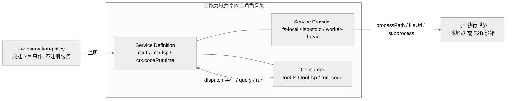
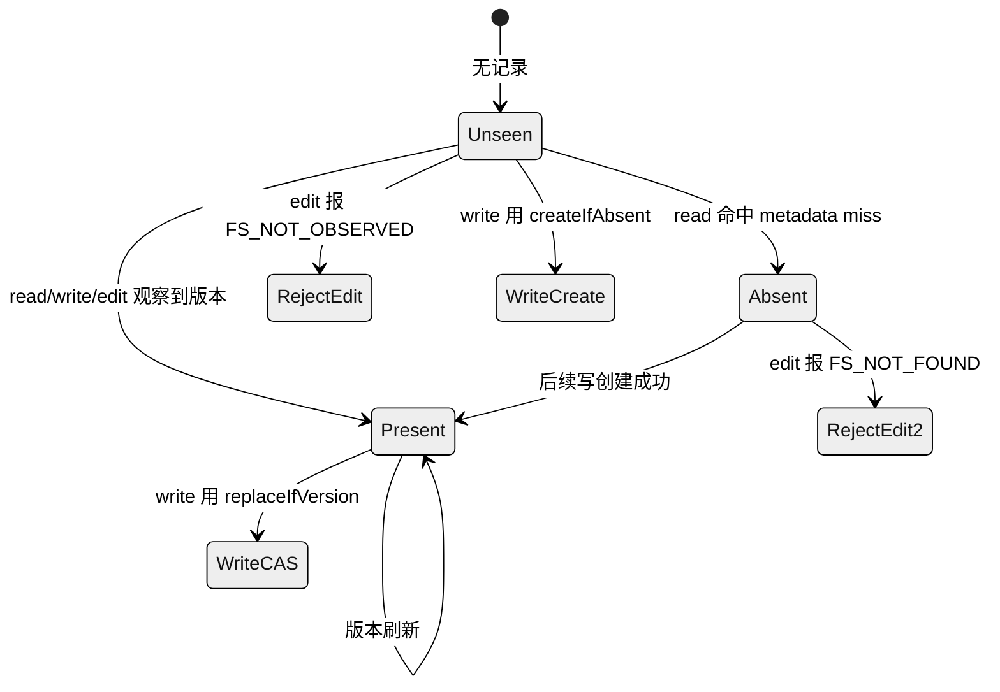
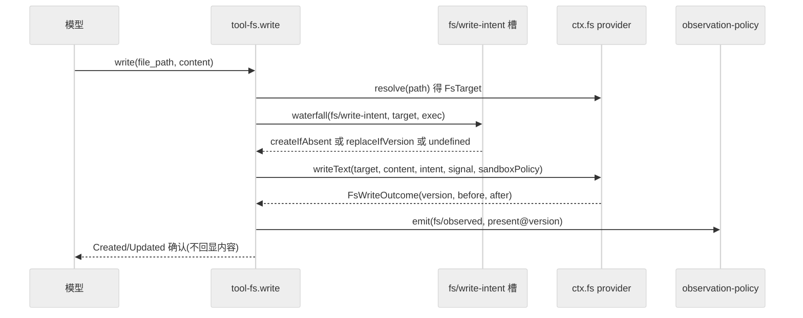
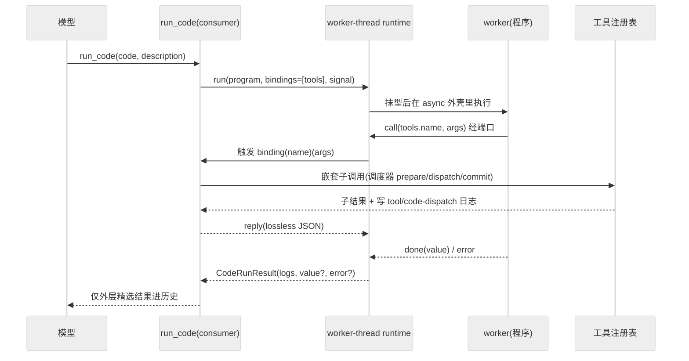

# 第 14 章 · 文件系统、LSP 与代码运行时

> 本章讲三条相对独立、但共享同一套"能力接缝三角色"骨架的可选能力域：文件系统（`ctx.fs`）、语义导航（`ctx.lsp`）、代码运行时（`ctx.codeRuntime`）。读完你应能回答：dsh 的读改写为什么要绕一层"观察策略"事件而非直接落盘？一个通用 stdio LSP provider 如何在不引入协议类型的前提下服务四种查询？Code Mode 的 `run_code` 到底把工具调用搬进了什么样的执行世界，以及这三者与第 12 章沙箱迁移是怎么共用同一个"执行世界"的。

三者都不在 agent-loop 主脊上，都是"可选能力"，都严格遵守 Def/Provider/Consumer 三角色拆分（见第 11 章）。它们的共性——把"执行世界"这一跨能力坐标显式化——正是本章要串起来的主线。

## 一、本质是什么

- **文件系统能力**：`dsh-fs` 定义抽象服务 `ctx.fs`（`packages/fs/fs/src/index.ts:86`），只管"一个执行世界里的稳定文件身份 + 原子读改写"；`dsh-fs-local` 是本地盘 provider，`dsh-tool-fs` 是模型可见的 `read`/`write`/`edit` executor（consumer），`dsh-fs-observation-policy` 是一个**只挂事件、不注册服务**的策略插件（`docs/subsystems/filesystem.md`）。
- **LSP 能力**：`dsh-lsp` 定义 `ctx.lsp`，只暴露 4 个语义查询；`dsh-lsp-stdio` 是一个**通用 stdio 语言服务器宿主**，可为任意语言配置；`dsh-tool-lsp` 是 `lsp` 工具 consumer（`docs/subsystems/lsp.md`）。
- **代码运行时能力**：`dsh-code-runtime` 定义 `ctx.codeRuntime`，把一段模型写的程序跑在宿主提供的异步绑定之上；`dsh-code-runtime-worker-thread` 是 worker 线程 provider；Code Mode 的 `run_code` 工具（`packages/core/tools/src/code-mode.ts`）是 consumer（`docs/subsystems/code-runtime.md`）。

三者的定位可用一句话概括：**它们把"对代码世界的读、查、跑"分别做成一个可整体替换 provider 的接缝，而不改变模型看到的工具契约。**

## 二、核心问题与痛点

放到 agent harness 语境，三个痛点各不相同：

1. **fs 的"盲写"风险**：模型若不先读就 `write`/`edit`，会覆盖它没看过的内容，或在别的进程改过之后写入陈旧版本。需要一种"读过才能改、版本没变才能改"的守卫，且这套策略要能整体拆掉而不破坏工具。
2. **LSP 的协议噪声**：语言服务器是长驻子进程 + JSON-RPC 协议，若把协议类型泄漏进接缝，工具与 provider 会强耦合到 LSP 细节。需要把"选 provider、开临时文档、发查询、归一化结果"都收敛到 4 个操作背后。
3. **工具调用的 token 放大**：多步工具编排下，每次工具调用的中间结果都进模型历史，浪费上下文。Code Mode 让模型写一段程序、在运行时里连续调用工具、只把**精选后的结果**回灌历史。

## 三、解决思路与方案

### 3.1 fs：把策略做成"事件闸"，而非服务方法

`dsh-tool-fs` 从不调用策略方法，它只做两件事：向单槽 waterfall 事件请求一个"写/改意图"，以及在读/写/改后 `emit` 一个 `fs/observed` 记录事件（`packages/fs/tool-fs/src/write.ts:111`、`:122`）。策略插件监听这三个事件（`fs/write-intent`、`fs/edit-intent`、`fs/observed`，声明于 `packages/fs/fs/src/index.ts:58/66/76`），在自己的 `WeakMap` 里维护"每个 session 观察过哪些文件的哪个版本"，据此把写决策映射为 `createIfAbsent`（未见/确认缺失）或 `replaceIfVersion`（已见）——而 provider 只做原子的 no-clobber / CAS 检查（`packages/fs/fs-observation-policy/src/index.ts:65-88`）。

> **ratify-note · fs 守卫为何是"事件 + 可选 guard"而非"服务方法"**
> - 候选解释：A 把守卫做成 `FileSystem` 上的必选方法/参数；B（现状）守卫作为**可选** guard 下放到 provider，策略通过独立的 `fs/*` 事件闸决定，缺省 provider 不带守卫。
> - 各自利弊：A 优在调用方无法绕过守卫，缺在把"策略"焊进了每个 backend，远程/沙箱 backend 都得重复实现，且策略无法整体卸载；B 优在移除策略插件不破坏工具（工具只发事件、拿 `undefined` 就是无条件写，`docs/subsystems/filesystem.md`），策略与 backend 正交、可被 HMR 完整回滚（`ctx.effect` 释放 `WeakMap`，`packages/fs/fs-observation-policy/src/index.ts:109-114`），缺在"单槽先到先得"是部署约定而非强制不变量。
> - 选定 & 理由：选 B。它把"读改写机制"与"读前置策略"解耦，符合能力接缝"一次 provider 替换改变整个产品、但策略不动"的目标。
> - 证据等级：[verified]（`packages/fs/tool-fs/src/write.ts:111-122`、`packages/fs/fs-observation-policy/src/index.ts:65-129`）。
> - 残余风险 / pre-mortem：若半年后被证伪，最可能因"单槽先到先得非强制"导致多插件抢占该 waterfall 槽产生不可预期决策。

图注：三条能力域各自是一套 Def/Provider/Consumer 三角色；fs 的策略是第四方，只经事件参与，不进接缝签名。它们经 provider 的 processPath/fileUrl 收敛到同一个"执行世界"。

### 3.2 LSP：通用 stdio 宿主 + 每工作区一进程池

`dsh-lsp-stdio` 的配置是"provider id → 本地服务器命令表"（`packages/lsp/lsp-stdio/src/index.ts:82-107`），一个插件实例可注册多个 provider，每个 provider 按扩展名映射语言。运行期，provider 为每个**规范化工作区**懒启动一个服务器进程并做单飞（`LocalLspProvider`，`:217` 起），每次查询是"读源码→临时打开文档→查询→关闭"的一次串行化（`enqueue`，`:306`）。选中的子进程若在两次只读查询间死亡或写入失败，会被透明替换一次并重试（`:286-294`）——因为查询是只读的，替换安全。关键约束：它通过 `ctx.fs` 读源码、通过 `ctx.subprocess` 启动服务器（`inject = ['fs','lsp','subprocess']`，`:47`），因此本地与远程实现共用同一宿主逻辑。

### 3.3 Code Mode：把工具调用搬进 worker 里的一段程序

`run_code` 把注册表里模型可见的每个工具，绑定成 worker 程序里 `tools.name(args)` 这样的异步可调用（`packages/core/tools/src/code-mode.ts:601-609`）。程序在 worker 里跑，每次 `tools.*` 调用经消息端口回到宿主，宿主用注册表的分阶段调度器发起一次**嵌套子调用**，并为重建把每次子分发写进会话日志（`tool/code-dispatch-start`、`tool/code-dispatch`，`:535`、`:510`），但只有外层精选结果进模型历史。这正是"model-visible ⟺ logged"不变量在 Code Mode 下的落地（子调用可重建、外层可见）。

## 四、实现细节关键点

**fs 观察状态机**是三段离散状态：未见（map 无条目）、确认缺失（`{kind:'absent'}`）、已见某版本（`{kind:'present',version}`）。写决策：未见/缺失→`createIfAbsent`，已见→`replaceIfVersion`；改决策：未见→`FS_NOT_OBSERVED`，缺失→`FS_NOT_FOUND`，已见→用观察到的版本做 CAS（`packages/fs/fs-observation-policy/src/index.ts:65-88`）。owner 由事件携带的不透明 actor 收窄为 `exec.agent.session`，只当 `WeakMap` 键、从不读其字段（`:36-41`）。

图注：观察策略据此三态派生写/改守卫。它不做任何文件 IO，只在 fs/observed 上记账；disposal 丢弃全部状态以保 HMR 安全。

**fs 写时序**（无 stat、单槽 waterfall、提交点才 emit）：

图注：守卫来自事件槽而非 stat 探测；observed 只在写成功后发出，保证"记录晚于提交"。无策略插件时 intent 为 undefined，即无条件覆盖。

**worker 代码运行时**的关键点密集：程序被包进 `async function` 外壳后用 Node 原生 `stripTypeScriptTypes` 抹型，语法/不可擦除语法（如 `enum`）直接判为程序失败且不启动 worker（`packages/code-runtime/code-runtime-worker-thread/src/index.ts:302-309`）；worker 以**空环境** `env:{}` + 空 `execArgv` + 堆上限启动（`:385-387`）；预算是两条正交的：`computeMs` 读 worker 自测的事件循环忙时（ELU 轮询 25ms，`:537-542`），`maxWallMs` 是不会因任何事暂停的墙钟兜底（`:543`）；失败被建模为 6 种正交结果（`exception`/`timeout`/`abort`/`worker-exit`/`invalid-output`/`output-limit`，`packages/code-runtime/code-runtime/src/types.ts`），永远作为 `CodeRunResult.error` 字段返回而非 `run()` 抛出。inbound 端口消息被逐字段重建（`parseWorkerMessage`，`:142`），把 worker 当敌意对端。

图注：程序连打多次工具只产生日志级子分发，模型历史只增一条外层结果——这是 Code Mode 省 token 的机制核心，也保住了"可见即可重建"。

## 五、易错点与注意事项

- **fs/observed 监听器必须同步且不抛**：`emit` 不 await 返回的 promise，且写已提交；一个抛异常的监听器会替换读错误、或在 mutation 成功后反成工具的 `isError`（`packages/fs/fs/src/index.ts:67-76`）。策略插件因此把决策 waterfall 用 `Promise.resolve().then` 包住，让抛出转成 reject 而非同步逃逸（`fs-observation-policy/src/index.ts:119-122`）。
- **文件 IO 无 timeout**：`read`/`write`/`edit` 不接 `timeoutMs`——本地 syscall 只能尽力 abort，一个 timeout 无法叫停进行中的 `fsync`/`rename`，那会是"接缝无法兑现的期限"（`docs/subsystems/filesystem.md` "No timeouts on file IO"）。这与 bash/web/glob/grep（进程支撑，可真杀）形成对照。
- **targetKey 不可解析**：consumer 只能显示 `displayPath`，跨能力坐标必须走 `processPath`/`fileUrl`/`contains`，不能把 `targetKey` 当本地绝对路径（`packages/fs/fs/src/index.ts:118-144`）。E2B backend 的 `targetKey` 就是沙箱内路径而非宿主路径（`packages/e2b/fs-e2b/src/index.ts:190`）。
- **LSP 工作区必需**：`lsp` 工具无 fallback，缺 session cwd 直接 `LSP_WORKSPACE_REQUIRED`（`packages/lsp/tool-lsp/src/index.ts:182-185`）；源码必须落在工作区内（`host.ts:91` 的 `contains` 检查）。
- **Code Mode 的绑定名当敌意输入**：`__proto__`/`constructor` 之类名字必须是 null-prototype 上的普通 own 属性，宿主只按 own 属性解析绑定（`code-mode.ts:601`、worker 侧 `Object.hasOwn`，`index.ts:479`）。

## 六、三者如何共享执行世界（与第 12 章沙箱迁移的联动）

这是本章最值得强调的横切点。三条能力域看似独立，却通过 provider 暴露的 `processPath(target)`/`fileUrl(target)` 收敛到**同一个执行世界**：LSP 宿主用 `ctx.fs.processPath` 拿到可作子进程 cwd 的规范路径、用 `ctx.fs.fileUrl` 拿到发给语言服务器的 URI（`packages/lsp/lsp-stdio/src/host.ts:54-58`），再用 `ctx.subprocess` 启动服务器——于是"fs 看到的文件"和"LSP 服务器打开的文件"必然是同一份。`dsh-subprocess` 的文档也明说"可执行路径属于与挂载 fs 共享的一个执行世界"（`packages/subprocess/subprocess/src/index.ts:81`）。

沙箱迁移（第 12 章）正是在这一层发生：把本地 backend 换成 `fs-e2b`/`subprocess-e2b`，执行世界整体搬进 E2B 沙箱，而 `ctx.fs`/`ctx.lsp` 的签名、`lsp` 工具的 schema、`run_code` 的绑定形态都不变。`fs-sandbox` 则是另一种迁移：`SandboxedFileSystem extends LocalFileSystem`，只在两个 mutation 上加"canonicalize-then-contain"的**每调用策略栅栏**（`FS_SANDBOX_DENIED`），读一律放行（`packages/fs/fs-sandbox/src/index.ts` 模块注释）。

> **ratify-note · Code Mode/fs-sandbox 的 isolation 是不是"安全边界"**
> - 候选解释：A 把 worker 线程 / 进程隔离 / in-process 栅栏当作安全沙箱宣称；B（源码口径）明确"这是 containment，不是安全边界"，模型代码拥有 bash 等价信任。
> - 各自利弊：A 优在营销上更强，缺在会诱导部署者把不可信代码托付给一个无法兑现的边界；B 优在诚实标注"隔离仅诊断标签、非安全声明"（`code-runtime/src/index.ts` 的 `isolation` 描述、worker-thread 模块注释），把"不可信代码的内核级隔离"留给 `ctx.shell` 的 `dsh-bash-sandbox`，缺在读文档者需理解这层区分。
> - 选定 & 理由：选 B，与源码一致。`fs-sandbox` 的注释直言其栅栏"是可信代码里对模型控制路径的策略检查，不是内核边界"，并主动接受 TOCTOU 残余风险。
> - 证据等级：[verified]（`packages/fs/fs-sandbox/src/index.ts` 模块注释；`packages/code-runtime/code-runtime-worker-thread/src/index.ts:1-7`）。
> - 残余风险 / pre-mortem：若被证伪，最可能因部署者误把 `isolation:'worker-thread'` 当安全承诺、在其中运行真正不可信第三方代码。

**横向对比**：

> **ratify-note · 通用 stdio LSP + 四操作闭合联 vs 竞品做法**
> - 候选解释：A（dsh 现状）只暴露 4 个语义操作的闭合联、通用 stdio 宿主按扩展名配置任意语言、不泄漏协议类型；B 直接暴露一个通用 LSP/JSON-RPC 透传，让工具自行发协议方法。
> - 各自利弊：A 优在增删操作是"跨接缝编译强制"的一处改动（闭合 union + `assertNever`，`docs/subsystems/lsp.md`），工具与 provider 都不碰协议；缺在 symbols/call-hierarchy 这类需不同 schema 的能力被排除在外。B 优在灵活，缺在把 LSP 协议噪声灌进模型工具面、且难做结果归一化与结果上限。
> - 选定 & 理由：选 A。对 agent 而言"定义/引用/实现/悬浮"四类精准导航已覆盖主要用途，闭合联换来跨层类型安全与稳定的模型契约。Claude Code/Codex 等同类多以文本搜索为主、语义导航非一等公民 [claimed]，dsh 把它做成可选一等能力但克制其表面积。
> - 证据等级：操作闭合与通用宿主 [verified]（`packages/lsp/lsp/src/types.ts`、`lsp-stdio/src/index.ts:82-107`）；竞品对比 [claimed]（社区认知，无逐条源码核对）。
> - 残余风险 / pre-mortem：若被证伪，最可能因真实使用暴露出对 symbols/rename 的强需求，迫使接缝突破四操作闭合。

## 七、仍存在的问题与局限

- **语言后端不全**：`ctx.codeRuntime.language` 声明了 `typescript`/`python`，但只有 TypeScript 有已发布 backend（`docs/subsystems/code-runtime.md` 服务节）。`run_code` 的 Python flavor 文案已就绪，等 provider。
- **fs 单槽约定非强制**：`fs/write-intent`/`fs/edit-intent` 是"先到先得"的单槽 waterfall，策略插件占槽是部署约定；多插件同时监听的行为未被接缝强制（`packages/fs/fs/src/index.ts:58-66`）。
- **LSP 源码替换的 TOCTOU**：`host.ts` 里留了 `XXX(lsp-source-replacement)` 标记，容器化含义是"规范容器检查与 provider 打开流之间若发生替换，稳定句柄身份需重议"（`packages/lsp/lsp-stdio/src/host.ts:97`）。
- **containment 非安全边界**（见上 ratify-note）：这是设计取舍而非缺陷，但部署者须清楚其边界。

## 小结与衔接

本章的三条能力域各自解决不同痛点：fs 用"事件闸 + 可选 guard"把读前置策略与落盘机制解耦；LSP 用通用 stdio 宿主把四类语义查询收敛到无协议泄漏的接缝；Code Mode 把工具编排搬进 worker、以日志级子分发换取模型历史的精简。它们共享的深层机制是"执行世界"这一跨能力坐标：provider 一换，fs/LSP/subprocess/code-runtime 同步迁移到本地盘或 E2B 沙箱，而模型契约不动——这与第 11 章的能力接缝、第 12 章的沙箱迁移直接咬合。下一章转向 subagent 与 workflow，看 dsh 如何把"一个 agent"进一步组合成协作与编排。

## 源码索引

- `packages/fs/fs/src/index.ts:58/66/76`（`fs/*` 三事件声明）、`:86`（`FileSystem` 抽象类）、`:118-144`（processPath/fileUrl/contains）
- `packages/fs/fs-observation-policy/src/index.ts:36-41`（owner 收窄）、`:65-88`（写/改决策）、`:106-129`（三事件监听 + HMR 释放）
- `packages/fs/tool-fs/src/write.ts:111`（waterfall 取意图）、`:122`（emit observed）
- `packages/fs/fs-sandbox/src/index.ts`（模块注释：per-call 栅栏、containment 非内核边界、TOCTOU）
- `packages/lsp/lsp/src/types.ts`（4 操作闭合联、closed result union）
- `packages/lsp/lsp-stdio/src/index.ts:47`（inject fs/lsp/subprocess）、`:82-107`（server 表配置）、`:217-303`（每工作区进程池 + 透明重试）
- `packages/lsp/lsp-stdio/src/host.ts:54-58`（processPath/fileUrl 取执行世界坐标）、`:91`（contains 越界检查）、`:97`（TOCTOU XXX）
- `packages/lsp/tool-lsp/src/index.ts:182-185`（工作区必需）
- `packages/code-runtime/code-runtime/src/types.ts`（CodeRunRequest/Result/Failure 六类）、`src/index.ts`（language/isolation 描述）
- `packages/code-runtime/code-runtime-worker-thread/src/index.ts:1-7`（containment 声明）、`:142`（敌意端口重建）、`:302-309`（抹型/不启动 worker）、`:385-387`（空环境）、`:537-545`（compute/wall 双预算）
- `packages/core/tools/src/code-mode.ts:294`（createRunCodeTool）、`:464-594`（binding→嵌套子调用）、`:601-609`（tools 命名空间构建）、`:510/535`（子分发日志）
- `packages/e2b/fs-e2b/src/index.ts:171/190`（E2B backend 换执行世界）
- docs：`docs/subsystems/filesystem.md`、`docs/subsystems/lsp.md`、`docs/subsystems/code-runtime.md`
