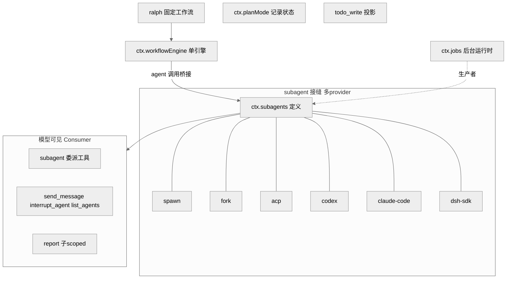
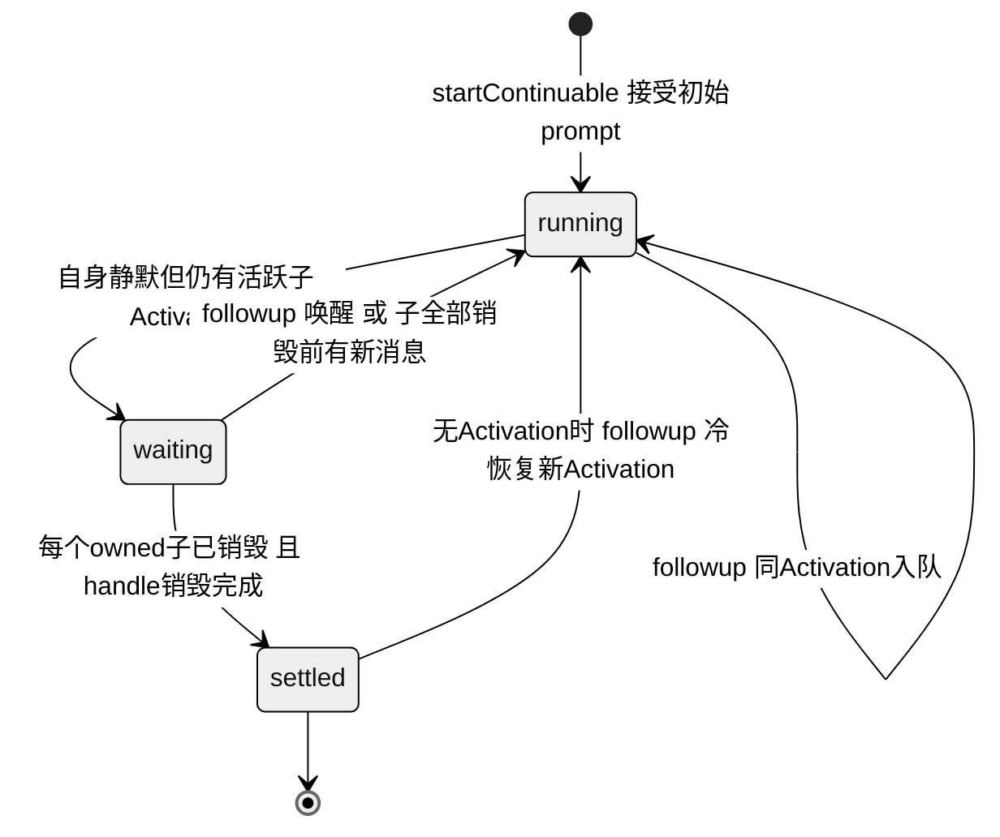
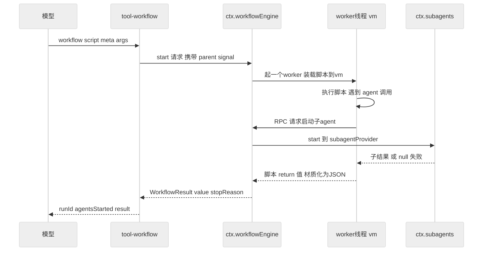
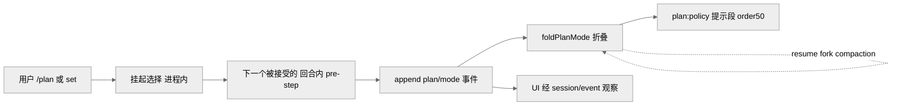

# 第 15 章 · 编排与委派 Subagent/Workflow/Plan

> 本章讲 dsh 如何让一个 agent 把工作分出去、跑起来、并把"分工"这件事变成可记录、可恢复的状态。读完你能回答：subagent 委派的接缝为什么允许多 provider 并存、能一路委派到 Codex/Claude Code 甚至另一个完整 dsh 进程；workflow 的脚本引擎凭什么跑在 worker 线程里；plan 模式为什么是"被记录的每-agent 策略状态"而非临时开关；jobs 后台与 `todo_write` 又各自解决什么。

先说清楚"委派"是什么：就是让一个 agent 把一部分活儿交给另一个 agent（子 agent）去干，自己等结果。编排与委派是 agent harness 的"力量放大器"：单个回合流（Ch06）只能一步接一步地串行推进，而真实任务往往需要并行审计、多角度研究、长跑迭代——这时就得把工作分出去。dsh 把这些能力全部做成**可选插件**而非内核特性——它们挂在能力接缝（Ch11，可以理解为"标准化的插槽"）上，`agent-loop` 这个核心循环既不认识 subagent，也不认识 workflow、plan、jobs、todo。换句话说，把这些插件全拔掉，核心循环照样能跑。本章覆盖 `packages/` 下的五个包组：`subagent/`、`workflow/`、`plan/`、`jobs/`、`todo/`。

## 一、本质是什么

这五者是同一主题的不同切面：

- **subagent** `[verified]`：委派的**能力接缝**。它由三部分组成——`ctx.subagents`（Service Definition，即"这里有个委派能力"的声明）、六个 provider（Service Provider，即六种真正干活的实现）、三个模型可见工具（Consumer，即模型能调用的入口）。它与 bash 接缝有个关键不同——**多个 provider 可以按名字同时并存**于同一 context（`ctx.subagents` 注册表），而 bash 只允许挂一个执行器（`docs/subsystems/subagent.md:5`）。打个比方：bash 像家里只有一个插座，subagent 像一排贴了名字标签的插座，想用哪个叫哪个名字。
- **workflow** `[verified]`：让模型**写一段编排脚本**去批量启动 subagent。跟 subagent 恰好相反，它**每个 context 只允许挂一个引擎**（`ctx.workflowEngine`），没有命名注册表（`docs/subsystems/workflow.md:5`）。
- **plan** `[verified]`：把"当前是否处于规划模式"做成**被记录下来的、每个 agent 各自的协作状态**（`plan/mode` 会话事件），而不是一个"关机就没了"的进程内布尔开关。
- **jobs** `[verified]`：通用的**后台任务运行时**（`ctx.jobs`），bash 长命令和后台 subagent 都可以作为它的"生产者"往里塞任务，模型再通过 `job_output`/`job_list`/`job_kill` 来查看结果、收割成果。
- **todo** `[verified]`：`todo_write` 工具，把任务清单做成"整张表一次性替换"的会话投影（可理解为：每次写清单都是覆盖式提交整份清单，而不是逐条增删）。

图注：subagent 是唯一"多 provider 并存"的接缝；workflow/ralph 建立在它之上；jobs 把 subagent 当作后台生产者之一；plan 与 todo 是独立的记录型能力。此图证明五个子系统的依赖方向与角色划分。

## 二、核心问题与痛点

委派在放大能力的同时也带来四类难题，dsh 的设计逐一对应：

1. **委派边界要开多宽？** 子 agent 是在同一个进程里复用，还是另起独立进程、甚至外包给别家产品（Codex/Claude Code）？→ 用命名 provider 注册表，让六种 transport（即六种"把任务送出去"的通道）并存。
2. **能力协商怎么做到"失败要响"？** 万一模型请求了某个 provider 不支持的特性（比如要求结构化输出），该怎么办？→ 用静态能力描述符提前声明能力，配合 `UNSUPPORTED_CAPABILITY` 直接硬拒绝，绝不"先接下来再偷偷降级"（`docs/subsystems/subagent.md:13`）。这一点很重要：静默降级会让模型以为拿到了它要的东西，实际却没有，问题被藏起来更难查。
3. **后台/长跑委派的所有权与恢复。** 父进程退出后，谁来负责把子会话接着跑下去？→ continuable（可续跑）子 agent + Activation 管理器 + 会话日志三者配合。
4. **模型自己写的编排脚本会不会卡死或搞垮宿主？** → 放进 worker 线程（worker thread，Node.js 里独立于主线程的一条执行线）加 node:vm 沙箱（node:vm 是 Node.js 自带的隔离执行环境，把一段代码放进单独的全局作用域里跑）里执行，一次 run 配一个 worker，跑飞了可以强制终止（但文档明确说这"是隔离而非安全边界"，`workflow-worker-thread/src/index.ts:1`——意思是它能防脚本卡死宿主，但不能用来跑不可信代码）。

## 三、解决思路与方案

### 3.1 subagent：两类能力，两种发现方式

每个 provider 用静态的 `SubagentCapabilities` 声明它**启动时**能做什么，一共只有四个标志：`outputSchema`（能否要求结构化输出）、`depthLimit`（委派深度限制）、`toolFilter`（能否过滤子 agent 的工具）、`persona`（能否设定人设）（`packages/subagent/subagent/src/types.ts`，`docs/subsystems/subagent.md:27`）。服务在调用 `start()` 之前会逐一核对这些标志，缺哪个就当场抛出类型化错误——先亮牌、再握手，避免中途翻车。

而 **continuable（可续跑）**这个能力不是启动时标志，它由续跑管理器自己组装，所以改用"看某个可选方法在不在"来判断——`prepareContinuable` 这个方法只要存在，就代表这个 provider 支持续跑，靠 TypeScript 的类型收窄来识别（`docs/subsystems/subagent.md:457`）。这是一个值得注意的设计：**能力发现有两套机制**——静态标志管一次性的 `start()` 路径，方法存在与否管续跑路径。之所以分两套，是因为这两条路径的能力天然出现在不同时机。

六个 provider 覆盖了从最便宜到跨产品的全谱系 `[verified]`：

| provider | 子 agent 形态 | 上下文继承 |
|---|---|---|
| `spawn` | 同 context 全新子 Agent，零父上下文 | 否 |
| `fork` | 同 context，**种子=父日志到最后 `turn/end` 的前缀** | 是 |
| `acp` | 独立进程，仅读父 cwd（current working directory，当前工作目录） | 否 |
| `codex` | 拉起官方 `codex app-server --stdio` 进程 | 否 |
| `claude-code` | 调官方 Claude Code Agent SDK（Software Development Kit，软件开发工具包）/ 真实 CLI（command-line interface，命令行界面） | 否 |
| `dsh-sdk` | 独立进程里一个**完整 dsh 运行时**，走 stdio JSON-RPC（一种用 JSON 编码请求与响应的远程过程调用协议） | 否 |

出处：各包 `packages/subagent/subagent-*/src/index.ts` 的模块 JSDoc。这个跨度是本章一条很有分量的经验事实——**同一个委派接缝，既能在同进程里 `spawn` 一个最廉价的子 agent，也能把任务外包给竞品 Codex/Claude Code，还能递归拉起另一整套完整的 dsh。** 之所以敢用"多 provider 命名注册表"而非 bash 那样的单执行器，根因正在于此：唯有让六种 transport 按名字并存、用静态标志协商能力，才能在同一部署里既给 `spawn` 廉价委派、又给 `codex`/`claude-code` 外包，这是"一切皆可替换插件"主线在委派维度的直接体现（`docs/subsystems/subagent.md:5`，[verified]）。模型调用的三个 Consumer 工具则分了层：`tool-subagent` 负责按每个 provider 发起委派；`tool-subagent-control` 提供全局的 `send_message`/`interrupt_agent`/`list_agents`（给子 agent 发消息、打断、列清单，`tool-subagent-control/src/index.ts:27,80`）；`tool-subagent-report` 给续跑子 agent 开了一条 `report` 通道，让它把进展回报给父 agent（`tool-subagent-report/src/index.ts:55`）。

### 3.2 continuable 子 agent：Activation 与 FIFO inbox

一次性委派（one-shot，即"派出去、拿一个结果、就结束"）有一个 `SubagentRun` 句柄、返回一个结果，用完即弃。**可续跑的后台子 agent** 则不同，它是"一个持久的子 Session + 至多一个进程内 Activation"（Activation 可以理解为"这个子 Agent 当前被重建并驻留在内存里的那一段活跃期"，`docs/subsystems/subagent.md:116`）。续跑管理器负责一系列把关工作：准入、直接父授权、所有权图、冷恢复、以及 child-first 销毁（先销毁子、再销毁父，避免留下孤儿）；而**每一轮该谁先跑、谁后跑，全部交给 Agent loop 自己的 inbox FIFO（先进先出队列）来决定**——不再单独造第二套执行状态机。这样做的好处是：顺序只有一个真源，不会出现两套状态机各说各话。

`followup()` 是唯一的续跑投递操作（即"给一个已在跑的子 agent 追加新消息"），它往哪送，只看该子 agent 的 Activation 此刻处于什么状态：

图注：`running`/`waiting`/`settled` 由 Agent 静默性与 owned-child 集合派生，不额外维护状态机；`followup` 三种落点（同 Activation 入队 / 唤醒 / 冷恢复）由此表决定。此图证明续跑层"把顺序完全托管给 inbox"的设计。

这里有个关键不变量：`startContinuable()` 只要 inbox 一接住初始 prompt，就立刻 resolve 出 `{childId, messageId}`，**不等这一回合真正开始、也不等消息写进 Session 日志**；而任何在这之前发生的失败，都以"不返回任何 id + 完整回滚"收场（`docs/subsystems/subagent.md:126`）。这相当于一条清晰的分界线：拿到 id 就代表"已受理"，拿不到就代表"什么都没发生"，不存在中间的模糊态。父授权靠的是"精确的活 Agent 工具 context"——发起方必须是 `SessionHeader.parentSession` 里记录的那个直接父；而 `MessageSource` 只记录"这条消息是谁投的"，并不因此授予任何权限（`:140`）。把**授权和身份记录这两件事分开**，正是防止委派被越权驱动的核心闸门——知道是谁发的，不等于允许谁发。

`interrupt()` 是唯一公开的停止操作：它同步做完授权检查、发出 `Agent.cancel(cause,{keepInbox:true})`、然后立即返回，不等子 agent 真正安静下来；那些还没被认领的 inbox 工作、Activation、以及已经发布出去的后代都会保留（`docs/subsystems/subagent.md:144`）。`listChildren()`/`listDescendants()` 则是**纯只读的枚举**，只从"会话存储 + 可选持久化"的"活优先"合并视图里读，绝不加载或恢复任何 Agent；它靠一个三级阶梯来解析每一行的 `mode`/`label`：先查活子的 watermark 缓存，查不到再看冷子的投影 checkpoint，还不够才落到一次 `persistence.inspect()`（`docs/subsystems/subagent.md:289`）。这种"能省则省"的阶梯设计，是为了让"列个清单"这种高频操作尽量不去唤醒沉睡的子 agent。

### 3.3 workflow：worker 线程引擎 + 固定 ralph

`tool-workflow` 给模型看的那段工具描述，本身就是一份脚本编写规范：脚本用纯 JS（JavaScript，不是 TypeScript/TS）、允许 top-level await（顶层直接 await，不必包一层 async 函数）、以 `return <json>` 结尾；能用的钩子只有五个——`agent()`/`pipeline()`/`parallel()`/`phase()`/`log()`，而且**碰不到文件系统、网络、定时器、Node.js API（application programming interface，应用程序接口）**。一句话概括这个分工："agent 才是干活的，脚本只负责调度协调"（`tool-workflow/src/index.ts:138-150`）。`meta`/`args` 是纯 JSON 数据（脚本的元信息和入参），引擎在执行任何一行脚本文本之前，先校验 `meta` 的 schema，不合格就直接硬拒（`docs/subsystems/workflow.md:13`）——把配置和代码分开、先验配置，是为了让错误尽早暴露。

图注：脚本在 worker 线程的 vm 里跑，`agent()` 通过 RPC（Remote Procedure Call，远程过程调用，即"像调本地函数一样去调另一处的代码"）回到宿主经 subagent 接缝启动子 agent；脚本的返回值跨 worker 边界前被"材质化"为纯 JSON。此图证明 workflow 与 subagent 是"引擎—接缝"的组合关系，而非各自造轮子。

worker-thread 引擎有几个关键工程点 `[verified]`：**一次 run 配一个 worker**，脚本在一个 escapable vm context（可从外部强行打断的隔离执行环境）里跑；worker 既能挡住"同步死循环卡住宿主"，又允许外部强制把它终止掉，但文档反复强调这"是 containment（隔离容器）而非 security boundary（安全边界）"——能圈住，但圈不死恶意代码（`workflow-worker-thread/src/index.ts:1`、`realm.ts:1`）。几个可配置项都有默认值：`provider` 默认 `spawn`、`maxConcurrentAgents`（最大并发子 agent 数）默认 `0`（0 表示自动决定并行度）、`maxTotalAgents`（一次 run 累计子 agent 上限）默认 `1000`、`maxItemsPerCall` 默认 `4096`、`syncTimeoutMs` 默认 `5000`（`workflow-worker-thread/src/index.ts:116-120`）。失败纪律定得很硬：钩子被误用时（传了坏参数、给了未知的 `agent()` 选项、schema 超出允许范围、撞到了上面那些 cap、或被取消）会抛出 `WorkflowError{fatal:true}`，而 `parallel()`/`pipeline()` 遇到 fatal 会**原样重抛**、绝不把这一项悄悄记成 `null`——只有"普通子失败"和"普通阶段错误"才会降级成 per-item `null`（`docs/subsystems/workflow.md:116`）。这条线划得很清楚：是"这一项没跑成"还是"脚本本身写错了"，绝不能混为一谈。

`ralph` 工具则示范了"把一个固定的编排策略也做成普通插件"：它拿一个不变的目标，反复喂给一串全新的子 agent——每一轮都换一个 fresh child（干净的新子），让它们共享同一个工作区当作长期记忆，每轮回报状态 `continue|complete|blocked`（继续/完成/受阻，`tool-ralph/README.md`）。可以把它想成"一个目标，一茬接一茬地换人来啃，工作区就是交接班的笔记"。值得注意的是，它**没有**往 `agent-loop` 里塞任何"Ralph 模式"，纯靠插件实现；配置默认 `subagentProvider=spawn`、`maxRounds=256`。它把 `maxRounds` 当作 `WorkflowStartRequest.maxTotalAgents` 传下去，和引擎那道"总子数兜底"（backstop）配合，防止无限空转。

### 3.4 plan：被记录的每-agent 策略状态

plan 模式的精髓在于它是**软引导 + 日志态**（软引导：只影响给模型的提示，不强行改工具；日志态：状态存在日志里）。`plan/mode`（内容就是 `{active:boolean}`）是一个仅写日志、每次整值替换的会话事件，`foldPlanMode(events)` 会把这些事件折叠出最后一个值（一个都没有就是 `false`）——**当前状态永远是会话日志折叠出来的结果，别无它处**，所以 resume（恢复）/fork（分叉）/compaction（压缩）都不需要额外维护一份活内存镜像就能还原（`plan-mode/src/index.ts:129`、`docs/subsystems/plan.md:11`）。激活时会渲染一段 `plan:policy` 系统提示（排在 order 50）；而沙箱模式和审批策略是各自独立强制的，它们既不读也不写 plan 状态（`docs/subsystems/plan.md:5`）。

这里有个微妙的地方：因为每个会话事件都必须在某个回合内才能落盘，用户切换 plan 的选择会先被"挂起"，一直等到下一个**被接受的回合内 pre-step**（回合开始前的准备步骤），在派生请求之前才把它 append 进日志（`docs/subsystems/plan.md:15-17`）。正因为有这段等待，`set()` 才会返回 `committed|queued|cancelled|noop` 四种状态（已提交/已排队/已取消/无变化）。`exit_plan_mode` 工具即使在非 plan 模式下也一直注册着——进出 plan 只动提示段、不动工具目录，工具始终在那儿；在 plan 模式下它会要求给出一份以 `#` 开头的完整 markdown 计划，并送交用户审阅（`plan-mode/src/index.ts:67`、`docs/subsystems/plan.md:33`）。

图注：plan 状态从"挂起选择"到"日志事件"再到"提示段"，全程以日志为唯一真源；恢复/分叉/压缩都只重放折叠。此图证明 plan 遵守总纲"模型可见 ⟺ 已记录"不变量（Ch07）。

### 3.5 jobs 与 todo

`ctx.jobs` 是抽象的 Service Definition（"这里有个后台任务能力"的声明），`LocalJobRegistry` 是它在进程内的具体 Provider。`JobId` 长得像 `<kind>-N`，而 `JobKindMap` 目前只含 `bash` 和 `subagent` 两种（`docs/subsystems/jobs.md:16`）——也就是说，长时间运行的 bash 命令和后台 subagent 都能被登记成一个 job。授权靠的是 owner（拥有者）的会话 id，而不是"把 id 藏起来别让人猜到"这种做法。`maxConcurrentJobsPerOwner`（每个拥有者的并发 job 上限）默认 `10`，按精确的 owner 统计 `running+stopping`（在跑的 + 正在停的）两类之和，没有主人的 job 则共用同一个配额桶。模型这一侧只有 `job_output`/`job_list`/`job_kill` 三个工具（看输出/列清单/杀任务，`tool-jobs/src/index.ts:303,343,363`），提示语明确交代："记好每个 job id、别一直忙着轮询、在给出最终答复前把结果收割回来"（`:266`）。结算遵循 first-wins（谁先到终态谁说了算）：写一条终态记录、放行所有在等的调用方、再发一轮受限的监听通知（`docs/subsystems/jobs.md` 服务语义）。

`todo_write` 采用整表替换：每次调用都把完整的清单 append 成一个 `todo/write` 会话事件，回放时按 last-write-wins（后写的覆盖先写的），UI 直接从会话事件渲染（`tool-todo/src/index.ts:213`）。配置项 `allowParallelInProgress` 是一个**必填**的部署选择——设为 true 就允许同时有多个 `in_progress`（适合并发跑 subagent/workflow 的场景），设为 false 则回到"同一时刻只能有一个进行中"的单活规则，这个校验放在 `toTodoList` 里做（`:107`）。它还注册了一个名为 `todos` 的会话投影，规则是：`turn/start` 时清空、`todo/write` 时覆盖（`:140`）。

## 四、实现细节关键点

- **描述符就是持久身份**：`SubagentDescriptorData` 是按 mode 区分（`one-shot`/`continuable`）的耐久身份卡，只写日志、从不进入模型看到的历史、压缩之后依然保留；冷恢复时读的是子自己那段 suffix，list 投影按 last-wins 取值（`docs/subsystems/subagent.md:283-285`）。可以把它理解成子 agent 的"户口"——存在系统里，但不占用对话上下文。
- **委派深度**：`SessionHeader.delegationDepth` 加上运行时的 `AgentOptions.subagentDepth`，取两者里更大的那个；这两个字段被接缝独占，核心 loop 既不设置也不读取，而且冷恢复时深度只能不变或更深、不能被调低（`docs/subsystems/subagent.md:467`）——这样能防止有人靠恢复来绕过深度限制。
- **workflow 的 durable（可持久化）记录**：`tool-workflow` 会把 `run-start`/`agent-start`/`agent-end`/`run-end` 四类事件投影进父 Session（只记顶层 run，嵌套 transport 不记），而且一旦首次 append 失败，就直接禁掉这个 run 之后的所有写入，以此保证日志要么是空的、要么是一段合法且连续的前缀（`docs/subsystems/workflow.md:124`、`tool-workflow/src/index.ts:73-131`）——宁可少记，也不留半截脏日志。
- **workflow 事件全都是 observe-only（只可观察）**：投递出去的 payload 是一份数据快照（`WorkflowRunInfo`），永远不是活的 `WorkflowRun`，所以订阅者拿不到 `cancel`/`dispose` 这类能改状态的把手；而且每个监听器拿到的都是独占的克隆副本（`docs/subsystems/workflow.md:120`）——看得到、动不了，避免观察者反过来干扰运行。

## 五、易错点与注意事项

- **workflow 的 worker 不是安全边界**：这里的脚本是可信的模型输出，vm 里的 getter/proxy trap（属性访问陷阱）是会真的被触发执行的，而"材质化"只会拒绝那些 JSON 表达不了的值（`realm.ts:1`）。所以千万别把它当沙箱去跑不可信代码——它拦得住"卡死"，拦不住"使坏"。
- **plan 选择可能丢**：如果一次选择恰好落在"该回合最后一个被接受的 pre-step 之后"，它就只存在进程内存里，进程一退出就没了（`docs/subsystems/plan.md:17`）。这是一个已知的 deferred（暂缓处理项）。
- **continuable 的 followup 授权**：只有直接父的那个精确的活 Agent 才能发 followup；当父的整条 lineage（血缘链）正在被拆除时，即使收到子的结算通知也不会去唤醒它——因为唤醒一个本已安静的 Agent 反而会平白起一个新回合（`docs/subsystems/subagent.md:212`）。
- **jobs 没有 controller 就拒绝启动**：如果当前没有一个为该 owner 服务的 job controller，`start` 会直接拒绝，避免出现"任务启动了、却没人能收割也没人能停"的尴尬局面（`docs/subsystems/jobs.md` 服务语义第4条）。
- **fatal 绝不降级**：workflow 里哪怕只是 `agent()` 的一个选项拼错了，也必须响亮地把整个脚本杀掉，绝不能让它溶解成一个看起来像"普通子失败"的 `null`——否则真正的 bug 就被伪装成正常结果藏起来了。

## 六、竞品/横向对比

在编排风格上，dsh 没有选逐轮委派（模型每步决定下一个委派）、也没有选声明式 DAG（directed acyclic graph，有向无环图，把任务画成一张"谁依赖谁"的箭头图），而是让模型直接写一段命令式 JS 编排脚本。之所以如此，是因为 `WorkflowMeta` 的字段词汇明确"匹配 Claude Code dynamic-workflows meta block"（`docs/subsystems/workflow.md:41`，[verified]），本就是有意对标 Claude Code 的动态工作流思路；命令式脚本让模型复用既有编程能力，`pipeline` 的无 barrier 语义（barrier 是"必须等所有并行分支都到齐才继续"的同步栅栏；无 barrier 就是每条流水线各跑各的、互不等待）又正好为"几十上百文件审计"这类大规模独立 fan-out（把一件事扇形拆成很多份并行去做）优化——这些是逐轮委派会撞上回合开销、DAG 又表达不了动态分支的地方。

与 Claude Code / Codex 等 harness 相比，dsh 一个很不一样的地方是：**它不把"用哪个模型、哪个产品来当子 agent"写死在代码里**。`codex`/`claude-code`/`dsh-sdk` 这三个 provider 就意味着 dsh 可以把子任务外包给竞品，或者递归地拉起它自己 `[verified]`（各包 JSDoc）。这和总纲的主线"模型是灵魂、一切皆可替换插件"是一致的——连"把任务送出去的通道"（委派 transport）本身都是插件。

## 七、仍存在的问题与局限

- **workflow 的后台收集还是 deferred**：`tool-workflow` 明说 "background collection remains deferred"（`tool-workflow/src/index.ts:8`），也就是说 workflow run 目前是前台阻塞式的——一次调用要一直等到整个脚本跑完才返回，还不能"扔到后台，回头再收"。
- **ralph 的"完成"靠 worker 自己说了算**：目前没有一个独立的评估器来判断目标是否真的达成，由 evaluator（评估器）驱动的续跑还是 deferred（`tool-ralph/README.md` Known Limitations）；而且约束只有"轮数"这一个总量指标，token、花费、时长这类预算都还没做。
- **plan 的挂起选择可能丢**（见 §五），这是文档里写明的已知限制。
- **jobs 的 kind 目前只有两种**（`bash`/`subagent`）：虽然它是一个可合并扩展的 map（merge-extensible，将来能加新类型），但眼下能往里塞任务的"生产者"还不多。
- **worker vm 不是安全边界**（见 §五）：将来若真要拿它跑不可信的编排脚本，还得另外加一层真正的沙箱。

## 小结与衔接

本章把 dsh 的"编排与委派"拆成了五个互不重叠的能力：subagent 用命名注册表，让"把任务送出去"的通道从同进程的 `spawn` 一路延伸到跨产品、乃至递归拉起整套 dsh；workflow 用 worker 线程引擎，承载模型自己写的命令式编排脚本；plan 把规划模式做成"日志纯折叠"的每-agent 状态；jobs 提供通用的后台运行时，并把 bash/subagent 当作生产者；todo 把清单做成整表替换的投影。它们遵守的是同一条纪律：**全都是能力接缝上的可选插件，谁也不去动 `agent-loop`；凡是模型能看到的东西，都能从会话日志重建出来。** 这正好呼应了 Ch11 讲的能力接缝三角色，和 Ch07 讲的事件溯源不变量。下一章会走进更贴近"自我修改与远程/互操作"的能力域，看这套接缝如何一路延伸到进程与网络边界之外。

## 源码索引

- `docs/subsystems/subagent.md`（接缝定位:5、双能力发现:13/457、start 请求:47、continuable/Activation:116-159、授权:140、interrupt:144、枚举:289、描述符:283、深度:467）
- `docs/subsystems/workflow.md`（单引擎:5、start 请求:13、meta 对标:41、失败纪律:116、observe-only 事件:120、durable 记录:124）
- `docs/subsystems/plan.md`（软引导:5、日志折叠:11、挂起/pre-step:15-17、exit 工具:33）
- `docs/subsystems/jobs.md`（JobKindMap:16、生产者契约:34、服务语义:171-284）
- `packages/subagent/subagent-{spawn,fork,acp,codex,claude-code,dsh-sdk}-*/src/index.ts`（六 provider 模块 JSDoc）
- `packages/subagent/tool-subagent/src/index.ts`、`tool-subagent-control/src/index.ts:27,80`、`tool-subagent-report/src/index.ts:55`
- `packages/workflow/tool-workflow/src/index.ts:8,73-131,138-150,284`；`workflow-worker-thread/src/index.ts:1,116-120`；`realm.ts:1`；`runtime.ts:1`
- `packages/workflow/tool-ralph/README.md`（固定工作流策略、config 默认值、Known Limitations）
- `packages/plan/plan-mode/src/index.ts:67,129,226`
- `packages/jobs/tool-jobs/src/index.ts:266,303,343,363`
- `packages/todo/tool-todo/src/index.ts:107,140,213`
