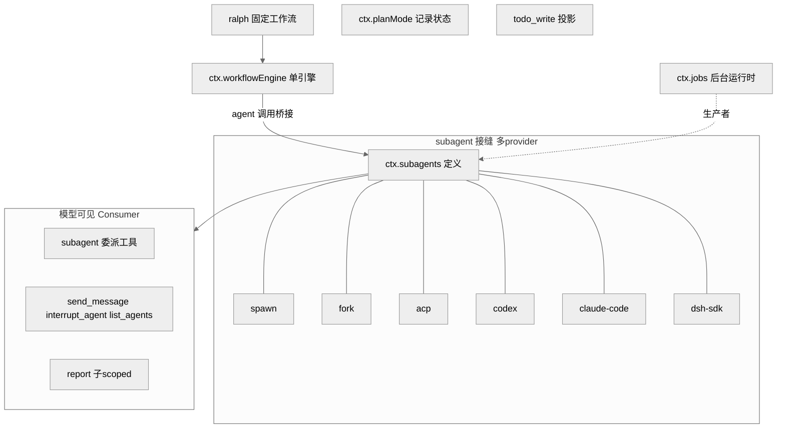
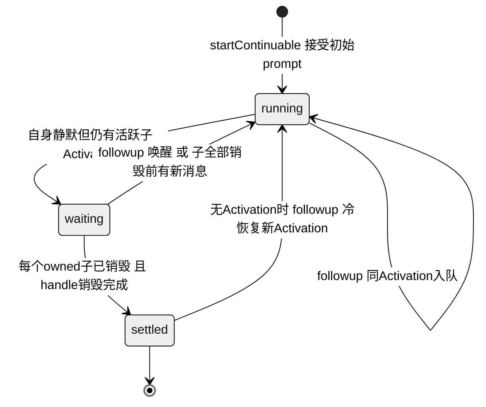
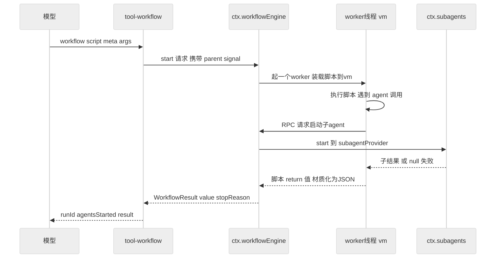
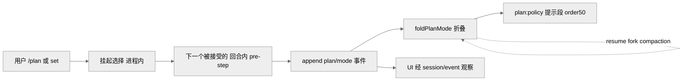

# 第 15 章 · 编排与委派 Subagent/Workflow/Plan

> 本章讲 dsh 如何让一个 agent 把工作分出去、跑起来、并把"分工"这件事变成可记录、可恢复的状态。读完你能回答：subagent 委派的接缝为什么允许多 provider 并存、能一路委派到 Codex/Claude Code 甚至另一个完整 dsh 进程；workflow 的脚本引擎凭什么跑在 worker 线程里；plan 模式为什么是"被记录的每-agent 策略状态"而非临时开关；jobs 后台与 `todo_write` 又各自解决什么。

编排与委派是 agent harness 的"力量放大器"：单个回合流（Ch06）只能串行推进，而真实任务往往需要并行审计、多角度研究、长跑迭代。dsh 把这些能力全部做成**可选插件**而非内核特性——它们挂在能力接缝（Ch11）上，`agent-loop` 既不认识 subagent，也不认识 workflow、plan、jobs、todo。本章覆盖 `packages/` 下的五个包组：`subagent/`、`workflow/`、`plan/`、`jobs/`、`todo/`。

## 一、本质是什么

这五者是同一主题的不同切面：

- **subagent** `[verified]`：委派的**能力接缝**。`ctx.subagents`（Service Definition）+ 六个 provider（Service Provider）+ 三个模型可见工具（Consumer）。它与 bash 接缝不同——**多个 provider 按名字并存**于同一 context（`ctx.subagents` 注册表），而 bash 只允许一个执行器（`docs/subsystems/subagent.md:5`）。
- **workflow** `[verified]`：让模型**写一段编排脚本**去批量启动 subagent。与 subagent 相反，它**每 context 只允许一个引擎**（`ctx.workflowEngine`），没有命名注册表（`docs/subsystems/workflow.md:5`）。
- **plan** `[verified]`：把"是否处于规划模式"做成**被记录的每-agent 协作状态**（`plan/mode` 会话事件），而不是一个进程内布尔开关。
- **jobs** `[verified]`：通用**后台任务运行时**（`ctx.jobs`），bash 与 subagent 都可作为其"生产者"，模型通过 `job_output`/`job_list`/`job_kill` 收割。
- **todo** `[verified]`：`todo_write` 工具，把任务清单做成整表替换的会话投影。

图注：subagent 是唯一"多 provider 并存"的接缝；workflow/ralph 建立在它之上；jobs 把 subagent 当作后台生产者之一；plan 与 todo 是独立的记录型能力。此图证明五个子系统的依赖方向与角色划分。

## 二、核心问题与痛点

委派放大能力的同时引入四类难题，dsh 的设计逐一对应：

1. **委派边界要多宽？** 子 agent 是同进程复用，还是独立进程、甚至跨产品（Codex/Claude Code）？→ 命名 provider 注册表，六种 transport 并存。
2. **能力协商如何"失败要响"？** 请求了某 provider 不支持的特性（如结构化输出）怎么办？→ 静态能力描述符 + `UNSUPPORTED_CAPABILITY` 硬拒绝，绝不"接受后静默降级"（`docs/subsystems/subagent.md:13`）。
3. **后台/长跑委派的所有权与恢复。** 谁负责在父进程退出后恢复子会话？→ continuable 子 agent + Activation 管理器 + 会话日志。
4. **模型写的编排脚本会不会阻塞/搞垮宿主？** → worker 线程 + vm context，一 run 一 worker，可强制终止（但明确"是隔离而非安全边界"，`workflow-worker-thread/src/index.ts:1`）。

## 三、解决思路与方案

### 3.1 subagent：两类能力，两种发现方式

provider 通过静态 `SubagentCapabilities` 声明**启动时**特性，只有四个标志：`outputSchema`、`depthLimit`、`toolFilter`、`persona`（`packages/subagent/subagent/src/types.ts`，`docs/subsystems/subagent.md:27`）。服务在调用 `start()` 前逐一校验，缺失即抛类型化错误。

而 **continuable（可续跑）**子 agent 不是启动时标志，它由续跑管理器自己组装，所以用"一个可选方法的存在与否即能力"来门禁——`prepareContinuable` 存在就代表支持，靠 TS 收窄来发现（`docs/subsystems/subagent.md:457`）。这是一个值得注意的设计：**能力发现有两套机制**，静态标志管一次性 `start()` 路径，方法存在性管续跑路径。

六个 provider 覆盖了从最便宜到跨产品的全谱系 `[verified]`：

| provider | 子 agent 形态 | 上下文继承 |
|---|---|---|
| `spawn` | 同 context 全新子 Agent，零父上下文 | 否 |
| `fork` | 同 context，**种子=父日志到最后 `turn/end` 的前缀** | 是 |
| `acp` | 独立进程，仅读父 cwd | 否 |
| `codex` | 拉起官方 `codex app-server --stdio` 进程 | 否 |
| `claude-code` | 调官方 Claude Code Agent SDK / 真实 CLI | 否 |
| `dsh-sdk` | 独立进程里一个**完整 dsh 运行时**，走 stdio JSON-RPC | 否 |

出处：各包 `packages/subagent/subagent-*/src/index.ts` 的模块 JSDoc。这个跨度是本章最强的经验事实——**同一个委派接缝，既能同进程 `spawn`，也能把任务外包给竞品 Codex/Claude Code，还能递归拉起另一整套 dsh。** 三个 Consumer 工具则分层：`tool-subagent` 做每-provider 委派，`tool-subagent-control` 提供全局的 `send_message`/`interrupt_agent`/`list_agents`（`tool-subagent-control/src/index.ts:27,80`），`tool-subagent-report` 给续跑子 agent 一条 `report` 回报父 agent 的通道（`tool-subagent-report/src/index.ts:55`）。

> **ratify-note · 委派为什么用"多 provider 命名注册表"而非单执行器**
> - 候选解释：A 沿用 bash 的单执行器模型（一个 context 只有一个 subagent 实现）；B 命名注册表，多 provider 并存。
> - 各自利弊：A 优——与 bash 对称、实现简单；缺——无法在同一部署里同时提供 `spawn` 廉价委派和 `codex`/`claude-code` 外包，跨产品编排必须换整套部署。B 优——一次委派调用即可路由到六种 transport，模型/部署按名字选择，能力用静态标志协商；缺——注册表 + 能力校验 + 描述符持久化，代码量明显更大。
> - 选定 & 理由：源码选 B。文档明确对比"subagent 有多 provider 注册表、bash 只有单执行器"（`docs/subsystems/subagent.md:5`），且真的落地了六个异构 backend，包括跨产品与递归 dsh。这不是可有可无的抽象，而是"一切皆可替换插件"主线（总纲命题1）在委派维度的直接体现。
> - 证据等级：[verified]（`docs/subsystems/subagent.md:5`；六个 `subagent-*` 包 JSDoc）。
> - 残余风险 / pre-mortem：若半年后被证伪，最可能因——除 `spawn`/`fork` 外的 provider 在真实负载下极少被启用，注册表沦为"为对称而对称"的过度设计；但即便如此，接缝本身的成本已由 Cordis effect 机制摊薄。

### 3.2 continuable 子 agent：Activation 与 FIFO inbox

一次性委派（one-shot）有 `SubagentRun` 句柄、一个结果，用完即弃。**可续跑背景子 agent** 则是"一个持久子 Session + 至多一个进程内 Activation"（Activation = 重建的子 Agent 驻留的那段时期，`docs/subsystems/subagent.md:116`）。续跑管理器负责准入、直接父授权、所有权图、冷恢复、child-first 销毁；而**回合顺序全部由 Agent loop 自己的 inbox FIFO 决定**——没有第二套执行状态机。

`followup()`（唯一续跑投递操作）的路由只看 Activation 驻留状态：

图注：`running`/`waiting`/`settled` 由 Agent 静默性与 owned-child 集合派生，不额外维护状态机；`followup` 三种落点（同 Activation 入队 / 唤醒 / 冷恢复）由此表决定。此图证明续跑层"把顺序完全托管给 inbox"的设计。

关键不变量：`startContinuable()` 在 inbox 接受初始 prompt 时即 resolve `{childId, messageId}`，**不等回合开始、也不等消息落到 Session 日志**；任何更早的失败都以"无 id + 完整回滚"告终（`docs/subsystems/subagent.md:126`）。父授权靠"精确的活 Agent 工具 context"——必须是 `SessionHeader.parentSession` 记录的直接父；`MessageSource` 只记录"谁投的"，不授予权限（`:140`）。这条把**授权与身份记录分离**，是防止委派被越权驱动的核心闸门。

`interrupt()` 是唯一公开的停止操作：同步授权、发 `Agent.cancel(cause,{keepInbox:true})`、立即返回，不等静默；未认领的 inbox 工作、Activation、已发布后代都保留（`docs/subsystems/subagent.md:144`）。`listChildren()`/`listDescendants()` 则是**纯只读枚举**，从会话存储 + 可选持久化的"活优先"合并中读取，不加载/恢复任何 Agent，靠三级阶梯（活子的 watermark 缓存 → 冷子的投影 checkpoint → 一次 `persistence.inspect()`）解析每行的 `mode`/`label`（`docs/subsystems/subagent.md:289`）。

### 3.3 workflow：worker 线程引擎 + 固定 ralph

`tool-workflow` 的描述本身就是模型可见的脚本编写规范：脚本是纯 JS（非 TS）、允许 top-level await、以 `return <json>` 结束；钩子只有 `agent()`/`pipeline()`/`parallel()`/`phase()`/`log()`，且**无文件系统、网络、定时器、Node API**——"agent 干活，脚本只协调"（`tool-workflow/src/index.ts:138-150`）。`meta`/`args` 是纯 JSON 数据，引擎在跑任何脚本文本前先校验 `meta` schema 并硬拒（`docs/subsystems/workflow.md:13`）。

图注：脚本在 worker 线程的 vm 里跑，`agent()` 通过 RPC 回到宿主经 subagent 接缝启动子 agent；脚本的返回值跨 worker 边界前被"材质化"为纯 JSON。此图证明 workflow 与 subagent 是"引擎—接缝"的组合关系，而非各自造轮子。

worker-thread 引擎的关键工程点 `[verified]`：**一 run 一 worker**，脚本在 escapable vm context 中执行；worker 阻止同步脚本卡住宿主、并允许强制终止，但文档反复强调"是 containment 而非 security boundary"（`workflow-worker-thread/src/index.ts:1`、`realm.ts:1`）。可配置 tunable 有默认值：`provider` 默认 `spawn`、`maxConcurrentAgents` 默认 `0`（即自动并行度）、`maxTotalAgents` 默认 `1000`、`maxItemsPerCall` 默认 `4096`、`syncTimeoutMs` 默认 `5000`（`workflow-worker-thread/src/index.ts:116-120`）。失败纪律很硬：钩子误用（坏参数、未知 `agent()` 选项、超集 schema、踩到 cap、取消）抛 `WorkflowError{fatal:true}`，`parallel()`/`pipeline()` **重抛** fatal 而非把该项映射为 `null`——只有普通子失败和普通阶段错误才降级为 per-item `null`（`docs/subsystems/workflow.md:116`）。

`ralph` 工具是"把一个固定编排策略做成普通插件"的示范：它给一个不可变目标喂给一串全新子 agent，每轮一个 fresh child，共享工作区作为长期记忆，报告状态为 `continue|complete|blocked`（`tool-ralph/README.md`）。它**没有**往 `agent-loop` 加任何 Ralph 模式，配置默认 `subagentProvider=spawn`、`maxRounds=256`。它把 `maxRounds` 作为 `WorkflowStartRequest.maxTotalAgents` 传下去，与引擎的总子 backstop 协同。

### 3.4 plan：被记录的每-agent 策略状态

plan 模式的精髓在于它是**软引导 + 日志态**：`plan/mode`（`{active:boolean}`）是仅日志、整值替换的会话事件，`foldPlanMode(events)` 折出最后一个值（无则 `false`）——**当前状态永远是会话日志的纯折叠**，resume/fork/compaction 无需活镜像即可恢复（`plan-mode/src/index.ts:129`、`docs/subsystems/plan.md:11`）。激活时渲染 `plan:policy` 系统提示段（order 50）；沙箱模式与审批策略独立强制、不读写 plan 状态（`docs/subsystems/plan.md:5`）。

一个微妙点：因为每个会话事件都是回合内封闭的，用户的 plan 选择先"挂起"，直到下一个**被接受的回合内 pre-step** 在请求派生前把它 append（`docs/subsystems/plan.md:15-17`）。`set()` 返回 `committed|queued|cancelled|noop` 四态。`exit_plan_mode` 工具在非 plan 模式也保持注册（进出 plan 只改提示段、不改工具目录），在 plan 模式下要求一份以 `#` 开头的完整 markdown 计划并送用户审阅（`plan-mode/src/index.ts:67`、`docs/subsystems/plan.md:33`）。

图注：plan 状态从"挂起选择"到"日志事件"再到"提示段"，全程以日志为唯一真源；恢复/分叉/压缩都只重放折叠。此图证明 plan 遵守总纲"模型可见 ⟺ 已记录"不变量（Ch07）。

### 3.5 jobs 与 todo

`ctx.jobs` 是抽象 Service Definition，`LocalJobRegistry` 是进程内 Provider。`JobId` 形如 `<kind>-N`，`JobKindMap` 目前含 `bash` 与 `subagent` 两种（`docs/subsystems/jobs.md:16`）——即 bash 长命令与背景 subagent 都能注册为 job。授权靠 owner 会话 id 而非 id 保密。`maxConcurrentJobsPerOwner` 默认 `10`，按精确 owner 计 `running+stopping`，无主 job 共享一个桶。模型侧只有 `job_output`/`job_list`/`job_kill` 三工具（`tool-jobs/src/index.ts:303,343,363`），提示语明确要求"追踪每个 job id、别忙轮询、终答前收割"（`:266`）。结算是 first-wins：一条终态记录、释放等待者、一轮受限监听通知（`docs/subsystems/jobs.md` 服务语义）。

`todo_write` 是整表替换：每次调用把完整清单 append 为 `todo/write` 会话事件，回放 last-write-wins，UI 从会话事件渲染（`tool-todo/src/index.ts:213`）。配置 `allowParallelInProgress` 是**必填**部署选择——true 允许多个 `in_progress`（适合并发 subagent/workflow 场景），false 恢复单活律，校验在 `toTodoList` 里做（`:107`）。它还注册一个 `todos` 会话投影，`turn/start` 清空、`todo/write` 覆盖（`:140`）。

## 四、实现细节关键点

- **描述符是持久身份**：`SubagentDescriptorData` 是 mode-区分（`one-shot`/`continuable`）的耐久身份，log-only、从不进模型历史、压缩后仍保留；冷恢复读子自己的 suffix，list 投影 last-wins（`docs/subsystems/subagent.md:283-285`）。
- **委派深度**：`SessionHeader.delegationDepth` + 运行时 `AgentOptions.subagentDepth`，取较大者；接缝独占这两字段，loop 既不设也不读，冷恢复不能降低深度（`docs/subsystems/subagent.md:467`）。
- **workflow durable 记录**：`tool-workflow` 把 `run-start`/`agent-start`/`agent-end`/`run-end` 投影进父 Session（仅顶层 run，嵌套 transport 不记录），首次 append 失败即禁用该 run 后续写入，保证日志要么空要么合法连续前缀（`docs/subsystems/workflow.md:124`、`tool-workflow/src/index.ts:73-131`）。
- **workflow 事件全 observe-only**：payload 是数据快照（`WorkflowRunInfo`），从不是活 `WorkflowRun`，订阅者拿不到 `cancel`/`dispose`；每监听器独占克隆 payload（`docs/subsystems/workflow.md:120`）。

## 五、易错点与注意事项

- **workflow 的 worker 不是安全边界**：脚本是可信的模型输出，vm 的 getter/proxy trap 会真的运行，材质化只拒绝 JSON 无法保留的值（`realm.ts:1`）。别把它当沙箱用来跑不可信代码。
- **plan 选择可能丢**：一次在回合最后一个被接受 pre-step 之后做出的选择保持进程内，进程退出即丢（`docs/subsystems/plan.md:17`）。这是已知 deferred。
- **continuable followup 授权**：只有直接父的精确活 Agent 能 followup；父 lineage 正在拆除时收到子结算通知不会被唤醒（避免唤醒静默 Agent 反而起一个回合，`docs/subsystems/subagent.md:212`）。
- **jobs 无 controller 就拒启**：`start` 在没有服务该 owner 的 job controller 时拒绝，避免"启动了却无人能收割/停止"（`docs/subsystems/jobs.md` 服务语义第4条）。
- **fatal 不降级**：workflow 里一个 typo 的 `agent()` 选项必须响亮杀掉脚本，绝不能溶解成看起来像普通子失败的 `null`。

## 六、竞品/横向对比

> **ratify-note · dsh 的"脚本化 workflow"相比逐轮委派/图式编排的取舍**
> - 候选解释：A 只提供逐轮 subagent 委派（模型每步决定下一个委派）；B 提供模型可写的命令式 JS 编排脚本（本方案）；C 提供声明式 DAG/图式工作流（如典型 orchestration 框架）。
> - 各自利弊：A 优——简单、每步可审；缺——大规模 fan-out（几十上百文件审计）时回合开销与上下文膨胀严重。B 优——一次调用表达 `pipeline`/`parallel` 复杂 fan-out，子工作不进父上下文，`meta`/`args` 与脚本分离便于校验；缺——命令式脚本难静态分析、worker+vm 有实现成本、非安全边界。C 优——可静态校验、可视化；缺——表达力受限，动态分支笨拙，且要求模型学专用 DSL。
> - 选定 & 理由：源码选 B。`WorkflowMeta` 字段词汇明确"匹配 Claude Code dynamic-workflows meta block"（`docs/subsystems/workflow.md:41`），说明是有意对标 Claude Code 的动态工作流思路；命令式 JS 让模型复用既有编程能力，`pipeline` 的无 barrier 语义正为大规模独立 fan-out 优化。
> - 证据等级：[verified]（对标关系见 `docs/subsystems/workflow.md:41`）+ [inferred]（"为何不选 DAG"属动机推断，源码只证实现）。
> - 残余风险 / pre-mortem：若被证伪，最可能因——命令式脚本在生产中错误率偏高（模型写错 schema/选项频繁触发 fatal），使得声明式约束反而更稳。

> **ratify-note · 把 plan 模式做成"日志态"而非"进程内开关"是否过度**
> - 候选解释：A 进程内布尔（简单，够用）；B 日志态会话事件 + 折叠恢复（本方案）。
> - 各自利弊：A 优——零持久化成本；缺——resume/fork/compaction 后 plan 状态丢失或需额外镜像，UI 与模型可能看到不一致状态。B 优——状态是日志纯折叠，天然可恢复、可 fork、可被 UI 经 `session/event` 观察，符合"模型可见 ⟺ 已记录"；缺——引入 pre-step append 时序、挂起选择可能丢的边界复杂度。
> - 选定 & 理由：源码选 B（`foldPlanMode`，`plan-mode/src/index.ts:129`）。plan 影响每个请求的提示段，若不记录则违反核心不变量——模型看到的 plan 引导必须能从日志重建。
> - 证据等级：[verified]（`docs/subsystems/plan.md:11`）。
> - 残余风险 / pre-mortem：若被证伪，最可能因——pre-step 挂起时序带来的"选择丢失"边界在实践中造成用户困惑，收益不抵复杂度。

与 Claude Code / Codex 等 harness 相比，dsh 最不同的一点是：**它不把"用哪个模型/哪个产品做子 agent"写死**。`codex`/`claude-code`/`dsh-sdk` 三个 provider 意味着 dsh 可以把子任务外包给竞品或递归拉起自身 `[verified]`（各包 JSDoc）。这与总纲主线"模型是灵魂、一切皆可替换插件"一致——委派的 transport 也是插件。

## 七、仍存在的问题与局限

- **workflow 后台收集 deferred**：`tool-workflow` 明说"background collection remains deferred"（`tool-workflow/src/index.ts:8`），workflow run 目前是前台阻塞的（一次调用等整脚本跑完）。
- **ralph 的完成是"worker 自我声明"**：无独立评估器判定目标是否真完成，evaluator 驱动的续跑是 deferred（`tool-ralph/README.md` Known Limitations）；且只有轮数一个 aggregate 约束，token/价格/时长预算未做。
- **plan 挂起选择可能丢**（见 §五），是文档化的已知限制。
- **jobs 的 kind 仅两种**（`bash`/`subagent`），虽为 merge-extensible map，但目前生产者面不宽。
- **worker vm 非安全边界**（见 §五），若未来要跑不可信编排脚本需另加真正沙箱。

## 小结与衔接

本章把 dsh 的"编排与委派"拆成五个正交能力：subagent 用命名注册表让委派 transport 从同进程 `spawn` 一路延伸到跨产品与递归 dsh；workflow 用 worker 线程引擎承载模型可写的命令式编排脚本；plan 把规划模式做成日志纯折叠的每-agent 状态；jobs 提供通用后台运行时并把 bash/subagent 当生产者；todo 把清单做成整表替换的投影。它们的共同纪律是：**全是能力接缝上的可选插件，不动 `agent-loop`；一切模型可见的东西都可从会话日志重建。** 这直接呼应 Ch11 的能力接缝三角色与 Ch07 的事件溯源不变量。下一章将进入更贴近"自我修改与远程/互操作"的能力域，看这套接缝如何延伸到进程与网络边界之外。

## 源码索引

- `docs/subsystems/subagent.md`（接缝定位:5、双能力发现:13/457、start 请求:47、continuable/Activation:116-159、授权:140、interrupt:144、枚举:289、描述符:283、深度:467）
- `docs/subsystems/workflow.md`（单引擎:5、start 请求:13、meta 对标:41、失败纪律:116、observe-only 事件:120、durable 记录:124）
- `docs/subsystems/plan.md`（软引导:5、日志折叠:11、挂起/pre-step:15-17、exit 工具:33）
- `docs/subsystems/jobs.md`（JobKindMap:16、生产者契约:34、服务语义:171-284）
- `packages/subagent/subagent-{spawn,fork,acp,codex,claude-code,dsh-sdk}-*/src/index.ts`（六 provider 模块 JSDoc）
- `packages/subagent/tool-subagent/src/index.ts`、`tool-subagent-control/src/index.ts:27,80`、`tool-subagent-report/src/index.ts:55`
- `packages/workflow/tool-workflow/src/index.ts:8,73-131,138-150,284`；`workflow-worker-thread/src/index.ts:1,116-120`；`realm.ts:1`；`runtime.ts:1`
- `packages/workflow/tool-ralph/README.md`（固定工作流策略、config 默认值、Known Limitations）
- `packages/plan/plan-mode/src/index.ts:67,129,226`
- `packages/jobs/tool-jobs/src/index.ts:266,303,343,363`
- `packages/todo/tool-todo/src/index.ts:107,140,213`
