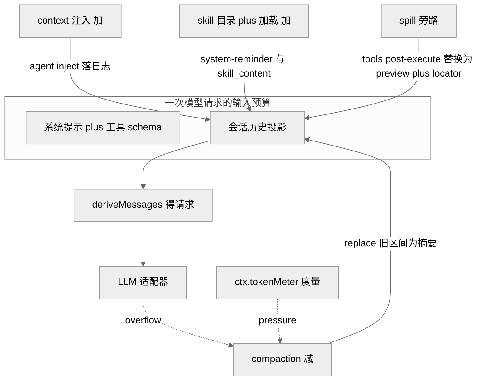
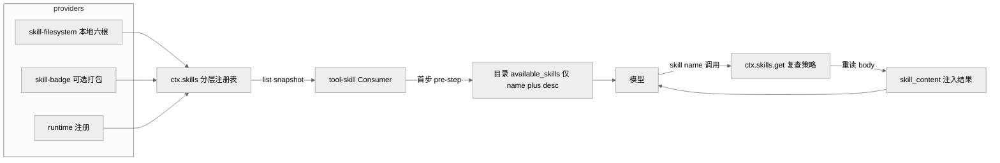
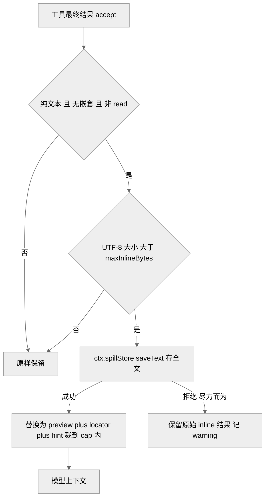

# 第 16 章 · 上下文治理：压缩 / 注入 / Skill

> 本章讲一件事：`dsh` 如何治理"进入一次模型请求的上下文预算"。模型的上下文窗口是有限且昂贵的资源，而 harness 会不断往里塞历史、工具结果、工作区说明、时间戳、技能目录。读完本章你能回答三个问题——历史涨爆了怎么**压缩**（compaction）、模型该看的额外上下文怎么**注入**且仍可追溯（context / skill）、单个工具吐出的巨量文本怎么**溢出**到窗口之外（spill），以及这三条线为什么都必须服从同一条不变量：`model-visible ⟺ logged`。

上一章讲能力接缝（Def / Provider / Consumer 三角色），本章是它的四次连续实例化。四个子系统——`compaction`、`context`、`skill`、`spill`——都不属于 agent-loop 主脊，都是可选能力，各自沿同一套接缝分裂。把它们放在一章，是因为它们共同回答"预算"这一个问题：一个做减法（压缩已有历史），两个做受控加法（注入新上下文），一个做旁路（把大块文本移出窗口）。

## 一、本质：预算的三个动词

模型请求的输入 = 系统提示 + 工具 schema + 会话历史投影 + 路由。前两者相对固定，真正会失控的是**历史投影**和**工具结果**。四个子系统对应治理这条预算的三个动词：

- **减（compaction）**：把一段旧历史替换成一条摘要 checkpoint，缩短未来请求的输入。
- **加（context / skill）**：往历史里追加模型该看但用户没直接说的内容——工作区 `AGENTS.md` 指令、当前时区时间、可调用技能目录；关键是这些"加"全部落成会话事件，可从日志重建。
- **旁路（spill）**：单个工具结果过大时，把全文写到窗口外的存储，只在上下文里留一个定位符（locator）+ 取回提示。

<div style="background: #ffffff !important; background-color: #ffffff !important; padding: 16px; border-radius: 8px; margin: 16px 0;" bgcolor="#ffffff">



</div>

> 图注：四个子系统都作用在"历史投影"这一层——两个做加法、一个做减法、一个做旁路；度量与溢出信号触发压缩。此图证明"上下文治理"是围绕单一预算的协作，而非四个孤立功能。

## 二、核心问题：无限增长 vs 有限窗口，且必须可追溯

agent 循环是长程的：几十上百个回合、成千上万行工具输出会持续堆积历史。若放任不管，请求要么超出上下文窗口直接报错，要么每步都为陈旧历史付费、拖慢并烧钱。朴素做法（截断最旧消息）会撕裂工具调用/结果配对、丢失关键决策、并让 KV 缓存全量失效。

难点在于 `dsh` 给自己上了一条硬约束——`model-visible ⟺ logged`（AGENTS.md「Conventions」）：凡能进入模型请求的输入，都必须能从 append-only 会话日志重建。这条不变量把"随手改上下文"变成了"每次改动都要落成一个会话事件"。于是压缩不能就地删日志、注入不能凭空塞字符串、溢出后的定位符也得可重放。本章四个子系统都是在"既要治理预算、又不能破坏可追溯"这对张力下的产物。

## 三、解决思路：一次接缝分裂 + 一条 KV 友好准则

### 3.1 compaction —— 能力接缝分裂成三包

压缩被明确定义为"一个可选能力，不属于 agent-loop 主脊"（`docs/subsystems/compaction.md:5`），因此像 bash 那样分裂三角色 `[verified]`：

- **Service Definition**：`dsh-compaction`（`ctx.compaction`，`packages/compaction/compaction/src/index.ts:96`）——抽象 `CompactionEngine`，暴露 `compactIfNeeded / compactNow / compactRegion` 三入口。
- **Service Provider**：`dsh-compaction-basic`（`BasicCompactionEngine`）——拥有阈值、保留策略、摘要调用与失败处理。
- **Consumer**：`dsh-command-compact`——注册人可见的 `/compact` 命令，不经模型回合。

压缩通过声明合并给 `SessionEventMap` 加了三个 `compaction/start | summary | end` 事件，全部 **log-only**、不进 surface（`compaction.md:11`）。摘要本身不作为新事件类型进入模型可见面，而是骑在一条 `user/message` 上，携带 `surfaceOp: { op: 'replace', start, end }`——这是摘要压缩对可见面做的**唯一**改写 `[verified]`。这个设计直接落实了 `model-visible ⟺ logged`：摘要要被模型看见，就必须是一条真正的消息事件。

`start / end` 是一对**锁**：先 append `compaction/start`，再做摘要、写 `compaction/summary`、落替换消息，最后才 `compaction/end`（`compaction.md:19`）。最后释放锁，是为了让中途崩溃留下"孤儿锁"（有 start 无 end）这一可检测的异常态，而不是一个谎称完成的 end。

<div style="background: #ffffff !important; background-color: #ffffff !important; padding: 16px; border-radius: 8px; margin: 16px 0;" bgcolor="#ffffff">

```mermaid
%%{init: {'theme':'neutral'}}%%
sequenceDiagram
  participant Loop as AgentLoop
  participant CB as compaction-basic
  participant Meter as tokenMeter
  participant Pruner as toolResultPruner
  participant LLM as ctx.llm.stream
  participant Log as 会话日志
  Loop->>CB: agent pre-step 序列
  CB->>Meter: 度量当前 surface plus 信封
  Meter-->>CB: 超 thresholdRatio 0.8
  CB->>Log: append compaction start 锁
  CB->>Pruner: 可选 剪裁超大 tool result
  CB->>Meter: 重新度量
  alt 仍需摘要
    CB->>LLM: 回放前缀 plus 压缩指令 一次调用
    LLM-->>CB: 摘要文本
    CB->>Log: compaction summary plus user message replace
  end
  CB->>Log: append compaction end 释放锁
```

</div>

> 图注：一次自动压缩的时序。度量在 `agent/pre-step` 串行发生（请求派生之前），先剪裁再摘要，全过程被 start/end 锁包裹。此图证明压缩是"度量→剪裁→摘要→替换"的分级流水线，而非单一操作。

`basic` provider 的策略是可配置的（`packages/compaction/compaction-basic/src/config.ts:20,23`）：`thresholdRatio` 默认 `0.8`（在 `floor(上下文窗口 × 比例)` 处触发），`retainRatio` 默认 `0.16`（保留最近尾部）。两个触发路径分明：正常压力走串行 `agent/pre-step`（`compaction-basic/src/index.ts:147`），provider 确认的上下文溢出走 `agent/request-error`（`index.ts:179`），后者只在"可见面替换代际推进后"才授权重试 `[verified]`。摘要是一次直接的 `ctx.llm.stream()` 调用（`summarizer.ts:164` 设 `purpose: 'compaction'`），**逐字回放**会话自己的系统提示、工具与被遮蔽区间消息，只在末尾追加压缩指令——目的是复用 provider 的 warm 前缀缓存，而非使其失效 `[verified]`。

> **ratify-note · 摘要为何复用会话原文前缀，而非另起精简 prompt**
> - 候选解释：A 用一段独立的、精简的 summarizer prompt（只喂需要压缩的原文）；B 逐字回放会话既有的系统提示 + 工具 + 待压缩消息，仅末尾追加指令。
> - 各自利弊：A 省 summarizer 的输入 token、prompt 可专门调优；缺点是与会话请求前缀不一致，provider 侧 KV 缓存无法复用，且要额外维护一套 prompt。B 输入更长、看似更贵；但前缀与"最近一次路由请求"逐字一致，命中 warm 前缀缓存，只有末尾指令与摘要输出未缓存（`compaction-basic/README.md:156`），并且省掉了一套需要单独演进的 prompt。
> - 选定 & 理由：选 B。第一性看，压缩发生在长会话的高压力点，此刻前缀往往已在 provider 端缓存；复用它把"多一次模型调用"的边际成本压到最低。源码可证回放逻辑与 `purpose: 'compaction'` 归因头（`summarizer.ts:161-164`、`README.md:18`）。
> - 证据等级：[verified]（`packages/compaction/compaction-basic/src/summarizer.ts:111-164`）。
> - 残余风险 / pre-mortem：若半年后被证伪，最可能因把 summarizer 路由到另一个 provider/model 或压缩非头部区间——两种情况都放弃前缀复用（README 已列为已知代价），届时 B 的输入成本优势消失。

### 3.2 context —— 受控注入，且每次注入都是事件

`context/` 组是"给模型加请求上下文但不定义工具"的产品插件（`packages/context/README.md:1`）。默认 bundle 只带 `agent-instructions`，`time-context / tmux-context / session-reference` 均 opt-in。它们的共同模式是：在 `agent/pre-step` 追加一条 `user/message`，携带一个**结构化 typed source**（而非在文本里藏状态标记）。

以 `agent-instructions`（工作区指令）为例：首个 `agent/pre-step` 组装 `$DSH_HOME/AGENTS.md` + 从项目根到 cwd 的指令链，折进 step 1 的最终批次，与直接 prompt 一起进入首个请求（`agent-instructions/README.md:9`）。此后它**观察** `read/write/edit` 的 `tools/result`：进入更深目录就把新作用域的指令排队追加，文件变更排队替换，消失则排队一条"removed"墓碑。刷新是**触碰驱动**的，没有文件监视器——外部改动要到下次成功的文件工具调用、或 resume 重新对账时才可见。所有 model-visible 文本用 `<system-reminder>` 框住，且插件对指令内容里出现的 `</system-reminder>` 字面量做转义，防止仓库可控文本闭合插件自己的框（`README.md:45`）。

`time-context` 则演示了"预算 vs 新鲜度"的权衡：`refreshIntervalMs` 为 0 或省略则每个合格 pre-step 都注入一条时间读数（token 成本高但最新），正整数间隔则减少注入（省 token 但可能让后续请求缺少最新时区提示）。每条读数积累到被压缩遮蔽为止，且是 append-only、不破坏既有 KV 缓存（`time-context/README.md:64-69`）。

### 3.3 KV 友好的一条准则：加法 append-only、减法才 replace

四个子系统的 README 都在 "KV Cache effect" 一节声明各自对缓存的影响，规律非常一致：**注入类（context / skill / spill 替换）都是 append-only**——新内容跟在可复用前缀之后，不使既有 KV 条目失效；**只有 compaction 是 replace**——checkpoint 从第一个被替换的历史 token 起使复用失效，其前的前缀仍可复用（`compaction-basic/README.md:103`）。这条准则是"预算治理"里一条隐性但贯穿全局的工程约束。

## 四、实现细节：skill 与 spill 的关键路径

### 4.1 skill —— 分层注册表 + 目录注入 + 按需加载

skill 能力族四个包（`docs/subsystems/skills.md:5`）：Definition `dsh-skill`（`ctx.skills`）、本地 Provider `dsh-skill-filesystem`、可选打包 badge provider `dsh-skill-badge`、Consumer `dsh-tool-skill`。技能是"可选指令"、不是会话事件，所以它的词汇在这一页而非 core。

注册表是 **host + per-scope 分层**的（沿用工具注册表的形状）：全局层放 host 行与仓库插件，agent preset 的常驻组合放到该 preset 的层；provider 名在层内唯一而非进程唯一。读取时合并全局层与观察方作用域链，**最近层的同名条目直接胜出**，rank 只在单层内决胜（`skills.md:13`）。本地 provider 按 rank 扫描六类根目录 `[verified]`（`skill-filesystem/src/index.ts:36-40`）：

| Rank | 来源 | 根 |
|---|---|---|
| 100 | project-dsh | `<项目根>/.dsh/skills` |
| 200 | project-agents | `<项目根>/.agents/skills` |
| 300 | custom | `Config.customSkillDirs` |
| 400 | user-dsh | `<dshHome>/skills` |
| 500 | user-agents | `<agentsHome>/skills` |
| 600 | bundled | 配置的 `bundledSkillDir`（`BUNDLED_SKILL_RANK = 600`，`skill/src/index.ts:27`）|

技能名是 kebab-case；本地 provider 接受目录 bundle（`<name>/SKILL.md`）和扁平 Markdown（`<name>.md`），不支持递归嵌套发现（`skills.md:85`）。两个正交的调用控制被归一为正布尔 `SkillInvocationPolicy`：`modelInvocable`（进模型目录/加载器）与 `userInvocable`（进人可见命令）——两者皆 false 的技能只能被受信的 `ctx.skills.get()` 调用（`skills.md:126`）。

Consumer `dsh-tool-skill` 做两件事：一是**目录注入**——首个观察到非空完整视图的 `agent/pre-step`，注入一条 durable 的 `<system-reminder>`，其中 `<available_skills>` 只含排序后的 `name` 与 XML 转义、截断的 `description`，绝不含 body、路径、来源或 provider（`tool-skill/src/index.ts:259-268`、`skills.md:231`）；此后每步比对目录摘要 digest，变化则通过 `agent.inject()` 追加一条完整替换。二是**按需加载**——model-facing `skill({ name })` 工具校验 kebab-case 名、在目录里找到摘要、加载前先查 `isModelInvocable`，再按调用方 cwd 重读完整定义并复查策略，返回 `<skill_content>` / `<skill_resources>` / `<skill_instructions>`（`skills.md:235`）。所以只改 body 不改 frontmatter，会改变后续 `skill` 调用的返回，却不产生目录消息、也不重写既有工具结果。

<div style="background: #ffffff !important; background-color: #ffffff !important; padding: 16px; border-radius: 8px; margin: 16px 0;" bgcolor="#ffffff">



</div>

> 图注：技能的两级注入——先注入"有哪些技能"（轻量目录），模型主动调用后才注入"技能全文"（重量 body）。此图证明 skill 是一种"按需展开"的上下文预算策略：目录常驻、正文延迟到被调用时才付费。

### 4.2 spill —— 工具结果溢出到窗口之外

spill 也是标准三角色接缝（`docs/subsystems/spill.md:5`）：Definition `dsh-spill`（`ctx.spillStore`，单方法 `saveText`）、Provider `dsh-spill-local`（host 文件系统上的会话私有文件）、Consumer `dsh-spill-policy`（`tools/post-execute` 策略）。它只管"存储"：不定义保留策略、不做工具结果替换、无检索/搜索 API（`spill.md:83`）。

Consumer 才是决策方：当最终结果是纯文本且 UTF-8 大小超 `maxInlineBytes`（`spill-policy/src/index.ts:76`），就把全文经 `ctx.spillStore` 存下，把模型可见结果换成"head/tail 预览 + locator + 取回提示"，且整个替换被裁到不超过 cap（`spill-policy/README.md:21`）。它是**尽力而为**的：无 session owner、无 backend、或 `saveText` 拒绝，都只记一条 warning、保留原始 inline 结果——一次失败的溢出绝不会把成功的调用变成 `isError`（`README.md:31`）。本地 backend 把文件写在 `<root>/session-<hash>/<random>-<safeName>`：0700 私有根、`sha256(sessionId)` 子目录、`open(path, 'wx', 0o600)` 独占写，使得预埋的符号链接无法把写入重定向（`spill-local/src/store.ts:74`、`spill.md:85`）。

<div style="background: #ffffff !important; background-color: #ffffff !important; padding: 16px; border-radius: 8px; margin: 16px 0;" bgcolor="#ffffff">



</div>

> 图注：spill 的判定管线。它显式跳过嵌套执行、`read`（避免 read→spill→read 死循环）、非 accept 决策与含非文本块的结果。此图证明溢出不是无脑截断，而是一组带边界条件的守卫。

## 五、易错点与注意事项

- **压缩的边界只保配对不保整回合**：区间边界用 `toolPairingBalancedBefore/After` 保证工具调用/结果成对，但不保护"整回合"——失控回合内的早期已闭合步会被压缩（`compaction.md:86`）。单个超大的不可分单元或请求信封无法靠可见面压缩修复。
- **孤儿锁语义**：live 的未匹配 `compaction/start` 是锁，阻塞所有入口；但早于最新 `session/end-seed` 的未匹配 start 是上一生命周期的陈旧证据，被忽略（`compaction.md:21`）。失败的 close 会故意留下阻塞孤儿。
- **skill 目录的不完整快照**：`SkillCatalogSnapshot.complete` 只在所有 provider 都在稳定目录代际内完成时为真；不完整快照不缓存，consumer 保留 last-good 视图并重试（`skills.md:128`）。若压缩把所有历史目录消息都遮蔽了，下一个完整快照会重建当前目录。
- **spill 只兜纯文本最终结果**：含任何非文本块的结果、blocked 反馈、`read` 都直通；provider 早先的截断（如 `web-fetch-http.maxBodyChars`）在这里无法恢复（`spill-policy/README.md:57`）。且 notice 装不下时会放弃替换、留下已存的无引用 spill。
- **agent-instructions 跟随符号链接跨信任边界**：final 组件是符号链接的候选会被解析并加载其目标，克隆仓库可借此把树外文件内容作为低权威工作区指令暴露——需用 fs 策略门或 OS 沙箱约束 `ctx.fs`（`agent-instructions/README.md:168`）。

## 六、竞品/横向对比

Claude Code 有 `/compact`、`CLAUDE.md` 记忆、以及 Skills 机制；Codex CLI 亦有类似上下文管理。表层功能高度重合，差异在实现纪律。

> **ratify-note · dsh 的上下文治理与主流 harness 的实质差别**
> - 候选解释：A "功能等价、无实质差别"——都能压缩、都能读项目指令、都有技能；B "接缝分裂 + 事件溯源是结构性差别"——dsh 把每个能力拆成 Def/Provider/Consumer，且每次上下文改动都落成会话事件。
> - 各自利弊：A 对用户体验的判断没错，日常使用确实相似；但忽略了可替换性与可审计性。B 能解释为何 dsh 可以把摘要后端换成模板式或远程 summarizer（覆盖 `summarize()` 单一 hook，`compaction-basic/README.md:24`）、把 spill 后端从本地文件换成远程 URI 而 Consumer 不变（`spill.md:70`）；缺点是这种结构性优势在单机默认部署里用户感知不到。
> - 选定 & 理由：选 B，但措辞克制。第一性差别不在"能不能压缩"，而在"压缩/注入/溢出是否都服从 `model-visible ⟺ logged` 且沿能力接缝分裂"——这让每个后端可独立替换、每次预算改动可从日志重建。社区对 Claude Code 等的对照多为 `[claimed]`（《全网调研》E 节）。
> - 证据等级：[verified] 于 dsh 侧接缝分裂与事件（上文诸引用）；[claimed] 于竞品内部实现（无一手源码）。
> - 残余风险 / pre-mortem：若被证伪，最可能因竞品内部其实也做了等价的事件化/接缝化而只是未公开——那样"结构性差别"就退化为"公开程度差别"。

## 七、仍存在的问题与局限

> **ratify-note · 触碰驱动的指令刷新是不是缺陷**
> - 候选解释：A 是缺陷——没有文件监视器，外部编辑要等下次文件工具调用才可见，存在窗口期陈旧；B 是刻意取舍——用"跟随结构化 fs 工具"换取确定性与跨沙箱一致。
> - 各自利弊：A 视角下，用户在编辑器改了 `AGENTS.md`、模型却仍用旧版，确有困惑成本。B 视角下，解析任意 shell `cd` 不可靠、每个 bash 调用是新 shell，且远程/沙箱工作区没有可靠的 host 文件监视；触碰驱动让"何时刷新"可预测且可测（`agent-instructions/README.md:164`）。
> - 选定 & 理由：判为**刻意取舍而非缺陷**，但保留窗口期陈旧为已知局限。第一性看，harness 的文件读写本就以工具调用为主干，touch 驱动与主干天然对齐；README 亦把它明列于 "Known Limitations and Deferred Work"，属已知 deferred 而非疏漏。
> - 证据等级：[verified]（`packages/context/agent-instructions/README.md:164-166`）。
> - 残余风险 / pre-mortem：若被证伪，最可能因交互式长会话中用户频繁在外部编辑指令、又长时间不触发文件工具，陈旧窗口拉长到影响任务——届时或需一个可选的轻量监视器 opt-in。

其余已知局限：压缩的度量走固定启发式（缺可复用 provider usage 时退化为字符数 + 结构开销，非精确分词，`compaction-basic/README.md:160`）；溢出分类由适配器维护，provider 措辞变化可能漏判上下文超限；`compactRegion` 要求有 open turn，全闭合会话上手动调用会抛错；skill 不支持递归嵌套 `**/SKILL.md` 发现。这些都记为 deferred，而非设计缺口。

## 小结与衔接

本章把"进入模型的上下文预算"这条线走完：`compaction` 做减法（接缝分裂 + basic 后端 + `/compact` 命令，摘要复用前缀缓存、start/end 锁保护、log-only 事件 + 单条 `user/message` 替换）；`context` 做受控加法（工作区指令、时区时间，每次注入都是携带 typed source 的会话事件）；`skill` 做按需加法（分层注册表 + 六根本地 provider + 目录轻量注入 + 正文延迟加载）；`spill` 做旁路（`tools/post-execute` 把超大纯文本移出窗口、只留 locator，尽力而为不破坏成功调用）。贯穿它们的是两条不变量——`model-visible ⟺ logged`，与"加法 append-only、减法才 replace"的 KV 友好准则。

这四者都建立在前几章的地基上：会话日志（Ch07）提供可追溯的事件流，能力接缝（Ch11）提供三角色分裂模板，工具管线（Ch09）提供 `tools/post-execute` 与 `tools/result` 扩展点。下一章转向 subagent 与 workflow——当单个 agent 的上下文治理仍不够时，如何用子代理与工作流把任务拆分到多个独立的上下文预算里去。

## 源码索引

- 压缩接缝定义：`packages/compaction/compaction/src/index.ts:96`（`CompactionEngine`）、`docs/subsystems/compaction.md:5,11,19,86`
- basic 后端：`packages/compaction/compaction-basic/src/config.ts:20,23`（默认 `0.8` / `0.16`）、`src/index.ts:147,179`（pre-step / request-error 监听）、`src/summarizer.ts:111-164`（回放摘要 + `purpose: 'compaction'`）、`README.md:18,24,103,156,160`
- 命令 Consumer：`packages/compaction/command-compact/README.md`（`/compact` 契约、busy/changed/summary/commit/persistence）
- tool-result pruner：`docs/subsystems/compaction.md:90-118`、`packages/compaction/compaction-tool-result-pruner/src/index.ts:44`
- context 注入：`packages/context/README.md`、`agent-instructions/README.md:9,45,164-168`、`time-context/README.md:17-19,64-69`
- skill 能力族：`docs/subsystems/skills.md:5,13,85,126,128,231,235`、`packages/skill/skill-filesystem/src/index.ts:36-40`、`packages/skill/skill/src/index.ts:27`（`BUNDLED_SKILL_RANK`）、`packages/skill/tool-skill/src/index.ts:177,259-268`
- spill 接缝：`docs/subsystems/spill.md:5,70,83,85`、`packages/spill/spill-local/src/store.ts:74`、`packages/spill/spill-policy/src/index.ts:76,113`、`README.md:21,31,57`
- 不变量：`CLAUDE.md`「Conventions · Model-visible ⟺ logged / Registrations are effects」
