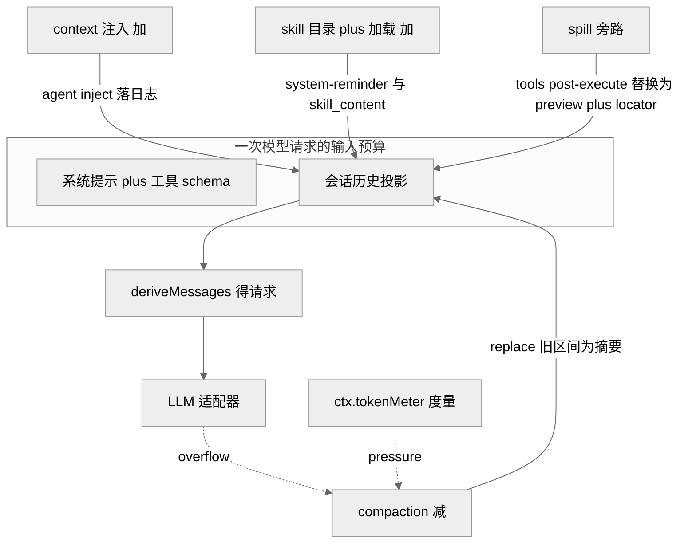
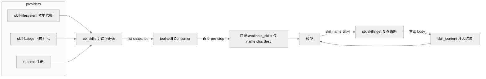
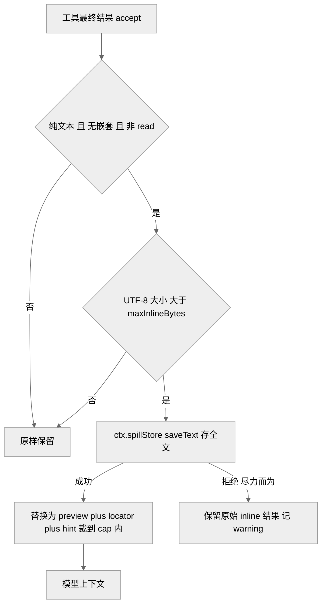

# 第 16 章 · 上下文治理：压缩 / 注入 / Skill

> 本章讲一件事：`dsh` 如何治理"进入一次模型请求的上下文预算"。可以把模型的上下文窗口想成一张桌子——面积有限，每放一张纸都要占地方，而且租金不便宜（token 越多越慢越贵）。偏偏 harness 会不停往桌上堆东西：对话历史、工具输出、工作区说明、时间戳、技能目录。桌子迟早会满。读完本章你能回答三个问题——历史涨爆了怎么**压缩**（compaction，把旧历史换成一条摘要）、模型该看的额外上下文怎么**注入**且仍可追溯（context / skill）、单个工具吐出的巨量文本怎么**溢出**到窗口之外（spill，把大块内容挪到桌子外、只留一张便签指路），以及这三条线为什么都必须服从同一条不变量：`model-visible ⟺ logged`（凡是模型看得见的，都必须能从日志里重建出来）。

上一章讲能力接缝（capability seam，即把一个能力拆成 Def / Provider / Consumer 三个角色——定义契约的、提供实现的、使用它的，就像插座标准让灯泡和电路互不依赖），本章是它的四次连续实例化。四个子系统——`compaction`、`context`、`skill`、`spill`——都不属于 agent-loop 主脊（不是每个回合都必跑的核心流程），都是可选能力，各自沿同一套接缝分裂。把它们放在一章，是因为它们共同回答"预算"这一个问题：一个做减法（压缩已有历史），两个做受控加法（注入新上下文），一个做旁路（把大块文本移出窗口）。

## 一、本质：预算的三个动词

模型请求的输入 = 系统提示 + 工具 schema + 会话历史投影 + 路由。前两者相对固定，真正会失控的是**历史投影**（这一轮要回放给模型看的对话内容）和**工具结果**。四个子系统对应治理这条预算的三个动词：

- **减（compaction）**：把一段旧历史替换成一条摘要 checkpoint（相当于把一叠会议记录浓缩成一页纪要），缩短未来请求的输入。
- **加（context / skill）**：往历史里追加模型该看但用户没直接说的内容——工作区 `AGENTS.md` 指令、当前时区时间、可调用技能目录；关键是这些"加"全部落成会话事件，可从日志重建（不是偷偷塞进去的临时字符串）。
- **旁路（spill）**：单个工具结果过大时，把全文写到窗口外的存储，只在上下文里留一个定位符（locator，一个"东西存在这儿，需要就去取"的指针）+ 取回提示。

<div style="background: #ffffff !important; background-color: #ffffff !important; padding: 16px; border-radius: 8px; margin: 16px 0;" bgcolor="#ffffff">



</div>

> 图注：四个子系统都作用在"历史投影"这一层——两个做加法、一个做减法、一个做旁路；度量与溢出信号触发压缩。此图证明"上下文治理"是围绕单一预算的协作，而非四个孤立功能。

## 二、核心问题：无限增长 vs 有限窗口，且必须可追溯

agent 循环是长程的：几十上百个回合、成千上万行工具输出会持续堆积历史。若放任不管，请求要么超出上下文窗口直接报错，要么每步都为陈旧历史付费、拖慢并烧钱。朴素做法（直接砍掉最旧的消息）看似简单，代价却不小：它会撕裂"工具调用 + 对应结果"这一对（留下一半、丢另一半，模型看得一头雾水）、丢失关键决策、并让 KV 缓存（key-value cache，键值缓存）全量失效——KV 缓存是模型对已算过的前缀的复用，前缀一动，后面全得重算。

难点在于 `dsh` 给自己上了一条硬约束——`model-visible ⟺ logged`（AGENTS.md「Conventions」）：凡能进入模型请求的输入，都必须能从 append-only（只追加、不改旧记录）的会话日志重建。这条不变量把"随手改上下文"变成了"每次改动都要落成一个会话事件"。于是压缩不能就地删日志、注入不能凭空塞字符串、溢出后的定位符也得可重放。本章四个子系统都是在"既要治理预算、又不能破坏可追溯"这对张力下的产物。

## 三、解决思路：一次接缝分裂 + 一条 KV 友好准则

### 3.1 compaction —— 能力接缝分裂成三包

压缩被明确定义为"一个可选能力，不属于 agent-loop 主脊"（`docs/subsystems/compaction.md:5`），因此像 bash 那样分裂三角色 `[verified]`——一个定义契约、一个给出实现、一个负责使用：

- **Service Definition**：`dsh-compaction`（`ctx.compaction`，`packages/compaction/compaction/src/index.ts:96`）——抽象 `CompactionEngine`，暴露 `compactIfNeeded / compactNow / compactRegion` 三入口（分别对应"必要时才压"、"立刻压"、"压指定区间"）。
- **Service Provider**：`dsh-compaction-basic`（`BasicCompactionEngine`）——拥有阈值、保留策略、摘要调用与失败处理，也就是"怎么压"的全部具体逻辑。
- **Consumer**：`dsh-command-compact`——注册人可见的 `/compact` 命令，让用户能手动触发压缩，不经模型回合。

压缩通过声明合并给 `SessionEventMap` 加了三个 `compaction/start | summary | end` 事件，全部 **log-only**（只记进日志、不进模型可见面）、不进 surface（`compaction.md:11`）。摘要本身不作为新事件类型进入模型可见面，而是骑在一条 `user/message` 上，携带 `surfaceOp: { op: 'replace', start, end }`——这是摘要压缩对可见面做的**唯一**改写 `[verified]`。这个设计直接落实了 `model-visible ⟺ logged`：摘要要被模型看见，就必须是一条真正的消息事件，而不是绕过日志的暗改。

`start / end` 是一对**锁**：先 append `compaction/start`，再做摘要、写 `compaction/summary`、落替换消息，最后才 `compaction/end`（`compaction.md:19`）。为什么把释放锁放到最后？这样一来，如果中途崩溃，就会留下一个"孤儿锁"（有 start 没有 end）——一个明确、可被检测的异常态，而不是一个谎称"我完成了"的 end。宁可留下可识别的半成品，也不留下假装完工的记录。

<div style="background: #ffffff !important; background-color: #ffffff !important; padding: 16px; border-radius: 8px; margin: 16px 0;" bgcolor="#ffffff">

```mermaid
%%{init: {'theme':'neutral'}}%%
sequenceDiagram
  participant Loop as AgentLoop
  participant CB as compaction-basic
  participant Meter as tokenMeter
  participant Pruner as toolResultPruner
  participant LLM as ctx.llm.stream
  participant Log as 会话日志
  Loop->>CB: agent pre-step 序列
  CB->>Meter: 度量当前 surface plus 信封
  Meter-->>CB: 超 thresholdRatio 0.8
  CB->>Log: append compaction start 锁
  CB->>Pruner: 可选 剪裁超大 tool result
  CB->>Meter: 重新度量
  alt 仍需摘要
    CB->>LLM: 回放前缀 plus 压缩指令 一次调用
    LLM-->>CB: 摘要文本
    CB->>Log: compaction summary plus user message replace
  end
  CB->>Log: append compaction end 释放锁
```

</div>

> 图注：一次自动压缩的时序。度量在 `agent/pre-step` 串行发生（请求派生之前），先剪裁再摘要，全过程被 start/end 锁包裹。此图证明压缩是"度量→剪裁→摘要→替换"的分级流水线，而非单一操作。

`basic` provider 的策略是可配置的（`packages/compaction/compaction-basic/src/config.ts:19,22`）：`thresholdRatio` 默认 `0.8`（桌子占到八成满就触发，具体在 `floor(上下文窗口 × 比例)` 处），`retainRatio` 默认 `0.16`（压缩时保留最近的约一成六尾部，因为最新的对话往往最相关）。两个触发路径分明：正常压力走串行 `agent/pre-step`（每步开始前检查，`compaction-basic/src/index.ts:147`），provider 确认的上下文溢出（模型端明确报"超了"）走 `agent/request-error`（`index.ts:179`），后者只在"可见面替换代际推进后"才授权重试 `[verified]`——即确认历史真的被替换过、这次重试不会原样再撞一次墙。摘要是一次直接的 `ctx.llm.stream()` 调用（`summarizer.ts:164` 设 `purpose: 'compaction'`），**逐字回放**会话自己的系统提示、工具与被遮蔽区间消息，只在末尾追加压缩指令——目的是复用 provider 的 warm 前缀缓存（前缀一字不差，模型端就能直接命中已算好的部分），而非使其失效 `[verified]`（`summarizer.ts:111-164`）。这个选择的根因很朴素：压缩恰恰发生在长会话的高压力点，此刻前缀往往已在 provider 端缓存，复用它就能把"多一次模型调用"的边际成本压到最低；反过来另起一段精简 summarizer prompt 虽省输入 token，却与会话请求前缀不一致、白白丢掉 KV 缓存，还得额外维护一套 prompt。

### 3.2 context —— 受控注入，且每次注入都是事件

`context/` 组是"给模型加请求上下文但不定义工具"的产品插件（`packages/context/README.md:1`）——它只往上下文里补料，不给模型新增可调用的工具。默认 bundle 只带 `agent-instructions`，`time-context / tmux-context / session-reference` 均 opt-in（要用得自己开）。它们的共同模式是：在 `agent/pre-step` 追加一条 `user/message`，携带一个**结构化 typed source**（带类型的来源标记，而非在文本里藏一个约定俗成的状态字符串——后者容易被误解析）。

以 `agent-instructions`（工作区指令，即项目里的 `AGENTS.md` 这类"该怎么在本仓库干活"的说明）为例：首个 `agent/pre-step` 组装 `$DSH_HOME/AGENTS.md` + 从项目根到 cwd（current working directory，当前工作目录）的指令链，折进 step 1 的最终批次，与直接 prompt 一起进入首个请求（`agent-instructions/README.md:9`）。此后它**观察** `read/write/edit` 的 `tools/result`：进入更深目录就把新作用域的指令排队追加，文件变更排队替换，消失则排队一条"removed"墓碑（一条明说"这条指令已不存在"的记录，而非默默删掉）。刷新是**触碰驱动**的——它没有文件监视器，只在你下次成功调用文件工具、或 resume 重新对账时才看到外部改动。所有 model-visible 文本用 `<system-reminder>` 框住，且插件对指令内容里出现的 `</system-reminder>` 字面量做转义，防止仓库里可控的文本提前"闭合"插件自己的框、把后面的内容伪装成系统提示（`README.md:45`）。

`time-context` 则演示了"预算 vs 新鲜度"的权衡：`refreshIntervalMs` 为 0 或省略则每个合格 pre-step 都注入一条时间读数（每步都给最新时间，代价是多花 token），正整数间隔则减少注入（省 token，但可能让后续请求缺少最新时区提示）。每条读数积累到被压缩遮蔽为止，且是 append-only、不破坏既有 KV 缓存（`time-context/README.md:64-69`）。

### 3.3 KV 友好的一条准则：加法 append-only、减法才 replace

四个子系统的 README 都在 "KV Cache effect" 一节声明各自对缓存的影响，规律非常一致：**注入类（context / skill / spill 替换）都是 append-only**——新内容跟在可复用前缀之后，就像往文件尾部追加，不动前面已算好的部分，因此不使既有 KV 条目失效；**只有 compaction 是 replace**——它改了历史中间的一段，checkpoint 从第一个被替换的历史 token 起使复用失效，但那一点之前的前缀仍可复用（`compaction-basic/README.md:103`）。一句话记：只要动的是"末尾追加"就便宜，动的是"中间替换"才付缓存代价。这条准则是"预算治理"里一条隐性但贯穿全局的工程约束。

## 四、实现细节：skill 与 spill 的关键路径

### 4.1 skill —— 分层注册表 + 目录注入 + 按需加载

skill 能力族四个包（`docs/subsystems/skills.md:5`）：Definition `dsh-skill`（`ctx.skills`）、本地 Provider `dsh-skill-filesystem`、可选打包 badge provider `dsh-skill-badge`、Consumer `dsh-tool-skill`。技能（skill）可以理解为"打包好的一套操作说明"——模型需要时才展开来照着做。它是"可选指令"、不是会话事件，所以它的词汇归在这一页而非 core。

注册表是 **host + per-scope 分层**的（沿用工具注册表的形状，即按"全局 + 每个作用域各一层"来组织）：全局层放 host 行与仓库插件，agent preset 的常驻组合放到该 preset 的层；provider 名在层内唯一而非进程唯一。读取时合并全局层与观察方作用域链，**最近层的同名条目直接胜出**（离当前上下文越近的定义优先，类似就近覆盖），rank 只在单层内决胜（`skills.md:13`）。本地 provider 按 rank 扫描六类根目录 `[verified]`（`skill-filesystem/src/index.ts:36-40`）：

| Rank | 来源 | 根 |
|---|---|---|
| 100 | project-dsh | `<项目根>/.dsh/skills` |
| 200 | project-agents | `<项目根>/.agents/skills` |
| 300 | custom | `Config.customSkillDirs` |
| 400 | user-dsh | `<dshHome>/skills` |
| 500 | user-agents | `<agentsHome>/skills` |
| 600 | bundled | 配置的 `bundledSkillDir`（`BUNDLED_SKILL_RANK = 600`，`skill/src/index.ts:27`）|

技能名是 kebab-case（小写连字符式，如 `code-review`）；本地 provider 接受目录 bundle（`<name>/SKILL.md`）和扁平 Markdown（`<name>.md`），不支持递归嵌套发现（`skills.md:85`）。两个正交的调用控制被归一为正布尔 `SkillInvocationPolicy`——"正布尔"意思是默认按 false 处理、必须显式打开：`modelInvocable`（进模型目录/加载器，即模型能不能看到并调用它）与 `userInvocable`（进人可见命令，即用户能不能用斜杠命令调它）——两者皆 false 的技能只能被受信的 `ctx.skills.get()` 调用（`skills.md:126`）。

Consumer `dsh-tool-skill` 做两件事：一是**目录注入**——首个观察到非空完整视图的 `agent/pre-step`，注入一条 durable（持久保留）的 `<system-reminder>`，其中 `<available_skills>` 只含排序后的 `name` 与 XML（Extensible Markup Language，可扩展标记语言）转义、截断的 `description`，绝不含 body、路径、来源或 provider（`tool-skill/src/index.ts:259-268`、`skills.md:231`）——相当于给模型一份"菜单"，只有菜名和一句简介，看不到做法。此后每步比对目录摘要 digest（一个能代表目录内容的短指纹），变化则通过 `agent.inject()` 追加一条完整替换。二是**按需加载**——model-facing `skill({ name })` 工具校验 kebab-case 名、在目录里找到摘要、加载前先查 `isModelInvocable`，再按调用方 cwd 重读完整定义并复查策略，返回 `<skill_content>` / `<skill_resources>` / `<skill_instructions>`（`skills.md:235`）——这才是"点菜后端上来的整道菜"。所以只改 body 不改 frontmatter，会改变后续 `skill` 调用的返回，却不产生目录消息、也不重写既有工具结果。

<div style="background: #ffffff !important; background-color: #ffffff !important; padding: 16px; border-radius: 8px; margin: 16px 0;" bgcolor="#ffffff">



</div>

> 图注：技能的两级注入——先注入"有哪些技能"（轻量目录），模型主动调用后才注入"技能全文"（重量 body）。此图证明 skill 是一种"按需展开"的上下文预算策略：目录常驻、正文延迟到被调用时才付费。

### 4.2 spill —— 工具结果溢出到窗口之外

spill 也是标准三角色接缝（`docs/subsystems/spill.md:5`）：Definition `dsh-spill`（`ctx.spillStore`，只有一个方法 `saveText`）、Provider `dsh-spill-local`（把内容写到 host 文件系统上的会话私有文件）、Consumer `dsh-spill-policy`（在 `tools/post-execute` 阶段决定要不要溢出）。这里的分工很干净：存储方只管"存"——不定义保留策略、不做工具结果替换、也没有检索/搜索 API（`spill.md:83`）。

Consumer 才是决策方：当最终结果是纯文本且 UTF-8 大小超 `maxInlineBytes`（`spill-policy/src/index.ts:76`），就把全文经 `ctx.spillStore` 存下，把模型可见结果换成"head/tail 预览（头尾各留一段）+ locator + 取回提示"，且整个替换被裁到不超过 cap（上限，`spill-policy/README.md:21`）。它是**尽力而为**的：无 session owner、无 backend、或 `saveText` 拒绝，都只记一条 warning、保留原始 inline 结果——一次失败的溢出绝不会把一个本来成功的工具调用变成 `isError`（`README.md:31`）。存不下就原样留着，坏事不升级。本地 backend 把文件写在 `<root>/session-<hash>/<random>-<safeName>`，安全上层层设防：0700 私有根（只有属主能进）、`sha256(sessionId)` 子目录、`open(path, 'wx', 0o600)` 独占写（文件必须由本次创建、不能覆盖已存在的），使得预埋的符号链接无法把写入偷偷重定向到别处（`spill-local/src/store.ts:74`、`spill.md:85`）。

<div style="background: #ffffff !important; background-color: #ffffff !important; padding: 16px; border-radius: 8px; margin: 16px 0;" bgcolor="#ffffff">



</div>

> 图注：spill 的判定管线。它显式跳过嵌套执行、`read`（避免 read→spill→read 死循环）、非 accept 决策与含非文本块的结果。此图证明溢出不是无脑截断，而是一组带边界条件的守卫。

## 五、易错点与注意事项

- **压缩的边界只保配对不保整回合**：区间边界用 `toolPairingBalancedBefore/After` 保证工具调用/结果成对（不会把"调用"和"结果"拆散），但它不保护"整回合"——失控回合内那些早已闭合的步骤照样会被压缩（`compaction.md:86`）。如果撑爆预算的是单个超大的不可分单元或请求信封，压可见面也救不了。
- **孤儿锁语义**：live 的未匹配 `compaction/start` 是锁，阻塞所有入口；但早于最新 `session/end-seed` 的未匹配 start 属于上一个生命周期的陈旧证据，被忽略（`compaction.md:21`）。换句话说，失败的 close 会故意留下一个"当前有效"的阻塞孤儿，而"上辈子"遗留的孤儿则不算数。
- **skill 目录的不完整快照**：`SkillCatalogSnapshot.complete` 只在所有 provider 都在稳定目录代际内完成时才为真；不完整的快照不缓存，consumer 会保留上一次已知良好（last-good）的视图并重试（`skills.md:128`）。若压缩把所有历史目录消息都遮蔽了，下一个完整快照会重建当前目录。
- **spill 只兜纯文本最终结果**：含任何非文本块的结果、blocked 反馈、`read` 都直通不处理；provider 更早做过的截断（如 `web-fetch-http.maxBodyChars` 砍掉的部分）到这里也无法恢复（`spill-policy/README.md:57`）。而且当那条 notice（预览+指路提示）本身都塞不下时，它会放弃替换、留下一个已存但无人引用的 spill 文件。
- **agent-instructions 跟随符号链接跨信任边界**：路径末段若是符号链接，会被解析并加载它指向的目标，于是一个克隆来的仓库可以借此把项目树之外的文件内容当成低权威的工作区指令喂进来——防范办法是用 fs 策略门或 OS 沙箱约束 `ctx.fs` 能碰到的范围（`agent-instructions/README.md:168`）。

## 六、竞品/横向对比

Claude Code 有 `/compact`、`CLAUDE.md` 记忆、以及 Skills 机制；Codex CLI 亦有类似上下文管理。也就是说，"能压缩、能读项目指令、能装技能"这些表层功能高度重合；真正的差异更多在实现纪律——同样一件事，是随手做掉，还是每一步都落成可追溯的事件、都沿同一套接缝分裂。正因为压缩/注入/溢出都服从 `model-visible ⟺ logged` 且沿能力接缝分裂，dsh 才能把摘要后端换成模板式或远程 summarizer（覆盖 `summarize()` 单一 hook，`compaction-basic/README.md:24`）、把 spill 后端从本地文件换成远程 URI 而 Consumer 不变（`spill.md:70`），每个后端可独立替换、每次预算改动可从日志重建——这一层在 dsh 侧是 `[verified]` 的，而竞品内部是否也做了等价的事件化/接缝化，因无一手源码只能记为 `[claimed]`（《全网调研》E 节）。

## 七、仍存在的问题与局限

`agent-instructions` 的**触碰驱动刷新**（没有文件监视器，外部编辑要等你下次成功调用文件工具、或 resume 重新对账才可见）应看作刻意取舍而非缺陷：解析任意 shell `cd` 并不可靠、每个 bash 调用都是新 shell，且没有文件监视器（remote/沙箱工作区更难有可靠的宿主级文件监视，或许也是考量之一），触碰驱动反而让"何时刷新"可预测、可测；代价是保留一段窗口期陈旧作为已知局限（`agent-instructions/README.md:164-166`，`[verified]`）。

其余已知局限：压缩的度量走固定启发式（拿不到可复用的 provider usage 数据时，就退化成"数字符数 + 结构开销"来估，而不是精确按分词器计 token，`compaction-basic/README.md:160`）；溢出分类由适配器维护，provider 一旦改了报错措辞，就可能漏判"上下文超限"这类错误；`compactRegion` 要求有 open turn（进行中的回合），在一个已全部闭合的会话上手动调用它会抛错；skill 不支持递归嵌套的 `**/SKILL.md` 发现。这些都记为 deferred（暂缓、待办），而非设计缺口。

## 小结与衔接

本章把"进入模型的上下文预算"这条线走完：`compaction` 做减法（接缝分裂 + basic 后端 + `/compact` 命令，摘要复用前缀缓存、start/end 锁保护、log-only 事件 + 单条 `user/message` 替换）；`context` 做受控加法（工作区指令、时区时间，每次注入都是携带 typed source 的会话事件）；`skill` 做按需加法（分层注册表 + 六根本地 provider + 目录轻量注入 + 正文延迟加载）；`spill` 做旁路（`tools/post-execute` 把超大纯文本移出窗口、只留 locator，尽力而为不破坏成功调用）。贯穿它们的是两条不变量——`model-visible ⟺ logged`，与"加法 append-only、减法才 replace"的 KV 友好准则。

这四者都建立在前几章的地基上：会话日志（Ch07）提供可追溯的事件流，能力接缝（Ch11）提供三角色分裂模板，工具管线（Ch09）提供 `tools/post-execute` 与 `tools/result` 扩展点。下一章转向 subagent 与 workflow——当单个 agent 的上下文治理仍不够时，如何用子代理与工作流把任务拆分到多个独立的上下文预算里去。

## 源码索引

- 压缩接缝定义：`packages/compaction/compaction/src/index.ts:96`（`CompactionEngine`）、`docs/subsystems/compaction.md:5,11,19,86`
- basic 后端：`packages/compaction/compaction-basic/src/config.ts:19,22`（默认 `0.8` / `0.16`）、`src/index.ts:147,179`（pre-step / request-error 监听）、`src/summarizer.ts:111-164`（回放摘要 + `purpose: 'compaction'`）、`README.md:18,24,103,156,160`
- 命令 Consumer：`packages/compaction/command-compact/README.md`（`/compact` 契约、busy/changed/summary/commit/persistence）
- tool-result pruner：`docs/subsystems/compaction.md:90-118`、`packages/compaction/compaction-tool-result-pruner/src/index.ts:44`
- context 注入：`packages/context/README.md`、`agent-instructions/README.md:9,45,164-168`、`time-context/README.md:17-19,64-69`
- skill 能力族：`docs/subsystems/skills.md:5,13,85,126,128,231,235`、`packages/skill/skill-filesystem/src/index.ts:36-40`、`packages/skill/skill/src/index.ts:27`（`BUNDLED_SKILL_RANK`）、`packages/skill/tool-skill/src/index.ts:177,259-268`
- spill 接缝：`docs/subsystems/spill.md:5,70,83,85`、`packages/spill/spill-local/src/store.ts:74`、`packages/spill/spill-policy/src/index.ts:76,113`、`README.md:21,31,57`
- 不变量：`CLAUDE.md`「Conventions · Model-visible ⟺ logged / Registrations are effects」
