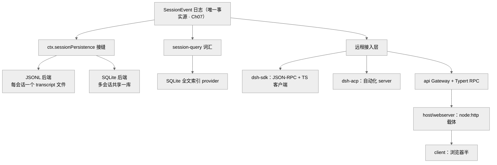
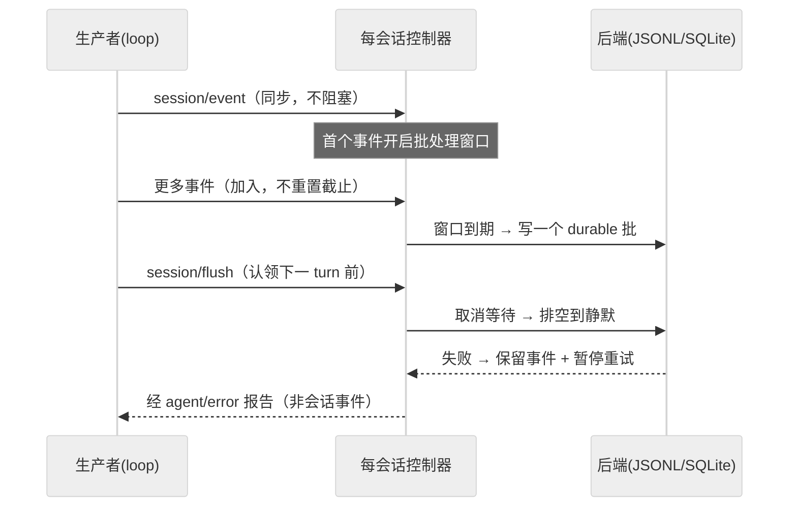
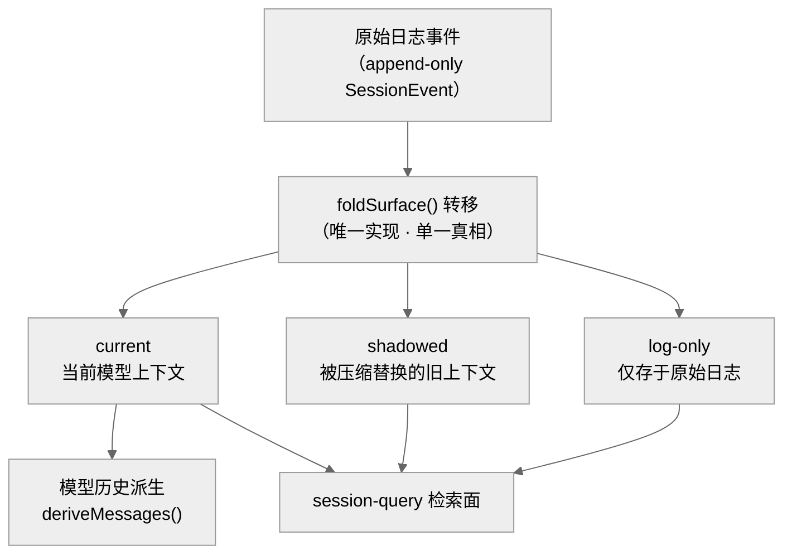
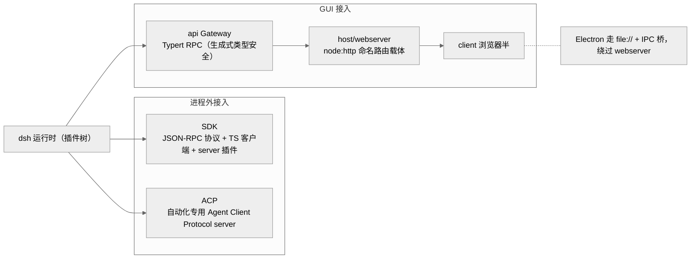

# 会话持久化、检索与远程接入

本章讲 dsh 如何把内存里的会话日志"落到磁盘、可被查询、可被进程外调用"。读完你能回答三个问题：一条 append-only 的 `SessionEvent` 日志怎样安全地变持久（且崩溃后不丢一个 turn）？如何在成百上千个会话里做全文检索与血缘追踪？以及外部程序（CLI、自动化、浏览器 GUI）通过哪几条协议接进这套运行时。

这一章横跨 `session/`、`session-query/`、`sdk/`、`acp/`、`api/`、`host/`、`client/`、`typert/` 八个包组，但主线只有一条：**日志是唯一事实源（见 Ch07），持久化、检索、远程接入都是它的下游派生。** 我们按"持久化 → 检索 → 进程外/远程接入"三段展开，抓主干而非逐包平均用力。

## 一、本质：三段都是"日志的下游"

- **持久化（persistence）** 回答"日志怎样安全落盘"：一个抽象服务 `ctx.sessionPersistence` + 两个可换后端（JSONL / SQLite）。它是一条标准的[能力接缝](../../repo/deepseek-harness/.agents/notes/implemented/architecture/2026-06-13-capability-seams.md)（Ch11），**不引入平行的持久化事件类型**——落盘的就是 `SessionEvent` 本身 `[verified]`（`docs/subsystems/persistence.md`）。
- **检索（session-query）** 回答"跨会话怎么查"：一套 provider 无关的查询词汇 + 一个 SQLite 全文索引 provider，分成两个包 `[verified]`（`packages/session-query/session-query` 与 `…-sqlite`）。
- **远程接入** 回答"进程外怎么用":SDK（JSON-RPC）、ACP（自动化）、api Gateway + Typert（浏览器 GUI 的类型安全 RPC）。

> 图注：持久化 / 检索 / 远程三条线都从同一条日志派生，互不引入第二事实源——这是本章一切设计取舍的出发点。

## 二、核心问题与痛点

一个 agent harness 的长程任务里，一个 turn 可能包含几十个 step、巨量工具输出。这带来三个真问题：① **落盘不能阻塞产出**（否则每个事件都要等磁盘）；② **崩溃恢复不能丢一个已追加的 turn**，也不能把半截 turn 当完整数据；③ **检索既要"当前模型上下文"又要"被替换的历史"**——因为压缩（Ch16）会 shadow 掉旧事件，检索得能区分。

## 三、解决思路与关键设计

### 3.1 flush 检查点：非阻塞批量写

`session/event` 是**同步通知**，持久化插件把事件拷进"每会话控制器"就返回，不阻塞生产者 `[verified]`（`docs/subsystems/persistence.md` "The flush checkpoint"）。首个待写事件开启一个**固定批处理窗口**，后续事件加入但**不重置**其截止时间；`session/flush` 取消等待并排空到静默，loop 用它作为"认领下一个普通 turn 前"的排序与错误观测检查点。被拒的后台写会保留事件并暂停自动重试，显式 flush 立即重试并通过 `agent/error` 报告——**绝不作为已关闭 turn 之后的会话事件**（呼应 Ch07 的 model-visible⟺logged 边界）。

> 图注：批处理窗口把"每事件一次磁盘 IO"摊薄为"每窗口一次批写"，而 flush 给 loop 一个明确的错误观测点。

### 3.2 崩溃恢复：合成 `turn/end` 而非截断

后端重载一个崩溃于半途的日志时，会遇到有 `turn/start` 却无 `turn/end` 的孤儿 turn。它**不截断**（那些事件已在崩溃前 durable 追加），而是补一个合成 `turn/end { reason: { kind: 'interrupted' } }` 收平 `[verified]`（`docs/subsystems/persistence.md`）。`interrupted` 是唯一没有任何 loop 会主动发出的 `TurnEndReason`——这个"留白语义"让恢复态可被一眼识别。修复只作用于**冷会话**；活跃 id 的 `load()` 会等到内存快照 durable 且平衡才返回，开着的活跃 turn 宁可 reject 也不接受合成边界。

> **ratify-note · 崩溃恢复为何"合成收平"而非"截断到最后完整 turn"**
> - 候选：A 截断到最后一个 `turn/end`（丢弃半截 turn）；B 保留半截 turn 并合成 `interrupted` 收平（现状）；C 原样保留不收平（让下游自行处理不平衡）。
> - 利弊：A 简单，但**丢弃一个长程 turn 可能是几十步、巨量工具输出的真实工作**，代价高；B 一个事件都不丢、且恢复态可被 `interrupted` 唯一标识，代价是引入一个"没有 loop 会发"的合成事件类型；C 零写入，但把不平衡日志推给每个下游（deriveMessages、检索、UI）各自处理，扩散复杂度。
> - 选定 & 理由：B。第一性上"已 durable 追加的事件是事实、不该被恢复逻辑抹掉"，且用一个专用 `interrupted` reason 把恢复态收敛在持久化层内部。
> - 证据等级：`[verified]`（`docs/subsystems/persistence.md` 崩溃恢复一节明文）。
> - 残余风险 / pre-mortem：若半年后出问题，最可能是"某下游把合成 `turn/end` 当作真实模型行为"——但 `interrupted` 的"无 loop 发出"约定正是为堵这条路而设。

### 3.3 SessionHeader：元数据走日志之外

格式版本、cwd、血缘（lineage）、seed 边界属于**存储关注点而非对话事件**，因此不进 `SessionEventMap`、永不到达 `deriveMessages()`，而是挂在 `session.header` 上 `[verified]`（`packages/core/session/src/types.ts`）。后端加载时若 `version` 不等于 `SESSION_FORMAT_VERSION` 直接 reject（无迁移，呼应 Ch07 版本停在 0 的无兼容承诺）。这条"元数据 vs 事件分离"是全章的隐形骨架：检索的 `SessionRecord` 正是靠 header 才能在"日志之外"描述一个会话。

### 3.4 检索：live-preferred 语义与 surface 分类

`session-query` 的核心概念是**逻辑语料**（logical corpus）:优先读活跃内存态、回落到持久态，`SessionRecord` 用两个独立布尔 `live`/`persisted` 暴露来源可用性 `[verified]`（`docs/subsystems/session-query.md`）。关键的是 `SessionEventSurface` 三态——`current`（当前模型上下文）/ `shadowed`（被替换的上下文）/ `log-only`（仅在原始日志），分类用与模型历史派生**同一套 `foldSurface()` 转移**，保证"检索看到的当前面"和"模型真正看到的"一致。全文检索由 SQLite provider 拥有具体索引生命周期，而查询词汇（精确读、来源优先级、关系追踪、语义过滤）在 provider 无关的 Definition 包里——又一次三角色接缝。

> 图注：检索与模型历史派生共用同一 `foldSurface()`——模型只喂 `current`，检索三态全见；两者共享一套转移，才保证"检索看到的当前面"与"模型真正看到的"永不漂移。

## 四、远程接入：三条协议，一个运行时

> 图注：同一个运行时对外暴露三类接入面；GUI 面又拆成"类型安全 RPC（Typert）→ HTTP 载体（webserver）→ 浏览器（client）"三层，各层互不知道对方的 harness 概念。

- **SDK**：进程外运行时 SDK——JSON-RPC 协议 + TypeScript 客户端 + server 插件，是"把 dsh 当库/服务嵌入"的标准通道。
- **ACP**：automation-only 的 Agent Client Protocol server，`demo:acp` 通过它把新会话暴露到 JSON-RPC stdio，供自动化脚本驱动（keyless snapshot 测试也走它）。
- **api Gateway + Typert**：GUI 的类型安全 RPC。业务对象包通过**声明合并**扩展两张空 map（`TypertLookupMap` / `TypertContextMap`），生成式 descriptor 把 Host 对象参数替换成 wire 身份；请求只送 endpoint + 具名 args，取消信号走带外通道、**永不进 args** `[verified]`（`docs/subsystems/typert.md`）。
- **host/webserver**：一个 `node:http` 插件，提供 `ctx.webServer` + 命名路由注册 + 一个可被认领的 fallback。它**不是 agent loop 的一部分、不是能力接缝**、不懂任何 harness 概念——`/api` 桥、插件 bundle、HMR 事件流都由别的插件注册路由 `[verified]`（`docs/subsystems/web-server.md`）。`host` 只接受 `127.0.0.1`（默认）与 `0.0.0.0`（有意暴露），**无 TLS/auth/origin 策略**——见维度七与 Ch13 的安全边界诚实声明。

> **ratify-note · GUI 为何用生成式 Typert RPC 而非手写 REST/通用 RPC**
> - 候选：A 手写 REST endpoint；B 通用 JSON-RPC（如 SDK 那套）直接暴露给浏览器；C 生成式类型安全 RPC（Typert，现状）。
> - 利弊：A/B 灵活但**类型契约靠人肉维护**，Host 对象与 wire 表示的对应易漂移；C 用声明合并 + 生成 descriptor 让"Host 类型 ↔ wire 类型"在编译期钉死，代价是一套生成器与 SRC/strict 双 codec 的复杂度。
> - 选定 & 理由：C。与全仓"maximum-strict TypeScript + 生成式门禁"的一致工程审美吻合，且 GUI 是长期演进面，类型漂移成本高。
> - 证据等级：`[verified]`（`docs/subsystems/typert.md`；架构决策见 `2026-08-02-typert-remote-method-calls.md`）。
> - 残余风险：生成式方案对偶发/一次性接口偏重；`api/remotes` 是全仓唯一允许多聚合 face 的例外（见 AGENTS.md），侧面印证其复杂度成本。

## 五、易错点与注意事项

- **`SessionLocation` 是位置提示、不是授权**:`locate()` 同步返回后端 artifact 路径（JSONL 给绝对 transcript 路径；SQLite 返回 `undefined` 因多会话共库），该路径可能指向尚未落盘、或缺当前未 flush turn 的文件 `[verified]`。切勿把它当鉴权 token 或新鲜度保证。
- **批处理上界只约束"有意批处理等待"**，不约束事件循环调度或后端 durability 延迟——误读会导致对"最坏落盘延迟"的错误预期。
- **非 loopback bind = 网络暴露**：`0.0.0.0` 无任何鉴权，等于把会话数据（含 `session.list` 的全量 transcript）暴露给该网络（postmortem 0003 即此类问题的近邻）。

## 六、竞品/横向对比

> **ratify-note · dsh 的"多协议接入"相较同类 harness 的差异**
> - 候选解释：A dsh 与 Claude Code/Codex 一样"一个 CLI + 一套私有协议"；B dsh 刻意把接入面拆成 SDK/ACP/GUI 三条独立协议，且都从同一日志派生。
> - 利弊：A 简单统一；B 让"自动化(ACP)/嵌入(SDK)/人机(GUI)"各走最合身的协议，代价是三套协议表面积。
> - 选定：B 更贴源码事实（三个独立包组 + 各自 Definition）。但"竞品到底怎么做"多为 `[claimed]`（HN 口径，见全网调研），此判断对 dsh 侧 `[verified]`、对竞品侧 `[claimed]`。
> - 残余风险：三协议是否都"生产就绪"证据不足；ACP 明确标注 automation-only。

## 七、仍存在的问题与局限

- **无内置鉴权/TLS**：GUI 载体把安全边界完全外推给部署者（loopback 默认），这是有意的最小内核姿态，但也意味着"开箱即用的远程多用户"不在当前范围 `[verified]`（`docs/subsystems/web-server.md`：no TLS, auth, or origin policy）。
- **SQLite 全文检索**的规模上界、以及跨后端（JSONL↔SQLite）迁移路径，文档未展开，属 `[inferred]` 的开放问题。
- **持久化版本无迁移**（`SESSION_FORMAT_VERSION` 停在 0）：预览期"foundation over blast radius"立场下的有意取舍，正式发布后需补迁移策略（呼应 Ch01 / Ch07）。

## 小结与衔接

持久化把日志安全落盘（非阻塞批写 + 崩溃合成收平 + 元数据分离），检索在其上建立 live-preferred 的跨会话查询与 surface 分类，远程层则用 SDK/ACP/Typert 三条协议把同一运行时暴露给自动化、嵌入与浏览器。**三段共享"日志是唯一事实源"这一前提**——这正是 Ch07 事件溯源的红利兑现处。下一章（Ch18）转向更激进的一面：让 agent 通过 MCP/Hooks 与外部互操作，并通过 extensions **修改自己的运行时**——那是本框架"时空可组合性"（Ch03）的极致演绎。

## 源码索引

- `docs/subsystems/persistence.md` — flush 检查点、崩溃恢复、`SessionLocation`、`SessionHeader`
- `docs/subsystems/session-query.md` — 逻辑语料、`SessionEventSurface` 三态、`foldSurface()`、SQLite 全文索引
- `docs/subsystems/web-server.md` — `ctx.webServer`、命名路由、`host` 仅 `127.0.0.1`/`0.0.0.0`、无 TLS/auth
- `docs/subsystems/typert.md` — `TypertLookupMap`/`TypertContextMap` 声明合并、InvocationDescriptor、带外取消
- `packages/core/session/src/types.ts` — `SessionHeader`、`SESSION_FORMAT_VERSION`
- ADR：`2026-06-14-session-persistence.md`、`2026-08-05-session-preparation.md`、`2026-08-08-bounded-session-persistence-write-batching.md`、`2026-07-19-gui-layering-and-rpc-protocol.md`、`2026-08-02-typert-remote-method-calls.md`
