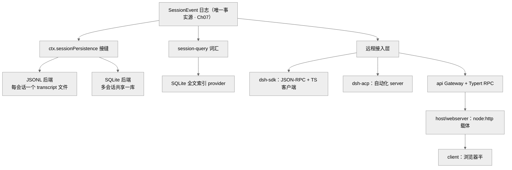
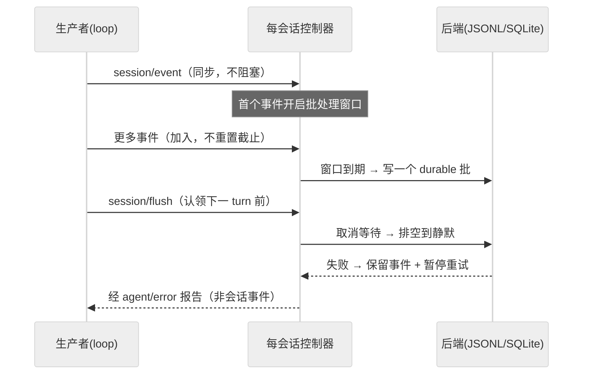
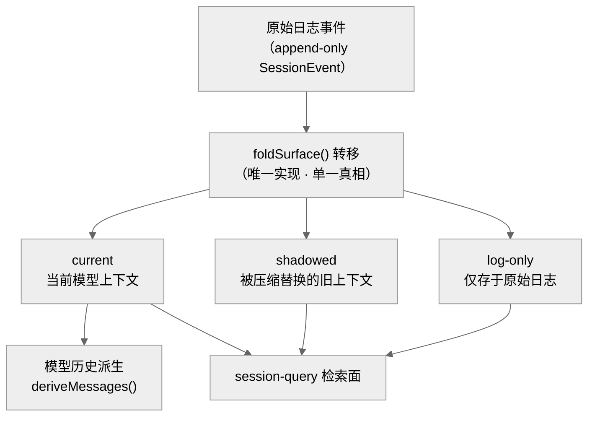
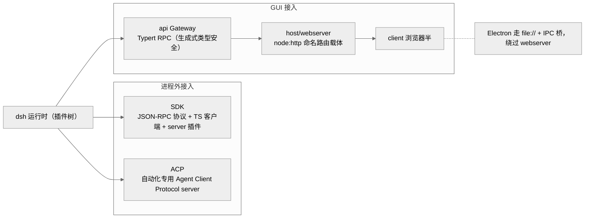

# 会话持久化、检索与远程接入

agent 干活时，所有发生过的事都先记在内存里的一本"流水账"上。可一旦进程退出，这本账就没了。本章讲 dsh 如何把这本会话日志"落到磁盘、可被查询、可被进程外调用"。读完你能回答三个问题：一条 append-only（只追加、不修改，像记账本一样一行一行往下写）的 `SessionEvent` 日志怎样安全地变持久（且崩溃后不丢一个 turn）？如何在成百上千个会话里做全文检索与血缘追踪？以及外部程序——命令行工具（CLI，command-line interface）、自动化脚本、浏览器图形界面（GUI，graphical user interface）——通过哪几条协议接进这套运行时。

这一章横跨 `session/`、`session-query/`、`sdk/`、`acp/`、`api/`、`host/`、`client/`、`typert/` 八个包组，听起来很杂，但主线只有一条：**日志是唯一事实源（见 Ch07），持久化、检索、远程接入都是它的下游派生。** 换句话说，这三件事本质上都在围着同一本账做文章——一个负责把账本安全存好、一个负责在账本里翻查、一个负责让外面的程序读这本账。我们按"持久化 → 检索 → 进程外/远程接入"三段展开，抓主干而非逐包平均用力。

## 一、本质：三段都是"日志的下游"

- **持久化（persistence，即"把数据可靠地存到磁盘上"）** 回答"日志怎样安全落盘"：一个抽象服务 `ctx.sessionPersistence` + 两个可换后端（JSONL——JSON Lines，每行一条 JSON 记录的文本格式 / SQLite——一个把整库存进单个文件的轻量数据库）。这里的"能力接缝"（capability seam）可以理解成插座标准——上游只认插座，换个灯泡（后端）不用改电路。它就是一条标准的[能力接缝](11-能力接缝架构.md)（Ch11；对应源码 ADR（Architecture Decision Record，架构决策记录）`.agents/notes/implemented/architecture/2026-06-13-capability-seams.md`），**不引入平行的持久化事件类型**——落盘的就是 `SessionEvent` 本身，没有另起炉灶造一套"专供存盘用"的事件 `[verified]`（`docs/subsystems/persistence.md`）。
- **检索（session-query）** 回答"跨会话怎么查"：一套 provider 无关（不绑定具体实现）的查询词汇 + 一个 SQLite 全文索引 provider，分成两个包 `[verified]`（`packages/session-query/session-query` 与 `…-sqlite`）。词汇和实现分开，好比"点菜的菜单"和"后厨"各管各的。
- **远程接入** 回答"进程外怎么用":SDK（Software Development Kit，软件开发工具包，走 JSON-RPC——一种用 JSON 编码请求与响应的远程过程调用协议）、ACP（Agent Client Protocol，智能体客户端协议，面向自动化）、api Gateway + Typert（浏览器 GUI 的类型安全 RPC——Remote Procedure Call，远程过程调用，即"像调本地函数一样去调另一处的代码"）。同一套运行时，对着三类不同的用户开三扇门。

> 图注：持久化 / 检索 / 远程三条线都从同一条日志派生，互不引入第二事实源——这是本章一切设计取舍的出发点。

## 二、核心问题与痛点

一个 agent harness 的长程任务里，一个 turn（模型一次完整的"你问我答"回合）可能包含几十个 step、巨量工具输出。这带来三个真问题：① **落盘不能阻塞产出**——如果每写一个事件都要等磁盘转完，agent 就会被硬盘拖着走；② **崩溃恢复不能丢一个已追加的 turn**，也不能把半截 turn 当完整数据（就像断电时正写到一半的账，不能假装它写完了）；③ **检索既要"当前模型上下文"又要"被替换的历史"**——因为压缩（Ch16）会 shadow（遮蔽，即用新内容盖住旧事件、让模型看不到）掉旧事件，检索得能区分这两者。

## 三、解决思路与关键设计

### 3.1 flush 检查点：非阻塞批量写

`session/event` 是**同步通知**，持久化插件把事件拷进"每会话控制器"就返回，不阻塞生产者 `[verified]`（`docs/subsystems/persistence.md` "The flush checkpoint"）。也就是说，生产者扔下事件转身就走，真正写盘的活交给后台。首个待写事件开启一个**固定批处理窗口**（比如"攒够这一小段时间就一起写"），后续事件加入但**不重置**其截止时间——好比公交车按点发车，中途上人不会因为多一个人就推迟发车时刻。`session/flush` 取消等待并排空到静默（把还没写的一次性写完），loop 用它作为"认领下一个普通 turn 前"的排序与错误观测检查点：开下一回合之前，先确认上一批账都记妥了、没出错。被拒的后台写会保留事件并暂停自动重试，显式 flush 立即重试并通过 `agent/error` 报告——**绝不作为已关闭 turn 之后的会话事件**（呼应 Ch07 的 model-visible⟺logged 边界：写盘失败这种事只走报错通道，不会伪装成一条模型该看到的对话记录）。

> 图注：批处理窗口把"每事件一次磁盘 IO"摊薄为"每窗口一次批写"，而 flush 给 loop 一个明确的错误观测点。

### 3.2 崩溃恢复：合成 `turn/end` 而非截断

后端重载一个崩溃于半途的日志时，会遇到有 `turn/start` 却无 `turn/end` 的孤儿 turn——账记了个开头，还没来得及写结尾，进程就挂了。它**不截断**（不把这半截直接删掉，因为那些事件已在崩溃前 durable 追加，是真实发生过的工作），而是补一个合成 `turn/end { reason: { kind: 'interrupted' } }` 收平 `[verified]`（`docs/subsystems/persistence.md`）——相当于给这段没写完的账补一句"此处中断"来对齐。妙处在于：`interrupted` 是唯一没有任何 loop 会主动发出的 `TurnEndReason`，所以只要看到它，就知道"这是恢复时补的，不是正常结束的"——这个"留白语义"让恢复态可被一眼识别，也堵死了"某下游把合成 `turn/end` 当作真实模型行为"的路。之所以选"合成收平"而非"截断到最后一个完整 turn"，第一性上是因为**已 durable 追加的事件就是事实、不该被恢复逻辑抹掉**——截断会丢弃一个可能有几十步、巨量工具输出的真实长程 turn。修复只作用于**冷会话**（已经不活跃、纯从磁盘加载的会话）；活跃 id 的 `load()` 会等到内存快照 durable 且平衡才返回，开着的活跃 turn 宁可 reject 也不接受合成边界。

### 3.3 SessionHeader：元数据走日志之外

格式版本、cwd、血缘（lineage，即一个会话是从哪个会话派生/分叉出来的）、seed 边界属于**存储关注点而非对话事件**——它们是"关于这本账的信息"，不是账里的一笔笔流水。因此不进 `SessionEventMap`、永不到达 `deriveMessages()`，而是挂在 `session.header` 上 `[verified]`（`packages/core/session/src/types.ts`），就像账本的封面标签，与内页正文分开。后端加载时若 `version` 不等于 `SESSION_FORMAT_VERSION` 直接 reject（无迁移，呼应 Ch07 版本停在 0 的无兼容承诺）——对不上版本就干脆不读，不做兼容转换。这条"元数据 vs 事件分离"是全章的隐形骨架：检索的 `SessionRecord` 正是靠 header 才能在"日志之外"描述一个会话（不必逐条重放日志，看封面标签就知道这是谁、从哪来）。

### 3.4 检索：live-preferred 语义与 surface 分类

`session-query` 的核心概念是**逻辑语料**（logical corpus，可理解为"不管数据此刻在内存还是在磁盘，对查询者都呈现为同一份可查的内容"）:优先读活跃内存态、回落到持久态——手边有热的就用热的，没有再翻磁盘。`SessionRecord` 用两个独立布尔 `live`/`persisted` 暴露来源可用性 `[verified]`（`docs/subsystems/session-query.md`），明确告诉你"这份记录是活的、还是已存盘的、还是两者都是"。关键的是 `SessionEventSurface` 三态——`current`（当前模型上下文，模型此刻真正看得到的）/ `shadowed`（被替换的上下文，被压缩盖住、模型已看不到的旧料）/ `log-only`（仅在原始日志，从没进过模型视野的）。分类用与模型历史派生**同一套 `foldSurface()` 转移**：检索和"喂给模型的历史"共用一把尺子，所以"检索看到的当前面"和"模型真正看到的"永远对得上，不会各算各的。全文检索由 SQLite provider 拥有具体索引生命周期，而查询词汇（精确读、来源优先级、关系追踪、语义过滤）在 provider 无关的 Definition 包里——又一次"菜单和后厨分家"的三角色接缝。

> 图注：检索与模型历史派生共用同一 `foldSurface()`——模型只喂 `current`，检索三态全见；两者共享一套转移，才保证"检索看到的当前面"与"模型真正看到的"永不漂移。

## 四、远程接入：三条协议，一个运行时

> 图注：同一个运行时对外暴露三类接入面；GUI 面又拆成"类型安全 RPC（Typert）→ HTTP 载体（webserver）→ 浏览器（client）"三层，各层互不知道对方的 harness 概念。

- **SDK**：进程外运行时 SDK——JSON-RPC 协议 + TypeScript 客户端 + server 插件，是"把 dsh 当库/服务嵌入"的标准通道。想在自己的程序里调 dsh，走这扇门。
- **ACP**：automation-only（只给自动化用）的 Agent Client Protocol server，`demo:acp` 通过它把新会话暴露到 JSON-RPC stdio，供自动化脚本驱动（keyless snapshot 测试也走它）。

> **rc.6–rc.7 更新（截至 2026-08-17）**：富内容桥并入 master，新增**有序图像批次准入**（图像作为可持久化附件按序进入会话，`feat(attachment)`，commit `219d2a1fb9`、`docs/subsystems/attachment.md`）与 **ACP 图像桥**（让"仅自动化"的 ACP 也能收发持久化图像提示与回复，`feat(acp): bridge durable image prompts and replies`，commit `4f87c1fe6d`，作者 Tianyi Cui）`[verified]`。承载它的 `packages/attachment` 附件接缝在 rc.5 已存在，此处增量是把图像打通到"提示/回复"与 ACP 两条链路——这也给 Ch18"MCP 把非文本内容降级为占位符"的局限提供了对照：图像在 dsh 内部本有一条经附件子系统的一等通路。详见 [Appendix/更新追踪](../Appendix/更新追踪.md)。
- **api Gateway + Typert**：GUI 的类型安全 RPC。这里要解决的痛点是：浏览器和后端之间隔着一根"网线"，Host 里的对象没法原样传过去。业务对象包通过**声明合并**（TypeScript 里往同名接口上不断"加字段"的机制）扩展两张空 map（`TypertLookupMap` / `TypertContextMap`），生成式 descriptor 把 Host 对象参数替换成 wire 身份（在网线上传的是一个"身份编号"，而非对象本体）；请求只送 endpoint + 具名 args，取消信号走带外通道、**永不进 args**——取消是"另走一根线喊停"，不混进正常参数里 `[verified]`（`docs/subsystems/typert.md`）。之所以用生成式 RPC 而非手写 REST、也不把 SDK 那套通用 JSON-RPC 直接暴露给浏览器，根因是让"Host 类型 ↔ wire 类型"在编译期就钉死——GUI 是长期演进面、类型漂移成本高，这与全仓"maximum-strict TypeScript + 生成式门禁"的一致工程审美吻合（架构决策见 `2026-08-02-typert-remote-method-calls.md`）。
- **host/webserver**：一个 `node:http` 插件，提供 `ctx.webServer` + 命名路由注册 + 一个可被认领的 fallback。它**不是 agent loop 的一部分、不是能力接缝**、不懂任何 harness 概念——它只是个"送水管道"，只管收发 HTTP，不知道自己送的是不是 agent 的数据。`/api` 桥、插件 bundle、HMR（Hot Module Replacement，热模块替换）事件流都由别的插件注册路由 `[verified]`（`docs/subsystems/web-server.md`）。`host` 只接受 `127.0.0.1`（默认，只有本机能连）与 `0.0.0.0`（有意暴露，全网可连），**无 TLS（Transport Layer Security，传输层加密）/auth/origin 策略**——不自带加密、登录、来源校验，见维度七与 Ch13 的安全边界诚实声明。

## 五、易错点与注意事项

- **`SessionLocation` 是位置提示、不是授权**:`locate()` 同步返回后端 artifact 路径（JSONL 给绝对 transcript 路径；SQLite 返回 `undefined`，因为多会话共用一个库、没有"单文件"可指）。这个路径可能指向尚未落盘、或缺当前未 flush turn 的文件 `[verified]`——它只是告诉你"东西大概在这"，不保证已经写好了。切勿把它当鉴权 token 或新鲜度保证。
- **批处理上界只约束"有意批处理等待"**，不约束事件循环调度或后端 durability 延迟——它管的只是"故意攒一攒再写"的那段等待，不含系统调度和磁盘本身的耗时。误把它当"最坏落盘延迟"就会低估真实延迟。
- **非 loopback bind = 网络暴露**（loopback 即回环地址、只有本机 `127.0.0.1` 能连）：`0.0.0.0` 无任何鉴权，等于把会话数据（含 `session.list` 的全量 transcript）暴露给该网络——相当于把门大敞着，谁在同一网段都能进来翻账（postmortem 0003 即此类问题的近邻）。

## 六、竞品/横向对比

与 Claude Code / Codex 常见的"一个 CLI + 一套私有协议"不同，dsh 刻意把接入面拆成 SDK/ACP/GUI 三条独立协议、且都从同一日志派生——三个独立包组各带自己的 Definition，让自动化（ACP）、嵌入（SDK）、人机（GUI）各走最合身的协议，代价是三套协议表面积。这一判断在 dsh 侧 `[verified]`（三独立包组可查），而竞品"到底怎么做"多为 `[claimed]`（HN 口径，见全网调研）。需留意的是，三条协议是否都已"生产就绪"证据不足，ACP 本身也明确标注 automation-only。

## 七、仍存在的问题与局限

- **无内置鉴权/TLS**：GUI 载体把安全边界完全外推给部署者（默认只绑 loopback，即只有本机能连），这是有意的最小内核姿态——安全的活留给部署方去做，框架自己不越俎代庖，但也意味着"开箱即用的远程多用户"不在当前范围 `[verified]`（`docs/subsystems/web-server.md`：no TLS, auth, or origin policy）。
- **SQLite 全文检索**能撑到多大规模、以及跨后端（JSONL↔SQLite）之间怎么迁移，文档未展开，属 `[inferred]` 的开放问题。
- **持久化版本无迁移**（`SESSION_FORMAT_VERSION` 停在 0）：预览期"foundation over blast radius"立场下的有意取舍，正式发布后需补迁移策略（呼应 Ch01 / Ch07）。

## 小结与衔接

回到开头那本"流水账"：持久化把它安全落盘（非阻塞批写 + 崩溃合成收平 + 元数据分离），检索在其上建立 live-preferred（优先取活跃态）的跨会话查询与 surface 分类，远程层则用 SDK/ACP/Typert 三条协议把同一运行时暴露给自动化、嵌入与浏览器。**三段共享"日志是唯一事实源"这一前提**——这正是 Ch07 事件溯源的红利兑现处：因为只有一本账，存、查、对外开放三件事才不会各自造出一份可能对不上的数据。下一章（Ch18）转向更放得开的一面：让 agent 通过 MCP/Hooks 与外部互操作，并通过 extensions **修改自己的运行时**——那是本框架"Spatiotemporal Composability"（Ch03）的进一步演绎。

## 源码索引

- `docs/subsystems/persistence.md` — flush 检查点、崩溃恢复、`SessionLocation`、`SessionHeader`
- `docs/subsystems/session-query.md` — 逻辑语料、`SessionEventSurface` 三态、`foldSurface()`、SQLite 全文索引
- `docs/subsystems/web-server.md` — `ctx.webServer`、命名路由、`host` 仅 `127.0.0.1`/`0.0.0.0`、无 TLS/auth
- `docs/subsystems/typert.md` — `TypertLookupMap`/`TypertContextMap` 声明合并、InvocationDescriptor、带外取消
- `packages/core/session/src/types.ts` — `SessionHeader`、`SESSION_FORMAT_VERSION`
- ADR：`2026-06-14-session-persistence.md`、`2026-08-05-session-preparation.md`、`2026-08-08-bounded-session-persistence-write-batching.md`、`2026-07-19-gui-layering-and-rpc-protocol.md`、`2026-08-02-typert-remote-method-calls.md`
