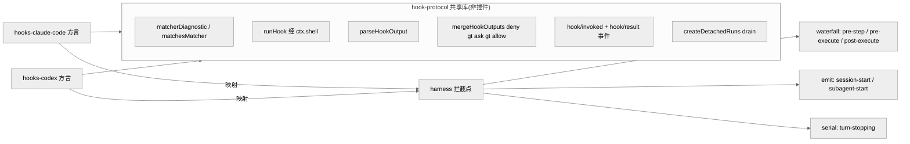
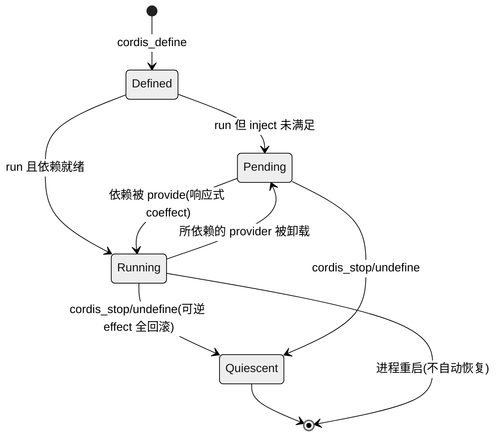

# 第 18 章 · 互操作与自我修改

> 本章讲三件事:dsh 如何**当别人的客户端**(MCP,即 Model Context Protocol 模型上下文协议;dsh 用 MCP client 挂载外部工具)、如何**兼容别人的扩展协议**(Claude Code / Codex 的 hook 桥),以及最激进的一步——如何让 agent **检视并改写自己正在运行的插件运行时**(extensions / `demo:cordis`)。读完你能回答:一个"一切皆插件"的 harness,把插件系统的钥匙交到模型手里时,它用哪些不变量守住正确性,以及这一步为什么正是第 3 章"Spatiotemporal Composability"最直接的体现。

前面若干章把 dsh 拆成一棵 Cordis 插件树:agent loop、工具注册表、会话日志、模型适配器全是可替换插件(Ch05–Ch11)。所谓"插件树",就是把整个 harness 想象成一棵由许多可插拔零件搭起来的树,每个零件既可以单独换掉,也能挂上新的分支。本章处理这棵树的**边界与自反**(自反 = 系统能把自己当成操作对象)——树如何伸到进程之外去消费第三方生态,如何把外部世界的扩展协议翻译进自己的类型化扩展点,以及树如何长出一根指向自己的手指。三条接缝在源码里分属三个包组:`packages/mcp`、`packages/hooks`、`packages/extensions`(`self-modification` 是 AGENTS.md 包布局里对它的旧称,至今仍列在那份布局里,而实际的包目录名已是 `extensions`)`[verified]`(`CLAUDE.md` 包布局仍写 `self-modification/` + `packages/extensions/README.md:1` 标题即"the agent modifies its own runtime")。

> 图注:三条接缝共享同一个落点——`ctx.tools` 与 Cordis 扩展点。MCP 把外部 server 的工具注册成本地工具;hook 桥把外部 shell 协议翻译到类型化拦截点;extensions 让模型直接在运行时内 define/run/stop 动态包。它们都不是特权内核,而是普通插件。

## 一、本质:三种"接缝"而非三个功能

先说"接缝(seam)"是什么:它指两个系统相接的那条缝——一边是 dsh 自己,一边是外部世界,缝上定义好"谁负责什么、以什么形状交接"。就像插座标准:换灯泡不用改电路,因为灯泡和电路之间有一条约定好的接缝。放到 agent harness 语境,MCP、hooks、extensions 这三者本质不是三个孤立功能,而是三条朝着不同方向的接缝。

- **MCP client 是"出向消费"**:dsh 作为客户端接入 [Model Context Protocol](https://modelcontextprotocol.io/)(MCP,一套让 AI 应用统一接入外部工具/数据源的开放协议)生态,把外部 server 提供的工具**注册成模型的原生工具**,命名为 `mcp__<serverName>__<rawName>`,和 Claude Code / Codex 用的是同一套服务器限定命名`[verified]`(`packages/mcp/mcp-client/README.md:5`, `src/tools.ts:97`)。方向是"往外伸出去用别人的东西"。
- **hooks 桥是"入向兼容"**:hook 是"在某个事件点插进去跑一段自己脚本"的机制。这条接缝让用户把已有的 Claude Code `hooks.json` 或 Codex hook 配置直接指过来,那些外部 shell hook 会**忠实地跑在 dsh 自己的拦截点上**`[verified]`(`packages/hooks/README.md:5`)。方向是"把外面写好的扩展搬进来直接用"。
- **extensions 是"自反"**:模型可以枚举、检视自己所处的那个 Cordis 运行时里的插件与 service API,还能**定义并运行**新的动态包、再把它**撤回**`[verified]`(`packages/extensions/README.md:5`)。方向是"手指指向自己"——agent 修改自己脚下的地板。

三者的共同点是它们都**不新增特权**:MCP 工具走的是同一个 `ctx.tools.register()`,hook 桥落在和"原生 hook"完全相同的扩展点上,mount 出来的临时插件用的是普通 Cordis fiber 生命周期。换句话说,没有哪一条为了"接外部"或"改自己"而在引擎里私开一道后门。这与总纲"没有特权内核"的架构命题一致——连"接入外部生态"和"改自己"都是插件。

## 二、核心问题:忠实、可回滚、可检视

三条接缝各自要解决的难题不同,但都能归到同一组约束下。

**MCP 要解决的是"如何把一个会掉线、会变更工具列表的远程 server,变成一个行为像本地工具一样可靠的东西"**。远程 server 就像一个不太稳定的外卖窗口:可能临时关门(掉线)、也可能换菜单(工具列表变更)。它必须处理命名冲突、断线重连、工具列表热更新(不重启就更新)、以及"公开名"与"线上原始名"的双名映射——发到 server 的永远是 raw name(server 认得的原名),注册到 `ctx.tools` 的是限定名(本地用来区分不同 server 的加前缀名)`[verified]`(`README.md:66`)。

**hook 桥要解决的是"如何在不背叛外部协议语义的前提下,把 shell 世界的退出码/stdout 契约翻译成类型化 Decision"**。shell 脚本表达"同意还是拒绝"靠的是老一套:进程退出码、往 stdout 打印的内容;而 dsh 内部想要的是一个有类型、能被代码安全消费的 Decision 对象。桥要做的就是这层翻译。Claude Code 有 30 个 hook 事件、Codex 有 10 个,dsh 只桥接其中的子集(CC——即 Claude Code——支持 7 个,Codex 支持 5 个),且每个都是"partial"(部分支持)——README 逐字段列出了哪些字段被消费、哪些被解析后跳过`[verified]`(`hooks-claude-code/README.md:89`, `hooks-codex/README.md:93`)。

**extensions 要解决的是三个同时出现的正确性问题**,这也是自指工具集 Agent Note 的核心论点。可以理解成:让模型自己写代码往运行时里塞东西,风险有三处必须堵住。其一,模型写的注册代码必须**在注册处**就校验(坏 schema 要在注册时立刻失败,而不是拖到后面组装 prompt 时才炸——早报错比晚报错好排查);其二,模型写的代码要调用一批它从未见过源码的 service API(application programming interface,应用程序接口;如果只能靠猜函数签名,就会白白浪费大量试错步数);其三,模型 mount(挂载)进去的一切**必须完全可弃置**,既由模型主动卸载,也由普通插件生命周期在宿主重载时兜底,否则一场长会话下来会堆积一堆没人清理的"孤儿监听器"`[verified]`(`2026-07-08-self-referential-cordis-toolset.md:9-11`)。

## 三、解决思路

### 3.1 MCP:一个 server 一个插件实例

MCP client 的设计选择是**每个 server 一个 `cordis.yml` 插件实例**——想接几个外部 server,就在配置里写几条,各自独立。每条配置给出 `serverName`、transport(通信方式,`stdio` 走标准输入输出、`streamable-http` 走 HTTP)、连接参数`[verified]`(`README.md:9-30`)。工具的公开名是 `(serverName, rawName)` 的纯函数(输入相同则输出一定相同):当归一化(限制成 64 字符、只允许 `[A-Za-z0-9_-]`)发生了替换或截断时,追加一个 `(serverName, rawName)` 的 12 位十六进制哈希做后缀,保证两个本来不同的工具永不塌缩成同一个名字`[verified]`(`README.md:55`)。之所以选"服务器限定命名 + 确定性哈希",而非全局单调计数器或让人手工消歧,根因是 KV cache(key-value cache,键值缓存)前缀稳定性(Ch07/Ch10):工具名必须是输入的纯函数,才能让重连恢复出**逐字节相同**的定义、不触发缓存失效;哈希后缀只在归一化真正改名时才付出,是最小代价的确定性消歧`[verified]`(KV 效果见 `README.md:91-93`)。

断线重连用的是**按 outage(一次断线周期)预算**的指数退避:重试间隔从 `initialDelayMs` 起、每次翻倍直到 `maxDelayMs` 封顶,连续失败 `maxAttempts` 次后就放弃,等下一次 HMR(Hot Module Replacement,热模块替换)再说;而一个已经存活超过 `maxDelayMs` 的连接会重置这份预算。这样一来,偶尔抽风的 server 能被无限次救回,而陷入崩溃循环、根本连不上的 server 则会很快耗尽上限、不再空转重试`[verified]`(`README.md:70`)。

### 3.2 hooks:一个共享库 + 两个方言桥

hook 桥的关键设计是**把两个协议里真正相同的那部分抽成一个"不是插件"的库**。CC 和 Codex 的 hook 长得不一样,但很多底层动作(怎么匹配规则、怎么跑脚本、怎么解读结果)其实一模一样——与其在两个桥里各写一遍,不如抽出来共用。`hook-protocol` 明确写着自己"NOT a cordis plugin——它不注册、不注入任何东西",只是两个桥都 import 的方言中立原语库(方言中立 = 不偏向 CC 也不偏向 Codex 的通用零件)`[verified]`(`hook-protocol/README.md:5`)。共享的是:matcher 校验与匹配(`matcherDiagnostic` / `matchesMatcher`,`claude` 模式支持字面量快路径、`codex` 模式恒为无锚正则)、hook 执行(`runHook` 经 `ctx.shell` 喂 stdin + env 并解码)、输出解码(`parseHookOutput`,退出码 2 = 阻塞)、N 个 hook 结果的最严合并(`mergeHookOutputs`,谁最严听谁的,`deny > ask > allow`)、持久记录(`hook/invoked` / `hook/result` 会话事件)、以及**分离运行的静默化**(`createDetachedRuns`,`drain()` 先 abort 再 await,把还在后台跑的 hook 干净地收尾)`[verified]`(`hook-protocol/README.md:11-26`, `src/runner.ts:20`, `src/merge.ts:62`, `src/detached.ts:43`)。

共享库之外,各桥只保留自己那份方言差异:CC 桥拥有 CC 形状的 stdin payload、`${CLAUDE_PLUGIN_ROOT}` / `${CLAUDE_PROJECT_DIR}` 变量替换、以及从中立结果到类型化 Decision 的映射;Codex 桥拥有 snake_case payload、`turn_id`/`model` 附加字段、不注入 env、matcher 恒为正则`[verified]`(`hooks-claude-code/README.md:5`, `hooks-codex/README.md:5-13`)。相同的抽走共用、不同的各自持有,这正是"共享库 + 两个方言桥"这个结构的意义所在。这里要点明一个取向:hook 在 dsh 里**只是兼容路径**、而非被抬成一等扩展机制——两个桥的 README 都直言"native cordis plugin could do everything this bridge does, more powerfully",原生 hook 本就是普通 Cordis 插件,桥只承担把被映射的命令 hook 子集一次性迁移进来的成本,这与"新行为走文档化扩展点、不改 agent-loop"的铁律一致`[verified]`(`hooks-claude-code/README.md:7`)。

> 图注:共享库拥有"协议里逐字相同的一半",两个方言桥各拥有"不同的一半",最终都落到 harness 已有的类型化拦截点(waterfall / emit / serial 三种 dispatch 模式对应 Ch05)。这证明 hook 桥不是新扩展机制,而是**外部协议到既有扩展点的翻译层**。

### 3.3 extensions:inspect / define / run / stop 工具组

自我修改的落点是 `@deepseek-ai/dsh-tool-cordis`,它在 `ctx.tools` 上给模型注册一组工具,分别对应"看、定义、运行、停、注销":只读的 `cordis_inspect_*`(看看现在运行时里有哪些 service、插件、工具,以及自动生成的 API/事件目录)、`cordis_define`(先把一个动态包记下来——校验宿主半/浏览器半两半代码的语法但**什么都不跑**,并 mint 一个进程内 id 作为凭据:插件 id 形如 `<语义前缀>-<n>`、包 id 形如 `pkg-<n>`)、`cordis_run`(这时才真正在 `node:vm` 沙箱里把宿主半当代码求值、挂到内部 `cordis-dynamic` 组下跑起来)、`cordis_stop`(卸下这一次运行、把宿主半 fiber 销毁到静默,但定义还留着、可以再跑)、`cordis_undefine`(连定义一起忘掉)`[verified]`(工具名见 `tool-cordis/src/index.ts:42-352`、id 生成见 `cordis-host-runner/src/registry.ts:154-166`)。需要点明的是:这套"定义与运行分离"的思路最早出自设计草案(`2026-07-08-self-referential-cordis-toolset.md:15-26`),草案里这些工具还叫 `cordis_mount`/`cordis_unmount`、id 记作 `dyn-N`;落地后的运行时已改用上面这套 `define`/`run`/`stop`/`undefine` 命名与 `<前缀>-<n>`/`pkg-<n>` 的 id,本节以运行时源码为准。`node:vm` 沙箱可理解成一个隔离的执行小屋,模型写的代码在里面跑,不能随便碰到外面全局环境。`demo:cordis` 就是"the agent modifies its own runtime"(agent 修改自己运行时)的可运行示例`[verified]`(`CLAUDE.md` Commands 节)。

针对前面那三个正确性问题,分别有三处对应的控制:**其一**(对应"注册处校验"),`harness.defineTool` 在宿主 realm(即 dsh 自己这一侧的执行环境,与沙箱相对)重建输出 schema/projector,把 body 值快照成宿主拥有的 JSON,让注册表在被观察之前就先执行一遍规范化的工具输出契约——坏东西在门口就被挡下;**其二**(对应"别让模型猜签名"),`cordis_inspect_*` 从一份**自动生成的 API 目录**(`api-catalog.ts`)里供给 service 签名与事件,并由 `verify-cordis-api` 门禁保证这份目录与源码 JSDoc 不漂移,于是模型写代码前能查到真实签名而不是盲猜;**其三**(对应"必须完全可弃置"),每个动态包都是内部 `cordis-dynamic` 组下的一个子 fiber(fiber 可理解为一条带完整生命周期、能被整体丢弃的执行线),普通 fiber 的"弃置"动作就顺带处理了工具集重载与卸载,`cordis_stop`/`cordis_undefine` 会一直 await 到该 fiber 彻底 disposal(销毁)`[verified]`(`2026-07-08-self-referential-cordis-toolset.md:35, 41, 50-53`)。

## 四、实现细节:host/client 双半与 request-run 往返

extensions 里最精巧的部分是**带浏览器半的动态包**。这里"一个包分两半"是核心:一半跑在宿主(Node 进程)里,另一半(如果有)得跑在浏览器页面里。`cordis-host-runner` 把生命周期切成两相:`define` 阶段只做登记(预编译两半的语法但不真正运行,mint 出一个 `dyn-<n>` id,整个过程无副作用、可回滚,所以一段无法解析的代码在它拿到 id 之前就已被拒);而所有带副作用的动作都挂在后面的 `run` 阶段`[verified]`(`cordis-host-runner/README.md:9-11`, `src/index.ts:124`)。这种"先记账、后动手"的拆分,让"造出一个 id"和"真正执行"分开,回滚就变得干净。

一个只有宿主半的包,在本进程内直接求值、拿到结果就返回;而一个**带浏览器半**的包必须由某个页面来执行,于是 `run` 变成一次需要对方应答的往返:emit 出 `cordis/request-run`,然后挂起等待,由某人点"允许/拒绝"来 settle(敲定)。它**故意不设计时器**——除了等应答,唯一的另一条出路是调用者的 `AbortSignal`(也就是"提问的那一回合被取消了")。因此在没有页面连接的部署里(headless 无界面 / ACP,即 Agent Client Protocol 智能体客户端协议),这个请求会像任何没人应答的请求一样一直挂着,最终以 `cancelled` 收场`[verified]`(`cordis-host-runner/README.md:12`, `src/types.ts:367`)。

> 图注:宿主半失败会在浏览器动作前短路;代码**从不随广播下发**,`getClientCode` 是它到达浏览器的唯一路径;首个应答获胜,晚到或未知 requestId 被接受并忽略。这条往返把"运行一段模型写的 UI 代码"变成了一次显式的人类授权闸。

这套运行状态对外暴露的窗口是几个转发事件,其中和运行状态相关的四个是:`cordis/request-run`、`cordis/request-run-resolved`、`cordis/dynamic-package`、`cordis/dynamic-retract`——后两者是一对对称广播,一个宣布"起来了"、一个宣布"停了",无论这个包有没有浏览器半都照发`[verified]`(事件声明以 `src/types.ts:367-397` 为准;`cordis-host-runner/README.md:24` 里仍写作旧名 `dynamicCordisRunner/package`/`retract`,源码已改为 `cordis/dynamic-*`)。注册表是**放在进程内存里的,而且是唯一真相源**:会话日志只记录 define 调用的元数据、从不记录代码本身,所以进程一旦重启,里面就名正言顺地没有任何定义了——这时一张 id 已经失效的卡片会老实说明"我跑不了"、而不是假装还能运行`[verified]`(`cordis-host-runner/README.md:26-28`)。

## 五、与 Ch03 的呼应:自我修改是Spatiotemporal Composability最直接的体现

第 3 章讲 Cordis 的两个可组合性:**时间可组合性**——组件卸载时能完全回滚它造成的副作用(Revertible Effects 可逆副作用,`ctx.effect()`/`ctx.on()` 每次都返回一个 disposer,即"撤销句柄",调它就能把这次操作原样撤掉);**空间可组合性**——组件之间的依赖用响应式方式声明(Reactive Coeffects 响应式协变输入,当 ctx 里出现了匹配 spec 的东西时,自动通知组件)`[verified]`(《全网调研》B 节,已核实论文摘要)。可以粗略地记成:时间维管"退得干净",空间维管"接得自动"。extensions 把这两条推到很尽:模型定义并运行的动态包同样遵循"registrations are effects"(注册即副作用)的规则,`cordis_stop`/`cordis_undefine` 必须一直 await 到工具/监听器/service/timer/effect 全部**静默**下来才返回——这正是可逆 effect 在运行时被模型亲手触发的样子`[verified]`(`2026-07-08-self-referential-cordis-toolset.md:25`)。

空间维的表现同样直接,举个具体例子:mount A 里调 `ctx.provide('foo', value)`(提供一个叫 `foo` 的 service),mount B 里声明 `inject: ['foo']`(声明我依赖 `foo`),那么 B 会在 `foo` 出现的**那一刻**才激活;要是反过来先挂 B,它就停在 pending(挂起)状态并如实报出"缺 `foo` 这个 service";这时卸载 A,B 又被打回 pending(它的注册被反向解绕),而当你再次 provide `foo`,B 的 `apply` 会经过一个全新的沙箱 façade(外观层)重新跑一遍`[verified]`(`2026-07-08-self-referential-cordis-toolset.md:46-47`)。换言之,模型 mount 出来的东西和框架自带的插件**遵守同一套演算**——这正是"自我修改"能做到安全的根因:它不是在引擎里凿洞,而是把引擎本来就有的可逆/响应式语义直接暴露给模型用。这也和 HMR 同源:MCP client 那句"编辑 `cordis.yml` 条目就触发 disconnect+reconnect、无需重启进程"用的正是同一套热更新机制`[verified]`(`mcp-client/README.md:32`)。

> 图注:临时插件的状态机就是 Cordis 组件演算的一个实例——Pending↔Running 由响应式 coeffect 驱动,Running→Quiescent 由可逆 effect 保证完全回滚。它证明自我修改没有绕开Spatiotemporal Composability,而是它的直接应用。

## 六、易错点与门禁

- **waterfall 短路**:waterfall 是一种"一环接一环、每环调 `next()` 传给下一环"的处理链(对应 Ch05)。mount 的监听器若落在 `tools/pre-execute` 这类 waterfall 点上却忘了调 `next()`,整条链就会在这里断掉——**这意味着 mounted 代码有能力停掉 agent 自己的工具分发**`[verified]`(`2026-07-08-...toolset.md:84`)。
- **turn 内死锁**:mount 代码是跑在当前回合的某一次工具调用里的,如果它去 await 一个只有等到回合结束后才会 resolve 的东西,就会互相等成死锁;而 `vmTimeoutMs` 只能约束**同步**求值的时长,拦不住这种异步等待`[verified]`(同上, `cordis-host-runner/README.md:68`)。
- **不跨会话恢复**:临时插件只在进程内存,会话 resume 重建对话历史但绝不重建它们`[verified]`(`2026-07-08-...toolset.md:59`)。
- **hook 配置是进程级**:`configPath` 在 load 时按进程启动 cwd(当前工作目录)解析,还没有 per-session(按会话)的发现机制(`TODO(per-session-hook-config)`);而读取/解析失败会被**收敛**处理——包只是 warn 一下、注册一个空配置,而不会把整个 boot(启动)拖垮`[verified]`(`hooks-claude-code/README.md:31`)。
- **MCP 只桥接工具**:MCP 协议除了工具还有 Resources 与 Prompts,但这两者在 dsh 里暂时没有消费者、已 deferred(延后);非文本内容块(图像/音频/资源)进到模型上下文时会降级成一个占位符`[verified]`(`mcp-client/README.md:111-114`)。
- **沙箱不是安全边界**:vm 确实隔离了全局环境,但通过 façade 暴露给模型的 `ctx.shell`/`ctx.fs`/`ctx.web` 能实打实地碰到真实运行时——也就是说,一旦模型能 mount 代码,它的信任等级就等同于能跑 bash。host-runner README 与 Agent Note 都白纸黑字写着它"is not a security boundary"(不是安全边界),所以这套能力只应作为 opt-in 的开发工具开启`[verified]`(`cordis-host-runner/README.md:31`, `2026-07-08-...toolset.md:17`)。

## 七、竞品对比与仍存局限

把"让 agent 改写自己运行时"放进竞品坐标看,它更像 dsh 相对 Claude Code / Codex 的一项差异化能力——把"一切皆插件"贯彻到模型可自反修改运行时,mount 物还与框架插件同演算、可检视可回滚。但措辞需克制:源码能证明的是**机制存在且与Spatiotemporal Composability同源**(机制 `[verified]`,`packages/extensions/README.md`、`cordis-host-runner/README.md`),而"是否更优"社区评价多为 `[claimed]`/`[inferred]`(《全网调研-社区认知地图》D/F 节)、无一手定论,也无法证明它在真实任务上净收益为正——这也是它至今停留在 opt-in 开发工具、而非进默认的原因之一。

已知局限还包括:hook 桥的每个事件都是 partial(部分支持),不少字段(`updatedInput`、`systemMessage`、`{"continue": false}`、并发去重)会被解析但不真正执行,而且都挂着 `TODO` 标记`[verified]`(`hooks-claude-code/README.md:87-97`);带浏览器半的动态包在无页面的部署下会一直挂起到回合取消、没有超时,因此 unattended(无人值守)自动化用不了它`[verified]`(`cordis-host-runner/README.md:66-67`);MCP 的启动超时继承自其官方 SDK(Software Development Kit,软件开发工具包)的 60s 默认值,dsh 还没有单独暴露连接/发现超时`[verified]`(`mcp-client/README.md:112`)。值得留意的是,这些都是被明确写下来、主动延后的 deferred,而不是藏起来的缺陷——与总纲"少即是多、先把正确的地基立稳"的取向一致。

## 小结与衔接

本章的三条接缝——MCP client(出向消费)、hooks 桥(入向兼容)、extensions(自反)——共同印证了总纲的架构命题:即便是"接入外部生态"和"改写自身运行时"这样看似需要特权的能力,在 dsh 里也只是普通 Cordis 插件,落在同一个 `ctx.tools` 与同一套扩展点上。而 extensions 之所以能把插件系统的钥匙安全地交给模型,根因在第 3 章的Spatiotemporal Composability:动态包与框架插件共享可逆 effect 与响应式 coeffect,`cordis_stop`/`cordis_undefine` 的静默契约就是可逆性在运行时被模型触发的直接体现。至此 Part II 的源码剖析收束——从回合流、会话、提示词、工具、模型、能力接缝,一路走到远程与自我修改。接下来 Part III 将跳出源码:Ch19 把 dsh 放回竞品生态中定位,Ch20 从元层面看这份"由 agent 大规模并行编写"的代码库背后的工程纪律与公司理念。

## 源码索引

- `packages/extensions/README.md:1-13` — 自我修改子系统四包与角色
- `packages/extensions/tool-cordis/src/index.ts:42-352` — `cordis_inspect_list`/`_query`/`_self`、`cordis_define`/`run`/`stop`/`undefine` 七个模型可见工具的注册
- `packages/extensions/cordis-host-runner/src/registry.ts:154-166` — 插件 id `<语义前缀>-<n>`、包 id `pkg-<n>` 的生成
- `packages/extensions/cordis-host-runner/src/index.ts:124` — `DynamicCordisRunnerService`(define/run/runHostHalf/getClientCode/resolveRequestRun/stop/inventory/snapshot/invoke)
- `packages/extensions/cordis-host-runner/src/inspect-registry.ts:46` — `CordisInspectRegistryService`
- `packages/extensions/cordis-host-runner/src/types.ts:367-397` — `cordis/request-run`、`request-run-resolved`、`dynamic-package`、`dynamic-retract` 等转发事件
- `packages/extensions/cordis-host-runner/README.md:9-31` — define/run 两相、request-run 往返、存储与信任立场
- `.agents/notes/implemented/feature/2026-07-08-self-referential-cordis-toolset.md:9-84` — 三个正确性问题、工具契约(草案期命名 mount/unmount、id 记作 dyn-N,落地后改为 define/run/stop/undefine)、沙箱语义、跨包组合、alternatives、consequences
- `packages/hooks/README.md:5-13` — 桥的定位与三包分工
- `packages/hooks/hook-protocol/README.md:5-30` — 共享库原语(matcher/runHook/parseHookOutput/mergeHookOutputs/createDetachedRuns)与 `hook/*` 事件
- `packages/hooks/hook-protocol/src/runner.ts:20`(`DEFAULT_HOOK_TIMEOUT_MS`)、`merge.ts:62`、`detached.ts:43`
- `packages/hooks/hooks-claude-code/README.md:5-97` — CC 方言映射、7 个支持点、partial 字段清单
- `packages/hooks/hooks-codex/README.md:5-100` — Codex 方言映射、5 个支持点
- `packages/mcp/mcp-client/README.md:5-115` — 命名、config、断线重连预算、Model Experience、deferred
- `packages/mcp/mcp-client/src/tools.ts:86-165` — 公开名/哈希后缀/命名冲突回滚
- `CLAUDE.md`(仓库根) — 包布局、`demo:cordis` 命令、"registrations are effects"、"model-visible ⟺ logged" 铁律
- 《全网调研-社区认知地图》B/D/F 节 — Spatiotemporal Composability论文映射、争议矩阵、盲区(均标注证据等级)
