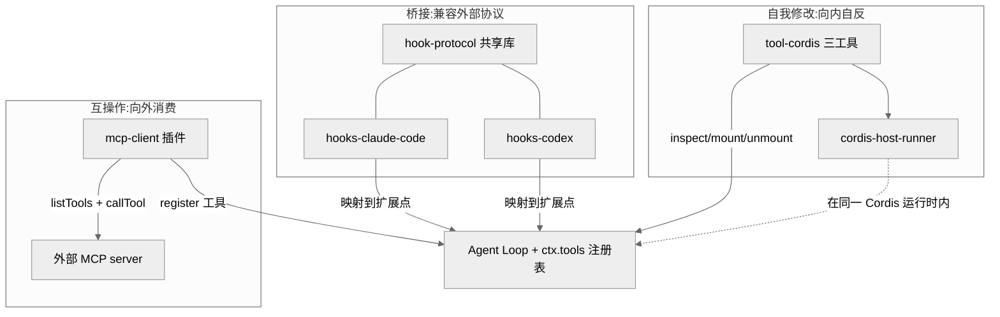
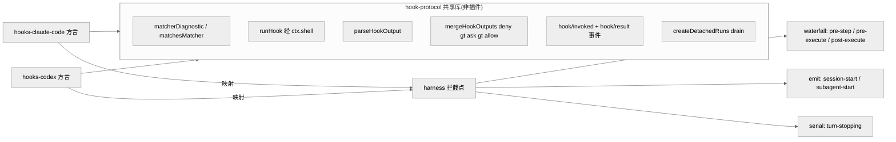
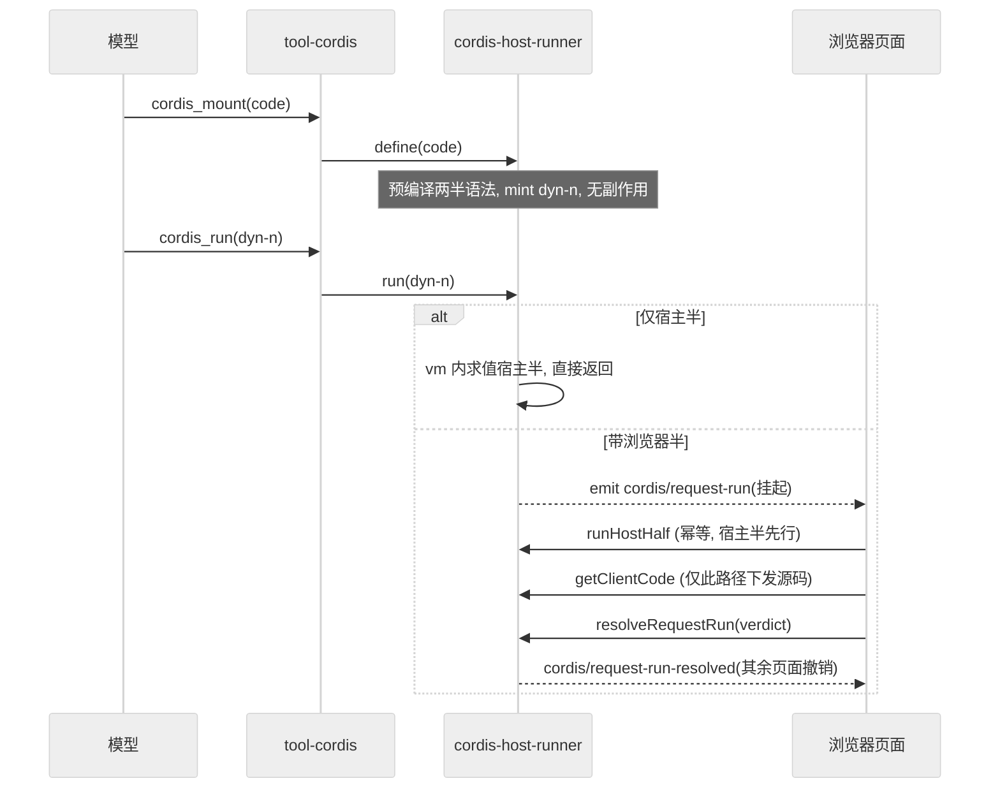
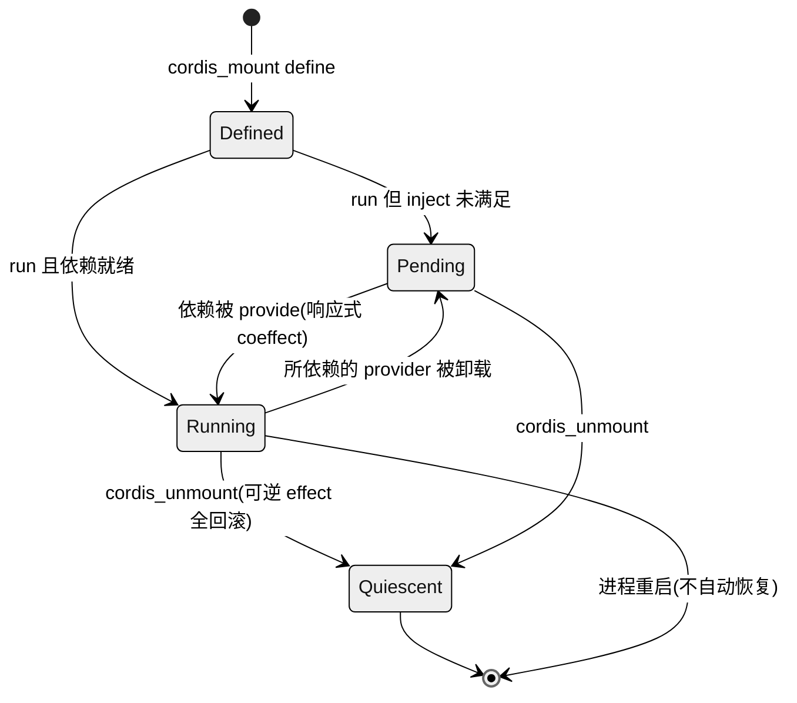

# 第 18 章 · 互操作与自我修改

> 本章讲三件事:dsh 如何**当别人的客户端**(MCP client 挂载外部工具)、如何**兼容别人的扩展协议**(Claude Code / Codex 的 hook 桥),以及最激进的一步——如何让 agent **检视并改写自己正在运行的插件运行时**(extensions / `demo:cordis`)。读完你能回答:一个"一切皆插件"的 harness,把插件系统的钥匙交到模型手里时,它用哪些不变量守住正确性,以及这一步为什么正是第 3 章"时空可组合性"的极致演绎。

前面若干章把 dsh 拆成一棵 Cordis 插件树:agent loop、工具注册表、会话日志、模型适配器全是可替换插件(Ch05–Ch11)。本章处理这棵树的**边界与自反**——树如何伸到进程之外去消费第三方生态,如何把外部世界的扩展协议翻译进自己的类型化扩展点,以及树如何长出一根指向自己的手指。三条接缝在源码里分属三个包组:`packages/mcp`、`packages/hooks`、`packages/extensions`(`packages/self-modification` 是 AGENTS.md 里对后者的旧称,README 已统一为 extensions)`[verified]`(`CLAUDE.md` 包布局 + `packages/extensions/README.md:1`)。

> 图注:三条接缝共享同一个落点——`ctx.tools` 与 Cordis 扩展点。MCP 把外部 server 的工具注册成本地工具;hook 桥把外部 shell 协议翻译到类型化拦截点;extensions 让模型直接在运行时内 mount/unmount 插件。它们都不是特权内核,而是普通插件。

## 一、本质:三种"接缝"而非三个功能

放到 agent harness 语境,这三者本质是三种不同方向的**接缝**。

- **MCP client 是"出向消费"**:dsh 作为客户端接入 [Model Context Protocol](https://modelcontextprotocol.io/) 生态,把外部 server 的工具**注册成模型的原生工具**,命名为 `mcp__<serverName>__<rawName>`,和 Claude Code / Codex 用的是同一套服务器限定命名`[verified]`(`packages/mcp/mcp-client/README.md:5`, `src/tools.ts:97`)。
- **hooks 桥是"入向兼容"**:让用户把已有的 Claude Code `hooks.json` 或 Codex hook 配置直接指过来,那些外部 shell hook 会**忠实地跑在 dsh 自己的拦截点上**`[verified]`(`packages/hooks/README.md:5`)。
- **extensions 是"自反"**:模型可以枚举、检视、挂载、卸载它自己所处的那个 Cordis 运行时里的插件`[verified]`(`packages/extensions/README.md:2`)。

三者的共同点是它们都**不新增特权**:MCP 工具走的是同一个 `ctx.tools.register()`,hook 桥落在和"原生 hook"完全相同的扩展点上,mount 出来的临时插件用的是普通 Cordis fiber 生命周期。这与总纲"没有特权内核"的架构命题一致——连"接入外部生态"和"改自己"都是插件,而非引擎里开的后门。

## 二、核心问题:忠实、可回滚、可检视

三条接缝各自要解决的难题不同,但都能归到同一组约束下。

**MCP 要解决的是"如何把一个会掉线、会变更工具列表的远程 server,变成一个行为像本地工具一样可靠的东西"**。它必须处理命名冲突、断线重连、工具列表热更新、以及"公开名"与"线上原始名"的双名映射——发到 server 的永远是 raw name,注册到 `ctx.tools` 的是限定名`[verified]`(`README.md:66`)。

**hook 桥要解决的是"如何在不背叛外部协议语义的前提下,把 shell 世界的退出码/stdout 契约翻译成类型化 Decision"**。Claude Code 有 30 个 hook 事件、Codex 有 10 个,dsh 只桥接其中的子集(CC 支持 7 个,Codex 支持 5 个),且每个都是"partial"——README 逐字段列出了哪些字段被消费、哪些被解析后跳过`[verified]`(`hooks-claude-code/README.md:89`, `hooks-codex/README.md:93`)。

**extensions 要解决的是三个同时出现的正确性问题**,这也是自指工具集 Agent Note 的核心论点:模型写的注册代码必须**在注册处**就校验(坏 schema 要在注册时失败,而不是等到组装 prompt 时);模型写的代码要调用它从未见过源码的 service API(靠猜签名会浪费大量盲探步数);以及模型 mount 的一切**必须完全可弃置**,由模型主动卸载,也由普通插件生命周期在宿主重载时兜底,否则长会话会堆积孤儿监听器`[verified]`(`2026-07-08-self-referential-cordis-toolset.md:9-11`)。

## 三、解决思路

### 3.1 MCP:一个 server 一个插件实例

MCP client 的设计选择是**每个 server 一个 `cordis.yml` 插件实例**,配置里给 `serverName`、transport(`stdio` 或 `streamable-http`)、连接参数`[verified]`(`README.md:9-30`)。工具的公开名是 `(serverName, rawName)` 的纯函数:当归一化(64 字符、`[A-Za-z0-9_-]`)发生替换或截断时,追加一个 `(serverName, rawName)` 的 12 位十六进制哈希,保证不同工具永不塌缩成同名`[verified]`(`README.md:55`)。断线重连是**按 outage 预算**的指数退避:`initialDelayMs` 翻倍到 `maxDelayMs`,连续失败 `maxAttempts` 次后放弃到下次 HMR;一个存活超过 `maxDelayMs` 的连接会重置预算,于是偶发崩溃的 server 能无限恢复,而崩溃循环的 server 会耗尽上限`[verified]`(`README.md:70`)。

> **ratify-note · MCP 用"服务器限定命名 + 确定性哈希",而非全局唯一名或提示模型改名**
> - 候选解释:A 采用 `mcp__<server>__<raw>` + 冲突时哈希后缀(现状);B 用一个全局单调计数器给每个工具发唯一名;C 让模型/用户在配置里手工消歧。
> - 各自利弊:A 优——名字是 `(server,raw)` 的纯函数,连接顺序/重连/其他 server 都不会重命名一个工具,KV cache 前缀稳定;缺——限定名占更多 token。B 优——绝不冲突;缺——名字随连接顺序漂移,重连即换名,彻底破坏 KV cache 前缀复用,且模型无法预测工具名。C 优——零机制;缺——把冲突推给人,且两个 server 都发 `search` 就必须改配置。
> - 选定 & 理由:选 A。第一性约束是"模型可见 ⟺ 可复现"与 KV cache 前缀稳定性(Ch07/Ch10):工具名必须是输入的纯函数,才能让重连恢复出**逐字节相同**的定义、不触发缓存失效。哈希后缀只在归一化真正改名时才付出,是最小代价的确定性消歧。
> - 证据等级:[verified](`packages/mcp/mcp-client/README.md:55`, `src/tools.ts:86-97`;KV 效果见 `README.md:91-93`)。
> - 残余风险 / pre-mortem:若半年后被证伪,最可能因 DeepSeek 函数名契约收紧到 64 字符以下、或哈希位数不足以覆盖某个高冲突 server 的工具集,导致罕见塌缩;但这属于参数调整而非机制反转。

### 3.2 hooks:一个共享库 + 两个方言桥

hook 桥的关键设计是**把协议里真正相同的部分抽成一个不是插件的库**。`hook-protocol` 明确"NOT a cordis plugin——它不注册、不注入任何东西",只是两个桥都 import 的方言中立原语库`[verified]`(`hook-protocol/README.md:5`)。共享的是:matcher 校验与匹配(`matcherDiagnostic` / `matchesMatcher`,`claude` 模式支持字面量快路径、`codex` 模式恒为无锚正则)、hook 执行(`runHook` 经 `ctx.shell` 喂 stdin + env 并解码)、输出解码(`parseHookOutput`,退出码 2 = 阻塞)、N 个 hook 的最严合并(`mergeHookOutputs`,`deny > ask > allow`)、持久记录(`hook/invoked` / `hook/result` 会话事件)、以及**分离运行的静默化**(`createDetachedRuns`,`drain()` 先 abort 再 await)`[verified]`(`hook-protocol/README.md:11-26`, `src/runner.ts:20`, `src/merge.ts:62`, `src/detached.ts:43`)。

各桥只拥有方言差异:CC 桥拥有 CC 形状的 stdin payload、`${CLAUDE_PLUGIN_ROOT}` / `${CLAUDE_PROJECT_DIR}` 替换、以及从中立结果到类型化 Decision 的映射;Codex 桥拥有 snake_case payload、`turn_id`/`model` 附加字段、无 env 注入、恒正则 matcher`[verified]`(`hooks-claude-code/README.md:5`, `hooks-codex/README.md:5-13`)。

> 图注:共享库拥有"协议里逐字相同的一半",两个方言桥各拥有"不同的一半",最终都落到 harness 已有的类型化拦截点(waterfall / emit / serial 三种 dispatch 模式对应 Ch05)。这证明 hook 桥不是新扩展机制,而是**外部协议到既有扩展点的翻译层**。

> **ratify-note · hooks 做成"桥"而非把 hook 提升为一等扩展机制**
> - 候选解释:A 视 hook 为兼容路径,真正的扩展面是 harness 的类型化拦截点,bridge 只翻译被映射的命令 hook 子集(现状);B 把 hook 协议本身实现成 dsh 的一等扩展 API;C 什么都不做,让用户自己写原生插件。
> - 各自利弊:A 优——"原生 hook 就是普通 Cordis 插件",bridge 只承担一次性迁移成本,能带类型化返回、无序列化边界;缺——只支持子集,大量字段是 partial。B 优——完整兼容 CC/Codex;缺——把两个外部协议的全部历史包袱(30 + 10 个事件、层叠配置发现、并发去重)背进内核,长期维护昂贵。C 优——零代码;缺——放弃了"零改造迁移已有 hook 配置"这个真实采用价值。
> - 选定 & 理由:选 A。两个桥的 README 都写明"native cordis plugin could do everything this bridge does, more powerfully";bridge 只作为被映射子集的兼容路径存在`[verified]`(`hooks-claude-code/README.md:7`)。这与"新行为走文档化扩展点、不改 agent-loop"的铁律一致。
> - 证据等级:[verified](`packages/hooks/README.md:5`, `hooks-claude-code/README.md:7`, `hooks-codex/README.md:15`)。
> - 残余风险:若上游 hook 生态成为主流扩展方式而原生插件采用不足,子集缺口会变成迁移阻力;但可增量补事件,机制不需反转。

### 3.3 extensions:inspect / mount / unmount 三工具

自我修改的落点是 `@deepseek-ai/dsh-tool-cordis`,给模型三个工具:`cordis_inspect`(只读报告)、`cordis_mount`(在 `node:vm` 沙箱里把 `code` 当异步函数体求值,挂到内部 `cordis-dynamic` 组下,发 `dyn-1`/`dyn-2`… 进程内 id)、`cordis_unmount`(按 id 卸载,直到所有工具/监听器/service/timer/effect 静默才返回)`[verified]`(`2026-07-08-self-referential-cordis-toolset.md:15-26`)。`demo:cordis` 就是"the agent modifies its own runtime"的可运行示例`[verified]`(`CLAUDE.md` Commands 节)。

对付前述三个正确性问题的三处控制:**其一**,`harness.defineTool` 在宿主 realm 重建输出 schema/projector,把 body 值快照成宿主拥有的 JSON,让注册表在被观察前就执行规范化的工具输出契约;**其二**,`cordis_inspect` 从**生成的 API 目录**(`api-catalog.ts`)供给 service 签名与事件,由 `verify-cordis-api` 门禁保证与 JSDoc 不漂移,于是模型写代码前能查到真实签名而非盲猜;**其三**,每个临时插件都是内部 `cordis-dynamic` 组的子 fiber,普通 fiber 弃置就能处理工具集重载与卸载,`cordis_unmount` 会 await 该 fiber 的 disposal`[verified]`(`2026-07-08-self-referential-cordis-toolset.md:35, 41, 50-53`)。

## 四、实现细节:host/client 双半与 request-run 往返

extensions 里最精巧的部分是**带浏览器半的动态包**。`cordis-host-runner` 把生命周期切成两相:`define` 只记录(预编译两半的语法但不运行,mint `dyn-<n>`,无副作用可回滚,所以不可解析的代码在 id 诞生前就被拒);带效果的一切挂在 `run` 上`[verified]`(`cordis-host-runner/README.md:9-11`, `src/index.ts:124`)。

一个只有宿主半的包在本进程内直接求值即返回;一个**带浏览器半**的包必须由某个页面执行,于是 `run` 变成一次可应答的往返:emit `cordis/request-run`,挂起,由某人"允许/拒绝"来 settle。它**没有计时器**——唯一的另一条出路是调用者的 `AbortSignal`(提问的那一回合被取消);没有页面连接的部署(headless / ACP)会像任何未应答请求一样挂起,最终 `cancelled``[verified]`(`cordis-host-runner/README.md:12`, `src/types.ts:367`)。

> 图注:宿主半失败会在浏览器动作前短路;代码**从不随广播下发**,`getClientCode` 是它到达浏览器的唯一路径;首个应答获胜,晚到或未知 requestId 被接受并忽略。这条往返把"运行一段模型写的 UI 代码"变成了一次显式的人类授权闸。

四个转发事件构成这套运行状态的对外面:`cordis/request-run`、`cordis/request-run-resolved`、`dynamicCordisRunner/package`、`dynamicCordisRunner/retract`——后两者是一对对称广播,宣布每次启动与每次停止,不论是否有浏览器半`[verified]`(`cordis-host-runner/README.md:24`, `src/types.ts:367-397`)。注册表是**进程内存,且是唯一真相源**:会话日志只记 define 调用的元数据、从不记代码,所以重启后进程合法地没有任何定义,一张 id 已失效的卡片会如实说明而非假装能运行`[verified]`(`cordis-host-runner/README.md:26-28`)。

## 五、与 Ch03 的呼应:自我修改是时空可组合性的极致演绎

第 3 章讲 Cordis 的两个可组合性:**时间可组合性**——组件卸载时完全回滚其副作用(Revertible Effects,`ctx.effect()`/`ctx.on()` 返回 disposer);**空间可组合性**——组件间依赖以响应式方式声明(Reactive Coeffects,ctx 匹配 spec 时通知组件)`[verified]`(《全网调研》B 节,已核实论文摘要)。extensions 把这两条推到极致:模型 mount 的临时插件同样是"registrations are effects",`cordis_unmount` 必须 await 到工具/监听器/service/timer/effect 全部**静默**才返回——这正是可逆 effect 在运行时被模型主动触发`[verified]`(`2026-07-08-self-referential-cordis-toolset.md:26`)。

空间维同样直接:mount A 调 `ctx.provide('foo', value)`,mount B 声明 `inject: ['foo']`,B 在 `foo` 出现的**那一刻**激活;先挂 B 则它停在 pending 并报出缺失的 service;卸载 A 把 B 打回 pending(其注册被解绕),再次 provide 会让 B 的 `apply` 经全新沙箱 façade 重跑`[verified]`(`2026-07-08-self-referential-cordis-toolset.md:46-47`)。换言之,模型 mount 出来的东西和框架自带的插件**遵守同一套演算**——这才是"自我修改"能安全的根因:它不是在引擎里开洞,而是把引擎已有的可逆/响应式语义暴露给模型。这也和 HMR 同源:MCP client 的"编辑 `cordis.yml` 条目触发 disconnect+reconnect、无需重启进程"用的是同一个热更新机制`[verified]`(`mcp-client/README.md:32`)。

> 图注:临时插件的状态机就是 Cordis 组件演算的一个实例——Pending↔Running 由响应式 coeffect 驱动,Running→Quiescent 由可逆 effect 保证完全回滚。它证明自我修改没有绕开时空可组合性,而是它的直接应用。

## 六、易错点与门禁

- **waterfall 短路**:mount 的监听器若落在 `tools/pre-execute` 这类 waterfall 点上却不调 `next()`,会短路整条链,**mounted 代码能停掉 agent 自己的工具分发**`[verified]`(`2026-07-08-...toolset.md:84`)。
- **turn 内死锁**:mount 代码跑在当前回合的一次工具调用内,await 任何只在回合结束后 resolve 的东西会死锁;`vmTimeoutMs` 只 bound **同步**求值`[verified]`(同上, `cordis-host-runner/README.md:68`)。
- **不跨会话恢复**:临时插件只在进程内存,会话 resume 重建对话历史但绝不重建它们`[verified]`(`2026-07-08-...toolset.md:59`)。
- **hook 配置是进程级**:`configPath` 在 load 时按进程启动 cwd 解析,尚无 per-session 发现(`TODO(per-session-hook-config)`);读取/解析失败被**收敛**——包只 warn 并注册空,不拖垮 boot`[verified]`(`hooks-claude-code/README.md:31`)。
- **MCP 只桥接工具**:Resources 与 Prompts 无消费者、已 deferred;非文本内容块(图像/音频/资源)在模型上下文里降级成占位符`[verified]`(`mcp-client/README.md:111-114`)。
- **沙箱不是安全边界**:vm 隔离全局但被 façade 暴露的 `ctx.shell`/`ctx.fs`/`ctx.web` 触达真实运行时,信任等级等同 bash——host-runner README 与 Agent Note 都明确它"is not a security boundary"`[verified]`(`cordis-host-runner/README.md:31`, `2026-07-08-...toolset.md:17`)。

## 七、竞品对比与仍存局限

> **ratify-note · "让 agent 改自己运行时"相对竞品是差异化能力还是过度设计**
> - 候选解释:A 这是 dsh 相对 Claude Code / Codex 的差异化能力——把"一切皆插件"贯彻到模型可自反修改运行时;B 这是猎奇的过度设计,实用价值低于其复杂度;C 沿用现状(只提供固定工具集,不开放自反)。
> - 各自利弊:A 优——模型能在会话中即时组合它发明的能力,且 mount 物与框架插件同演算、可检视可回滚;缺——沙箱非安全边界,信任等级=bash,只能是 opt-in 开发工具。B 优——避免 host/client 双半、request-run 往返、生成 API 目录等一大坨机制;缺——放弃了"自反 agent"这一研究价值,且这些机制多数复用既有 fiber/effect 语义,增量并非凭空。C 优——最小面;缺——与"没有特权内核"的架构命题不自洽。
> - 选定 & 理由:倾向 A,但**弱化措辞**:社区(《全网调研》F/D 节)对 self-modification 与 Cordis 的评价多为 `[claimed]`/`[inferred]`,"是否更优"无一手定论;源码能证明的是**机制存在且与时空可组合性同源**,不能证明它在真实任务上净收益为正。
> - 证据等级:机制 [verified](`packages/extensions/README.md`, `cordis-host-runner/README.md`);"差异化价值"判断 [inferred](《全网调研-社区认知地图》D/F 节)。
> - 残余风险 / pre-mortem:若半年后此判断被证伪,最可能因——(1)开放自反运行时被证明在生产中风险 > 收益(误 mount 短路 agent、跨会话污染同进程其他 session),导致它长期停留在 demo/opt-in、从不进默认;(2)结构化"注册单个工具"的 sugar 反而成为模型更常用的路径,使"mount 整个插件"的通用性显得过重。Agent Note 已把前者列为 Consequences、把后者列为可后加的 alternatives`[verified]`(`2026-07-08-...toolset.md:62-84`)。

已知局限还包括:hook 桥的每个事件都是 partial,大量字段(`updatedInput`、`systemMessage`、`{"continue": false}`、并发去重)被解析但不执行,且都挂着 `TODO``[verified]`(`hooks-claude-code/README.md:87-97`);带浏览器半的动态包在无页面部署下会一直挂起到回合取消,无超时,unattended 自动化无法使用`[verified]`(`cordis-host-runner/README.md:66-67`);MCP 启动超时继承自 SDK 的 60s 默认,dsh 尚未暴露独立的连接/发现超时`[verified]`(`mcp-client/README.md:112`)。这些都是显式记录的 deferred,而非隐藏缺陷——与总纲"少即是多、先立正确地基"的取向一致。

## 小结与衔接

本章的三条接缝——MCP client(出向消费)、hooks 桥(入向兼容)、extensions(自反)——共同印证了总纲的架构命题:即便是"接入外部生态"和"改写自身运行时"这样看似需要特权的能力,在 dsh 里也只是普通 Cordis 插件,落在同一个 `ctx.tools` 与同一套扩展点上。而 extensions 之所以能把插件系统的钥匙安全地交给模型,根因在第 3 章的时空可组合性:mount 物与框架插件共享可逆 effect 与响应式 coeffect,`cordis_unmount` 的静默契约就是可逆性在运行时被模型触发的直接体现。至此 Part II 的源码剖析收束——从回合流、会话、提示词、工具、模型、能力接缝,一路走到远程与自我修改。接下来 Part III 将跳出源码:Ch19 把 dsh 放回竞品生态中定位,Ch20 从元层面看这份"由 agent 大规模并行编写"的代码库背后的工程纪律与公司理念。

## 源码索引

- `packages/extensions/README.md:1-13` — 自我修改子系统四包与角色
- `packages/extensions/cordis-host-runner/src/index.ts:124` — `DynamicCordisRunnerService`(define/run/runHostHalf/getClientCode/resolveRequestRun/stop/inventory/snapshot/invoke)
- `packages/extensions/cordis-host-runner/src/inspect-registry.ts:46` — `CordisInspectRegistryService`
- `packages/extensions/cordis-host-runner/src/types.ts:367-397` — `cordis/request-run`、`request-run-resolved`、`dynamic-package`、`dynamic-retract` 等转发事件
- `packages/extensions/cordis-host-runner/README.md:9-31` — define/run 两相、request-run 往返、存储与信任立场
- `.agents/notes/implemented/feature/2026-07-08-self-referential-cordis-toolset.md:9-84` — 三个正确性问题、三工具契约、沙箱语义、跨 mount 组合、alternatives、consequences
- `packages/hooks/README.md:5-13` — 桥的定位与三包分工
- `packages/hooks/hook-protocol/README.md:5-30` — 共享库原语(matcher/runHook/parseHookOutput/mergeHookOutputs/createDetachedRuns)与 `hook/*` 事件
- `packages/hooks/hook-protocol/src/runner.ts:20`(`DEFAULT_HOOK_TIMEOUT_MS`)、`merge.ts:62`、`detached.ts:43`
- `packages/hooks/hooks-claude-code/README.md:5-97` — CC 方言映射、7 个支持点、partial 字段清单
- `packages/hooks/hooks-codex/README.md:5-100` — Codex 方言映射、5 个支持点
- `packages/mcp/mcp-client/README.md:5-115` — 命名、config、断线重连预算、Model Experience、deferred
- `packages/mcp/mcp-client/src/tools.ts:86-165` — 公开名/哈希后缀/命名冲突回滚
- `CLAUDE.md`(仓库根) — 包布局、`demo:cordis` 命令、"registrations are effects"、"model-visible ⟺ logged" 铁律
- 《全网调研-社区认知地图》B/D/F 节 — 时空可组合性论文映射、争议矩阵、盲区(均标注证据等级)
