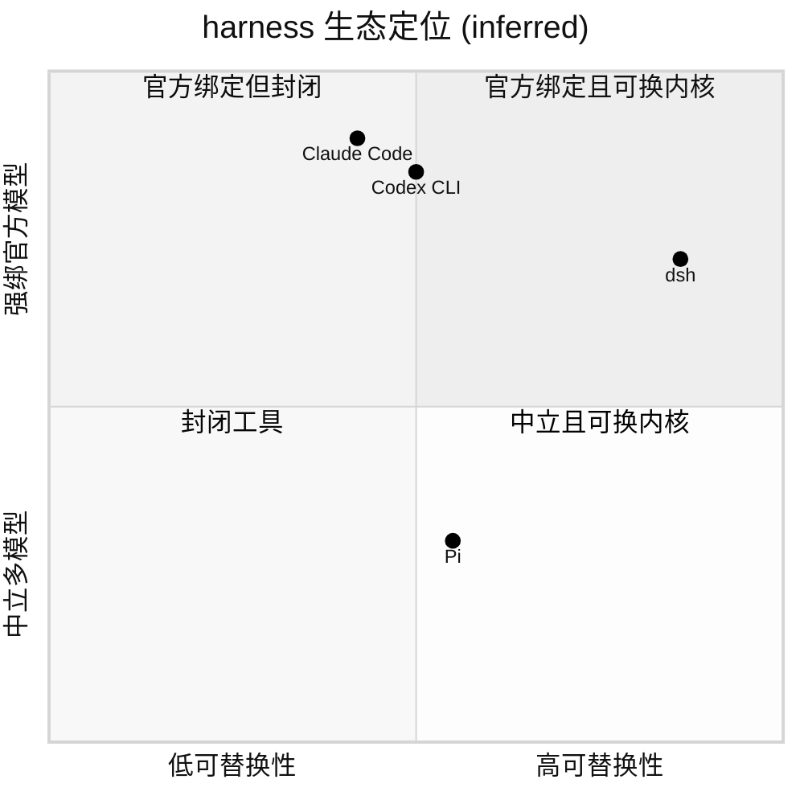
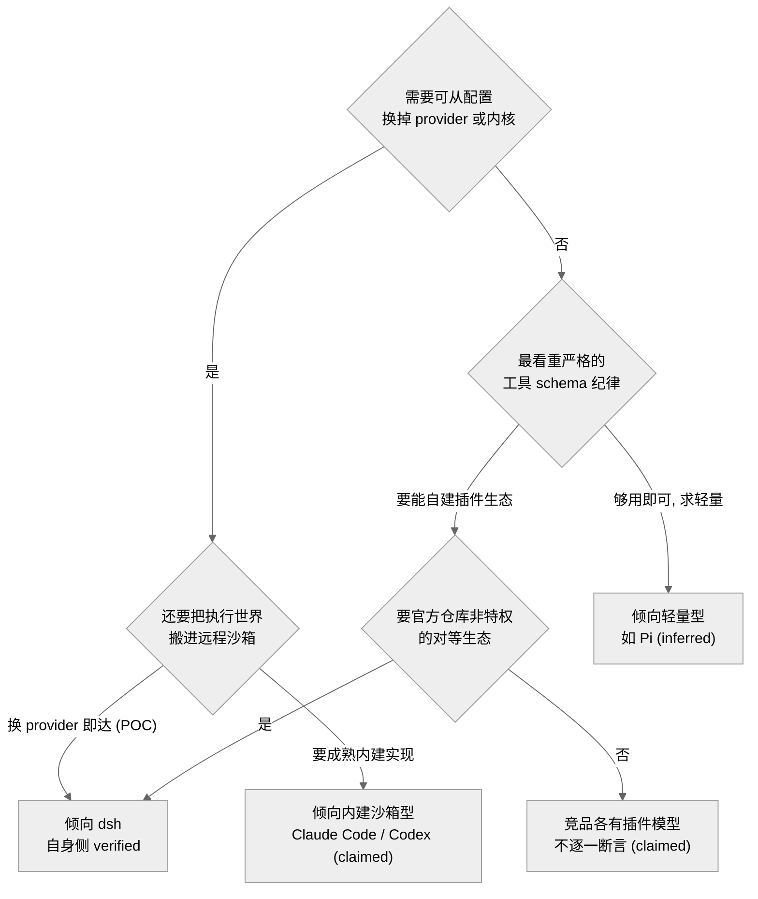
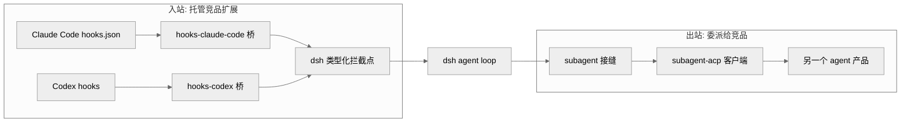
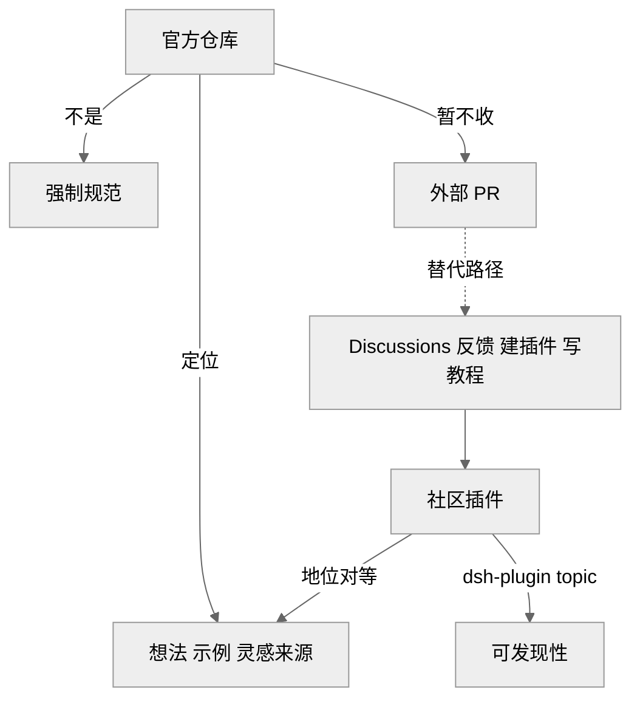

# 第 19 章 · 竞品对比与生态定位

> 本章跳出源码内部，把 `dsh` 放到同类 agent harness 的坐标系里看：它与 Claude Code、Codex CLI、Pi 等在**可替换性、插件模型、工具 schema 严格度、远程沙箱、开放度**五个维度上各站在什么位置；它自己的差异点（能力接缝可替换、事件溯源、对内对外的双向适配器）落在哪里；以及 `CONTRIBUTING.md` 里那句"官方仓库不比社区包更重要"意味着怎样一种生态设想。读完你能回答：dsh 相对同类的独特卖点是什么、它的开放度是"真开放还是官方绑定"、以及它目前被外界诟病的短板在哪。
>
> 提醒证据边界：本章多为**外部/对比性**判断。源码只能证明 **dsh 自己这一侧**的实现（`[verified]`）；对 Claude Code / Codex / Pi 内部机制的描述，绝大多数来自社区二手口径（`[claimed]`）或合理推断（`[inferred]`）。因此本章承重结论一律逐条标注证据等级、措辞刻意保守，不吹不贬。

## 一、同类 harness 的横向坐标

先说清楚"harness"是什么。这里的 harness 不是硬件，而是**包在编码模型外面的一层运行外壳**——模型自己只会输出文字，是这层外壳负责"帮它把工具跑起来、把多轮对话攒成一次会话、再配上一个界面"。可以把模型想成引擎，harness 就是车身、方向盘和仪表盘：引擎再强，也得有车才能上路。社区共识把 dsh 归入与 Claude Code / Codex CLI / Pi / Cascade 同一类的 **terminal/web agent harness**（跑在终端或网页里的这类外壳）`[claimed]`（全网调研 E.1）。这几家的分歧不在"做不做 agent loop"（要不要让模型自己一步步调用工具、观察结果、再决定下一步），而在**这层外壳有多可拆、对谁开放**。

先给一张定位象限图，帮你一眼看出各家站在哪。横轴是"可替换性/开放度"——越往右，越能只改配置就把内核换掉（内核指驱动整个 agent 的那套核心逻辑）；纵轴是"与官方模型的绑定程度"，越往上越只服务自家模型。坐标位置来自对比性推断，属 `[inferred]`（dsh 一侧的可替换性有源码支撑，见第 3 节；他方位置为社区印象，不是量出来的精确值）。

> 图注：dsh 落在"官方绑定但内核高度可替换"的角落——它由 DeepSeek 官方出品、默认接自家模型，却把连模型适配器、工具注册表、会话日志、agent loop 本身都做成可从配置替换的插件。这张图证明的是**一个判断**（dsh 在可替换性维度更靠右），而非精确坐标；坐标仅示意。

## 二、五个维度逐条对比

下表是本章的主干，逐维给出 dsh 的**源码可证**做法与同类的**社区印象**，证据等级分列。表里会反复出现几个词，先一句话交代清楚：**Cordis** 是 dsh 用的一套插件框架，它的规矩是"每装一个插件就像往插座上插电器，拔掉时能自动断电、恢复原状"（注册即 effect、卸载回滚副作用）；**能力接缝（seam）** 指模块之间那道预留好的可替换缝隙，就像插座标准——换灯泡不用改电路。

| 维度 | dsh（`[verified]` 除非注明） | Claude Code / Codex CLI / Pi（`[claimed]`/`[inferred]`） |
|---|---|---|
| 可替换性 | 无特权内核，一切皆 Cordis 插件，`--dump-config` 可打印并逐行替换 | 内核多为固定实现，扩展面在 hooks/MCP 而非换核 |
| 插件模型 | Cordis 时空可组合：注册即 effect，卸载回滚副作用；能力接缝三角色 | 插件/扩展系统各异；Pi 被社区形容为"热重载+动态启停" |
| 工具 schema 严格度 | 工具 schema 参与提示词装配，走类型化事件；社区称其严格度"超过 Codex" | Codex 的工具 schema 被同一评论者视作参照下限 |
| 远程沙箱 | 能力接缝下换 provider 即可把执行世界搬进 E2B 远程沙箱（POC） | 各家远程沙箱多为内建特定实现，非"换 provider" |
| 开放度 | MIT、developer preview、`dsh-plugin` 生态、暂不收外部 PR | 开源程度与协议各异，本章不逐一断言 |

这四个承重维度里，有三个值得再往下钻一层，看它们究竟是真差异还是话术。

**可替换性**上，dsh 的"更可换"不是营销措辞而是结构性事实：替换成本被 profile/bundle 分层与接缝三角色显式压低——`docs/architecture.md:11-14` 明写"没有可打补丁的特权核，连 agent loop 也是插件"，`packages/README.md:67` 又规定扩展插件依赖 Service Definition、绝不依赖具体 provider（`[verified]`）。只是"可换"不等于"好换"：替换虽合法，至今仍缺第三方内核实例来佐证它的人体工学。

**工具 schema 严格度**上要折中看：dsh 这一侧确有源码级纪律撑腰——schema 参与提示词装配、走类型化事件，且要求从模型视角写契约、model-facing 文本逐字钉住（`docs/architecture.md:47,111`、`packages/AGENTS.md` model-facing 契约条，`[verified]`）；但"胜过 Codex"这一相对判断只来自单条社区评论、并非受控对比，只能记 `[claimed]`（全网调研 E.2）。

**远程沙箱**则是"机制成立但成熟度有限"：价值在**接缝设计**本身（换 provider 而非改消费者），`packages/e2b/README.md:12-15` 证明无需 E2B 专用分叉、仅换 `ctx.fs`/`ctx.subprocess` 两个适配器即把 Bash/PTY/LSP 搬进沙箱（`[verified]`），但它明确自称 POC，且沙箱边界外的进程、模型调用、持久化并不随之迁移（`e2b/README.md:15`），"搬家"没有想象中干净。

看完对比，不妨把这张表反过来当"选型问卷"用——不是问"谁更好"，而是从你自己的需求出发，看哪一类 harness 更贴合。下图仅是**分流示意**：dsh 一侧的分支有源码支撑（`[verified]`），指向竞品的分支属对比性推断（`[inferred]`/`[claimed]`），不构成对竞品的定性结论。

> 图注：这不是"谁更好"的裁决树，而是把第 2 节五维拆成一串需求分叉。"要可换 provider/内核 + 换 provider 就搬远程沙箱 + 官方仓库非特权的对等生态 + schema 参与提示词装配"这几条同时命中时，dsh 一侧有源码可证（`docs/architecture.md`、`packages/e2b`、`packages/hooks`、`CONTRIBUTING.md`）；而"要成熟内建沙箱""求轻量"等分支指向竞品，只是社区印象口径，故标 `[claimed]`/`[inferred]`，本图不对竞品下定论。

## 三、dsh 的三个差异点

把上面的维度收敛成三个可源码定位的差异点。

**差异一：能力接缝的可替换性。** 一个 seam 由三种角色构成，缺一不成 seam（`docs/architecture.md:98-102`）：Service Definition（接口约定，规定"插座是什么形状"）、Service Provider（真正干活的实现，"插上来的电器"）、Consumer（用这个能力的一方，"要用电的房间"）。三者对上号，就能只换 provider、不动其余。因为文件系统与子进程这两个 provider 共享同一个"执行世界"——也就是"命令到底在哪台机器上跑、文件读写落在哪里"——把它们一起指向远程沙箱，就等于同时把 Bash（命令行）、PTY（伪终端）、LSP（语言服务）三样都搬了过去，不用为每样单独改代码（无需 provider 分叉）。这正是第 2 节远程沙箱维度的机制根源。

**差异二：事件溯源不变量。** 事件溯源（event-sourcing）的思路是：不直接存"当前状态"，而是把发生过的每件事按顺序记成一本只能往后追加、不能涂改的流水账（append-only 会话日志），任何时刻的状态都由这本账重放出来。就像记账不写"余额多少"，只写每一笔进出，余额随时能算回来。dsh 在此之上立了一条运行时断言——"模型可见 ⟺ 已记录"：凡是能被模型看到的东西，都必须能从这本流水账里重建，`deriveMessages()` 就负责从日志把模型该看到的历史投影出来（`docs/architecture.md:93-96`）。这带来的好处是：fork（岔开一条支线）、resume（断点续跑）、transcript（回放对话）、telemetry（观测埋点）、持久化——全部派生自同一条事件流，不会各存一份、对不上账。相比之下，社区讨论里同类 harness 的"上下文到底是怎么拼出来的"往往是隐式的、说不清的（全网调研 F）。

**差异三：对内对外的双向适配器。** 适配器就是"转接头"。dsh 装了两头的转接头，因此既能**托管竞品的扩展**（把别人家写的插件接进来跑），也能**把活委派给竞品**（把一段任务转手交给别的 agent 产品去做）——本质上是把竞品的扩展生态当成可复用的输入、而非要挤走的对手：

> 图注：左半，`hooks-claude-code` 与 `hooks-codex` 两个桥把外部 shell-hook 协议翻译到 dsh 自己的类型化拦截点上（`packages/hooks/README.md:5-13`），使得为 Claude Code / Codex 写的 hooks 能在 dsh 里"忠实运行"。右半，subagent 接缝可通过 ACP 客户端把一个回合委派到"另一个产品里"（`docs/architecture.md:102`、`packages/acp/README.md:5`）。这张图证明：dsh 的互操作是**双向**的，而非单向导入。

## 四、"官方仓库非特权"的生态理念

dsh 的开放度不只是 MIT 协议，还写进了 `CONTRIBUTING.md` 的一段立场：**"我们不认为官方仓库里的包天然比社区创造的包更重要。你可以把这个仓库当作一个想法、一个官方示例、一个灵感来源，但不是我们下达的强制规范。"**（`CONTRIBUTING.md:19`）与此配套的两个事实是：**暂不接受外部 PR**（`CONTRIBUTING.md:9`），以及引导社区给插件仓库打 `dsh-plugin` topic 以便发现（`README.md:40`、`CONTRIBUTING.md:15`）。这更像"理念优先、产能约束并存"：文中确说团队很小、早期阶段暂不收 PR（`CONTRIBUTING.md:12`，`[verified]`），但只用产能解释不了为何还**主动**引导 `dsh-plugin` 生态、把官方仓库自称 showcase——是架构上的可替换性（见第 3 节）让这套"官方与社区对等"的理念真能落地，而非停在口号。风险也随之而来：若发正式版后仍长期不收 PR、社区插件却因缺乏上游协作而碎片化，"对等"就可能沦为"官方缺席"——这一隐忧留到第 20 章展开。

> 图注：官方仓库被自我降格为"showcase"，与社区插件地位对等；贡献路径从"提 PR 进官方仓库"改道为"在生态里建插件 + 打 topic + 参与讨论"。这张图证明的是 dsh 把**创新权下放到生态**、而非集中在官方仓库的姿态。

## 五、已知局限（外部口径）

以下三点是社区（主要是 HN 主讨论帖）对 dsh 的主要质疑，均属 `[claimed]`，本研究未做一手复现，故措辞弱化（全网调研 D、A）：

- **体积**：有评论称约 47MB 下载 / 约 1.5GB 构建产物 `[claimed]`。对一个"开发者预览、快速迭代"的 monorepo（所有包放在同一个大仓库里管理，这里有 219 包 / 49 组）而言并不意外，但对只想轻量试用的人是道门槛。
- **TypeScript 选型**：部分声音质疑用 TS 来当 agent harness 的底座是否划算 `[claimed]`。可佐证的事实是 dsh 全仓采用 ESM（JavaScript 的标准模块格式）+ `strict`（TypeScript 最严格的类型检查开关，越界就报错），并且把 Cordis 这套 TS 元框架直接 vendored 进来——vendored 就是"把外部依赖的源码拷进自己仓库、自己管版本"，好比不去外面租设备而是搬回家自己维护。这是一次有意的类型化押注，代价是构建更复杂（源码侧 `AGENTS.md` 可证其 ESM/strict 纪律，`[verified]`；"是否为错误选型"是价值判断，`[claimed]`）。
- **npm 供应链**：对深度依赖 npm 生态所带来的供应链风险的一般性担忧 `[claimed]`——即"我依赖的第三方包哪天被投毒或跑路怎么办"。dsh 的缓解姿态之一是把关键底座 vendored（锁定具体提交号 pin SHA + 附一份本地改动清单，见 `AGENTS.md` 末节 Vendoring policy），相当于把最要紧的那层零件搬进自家库房、不随上游漂移；但这只覆盖 Cordis 一层，并非全量。

把这三点合起来看，它们更像"阶段性局限"而非结构缺陷：README 明确自称 developer preview、会有破坏性变更（`README.md:11`，`[verified]`），此阶段把正确的基础放在体积优化之前是合理排序；守住证据边界，在没有一手度量之前不该把它们升级为定性缺陷。真正的隐忧是——万一体积/构建成本源自架构本身（monorepo + vendored 元框架）而非阶段，正式版也未必瘦得下来。

## 小结与衔接

把五维对比收敛成一句：dsh 与 Claude Code / Codex CLI / Pi 同属编码 agent harness，但它把**可替换性推到"连内核都是插件"的极端**，用能力接缝、事件溯源、双向适配器三个源码可证的机制支撑这一姿态，并用"官方仓库非特权"的生态理念把创新权下放给 `dsh-plugin` 社区。它的短板（体积、TS、供应链）目前都停留在社区 `[claimed]` 口径、且与"开发者预览"阶段相符，尚不足以定性为结构缺陷。

需要反复强调的证据边界：本章除 dsh 自身实现外，对竞品的横向判断多为二手，故一律逐条标注证据等级、措辞保守。dsh 在坐标系里的"官方出品却高度开放"这一张力——为什么一个顶级实验室要把 harness 建成这样、并把它交给社区——不是源码能回答的问题。这正是下一章《AI 自举开发方法论与公司理念映射》要接手的：把架构选择回溯到 DeepSeek 的组织与理念，看这套生态定位是不是其"原创而非模仿、护城河是团队与文化"信念在工具层的又一次落地。

## 源码索引

- `README.md:5,11,40` — dsh 定位、developer preview 声明、`dsh-plugin` topic 引导
- `CONTRIBUTING.md:9,11,15,19` — 暂不收 PR、小团队、`dsh-plugin` 生态、"官方仓库非特权"
- `docs/architecture.md:11-14` — 无特权核、一切皆插件、注册即 effect
- `docs/architecture.md:47,111` — 工具注册表、schema 参与提示词装配
- `docs/architecture.md:93-96` — 会话日志、`deriveMessages()`、模型可见⟺已记录
- `docs/architecture.md:98-102` — 能力接缝三角色、一次 provider 替换搬动整个执行世界、委派到另一产品
- `packages/README.md:21,67` — E2B 标 POC；扩展插件依赖 Service Definition 而非 provider、`dsh-agent-loop` swappable
- `packages/hooks/README.md:5-13` — Claude Code / Codex hook 桥、native hook = 普通 Cordis 插件
- `packages/e2b/README.md:12-15` — 换 `ctx.fs`/`ctx.subprocess` 即把 Bash/PTY/LSP 搬进 E2B、边界不迁移的状态
- `packages/acp/README.md:5` — ACP 互操作传输、出站 subagent 客户端
- `AGENTS.md`（根，CLAUDE.md 符号链接）— ESM/strict 纪律、model-facing 契约、Vendoring policy
- 外部：`全网调研-社区认知地图.md` A/C/D/E/F 节（HN 反响、公司理念、争议矩阵，均 `[claimed]`/`[verified]` 按该文标注）
