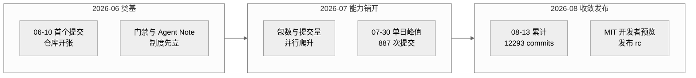
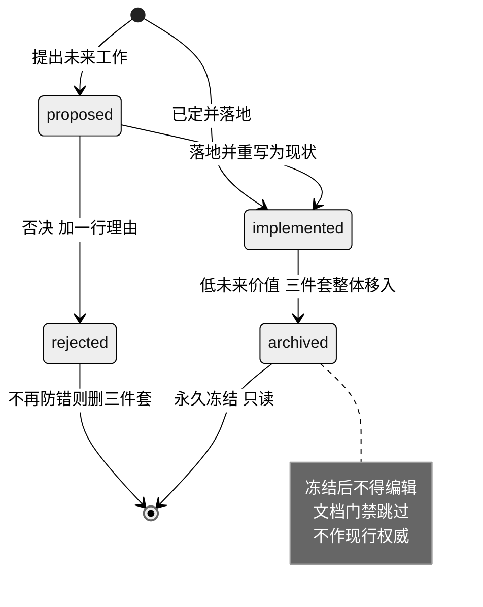
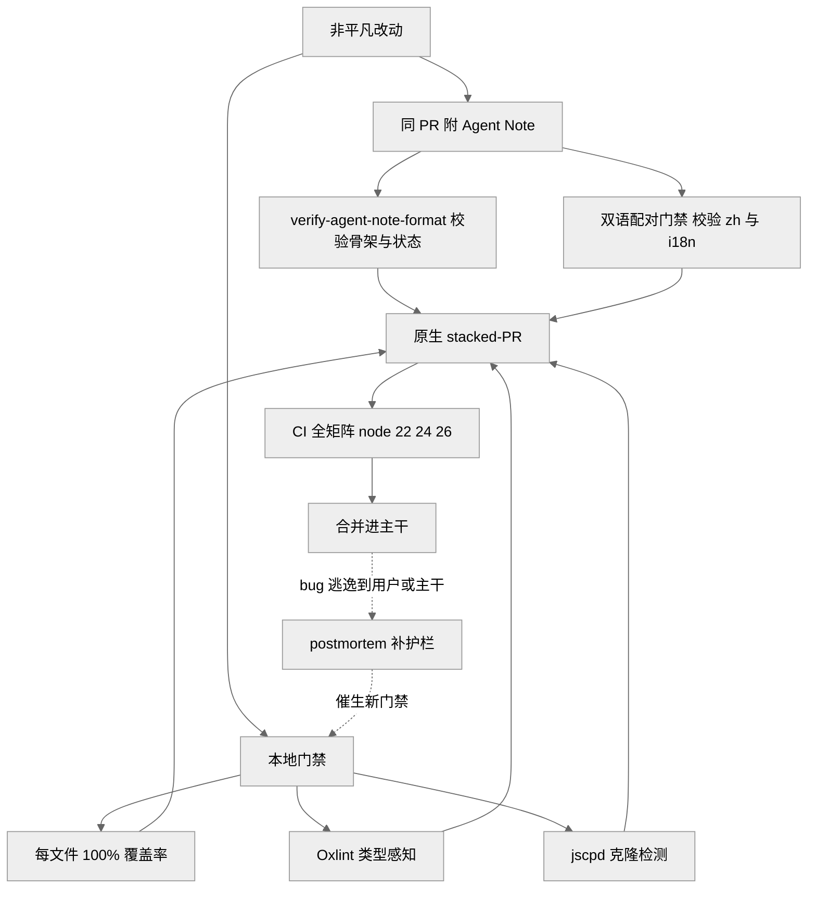
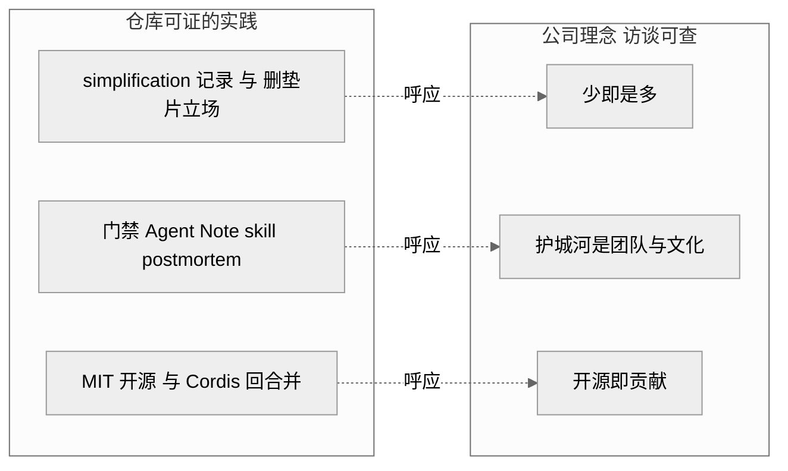

# 第 20 章 · AI 自举开发与理念映射

> 本章是全书收官，站到元层面回答一个问题：`dsh` 不只是一个 agent 运行框架，它本身还是一个**由 AI agent 大规模并行编写、并为 agent 量身制度化了工程纪律**的代码库。读完你能回答三件事——凭什么说"这是 AI 写的代码库"（证据链有多硬）、它把哪些面向 agent 的纪律做成了制度、以及这套做法与 DeepSeek 公司理念之间是"证明"还是"呼应"。
>
> 全章证据等级贯穿标注：`[verified]` 源码/git 可证 · `[inferred]` 合理推断 · `[claimed]` 二手口径。凡涉及动机、归因、理念映射的承重判断，一律逐条标注证据等级并弱化措辞。

## 一、本质是什么

前 19 章都在读"`dsh` 这个产品如何被设计"。本章换一个视角：读"`dsh` 这个代码库如何被生产"。二者不是同一件事——打个比方，前者像研究一辆车怎么开、性能如何，后者像研究这辆车所在的工厂：流水线怎么排、质检卡在哪几道工序、返工规则是什么。一个讲运行时架构，一个讲开发过程与治理制度。

把开发过程本身当成分析对象，是因为这个仓库的生产方式有一些不寻常的特征。截至 `2026-08-13`，仓库在 `2026-06-10 → 08-13` 约 64 天内累计 **12,293 commits、5,610 merges**（合并占比约 46%），单日提交峰值出现在 `2026-07-30`，达 **887 次** `[verified]`（`git rev-list --count`、`git log --date=short`）。主力作者 `Tianyi Cui` 一人 **5,235 commits**，约合每天 82 次提交 `[verified]`（`git shortlog -sn`）。合并提交里可辨认出成规模的机器分支前缀：`codex/` 约 2,352、`worktree/` 约 1,265，另有零星 `agent/`、`claude/` `[verified]`（`git log --grep=Merge`）。

单个作者一天平均 82 次提交，是什么概念？如果按 8 小时工作日算，差不多每 6 分钟就要提交一次——连续 64 天不间断。这个节律超出了人类持续手写代码的常规量级。

需要说清：这些数字本身并不"证明"代码是 AI 写的（一个人也可能高度依赖脚本或自动化）。但它们和仓库对自身的**明文自述**叠在一起，就构成了一条证据链。这里说的 Agent Note，是这个仓库特有的一种制度化记录文件（后文会详解），专门用来沉淀"某个改动为什么这么做"。其中记录开发流程制度的那篇 `quality-gates.md`，开篇第一句写着："This codebase is developed primarily by coding agents. Agents follow enforced gates far more reliably than prose conventions" `[verified]`（`.agents/notes/implemented/process/2026-06-11-quality-gates.md:11`）。这不是社区猜测，而是仓库自己的一手声明。

把这条自述与超人类的提交节律、机器分支前缀叠起来，最稳妥的结论是"**以编码 agent 为主要执行者、人类设定规则并终签**"（自述 `[verified]`，规模旁证 `[inferred]`）——而不是"无人参与"。第一性上，`quality-gates.md` 明确把"agents follow enforced gates more reliably than prose"当作设计动机，整套门禁都是"给不知疲倦、易漂移的执行者立规矩"这一约束下的合理产物；但 git 作者名对应真人，逐行贡献比例本就无从核实，所以本章只把话说到"主要执行者"为止。

> 图注：此图证明提交轨迹是"**先立制度、再爬能力、后收敛发布**"的三段式——64 天内累计 12,293 commits，能力铺开期在 `2026-07-30` 冲出单日 887 次峰值，随后收束到可发布状态 `[verified]`（`git log --date=short`、`git rev-list --count`）。峰值出现在制度已就位之后，与"门禁先行"的设计次序一致。

## 二、核心问题与痛点

当写代码的主力从"少量人类工程师"换成"大量并行、容易跑偏、且不断轮换的编码 agent"，情况就变了。这里的"轮换"是关键：人类团队里，新人靠老人带、靠日积月累的默契维持风格；而每个 agent 的每一次会话都像一个刚入职、没有记忆的新人——上一次的经验教训不会自动带到下一次。于是传统那种靠口头约定、靠 review 时"我记得我们不这么写"来维持的工程质量，就失效了。具体痛点有三：

1. **约定无法靠记忆传递**。人类团队靠资历与口耳相传维持风格；agent 每个 session 都是"新人"，写在文档里的散文约定读了也不一定照做。`quality-gates.md` 直言早期教训：有些连类型检查都没过的测试曾直接进了主干（因为 vitest 这个测试工具本身不做类型检查），只能靠人工 review 事后逮到 `[verified]`（`quality-gates.md:11`）。
2. **决策理由极易蒸发**。代码和测试能说明"改了什么"，却留不住"为什么选这个方案、否决了哪些替代、接受了什么代价"。理由一丢，并行的 agent 就会一次次重走已经被否决的老路——相当于每个新人都要把前人踩过的坑再踩一遍。
3. **规模带来的治理压力**。日均上百次提交、近一半是合并，若没有机器能自动判定的闸门、也没有可回溯的记录，代码库会在几周内失控。

一句话概括：`dsh` 要解决的难题，不是"怎么让一个 agent 写对一段代码"，而是"怎么让成百上千个匿名 agent 在两个月里协作出一个 219 包、可发布的系统而不塌方" `[verified]`（219 包见 `find packages -mindepth 3 -maxdepth 3 -name package.json`）。前者是能力问题，后者是治理问题——本章讲的正是后者。

## 三、解决思路与方案

`dsh` 的答案是把"面向 agent 的工程纪律"**制度化成三层可执行机制**：记录层（Agent Notes）、复盘层（postmortem）、门禁层（gates），彼此咬合。可以先记一个直觉：记录层管"把为什么留下来"，复盘层管"从事故里学教训"，门禁层管"把规矩变成不通过就报错的命令"。三层一起，替代了原本靠人脑记忆和默契在维持的东西。

**记录层——Agent Notes 生命周期。** Agent Note 就是前面提到的那种决策记录文件。规则是：每个非平凡改动，都必须在同一个 PR（Pull Request，拉取请求——把一批代码改动打包起来、请求合进主干的单位）里新增或更新至少一篇 Agent Note，把"决策"和"被否决的替代方案"写下来；纯机械/局部的小编辑可以豁免 `[verified]`（`.agents/notes/README.md:44-48`、`require-agent-notes-for-non-trivial-changes.md:11-15`）。这里有个巧妙的设计：Agent Note 不是靠文件里的字段来分类，而是直接用**它放在哪个目录**来编码两个正交维度——生命周期（`proposed` 提议中／`implemented` 已落地／`rejected` 已否决／`archived` 已归档）和类别（`feature`/`bug-fix`/`simplification`/`architecture`/`process`/`testing`）。类别是一个**闭集**（意思是只有这几种、不许自创新类），越界就会被门禁直接拒绝 `[verified]`（`.agents/notes/README.md:9-34`）。用目录来分类的好处是：机器一眼就能判定一篇 Note 处于什么状态、属于哪一类，不用去解析正文。截至核对时，活跃 Agent Note 约 **541 篇**（`implemented` 505、`proposed` 25、`rejected` 11），另有 **142 篇归档**。按类别看（**跨全部状态含归档合计**）：`feature` 229、`architecture` 153；若只看 `implemented` 层则 `feature` 170、`architecture` 129 `[verified]`（`find .agents/notes ...`）。

关键设计是"**归档即冻结**"：当一条 implemented 记录对未来的参考价值变低时，就把它整体（英文原件 + 中文译件 + sidecar 元数据这一套三件套；sidecar 指"贴身伴随正文的一个小配套文件"，这里存放校验用的元数据）移入 `archived/` 目录；一旦封存就永久冻结——不再编辑、文档门禁对它放行、也不许再被当作现行权威来引用 `[verified]`（`.agents/notes/README.md:36-42`）。这相当于把"还在生效的规章"和"存进档案室的旧文件"分开摆放，避免有人拿一条早已过时的理由来约束今天的代码。

**复盘层——postmortem 文化。** postmortem（事后复盘，字面是"验尸报告"）解决的是另一类问题。当一个 bug 跑到了它本不该出现的地方（真实用户面前、已合并的 PR、正式发布），而且"为什么我们这一整套流程没拦住它"比"随手修这一行"更值得写下来时，就写一篇 postmortem。它和 Agent Note 分工明确：Agent Note 记的是**往前看**的决策，postmortem 记的是**回头看**的失败 `[verified]`（`docs/postmortem/README.md:5-9`）。目前有 4 篇（0001–0004）。每篇开头是一段 30 秒能读完的 Executive summary（摘要），核心是追问"每一层安全网为什么都没拦住它"，并链接到这次事故催生出的新护栏 `[verified]`（`docs/postmortem/README.md:11-19`）。换句话说，一次事故的产出不是"修好了"，而是"以后这类事故会被自动拦下"。

**门禁层——机械闸取代散文约定。** 这一层的核心信条是："每一条机械可查的 AGENTS.md 承诺，都要有一个失败时会以非零退出码结束的命令" `[verified]`（`quality-gates.md:15`）。"非零退出"是命令行的行话——程序正常结束返回 0，出错则返回非 0，CI（continuous integration，持续集成——每次改动自动拉起一整套检查的流水线）一看到非 0 就判定这一步失败。翻成大白话就是：凡是能用机器检查的规矩，就别只写在文档里指望大家自觉，而要配一条"违规就报错"的命令，让流程自动卡住。落地的门禁包括：`packages/*/*/src` 目录下**每个文件 100% 测试覆盖率**（确实执行不到的防御分支，用一行 `/* v8 ignore */` 注明理由跳过，而不是删掉代码）、能感知类型的 Oxlint（代码检查工具）、跨文件重复代码检测 jscpd、以及 knip/publint/workspace 这些依赖与打包约束；还有一道双语门禁——每篇 Agent Note 都要有对应的 `.zh.md` 中文件和记录一致性的 `.i18n.yaml`（i18n 是 internationalization/国际化的惯用简写——首尾两个字母 i、n 中间夹 18 个字母），两者的配对由专门的翻译配对门禁来校验（`scripts/merge-translation-pairing.ts`/`translation-pairing-merge.ts` + `doc-sync` 的 i18n 一致性检查）`[verified]`。（注：`quality-gates.md:20-22` 记录的是覆盖率/knip/lefthook 门禁，不含双语配对，此处不引它。）这套机械闸乍看是过度工程，但当执行者是"跟着强制门禁远比跟着散文约定可靠"的 agent 时，把每条可查约定编译成会失败的命令几乎是唯一能规模化的传递方式（`quality-gates.md:11,26`，`[verified]`）——代价是门禁本身要维护、100% 覆盖率还会诱出"无断言测试"，仓库因此把变异测试列为计划中的对冲（`quality-gates.md:28`）。

> 图注：此图证明 Agent Note 是一台**状态机**而非静态文档堆——状态由文件所在目录编码，跨状态迁移必须同步改写 `Status:` 行并满足目标目录的骨架，否则门禁拒绝（`.agents/notes/README.md:119-121`）。

## 四、实现细节关键点

**Agent Note 的文件格式是机械可查的。** 为了让机器能自动校验，Note 的格式被卡得很死：前三行永远是 `# Agent Note: <title>` / 一个空行 / `Status: <status>`，而这个 `Status:` 标出的状态必须和它所在的生命周期目录对得上（放在 `implemented/` 里就不能写 `proposed`），由 `verify-agent-note-format`（属于 `doc-sync` 这套检查）来交叉核对。不同状态还有不同的"骨架"，也就是必须包含的固定小标题：`proposed`（提议中）要有 `## Proposal`/`## Alternatives considered`/`## Acceptance criteria`/`## Risks`；一旦落地成 `implemented`，骨架就换成 `## Decision`/`## Consequences`，而且提议期的标题（如 `## Plan`）若还留在 implemented 版里，会被直接拒绝 `[verified]`（`.agents/notes/README.md:58-103`）。其中 `## Alternatives considered`（考虑过的替代方案）是**强制**段——正如仓库原话："一个不记录自己击败了什么的决策，就是在邀请日后重新扯皮" `[verified]`（`.agents/notes/README.md:109-111`）。这一条正是冲着痛点二"决策理由蒸发"来的。

**门禁被拆进 skill 里供 agent 调用。** skill 在这里指一份打包好的操作说明书——把某个容易出错的流程写成可复用的固定步骤，agent 需要时直接调用。`.agents/skills/` 下有 11 个仓库专属 skill，例如：`dsh-archive-agent-notes`（归档校验）、`dsh-merging-stacked-prs`（叠放 PR 的落地流程）、`dsh-pre-push-checks`（按本次改动自动挑出最小必要的检查集）、`dsh-prose-standard`/`dsh-doc-standards`（散文与文档标准）、`dsh-trim-cot-leakage`（清理文中"泄漏的推理转录"，即那些不该留在成品里的思考过程）等 `[verified]`（`ls .agents/skills`）。这些 skill 本质上就是"把资深工程师的判断力打包成说明书，发给每一个刚上岗的新 session"——正好接住了痛点一"约定无法靠记忆传递"。

**原生 stacked-PR 与显式历史纪律。** stacked-PR（叠放式 PR）是指把一串相互依赖的改动拆成层层叠起来的多个 PR，像叠盘子一样，下面一个合并了上面的才好接着走。面对高并发提交，`dsh` 直接用 GitHub 原生的叠放 PR 能力，把"这一栈怎么排序、CI 怎么跑、合并状态怎么算"这些烦心事交给平台去管，而不是自己手写脚本维护。改写历史时用 `--force-with-lease`（一种"发现远端已经变了就自动中止"的安全强推），并禁用裸 `--force`（无条件覆盖，容易冲掉别人的提交）`[verified]`（`AGENTS.md:126`、`native-github-stacks-and-optional-rebases.md`）。前面统计里看到的 `codex/`、`worktree/` 分支前缀，正是这套并行分支流留下的痕迹 `[inferred]`。

> 图注：此图证明记录层、门禁层、复盘层是**闭环**——每个改动都被 Agent Note 与门禁双向约束，逃逸的缺陷经 postmortem 反哺出新门禁（`docs/postmortem/README.md:9`）。

## 五、易错点与注意事项

- **Agent Note 不是可以事后补的作文**。它必须和代码在同一个 PR 里落地，而且 `implemented` 记录要跟"实际发布了什么"保持同步——一旦代码改了路径、包名或默认值，就得在同一个改动里顺手更新 Note（注意：只改对不上的事实，不动当初的决策）`[verified]`（`.agents/notes/implemented/CLAUDE.md`、`README.md:13`）。
- **决策不能被"改写成相反的样子"**。想推翻一个旧决策，得**新写一篇**并和旧的互相链接，而不是把旧 Note 直接改掉；一篇被完全取代的旧 Note，也只能在 owner 先把它独有的理由全部保留下来之后，才按合并规则删除 `[verified]`（`.agents/notes/README.md:48-52`）。这样做是为了留住"当初为什么那样想"的完整轨迹，而不是让历史被覆盖。
- **归档是一道单向门**。一旦封存，连翻译、重新排版、移动位置都不允许；正在生效的文档如果要引用历史，只能"有意地"主动链进去 `[verified]`（`.agents/notes/README.md:42`）。
- **覆盖率门禁有个陷阱**：100% 是针对 `src` 下的**每个文件**算的，执行不到的防御代码要用 `/* v8 ignore */` 注明理由跳过、而不是删掉。仓库也坦承这条规矩有副作用——它会诱使人写出"无断言测试"（只为把代码跑一遍凑覆盖率、却不真正检查结果对不对的测试）`[verified]`（`quality-gates.md:20,28`）。

## 六、竞品 / 横向对比

同类的 harness（agent 运行框架，如 Claude Code、Codex CLI、Pi 等）大多带一个 `AGENTS.md`/`CLAUDE.md` 约定层来指导 agent——但那基本还停留在"写在文档里的建议"。而把**决策记录、复盘、门禁**这三样合起来做成"用目录编码状态的生命周期状态机 + 强制双语 + 每文件 100% 覆盖"这么完整的一套，`dsh` 的完成度在公开可见的同类项目里算是偏高的 `[claimed]`（社区讨论大多聚焦它的工具 JSON schema 与 Cordis，很少展开谈它的 agent 工程纪律，见《全网调研》F 节）。要说清楚的是，这只是"公开可见范围内 dsh 更成体系"的有限主张，不外推到"绝对领先"——拿开源的 dsh 与闭源竞品比，样本本就不对等，头部厂商内部很可能有更成熟却未公开的治理；但把纪律**写进受门禁强制的仓库结构**、而非停在 README 里的建议，这本身就是可核的量级差异（dsh 侧 `[verified]`，竞品侧无对等源码故 `[claimed]`）。

## 七、把做法映射到 DeepSeek 公司理念

以下是全书**最需要克制**的一段。把工程实践和公司理念对齐，本质上是一种 `[inferred]` 的类比——所以下面一律用"呼应/可能"这样的词，而不是"证明"。要分清两件事：源码能证明"某个实践确实存在"，但证明不了"这个实践是被某条理念导致的"。理念口径来自暗涌/ChinaTalk 访谈与开源周（原文可查 `[verified]`，见《全网调研》C 节）。

- **少即是多的工程审美**：`dsh` 有专门一类 `simplification`（简化）Agent Note（活跃 + 归档合计数十篇）；还有一条 pre-release（正式发布前）阶段的立场，它在 `AGENTS.md` 里就是一句小标题——"foundation over blast radius"（地基优先于波及面），意思是既然还没有外部用户依赖，宁可为打好地基而重构，也不为"少动几处"去加兼容垫片；再加上"当能真正删掉自家代码时，优先改用成熟依赖"的政策。这些都与公司理念里 MLA（Multi-head Latent Attention，多头潜在注意力——把注意力的键值缓存压小以省显存）、MoE（Mixture of Experts，混合专家——每次只激活一小部分参数）、FP8（8-bit floating point，8 位浮点——用更低精度的数字格式做训练与推理）那套"用更少的资源做更多的事"的取向**呼应** `[verified 实践]`（`AGENTS.md:5-7,110`）/`[inferred 映射]`。
- **护城河是团队与文化，不是代码**：把工程判断力沉淀成受门禁强制执行的 Agent Note、skill、postmortem，让"约定能跨 agent 轮换而存活"（`quality-gates.md:26` 原文）——这等于在**工具层面复刻**了"真正的护城河是那个能持续创新的组织与文化，而非某段具体代码"这一命题 `[inferred]`。
- **开源即贡献**：`dsh` 以 MIT 许可证（一种最宽松的开源许可证，几乎只要求保留版权声明）的开发者预览版开源；它把 Cordis 以 vendoring 方式纳入（vendoring 指把第三方库的源码直接收进自己仓库、连同改动一起管理），并把补丁向上游回合并——这与"要做贡献者而不是搭便车者、开源本身是声誉/人才/标准层面的战略"这一立场**呼应** `[verified 事实]`（`AGENTS.md:147-149` 顶部 vendoring policy）/`[inferred 映射]`。
- **原创 vs 模仿**：这里要谨慎——`dsh` 的运行时底座 Cordis 并不是自创的，而是深度采用的一个社区框架；至于在它之上搭的"时空可组合的 agent 微内核 + 制度化 agent 纪律"这套组合算不算"原创贡献"，是个开放问题，不宜下断言。

> 图注：所有连线都是虚线，代表 `[inferred]` 类比而非因果证明——左侧节点源码可证，右侧节点访谈可查，中间的箭头是本章主张"呼应"而非"证明"的边界。

## 八、仍存在的问题与局限

1. **归因无法逐行核实**："以 agent 为主要执行者"这个判断，靠的是 `[verified]` 的仓库自述加上 `[inferred]` 的规模旁证；但没有任何机制能把每一行代码追溯到究竟出自哪个模型或哪个人——所以本章始终把话说到"主要执行者"为止，不越界。
2. **100% 覆盖率的副作用**：如前所述，仓库自己承认它会诱发无断言测试；而用来对冲这个副作用的手段（变异测试，一种故意改坏代码看测试能不能发现的方法）目前还停留在 `proposed`（提议中）状态、尚未落地 `[verified]`（`quality-gates.md:28`）。
3. **治理开销随规模膨胀**：光是 process（流程）这一类 Agent Note 就有活跃 69 篇 + 归档 20 篇，它们本身也是需要持续维护的资产；而双语门禁又把每篇 Note 的维护成本乘以二。这一整套纪律的边际收益能不能长期跑赢它的边际成本，源码本身回答不了。
4. **归档冻结带来的信息损耗**：一篇 Note 封存后就不再更新，万一某个被冻结的理由日后重新变得关键，也只能另写新篇、不能"唤醒"旧篇，于是可能出现同一主题散落在好几篇里的碎片化。

## 小结与衔接

本章把镜头从"`dsh` 是什么"拉到"`dsh` 是怎么被造出来的"：一个 64 天、12,293 commits、以编码 agent 为主要执行者的代码库，用三层制度——记录（Agent Note 生命周期状态机）、复盘（postmortem）、门禁（机械命令 + 双语 + 100% 覆盖 + 原生 stacked-PR）——把"能跨 agent 轮换而不流失的工程判断力"固化了下来。说到底，这三层要解决的是同一个问题：当写代码的是一群没有长期记忆、不断换班的执行者时，怎么让规矩和经验不靠人脑、而靠仓库结构本身传下去。这套做法与 DeepSeek"少即是多、护城河是团队与文化、开源即贡献"的理念**呼应**，但那是守边界的 `[inferred]` 类比，不是源码可证的因果。

作为收官章，它与第 19 章（生态定位与竞品对比）互补：第 19 章从外部看 `dsh` 站在哪里，本章从元层看 `dsh` 如何自我生产与自我治理。二者合起来回答了全书开篇总纲的第三、第四命题——**过程命题**（AI 大规模并行开发 + 制度化纪律）与**理念命题**（工具层对公司理念的回响）。至此，从架构（Part I）到源码（Part II）到元层（Part III）的主线闭合。

## 源码索引

- `AGENTS.md:5-7`（pre-release "foundation over blast radius" 立场，:5 为该小标题原文）、`:110`（依赖优于手写）、`:122`（非平凡改动必附 Agent Note）、`:126`（显式 PR 历史 / stacked-PR）、`:147-149`（vendoring policy）
- `.agents/notes/README.md:9-34`（生命周期 + 闭集类别）、`:36-42`（归档即冻结）、`:44-52`（何时写 / 不可改成相反决策）、`:58-121`（文件格式与骨架、迁移规则）
- `.agents/notes/implemented/process/2026-06-11-quality-gates.md:11-12`（"developed primarily by coding agents" 自述与早期教训）、`:15`（机械命令信条）、`:18-22`（Oxlint / jscpd / 每文件 100% 覆盖 / knip / lefthook 门禁——该文件不含双语配对门禁）、`:26,28`（约定跨轮换存活 / 无断言测试与变异测试对冲）
- `.agents/notes/implemented/process/2026-07-19-require-agent-notes-for-non-trivial-changes.md:11-21`（强制记录政策）
- `.agents/notes/implemented/process/2026-08-02-native-github-stacks-and-optional-rebases.md`（原生叠放 PR）
- `.agents/notes/implemented/CLAUDE.md`（implemented Note 与发布同步）
- `docs/postmortem/README.md:5-19`（postmortem 定义与 0001–0004 清单）
- `docs/development.md:107-117`（lefthook 本地门禁 / CI 分工）
- `ls .agents/skills`（11 个仓库专属 skill）
- git 事实 `[verified]`：`git rev-list --count HEAD`=12293、`--merges`=5610；`git log`（2026-06-10→08-13、单日峰值 887 于 07-30）；`git shortlog -sn`（Tianyi Cui 5235）；`git log --grep=Merge`（codex/ 2352、worktree/ 1265、agent/ 32、claude/ 30）
- Agent Note 计数 `[verified]`：`find .agents/notes ...`（活跃约 541、归档 142；按类别跨全状态合计 feature 229 / architecture 153，其中 implemented 层 feature 170 / architecture 129）；包数 `find packages -mindepth 3 -maxdepth 3 -name package.json`=219
