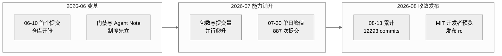
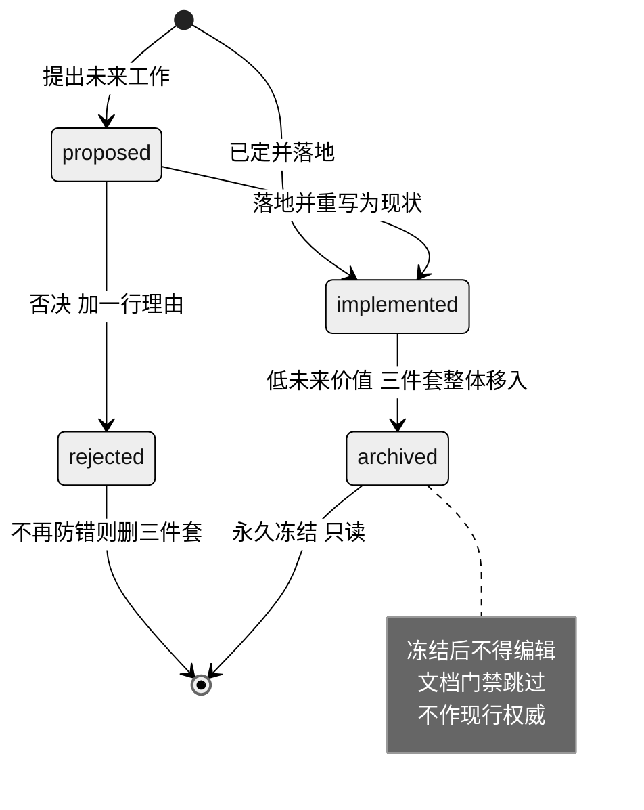
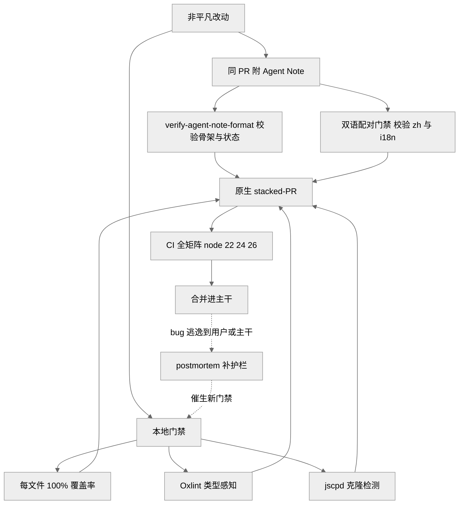
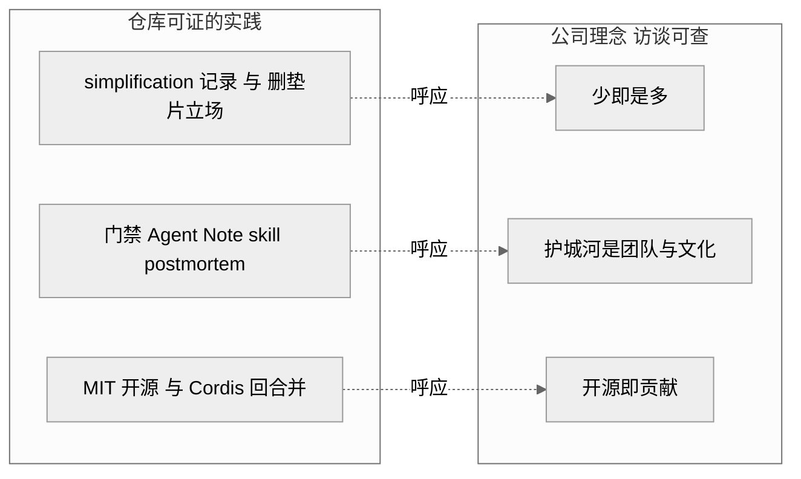

# 第 20 章 · AI 自举开发与理念映射

> 本章是全书收官，站到元层面回答一个问题：`dsh` 不只是一个 agent 运行框架，它本身还是一个**由 AI agent 大规模并行编写、并为 agent 量身制度化了工程纪律**的代码库。读完你能回答三件事——凭什么说"这是 AI 写的代码库"（证据链有多硬）、它把哪些面向 agent 的纪律做成了制度、以及这套做法与 DeepSeek 公司理念之间是"证明"还是"呼应"。
>
> 全章证据等级贯穿标注：`[verified]` 源码/git 可证 · `[inferred]` 合理推断 · `[claimed]` 二手口径。凡涉及动机、归因、理念映射的承重判断，一律走 ratify-note 并弱化措辞。

## 一、本质是什么

前 19 章都在读"`dsh` 这个产品如何被设计"。本章换一个视角：读"`dsh` 这个代码库如何被生产"。二者不是同一件事——一个讲运行时架构，一个讲开发过程与治理制度。

把过程当对象来分析，是因为这个仓库的开发过程有异常特征。截至 `2026-08-13`，仓库在 `2026-06-10 → 08-13` 约 64 天内累计 **12,293 commits、5,610 merges**（合并占比约 46%），单日提交峰值出现在 `2026-07-30`，达 **887 次** `[verified]`（`git rev-list --count`、`git log --date=short`）。主力作者 `Tianyi Cui` 一人 **5,235 commits**，约合每天 82 次提交 `[verified]`（`git shortlog -sn`）。合并提交里可辨认出成规模的机器分支前缀：`codex/` 约 2,352、`worktree/` 约 1,265，另有零星 `agent/`、`claude/` `[verified]`（`git log --grep=Merge`）。

这些数字本身不"证明"是 AI 写的，但它们和仓库对自身的**明文自述**叠在一起就构成证据链。过程制度化 Agent Note `quality-gates.md` 开篇第一句写着："This codebase is developed primarily by coding agents. Agents follow enforced gates far more reliably than prose conventions" `[verified]`（`.agents/notes/implemented/process/2026-06-11-quality-gates.md:11`）。这不是社区猜测，而是仓库自己的一手声明。

> **ratify-note · 这是不是一个"AI 写的代码库"**
> - 候选解释：A 主要由编码 agent 生成、人类编排规则并终签；B 人类为主、agent 只做辅助；C 纯人类开发，"coding agents" 只是命名习惯。
> - 各自利弊：A 优——与仓库自述、全套 agent 面向的工具、机器分支前缀、超人类的提交节律一致；缺——git 作者名对应真人，无法逐行把代码归因到某个模型。B 优——作者名真实可查；缺——难以解释单日 887 提交、单作者 64 天 5,235 提交、以及整套只对 agent 才划算的门禁体系。C 优——措辞最保守；缺——与 `quality-gates.md:11` 的明文自述直接冲突。
> - 选定 & 理由：选 A，但弱化为"**以编码 agent 为主要执行者、人类设定规则与终签**"。第一性上，`quality-gates.md` 明确把"agents follow enforced gates more reliably than prose"当作设计动机 `[verified]`，全部门禁都是"给不知疲倦、易漂移的执行者立规矩"这一约束下的合理产物；提交节律与机器分支前缀是旁证 `[inferred]`。
> - 证据等级：自述 [verified]（`quality-gates.md:11`）；规模与归因 [inferred]（git 统计）。
> - 残余风险 / pre-mortem：若半年后此判断被证伪，最可能因 git 作者名对应真人、"coding agents" 实指人机混合流程而非"模型独立产出"，逐行贡献比例本就无从核实——本章因此只主张"以 agent 为主要执行者"，不主张"无人参与"。

> 图注：此图证明提交轨迹是"**先立制度、再爬能力、后收敛发布**"的三段式——64 天内累计 12,293 commits，能力铺开期在 `2026-07-30` 冲出单日 887 次峰值，随后收束到可发布状态 `[verified]`（`git log --date=short`、`git rev-list --count`）。峰值出现在制度已就位之后，与"门禁先行"的设计次序一致。

## 二、核心问题与痛点

当执行者从"少量人类工程师"换成"大量并行、易漂移、会轮换的编码 agent"，传统靠口头约定和 code review 记忆维持的工程质量就失效了。具体痛点有三：

1. **约定无法靠记忆传递**。人类团队靠资历与口耳相传维持风格；agent 每个 session 都是"新人"，散文约定读了也不一定遵守。`quality-gates.md` 直言早期教训：不通过类型检查的测试曾直接进主干（vitest 不做类型检查），只被人工 review 逮到 `[verified]`（`quality-gates.md:11`）。
2. **决策理由极易蒸发**。代码和测试能说明"改了什么"，却留不住"为什么这个方案赢、否决了哪些替代、接受了什么代价"。并行 agent 会反复重蹈已被否决的路。
3. **规模带来的治理压力**。日均上百次提交、近半是合并，若无机器可判的闸门与可回溯的记录，代码库会在几周内失控。

一句话：`dsh` 面临的不是"如何让一个 agent 写对一段代码"，而是"如何让成百上千个匿名 agent 在两个月里协作出一个 219 包、可发布的系统而不塌方" `[verified]`（219 包见 `find packages -mindepth 3 -maxdepth 3 -name package.json`）。

## 三、解决思路与方案

`dsh` 的答案是把"面向 agent 的工程纪律"**制度化成三层可执行机制**：记录层（Agent Notes）、复盘层（postmortem）、门禁层（gates），彼此咬合。

**记录层——Agent Notes 生命周期。** 每个非平凡改动必须在同一个 PR 里新增或更新至少一篇 Agent Note，记录决策与被否决的替代方案；纯机械/局部编辑豁免 `[verified]`（`.agents/notes/README.md:44-48`、`require-agent-notes-for-non-trivial-changes.md:11-15`）。Agent Note 用**路径**编码两个正交维度：生命周期（`proposed`/`implemented`/`rejected`/`archived`）与类别（`feature`/`bug-fix`/`simplification`/`architecture`/`process`/`testing`，闭集，越界即被门禁拒绝）`[verified]`（`.agents/notes/README.md:9-34`）。截至核对时，活跃 Agent Note 约 **541 篇**（`implemented` 505、`proposed` 25、`rejected` 11），另有 **142 篇归档**。按类别看（**跨全部状态含归档合计**）：`feature` 229、`architecture` 153；若只看 `implemented` 层则 `feature` 170、`architecture` 129 `[verified]`（`find .agents/notes ...`）。

关键设计是"**归档即冻结**"：低未来价值的 implemented 记录整体（英文 + 中文 + sidecar 三件套）移入 `archived/`，一经封存永久冻结、文档门禁跳过、不得再当作现行权威 `[verified]`（`.agents/notes/README.md:36-42`）。这把"活的决策库"与"历史沉淀"分开，避免现行约束被过时理由污染。

**复盘层——postmortem 文化。** 当 bug 抵达了它本不该到的地方（真实用户、已合并 PR、发布），且"为什么我们的流程放它过去"比"一行修复"更有价值时，写 postmortem。它明确区别于 Agent Note：后者记前瞻决策，前者记回溯失败 `[verified]`（`docs/postmortem/README.md:5-9`）。目前有 4 篇（0001–0004），每篇以 30 秒可读的 Executive summary 开场，追问"每一层安全网为何都没拦住"，并链接它催生的护栏 `[verified]`（`docs/postmortem/README.md:11-19`）。

**门禁层——机械闸取代散文约定。** 核心信条是"每一条机械可查的 AGENTS.md 承诺都要有一个会以非零退出的命令" `[verified]`（`quality-gates.md:15`）。落地包括：`packages/*/*/src` 上**每文件 100% 覆盖率**（不可达防御分支用 `/* v8 ignore */` 加理由，而非删除）、类型感知的 Oxlint、跨文件克隆检测 jscpd、knip/publint/workspace 约束，以及双语门禁——每篇 Agent Note 都有 `.zh.md` 对应件和 `.i18n.yaml` 一致性记录，配对由专门的翻译配对门禁校验（`scripts/merge-translation-pairing.ts`/`translation-pairing-merge.ts` + `doc-sync` 的 i18n 一致性检查）`[verified]`。（注：`quality-gates.md:20-22` 记录的是覆盖率/knip/lefthook 门禁，不含双语配对，此处不引它。）

> 图注：此图证明 Agent Note 是一台**状态机**而非静态文档堆——状态由文件所在目录编码，跨状态迁移必须同步改写 `Status:` 行并满足目标目录的骨架，否则门禁拒绝（`.agents/notes/README.md:119-121`）。

> **ratify-note · 门禁全靠"机械命令"是否过度工程**
> - 候选解释：A 把每条可查约定都做成会失败的命令；B 沿用"散文约定 + 人工 review"现状。
> - 各自利弊：A 优——约定跨 agent 轮换存活、廉价缺陷本地即失败、彻底违规 CI 失败；缺——门禁本身是要维护的代码，且 100% 覆盖率压力会催生"无断言测试"。B 优——零门禁维护成本；缺——`quality-gates.md:11` 记录的真实教训是不通过类型检查的测试直接进了主干。
> - 选定 & 理由：选 A。第一性上，当执行者是"跟着强制门禁远比跟着散文约定可靠"的 agent 时，把约定编译成命令是唯一能规模化的传递方式 `[verified]`（`quality-gates.md:11,26`）。仓库自己也承认 100% 覆盖率的副作用，并把**变异测试**列为计划中的对冲 `[verified]`（`quality-gates.md:28`）。
> - 证据等级：[verified]（`quality-gates.md:15,20-22,26,28`）。
> - 残余风险 / pre-mortem：若被证伪，最可能因门禁维护成本随 219 包膨胀到超过其收益，或 100% 覆盖率长期只刷出无断言测试而变异测试始终未落地。

## 四、实现细节关键点

**Agent Note 的文件格式是机械可查的。** 前三行恒为 `# Agent Note: <title>` / 空行 / `Status: <status>`，`Status:` 三态必须与所在生命周期目录一致，由 `verify-agent-note-format`（属 `doc-sync`）交叉校验；`proposed` 骨架含 `## Proposal`/`## Alternatives considered`/`## Acceptance criteria`/`## Risks`，`implemented` 骨架换成 `## Decision`/`## Consequences`，且 proposal 期标题（`## Plan` 等）在 implemented 里出现即被拒 `[verified]`（`.agents/notes/README.md:58-103`）。`## Alternatives considered` 是**强制**段——"一个不记录被它击败了什么的决策，就是在邀请重新扯皮" `[verified]`（`.agents/notes/README.md:109-111`）。

**门禁被拆进 skill 里供 agent 调用。** `.agents/skills/` 下有 11 个仓库专属 skill，把易错流程固化成可复用步骤：`dsh-archive-agent-notes`（归档校验）、`dsh-merging-stacked-prs`（叠放 PR 落地）、`dsh-pre-push-checks`（按 diff 选最小检查集）、`dsh-prose-standard`/`dsh-doc-standards`（散文与文档标准）、`dsh-trim-cot-leakage`（清理"泄漏的推理转录"）等 `[verified]`（`ls .agents/skills`）。这些 skill 本质上是"把资深工程师的判断力打包给每个新 session 的 agent"。

**原生 stacked-PR 与显式历史纪律。** 面对高并发提交，`dsh` 采用 GitHub 原生叠放 PR，让平台负责栈范围规则、CI、排序与合并态；重写用 `--force-with-lease`、远端移动即中止，禁用裸 `--force` `[verified]`（`AGENTS.md:126`、`native-github-stacks-and-optional-rebases.md`）。合并提交里可见的 `codex/`、`worktree/` 前缀正是这套并行分支流的痕迹 `[inferred]`。

> 图注：此图证明记录层、门禁层、复盘层是**闭环**——每个改动都被 Agent Note 与门禁双向约束，逃逸的缺陷经 postmortem 反哺出新门禁（`docs/postmortem/README.md:9`）。

## 五、易错点与注意事项

- **Agent Note 不是可以事后补的作文**。它必须与代码同 PR 落地，且 `implemented` 记录要与"实际发布了什么"保持同步——代码改了路径/包名/默认值，同一个改动里就要更新 Note（只改事实，不改决策）`[verified]`（`.agents/notes/implemented/CLAUDE.md`、`README.md:13`）。
- **决策不能被"编辑成相反的样子"**。要反转一个决策必须新写一篇并交叉链接，而非改写旧 Note；完全被取代的旧 Note 只能在owner 保全全部独有理由后按合并规则删除 `[verified]`（`.agents/notes/README.md:48-52`）。
- **归档是单向门**。封存后连翻译、重排、移动都禁止；活跃散文若要引用历史，只能"有意引用"地链入 `[verified]`（`.agents/notes/README.md:42`）。
- **覆盖率门禁的陷阱**：100% 是每文件、针对 `src`，不可达防御代码要用 `/* v8 ignore */` 标注理由而非删除；仓库明确承认这会催生无断言测试 `[verified]`（`quality-gates.md:20,28`）。

## 六、竞品 / 横向对比

同类 harness（Claude Code、Codex CLI、Pi 等）普遍带一个 `AGENTS.md`/`CLAUDE.md` 约定层来指导 agent，但把**决策记录、复盘、门禁**做成路径编码的生命周期状态机 + 强制双语 + 每文件 100% 覆盖这一整套，`dsh` 的完成度在公开可见的同类项目里是偏高的 `[claimed]`（社区讨论多聚焦其工具 JSON schema 与 Cordis，鲜有展开其 agent 工程纪律，见《全网调研》F 节）。

> **ratify-note · dsh 的 agent 工程纪律是否比同类更成体系**
> - 候选解释：A dsh 的制度化程度显著高于公开同类；B 各家私有仓库里也有类似机制，只是未公开，无从比较。
> - 各自利弊：A 优——dsh 的 Agent Note 生命周期、双语门禁、postmortem 目录都开源可核；缺——拿开源的 dsh 与闭源竞品比，样本不对等。B 优——守证据边界最稳；缺——放弃了"公开可核这一点本身就是差异"的合理推断。
> - 选定 & 理由：取"公开可见范围内 dsh 更成体系"这一有限主张，不外推到"绝对领先"。第一性上，dsh 把纪律**写进受门禁强制的仓库结构**，这与"写在 README 里的建议"有量级差异 `[verified]`（门禁三件套、闭集类别树）。
> - 证据等级：dsh 侧 [verified]；竞品侧 [claimed]（无对等源码）。
> - 残余风险 / pre-mortem：若被证伪，最可能因头部厂商内部有更成熟但未公开的 agent 治理，dsh 只是恰好把它开源了。

## 七、把做法映射到 DeepSeek 公司理念

以下是全书**最需要克制**的一段：把工程实践与公司理念对齐，是 `[inferred]` 的类比，用"呼应/可能"而非"证明"。理念口径来自暗涌/ChinaTalk 访谈与开源周（原文可查 `[verified]`，见《全网调研》C 节）。

- **少即是多的工程审美**：`dsh` 的 `simplification` 类 Agent Note（活跃 + 归档合计数十篇）、"foundation over blast radius / 无外部消费者时宁可重构不加兼容垫片"的 pre-release 立场、"能真正删掉自有代码时优先用成熟依赖"的政策，都与理念里 MLA/MoE/FP8"用更少做更多"的取向**呼应** `[verified 实践]`（`AGENTS.md:6-7,110`）/`[inferred 映射]`。
- **护城河是团队与文化，不是代码**：把工程判断力沉淀成受门禁强制的 Agent Note、skill、postmortem，让"约定跨 agent 轮换而存活"（`quality-gates.md:26` 原文）——这在**工具层复刻**了"真正的护城河是能创新的组织与文化"这一命题 `[inferred]`。
- **开源即贡献**：`dsh` 以 MIT 开发者预览开源，vendored Cordis 并向上游回合并补丁，与"成为贡献者而非搭便车、开源是声誉/人才/标准战略"的立场**呼应** `[verified 事实]`（`AGENTS.md:147-149` 顶部 vendoring policy）/`[inferred 映射]`。
- **原创 vs 模仿**：需谨慎——`dsh` 的运行时底座 Cordis 并非自创，而是深度采用的社区框架；但其上"时空可组合的 agent 微内核 + 制度化 agent 纪律"这套组合是否算"原创贡献"，是开放问题，不宜断言。

> 图注：所有连线都是虚线，代表 `[inferred]` 类比而非因果证明——左侧节点源码可证，右侧节点访谈可查，中间的箭头是本章主张"呼应"而非"证明"的边界。

> **ratify-note · 工程纪律与公司理念的映射关系**
> - 候选解释：A 三层实践是公司理念在工具层的投影；B 只是 2025–26 顶级 AI 团队的通用工程收敛，与 DeepSeek 特定理念无因果。
> - 各自利弊：A 优——四条理念都能找到对应实践，且团队同源使风格一致合理；缺——理念口径出自模型研发语境，未必迁移到 harness 团队，类比非因果。B 优——守边界最稳、不透支证据；缺——忽略"同源团队/文化带来风格一致"这一合理机制。
> - 选定 & 理由：在 A 与 B 之间取"**呼应而非证明**"。源码只能证实践存在（[verified]），证不了它由某条理念**导致**（因果不可从代码读出，符合本研究证据边界铁律）。因此本章只主张结构一致性，不主张因果。
> - 证据等级：实践 [verified]（`AGENTS.md`、`quality-gates.md`）；理念 [verified 原文]；两者的映射 [inferred]。
> - 残余风险 / pre-mortem：若半年后此判断被证伪，最可能因这些实践本就是同期头部 agent 项目的通用做法，任何认真的团队都会收敛到类似门禁，与 DeepSeek 的特定理念并无专属关联。

## 八、仍存在的问题与局限

1. **归因不可核实**："以 agent 为主要执行者"是 `[verified]` 的自述加 `[inferred]` 的规模旁证，但没有任何机制能把某一行代码逐一归因到具体模型或人——本章因此始终弱化为"主要执行者"。
2. **100% 覆盖率的副作用**：仓库自己承认它会催生无断言测试，对冲手段（变异测试）当前仍是 `proposed` 状态 `[verified]`（`quality-gates.md:28`）。
3. **治理开销随规模膨胀**：process 类 Agent Note（活跃 69 + 归档 20）本身是要维护的资产；双语门禁把每篇 Note 的维护成本乘以二。这套纪律的边际收益是否长期跑赢边际成本，源码无法回答。
4. **归档冻结的信息损耗**：一经封存不得更新，若被冻结的理由后来重新变得关键，只能新写而非唤醒，可能出现"同一主题散落多篇"的碎片化。

## 小结与衔接

本章把镜头从"`dsh` 是什么"拉到"`dsh` 是怎么被造出来的"：一个 64 天、12,293 commits、以编码 agent 为主要执行者的代码库，用记录（Agent Note 生命周期状态机）、复盘（postmortem）、门禁（机械命令 + 双语 + 100% 覆盖 + 原生 stacked-PR）三层制度，把"跨 agent 轮换而存活的工程判断力"固化了下来。这套做法与 DeepSeek"少即是多、护城河是团队与文化、开源即贡献"的理念**呼应**，但那是守边界的 `[inferred]` 类比，不是源码可证的因果。

作为收官章，它与第 19 章（生态定位与竞品对比）互补：第 19 章从外部看 `dsh` 站在哪里，本章从元层看 `dsh` 如何自我生产与自我治理。二者合起来回答了全书开篇总纲的第三、第四命题——**过程命题**（AI 大规模并行开发 + 制度化纪律）与**理念命题**（工具层对公司理念的回响）。至此，从架构（Part I）到源码（Part II）到元层（Part III）的主线闭合。

## 源码索引

- `AGENTS.md:6-7`（pre-release "foundation over blast radius" 立场）、`:110`（依赖优于手写）、`:122`（非平凡改动必附 Agent Note）、`:126`（显式 PR 历史 / stacked-PR）、`:147-149`（vendoring policy）
- `.agents/notes/README.md:9-34`（生命周期 + 闭集类别）、`:36-42`（归档即冻结）、`:44-52`（何时写 / 不可改成相反决策）、`:58-121`（文件格式与骨架、迁移规则）
- `.agents/notes/implemented/process/2026-06-11-quality-gates.md:11-12`（"developed primarily by coding agents" 自述与早期教训）、`:15`（机械命令信条）、`:20-22`（100% 覆盖 / Oxlint / jscpd / 双语）、`:26,28`（约定跨轮换存活 / 无断言测试与变异测试对冲）
- `.agents/notes/implemented/process/2026-07-19-require-agent-notes-for-non-trivial-changes.md:11-21`（强制记录政策）
- `.agents/notes/implemented/process/2026-08-02-native-github-stacks-and-optional-rebases.md`（原生叠放 PR）
- `.agents/notes/implemented/CLAUDE.md`（implemented Note 与发布同步）
- `docs/postmortem/README.md:5-19`（postmortem 定义与 0001–0004 清单）
- `docs/development.md:107-117`（lefthook 本地门禁 / CI 分工）
- `ls .agents/skills`（11 个仓库专属 skill）
- git 事实 `[verified]`：`git rev-list --count HEAD`=12293、`--merges`=5610；`git log`（2026-06-10→08-13、单日峰值 887 于 07-30）；`git shortlog -sn`（Tianyi Cui 5235）；`git log --grep=Merge`（codex/ 2352、worktree/ 1265、agent/ 32、claude/ 30）
- Agent Note 计数 `[verified]`：`find .agents/notes ...`（活跃约 541、归档 142；按类别跨全状态合计 feature 229 / architecture 153，其中 implemented 层 feature 170 / architecture 129）；包数 `find packages -mindepth 3 -maxdepth 3 -name package.json`=219
