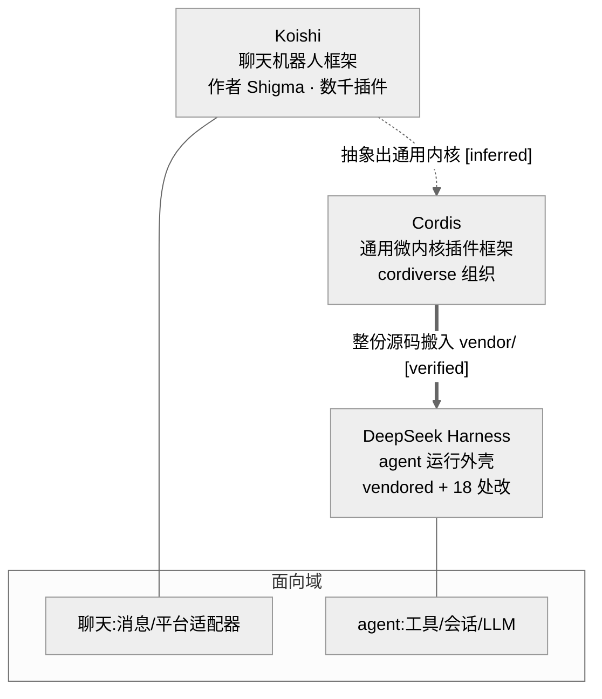
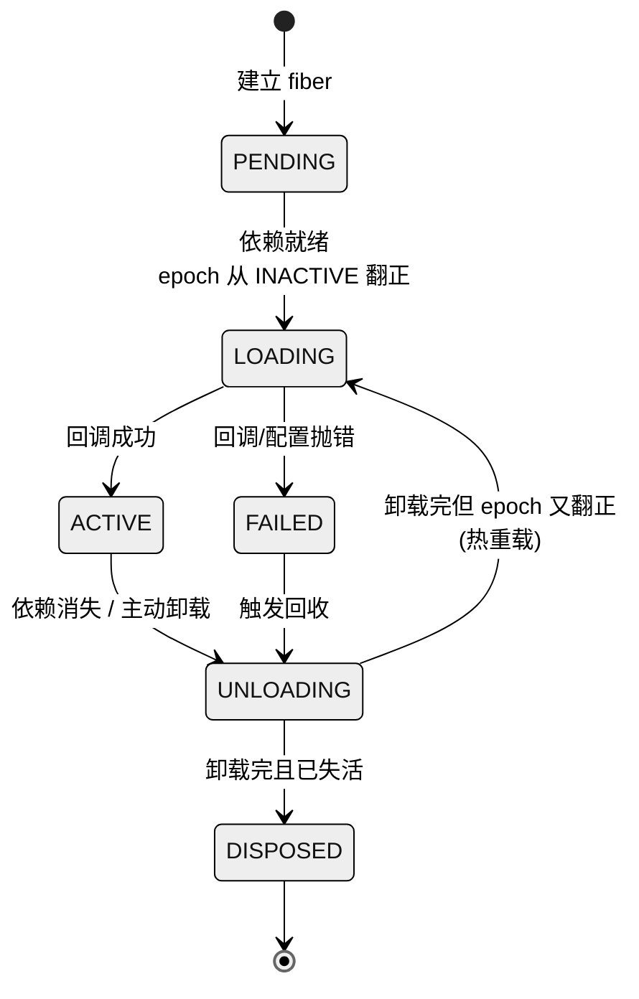
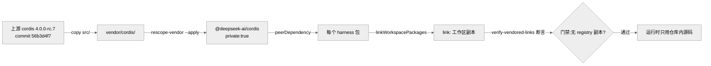
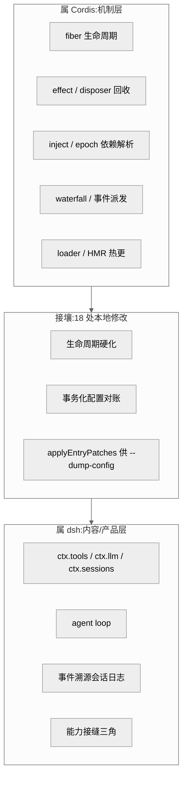

# 第 21 章 · 参考底座 Cordis 深度对比

> `dsh` 的第一句自我介绍是"一切皆插件"。但插件要能被挂载、被卸载、被热重载，背后必须先有一个"插件内核"在托底。这个内核不是 `dsh` 自己发明的，而是把一个已有的通用框架——**Cordis**——整份源码搬进仓库、再动了 18 处手术得来的。本章把这层底座单独拎出来:先讲清 Cordis 是什么、从哪来;再顺着 vendored 源码读它的核心机制;然后看 `dsh` 是怎么"收编"它的;最后用一张对比表划清"哪些能力属于 Cordis 这个通用底座、哪些才是 `dsh` 这个 agent 产品自己的加工"。
>
> 证据等级贯穿标注:`[verified]` 源码/LICENSE/官方 README 可证 · `[inferred]` 合理推断 · `[claimed]` 二手口径或未能证实。凡涉及血缘、归因的承重判断,一律以可查证据为准、明确标注证据等级并弱化措辞。

## 一、Cordis 是什么,又从哪来

先用一句大白话:Cordis 是一个 **TypeScript 写的"微内核插件框架"**。所谓微内核,意思是框架本体只保留最小的一套骨架——怎么装插件、怎么让插件之间找到彼此、怎么把插件干净地卸下来——其余一切能力都以插件形式外挂。它给出的核心抽象只有五个词:`Context`(上下文,插件的活动场所)、`Service`(服务,一个插件对外提供的能力)、`Plugin`(插件本身)、`fiber`(纤程,每个被挂载的插件在运行时对应的生命周期节点)、`effect`(副作用,插件所做的每一次可撤销的登记)。再加两个运维件:`loader`(声明式配置装载器,把一份 YAML 变成一棵插件树)和 HMR(热更新,改配置不重启进程)。

打个比方,微内核像一块**主板**:主板本身不会拍照、不会联网,它只提供插槽、供电和总线标准;摄像头、网卡都是插上去的卡。Cordis 就是这块主板,`ctx.<服务名>` 是插槽,`effect` 是"插上去后记得留一根拔线好回收"的约定。

**血缘**方面,能直接坐实的有两条。其一,vendored 目录里保留的原始 MIT LICENSE,版权人写的是 `Copyright (c) 2021-present Shigma` `[verified]`(`vendor/cordis/LICENSE:3`);Cordis 仓库归属 `cordiverse` 这个 GitHub 组织 `[verified]`(官方 README)。其二,聊天机器人框架 **Koishi**(一个拥有数千插件的成熟生态)的版权同样署名 `Shigma` `[verified]`(koishi 官方 README)。也就是说,Cordis 与 Koishi 出自同一位作者之手。社区里广泛流传的说法是:Cordis 是从 Koishi 里**抽象出来的那层通用内核**——Koishi 早年把"插件、服务、上下文"这套机制打磨成熟后,把与聊天无关的通用部分剥离成独立框架,就成了 Cordis。这条"抽象自 Koishi"的因果链,两家 README 并未逐字互相点名,故只能记为 `[inferred]`。

用户在委托时提到过一种说法——Cordis"原本由 Shaddoll(以太工坊)社区发起"。这一条我做了定向核实:cordis 与 koishi 两份官方 README、LICENSE 版权人、以及 `cordiverse` 组织信息中,**均未出现** "Shaddoll" 或 "以太工坊" 字样;能坐实的署名只有 `Shigma`。因此本章**未能证实此说法**,记为 `[claimed]`,不作为事实写入。(另需区分:`dsh` 早期曾依赖一个名为 `@earendil-works/pi-ai` 的包——"earendil"字面可联想到"以太",但这关乎 `dsh` 与 Pi 的渊源,与 Cordis 的出身是两码事,不宜混为一谈。)

图 21-1 血缘链:同一作者从聊天框架 Koishi 抽出通用内核 Cordis,dsh 再把 Cordis 整份 vendored 进来并特化为 agent 底座。实线为源码/LICENSE 可证,虚线"抽象自 Koishi"为社区共识的合理推断。

## 二、Cordis 核心机制源码剖析

Cordis 最值得读的是**生命周期**。每挂载一个插件,内核就为它建一个 `fiber`(纤程);`fiber` 用一个状态机描述"这个插件此刻活着没有"。vendored 源码里的状态枚举写得很直白:`PENDING`(等依赖的服务就绪)、`LOADING`(插件回调正在执行)、`ACTIVE`(已加载并对外提供服务)、`FAILED`(回调或配置抛错)、`UNLOADING`(正在跑卸载器)、`DISPOSED`(彻底销毁)`[verified]`(`vendor/cordis/src/fiber.ts:147-153`,含状态含义的 JSDoc 在 `:142-146`)。

图 21-2 fiber 生命周期状态机。关键在 UNLOADING 的两条出边:卸载完成后,若 epoch 又变有效则直接回到 LOADING(即"重载"),否则落到 DISPOSED。这正是"改配置不重启"的底层动作。

**依赖用 `inject` 声明,用 epoch 追踪。** 插件在 `inject` 里写明它需要哪些服务,`fiber` 只有当这些服务全部到位才会激活。内核为此维护一个 `epoch`(纪元)字符串:遍历 `inject` 里每个服务,把提供方 `fiber` 的 `uid` 拼进去,组成形如 `:12:8` 的纪元签名 `[verified]`(`fiber.ts:611-622`,拼接在 `:620`)。只要有一个依赖缺席,纪元就被打成 `INACTIVE` `[verified]`(`fiber.ts:617`)。`_setEpoch()` 一旦发现纪元从 `INACTIVE` 翻正,就启动 `_reload()`;反之从有效翻到失效,就启动 `_unload()` `[verified]`(`fiber.ts:625-639`)。用纪元而非布尔值的妙处在于:即便依赖被"换了一家提供方"(uid 变了),纪元签名随之变化,也能触发一次干净的重载。对使用者来说,这意味着**换底层实现无需手动重启上层插件**。

**每次登记都是可撤销的 effect。** 插件对外做的任何事——注册一个工具、监听一个事件、占用一个服务名——都要走 `ctx.effect()`,它返回一个"拔线"(disposer)`[verified]`(`fiber.ts` 的 `effect()` 实现约在 `:349-397`)。所有拔线登记在 `_disposables` 列表里 `[verified]`(`fiber.ts:203`);卸载时 `_unload()` 把整张列表清空并逐个执行拔线 `[verified]`(`fiber.ts:675-676`)。这就是"注册即 effect、卸载即解开"的机制保证。primer 的实践建议也据此而来:若卸载顺序重要,就把相关登记塞进同一个 effect,让它们成组解开 `[verified]`(`docs/cordis-primer.md:44`)。

**事件有四种派发模式。** primer 列了一张表:`emit`(观察,不等待、无返回)、`waterfall`(串行环绕、有返回)、`parallel`(并行、等待、无返回)、`serial`(串行、等待、有返回)`[verified]`(`cordis-primer.md:19-24`)。其中 `waterfall` 最特别——它是"环绕式中间件":每个监听器拿到 `(...参数, next)`,调 `next()` 就把(可能被自己改过的)结果交给下一环,不调 `next()` 就短路整条链 `[verified]`(`cordis-primer.md:28-34`)。这套语义正是 `dsh` 里工具管线、策略拦截能层层套娃的根基;内核自身也用它:配置解析走 `internal/config` waterfall `[verified]`(`fiber.ts:642`),更新走 `internal/update` waterfall `[verified]`(`fiber.ts:748`)。

**Loader 把 YAML 变成插件树,HMR 让它热更。** Loader 读一份 `cordis.yml`,声明式地把每一行(entry)挂成一个插件;HMR 监听源码与配置文件变化,改动时只重载受影响的子树,不重启进程。这两件事本身也是插件(`@cordisjs/plugin-loader`、`@cordisjs/plugin-hmr`),同样 vendored 在仓库里。

> **↔ 论文对应**：本节的 `fiber`、`ctx.effect`、epoch 依赖追踪，在《Spatiotemporal Composability》论文的实现章（§5）里逐字段对应理论构造——**Table 2**（理论↔实现对应）给出映射：一等 context $\Gamma_\infty$→`ctx`、$\mathrm{effect}_\Gamma$→`ctx.effect`、coeffect context $\Sigma/\Sigma^{iso}/\Sigma^{inter}$→`ctx[@@store]`/`[@@isolate]`/`[@@intercept]`（见 [Part IV 论文全解](../Part%20IV%20Foundational%20Paper/22-A-Programming-Paradigm-for-Spatiotemporal-Composability.md) §5，Table 2；逐条 dsh 映射另见 [Part IV 论文与 dsh 映射](../Part%20IV%20Foundational%20Paper/23-论文与dsh映射.md)）。epoch 则是论文 §4 依赖满足性谓词 $\gamma\vDash d_n$ 的工程落地 `[verified]`。

## 三、`dsh` 如何采用 Cordis

`dsh` 没有从 npm 装 Cordis,而是把 Cordis 内核及其 8 个配套包**整份源码复制进 `vendor/`**——连同 `cosmokit`、`schemastery`(配置校验)、`loader`、`include`、`group`、`timer`、`hmr`、`logger-console`,共 9 个 vendored 包 `[verified]`(`vendor/README.md` 清单表)。清单里逐一记着上游版本与 commit,例如 cordis 固定在 `4.0.0-rc.7`、commit `56b3d4f7…`,主体来自 `cordiverse/cordis` 的 `packages/core` `[verified]`(`vendor/README.md:17`)。

**为什么宁可 vendored 也不走 npm?** README 开门见山:这样"harness 就完全拥有自己的框架层——可审计、可打补丁、可锁版本" `[verified]`(`vendor/README.md:3`)。Cordis 本身还在 rc 阶段、API 未稳定(官方 README 明说"API 尚不稳定,可能无预警变更")`[verified]`,把它锁进仓库,就把"上游随时可能变脸"的风险挡在了门外。代价是要自己承担同步成本——这一点第五节再谈。

采用过程有三步关键动作。**第一,全部 rescope 到 `@deepseek-ai/*` 命名空间**:`cordis` → `@deepseek-ai/cordis`,`@cordisjs/plugin-loader` → `@deepseek-ai/cordis-plugin-loader`,并全部标 `private:true` `[verified]`(`vendor/README.md:5,17,49`)。README 给了两个理由:发布 harness 时这层框架会一并发布,若沿用上游原名等于在 npm 上抢注它们的包名 `[verified]`(`vendor/README.md:5`)。**第二,每个 harness 包把 `@deepseek-ai/cordis` 声明为 peerDependency**(外加 dev 依赖)`[verified]`(`CLAUDE.md` 约定节),再由 `pnpm-workspace.yaml` 的 `linkWorkspacePackages` 把保留的 semver 区间解析到这些锁定的工作区副本 `[verified]`(`vendor/README.md:5`)。**第三,用门禁上锁**:`verify-vendored-links` 会断言每个 vendored 名字在 `pnpm-lock.yaml` 里都解析成工作区 `link:`、且旁边没有 registry 副本 `[verified]`(`vendor/README.md:5`)。三步合起来,保证运行时用到的永远是仓库内那份被审计过的源码,而非 npm 上任何同名包。

图 21-3 vendored 采用链路。从上游复制、rescope、声明为 peerDependency、link 到工作区,最后由门禁断言"没有任何 npm 副本能混进来"。这条链把"框架层完全自持"从口号变成可执行的约束。

**18 处本地修改**,README 在 "Local modifications" 里逐条列全 `[verified]`(`vendor/README.md:33-50`)。它们并非零散补丁,而可归成八类:

- **生命周期硬化**(第 6 条):在 `cordis/src/fiber.ts` 关掉三处"重入卸载"的缝隙——effect 的持有者包装在 setup 跑之前就登记好、`UNLOADING` 期间拒绝创建新 effect(而 `PENDING`/`LOADING` 期仍合法)、子 fiber 在 `internal/plugin` 发布**之前**就注册父级持有的拔线 `[verified]`(`vendor/README.md:38`;对应 `fiber.ts:265`、`:302`、`:311-316`)。这些是并发卸载场景里最容易漏资源的地方。
- **事务化的 Loader/Include 配置对账**(第 8 条):改配置时"先导入新的、再销毁旧的",候选应用失败就回滚到旧插件/旧配置,并在生命周期结算后**重新检查**那些卡在依赖门上的 fiber `[verified]`(`vendor/README.md:40`)。这让"改一行配置"从"可能改坏了也不知道"变成"要么整体成功、要么整体回退"。
- **HMR 精确监听 + 防死锁**(第 9、12 条):`registerConfig()` 只精确监听那一个配置绝对路径;主监听器加 `ignoreInitial:true`,免得启动初扫把 boot 刚消费过的文件又当成新增,进而在初次应用中途触发重载、最终把 HMR 卸载和排队重载卡成死锁(那个 bug 会以退出码 13 且无诊断信息的方式发作)`[verified]`(`vendor/README.md:41,44`)。
- **回并上游的惰性配置解析**(第 15 条):移植上游 PR [cordiverse/cordis#41],保留 fiber 的**原始**配置,只有等声明的依赖激活后才经 `internal/config` 解析 `[verified]`(`vendor/README.md:47`)。这解决了"配置里引用了还没就绪的服务就会解析失败"的顺序难题。
- **Node 原生 TS 兼容**(第 4、10 条):显式标注被擦除的 import,免得 Node 的原生 TypeScript 转换把类型当成运行时导出 `[verified]`(`vendor/README.md:36,42`)。
- **JSDoc 上游化**(第 7 类,即第 7 条 modification):给公开成员补齐 `@param`/`@returns` 与契约文档,因为官网 API 生成器会渲染它们、且对无文档成员**硬报错** `[verified]`(`vendor/README.md:39`)。
- **`include` 提取纯函数 `applyEntryPatches` 并导出 `entryListSchema`**(第 11 条):把私有的打补丁逻辑抽成一个纯函数,让 `dsh --dump-config` **不启动插件树**就能组合并打印出 include 将要挂载的结果;并且逐条 `insert` 时就建索引,使同一列表里后续的 patch 能配置前面 insert 进来的行——修掉了上游"插入的行无法再被 patch"的毛病 `[verified]`(`vendor/README.md:43`)。
- **持久化的防抖写**(第 14 条):序列化配置文件写入,对 Windows 上 `EACCES`/`EBUSY`/`EPERM` 这类临时 rename 失败做有界退避重试,避免丢掉 `disabled` 状态 `[verified]`(`vendor/README.md:46`)。另有 schemastery 的 `exports` 映射修复 ESM/CJS 加载竞态 `[verified]`(`vendor/README.md:5`)。

其中第 11 条尤其能说明 `dsh` 的取向:它不是被动用 Cordis,而是**为 agent 场景的工具化需求主动改造** Cordis——把配置组合能力从"必须 boot 一棵树"降到"一个纯函数即可预览",这样 CLI 才能干跑 `--dump-config`。

**同步流程**也写进了 README:在上游工作区 `cordis-workspace`(本地检出于 `~/repos/cordis-workspace`)里,复制 `src/` 过来 → 重新贴上这 18 条本地修改 → 更新清单表的版本与 commit → 在仓库根跑 `pnpm install && test && build` `[verified]`(`vendor/README.md:52-60`)。

## 四、`dsh` ↔ Cordis 对比表

下面这张表是本章主干,把两者沿七个维度并列。读法:左列是 Cordis 作为**通用底座**天然具备的;右列是 `dsh` 作为 **agent harness 产品**在其上叠加或收窄的。

| 维度 | Cordis(通用微内核底座) | DeepSeek Harness(agent harness 产品) |
|---|---|---|
| 定位 | 与领域无关的插件框架,"Spatiotemporal Composability"元框架 `[verified]`(官方 README) | 专为编码/工具型 agent 打造的运行外壳,"一切皆插件"落到 agent 域 `[verified]`(`CLAUDE.md`) |
| 内核抽象 | `Context`/`Service`/`Plugin`/`fiber`/`effect` 五件套 `[verified]`(`cordis-primer.md:9-13`) | 完全沿用,不改内核抽象,只在其上定义**能力接缝**(Service Definition/Provider/Consumer 三角)`[verified]`(`CLAUDE.md`) |
| 扩展点 | 任意服务 + 四种事件派发模式,领域中立 `[verified]`(`cordis-primer.md:19-24`) | 收窄为 agent 专用服务:`ctx.tools`/`ctx.llm`/`ctx.sessions`/`ctx.agents` 等 `[verified]`(`cordis-primer.md:10,42`) |
| 生命周期/回滚 | fiber 六态机 + effect/disposer 成组回收 `[verified]`(`fiber.ts:147-153,675-676`) | 硬化重入卸载缝隙,并把 Loader/Include 配置改动做成**事务化对账**(失败整体回滚)`[verified]`(`vendor/README.md:38,40`) |
| 依赖解析 | `inject` 声明 + epoch 纪元追踪,依赖就绪才激活 `[verified]`(`fiber.ts:611-622`) | 沿用;并回并上游 PR#41 做**惰性配置解析**,依赖激活后才解析 config `[verified]`(`vendor/README.md:47`) |
| 配置/HMR | 声明式 loader + 精确 HMR 热更 `[verified]`(`cordis-primer.md:36-38`) | 精确 config 监听 + `ignoreInitial` 防死锁;抽 `applyEntryPatches` 供 `--dump-config` 干跑 `[verified]`(`vendor/README.md:41,43,44`) |
| 类型策略 | 依赖合并声明的 Typed Events;rc 阶段 API 未稳定 `[verified]` | 全 `strict`;`vendor/` 锁版本 pin 死,rescope 到 `@deepseek-ai/*` + `private:true` `[verified]`(`vendor/README.md:5`) |
| 面向域 | Koishi 谱系:聊天机器人/平台适配器 `[verified]`(koishi README) | 编码 agent:工具执行、会话溯源、LLM 流式、子 agent 委派 `[verified]`(`CLAUDE.md`) |

划清**边界**——谁属 Cordis、谁属 `dsh`:凡是"插件怎么挂/卸/热更、服务怎么被发现、事件怎么派发"这类**机制**,属于 Cordis;凡是"tools/llm/sessions 这些具体服务、agent loop、事件溯源会话日志、能力接缝三角"这类**内容与产品形态**,属于 `dsh`。18 条本地修改落在两者的接壤地带:它们改的是 Cordis 的机制(生命周期、配置对账),但改的**动机**全来自 `dsh` 的产品需求(工具干跑、Windows 持久化、agent 场景的并发卸载)。

图 21-4 边界划分。左块的机制属 Cordis,右块的服务与产品形态属 dsh,中间的 18 处修改改的是 Cordis 机制、动机却来自 dsh 需求——这正是"vendored 而非依赖"最能发力的地带。

## 五、启示与局限

**vendored 的代价是维护漂移。** 把上游整份锁进仓库,换来了可审计、可打补丁、可锁版本;但也意味着上游每往前走一步,`dsh` 都要走一遍那套"复制 → 重贴 18 条补丁 → 更新 commit → 跑测试构建"的同步流程 `[verified]`(`vendor/README.md:52-60`)。补丁越多,重贴越容易出错;版本 pin 得越久,与上游的差距越大。这是一笔需要持续偿还的维护债——README 把这 18 条要求"穷尽列全、每条注明动机与可退休条件",本身就是在给这笔债记账。

**通用性 vs 特化的取舍。** Cordis 追求领域中立,所以它的抽象刻意不带任何"agent"味道;`dsh` 则把这套中立机制往 agent 方向收窄——服务名固定成 `tools`/`llm`/`sessions`,事件语义绑定到工具管线与会话溯源。收窄带来表达力的聚焦,也意味着 `dsh` 的插件很难原样搬到别的 Cordis 应用上。这是产品化的必然代价,谈不上好坏。

**18 条本地修改也是一面镜子,照出上游此刻的不足。** 需要谨慎表述:这些修改**可能**指向 Cordis 在 rc 阶段尚未覆盖的场景——并发卸载的重入安全、配置对账的事务性、Windows 文件写的鲁棒性、以及"不 boot 就预览配置"这类工具化诉求。其中第 15 条明确是回并上游的一个 PR,第 6 条关掉的三处缝隙也带着"重入卸载"这类只有在高频热更场景才暴露的问题气味。换句话说,`dsh` 这类**把框架推到生产强度**的使用者,往往会先于上游踩到边角。这些补丁若最终回流上游(README 为第 7 条 JSDoc 就写了"上游化后即可退休"的退出条件),对 Cordis 生态也是净贡献。但要强调:以上是从修改清单反推的**倾向性判断**,不宜当作对上游质量的定论——rc 阶段本就以"接口未稳定"为前提,补丁多寡更多反映使用强度,而非简单的"好/坏"。

一句话收束:Cordis 给了 `dsh` 一块经得起审计的主板,`dsh` 则在这块主板上焊出了一台专门跑 agent 的机器。理解了这层"底座与产品"的分工,前面二十章里那些"一切皆插件"的设计,才算真正落到了地基上。
