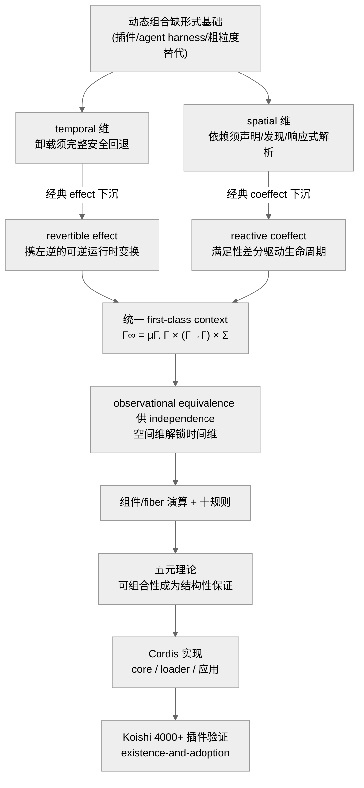
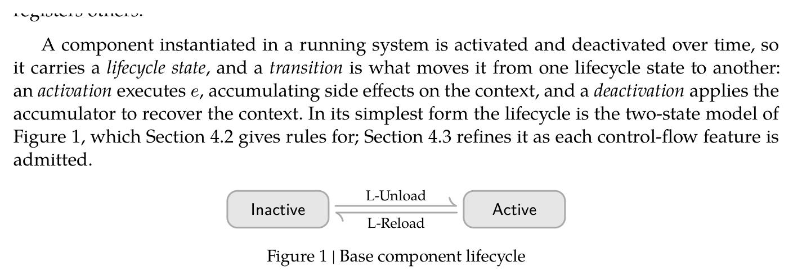
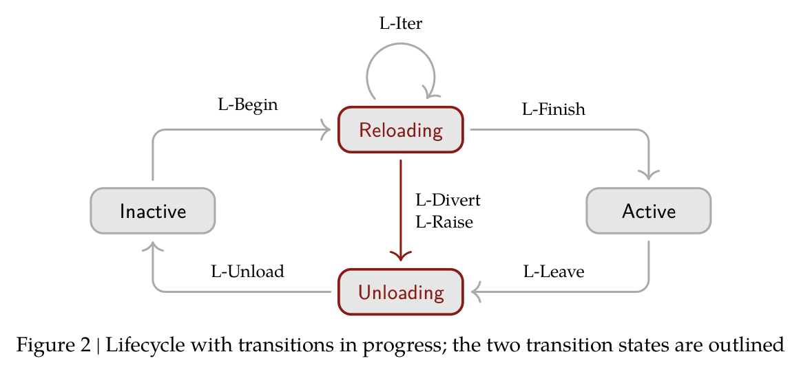
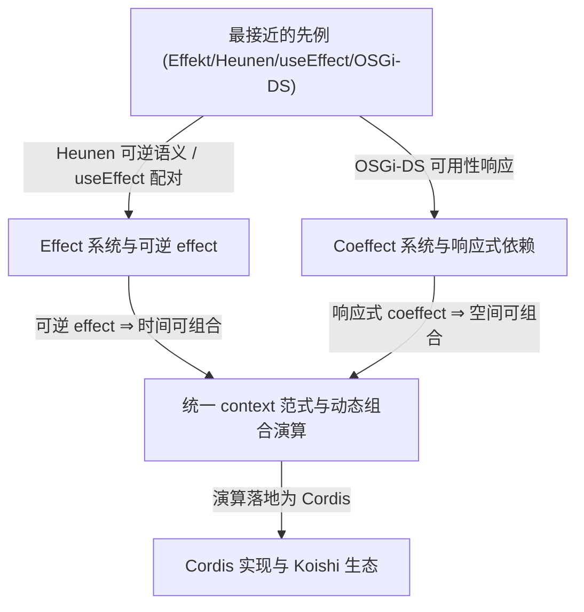

# A Programming Paradigm for Spatiotemporal Composability（时空可组合性的编程范式）

> **作者** Yifan Shi（施逸凡）、Wei Zhang、Tianyi Cui
> **机构** Peking University（北京大学）× DeepSeek-AI
> **发表** 预印本 · cordiverse/paper · Draft of Aug 13 2026（获取日 2026-08-17）
> **链接** [Preprint](https://github.com/cordiverse/paper) · [实现 Cordis](https://github.com/cordiverse/cordis)
> **被引** 预印本，暂无被引数据（引用图谱脚手架未抓取到 citing papers）

---

## 一、核心（Core）


### 1.1 一句话概括

把 effect / coeffect 从编译期静态注解「下沉」为运行时可逆机制，为动态组合建立时空可组合性的形式基础，并落地为 Cordis。

**两维度精确定义**（§1.1，全文的坐标轴）：

| 维度 | 要求 | 静态设定退化为 | effect/coeffect 对应 |
| --- | --- | --- | --- |
| **temporal（时间维）** | 组件移除时，它对共享环境的修改必须被完整、安全地反转（追踪每次资源分配/事件注册/状态变更，有序回收） | 词法作用域（RAII、bracket pattern） | **effect**（可逆运行时变换 + 左逆） |
| **spatial（空间维）** | 组件必须能以结构化、可验证的方式声明/发现/解析彼此依赖（管理依赖拓扑、随依赖变化协调生命周期） | 模块导入解析 | **coeffect**（响应式依赖解析） |

**贡献→章节速查**：revertible effects（§3.1）确立 local temporal、reactive coeffects（§3.2）确立 local spatial、统一 $\Gamma_\infty$ + observational equivalence（§3.3）供 independence、动态组合演算 + 元理论（§4）推到系统级、Cordis + Koishi（§5）工程落地。

### 1.2 核心贡献

1. **形式化 revertible effects（§3.1）**：每次 context 变换都携带显式逆元并由运行时 track，卸载时结构性地完整回收，确立 local temporal composability。
2. **形式化 reactive coeffects（§3.2）**：组件把依赖声明为 specification，context 每次变化都按 activating / deactivating / neutral 通知组件，确立 local spatial composability。
3. **统一 context 范式（§3.3）**：把 effect context 与 coeffect context 合成单一 context 类型 $\Gamma_\infty$，由 coeffect 上的 observational equivalence 赋予 effect 以 independence。
4. **动态组合演算（§4）**：以 component / fiber 为对象，给出生命周期的 operational semantics，元理论把时空可组合性从单组件推广到交错组件系统。
5. **Cordis 实现 + Koishi 案例（§5）**：core library（effect tracking + coeffect resolution）+ declarative loader（config reconciliation + HMR），并以 4000+ 插件的 Koishi 生产系统验证。

### 1.3 元信息表

| 项 | 内容 |
| --- | --- |
| 作者 | Yifan Shi、Wei Zhang、Tianyi Cui |
| 机构 | Peking University × DeepSeek-AI |
| 发表 | 预印本（cordiverse/paper）· Draft of Aug 13 2026 |
| 被引 | 预印本，暂无被引数据 |
| 链接 | [Preprint（cordiverse/paper）](https://github.com/cordiverse/paper) · [实现 Cordis](https://github.com/cordiverse/cordis) |

### 1.4 TL;DR

现代软件越来越依赖「运行时装卸组件」的动态组合（插件、自演化 agent harness），但其理论基础远不如静态组合成熟，实践只能退回到「重启进程 / 重建服务」这类粗粒度替代。本文识别出动态组合的两个正交维度——temporal（卸载时环境要能被完整、安全地回退）与 spatial（组件间依赖要能被声明、发现、响应式解析），并指出 effect / coeffect 正是描述这两个方向的工具。作者的关键动作是把二者从「编译期、词法固定作用域上的静态注解」下沉为运行时机制：effect 变成携带逆元的可逆变换，coeffect 变成响应式依赖解析，二者统一进一个 first-class context 类型。在此之上给出一套 component / fiber 演算并证明了 Preservation / Temporal / Spatial / Progress / Confluence 等元性质，最后以 Cordis 框架与 Koishi（4000+ 插件）落地验证。

### 1.5 论文骨架

论文正文 **§1–§8 后直接接 References**（无独立 Appendix），按真实章节结构：

- **§1 Introduction**：1.1 两维度（temporal / spatial）定义；1.2 三个动机例（VSCode 插件 87/100·7/100、自演化 agent harness、进程/服务粒度粗替代）；1.3 五条贡献。
- **§2 Preliminaries**：2.1 effect 系统、2.2 coeffect 系统、2.3 二者对偶关系。
- **§3 Revertible Effects & Reactive Coeffects（把 effect/coeffect 下沉运行时）**：
  - **§3.1 可逆 effect** 四级构造：`∘` 幺半群 → track/recover（Def.2/3/6、Thm.5/7）→ effect function $\mathfrak E_\Gamma/\mathfrak E^*_\Gamma$ 与 $\diamond$（Def.8/9/12、Thm.10/11/13/15/16）→ independence（Def.19、Thm.20、Cor.21）。
  - **§3.2 响应式 coeffect**：coeffect context $\Sigma$、get/set（Def.22/23）、satisfaction $\vDash$ 与 notify 三态（Def.25/26）、isolation $\Sigma^{iso}$ 与 interception $\Sigma^{inter}$（Def.28–31）。
  - **§3.3 the context paradigm**：统一 $\Gamma_\infty$（Def.32）、observational equivalence（Def.33–37、Lemma 35/38）、由 ≃ 供 independence（Def.39/41、Thm.40/42）、与 State monad / useEffect / Spring 的定位对照。
- **§4 A Calculus of Dynamic Composition**：4.1 component/fiber 七元组与 registry（Def.43–46）；4.2 base calculus（五规则）；4.3 transitions in progress（Withdrawal / Iteration / Asynchrony / Failure 四类精化，十条规则 = Table 1）；**4.4 metatheory 五定理**（Preservation Thm.59、Temporal = Recovery exactness Thm.61 + Terminal recovery Cor.62、Spatial = Ordering Thm.63 + Resolution coherence Thm.64、Progress Thm.66、Confluence Thm.73）。
- **§5 Implementation & Case Study**：5.1 core library（Algorithm 1–6）、5.2 component loader（声明式配置 + reconciliation + HMR，Algorithm 7–10）、5.3 Koishi 案例（4000+ 插件，existence-and-adoption）。
- **§6 Discussion**：6.1 System Boundary、6.2 Service Multiplexing、6.3 Access Control & Sandboxing、6.4 Language Independence、6.5 Mutual Dependencies、6.6 Dependency Typing & Versioning、6.7 Co-Design。
- **§7 Related Work**：7.1 effect/coeffect 系统、7.2 编程范式（COP/AOP）、7.3 temporal、7.4 spatial。
- **§8 Conclusion**：总结 + 把自演化 agent harness 列为下一个验证方向。

**一句话动线**：把 effect 提为携左逆的可逆运行时变换、coeffect 提为响应式依赖，统一进 first-class context $\Gamma_\infty$，再由 component/fiber 演算与元理论（五定理）把「局部可逆 + 局部响应式」推广到系统级；Koishi 4000+ 插件作 existence-and-adoption 论证（非对照）。**局限性**：非对照评估；in-memory 状态默认不跨 reload 存活；依赖仅名义链接、缺版本/结构类型；循环依赖使涉事组件永久 inactive。

### 1.6 抽象总结（核心要素与关键逻辑）

如果要用最短的话把这篇 88 页论文抽成一条逻辑链，它是这样的：**动态组合（运行时装卸组件）之所以一直缺乏形式基础，是因为描述它的两个正交维度——temporal（时间维：卸载时环境要能被完整、安全地回退）与 spatial（空间维：组件间依赖要能被声明、发现、响应式解析）——各自的理论工具（effect 与 coeffect）此前都只活在编译期、词法固定作用域上。论文的全部创造性动作，是把这对已有的对偶结构整体「下沉」到运行时，并证明下沉后可组合性不再是开发者纪律，而成为一条条结构性定理。**

**第一步——识别坐标轴。** 作者把「插件热插拔」「自演化 agent harness」「进程/服务级粗粒度替代」三个工程痛点，翻译成两个精确维度。temporal 在静态设定下退化为词法作用域（RAII / bracket pattern），spatial 退化为模块导入解析；而运行时装卸让两者都显著变难。关键洞察是：这两个维度恰好对应 PL 理论里已经存在半个世纪的一对对偶概念——effect（计算如何改变环境）与 coeffect（计算如何依赖环境）。

**第二步——把 effect/coeffect 下沉为运行时机制。** effect 从「类型上的静态注解」变成 **revertible effect**：每个原子变换 $f$ 携带一个显式左逆 $g$（只要求 $g\circ f=\mathrm{id}$），由运行时 track 进 accumulator，卸载时结构性地按 LIFO 完整回收——「完整环境恢复」从此是系统不变式。coeffect 从「执行前定死的 context 校验」变成 **reactive coeffect**：依赖被声明为 specification $d$，context 每次变化都按满足性差分分类为 activating / deactivating / neutral，直接驱动生命周期转移。二者的技术接缝是：coeffect 的 `set` 操作本身就是一个 effect function（$\mathfrak E^*$），因而「写依赖」天然继承可逆性。

**第三步——统一进 first-class context。** 把 effect context 变递归并与 coeffect context $\Sigma$ 结合，得到唯一的运行时 context 类型 $\Gamma_\infty:=\mu\Gamma.\,\Gamma\times(\Gamma\to\Gamma)\times\Sigma$。全文最抽象也最关键的一步在此：由 coeffect 上的 **observational equivalence**（≃）供给 effect 以 **independence**——异键操作天然独立（Thm.40），公共键 commutative 则独立（Thm.42）。这就是「时空可组合」名字的由来：**用空间维（依赖键是否不同/可交换）的可观测等价，去解锁时间维（effect）的独立性**。

**第四步——组件演算 + 五元理论把局部保证抬成系统级。** 以 component（三元组）与 fiber（七元组一次实例）为对象，用十条规则（Table 1，覆盖 Withdrawal / Iteration / Asynchrony / Failure 四类边角）刻画生命周期状态机；五条元理论定理——Preservation（保型）、Recovery exactness + Terminal recovery（时间可组合）、Ordering + Resolution coherence（空间可组合）、Progress（必达 quiescent）、Confluence（quiescent 态由最终配置唯一决定）——把「局部可逆 + 局部响应式」推广到任意交错的组件系统，可组合性至此成为**结构性保证**，并许可「把动态系统当静态装配来推理」。

**第五、六步——落地与验证。** Cordis 是「时空可组合性的 meta-framework」，三层架构（core library / component loader / 应用框架）把理论符号几乎 1:1 映射到 `ctx.*`/`fiber.*`（Table 2），HMR 因此免除开发者手写 acceptance boundary；Koishi（4000+ 插件、四年生产、web console 是第二个独立 Cordis 应用）作 existence-and-adoption 论证。

<div style="background: #ffffff !important; background-color: #ffffff !important; padding: 16px; border-radius: 8px; margin: 16px 0;" bgcolor="#ffffff">



</div>

**一句话本质**：把 effect / coeffect 这对经典对偶从编译期注解「下沉」为运行时的可逆变换与响应式依赖、统一进 first-class context $\Gamma_\infty$，再用组件演算与五条元理论把「局部可逆 + 局部响应式」证成「系统级时空可组合」，从而让动态组合的正确性从开发者纪律变为结构性保证，并以 Cordis / Koishi 落地验证。

---

## 二、具体（Specific）


### 2.1 Introduction & Preliminaries（背景 / 动机 / 预备）

<table>
<colgroup><col width="55%"><col width="45%"></colgroup>
<thead><tr><th>原文要点（提炼式中译）</th><th>解读 / 评论</th></tr></thead>
<tbody>
<tr><td>

组合是软件工程的基石，但传统组合是**静态**的（函数调用、模块导入、类继承在编译期定死）。现代软件越来越需要**动态组合**：组件在运行时被装载、卸载、重配置。插件架构与自演化 agent harness 都要求系统能安全地即时增删功能，然而当前实践只能退回到**粗粒度机制**——靠重启来重配置、丢弃运行时状态。

作者据此提出两个**正交维度**（§1.1）：
- **Temporal composability（时间维）**：组件移除时，它对共享环境的修改必须被完整、安全地反转；需追踪每一次资源分配、事件注册、状态变更，并保证有序回收。
- **Spatial composability（空间维）**：组件必须能以结构化、可验证的方式声明、发现、解析彼此依赖；需管理依赖拓扑并随依赖变化协调生命周期。

静态设定下，temporal 退化为词法作用域（RAII、bracket pattern），spatial 退化为模块导入解析；动态设定下两者都显著变难。

**Preliminaries（§2）**：effect system 把类型精化为「计算可能产生哪些副作用」（判断 $\Gamma \vdash t : T\,!\,\text{effect}$，源自 Lucassen & Gifford；Moggi 单子、Plotkin & Power 代数 effect、Plotkin & Pretnar handler）；coeffect system 对偶地精化 context，描述「计算需要环境提供什么」（Petricek 统一静态分析、graded 半环）。二者恰好对应上面两个维度。

**结论（原文）**：effect 描述「计算如何改变环境」、coeffect 描述「如何依赖环境」，但经典系统都是**静态工具**；动态组合要求把这些保证下沉到运行时。

</td><td>

作者把一个工程痛点（插件热插拔、agent 自改写）精准翻译成一对**已有理论词汇**（effect/coeffect），再指出这对词汇「只在编译期用」的空档——这是全文最漂亮的一步「问题重述」。它的说服力在于：动态组合不是新需求（OSGi、DI、HMR 都在做），缺的是**统一形式基础**。

隐含假设：把「可逆」当作 temporal 的充要刻画。现实里不少 effect（如已发出的网络请求）不可逆，作者在 §6.1 才补边界，此处 Introduction 读起来略显理想化。

**结论（评论）**：这是「用旧理论的对偶结构去接管新工程问题」的范式论文；预备知识铺得克制，effect/coeffect 的对偶性是后文统一 context 的伏笔。

</td></tr>
</tbody></table>

> **深化 · §2 Preliminaries——两条对偶脉络的精确铺垫**

论文 §2 只做一件事：把后文要 operationalize 的两组已有抽象及其记号钉牢。假定读者熟悉基础类型论与范畴论。

**effect 侧（§2.1）。** 在简单类型 λ 演算里判断 $\Gamma\vdash t:T$；**effect system** 把结果类型精化成"计算可能产生哪些副作用"，判断形如 $\Gamma\vdash t:T\,!\,\mathrm{effect}$。源头是 **Lucassen & Gifford**（引入区分 types/effects/regions 的 kinded 类型系统，为并行程序发现调度约束）。三条发展线：**monadic effects**——Moggi 用单子 $(T,\eta,\mu)$ 把 effectful 计算封为 $T(A)$（$\eta$ 抬纯值、$\mu$ 顺序化嵌套），Wadler 在 Haskell 普及，经典实例 Maybe/State/IO；**algebraic effects**——Plotkin & Power 证明代数操作决定单子，effect signature $\Sigma$ 声明一组操作（如 `get:()→S`、`put:S→()`），程序自由调用而不绑定解释；**effect handlers**——Plotkin & Pretnar 用带 delimited continuation $\kappa$ 的 handler 解释操作（`handle e with { op(v,κ) ↦ … }`，$\kappa$ 可被调用 0/1/多次，统一表达异常、协程、非确定），落地于 Koka / Eff / OCaml 5。

**coeffect 侧（§2.2）。** 对偶地，**coeffect system** 精化的是 context 而非类型，判断形如 $\Gamma\vdash t:T\,!\,\mathrm{coeffect}$——context 被标注上"计算向环境索取什么"（资源、权限、依赖的服务）。**comonadic coeffects**——Uustalu & Vene 首倡用共单子 $(D,\varepsilon,\delta)$ 结构化 context 依赖（$\varepsilon:D(A)\to A$ 取当前值、$\delta:D(A)\to D(D(A))$ 复制 context 供嵌套访问；Environment 共单子 $D(X)=E\times X$ 建模对固定环境的依赖、Stream 共单子 $D(X)=\mathbb N\to X$ 建模对时序数据的依赖），Petricek 在此之上把 coeffect 提为"context 依赖的统一静态分析"。**graded coeffects**——用预序半环 $\mathcal S=(S,\le,+,\times,0,1)$ 作 coeffect 代数，为每个变量绑定标注用量（0 未用、1 线性、$n$ 有界、$\infty$ 无限制），$\times$ 顺序复合、$+$ 并行复合，支撑资源追踪/敏感度分析/信息流控制；Gaboardi 把它与 graded effects 统一。

**对偶关系与"下沉"动机（§2.3）。** effect 描述"计算如何改环境"、coeffect 描述"环境如何约束计算"，恰对应动态可组合的两维：**temporal** 要 stateful effect 可逆（撤销一个变换 = 它得有逆元），**spatial** 要组件间依赖被声明并响应式管理（正是 coeffect 所捕获，管理 = 对着环境所供逐一解析）。但**经典系统都是静态工具**：effect 在词法固定作用域内追踪、由编译期 handler 讨清；coeffect 标注对着执行前定死的 context 校验。动态组合要求这些保证对"运行时才到/离场、且 context 持续演化"的组件成立——部署后加载的插件没有词法作用域可界定、运行时配置涌现的依赖没有编译期 context 可预知。**由此的视角转变**（也是全文的论文命题）：与其给静态类型系统加更多注解，不如**把 effect/coeffect 的概念结构 reify 成运行时可直接操作的类型**，在运行时动态地建立它们静态提供的保证——这正是 §3 把 typing context 变成 context type、把 effect 变成"变换 + 逆元"、把 coeffect 变成"携依赖信息的类型"的出发点。

**effect 三条发展线（§2.1）一览**（判断形如 $\Gamma\vdash t:T\,!\,\mathrm{effect}$，源头 Lucassen & Gifford 的 kinded 类型系统）：

| 发展线 | 代表 | 核心构造 | 一句话 |
| --- | --- | --- | --- |
| monadic effects | Moggi / Wadler | 单子 $(T,\eta,\mu)$，$\eta:A\to T(A)$ 抬纯值、$\mu:T(T(A))\to T(A)$ 顺序化 | 把 effectful 计算封为 $T(A)$；实例 Maybe/State/IO |
| algebraic effects | Plotkin & Power | effect signature $\Sigma$ 声明操作（`get:()→S`、`put:S→()`），程序自由调用不绑定解释 | 代数操作决定单子、接口与实现解耦 |
| effect handlers | Plotkin & Pretnar | `handle e with { op(v,κ) ↦ … }`，delimited continuation $\kappa$ 可调 0/1/多次 | 统一表达异常/协程/非确定；Koka/Eff/OCaml 5 |

**coeffect 两条发展线（§2.2）一览**（对偶地精化 context，判断形如 $\Gamma\vdash t:T\,!\,\mathrm{coeffect}$）：

| 发展线 | 代表 | 核心构造 | 一句话 |
| --- | --- | --- | --- |
| comonadic coeffects | Uustalu & Vene → Petricek | 共单子 $(D,\varepsilon,\delta)$，$\varepsilon:D(A)\to A$ 取值、$\delta:D(A)\to D(D(A))$ 复制 context | Environment 共单子 $D(X)=E\times X$、Stream 共单子 $D(X)=\mathbb N\to X$；Petricek 提为统一静态分析 |
| graded coeffects | Gaboardi et al. | 预序半环 $\mathcal S=(S,\le,+,\times,0,1)$ 作 coeffect 代数，标注用量（0/1/n/∞） | $\times$ 顺序、$+$ 并行复合；支撑资源追踪/敏感度/信息流；与 graded effects 统一 |

**§2.3 对偶关系 → 两维的精确映射**：

| 维度 | 由哪个概念捕获 | 静态版局限 | 本文的下沉动作 |
| --- | --- | --- | --- |
| temporal（时间维） | **effect**（尤 stateful effect） | 词法固定作用域内追踪、编译期 handler 讨清 | 变换 + 左逆、运行时 track（§3.1） |
| spatial（空间维） | **coeffect** | 对执行前定死的 context 校验 | 携依赖信息的类型、满足性变化驱动生命周期（§3.2） |

### 2.2 三个动机例（Motivating Examples，§1.2）

<table>
<colgroup><col width="55%"><col width="45%"></colgroup>
<thead><tr><th>原文要点（提炼式中译）</th><th>解读 / 评论</th></tr></thead>
<tbody>
<tr><td>

作者用三个例子坐实「两维度都缺」：

**① 插件系统 / VSCode（§1.2.1）**：
- _Temporal 缺陷_：所有扩展跑在共享的 extension host 里，无法在运行时卸载单个扩展的代码；一旦 `activate` 执行过，禁用/卸载就要**重启整个 host**。装机量前 100 的扩展里 **87 个含可执行代码**（2026-06-09 取自 Marketplace），移除都需重启；`deactivate` 钩子只是进程终止时的优雅关闭回调，且把 effect 释放与创建分离，违反 locality of concern。
- _Spatial 缺陷_：虽有 `extensionDependencies`，但前 100 中**仅 7 个**声明了对非内置扩展的依赖；`getExtension(...).exports` 返回值**无类型**（默认 `any`），依赖方拿不到受检接口。

**② 自演化 agent harness（§1.2.2）**：现代 AI agent 依赖运行时 harness（组合工具套件、管权限沙箱、维护会话状态、编排 subagent）。未来 harness 可能一边服务请求一边生成并部署对自身组件的修改；缺 temporal 会让每次自改写都全量重启、丢弃进程内状态（甚至可能禁用掉恢复所需的进程本身），缺 spatial 会让模块只能 ad hoc 适配依赖变化。

**③ 粗粒度替代（§1.2.3）**：OS 在**进程**粒度给 temporal、容器编排在**服务**粒度给 spatial；代价是每次重启丢弃缓存/连接/中间计算（重建需数秒到数分钟）、需冗余副本维持可用性，且容器级编排无法表达共享地址空间内的组件依赖、还引入本可为本地调用的网络开销。

**结论（原文）**：两维度的缺失普遍存在于插件系统，且粒度失配呼唤一个「与组件同粒度」管理 effect 与依赖的组合抽象。

</td><td>

**87/100 与 7/100 是全文最有杀伤力的两个经验数字**：前者量化 temporal 缺陷（绝大多数扩展根本没法热卸载），后者量化 spatial 缺陷（依赖机制几乎没人用、且无类型）。用一个人尽皆知的 VSCode 做靶子，说服成本极低。

把「自演化 agent harness」列为二号动机，是本文的时代嗅觉：它把一个 PL/系统问题接到了当下最热的 agent 叙事上，也为 §8「未来验证方向」埋了扣。但要注意——**agent harness 在本文里只是动机与未来工作，并无实验**，真正验证的是 Koishi。

**结论（评论）**：动机层扎实且可证伪（数字可复查）；agent 叙事是加分项而非证据，读者不应把它误读为已验证场景。

</td></tr>
</tbody></table>

> **深化 · 三个动机例的精确论点与"两维度 × 三例"对照**

论文用三例把"两维度都缺"钉死，每例的**精确论点**值得单列：

- **① VSCode / 插件系统（§1.2.1）**——_temporal_：所有扩展跑在**共享 extension host**，运行时无法卸载单个扩展的代码；`activate` 一旦执行，禁用/卸载就要**重启整个 host**（前 100 扩展里 **87 个含可执行码**、移除都需重启，2026-06-09 取自 Marketplace）。`deactivate` 钩子只是**进程终止时的优雅关闭回调**，且**把 effect 释放与创建分离**、违反 locality of concern（作者据此论证"手写清理"本质不可靠）。_spatial_：虽有 `extensionDependencies`，但前 100 中**仅 7 个**声明对非内置扩展的依赖；`getExtension(...).exports` 返回**无类型**（默认 `any`），依赖方拿不到受检接口。
- **② 自演化 agent harness（§1.2.2）**——现代 AI agent 依赖运行时 harness（组合工具套件、管权限沙箱、维护会话状态、编排 subagent）。未来 harness 可能一边服务请求一边生成并部署对**自身组件**的修改。缺 temporal：每次自改写全量重启、丢弃进程内状态——甚至**可能禁用掉恢复所需的进程本身**（作者点出的最尖锐后果）。缺 spatial：模块只能 ad hoc 适配依赖变化。注意：这在本文里是**动机与未来工作**（§8），Koishi 才是实验对象。
- **③ 粗粒度替代（§1.2.3）**——OS 在**进程**粒度给 temporal、容器编排在**服务**粒度给 spatial。代价三条：每次重启丢弃缓存/连接/中间计算（重建需**数秒到数分钟**）；需**冗余副本**维持可用性；且容器级编排**无法表达共享地址空间内的组件依赖**、还把本可为本地调用的交互变成**网络开销**。核心矛盾是**粒度失配**——呼唤一个"与组件同粒度"管理 effect 与依赖的抽象。

| 例子 | temporal 缺陷（时间维） | spatial 缺陷（空间维） | 量化/代价 |
| --- | --- | --- | --- |
| VSCode 插件 | 无法热卸载单扩展、须重启 host | 依赖机制几乎没人用、且无类型 | 87/100 含可执行码；7/100 声明依赖 |
| agent harness | 自改写全量重启、丢状态、或禁用恢复所需进程 | 模块只能 ad hoc 适配依赖变化 | 未来工作（非实验） |
| 粗粒度替代 | 重启丢缓存/连接/中间计算 | 容器编排表达不了共享地址空间依赖 | 重建数秒到数分钟 + 冗余副本 + 网络开销 |

### 2.3 Method（方法：从可逆 effect 到动态组合演算）

> _方法横跨 §3（把 effect/coeffect 提为运行时机制）与 §4（动态组合演算）。按四子节展开：2.3.1 可逆 effect、2.3.2 响应式 coeffect、2.3.3 统一 context 与 observational equivalence、2.3.4 动态组合演算（含两张生命周期图与 Table 1）。_

#### 2.3.1 Revertible Effects（可逆 effect，§3.1）

<table>
<colgroup><col width="55%"><col width="45%"></colgroup>
<thead><tr><th>原文要点（提炼式中译）</th><th>解读 / 评论</th></tr></thead>
<tbody>
<tr><td>

核心建模：把一个 effect 建模为函数 $f:\Gamma\to\Gamma\times(\Gamma\to\Gamma)$——作用于当前 context，返回**被修改的 context** 以及**一个显式逆元**。提供逆元让 effect 可被反转，把逆元交回运行时让 effect 可被 track。Γ→Γ 在复合 ∘ 下构成幺半群（闭合=顺序复合仍是 effect、结合律=复合与括号无关、单位元= $\mathrm{id}_\Gamma$）。

**逆元的一侧性**：$g$ 是 $f$ 的**左逆**（约束是 $g\circ f$，绝不是 $f\circ g$）。成对变换带自己的乘法——

$$(f_1,g_1)\diamond(f_2,g_2):=(f_1\circ f_2,\; g_2\circ g_1)$$

（twisted composition，Def.1）：左操作数后作用，逆元以相反顺序累积。

**effect context（Def.2）**：$\partial\Gamma:=\Gamma\times\mathfrak F_\Gamma$，一个状态是 $(\gamma,\varphi)$，其中 $\varphi$ 是**累积逆元**（accumulator）。

**track（Def.3）**：$\mathrm{track}_\Gamma(f,g)=(\gamma,\varphi)\mapsto(f(\gamma),\varphi\circ g)$——用 $f$ 变换 $\gamma$、把逆元 $g$ 复合进 $\varphi$。Thm.5 证明 $\mathrm{track}_\Gamma$ 是从成对变换幺半群到 $\partial\Gamma\to\partial\Gamma$ 的**幺半群同态**（单位映单位、复合映复合）。配套 recover（Def.6）把 tracked effect 一路带回初始 context（Thm.7）。§3.1.2 进一步放宽为「逆元由 caller 在应用点给出」的 effect function $\mathfrak E_\Gamma$，用 $\diamond$ 复合（Def.9），$\mathrm{effect}_\Gamma$ 把它 lift 到 $\partial\Gamma$（Def.12）。§3.1.3 用 independence 保证互不干扰的 effect 可任意交错。

**子结论（原文）**：只要每个原子 effect 携带一个左逆，复合 effect 的逆由 $\diamond$ 结构性导出，**完整环境恢复就成了系统不变式而非开发者纪律**。

</td><td>

这一节是全文的数学心脏。关键洞见有两层：（1）把「副作用」重述为「context 变换 + 逆元」，于是「撤销」从 handler 语义变成**幺半群里的逆元累积**；（2）$\mathrm{track}$ 是幺半群同态——这保证了「先追踪再恢复」与「直接恢复」等价，是后文 LIFO 恢复正确性的代数根基。

与 React `useEffect` 对比（作者在 §7.3 点明）：useEffect 也把 effect 与 cleanup 配对，但不可嵌套、不可组合出复合逆；本文的 $\diamond$ 让「用已有 effect 拼新 effect 不必再写逆元」。

**只要求左逆（one-sided）而非双侧逆**是务实取舍：现实 effect 常不可完美还原，左逆 $g\circ f=\mathrm{id}$ 只保证「从当前态回到起点」，够用且门槛更低。

**子结论（评论）**：真创新在「把可逆性下沉到运行时、且只要求原子左逆」；相比 Heunen 的全局双侧可逆（denotational），这更接地气。

</td></tr>
</tbody></table>

> **深化 · §3.1 的四级构造（逐级读懂"可逆 effect"）**

论文 §3.1 不是一个定义，而是一条**从"给定逆元"到"运行时按状态给逆元"再到"可交错撤销"的上升链**。把这条链拆成四级，每一级都在补上一级的漏洞：

| 级 | 类型/构造 | 补上的漏洞 | 关键定理 |
| --- | --- | --- | --- |
| 0 | $\Gamma\to\Gamma$，`∘` 幺半群 | 把副作用变成代数对象 | 幺半群三公理 |
| 1 | track/recover 于 $\partial\Gamma=\Gamma\times\mathfrak F_\Gamma$ | 逆元先验给定、可追踪可恢复 | Thm.5（同态）、Thm.7（精确恢复） |
| 2 | $\mathfrak E_\Gamma/\mathfrak E^*_\Gamma$、$\diamond$、$\mathrm{effect}$ | 逆元改由 caller 在应用点给、可选择性撤销 | Thm.10/11/13/15 |
| 3 | independence（Def.19） | 跨组件交错撤销、任意序 | Thm.20、Cor.21 |

**第 0 级：effect = context 变换，`∘` 下的幺半群。** 一个 effect 就是 $\Gamma\to\Gamma$ 的一个变换；顺序执行两个 effect 仍是 effect（closure）、复合与括号无关（associativity）、$\mathrm{id}_\Gamma$ 是单位元（identity）。这一步把"副作用"从操作直觉搬进代数对象，为后面"撤销 = 找逆元"铺路。

**第 1 级：track / recover（逆元先验给定）。** 为让 effect 可撤销，把每个正向变换 $f$ 配一个**左逆** $g$（论文强调只要 $g\circ f=\mathrm{id}$，**从不要求** $f\circ g=\mathrm{id}$——现实 effect 常无法完美还原，单侧逆门槛更低且够用）。pair 自带乘法：

$$(f_1,g_1)\circ(f_2,g_2):=(f_1\circ f_2,\; g_2\circ g_1)\quad(\text{Def.1，twisted composition})$$

左操作数后作用、逆元以相反顺序累积，使 $(\Gamma\to\Gamma)\times(\Gamma\to\Gamma)$ 成为**twisted composition monoid** $\mathfrak T_\Gamma$（正向 monoid 与其 opposite 的积，单位 $(\mathrm{id}_\Gamma,\mathrm{id}_\Gamma)$）。为把逆元"存进 context 自己"，定义 **effect context**（Def.2）

$$\partial\Gamma:=\Gamma\times\mathfrak F_\Gamma,\qquad \mathfrak F_\Gamma:=\Gamma\to\Gamma$$

一个状态是 pair $(\gamma,\varphi)$：$\gamma$ 是当前 context，$\varphi$ 是 **accumulator**（迄今所有逆元的复合，也就是"把 context 拉回初态"的那个函数）；初态是 $(\gamma_0,\mathrm{id}_\Gamma)$。论文还记 $\partial^2\Gamma=\partial\Gamma\times(\partial\Gamma\to\partial\Gamma)$，一路往上叠成塔。**track**（Def.3）$\mathrm{track}_\Gamma(f,g)=(\gamma,\varphi)\mapsto(f(\gamma),\varphi\circ g)$ 把一次 effect 记进 context；**recover**（Def.6）$\mathrm{recover}_\Gamma=(\gamma,\varphi)\mapsto(\varphi(\gamma),\mathrm{id}_\Gamma)$ 一次性回滚并复位 accumulator。两条核心定理：**Thm.5** $\mathrm{track}_\Gamma$ 是从 $\mathfrak T_\Gamma$ 到 $\partial\Gamma\to\partial\Gamma$ 的**幺半群同态**（单位映单位、复合映复合）；**Thm.7** 只要 $g(f(\gamma))=\gamma$，就有 $\mathrm{recover}_\Gamma(\mathrm{track}_\Gamma(f,g)(\gamma,\varphi))=\mathrm{recover}_\Gamma(\gamma,\varphi)$——"先追踪再恢复"与"直接恢复"等价。论文把 $\varphi(\gamma)=\gamma_0$ 命名为一个状态的 **soundness invariant**（健全性不变式）。

**第 2 级：effect function $\mathfrak E_\Gamma$ / $\mathfrak E^*_\Gamma$（逆元在应用点由 caller 给出）。** track 的短板是"$g$ 在见到任何状态前就定死了"，而现实中逆元要到 effect 真正施加的那一刻才知道。于是升级两端（Def.8）：

$$\mathfrak E_\Gamma:=\Gamma\to\Gamma\times(\Gamma\to\Gamma),\qquad \mathfrak E^*_\Gamma:=\{\,e\in\mathfrak E_\Gamma \mid \forall\gamma.\ (\delta,g)=e(\gamma)\Rightarrow g(\delta)=\gamma\,\}$$

$e(\gamma)$ 返回"新 context $\delta$ + 本次施加处的逆元 $g$"；strict 版 $\mathfrak E^*_\Gamma$ 额外带**witness**：约束 $g(\delta)=\gamma$ 只钉在"施加点"（其余状态 $g$ 自由）。因 $\mathfrak E_\Gamma$ 不再是自同态、不能直接 `∘` 复合，定义 **effect composition**（Def.9）$f\diamond g$：先跑 $g$ 得 $(\delta,s)$、再跑 $f$ 得 $(\varepsilon,t)$、返回 $(\varepsilon,s\circ t)$。**Thm.10** 说 $(\mathfrak E_\Gamma,\diamond)$ 是幺半群（单位 $\eta_\Gamma=\gamma\mapsto(\gamma,\mathrm{id}_\Gamma)$），且 $\mathfrak T_\Gamma\to\mathfrak E_\Gamma$ 是同态；**Thm.11** witness 在 $\diamond$ 下存活（$\mathfrak E^*_\Gamma$ 是子幺半群）。最后 **effect**（Def.12）$\mathrm{effect}_\Gamma:\mathfrak E_\Gamma\to\partial\Gamma\to\partial^2\Gamma$ 把 effect function 抬到 effect context 上（"撤销一个 effect"本身又是一个 effect，其逆就是"再做一次"$\mathrm{pr}_1\circ e$）；**Thm.13** $\mathrm{effect}_\Gamma$ 保 $\diamond$，**Thm.15** 精确算出提升后逆元返回 $(\gamma,\varphi\circ g\circ f)$——状态被精确恢复，且 soundness invariant 恒被保持。

为何要在**输入、输出两侧同时增强**（§3.1.2 的动机，也是从 track 到 $\mathfrak E$ 的必要一跃）：

1. **输入侧**——track 的 $g$ 在见任何状态前就定死，一个 $g$ 得服务所有状态；现实中逆元要到 effect 真正施加时才知道，故把类型改为 $\Gamma\to\Gamma\times(\Gamma\to\Gamma)=\Gamma\to\partial\Gamma$，逆元在**应用点**随 $\delta$ 一并返回。
2. **输出侧**——recover 是 all-or-nothing、无法选择性只撤一个 effect 而留其他；故把输出也改为返回逆元 $\partial\Gamma\to\partial\Gamma\times(\partial\Gamma\to\partial\Gamma)=\partial\Gamma\to\partial^2\Gamma$，于是"撤一个、留其余"可行。两侧增强保持了输入输出的结构一致，才使 track 的数学性质（同态、精确恢复）能在新类型上重新成立。这也是论文写 $\partial^2\Gamma=\partial\Gamma\times(\partial\Gamma\to\partial\Gamma)$"一路往上叠成塔"的由来，而 $\Gamma_\infty$（§3.3）正是把这座塔收成一个自相似不动点。

> 记号提示：Def.1 的 **pair 复合**论文记作 `∘`（构成 $\mathfrak T_\Gamma$），到 effect function 层复合算子才记作 `⋄`（Def.9）；二者是不同层级的复合。本报告 §2.3.1 概览表为简洁曾把 pair 复合也写作 $\diamond$，此处按论文原记号厘清。

**第 3 级：independence（§3.1.3，跨组件交错撤销）。** 前面只保证"按 LIFO 顺序撤销一个组件自己的 effect"（Thm.16 无条件成立）。但卸载一个运行中的组件，等于"在别的 effect 还在场时跑某个逆元"，或"一条序列交错着好几个组件的 effect"——逆元会在被外来 effect 移动过的状态上执行。它是否仍撤销自己那份，取决于**交换性**。论文先定义每个 effect 的 transformation monoid $\mathfrak M(e)$（Def.17，由正向图与它 yield 的所有逆元生成），再给 **independence**（Def.19）：$e_1,e_2$ 独立当 (1) 一方的每个变换与另一方的每个变换交换（$\forall f\in\mathfrak M(e_1),g\in\mathfrak M(e_2).\ f\circ g=g\circ f$），且 (2) 一方的变换不扰动另一方 yield 的逆元。**Thm.20 + Cor.21**：pairwise independent 的 $e_1,\dots,e_n$，其 $n$ 个逆元**可按任意排列顺序**在末态施加而都回到 $\gamma_0$——这正是"卸载 A 不扰动 B、卸载顺序可任意"的代数根据。论文点破分工：**可交换的部分交给 effect**（组件想怎么排就怎么排、撤销顺序随系统方便，Cor.21），**不可交换的部分交给 coeffect**——组件内由 accumulator 强制 LIFO（Thm.16），跨组件由声明的 coeffect 强制"提供先于依赖满足"（§3.2.2）。independence 从何而来？§3.3.2 用 observational equivalence 供给（见 §2.3.3）。

**这四级合起来就是 revertible effects**：每个 $\mathfrak E^*_\Gamma$ 显式携左逆、$\mathrm{effect}$ 把逆元 track 到 $\partial\Gamma$、$\diamond$ 复合时保可逆性，交付 **local temporal composability**（"局部"指保证只就单组件自己的 effect 而言）。装载组件 = 施加这样一串 effect 并把逆元累进 $\varphi$；卸载 = 施加 $\varphi$。

**§3.1 定理链一览**（每条各钉一个"复合/恢复的正确性"环节）：

| 定理 | 陈述 | 作用 |
| --- | --- | --- |
| Thm.4 | $\mathrm{pr}_1\circ\mathrm{track}_\Gamma(f,g)=f\circ\mathrm{pr}_1$ | track 的正向部分就是 $f$（图交换） |
| Thm.5 | $\mathrm{track}_\Gamma$ 是 $\mathfrak T_\Gamma\to(\partial\Gamma\to\partial\Gamma)$ 的幺半群同态 | "先追踪再恢复"与"直接恢复"等价的根基 |
| Thm.7 | $g(f(\gamma))=\gamma\Rightarrow\mathrm{recover}\circ\mathrm{track}=\mathrm{recover}$ | 单次 tracked effect 后 recover 精确 |
| Thm.10 | $(\mathfrak E_\Gamma,\diamond)$ 是幺半群、$\mathfrak T_\Gamma\to\mathfrak E_\Gamma$ 同态 | effect function 层的复合结构 |
| Thm.11 | $\mathfrak E^*_\Gamma$ 是 $\mathfrak E_\Gamma$ 的子幺半群 | witness 在 $\diamond$ 下存活 |
| Thm.13 | $\mathrm{effect}(f)\diamond\mathrm{effect}(g)=\mathrm{effect}(f\diamond g)$ | $\mathrm{effect}$ 保 $\diamond$ |
| Thm.15 | 提升逆元返回 $(\gamma,\varphi\circ g\circ f)$；$g\circ f=\mathrm{id}$ 时连 accumulator 也复原 | 精确恢复 + soundness invariant 恒保 |
| Thm.16 | 一串 $\mathfrak E^*$ 按 LIFO 反转**无需任何前提** | 组件内自恢复 |
| Thm.20 + Cor.21 | pairwise independent 的逆元可**任意排列序**反转回 $\gamma_0$ | 跨组件交错卸载的正确性 |

> **深化 · §3.1 定义与定理完整陈述（据 pdf.txt 原文，编号对齐）**

为满足「承重定义/定理给完整陈述」的要求，下面把 §3.1 的关键 Definition 与全部 Theorem 逐条以形式化转述 + 公式列出（陈述其命题内容与前提，逐步证明见 PDF §3.1）。

- **Def.1（twisted composition，式 4）**：成对 context 变换的扭合复合 $(f_1,g_1)\circ(f_2,g_2):=(f_1\circ f_2,\;g_2\circ g_1)$。左操作数后作用、逆元以相反序累积；它使 $(\Gamma\to\Gamma)\times(\Gamma\to\Gamma)$ 成为以 $(\mathrm{id}_\Gamma,\mathrm{id}_\Gamma)$ 为单位的幺半群——即正向变换幺半群与其 opposite 的积，称 **twisted composition monoid** $\mathfrak T_\Gamma$。
- **Def.2（effect context，式 5）**：$\partial\Gamma:=\Gamma\times(\Gamma\to\Gamma)$，一个状态 $(\gamma,\varphi)$ 中 $\gamma$ 是当前 context、$\varphi$ 是 **accumulator**（迄今所有逆元的复合、把 context 拉回初态的函数）；初态 $(\gamma_0,\mathrm{id}_\Gamma)$。并记 $\partial^2\Gamma=\partial\Gamma\times(\partial\Gamma\to\partial\Gamma)$ 一路叠塔。
- **Def.3（track，式 6）**：$\mathrm{track}_\Gamma=(f,g)\mapsto(\gamma,\varphi)\mapsto(f(\gamma),\varphi\circ g)$——用 $f$ 变换 $\gamma$、把候选逆元 $g$ 复合进 $\varphi$，从而把 $f$ 的 effect 记进 context。
- **Def.6（recover，式 9）**：$\mathrm{recover}_\Gamma=(\gamma,\varphi)\mapsto(\varphi(\gamma),\mathrm{id}_\Gamma)$——把 $\varphi$ 施加于当前态并复位 accumulator。论文把 $\varphi(\gamma)=\gamma_0$ 命名为一个状态的 **soundness invariant**。
- **Def.8（effect function，式 12）**：$\mathfrak E_\Gamma:=\Gamma\to\Gamma\times(\Gamma\to\Gamma)$；witnessed 版 $\mathfrak E^*_\Gamma$ 额外要求对每个 $\gamma$，$(\delta,g)=e(\gamma)\Rightarrow g(\delta)=\gamma$（逆元只钉在施加点、其余状态自由）。一个满足 $g\circ f=\mathrm{id}_\Gamma$ 的 $(f,g)$ 经 $(f,g)\mapsto\gamma\mapsto(f(\gamma),g)$ 诱导出 $\mathfrak E^*_\Gamma$ 的元素。
- **Def.9（effect composition，式 13）**：$f\diamond g:=\gamma\mapsto\mathbf{let}\,(\delta,s)=g(\gamma)\,\mathbf{in}\,\mathbf{let}\,(\varepsilon,t)=f(\delta)\,\mathbf{in}\,(\varepsilon,s\circ t)$——先跑 $g$ 再跑 $f$，逆元反序复合。
- **Def.12（effect，式 14）**：$\mathrm{effect}_\Gamma:\mathfrak E_\Gamma\to\partial\Gamma\to\partial^2\Gamma$，$\mathrm{effect}_\Gamma=e\mapsto(\gamma,\varphi)\mapsto\mathbf{let}\,(\delta,g)=e(\gamma)\,\mathbf{in}\,((\delta,\varphi\circ g),\ \mathrm{track}_\Gamma(g,\mathrm{pr}_1\circ e))$——把 effect function 抬到 effect context 上（撤销一个 effect 本身又是一个 effect，其逆是「再做一次」$\mathrm{pr}_1\circ e$）。
- **Def.17（transformation monoid，式 17）**：$\mathfrak M(e):=\langle\{\mathrm{pr}_1\circ e\}\cup\{\mathrm{pr}_2(e(\gamma))\mid\gamma\in\Gamma\}\rangle$——由 $e$ 的正向图与它在所有状态 yield 的逆元生成的 $\Gamma\to\Gamma$ 子幺半群。
- **Def.19（independence，式 18/19）**：$e_1,e_2\in\mathfrak E_\Gamma$ 独立当 (1) $\forall f\in\mathfrak M(e_1),g\in\mathfrak M(e_2).\ f\circ g=g\circ f$，且 (2) 一方的变换不扰动另一方 yield 的逆元（$\forall g\in\mathfrak M(e_2),\gamma.\ \mathrm{pr}_2(e_1(g(\gamma)))=\mathrm{pr}_2(e_1(\gamma))$，及交换 $e_1,e_2$ 的对称条件）。族 $(e_l)$ pairwise independent 当任两 $l\ne l'$ 独立；把 $e$ 与自身独立即 $\mathfrak M(e)$ 交换。

**§3.1 全部定理（完整陈述）**：

- **Thm.4**：$\forall(f,g).\ \mathrm{pr}_1\circ\mathrm{track}_\Gamma(f,g)=f\circ\mathrm{pr}_1$（图交换——track 的正向部分就是 $f$）。
- **Thm.5**：$\mathrm{track}_\Gamma$ 是从 $\mathfrak T_\Gamma$ 到 $\partial\Gamma\to\partial\Gamma$ 的**幺半群同态**：(1) $\mathrm{track}_\Gamma(\mathrm{id}_\Gamma,\mathrm{id}_\Gamma)=\mathrm{id}_{\partial\Gamma}$；(2) $\mathrm{track}_\Gamma((f_1,g_1)\circ(f_2,g_2))=\mathrm{track}_\Gamma(f_1,g_1)\circ\mathrm{track}_\Gamma(f_2,g_2)$。
- **Thm.7**：$\forall(\gamma,\varphi)\in\partial\Gamma$ 与 $g(f(\gamma))=\gamma$ 的 $(f,g)$，$\mathrm{recover}_\Gamma(\mathrm{track}_\Gamma(f,g)(\gamma,\varphi))=\mathrm{recover}_\Gamma(\gamma,\varphi)$（先追踪再恢复 = 直接恢复）。满足 $g\circ f=\mathrm{id}$ 的 pair 在每个状态都满足前提。
- **Thm.10**：effect composition 把 $\mathfrak T_\Gamma$ 的幺半群结构搬到 $\mathfrak E_\Gamma$：(1) $(\mathfrak E_\Gamma,\diamond)$ 是以 $\eta_\Gamma=\gamma\mapsto(\gamma,\mathrm{id}_\Gamma)$ 为单位的幺半群；(2) $(f,g)\mapsto\gamma\mapsto(f(\gamma),g)$ 是 $\mathfrak T_\Gamma\to\mathfrak E_\Gamma$ 的幺半群同态。
- **Thm.11**：witness 在 $\diamond$ 下存活：(1) $\mathfrak E^*_\Gamma$ 是 $\mathfrak E_\Gamma$ 的子幺半群；(2) Thm.10 的同态把每个 $g\circ f=\mathrm{id}$ 的 pair 送入 $\mathfrak E^*_\Gamma$（一致逆元在每个状态都 witness）。
- **Thm.13**：$\mathrm{effect}$ 保 $\diamond$——$\forall f,g\in\mathfrak E_\Gamma.\ \mathrm{effect}_\Gamma(f)\diamond\mathrm{effect}_\Gamma(g)=\mathrm{effect}_\Gamma(f\diamond g)$。
- **Thm.14**：设 $e\in\mathfrak E_\Gamma$、$f:=\mathrm{pr}_1\circ e$、$e':=\mathrm{effect}_\Gamma(e)$、$f':=\mathrm{pr}_1\circ e'$，则 (1) $\mathrm{pr}_1\circ f'=f\circ\mathrm{pr}_1$；(2) 提升逆元 $g':=\mathrm{pr}_2(e'(\gamma,\varphi))$ 与该处 witness 的逆元 $g:=\mathrm{pr}_2(e(\gamma))$ 满足 $\mathrm{pr}_1\circ g'=g\circ\mathrm{pr}_1$（层间由 $\mathrm{pr}_1$ 关联，如 Thm.4 之于 track）。
- **Thm.15**：设 $e\in\mathfrak E^*_\Gamma$、$f:=\mathrm{pr}_1\circ e$，固定 $(\gamma,\varphi)$、$(\delta,g)=e(\gamma)$，记 $(\Delta,g')$ 为 $\mathrm{effect}_\Gamma(e)$ 在 $(\gamma,\varphi)$ 的值，则 $g'(\Delta)=(\gamma,\ \varphi\circ g\circ f)$——**状态被精确恢复**；accumulator 亦复原（即 $\mathrm{effect}_\Gamma(e)\in\mathfrak E^*_{\partial\Gamma}$）当且仅当 $g\circ f=\mathrm{id}$；且恒有 $(\varphi\circ g\circ f)(\gamma)=\varphi(\gamma)$，**soundness invariant 恒被保持**。
- **Thm.16**：设 $e_1,\dots,e_n\in\mathfrak E^*_\Gamma$ 从 $(\gamma_0,\mathrm{id}_\Gamma)$ 按序施加、按**逆序**反转，则 (1) 每次 revert 精确恢复其 application 所对的状态；(2) 每个中间态满足 soundness invariant。**LIFO 反转无需任何前提**。
- **Thm.20**：设 $e_1,\dots,e_n\in\mathfrak E^*_\Gamma$ pairwise independent 从 $\gamma_0$ 按序施加。固定 $j$、记 $\delta'_i$ 为省略 $e_j$ 的序列所达状态，则对每个 $j\le u\le n$：(1) $\delta_u=f_j(\delta'_u)$ 且 $g_j(\delta_u)=\delta'_u$；(2) 每个 $i>j$ 的 $e_i$ 在 $\delta'_{i-1}$ yield 的逆元与它在 $\delta_{i-1}$ yield 的相同（逆元跑在被外来 effect 移动过的状态上，仍只撤销自己那份）。
- **Cor.21**：设 $e_1,\dots,e_n\in\mathfrak E^*_\Gamma$ pairwise independent 从 $\gamma_0$ 按序施加，则在末态 $\delta_n$ 按 $\{1,\dots,n\}$ 的**任意排列**施加这 $n$ 个逆元都回到 $\gamma_0$。LIFO 只是其一（Thm.16 无前提即成立），independence 买来的是其余所有顺序——正是「卸载 A 不扰动 B、卸载顺序可任意」的代数根据。

> **深化 · 一次 track/recover 的具体走查（帮读者把 §3.1 的代数落到直觉）**

设 context 是一个键值表，两个 effect：$f_1$=「注册路由 `/a`」（逆元 $g_1$=「注销 `/a`」），$f_2$=「注册路由 `/b`」（逆元 $g_2$=「注销 `/b`」）。从初态 $(\gamma_0,\mathrm{id}_\Gamma)$ 出发：

1. 施加 $\mathrm{track}_\Gamma(f_1,g_1)$：状态 $(f_1(\gamma_0),\ \mathrm{id}_\Gamma\circ g_1)=(\gamma_1,\ g_1)$——表里多了 `/a`，accumulator 记下「注销 `/a`」。
2. 再施加 $\mathrm{track}_\Gamma(f_2,g_2)$：状态 $(f_2(\gamma_1),\ g_1\circ g_2)=(\gamma_2,\ g_1\circ g_2)$——表里有 `/a`+`/b`，accumulator 是 $g_1\circ g_2$（先跑 $g_2$ 注销 `/b`、再跑 $g_1$ 注销 `/a`，即 **LIFO**）。
3. 由 **Thm.5**（同态），这等于一次 $\mathrm{track}_\Gamma$ 施加扭合复合 $(f_1,g_1)\circ(f_2,g_2)=(f_1\circ f_2,\ g_2\circ g_1)$——注意正向 $f_1\circ f_2$、逆元 $g_2\circ g_1$ 反序，这正是 Def.1 的「左操作数后作用、逆元反序累积」。
4. 施加 $\mathrm{recover}_\Gamma$：$((g_1\circ g_2)(\gamma_2),\ \mathrm{id}_\Gamma)=(\gamma_0,\ \mathrm{id}_\Gamma)$——只要每步满足 witness（$g_i$ 撤销 $f_i$ 于其施加态），**Thm.7** 保证一次性回到初态。
5. **若两 effect independent**（路由注册键 commutative，Thm.40/42）：由 **Cor.21**，也可以先注销 `/a` 再注销 `/b`（非 LIFO），照样回到 $\gamma_0$——因为「注销 `/a`」与「注册/注销 `/b`」互相交换、且互不扰动对方逆元。这就是「跨组件任意序卸载」在最小例子上的体现。

对比升级到 $\mathfrak E^*_\Gamma$（Def.8）：若逆元要到施加时才知道（如注册返回的句柄决定怎么注销），track 的「$g$ 先验定死」不够，改用 $e(\gamma)=(\delta,g)$ 在应用点返回逆元、用 $\diamond$（Def.9）复合；**Thm.15** 保证提升后仍精确恢复（$g'(\Delta)=(\gamma,\varphi\circ g\circ f)$）。

#### 2.3.2 Reactive Coeffects（响应式 coeffect，§3.2）

<table>
<colgroup><col width="55%"><col width="45%"></colgroup>
<thead><tr><th>原文要点（提炼式中译）</th><th>解读 / 评论</th></tr></thead>
<tbody>
<tr><td>

作者把控制反转（IoC）/ 依赖注入建模为 **coeffect context**（Def.22）：给定值类型族 $\mathcal V:K\to\mathrm{Type}$，coeffect context 是依赖偏映射

$$\Sigma:=(k\!:\!K)\rightharpoonup\mathcal V_k$$

即「键 $k$ 到其值类型 $\mathcal V_k$」的部分函数。`get(k)`/`set(k,v)` 为其上操作（Def.23），且 **`set(k,v)` 的类型恰是 $\mathfrak E^*$**——它就是 coeffect context 上的一个 effect function，因而自带可逆性。

**specification 与 notification（§3.2.2）**：coeffect specification 是键集 $d\subseteq K$（Def.25）；满足关系

$$\sigma\vDash d:=\forall k\in d.\;k\in\mathrm{dom}(\sigma)$$

即 $d$ 中每个键都在当前依赖表定义域内。context 每次变化都对组件发出 $\mathrm{notify}_d\in\{\text{activating},\text{deactivating},\text{neutral}\}$（Def.26）——依赖从「不满足→满足」为 activating、反向为 deactivating、其余 neutral。这就是「响应式」的来源。

**isolation 与 interception（§3.2.3）**：
- $\Sigma^{iso}$（Def.28）引入 isolation realm 表 $\rho:K\rightharpoonup R$，让**同一个键在不同 realm 解析到不同实现**——本质是运行时 ad-hoc 多态；`isolate(k,r)` 派生新 context（Def.29），无需逆元。
- $\Sigma^{inter}$（Def.30/31）用 metadata 幺半群，`intercept(k,ν)` 把横切行为 $\nu$ 合并到键 $k$ 上，实现「怎么用这个绑定」的横切改写。

**子结论（原文）**：把依赖建模为可 notify 的 coeffect 表，依赖满足性的变化**直接驱动生命周期转移**（activating/deactivating），确立 local spatial composability。

</td><td>

最精巧的一处：**`set` 是 effect function（$\mathfrak E^*$）**——于是「写依赖」这件事天然继承 §3.1 的可逆性，coeffect 与 effect 在此对接，为 §3.3 的统一埋线。

$\mathrm{notify}$ 的三态（activating/deactivating/neutral）是把 OSGi Declarative Services、iPOJO 的「服务出现/消失即激活/停用」提炼成一个**满足性谓词的差分**，比回调式 API 更可推理。

isolation = 运行时 ad-hoc 多态，intercept = 声明式 AOP 的「可治理版」（§7.2 对比 AOP 的 obliviousness）：横切只能作用在组件**声明**的 coeffect 面上，可被 orchestrator 审查，比 pointcut 的任意 quantify 更可控。

**子结论（评论）**：真创新在「依赖满足性 → 生命周期转移」的响应式闭环 + isolate/intercept 两个正交扩展；DI 框架大多做不到「provider 撤走时反向 deactivate 依赖方」。

</td></tr>
</tbody></table>

> **深化 · §3.2 从"依赖表"到"响应式生命周期驱动"**

论文对 §3.2 的定位一句话：**spatial composability = 组件能声明依赖、系统能在运行时解析/提供/撤回依赖**。做到它，必须"每当共享 context 变化就重新判定依赖是否满足"，于是把每次变化分类为 activating / deactivating / neutral，用分类去驱动激活/停用。四步展开：

**① coeffect context $\Sigma$ 与 get/set（§3.2.1）。** 把控制反转（IoC）建模为**依赖偏映射**（Def.22）

$$\Sigma:=(k:K)\rightharpoonup\mathcal V_k$$

即"键 $k$ ⇀ 其值类型 $\mathcal V_k$"的有限部分函数（类型族 $\mathcal V$ 给每个键静态类型安全）。两个基本操作（Def.23）：$\mathrm{get}(k)=\sigma\mapsto\sigma(k)$（要求 $k\in\mathrm{dom}(\sigma)$）；$\mathrm{set}(k,v)=\sigma\mapsto(\sigma[k\mapsto v],\ \lambda\sigma'.\sigma'\setminus k)$（要求 $k\notin\mathrm{dom}(\sigma)$）。**关键接缝**：$\mathrm{set}(k,v)$ 的类型恰是 $\mathfrak E^*_\Sigma$——它就是 coeffect context 上的一个 witnessed effect function，因此**直接继承 §3.1 的自动 track/recover**。这就是"reactive coeffect 与 revertible effect 协同"的技术支点：coeffect 操作是 effect，而 effect 可逆。论文进一步把键升级为 **coeffect**（Def.24）三元组 $(\mathcal V_k,\simeq_k,\mathcal A_k)$：值类型、比较用的等价关系 $\simeq_k$、以及该键提供给持有者的**操作集** $\mathcal A_k$（每个操作 $a:X_a\to\mathcal V_k\rightharpoonup\mathcal V_k\times(\mathcal V_k\rightharpoonup\mathcal V_k)\times B_a$，前两分量是 $\mathcal V_k$ 上的 effect function，第三是 outcome，且必须 respect $\simeq_k$）。操作通过 lift $a^\Sigma$ 只读写它自己那个键的绑定、不碰其余键——这是后文"不同键操作天然独立"的类型级根据。

两个易忽略的细节：(1) **precondition 与失败**——`set` 要求 $k\notin\mathrm{dom}(\sigma)$（不能提供两次）、`get`/restriction 要求 $k\in\mathrm{dom}(\sigma)$（不能撤/读不存在的）；违背 precondition 被信号为错误、不产生转移，故描述"确实发生的转移"的 effect 代数对这些操作原样适用。想内化失败的读者可把每个 $\Sigma\rightharpoonup\Sigma$ 读成 $\Sigma\to\mathsf{Maybe}(\Sigma)$、在 Maybe 单子里复合（代价是把恒等换成"定义域上的部分恒等"）。(2) **$\Sigma$ 吞并共享状态**——因类型族 $\mathcal V$ 无约束，任何要跨组件共享的位置都能编码成某键上的依赖，故 coeffect 表不只装"组件间依赖"，而是所有共享可变状态的统一载体（这一点在 §3.3 的 $\Gamma_\infty$ 被正式利用）。

**② specification 与 notification（§3.2.2）。** coeffect specification 是键集 $d\subseteq K$（Def.25，$\mathfrak D_\Sigma:=\mathsf{Set}(K)$）；**满足谓词**

$$\sigma\vDash d:=\forall k\in d.\ k\in\mathrm{dom}(\sigma)$$

可判定（$\mathrm{dom}(\sigma)$ 有限）。因所有对 $\sigma$ 的改动都经 effect function，满足性的变化在每个 effect 边界都可被观测——这是响应式的**代数基础**。由此定义三态分类（Def.26）：

$$\mathrm{notify}_d(\sigma,\sigma'):=\begin{cases}\text{activating}&\sigma\nvDash d\wedge\sigma'\vDash d\\ \text{deactivating}&\sigma\vDash d\wedge\sigma'\nvDash d\\ \text{neutral}&\text{otherwise}\end{cases}$$

**reactive invariant**：activating 触发组件 effect 的执行（带完整 track），deactivating 触发对 accumulator 的施加（recover）。$\mathrm{set}+\mathrm{notify}$ 一起交付 **local spatial composability**："组件只在满足其 spec 的状态激活（绝不读到缺失绑定）+ 每次 context 变化都对着 spec 分类（满足性丢失即被检出并驱动停用）"。论文诚实地指出该判据**只覆盖一半方向**：$B$ 依赖 $A$ 提供的 $k$ 时，$B$ 只能在 $A$ 激活并提供 $k$ 后才激活（$\sigma\vDash d_B$ 要求 $k\in\mathrm{dom}(\sigma)$）；但反方向——卸载 $A$ 会立即破坏 $B$ 的满足性，一个 notification 本身**无法**把 $k$ 保持可读直到 $B$ 自己 teardown 走完，也无法让 $A$ 的 recovery 等 $B$ 先完成。"撤离排在它引发的 deactivation 之后"是对**其他组件**的约束，属于全局形态的保证，机制留给 §4.3.1 的 withdrawal guard（见 §2.3.4）。空间依赖序正是**从 notify 涌现**：谁提供、谁依赖、谁先激活/后撤离，全部由满足性谓词的差分推动，而非回调式手工编排。

| notify 三态 | 触发条件 | reactive invariant（驱动什么） |
| --- | --- | --- |
| activating | $\sigma\nvDash d\wedge\sigma'\vDash d$ | 执行组件 effect（带完整 track） |
| deactivating | $\sigma\vDash d\wedge\sigma'\nvDash d$ | 施加 accumulator（recover） |
| neutral | 其余 | 无操作（refresh 幂等使其无害） |

**③ isolation $\Sigma^{iso}$（§3.2.3）= 运行时 ad-hoc 多态。** 引入 isolation realm 表让同一键在不同 context 解析到不同实现（Def.28）：

$$\Sigma^{iso}:=(K\rightharpoonup R)\times((r:R)\rightharpoonup\mathcal V_r)$$

表示为 $(\rho,\sigma)$：$\rho$ 把键映到 realm 标识（不在 $\mathrm{dom}(\rho)$ 的键解析到自己的 realm，$\rho(k)=k$），$\sigma$ 把 realm 映到值。访问 $k$ 时先 $\rho(k)$ 得 realm $r$，再取 $\sigma(r)$。`isolate(k,r)`（Def.29）**派生新 context**（只改 $\rho[k\mapsto r]$、继承 $\sigma$），无需逆元——因为它走的是 **derived realization**（Def.27：不改共享表、返回一个从当前派生的新 context、以 $\mathrm{id}$ 为逆，recovery 直接丢弃派生 context）。论文明说这本质是**运行时 ad-hoc 多态**：同一依赖键在不同 context 解析到完全不同的值，且可在运行时动态调整；多租户、测试环境、组件沙箱都用它。注意 `set` 仍是 $\mathfrak E^*_{\Sigma^{iso}}$（写共享表、可逆），`isolate` 只派生 context（不可逆也不需要）。

**④ interception $\Sigma^{inter}$（§3.2.3）= 可治理的横切。** 给依赖访问附加**横切元数据**、不改依赖值本身（Def.30/31）：

$$\Sigma^{inter}:=((k:K)\to\mathcal M_k)\times((k:K)\rightharpoonup(\mathcal M_k\to\mathcal V_k))$$

$(\iota,\sigma)$：$\iota$ 是 context 携带的元数据（默认空 $\epsilon_k$），$\sigma$ 把键映到"元数据 → 值"的 provider 函数；每个键的元数据配一个**幺半群** $(\mathcal M_k,\oplus_k,\epsilon_k)$。`intercept(k,ν)`（同为 derived realization）把 $\nu$ 合并到 $\iota(k)$。组件（spec 携带 $d(k)$）访问键 $k$ 时求值 $\sigma(k)(d(k)\oplus_k\iota(k))$——组件声明的元数据与 context 携带的合并，且合并**右偏**（$\iota(k)$ 优先、可覆盖组件声明），从而让外层 context 在**不改组件代码**的前提下约束"该组件怎么用这个 coeffect"（§6.3 的访问控制正建立在此之上）。

三类 coeffect context 与其操作对照：

| context | 结构 | 新增操作 | 是否 effect（可逆） | 解决的问题 |
| --- | --- | --- | --- | --- |
| $\Sigma$ | $(k:K)\rightharpoonup\mathcal V_k$ | `get`/`set` | `set` 是 $\mathfrak E^*_\Sigma$（可逆） | 基本依赖表 |
| $\Sigma^{iso}$ | $(K\rightharpoonup R)\times((r:R)\rightharpoonup\mathcal V_r)$ | `isolate(k,r)` | `isolate` derived（不可逆也不需要），`set` 仍可逆 | 同键在不同 context 解析到不同实现（运行时 ad-hoc 多态） |
| $\Sigma^{inter}$ | $((k:K)\to\mathcal M_k)\times((k:K)\rightharpoonup(\mathcal M_k\to\mathcal V_k))$ | `intercept(k,ν)` | `intercept` derived | 给依赖访问附横切元数据（右偏合并、可治理的 AOP） |

**总结这一节的巧思**：`set` 是 effect ⇒ 写依赖天然可逆（与 §3.1 对接）；`notify` 三态把 OSGi Declarative Services / iPOJO 的"服务出现/消失即激活/停用"提炼成**满足性谓词的差分**，比回调 API 更可推理；isolate/intercept 两个正交扩展都用 derived realization，各自解决"同键多绑定"与"可审查的横切"。

> **深化 · §3.2 定义完整陈述（据 pdf.txt 原文，编号对齐）**

- **Def.22（coeffect context，式 20）**：给定值类型族 $\mathcal V:K\to\mathrm{Type}$，$\Sigma:=(k:K)\rightharpoonup\mathcal V_k$——把每个 $k\in\mathrm{dom}(\sigma)$ 映到类型 $\mathcal V_k$ 值的有限部分函数。记 $\sigma(k)$（应用，$k\in\mathrm{dom}(\sigma)$ 时有定义）、$\sigma[k\mapsto v]$（绑定）、$\sigma\setminus k$（限制）、$k\in\mathrm{dom}(\sigma)$（成员）。preconditions：extension 要 $k\notin\mathrm{dom}(\sigma)$（不能提供两次）、restriction 要 $k\in\mathrm{dom}(\sigma)$（不能撤不存在）；违背被信号为错误、不产生转移。
- **Def.23（get/set，式 21）**：$\mathrm{get}(k)=\sigma\mapsto\sigma(k)$（要求 $k\in\mathrm{dom}(\sigma)$）；$\mathrm{set}(k,v)=\sigma\mapsto(\sigma[k\mapsto v],\ \lambda\sigma'.\sigma'\setminus k)$（要求 $k\notin\mathrm{dom}(\sigma)$）。**关键**：$\mathrm{set}(k,v)$ 的类型恰是 $\mathfrak E^*_\Sigma$，因而直接继承 §3.1 的自动 track/recover——这就是「reactive coeffect 与 revertible effect 协同」的技术支点。
- **Def.24（coeffect 三元组，式 22/23）**：键 $k$ 上的 coeffect 是 $(\mathcal V_k,\simeq_k,\mathcal A_k)$：值类型、比较用等价关系 $\simeq_k$、操作集 $\mathcal A_k$。操作 $a:X_a\to\mathcal V_k\rightharpoonup\mathcal V_k\times(\mathcal V_k\rightharpoonup\mathcal V_k)\times B_a$（前两分量是 $\mathcal V_k$ 上 witnessed effect function、第三是 outcome，且须 respect $\simeq_k$）。lift $a^\Sigma(x)(\sigma):=\mathbf{let}\,(v,g,b)=a(x)(\sigma(k))\,\mathbf{in}\,(\sigma[k\mapsto v],\ \lambda\sigma'.\sigma'[k\mapsto g(\sigma'(k))],\ b)$——只读写它自己那个键的绑定。
- **Def.25（specification，式 25）**：$\mathfrak D_\Sigma:=\mathsf{Set}(K)$，组件从环境声明的依赖键集。
- **Def.26（notify，式 24/26）**：满足谓词 $\sigma\vDash d:=\forall k\in d.\ k\in\mathrm{dom}(\sigma)$（可判定）；三态分类 $\mathrm{notify}_d(\sigma,\sigma'):=$ activating（$\sigma\nvDash d\wedge\sigma'\vDash d$）/ deactivating（$\sigma\vDash d\wedge\sigma'\nvDash d$）/ neutral（其余）。**reactive invariant**：activating 触发组件 effect 执行（带完整 track），deactivating 触发 accumulator 施加（recover）。
- **Def.27（两种 realization）**：同一 effect function 有 **in-place realization**（就地改 context、返回非平凡逆元；successor 别名输入）与 **derived realization**（保持输入不动、返回派生新 context、逆元为 $\mathrm{id}$；recovery 丢弃派生 context）。纯函数式下二者重合；isolate/intercept 直接用 derived realization。
- **Def.28（$\Sigma^{iso}$，式 27）**：$\Sigma^{iso}:=(K\rightharpoonup R)\times((r:R)\rightharpoonup\mathcal V_r)$，表为 $(\rho,\sigma)$：$\rho$ 把键映到 realm 标识（$k\notin\mathrm{dom}(\rho)$ 时 $\rho(k)=k$），$\sigma$ 把 realm 映到值。访问 $k$ 时先 $\rho(k)=r$ 再取 $\sigma(r)$。
- **Def.29（$\Sigma^{iso}$ 上 get/set/isolate，式 28）**：$\mathrm{get}(k)=(\rho,\sigma)\mapsto\sigma(\rho(k))$；$\mathrm{set}(k,v)=(\rho,\sigma)\mapsto((\rho,\sigma[\rho(k)\mapsto v]),\ \lambda(\rho',\sigma').(\rho',\sigma'\setminus\rho'(k)))$；$\mathrm{isolate}(k,r)=(\rho,\sigma)\mapsto(\rho[k\mapsto r],\sigma)$。`set` 仍是 $\mathfrak E^*_{\Sigma^{iso}}$（可逆），`isolate` 派生 context（无需逆元）——本质是**运行时 ad-hoc 多态**。
- **Def.30（$\Sigma^{inter}$，式 29）**：$\Sigma^{inter}:=((k:K)\to\mathcal M_k)\times((k:K)\rightharpoonup(\mathcal M_k\to\mathcal V_k))$，表为 $(\iota,\sigma)$：$\iota$ 是 context 携带的元数据（默认 $\epsilon_k$），$\sigma$ 把键映到「元数据→值」的 provider 函数；specification $\mathfrak D^{inter}:=(k:K)\rightharpoonup\mathcal M_k$；每键的元数据配幺半群 $(\mathcal M_k,\oplus_k,\epsilon_k)$。
- **Def.31（$\Sigma^{inter}$ 上 get/set/intercept，式 30）**：$\mathrm{get}(k,\mu)=(\iota,\sigma)\mapsto\sigma(k)(\mu\oplus_k\iota(k))$；$\mathrm{set}(k,\psi)=(\iota,\sigma)\mapsto((\iota,\sigma[k\mapsto\psi]),\ \lambda(\iota',\sigma').(\iota',\sigma'\setminus k))$；$\mathrm{intercept}(k,\nu)=(\iota,\sigma)\mapsto(\iota[k\mapsto\iota(k)\oplus_k\nu],\sigma)$。组件（spec 带 $d(k)$）访问键 $k$ 时求值 $\sigma(k)(d(k)\oplus_k\iota(k))$，合并**右偏**（$\iota(k)$ 优先、可覆盖组件声明），让外层 context 不改组件代码即约束「怎么用这个 coeffect」（§6.3 访问控制的基础）。

> §3.2 无独立编号 Theorem（其 local spatial composability 判据是从 Def.25/26 直接读出的、非编号定理；全局形态在 §4.4 由 Thm.63/64 兑现）。

#### 2.3.3 统一 context 与 observational equivalence（§3.3）

<table>
<colgroup><col width="55%"><col width="45%"></colgroup>
<thead><tr><th>原文要点（提炼式中译）</th><th>解读 / 评论</th></tr></thead>
<tbody>
<tr><td>

**统一 context（Def.32）**：把 effect context 变递归、并与 coeffect context $\Sigma$ 结合，得到唯一 context 类型

$$\Gamma_\infty:=\mu\Gamma.\;\Gamma\times(\Gamma\to\Gamma)\times\Sigma$$

即「context + 逆元变换 + 依赖表」的最小不动点。$\Sigma$ 被结构性地整合进去，`set`/`get` 直接作用在这个统一 context 上。层级中不同层的组件可独立装卸。

**observational equivalence（§3.3.2）**：定义 coeffect context 上的等价 ≃——绑定相同键到相关值即相关（Def.33）。`respect ≃`（Def.36）把 Def.8 的 effect「读到 ≃ 意义下」（Def.37；取 ≃ 为 Γ 上等号即退回 Def.8）。**关键结果**：不同键上的操作是 independent 的（Thm.40）；coeffect-mediated effect functions 构成最小集 $\mathfrak E_{\mathcal A}$（Def.41），触及键均可交换时可交错（Thm.42）。

**子结论（原文）**：由 coeffect 上的 observational equivalence **供给 effect 以 independence**，effect context 与 coeffect context 合成同一个 $\Gamma_\infty$，这构成一个独立成立的编程范式（the context paradigm）。

</td><td>

$\Gamma_\infty$ 的递归定义（$\mu$ 不动点）是把「context 里还装着能变换 context 的逆元、还装着依赖表」这件自指的事说圆的唯一办法——它让 context 成为真正的 first-class 实体（对应实现里的 `ctx`）。

「observational equivalence 供给 independence」是全文最抽象也最关键的一环：它把「哪些 effect 能安全交错/并发」这个操作性问题，归约为「它们触及的 coeffect 键是否不同」——**用空间维（依赖）的可观测等价去解锁时间维（effect）的独立性**，这正是「时空可组合」名字的由来。

**子结论（评论）**：这是把 §3.1 与 §3.2 焊在一起的接缝，理论上最优雅；代价是 $\Gamma_\infty$ 的递归类型对宿主语言有要求（§6.4 讨论最小语言能力）。

</td></tr>
</tbody></table>

> **深化 · §3.3 统一 context、observational equivalence 与"范式定位"**

**① 统一 context $\Gamma_\infty$（Def.32）。** §3.1 把 context 当 effect 载体、§3.2 当 coeffect 载体，而"同一个 context 同时携带两者"长什么样？把 effect context 变**递归**并与 $\Sigma$ 结合：

$$\Gamma_\infty:=\mu\Gamma.\ \Gamma\times(\Gamma\to\Gamma)\times\Sigma$$

三个投影：当前 context 状态（递归）、accumulator（恢复本层 effect）、coeffect context（携带依赖信息）。在此定义下 $\mathrm{effect}$ 把 $\mathfrak E_\Gamma$ 映到自身、把整座 $\partial$-塔收成一个**自相似类型**；$\Sigma$ 被结构性整合进去，`set`/`get` 直接作用其上、accumulator 追踪其反转。论文强调一个常被忽视的推论：因为 $\Sigma$ 底下的类型族 $\mathcal V$ **无约束**，系统需要跨组件共享的任何状态都能编码为某个键上的依赖——**$\Sigma$ 吞并了一切共享可变状态**，不只是组件间依赖；组件与环境的每一次交互都经这个唯一实体。递归结构还支撑**层级组合**：父 context 聚合多个子层 effect，形成树形控制结构，实现字面意义的"插件"隐喻——装载 = 执行其 effect（插上）、卸载 = 恢复其 effect（拔下、不影响其他运行组件）、不同层级组件可独立装卸。

**② 两种 realization（Def.27）。** 同一个 effect function 有两种落地方式，这是 §3.2.3 与实现层的关键区分：**in-place realization** 就地改 context、返回非平凡逆元（successor 别名输入，recovery 跑逆元撤销）；**derived realization** 保持输入不动、返回一个从它派生的新 context、逆元为 $\mathrm{id}$（recovery 直接丢弃派生 context——正是 isolate/intercept 的做法）。纯函数式下二者重合，命令式宿主可按操作择一，§5.1.2 两者都实现。

**③ observational equivalence（§3.3.2）：把等式读成"观察不可分辨"。** §3.1 的恢复保证是**状态相等**（Thm.7），但这是理想化——物理状态无法原样复原（`free` 不还原堆布局、generative name 不被丢弃它的逆元复原）。于是 §3 的所有等式都要**读到一个等价 ≃ 意义下**，且 ≃ 取为 **observational equivalence**：两状态相关当没有观察者能区分它们。context 的观察者拿到的就是它携带的 coeffect，每个 coeffect 自带一个等价（Def.24 的 $\simeq_k$），故 context 上的关系由各键的拼装而成（Def.33）：

$$\sigma\simeq\sigma':=\mathrm{dom}(\sigma)=\mathrm{dom}(\sigma')\wedge\forall k\in\mathrm{dom}(\sigma).\ \sigma(k)\simeq_k\sigma'(k);\qquad \gamma\simeq\gamma':=\sigma_\gamma\simeq\sigma_{\gamma'}$$

"没有键绑定的那部分状态"被遗忘——正是这遗忘让 Thm.7 得以在 ≃ 下成立。论文进一步给出"observational"的精确含义：**Def.34** 定义 test（对键的操作生成元的有限字，逐字施加、读 outcome）与 indistinguishability $\approx_\mathcal A$；**Lemma 35** 证明 $\approx_\mathcal A$ 是"操作 respect 的最粗关系"（每个 $\simeq_k$ 都被它包含，且它本身 admissible）。因 effect function 返回"状态 + 逆元"，光把 $=$ 换成 ≃ 不够：**Def.36** 定义映射 respect ≃、**Def.37** 把 Def.8 的 witness 读到 ≃ 下（$g(\delta)\simeq\gamma$ 且 $g$ respect ≃；取 ≃ 为 Γ 上等号即退回 Def.8）；**Lemma 38** 保证 §3.1 的每条状态等式在 $=\rightsquigarrow\simeq$ 后仍成立、可达状态的 accumulator 都 respect ≃。

**④ 由 ≃ 供给 independence（全文最抽象的一环）。** **Def.39**：两个操作 independent 当其 lift 作为 effect function 独立（Def.19）且互不扰动对方 outcome；一个键 $k$ 是 **commutative** 当其上任两操作都独立。**Thm.40（不同键上的操作天然独立）**：$k\ne k'$ 时，$a^\Sigma$ 与 $a'^\Sigma$ 各只读写自己那个键，两两交换、outcome 互不干扰。**Def.41** 定义 coeffect-mediated effect functions（最小集 $\mathfrak E_\mathcal A\subseteq\mathfrak E_\Sigma$，含单位并对"做一次操作、按 outcome 选下一步"封闭——正是组件真实行为的形状）。**Thm.42**：$e_1,e_2\in\mathfrak E_\mathcal A$，只要它们共同触及的每个键都 commutative，则 $e_1,e_2$ independent（Def.19）。这就把 §3.1.3 悬着的独立性假设**兑现**了：组件的 effect function 是 coeffect-mediated 的沿 coeffect 投影的 lift，independence 传给该 lift ⇒ 整个组件系统的 temporal composability。论文一句话点睛全文命名由来——**用空间维（依赖键是否不同/可交换）的可观测等价，去解锁时间维（effect）的独立性**：可交换部分由 effect 承载（Cor.21 任意序撤销），不可交换部分由 coeffect 承载（组件内 accumulator 强制 LIFO、跨组件声明的 coeffect 强制序）。两处限制（论文自陈）：把每处共享状态绑成键是**范式纪律**而非构造性质，无法 reify 为 coeffect 的位置落在 §6.1 边界之外；键的 commutativity 是"该键发布的接口"的性质，是**提供方**的义务而非消费方。

**⑤ 范式定位（§3.3.3）：与 State monad / useEffect / Spring 的对照。** 论文把已有做法分两极：**显式状态穿线（函数式）**——State monad $S\to(A,S)$ 把环境穿过每个计算，可组合、类型可见、可等式推理，但代价是每个函数都得接/还 state、effect 维度一多就 monad transformer/handler 样板爆炸；**隐式变更（命令式/OOP）**——effect 侧代表是 React `useEffect`（在组件内部 fiber 上注册持久 effect，target 与注册机制都不作显式参数、靠调用序位在隐藏运行时状态里定位），coeffect 侧代表是 Spring 的 service locator `ApplicationContext.getBean(...)`（进程级注册表运行时取依赖、每处要 null 检查与类型转换、依赖关系隐式散落），理解 `f()` 如何依赖/改动系统要递归读实现、重构脆弱。**context 范式**兼取两者之长：effect 与 coeffect 都经**显式 context 参数**中介，每个操作可归因到具体 context、进而归因到组件；且开发者只需**逐个**处理每个 effect 与依赖（为每个原子操作给逆元、复合逆自动导出；只声明所需依赖、运行时自动解析/重连），系统行为**自动**组合——本该靠开发者纪律的正确性变成范式的结构性性质。

三极定位对照：

| 范式 | effect 侧代表 | coeffect 侧代表 | traceability | ergonomics |
| --- | --- | --- | --- | --- |
| 显式状态穿线（函数式） | State monad $S\to(A,S)$ | Reader/环境穿线 | 强（类型可见、可等式推理） | 差（每函数接/还 state、monad 栈样板） |
| 隐式变更（命令式/OOP） | React `useEffect`（靠调用序位定位） | Spring `getBean(...)` service locator | 差（需递归读实现） | 好（无显式 context） |
| **context 范式** | `ctx.effect`（携逆元、可组合） | `ctx.get`/`inject`（声明式、响应式） | 强（操作归因到 context/组件） | 好（逆元/依赖逐个给、系统自动组合） |

**⑥ 例子：哪些键 commutative、哪些不。** 论文用几个具体例子把"commutativity 是键接口的性质"讲实（这也帮读者判断自己的键能否享受 Thm.42 的任意序撤销）：

- **commutative 的代表**：值是"独立增删条目的表"的键——路由注册、事件监听器注册。两次注册无论何序，留下的表对每个 test 都答得一样；且任一注册可在另一仍在时被撤回。故这类键上的 effect 可并发、可任意序卸载。
- **非 commutative 的代表**：值是"有序链"的键——中间件链。插在另一个之前的中间件看到的是不同的请求；两种顺序都不能在不扰动对方的前提下撤回。故这类键的顺序**必须从 effect 之外**强加（组件内 accumulator 的 LIFO，或跨组件声明的 coeffect）。
- **取决于接口发布什么的边界例**：开篇的 allocator。若它发出的 handle **不被该键任何操作比较**，则 ≃$_k$ 可把两个只差 handle 重命名的堆视为相关（正是 CompCert 关联源程序与译码后内存状态的做法），allocation 就 commutative；若地址是被相等比较的 outcome，则没有 admissible 的 ≃$_k$ 能让两种分配顺序一致，该键**不** commutative。

这三档说明：**同一种资源，commutative 与否取决于它的键"对外发布/比较"什么**——把不必要的可观测细节（如具体地址、具体 handle）排除在键接口之外，就能换来更强的可组合性。这也是 §3.3.2 末尾"commutativity 是提供方义务"的具体含义。

**⑦ 为何"独立成一个范式"（§3.3.3 的主张）。** 论文不满足于"又一个库/框架"，而主张 context 范式与"显式状态穿线（函数式）""隐式变更（命令式/OOP）"并列为第三极：它把 effect 与 coeffect **都**经显式 context 中介，因此同时拿到函数式的**可追踪性**（每个操作归因到具体 context/组件）与命令式的**工效**（开发者逐个给逆元/声明依赖，系统自动组合），而两极各自缺其一。这一"范式"级定位，是后文 §4（演算）与 §5（Cordis/Koishi）之所以能作为"一套统一基础"覆盖 DI/OSGi/HMR/COP/AOP 的前提。

> **深化 · §3.3 定义与定理完整陈述（据 pdf.txt 原文，编号对齐）**

- **Def.32（unified context，式 31）**：$\Gamma_\infty:=\mu\Gamma.\ \Gamma\times(\Gamma\to\Gamma)\times\Sigma$，三投影为当前 context 状态（递归）、accumulator（恢复本层 effect）、coeffect context。此定义下 $\mathrm{effect}$ 把 $\mathfrak E_\Gamma$ 映到自身、把 $\partial$-塔收成一个自相似类型；因 $\mathcal V$ 无约束，$\Sigma$ 吞并一切共享可变状态。
- **Def.33（≃，式 32）**：$\sigma\simeq\sigma':=\mathrm{dom}(\sigma)=\mathrm{dom}(\sigma')\wedge\forall k\in\mathrm{dom}(\sigma).\ \sigma(k)\simeq_k\sigma'(k)$；$\gamma\simeq\gamma':=\sigma_\gamma\simeq\sigma_{\gamma'}$（写 $\sigma_\gamma$ 为 $\gamma$ 的 coeffect 投影）。没有键绑定的那部分状态被遗忘——正是这遗忘让 Thm.7 得以在 ≃ 下成立。
- **Def.34（test / indistinguishability）**：设 $V$ 携操作集 $\mathcal A$，$\mathfrak M(a)$ 为 $a(x)$（遍历所有参数 $x$）的 effect function 的 transformation monoid。一个 **test** 是各 $\mathfrak M(a)$ 生成元上的有限字，逐字施加于前面留下的值、读出 outcome、precondition 失败处未定义。$v\approx_\mathcal A v'$（不可分辨）当每个 test 在二者都有定义或都无定义、且 outcome 相同。
- **Lemma 35**：indistinguishability 是「操作 respect 的最粗关系」：(1) $\mathcal A$ 的每个操作 respect $\approx_\mathcal A$；(2) 操作 respect 的每个等价关系都被 $\approx_\mathcal A$ 包含。故每个 admissible 的 $\simeq_k$ 都 $\subseteq\approx_\mathcal A$，且 $\approx_\mathcal A$ 本身 admissible。
- **Def.36（respect ≃，式 33/34）**：$f:\Gamma\to\Gamma$ respect ≃ 当 $\forall\gamma\simeq\gamma'.\ f(\gamma)\simeq f(\gamma')$；两 map 相关当逐点 ≃；两 pair 相关当两分量均 ≃。
- **Def.37（把 Def.8 读到 ≃ 下）**：$e\in\mathfrak E_\Gamma$ 落在 $\mathfrak E^*_\Gamma$ 当 $e$ 作为 $\Gamma\to\partial\Gamma$ respect ≃、且写 $(\delta,g)=e(\gamma)$ 时对每个 $\gamma$：(1) $g(\delta)\simeq\gamma$；(2) $g$ respect ≃。取 ≃ 为 Γ 上等号即退回 Def.8。
- **Lemma 38**：以 Def.37 读 $\mathfrak E^*_\Gamma$，§3.1 断言的每条状态等式在 $=\rightsquigarrow\simeq$ 后仍成立，且从 $(\gamma_0,\mathrm{id}_\Gamma)$ 可达的每个状态的 accumulator 都 respect ≃（soundness invariant 读作 $\varphi(\gamma)\simeq\gamma_0$）。
- **Def.39（operations independent，式 35）**：操作 $a,a'$ 独立当其 lift 作为 effect function 在每对参数处独立（Def.19），且一方变换不扰动另一方 outcome：$\forall x,g\in\mathfrak M(a'^\Sigma),\sigma.\ \mathrm{pr}_3(a^\Sigma(x)(g(\sigma)))=\mathrm{pr}_3(a^\Sigma(x)(\sigma))$（及对称条件）。键 $k$ **commutative** 当其上任两操作独立（含自独立）。
- **Thm.40（异键操作天然独立）**：$k\ne k'$ 的操作 $a\in\mathcal A_k,\ a'\in\mathcal A_{k'}$ 独立。∵ 每个 $\mathfrak M(a^\Sigma)$ 生成元形如 $\sigma\mapsto\sigma[k\mapsto u(\sigma(k))]$、各只读写自己那个键，两键不同故交换（Lemma 18(1) 扩到两幺半群）；$a^\Sigma$ yield 的逆元与 outcome 由 $\sigma(k)$ 决定，被 $\mathfrak M(a'^\Sigma)$ 生成元原样保留。
- **Def.41（coeffect-mediated effect functions，式 36）**：最小集 $\mathfrak E_\mathcal A\subseteq\mathfrak E_\Sigma$，含单位 $\eta_\Sigma$、并对「做一次操作 $a^\Sigma(x)$、按 outcome $b$ 选下一步 $e_b$」封闭：$\sigma\mapsto\mathbf{let}\,(\delta,s,b)=a^\Sigma(x)(\sigma)\,\mathbf{in}\,\mathbf{let}\,(\varepsilon,t)=e_b(\delta)\,\mathbf{in}\,(\varepsilon,s\circ t)$——正是组件真实行为的形状（每阶段依前面 outcome 选后续）。
- **Thm.42（公共键 commutative ⇒ 独立）**：$e_1,e_2\in\mathfrak E_\mathcal A$，只要它们共同触及的每个键都 commutative（Def.39），则 $e_1,e_2$ independent（Def.19）。这把 §3.1.3 悬着的独立性假设兑现：组件 effect function 是 coeffect-mediated 的、independence 传给沿 coeffect 的 lift ⇒ 整个组件系统的 temporal composability。这就是全文命名由来——**用空间维（键是否不同/可交换）的可观测等价解锁时间维（effect）的独立性**。

#### 2.3.4 动态组合演算（A Calculus of Dynamic Composition，§4）

<table>
<colgroup><col width="55%"><col width="45%"></colgroup>
<thead><tr><th>原文要点（提炼式中译）</th><th>解读 / 评论</th></tr></thead>
<tbody>
<tr><td>

**component / fiber（§4.1）**：component 是三元组，其 coeffect 侧拆成「读什么」与「提供什么」（Def.43）；**fiber** 是 component 的一次实例化，携带自己的生命周期状态，形式为 $\langle d,p,e,\pi,\sigma,\tau,\theta\rangle$（Def.44：inject $d$ / provide $p$ / apply $e$ / parent $\pi$ / 自有依赖表 $\sigma$ / 退休标志 $\tau$ / 生命周期状态 $\theta$）。registry $F_\gamma$ 按名字持有 fiber（Def.45），coeffect context 从中读出。

**base calculus（§4.2）**：最简两态生命周期（下 Figure 1），target 决定该不该激活；`transition` 移动状态：activation 执行 $e$ 累积副作用，deactivation 用 accumulator 恢复 context。

**Figure 1 — 基础组件生命周期**



_论文 caption 中译_：**图 1 | 基础组件生命周期。** 两态模型 Inactive ⇄ Active：L-Unload 把 Active 卸载回 Inactive，L-Reload 把 Inactive 重新装载为 Active。

**transitions in progress（§4.3）**：为容纳控制流，引入两个**转移态** Reloading / Unloading，并加规则（下 Figure 2）。四类精化：Withdrawal（§4.3.1，guard 延迟 provider 撤离直到 dependent 走完）、Iteration（§4.3.2，effect iterator 逐步 yield 逆元、LIFO 累积）、Asynchrony（§4.3.3，Unloading 是 inertial 态、跑完异步 teardown 再动）、Failure（§4.3.4，raise 传播错误 $\xi$）。

**Figure 2 — 带转移态的生命周期**



_论文 caption 中译_：**图 2 | 含进行中转移的生命周期；两个转移态（Reloading、Unloading）用描边标出。** Inactive/Active 为稳定态；L-Begin 进入 Reloading，L-Iter 自环迭代，L-Finish 到 Active，L-Divert/L-Raise 转入 Unloading，L-Leave 从 Active 进入 Unloading，L-Unload 回到 Inactive。

**Table 1（规则作为对 fiber $n$ 的写入）** 把每条规则读成对 fiber $n$ 的字段写入（$\Psi_t$ 为该步施加于状态的变换、末列为被改的 control 字段）：

| rule | $\theta^n_t$ | $\theta^n_{t+1}$ | $\Psi_t$ | control fields edited |
| --- | --- | --- | --- | --- |
| O-Insert | undefined | $\mathsf{Inactive}(\bot)$ | $\mathrm{id}_\Gamma$ | $\mathrm{dom}(F_\gamma)$ |
| O-Retire | unconstrained | unchanged | $\mathrm{id}_\Gamma$ | $\tau_n$ |
| O-Remove | $\mathsf{Inactive}(-)$ | undefined | $\mathrm{id}_\Gamma$ | $\mathrm{dom}(F_\gamma)$ |
| L-Begin | $\mathsf{Inactive}(\bot)$ | $\mathsf{Reloading}(e_n,\mathrm{id}_\Gamma,\omega)$ | $\mathrm{id}_\Gamma$ | $\theta_n$ |
| L-Iter | $\mathsf{Reloading}(i,g,\omega)$ | $\mathsf{Reloading}(i',g\circ h,\omega)$ | $\mathrm{pr}_1\circ i$ | $\theta_n$ |
| L-Finish | $\mathsf{Reloading}(i,g,\omega)$ | $\mathsf{Active}(g\circ h,\omega)$ | $\mathrm{pr}_1\circ i$ | $\theta_n$ |
| L-Divert | $\mathsf{Reloading}(i,g,\omega)$ | $\mathsf{Unloading}(g\circ h,\omega,\bot)$ | $\mathrm{id}_\Gamma$ or $\mathrm{pr}_1\circ i$ | $\theta_n$ |
| L-Raise | $\mathsf{Reloading}(i,g,\omega)$ | $\mathsf{Unloading}(g,\omega,\xi)$ | $\mathrm{id}_\Gamma$ | $\theta_n$ |
| L-Leave | $\mathsf{Active}(g,\omega)$ | $\mathsf{Unloading}(g,\omega,\bot)$ | $\mathrm{id}_\Gamma$ | $\theta_n$ |
| L-Unload | $\mathsf{Unloading}(g,\omega,\zeta)$ | $\mathsf{Inactive}(\zeta)$ | $g$ | $\theta_n$ |

**metatheory（§4.4）**：Preservation（Thm.59，well-formed registry 被规则保持）；Recovery exactness（Thm.61）与 Terminal recovery（Cor.62，退出 fiber 对 state 的贡献归零）；Temporal Composability 由 recover 的 LIFO 精确性给出；Spatial Composability 经 Ordering（Thm.63，依赖满足才转移）与 Resolution coherence（Thm.64，单次转移不跨两次 coeffect 解析）；Progress（Thm.66，≺ 无环即总能推进）；Confluence（Thm.73，到达 quiescent 态时结果唯一）。

**结论（原文，整节）**：把可逆 effect 与响应式 coeffect 合进 component 的生命周期演算，元理论把单组件的时空可组合性**推广到整个交错组件系统**。

</td><td>

fiber 七元组是全文「理论↔实现」的枢纽——它逐字段对应实现里的 `fiber`（见本报告 §5.2 Table 2）。把 component 与其运行实例（fiber）分离，正是「同一插件可多次实例化、各有生命周期」的形式化。

**两张图的关系**是理解 §4 的钥匙：Figure 1 是「稳定态视角」（Inactive⇄Active），Figure 2 把 activation/deactivation「摊开」成带 Reloading/Unloading 的可迭代过程——转移不再是原子的，而是能 L-Iter 自环、能中途 L-Divert/L-Raise 掉头。Table 1 则把每条边翻译成「对 $n$ 的字段写入 + 施加的状态变换 $\Psi_t$」，其中 L-Unload 那行 $\Psi_t=g$ 正是「用累积逆元一次性回滚」。

元理论七个结果里，**Confluence（Thm.73）** 最关键：它保证「orchestration 动作到达顺序不同、最终 quiescent 态相同」，这是并发装卸能被信任的前提。Progress 依赖 ≺ 无环——这也解释了 §6.5 为何专门讨论互相依赖与循环依赖。

**结论（评论，整节）**：这套演算的价值不在单条规则，而在「用 10 条规则 + 一套不变式把热插拔的所有边角情形（迭代/异步/失败）收进一个可证明的状态机」；代价是抽象密度极高，Table 1 是读懂 §4 的必备索引。

</td></tr>
</tbody></table>

> **§2.3.4 深化导航（§4 是全文最缺展开、约 24 页的核心）**：下面按论文 §4 的推进分六块——**A** Components/Fibers（§4.1，对象）、**B** Base Calculus（§4.2，target 与五规则）、**C** Transitions in Progress（§4.3，四类精化 = 十规则 = Table 1）、**D** Metatheory（§4.4，五定理）、**E** 一次"替换 provider"的规则协同走查、**F** 证明骨架（引理如何串成定理）。图 1/图 2/Table 1 见上方正文，不重复。

> **深化 A · Components and Fibers（§4.1）——演算作用的对象**

§3 只在**局部**（单组件自身）建立时空可组合，§4 要推到**整个系统**：把系统分解为 component，每个 component 把一个 coeffect specification 与一个 witnessed effect function 配对，使"与共享环境的每次交互都可归因到某个组件"，再给这套分解一个 operational semantics。

**component（Def.43）** 是三元组 $(d,p,e)\in\mathfrak C_\Gamma:=\mathfrak D_\Gamma\times\mathfrak P_\Gamma\times\mathfrak E^*_\Gamma$：

- $d:\mathfrak D_\Gamma$ —— coeffect specification，声明**从环境读什么**（依赖键集，Def.25）；
- $p:\mathfrak P_\Gamma:=\mathsf{Set}(K)$ —— provision，声明**向环境写什么**（可提供的键集，且其 effect function 不写 $p$ 之外的键）；
- $e:\mathfrak E^*_\Gamma$ —— witnessed effect function，定义激活时贡献的 effect 及撤销它们的逆元。

$d$ 与 $p$ 是同一接口的两个方向。§4.2 不允许一个 registry 里两个 fiber 的 provision 相交（**disjointness of provisions**）——这与 §3.2.3 的 isolation 分道：这里把每个键读在一个共享 realm 上，从而每个键的 provider 唯一（Def.45）。它约束的是"一个组件能被实例化几次"：**有非空 provision 的组件同一时刻只有一个 fiber**；那些可多次实例化的，是 provision 为空的"只消费/只注册他人"的组件（常见情形）。

**fiber（Def.44）** 是 component 的一次实例化，携带自己的生命周期状态，形式为**七元组**

$$\langle d,p,e,\pi,\sigma,\tau,\theta\rangle$$

- $d,p,e$ —— 同 Def.43 的规格、provision、effect function；
- $\pi:\mathfrak N\cup\{\mathsf{root}\}$ —— **parent**，本 fiber 在其下被实例化的 fiber（或根标记 $\mathsf{root}$）；
- $\sigma:\Sigma$ —— fiber **自己的 coeffect 表**，激活前为空、由其 effect 运行时写入；
- $\tau:\{\bot,\top\}$ —— **retirement flag**，新 fiber 为 $\bot$，orchestrator 退休它后为 $\top$；
- $\theta:\Theta_\Gamma$ —— **lifecycle state**，两态模型里 $\Theta_\Gamma:=\mathsf{Inactive}\mid\mathsf{Active}(g,\omega)$，其中 $g:\Gamma\to\Gamma$ 是 accumulator、$\omega:d\to\mathfrak N$ 是 **committed view**（提交时每个声明键解析到的 provider fiber 名）。

fiber 七元组逐字段与实现对应（详见 §5.2 Table 2）：

| 字段 | 类型 | 含义 | 实现（`fiber.*`） |
| --- | --- | --- | --- |
| $d$ | $\mathfrak D_\Gamma$ | inject：声明的依赖键集 | `fiber.inject` |
| $p$ | $\mathfrak P_\Gamma$ | provide：可提供的键集 | 组件的 provide |
| $e$ | $\mathfrak E^*_\Gamma$ | apply：激活时跑的 witnessed effect function | `fiber.apply` |
| $\pi$ | $\mathfrak N\cup\{\mathsf{root}\}$ | parent：实例化于其下的 fiber | `fiber.parent.fiber.uid` |
| $\sigma$ | $\Sigma$ | 自己的 coeffect 表（激活前空） | （并入 `ctx[@@store]`） |
| $\tau$ | $\{\bot,\top\}$ | retirement flag | （由 `disabled`/O-Retire 驱动） |
| $\theta$ | $\Theta_\Gamma$ | lifecycle state（含 $g$ accumulator、$\omega$ committed view） | `fiber.state`/`fiber.dispose`/`fiber.committed` |

**registry（Def.45）**：状态 $\gamma$ 携带 $F_\gamma:\mathfrak N\rightharpoonup\mathfrak F_\Gamma$（有限部分函数，parent 指针构成以 $\mathsf{root}$ 为根的树）。fiber 名是"经得起自身变异的身份"（名是原子，任何规则只按相等比较、引入 fiber 就抽一个未用的名——即 dynamically created local names 的纪律）。**关键**：coeffect context 是**派生而非存储**的——它是活跃 fiber 联合提供的：

$$\sigma_\gamma:=\bigcup\{\sigma_m\mid m\in\mathrm{dom}(F_\gamma),\ \theta_m=\mathsf{Active}(-,-)\}$$

因每个 fiber 只写它声明的键（$\mathrm{dom}(\sigma_n)\subseteq p_n$）且不同 fiber provision 不交，每个键落在唯一一个 $\mathsf{Active}$ fiber 的表里，其名记 $\mathrm{provider}_k(\gamma)$。"只对 $\mathsf{Active}$ fiber 取并"是让"一个 fiber 尚未撤销任何东西就能先停止提供"成为可能——这正是 §4.3.1 的 ordering discipline 的基础。

**为何分 component 与 fiber 两层？** component 是"静态定义"（$(d,p,e)$ 三元组），fiber 是"一次运行实例"（携自己的生命周期 $\theta$、parent $\pi$、表 $\sigma$）。分离二者正是"同一插件可被多次实例化、各有独立生命周期"的形式化——只消费/只注册他人的组件（provision 空）可有多个 fiber，而有非空 provision 的组件同一时刻只有一个 fiber（单源纪律）。这也是实现里 `component` 与 `fiber` 分开、`ctx.use` 从前者造后者的原因。

> **深化 B · Base Calculus（§4.2）——target view 与最简五规则**

**target view（Def.46）** 把每个 fiber 与"它该不该跑、该对着哪套依赖解析"比较：

$$\mathrm{target}_n(\gamma):=\begin{cases}\bot&\tau_n\vee\neg(\gamma\vDash d_n)\\ (k\in d_n)\mapsto\mathrm{provider}_k(\gamma)&\text{otherwise}\end{cases}$$

即：被退休、或依赖未满足 ⇒ 目标为 $\bot$（不该跑）；否则把每个声明键映到其 provider。状态**quiescent（quiet）** 当每个 fiber 都到达其 target view（$\mathsf{Inactive}$ 者 $\mathrm{target}=\bot$、$\mathsf{Active}(-,\omega)$ 者 $\mathrm{target}=\omega$）。生命周期由 committed view $\omega$ 与 target view 的**比较**驱动。记 provider 而非值，是为让"另一个 fiber 提供相等的值"不被误判为无变化。

base calculus 假设每次转移**原子、即时、无误**，五条规则生成两个关系——**orchestration 规则**（前缀 O-，$\gamma\Rightarrow\delta$，orchestrator 可执行的动作，前提说何时合法而非何时发生）与 **lifecycle 规则**（前缀 L-，$\gamma\longrightarrow\delta$，前提一旦成立系统就自发执行）：

- **O-Insert**：在未用名 $n$ 上插入新 fiber（前提含 provision 不交的单源纪律），初态 $\mathsf{Inactive}$；
- **O-Retire**：无条件置 $\tau_n\mapsto\top$（退休是"请求"，由 lifecycle 规则去落实）；
- **O-Remove**：仅当 $\tau_n=\top$、$\theta_n=\mathsf{Inactive}$ 且无子 fiber（$\forall m.\pi_m\ne n$）时把 $n$ 从 registry 移除（退休与移除分离，是因为 $\mathsf{Active}$ 的退休 fiber 必须先 deactivate、过早移除会丢 accumulator 造成泄漏）；
- **L-Reload**：$\mathsf{Inactive}\wedge\omega=\mathrm{target}_n(\gamma)\ne\bot\wedge e_n(\gamma)=(\delta,g)$ ⇒ 装上 committed view 与逆元，转 $\mathsf{Active}(g,\omega)$；
- **L-Unload**：$\mathsf{Active}(g,\omega)\wedge\mathrm{target}_n(\gamma)\ne\omega\wedge g(\gamma)=\delta$ ⇒ 施加逆元、丢弃 committed view，转 $\mathsf{Inactive}$。

两条 L 规则被同一比较驱动：目标变了就转移，无论是"退休"还是"coeffect 变化"引起——这就是 §3.2 的响应式纪律读在一个既答退休又答 coeffect 的 target 上。

**instantiation（Def.47）**：$e_n$ 的一次应用（或 §4.3.2 的一次迭代）可**注册**一个 component——它以 $\pi=n$ 取该 component 的 O-Insert 为状态变换、以所注册 fiber 的 **O-Retire** 为逆元（逆元用 retire 而非 remove，因为逆元必须"到哪都能施加"，而 O-Remove 带前提可能失败；这也是"vestigial entry"——退休空表与"缺该 fiber"仅差 control field、无规则能区分，Lemma 57）。这让"父 fiber 卸载级联到它注册的子 fiber"成为自然推论——插件宿主装载自己的子插件正是此。**confinement（Def.48）** 有两条 clause：**(1) Writes**——一次应用只改自己 fiber 的 $\sigma_n$，对其他 fiber 的字段与 registry 域一律不动（注册例外，但只在它抽的那个名上写 O-Insert 的条目）；**(2) Reads**——只读 $\sigma_n$ 与它声明键 $d_n$ 上各 provider 表的限制、以及"无 fiber 表命名的那部分状态"，**不得读任何 control field**（故组件不能对着它没声明的 fiber 的生命周期状态分支）。Writes clause 让 §4.4 能把 Table 1 读成"对字段写入的完整清单"（Lemma 54），Reads clause 让组件"读得到自己声明的 coeffect、且仅此"。规则**非确定**（多个 fiber 可同时待转移、不定序）且**纯反应**（无 scheduler），故任何"对所有序列成立"的定理对任何调度策略都成立。

base（§4.2）五规则 → §4.3 十规则的演进对照（理解 Figure 1 → Figure 2 的关键）：

| base 规则（§4.2） | §4.3 精化为 | 原因 |
| --- | --- | --- |
| O-Insert / O-Retire / O-Remove | 不变（3 条 orchestration 规则） | 编排接口稳定 |
| L-Reload（原子激活） | L-Begin + L-Iter + L-Finish | 激活拆成可迭代过程（Iteration，§4.3.2） |
| —（新增早退出口） | L-Divert + L-Raise | 转移中途改道 / 失败（Iteration + Failure） |
| L-Unload（原子停用） | L-Leave + L-Unload | 停用拆两步、中间留区间给依赖者 teardown（Withdrawal，§4.3.1） |

> **深化 C · Transitions in Progress（§4.3）——把"原子转移"摊成可迭代过程的四类精化**

base calculus 假设转移原子、即时、无误；真实运行时三者都不成立。§4.3 引入两个**转移态** $\mathsf{Reloading}$ / $\mathsf{Unloading}$，把生命周期状态扩为（Def.49）

$$\Theta_\Gamma:=\mathsf{Inactive}(\zeta)\mid\mathsf{Reloading}(i,g,\omega)\mid\mathsf{Active}(g,\omega)\mid\mathsf{Unloading}(g,\omega,\zeta)$$

其中 $i:\mathfrak E^{iter*}_\Gamma$ 是剩余 effect iterator、$g$ 是迄今 accumulator、$\omega$ 是 committed view、$\zeta:\{\bot\}\cup\Xi$ 是 outcome（$\bot$ 或错误）。fiber **installed** = 处于三个带 accumulator 与 committed view 的态之一；**failed** = 携错误 outcome。$\sigma_\gamma$ 仍只对 $\mathsf{Active}$ fiber 取并——转移进行中的 fiber 通过它持有的 $\omega$ 读 coeffect、自己不提供任何键。Figure 2（上）画出这个生命周期，其 10 条规则即 Table 1（上），下面逐类讲语义（这就是 §4.4 所称"§4.3 供给的十条规则"）。

**① Withdrawal（撤离，§4.3.1）—— guard 延迟 provider 撤离直到 dependent 走完。** §3.2 要求"依赖先于依赖者激活、依赖在依赖者停用后才撤回"。前半在 base calculus 已成立（激活要 $\gamma\vDash d_n$）；后半是硬骨头：一个组件因 provider 要走而被拆时，正跑着自己的 teardown，而 teardown 可能**还要用那个正被撤走的 coeffect**（如连接池归还连接）。base 的 L-Unload 把"移除 provision"与"跑逆元"揉在一步，中间没有区间容纳消费者 teardown。§4.3.1 把它拆成两步并加 guard——**relied（Def.50）**：$n$ 被依赖当某个别的 installed fiber 的 committed view 把某键解析到 $n$。两条规则：**L-Leave** 把 $\mathsf{Active}(g,\omega)$（且 target≠ω）转 $\mathsf{Unloading}(g,\omega,\bot)$——只记"决定停用"而不动手，于是 $n$ 立刻停止提供 coeffect（离开 $\sigma_\gamma$）但保留自己与他人的 committed view；**L-Unload** 在 $\neg\mathrm{relied}_n(\gamma)$（即 **guard** 释放）时施加 accumulator、丢 committed view、转 $\mathsf{Inactive}(\zeta)$。它是全演算里**唯一施加 accumulator 的规则**。可见性半边由 committed view 承载、排序半边由 guard 承载（$\neg$relied 把 $k$ 的撤回压到"每个把它解析到 $n$ 的消费者都走了"之后）。guard 不死锁的原因：L-Leave 一旦标记 $n$，其表就离开 $\sigma_\gamma$，没有 target view 再命名 $n$，所有对 $n$ 提交过的消费者也都在离场路上（Thm.66 保证 guard 终会释放）。

**② Iteration（迭代，§4.3.2）—— reified delimited continuation + LIFO 累积。** 一次激活可能顺序执行多个 effect，停用要能逐一恢复。用 **effect iterator**（Def.51）建模，每次迭代 yield "新 context + 逆元 + 续延"：

$$\mathfrak E^{iter}_\Gamma:=\mu\mathfrak I.\ \Gamma\to\Gamma\times(\Gamma\to\Gamma)\times\mathsf{Maybe}(\mathfrak I)$$

续延 $\mathsf{Nothing}$ 表终止、$\mathsf{Just}(i)$ 给下一次迭代；witnessed 版 $\mathfrak E^{iter*}_\Gamma$ 要求每步 yield 的 $g$ respect ≃ 且 $g(\delta)\simeq\gamma$。**effect iterator transformation**（Def.52）$\mathrm{effect}^{iter}_\Gamma$ 递归地把每步逆元按施加序 $\varphi\circ g_1\circ\cdots\circ g_k$ 组进 accumulator，故施加时**天然 LIFO 恢复**。因它落在与 $\mathrm{effect}$ 同一个 $\partial\Gamma\to\partial^2\Gamma$，iterator 本身就是 effect、可用在任何 effect 能用的地方。$\mathsf{Maybe}(\mathfrak E^{iter})$ 续延在任两次迭代间提供一个**边界**——这使 effect iterator 成为一个 **reified delimited continuation**，正对应主流语言用 `yield` 暴露的 generator，模型直接落到它们已有的生成器上。base 的 L-Reload 于是裂成四条：**L-Begin**（$\mathsf{Inactive}(\bot)$ 且 target=ω≠⊥ ⇒ 进 $\mathsf{Reloading}(e_n,\mathrm{id}_\Gamma,\omega)$）、**L-Iter**（迭代自环，$g\circ h$ 累积逆元、留在 $\mathsf{Reloading}$）、**L-Finish**（迭代出 $\mathsf{Nothing}$ ⇒ 转 $\mathsf{Active}(g\circ h,\omega)$）、**L-Divert**（转移中途 target 变了 ⇒ 路由到 $\mathsf{Unloading}(g\circ h,\omega,\bot)$，用已累积逆元回滚；它有"中止本次迭代/让本次迭代落地"两个分支，中止只能落在迭代边界）。

**③ Asynchrony（异步，§4.3.3）—— inertial 状态 + Future。** 前两层允许环境在两次迭代间移动，但仍假设每次迭代瞬时完成。这层把一次迭代建模为返回 $\mathsf{Future}(A)$（不透明构造子，其定义性质是"提交与解析之间外部状态可能变化"）：迭代在一个状态发起、在另一个状态落地，在飞行中 fiber 处于 $\mathsf{Reloading}$。这层加的是 **inertia（惰性/惯性）**：**一旦发起，迭代必须落地、其落地不可拒绝**。于是飞行中 target 若翻转，无法靠中止迭代来回应，只剩 L-Divert 的"让迭代落地"那个分支——迭代落地、fiber 随后 deactivate。所以这层不加规则、不加类型，只是对 L-Divert 取哪个分支的限制；它是实现里 reload 与 unload 的**相互链接**（reload 完成检查 target：仍匹配则入 $\mathsf{Active}$、否则链入 unload；unload 完成检查 target：为⊥则入 $\mathsf{Inactive}$、否则链回 reload）。

**④ Failure（失败，§4.3.4）—— raise 传播错误 $\xi$。** 每条规则此前都假设 effect 成功，运行时不能。effect 触及 context 之外的东西可能被拒（端口占用、文件缺失、对端不应答）。把 iterator 精化为可 raise（$\mathfrak E^{fail}_\Gamma$ 用 $\mathsf{Either}(\Xi,\dots)$，witness 只约束 $\mathsf{Right}$ 分支——raise 无可撤销）。加一条 **L-Raise**：$\mathsf{Reloading}(i,g,\omega)$ 且 $i(\gamma)=\mathsf{Left}(\xi)$ ⇒ 转 $\mathsf{Unloading}(g,\omega,\xi)$。**L-Raise 先恢复再记录**：路由进 $\mathsf{Unloading}$ 带错误 outcome、把已建 accumulator 施加、到 $\mathsf{Inactive}(\xi)$ 且什么都没装上。把失败也走"每个停用都经 L-Unload"这条唯一出口，正是 Thm.59（Preservation）赖以成立的单一事实。因 L-Begin 前提是 $\mathsf{Inactive}(\bot)$，错误 outcome 不会被重新进入（不对着未变环境重试一个已证不健全的 effect）；失败**记在 fiber 自身而非传给父**，故转移失败的组件让其兄弟照常运行——这正是插件宿主想要的、也是 outcome 按 fiber 而非按整个状态的原因。

**十条规则触发条件与直觉速览**（与 Table 1 的"字段写入"视角互补，本表是"何时触发 + 做什么"视角）：

| 规则 | 类别 | 从态 → 到态 | 触发条件（直觉） |
| --- | --- | --- | --- |
| O-Insert | orchestration | 无 → $\mathsf{Inactive}(\bot)$ | orchestrator 请求某 fiber 存在（provision 不交的单源纪律） |
| O-Retire | orchestration | 任意（置 $\tau=\top$） | orchestrator 请求停止某 fiber（无条件，落实交 lifecycle） |
| O-Remove | orchestration | $\mathsf{Inactive}(-)$ → 无 | 已退休、已 Inactive、无子 fiber 时从 registry 移除 |
| L-Begin | lifecycle | $\mathsf{Inactive}(\bot)$ → $\mathsf{Reloading}$ | 目标 $\ne\bot$（依赖已满足）即开始激活 |
| L-Iter | lifecycle | $\mathsf{Reloading}$ → $\mathsf{Reloading}$ | 目标未变、迭代 yield 下一步（$g\circ h$ 累积逆元） |
| L-Finish | lifecycle | $\mathsf{Reloading}$ → $\mathsf{Active}$ | 目标未变、迭代出 $\mathsf{Nothing}$（激活完成） |
| L-Divert | lifecycle | $\mathsf{Reloading}$ → $\mathsf{Unloading}$ | 转移中途目标变了（用已累积逆元回滚；可中止或让迭代落地） |
| L-Raise | lifecycle | $\mathsf{Reloading}$ → $\mathsf{Unloading}(\cdot,\cdot,\xi)$ | 某次迭代 raise 错误 $\xi$（先恢复再记错，不重试） |
| L-Leave | lifecycle | $\mathsf{Active}$ → $\mathsf{Unloading}$ | 目标 $\ne\omega$（决定停用，先停止提供、暂不动手） |
| L-Unload | lifecycle | $\mathsf{Unloading}$ → $\mathsf{Inactive}(\zeta)$ | guard $\neg\mathrm{relied}$ 释放（所有依赖者已走）即施加 accumulator |

四类 transition 与它们各自新增的机制一目：

| 精化 | 新增状态/机制 | 解决的问题 | 关键规则 |
| --- | --- | --- | --- |
| Withdrawal（§4.3.1） | $\mathsf{Unloading}$ + guard $\neg\mathrm{relied}$ | provider 撤离要等 dependent teardown 走完（且 teardown 仍读得到该 coeffect） | L-Leave / L-Unload |
| Iteration（§4.3.2） | effect iterator（reified delimited continuation） | 一次激活多步 effect、可逐步 yield 逆元并 LIFO 恢复 | L-Begin / L-Iter / L-Finish / L-Divert |
| Asynchrony（§4.3.3） | inertial 态 + $\mathsf{Future}$ | 迭代非即时、飞行中目标翻转须先落地再动 | （限制 L-Divert 取"落地"分支，reload↔unload 互链） |
| Failure（§4.3.4） | outcome $\zeta\in\{\bot\}\cup\Xi$ | effect 可能失败、失败也要恢复且不误传给父 | L-Raise |

> **深化 D · Metatheory（§4.4）——把局部时空可组合推到整个交错系统的五定理**

§4.4 把 §4.3 的十条规则读出两维可组合的**全局形态**（一个 fiber 的保证在其他 fiber 任意穿插下仍成立），并加上"只有整个系统才谈得上"的两条：总能到达目标配置、且该配置正是静态装配会得到的。所有性质都是对**一串步骤**的性质：步骤按 $t$ 索引、$\gamma_t$ 是前 $t$ 步到达的状态、$\mathrm{step}_t=r(n)$ 记第 $t$ 步施加的规则 $r$ 与作用名 $n$；一个 fiber 的 **episode** $[b,u]$ 是 $\mathrm{installed}^t_n$ 持续为真的极大区间。两个约定把 §3.3.2 带进来：状态间等式都读到 ≃（Def.33 在此扩为"$\sigma_\gamma\simeq$ + registry 域相等 + 每个 fiber 每个 control field ≃"），且另有 $\approx$（两状态在除 control fields 外都一致）用于比较 effect 的贡献。**Table 1** 正是这十条规则读成"对 fiber $n$ 字段的写入"（$\Psi_t$ 为该步施加于状态的变换、末列为被改的 control 字段；L-Unload 那行 $\Psi_t=g$ 即"用累积逆元一次性回滚"）。

**定理 1 —— Preservation（保型，Thm.59）。** *若 $F_t$ well-formed，则无论第 $t$ 步施加哪条规则，$F_{t+1}$ 亦 well-formed。* well-formedness（Def.58）是对 registry 的四条件（parent 指针成树、provision 单源、committed view 只解析到 $\mathsf{Active}$ provider、每个 installed fiber 的声明键都有 provider 等）。证明的**单一支点**：每个 outcome（含失败）都只经 **L-Unload** 这唯一出口离开转移态、且 L-Unload 是唯一施加 accumulator 者。含义：热插拔的任何合法步骤都不会把系统带出"结构良好"的状态空间——这是其余四条定理的地基。

**定理 2 —— Temporal Composability（时间可组合）= Recovery exactness（Thm.61）+ Terminal recovery（Cor.62）。** 局部时间可组合（§3.1）只就单组件自身的 effect 而言；全局形态要求"一个组件的逆元在别的组件 effect 交错其间时仍精确撤销自己那份"。**Thm.61（Recovery exactness）**：*设步骤序列 pairwise independent，一个 episode 内跑完的迭代，其 accumulator 精确恢复该 episode 开始时的状态（读到 $\approx$）。* 前提 **pairwise independence（Def.60）** 由 §3.3.2 兑现——每个 effect 都是某个 commutative 键上的操作时，由这些操作建的任两 effect function 独立（Thm.42），iterator 情形无需新东西。**Cor.62（Terminal recovery，退出 fiber 的贡献归零）**：*pairwise independent 下，一个退出的 fiber（其 episode 以 L-Unload 收尾）对状态的贡献在 $\approx$ 意义下为零。* 这条是 §6.1 边界内"完整恢复"、以及 loader"重建一个 entry 不扰动周围 fiber"的形式根据。

**定理 3 —— Spatial Composability（空间可组合）= Ordering（Thm.63）+ Resolution coherence（Thm.64）。** 局部空间可组合把组件钉在自己的 spec 上；全局形态加"对其他 fiber 的量化"。**Thm.63（Ordering）**：*(a) fiber 只在其依赖被提供处开始转移（$\mathrm{step}_t=\text{L-Begin}(m)\Rightarrow\gamma_t\vDash d_m$）；(b) 若 $m$ 的某 episode 把键 $k$ 解析到 $n$，则包含它的 $n$ 的 episode $[b,u]$ 满足 $b<b'$，且当 $[b,u]$ 关闭时 $u'<u$——即 **provider 的存活严格包住 consumer**；(c) 该 episode 内 $k\in\mathrm{dom}(\sigma_n)$ 且其值恒定（consumer teardown 全程仍读得到 $k$）。* 这是 §3.2.2 留下的"另一半方向"由 §4.3.1 的 guard 补齐后的定理化。**Thm.64（Resolution coherence）**：*一个 episode $[b,u]$ 以 $\omega_b=\omega$ 开，则 $\mathsf{Reloading}$ 占据初始区间 $[b,r]$，且其间每次迭代都对着**同一个** resolution $\omega$ 运行；离开该区间时恰好二选一：L-Finish 到 $\mathsf{Active}(-,\omega)$，或 L-Divert/L-Raise 进 $\mathsf{Unloading}$ 并最终以 L-Unload 关闭。* 保证"一次转移不会把 effect 装到中途已变的解析上"（inertia 使之成为析取而非对每步的保证，第二支恰使第一支安全）。

**定理 4 —— Progress（进展，Thm.66）。** 先定 **precedence（Def.65）** $n\prec m:=p_n\cap d_m\ne\varnothing$（$n$ 可提供 $m$ 声明的键）；Thm.66 与 Thm.73 都建立在 **$\prec$ 无环**这一假设上（无环不是定义所送、$n\prec n$ 会出现于"声明并自提供同一键"的组件）。*假设 $\prec$ 无环、每个 $\mathrm{len}(e_n)\le K$、名集 $N$ 有限，且每步施加一条 lifecycle 规则。则 (1) **无死锁**：$\neg\mathrm{quiet}^t$ 蕴含某条 lifecycle 规则在 $\gamma_t$ 可用；(2) **终止**：$S(n)\le(K+4)(V(n)+1)$（$S(n)$ 是作用于 $n$ 的步数、$V(n)$ 是其 target view 翻转次数），且 $V(n)$ 与 $\sum_n S(n)$ 有限。故每条极大 lifecycle 步序列终结于一个 quiescent 状态。* 它正是"guard 终会释放"的定理化——∵ fiber 只等那些已不再可满足的依赖者，依赖者若本身是 provider 则同样等自己的，provider 图**按需遍历**而非预先分析。这也解释了 §6.5 为何专论互相依赖与循环依赖：循环依赖使 $\prec$ 有环、令涉事组件永久 $\mathsf{Inactive}$，但可从声明静态预测、加载时即可报告。

**定理 5 —— Confluence（汇合，Thm.73）。** *设一串步骤到达一个无 failed fiber 的 quiescent $\gamma_T$、步骤 pairwise independent、每个 component **total on its provision**（Def.69：一次跑完的激活装上它声明的每个键），$A$ 为 support set（Def.67）。则 (1) **canonical form**：$\gamma_T$ 可由 $\gamma_0$ 经"相同 orchestration 步按原序 + 对 $A$ 的一个线性化 $\prec$（实为 $\lhd$）枚举、每个 fiber 恰一个 episode 按序"的规范序列到达（up to 所撤名字）；(2) **confluence**：任两条从 $\gamma_0$ 取相同 orchestration 步的这类序列，经 Lemma 56 的改名后到达由 ≃ 与 ≈ 相关的状态。* 直白说：**orchestration 动作到达顺序不同、最终 quiescent 态相同**——这正是并发装卸可被信任的前提，也是"可以把 Cordis 应用当作静态装配来推理"的许可证（加一个组件、删掉、替换 provider、再撤销替换，保证到达"一开始就写下最终组合"会得到的状态）。**失败被排除在陈述外**，因为它是**真正的分歧来源**：某调度失败一个 fiber、另一调度完成它，两 quiescent 态在该 fiber 的 lifecycle state 上不同——但由 Cor.62，除此之外别无不同（失败 fiber 对状态贡献为零）。base calculus 里同一定理成立、证明只需删一条 guard 相关子句。

**五定理速览（陈述 · 前提 · 交付的性质）**：

| 定理（编号） | 一句话陈述 | 关键前提 | 交付 |
| --- | --- | --- | --- |
| Preservation（Thm.59） | 任一规则保持 registry well-formed | well-formed 起点（Def.58） | 状态空间良构（其余定理的地基） |
| Recovery exactness（Thm.61） | episode 内迭代精确恢复起点状态（$\approx$） | pairwise independence（Def.60） | 时间可组合（可交错的精确恢复） |
| Terminal recovery（Cor.62） | 退出 fiber 对状态贡献归零 | 同上 | 卸载不留痕、重建不扰周围 |
| Ordering（Thm.63） | 依赖满足才转移；provider 存活包住 consumer | 带 guard 的演算 | 空间可组合（撤离有序、teardown 仍可读） |
| Resolution coherence（Thm.64） | 一次转移不跨两次 coeffect 解析 | episode 内 $\omega$ 固定 | 不把 effect 装到已变解析上 |
| Progress（Thm.66） | 无死锁且必达 quiescent；$S(n)\le(K+4)(V(n)+1)$ | $\prec$ 无环、$\mathrm{len}(e_n)\le K$、$N$ 有限 | 系统总能 quiesce（guard 终释放） |
| Confluence（Thm.73） | quiescent 态由最终配置唯一决定（up to ≃/≈+改名） | pairwise independent + total on provision（Def.69）+ 无 failed | 可当静态装配来推理（reconciliation 健全性根据） |

**五定理的合力**：Preservation 守住状态空间良构；Recovery exactness + Terminal recovery 给"完整、可交错的时间恢复"；Ordering + Resolution coherence 给"依赖有序、解析一致的空间协调"；Progress 保证系统总能 quiesce；Confluence 保证 quiescent 态由最终配置唯一决定。至此"局部可逆 + 局部响应式"被抬成**系统级时空可组合**。它们也直接支撑 §5.2 loader 的增量 reconciliation：Confluence 使最终态与装卸序无关、Progress 保证会 quiesce、Cor.62 使重建单个 entry 不扰周围、Ordering 使各 entry 可并发实例化无需排装载序。

**§4.4 五元理论 + Cor.62 完整形式陈述（据 pdf.txt 原文，与 §3.1 全陈述块对齐）**：

- **Thm.59（Preservation）**：若 $F_t$ well-formed（Def.58），则无论第 $t$ 步施加哪条规则，$F_{t+1}$ 亦 well-formed。（单一支点：每个 outcome 含失败都只经 L-Unload 唯一出口离开转移态、且 L-Unload 是唯一施加 accumulator 者。）
- **Thm.61（Recovery exactness）**：设步骤序列 pairwise independent（Def.60），则一个 episode 内跑完的迭代，其 accumulator 精确恢复该 episode 开始时的状态（读到 $\approx$）。
- **Cor.62（Terminal recovery）**：pairwise independent 下，一个退出的 fiber（其 episode 以 L-Unload 收尾）对状态的贡献在 $\approx$ 意义下为零。
- **Thm.63（Ordering）**：(a) fiber 只在其依赖被提供处开始转移（$\mathrm{step}_t=\text{L-Begin}(m)\Rightarrow\gamma_t\vDash d_m$）；(b) 若 $m$ 的某 episode 把键 $k$ 解析到 $n$，则包含它的 $n$ 的 episode $[b,u]$ 满足 $b<b'$ 且当 $[b,u]$ 关闭时 $u'<u$（**provider 存活严格包住 consumer**）；(c) 该 episode 内 $k\in\mathrm{dom}(\sigma_n)$ 且其值恒定（consumer teardown 全程仍读得到 $k$）。
- **Thm.64（Resolution coherence）**：一个 episode $[b,u]$ 以 $\omega_b=\omega$ 开，则 $\mathsf{Reloading}$ 占据初始区间 $[b,r]$、其间每次迭代都对着**同一** resolution $\omega$ 运行；离开该区间时恰二选一：L-Finish 到 $\mathsf{Active}(-,\omega)$，或 L-Divert/L-Raise 进 $\mathsf{Unloading}$ 并最终 L-Unload 关闭。
- **Thm.66（Progress）**：假设 $\prec$ 无环、每个 $\mathrm{len}(e_n)\le K$、名集 $N$ 有限、每步施加一条 lifecycle 规则，则 (1) **无死锁**：$\neg\mathrm{quiet}^t$ 蕴含某条 lifecycle 规则在 $\gamma_t$ 可用；(2) **终止**：$S(n)\le(K+4)(V(n)+1)$（$S(n)$ 作用于 $n$ 的步数、$V(n)$ 其 target view 翻转次数），且 $V(n)$ 与 $\sum_n S(n)$ 有限。故每条极大 lifecycle 步序列终结于 quiescent 状态。
- **Thm.73（Confluence）**：设一串步骤到达无 failed fiber 的 quiescent $\gamma_T$、步骤 pairwise independent、每 component total on provision（Def.69）、$A$ 为 support set（Def.67），则 (1) **canonical form**：$\gamma_T$ 可由 $\gamma_0$ 经「相同 orchestration 步按原序 + 对 $A$ 的一个 $\lhd$ 线性化枚举、每 fiber 恰一 episode 按序」的规范序列到达（up to 所撤名字）；(2) **confluence**：任两条从 $\gamma_0$ 取相同 orchestration 步的这类序列，经 Lemma 56 改名后到达由 ≃ 与 ≈ 相关的状态。失败被排除在陈述外（真正的分歧来源），但由 Cor.62 失败 fiber 对状态贡献为零，故两 quiescent 态只在该 fiber 的 lifecycle state 上不同。

> **深化 E · 走查一次"替换 provider"——十规则如何协同（据 §4.3/§4.4 规则组合）**

为把抽象的规则落到直觉，走查一个典型场景：数据库驱动 $A$（提供键 `db`）被新驱动 $A'$ 替换，功能插件 $B$（`db ∈ d_B`）依赖它。设初态 $A$、$B$ 均 $\mathsf{Active}$，orchestrator 装入 $A'$ 并请求撤下 $A$。

1. **O-Insert($A'$)**：$A'$ 以 $\mathsf{Inactive}(\bot)$ 入 registry。因单源纪律要求 `db` 只能有一个 provider，orchestrator 的编排是"先撤 $A$ 再让 $A'$ 生效"或经 §6.2 的 broker 免扰动；这里走前者。
2. **O-Retire($A$)**：置 $\tau_A=\top$，$A$ 的 $\mathrm{target}_A$ 变为 $\bot$。
3. **L-Leave($A$)**：$A$ 从 $\mathsf{Active}$ 进 $\mathsf{Unloading}$——**立刻停止提供** `db`（其表离开 $\sigma_\gamma$），但暂不跑逆元。
4. 此刻 $B$ 的 $\mathrm{target}_B$ 因 `db` 不再被 active provider 提供而变（$\ne\omega_B$）：**L-Leave($B$)** 触发，$B$ 进 $\mathsf{Unloading}$、开始自己的 teardown。**关键**：由 Thm.63(c)，$B$ 在整个 teardown 期间**仍读得到** `db`（$A$ 的 committed view 尚未被丢），故 $B$ 能安全归还连接。
5. **L-Unload($B$)**：$B$ 的 guard $\neg\mathrm{relied}_B$ 立即成立（没谁依赖 $B$），施加 $B$ 的 accumulator、回到 $\mathsf{Inactive}$。
6. **L-Unload($A$)**：此时 $A$ 的 guard $\neg\mathrm{relied}_A$ 才成立（$B$ 已走、不再把 `db` 解析到 $A$），$A$ 施加逆元、撤回 `db`、回到 $\mathsf{Inactive}$；$A$ 已退休，**O-Remove($A$)** 可移除它。
7. **L-Begin($A'$)** → L-Iter\* → **L-Finish($A'$)**：$A'$ 依赖满足即激活、提供新的 `db`。
8. $B$ 的 $\mathrm{target}_B$ 又变为可满足：**L-Begin($B$)** 重新激活，`committed` 指向 $A'$。

这条 trace 展示了五定理如何"各司其职"：**Ordering(Thm.63)** 保证第 6 步排在第 5 步后（provider 存活包住 consumer）、且第 4 步 $B$ 全程读得到 `db`；**Recovery exactness(Thm.61)** 保证第 5、6 步各自精确回滚；**Progress(Thm.66)** 保证 guard 终会释放（不死锁）；**Confluence(Thm.73)** 保证无论这些步以何种交错发生、最终 quiescent 态都是"$A'$ 提供 `db`、$B$ 依赖 $A'$"这一由最终配置唯一决定的态。若第 7 步 $A'$ 激活时 raise（如端口占用），则 **L-Raise** 让 $A'$ 回滚进 $\mathsf{Inactive}(\xi)$、$B$ 保持 inactive 等待——失败被隔离在 $A'$ 一个 fiber 上，系统其余照常。

> **深化 F · 证明骨架——从引理到五定理如何串起来（§4.4，供想读证明者定位）**

§4.4 的证明不长于其"记账基础设施"。理解它的钥匙是：**先把十条规则化约成"对少数字段的受控写入"，再在此之上层层推**。

- **记账层**：Def.53 把每步 $\gamma_{t+1}=\mathrm{edit}_t(\Psi_t(\gamma_t))$ 拆成"状态变换 $\Psi_t$"（只在 L-Iter/L-Finish/落地 L-Divert 为 $\mathrm{pr}_1\circ i$、L-Unload 为 $g$、其余为 $\mathrm{id}_\Gamma$）与"字段编辑 $\mathrm{edit}_t$"。**Lemma 54** 把 Table 1 读成"每条规则改哪些 control field"的完整清单（含单调性：$\tau$ 只 $\bot\to\top$、$d/p/\pi$ 随 fiber 入场写一次不再改）；**Lemma 55**（≃-invariance）一次性证明十条规则都 respect ≃，使下文所有"状态等式"可读到 ≃；**Lemma 56**（equivariance）用名字双射对齐两条 trace（Confluence 要用）。
- **Preservation（Thm.59）** 直接由 Lemma 54 得：唯一写 $\omega$ 的是 L-Begin（其前提 $\omega=\mathrm{target}\ne\bot$ 保证解析到 active provider），唯一施加 accumulator 的是 L-Unload，故 well-formed 四条件（Def.58）逐条被保持。
- **Temporal（Thm.61/Cor.62）**：以 episode 为单位归纳。开 episode 时 accumulator $g_b=\mathrm{id}$（Table 1），每步 L-Iter 令 $g_{t+1}=g_t\circ h$，Def.51 的 witness 给 $h(\Psi_t(\gamma_t))\simeq\gamma_t$，配合 pairwise independence（Def.60）把 Thm.7 的单 accumulator 不变式扩到"别的 fiber 步交错其间"仍成立。Cor.62 是其在 L-Unload 收尾处的实例（$\zeta$ 不影响 ≈）。
- **Spatial（Thm.63/64）**：核心是 **Lemma 54(2)** 给的"episode 内 $\omega_n$ 固定"。Ordering 的 provider-包-consumer 由此 + guard $\neg\mathrm{relied}$ 得（若 provider 的 episode 先关，则关它的 L-Unload 会在某个仍把键解析到它的 consumer 处遇到 $\mathrm{relied}$，矛盾）；Resolution coherence 由 L-Iter/L-Finish 的前提 $\mathrm{target}=\omega$ + inertia 造成的析取得。
- **Progress（Thm.66）**：**无死锁**——非 quiescent 时总有 fiber 未达 target，按 $\prec$（无环，Def.65）取极小者，其某条 lifecycle 规则必可用；**终止**——用 $V(n)$（target 翻转次数，因 $\tau$ 单调 + provider 图有限而有限）界住 $S(n)\le(K+4)(V(n)+1)$。**Lemma 68/70** 保证 support 集良基、且 quiescent 时 support = active fibers。
- **Confluence（Thm.73）**：三步——**Lemma 72**（deletion）把闭 episode 连同其注册步整体删掉（用 Cor.62 保证删了不留痕）、按 $\lhd$ 极大序逐个删到只剩开 episode；**Lemma 71**（transposition）把无关步两两交换而不动端点，将 orchestration 步归位、把每个 fiber 的 episode 排成连续块；最后两条 canonical 序列由 Lemma 56 改名对齐 ⇒ 结果 up to ≃/≈ 唯一。**失败被排除**（真正的分歧来源），但由 Cor.62 失败 fiber 对状态贡献为零，故两 quiescent 态只在该 fiber 的 lifecycle state 上不同。

一句话记忆：**Lemma 54 是"账本"，Lemma 55/56 是"读账本的两把尺（≃ 与改名）"，五定理都是在账本上算出来的**——这也是为什么论文说"每个 case analysis 都是一次 Table 1 查表"。

> **深化 G · 元理论引理完整陈述（据 pdf.txt §4.4 原文，编号对齐）**

供想读证明者精确定位。这八条引理是五元理论定理的「记账基础设施」，报告已在 A.7 给速查表，此处补完整陈述：

- **Lemma 54（Table 1 = 写入清单）**：对每步 $t$ 与在 $\gamma_t$ 存在的所有 fiber $m,n$：(1) $\sigma^{t+1}_m\ne\sigma^t_m$ 仅当第 $t$ 步作用于 $m$、写发生在 $\Psi_t$ 内；(2) $\omega_n$ 只在 $\mathrm{step}_t=\text{L-Begin}(n)$ 产生、只在 $\mathrm{step}_t=\text{L-Unload}(n)$ 消失，故 episode 内 $\omega_n$ 恒定；(3) $\Psi_t=g_n$ 仅当 $\mathrm{step}_t=\text{L-Unload}(n)$、无其他步对状态施加 $g_n$；(4) installed 翻真必是 L-Begin、翻假必是 L-Unload；(5) $\pi,d,p,e$ 随 fiber 入场写一次不再改，$\tau$ 单调（只由 O-Retire 写 $\top$）。
- **Lemma 55（≃-invariance）**：$\gamma\simeq\gamma'$ 时，§4.3 的一条规则在 $\gamma$ 作用于 $n$ 当且仅当在 $\gamma'$ 作用于 $n$，且二者到达的状态仍 ≃-相关。（∵ 每条前提只读关系保留的 constituent，无前提能分离两个 ≃-相关状态；结论由 edit 赋的值在两态 ≃-相关、$\Psi_t$ respect ≃ 得。）
- **Lemma 56（Equivariance）**：设 $\chi:\mathfrak N\to\mathfrak N$ 双射、$\chi\cdot\gamma$ 是把 registry 经 $\chi^{-1}$ 重排、$\pi/\omega$ 中每个名换成其像的状态，则 $\chi\cdot\gamma$ 在 $\gamma$ well-formed 处 well-formed，且 $\mathrm{step}_t=r(n)$ 把 $\gamma_t\to\gamma_{t+1}$ 当且仅当 $r(\chi(n))$ 把 $\chi\cdot\gamma_t\to\chi\cdot\gamma_{t+1}$。（用于 Confluence 按名字双射对齐两条 trace。）
- **Lemma 57（Vestigial entries）**：称 $n$ 在 $\gamma$ vestigial 当 $\tau_n=\top$、$\theta_n=\mathsf{Inactive}(\bot)$、$\sigma_n=\varnothing$、无 $m$ 有 $\pi_m=n$；则 $\gamma\approx\gamma\setminus n$，且 (1) 在 $\gamma$ 作用于 $m\ne n$ 的规则在 $\gamma\setminus n$ 也适用、二者仅在 $n$ 的条目不同（仍 vestigial）；(2) 反向亦然，除非是抽名 $n$ 或占 $p_n$ 键的 O-Insert。这让 Def.47 能在恢复态没有该 fiber 处 retire、Lemma 72 能删掉已删 episode 的注册步。
- **Lemma 68（Support well-founded）**：$\prec$ 无环、$\gamma$ 由一串步骤达到，则 $\lhd$（$m\lhd n:=m\prec n\vee\pi_n=m$）良基，且 support set $A$ 是 Def.67 的唯一解、仅是 $\tau,\pi,d,p$ 的函数。
- **Lemma 70（Support at quiescence）**：$\prec$ 无环、$\mathrm{quiet}(\gamma)$、无 fiber failed、每个 component total on provision，则 $A=\{n:\theta_n=\mathsf{Active}(-,-)\}$（support 集 = $\mathsf{Active}$ fibers）。
- **Lemma 71（Transposition）**：步骤 pairwise independent、$F_t$ well-formed、第 $t$ 与 $t{+}1$ 步作用于不同 fiber $m,n$：(1) 若都是激活规则（L-Begin/L-Iter/L-Finish）且 $t{+}1$ 在 $\gamma_t$ 可用，则 $t$ 在 $t{+}1$ 产生的态可用、两序达同一 $\gamma_{t+2}$；(2) 若 $t$ 激活 $m$、$t{+}1$ 是 $n$ 上 orchestration 且 $t$ 不注册 $n$，同理。（把无关步两两交换而不动端点。）
- **Lemma 72（Deletion）**：pairwise independent、每 component total on provision、到达无 failed 的 quiescent $\gamma_T$、$[b,u]$ 是 $n$ 一个关闭的 episode、无 $n\prec m$ 的 $m$ 的 episode 在序列中关闭、$n$ 在 $[b,u]$ 注册的 fiber 无 episode（记其名集 $R$），则删掉 $[b,u]$ 内作用于 $n$ 的步 + 作用于 $R$ 中名的步，剩下的序列到达一个与 $\gamma_T$ $\approx$-相等、在 $R$ 外 ≃-相等的状态。（用 Cor.62 保证删了不留痕。）

**结论（原文，整节）**：把 effect/coeffect 下沉为运行时机制（§3）、再合成 component 生命周期演算（§4），作者用一套统一 context 与元理论把「局部可逆 + 局部响应式」提升为「系统级时空可组合」。  
**结论（评论，整节）**：真创新是「observational equivalence 供 independence」的时空焊接 + 只要原子左逆的务实设计；§4 的贡献是工程完备性（迭代/异步/失败/并发都被形式覆盖），而非单点技巧。

> **深化 · §4 定义完整陈述（据 pdf.txt 原文，编号对齐；补足承重定义的形式化）**

- **Def.43（component，式 37）**：$\mathfrak C_\Gamma:=\mathfrak D_\Gamma\times\mathfrak P_\Gamma\times\mathfrak E^*_\Gamma$，三元组 $(d,p,e)$：$d$=coeffect specification（读什么，Def.25）、$p:\mathfrak P_\Gamma:=\mathsf{Set}(K)$=provision（可提供的键集，且 effect function 不写 $p$ 外的键）、$e:\mathfrak E^*_\Gamma$=witnessed effect function。$d$ 与 $p$ 是同一接口的两方向。§4.2 不允许一个 registry 里两 fiber provision 相交（disjointness）。
- **Def.44（fiber）**：component $(d,p,e)$ 的一次实例化是七元组 $\langle d,p,e,\pi,\sigma,\tau,\theta\rangle$：$\pi:\mathfrak N\cup\{\mathsf{root}\}$=parent、$\sigma:\Sigma$=自有 coeffect 表（激活前空）、$\tau:\{\bot,\top\}$=retirement flag、$\theta:\Theta_\Gamma$=lifecycle state。两态模型里 $\Theta_\Gamma:=\mathsf{Inactive}\mid\mathsf{Active}(g,\omega)$（$g$=accumulator、$\omega:d\to\mathfrak N$=committed view，把每个声明键映到提交时其 provider fiber 名）。
- **Def.45（registry，式 39/40）**：状态 $\gamma$ 携 $F_\gamma:\mathfrak N\rightharpoonup\mathfrak F_\Gamma$（parent 指针成以 $\mathsf{root}$ 为根的树）。名是原子（任何规则只按相等比较、引入 fiber 抽未用名）。coeffect context **派生**：$\sigma_\gamma:=\bigcup\{\sigma_m\mid m\in\mathrm{dom}(F_\gamma),\ \theta_m=\mathsf{Active}(-,-)\}$，因每 fiber 只写声明键且 provision 不交，每键落在唯一 $\mathsf{Active}$ fiber 表里，其名记 $\mathrm{provider}_k(\gamma)$。
- **Def.46（target view / quiescent，式 41/42）**：$\mathrm{target}_n(\gamma):=\bot$（当 $\tau_n\vee\neg(\gamma\vDash d_n)$）否则 $(k\in d_n)\mapsto\mathrm{provider}_k(\gamma)$。状态 **quiescent** 当每 fiber 达其 target（$\mathsf{Inactive}$ 者 $\mathrm{target}=\bot$、$\mathsf{Active}(-,\omega)$ 者 $\mathrm{target}=\omega$）。记 provider 而非值，使「另一 fiber 提供相等值」不被误判。
- **Def.47（instantiation/registration）**：$e_n$ 的一次应用（或 §4.3.2 一次迭代）可注册 component $(d,p,e)$：以 $\pi=n$ 取其 O-Insert 为状态变换、以所注册 fiber 的 **O-Retire** 为逆元（逆元用 retire 而非 remove，因逆元须「到哪都能施加」而 O-Remove 带前提可能失败）。故父 fiber 卸载级联到其注册的子 fiber。
- **Def.48（confinement）**：$f:\Gamma\to\Gamma$ confined 到 $n$ 当对每个含 $n$ 的 $\gamma$，写 $\delta=f(\gamma)$：**(1) Writes**——$\mathrm{dom}(F_\delta)=\mathrm{dom}(F_\gamma)$、$\forall m\ne n.\ \delta(m)=\gamma(m)$、$\delta(n)$ 与 $\gamma(n)$ 仅 $\sigma$ 不同；**(2) Reads**——两个在 $\sigma_n$、各 provider 表在 $d_n$ 上的限制、及「无 fiber 表命名的状态」三者一致的状态被 $f$ 送到同样三者一致的状态（即只读自己声明的 coeffect、不读任何 control field）。effect function confined 到 $n$ 当其每次应用要么注册 component、要么正向图与逆元都 confined 到 $n$。
- **Def.49（四态，式 43/44/45）**：$\Theta_\Gamma:=\mathsf{Inactive}(\zeta)\mid\mathsf{Reloading}(i,g,\omega)\mid\mathsf{Active}(g,\omega)\mid\mathsf{Unloading}(g,\omega,\zeta)$，$i:\mathfrak E^{iter*}_\Gamma$=剩余 iterator、$\zeta:\{\bot\}\cup\Xi$=outcome。**installed**=处于三个带 accumulator 与 committed view 的态之一；**failed**=携错误 outcome。$\sigma_\gamma$ 仍只对 $\mathsf{Active}$ 取并。
- **Def.50（relied，式 46）**：$\mathrm{relied}_n(\gamma):=\exists m\in\mathrm{dom}(F_\gamma),k\in d_m.\ m\ne n\wedge\mathrm{installed}_m(\gamma)\wedge\omega_m(k)=n$（某个别的 installed fiber 的 committed view 把某键解析到 $n$）。L-Unload 的 guard 是 $\neg\mathrm{relied}_n(\gamma)$。
- **Def.51（effect iterator，式 47）**：$\mathfrak E^{iter}_\Gamma:=\mu\mathfrak I.\ \Gamma\to\Gamma\times(\Gamma\to\Gamma)\times\mathsf{Maybe}(\mathfrak I)$，每步 yield $(\delta,g,o)$（新 context、逆元、续延：$\mathsf{Nothing}$ 终止 / $\mathsf{Just}(i)$ 下一次）；witnessed 版 $\mathfrak E^{iter*}_\Gamma$ 要求每步 $g$ respect ≃ 且 $g(\delta)\simeq\gamma$。
- **Def.52（effect iterator transformation）**：$\mathrm{effect}^{iter}_\Gamma$ 递归地把每步逆元按施加序 $\varphi\circ g_1\circ\cdots\circ g_k$ 组进 accumulator，故施加时天然 LIFO 恢复；$\mathsf{Maybe}(\mathfrak E^{iter})$ 续延在两次迭代间提供边界，使 iterator 成为 **reified delimited continuation**（对应主流语言 `yield` 暴露的 generator）。
- **Def.53（步索引 / episode）**：步按 $t$ 索引，$\gamma_t$ 是前 $t$ 步到达的状态，$\mathrm{step}_t=r(n)$ 记第 $t$ 步施加的规则 $r$ 与作用名 $n$；每步 $\gamma_{t+1}=\mathrm{edit}_t(\Psi_t(\gamma_t))$ 拆成状态变换 $\Psi_t$ 与字段编辑 $\mathrm{edit}_t$。一个 fiber 的 **episode** $[b,u]$ 是 $\mathrm{installed}^t_n$ 持续为真的极大区间。
- **Def.58（well-formed registry）**：$F$ well-formed 当对所有 $m,n,k$：parent 指针成树、provision 单源、committed view 只解析到 $\mathsf{Active}$ provider、每个 installed fiber 的声明键都有 provider 等四条件。
- **Def.60（pairwise independence）**：为 iterator 情形定义的两两独立（由 §3.3.2 的 Thm.42 兑现：每个 effect 都是某 commutative 键上操作时，任两建出的 effect function 独立）。
- **Def.65（precedence，式）**：$n\prec m:=p_n\cap d_m\ne\varnothing$（$n$ 可提供 $m$ 声明的键）。Thm.66/73 均建立在 **$\prec$ 无环**上（$n\prec n$ 出现于「声明并自提供同一键」的组件）。
- **Def.67（support set）**：只读 $\tau,\pi,d,p$（entry 恰给这四者，故 entry 可作忠实规格）。**Def.69（total on provision）**：一次跑完的激活装上组件声明的每个键。**Def.74（entry）**：见 §2.4 声明式配置——六字段 `id`/`url`/`isolate`/`intercept`/`config`/`disabled`。

> §4.4 五元理论定理（Thm.59 Preservation、Thm.61 Recovery exactness、Cor.62 Terminal recovery、Thm.63 Ordering、Thm.64 Resolution coherence、Thm.66 Progress、Thm.73 Confluence）的完整陈述与前提已在上文「**深化 D**」逐条给出（含 Progress 终止界 $S(n)\le(K+4)(V(n)+1)$）；证明骨架见「**深化 F**」。

> **深化 · 十条转移规则的形式化转写（据 pdf.txt §4.2/§4.3 原文，前提 / 结论）**

Table 1 是「把规则读成对字段的写入」的视角；下面补另一视角——每条规则的**推理规则形式**（premises → conclusion）。**orchestration 规则**（O-，$\gamma\Rightarrow\delta$，前提说何时合法）与 **lifecycle 规则**（L-，$\gamma\longrightarrow\delta$，前提成立即自发）。这十条即 Figure 2 生命周期机的全部边。

**base calculus 三条 orchestration 规则（§4.2）**：

```text
        n ∉ dom(F_γ)    π ∈ dom(F_γ)∪{root}    (d,p,e) ∈ ℭ_Γ    ∀m∈dom(F_γ). p ∩ p_m = ∅
O-Insert ───────────────────────────────────────────────────────────────────────────────────
        γ ⇒ γ[n ↦ ⟨d, p, e, π, ∅, ⊥, Inactive⟩]

         n ∈ dom(F_γ)
O-Retire ──────────────────                    ▷ 无条件置退休标志；落实交 lifecycle 规则
         γ ⇒ γ[τ_n ↦ ⊤]

         τ_n = ⊤    θ_n = Inactive    ∀m. π_m ≠ n
O-Remove ─────────────────────────────────────────    ▷ 已退休、已 Inactive、无子 fiber 才移除
         γ ⇒ γ ∖ n
```

**base calculus 两条 lifecycle 规则（§4.2，两态模型；§4.3 将其精化为六条）**：

```text
         θ_n = Inactive    ω = target_n(γ) ≠ ⊥    e_n(γ) = (δ, g)
L-Reload ────────────────────────────────────────────────────────
         γ ⟶ δ[θ_n ↦ Active(g, ω)]

         θ_n = Active(g, ω)    target_n(γ) ≠ ω    g(γ) = δ
L-Unload ──────────────────────────────────────────────────      ▷ base 版：移除 provision 与跑逆元揉在一步
         γ ⟶ δ[θ_n ↦ Inactive]
```

**§4.3 精化后的七条 lifecycle 规则（四态模型；O- 三条不变）**。激活拆成 L-Begin / L-Iter / L-Finish，两个早退出口 L-Divert / L-Raise，停用拆成 L-Leave / L-Unload：

```text
        θ_n = Inactive(⊥)    ω = target_n(γ) ≠ ⊥
L-Begin ──────────────────────────────────────────
        γ ⟶ γ[θ_n ↦ Reloading(e_n, id_Γ, ω)]

       θ_n = Reloading(i,g,ω)    target_n(γ) = ω    i(γ) = (δ, h, Just(i′))
L-Iter ──────────────────────────────────────────────────────────────────    ▷ 自环，g∘h 累积逆元(LIFO)
       γ ⟶ δ[θ_n ↦ Reloading(i′, g∘h, ω)]

         θ_n = Reloading(i,g,ω)    target_n(γ) = ω    i(γ) = (δ, h, Nothing)
L-Finish ──────────────────────────────────────────────────────────────────  ▷ 迭代出 Nothing，激活完成
         γ ⟶ δ[θ_n ↦ Active(g∘h, ω)]

         θ_n = Reloading(i,g,ω)    target_n(γ) ≠ ω    (δ,h)=(γ,id_Γ) ∨ i(γ)=(δ,h,−)
L-Divert ──────────────────────────────────────────────────────────────────────────  ▷ 中途改道，可中止或让迭代落地
         γ ⟶ δ[θ_n ↦ Unloading(g∘h, ω, ⊥)]

        θ_n = Reloading(i,g,ω)    i(γ) = Left(ξ)
L-Raise ────────────────────────────────────────────    ▷ 某次迭代 raise 错误 ξ；先恢复再记错
        γ ⟶ γ[θ_n ↦ Unloading(g, ω, ξ)]

        θ_n = Active(g, ω)    target_n(γ) ≠ ω
L-Leave ──────────────────────────────────────────    ▷ 只记决定停用、先停止提供，暂不动手
        γ ⟶ γ[θ_n ↦ Unloading(g, ω, ⊥)]

         θ_n = Unloading(g, ω, ζ)    ¬relied_n(γ)    g(γ) = δ
L-Unload ────────────────────────────────────────────────────────    ▷ guard 释放后施加 accumulator（全演算唯一施加逆元的规则）
         γ ⟶ δ[θ_n ↦ Inactive(ζ)]
```

**读法要点**：(1) L-Unload 是唯一施加 accumulator（$g$）的规则，也是所有 outcome（含失败）离开转移态的唯一出口——这是 Thm.59 Preservation 赖以成立的单一事实；(2) L-Divert 有两个分支（中止本次迭代 / 让本次迭代落地），§4.3.3 Asynchrony 只是把飞行中的选择限制为「落地」分支，故不加规则、不加类型；(3) L-Leave 与 L-Unload 之间的区间正是留给依赖者 teardown 的窗口（Withdrawal，§4.3.1），guard $\neg\mathrm{relied}_n(\gamma)$ 把 $k$ 的撤回压到「每个把它解析到 $n$ 的消费者都走了」之后。

### 2.4 Implementation（实现：Cordis 三层架构，§5.1–5.2）

<table>
<colgroup><col width="55%"><col width="45%"></colgroup>
<thead><tr><th>原文要点（提炼式中译）</th><th>解读 / 评论</th></tr></thead>
<tbody>
<tr><td>

Cordis 是**时空可组合性的 meta-framework**：不针对具体领域（不像 web routing / ORM / UI），唯一职责是提供通用动态组合语义。实现分三层：（1）**core library（§5.1）** 直接实现 effect 与 coeffect 系统；（2）**component loader（§5.2）** 在 core 之上加 configuration reconciliation 与 hot module replacement；（3）应用框架（如 Koishi）在前两层上建领域功能。

**core library（§5.1）**：Table 2 给出理论构件到运行时的对应（转写见本报告 §5.2）。`ctx` 即一等 context（$\Gamma_\infty$），`ctx.effect(callback)` 实现 $\mathrm{effect}_\Gamma$，回调返回/yield 逆元；`ctx.get/set/isolate/intercept` 对应 coeffect 操作；符号键 `ctx[@@store]/[@@isolate]/[@@intercept]` 对应 $\Sigma/\Sigma^{iso}/\Sigma^{inter}$。**Algorithm 1（Effect tracking）** 展示 `ctx.effect` 的构造：迭代执行回调、把每步 yield 的逆元以 $f\circ g$ 方式组进 disposer，对应 §4.3.2 的 L-Begin/L-Iter/L-Finish 迭代循环。component lifecycle（§5.1.3）用 LOADING/FAILED 等状态实现 §4 的生命周期机。

**component loader（§5.2）**：declarative configuration（§5.2.1）把「应有哪些组件、什么配置」声明出来，loader 做 config reconciliation；**HMR（§5.2.2）** 把可逆 effect 模式用到模块层——文件变更时，旧 fiber 的 tracked effect 被反转、新模块实例化的 fiber 重装，**无需开发者标注 acceptance boundary**（对比 Webpack/Vite HMR）。HMR 引擎三阶段，收尾是 Algorithm 10「Transactional module reload」。

**结论（原文）**：Cordis 把形式模型逐构件落地为一套运行时 API，loader 与 HMR 让「声明式配置 + 事务式热替换」成为 core 语义的自然推论。

</td><td>

「meta-framework，不针对具体领域」是 Cordis 的定位声明，也是它与 Spring/OSGi 等的差异：后者绑定 Java 生态，Cordis 只提供组合语义、语言无关（TypeScript 实现）。

最有说服力的工程点是 **HMR 不需要 acceptance boundary**：Webpack/Vite 要开发者手写 `module.hot.accept`，Cordis 因为 effect 自带逆元，reload = 反转旧 effect + 重装新 fiber，天然事务化。代价（§7.3 自承）：组件自身的 in-memory 状态默认**不跨 reload 存活**，除非放进更长寿的依赖里；DSU 式状态前向迁移是未来工作。

Table 2 的逐行对应是本文「可落地」主张的核心证据——理论符号几乎 1:1 映射到 `ctx.*`/`fiber.*`，这比任何 benchmark 都更能说明形式模型不是空中楼阁。

**结论（评论）**：实现层的说服力靠「理论↔实现逐行对应 + HMR 免标注」两点；但这是**工程存在性论证**，没有与替代架构的受控对比（作者在 Koishi 案例里明确承认）。

</td></tr>
</tbody></table>

> **深化 · §5.1 core library 四子层与 §5.2 loader 两机制**

Cordis 定位是**时空可组合性的 meta-framework**：不像 web routing/ORM/UI 那样针对具体领域，唯一职责是供通用动态组合语义。三层架构：

| 层 | 职责 | 对应本报告 |
| --- | --- | --- |
| ① core library（§5.1） | 直接实现 effect 与 coeffect 系统（Algorithm 1–6） | §2.4 深化 core library 四子层 |
| ② component loader（§5.2） | 在 core 上加声明式配置 reconciliation + HMR（Algorithm 7–10） | §2.4 深化 loader 两机制 |
| ③ 应用框架（如 Koishi） | 在前两层上建领域功能 | §2.5 |

**core library（§5.1）自底向上四层。**

| 子层 | 小节 | 关键 API / 算法 | 落实的理论 |
| --- | --- | --- | --- |
| ① effect tracking | §5.1.1 | `ctx.effect`（Algorithm 1） | $\mathrm{effect}^{iter}_\Gamma$（Def.52）、可逆 effect |
| ② coeffect operations | §5.1.2 | `get`/`set`/`isolate`/`intercept`（Algorithm 2/3） | $\Sigma/\Sigma^{iso}/\Sigma^{inter}$、notify（Def.26） |
| ③ component lifecycle | §5.1.3 | `ctx.use`/`refresh`/`reload`/`unload`（Algorithm 4/5） | §4.3 inertial 状态机 |
| ④ context access | §5.1.4 | Proxy 中介 `ctx[key]`（Algorithm 6） | 使用点强制 coeffect spec $d$ |

**① Effect tracking（§5.1.1）——唯一的 context 变换原语。** Cordis 里**每一次** context 变更都经 `ctx.effect`：coeffect 提供、component 实例化、其余一切变更都归约为一次 `ctx.effect` 调用，故任何经 context 的操作都自动被 track、在组件卸载时被 recover。它就是 $\mathrm{effect}^{iter}_\Gamma$（Def.52）的落地：接受 $\mathfrak E^{iter}_\Gamma$ 回调、抬到 $\mathfrak E^{iter}_{\partial\Gamma}$、返回一个 `dispose` 闭包。运行时**不检查** $\mathfrak E^*_\Gamma$ 的 witness——"逆元确实撤销其 effect"是**组件作者的义务**而非运行时验证的性质（Thm.61 在此对它提出诉求，§6.1 在此界定该义务）。**Algorithm 1（Effect tracking）** 的构造：`execute` 把回调当 effect iterator 驱动，每步 `await iter.next()`、把 yield 的逆元以 `inverse ← value ∘ inverse` 前置累积（故 dispose 时 LIFO）；每步前查 caller 给的 `guard`，guard 一旦 trip 即停、只保留已累积逆元——这正是 §4.3.2 的 step-boundary 中断（$\mathsf{Maybe}(\mathfrak E^{iter})$ 续延由 iterator 的 `done` 标志 + `guard` 实现）。`ctx.effect` 在 `execute` 之上加两件事：**自我 dispose**（`armed` 标志让恢复至多触发一次——触发两次会把逆元施加到没有对应应用的状态上），与**父复合**（`ctx.dispose ← dispose ∘ ctx.dispose`，子 effect 的逆元本身是父上的 effect，即 $\partial^2\Gamma$ 的递归结构）。组件层（§5.1.3）复用同一个 `execute`，只是把 guard 换成"测 `fiber.target` 是否稳定"。

**② Coeffect operations（§5.1.2）。** 三个符号键槽：`@@store`（值存储 $\sigma$）、`@@isolate`（realm 表 $\rho$）、`@@intercept`（拦截表 $\iota$）。前两者组成两层解析 $k\to\rho(k)\to\sigma(\rho(k))$。**Algorithm 2** 实现 `get`/`set`：因 $\mathrm{set}(k,v)$ 是 $\mathfrak E_\Sigma$，coeffect 提供就是一次 `ctx.effect` 调用、继承自动 track/recover；装/卸都调 `notify`。**Algorithm 3（Reactive notification）** 对每个 live fiber 检查"变动的键是否在其 `fiber.inject` 且解析到同一 realm"，若是则 `refresh` 重估该 fiber、并返回被重估的 fiber 供调用者等待——这就是 Def.26 的响应式分类（翻转满足性即激活/停用，`refresh` 幂等使 neutral 无害）。isolation/interception 各派生一个只改一张继承表的子 context，recovery = 丢弃子 context、无显式逆元。

**③ Component lifecycle（§5.1.3）——§4.3.3 的 inertial 状态机。** component 由 `ctx.use` 实例化为 fiber。**Algorithm 4** 是 Def.47 的注册原语（`callback` 作 O-Insert、其返回闭包作 O-Retire，故卸载父级联到子）。**Algorithm 5** 实现 inertial 状态机：`refresh` 重算 `fiber.target`、若不在转移中则起 reload 或 unload 任务；`reload` 记下当前 target、`fiber.committed ← resolve(inject)` 提交视图、跑 `execute`，完成时若 target 仍匹配入 `ACTIVE` 否则链入 `unload`；`unload` 先在 Line 25 `await` 每个被通知的依赖者到 `INACTIVE`（即 L-Unload 的 guard），再 LIFO 跑 `fiber.dispose()`、然后入 `INACTIVE` 或链回 `reload`。**三行承载 Thm.63 的 coeffect 排序**：Line 14 提交视图 + unload 在全部逆元跑完后才丢它（fiber 全程含自身 teardown 读同一组绑定）；Line 10 `refresh` 在建转移任务前标 `UNLOADING`（即 L-Leave，先停止提供再让依赖者重算）；Line 25 的 wait（即 guard）置于整段 recovery 之前而非某个逆元内部（∵ `fiber.dispose` 并发起动各 effect）。target 用 provider 的 uid（抽取后永不复用）而非值来标识绑定——故"就地覆盖自己绑定"不被观测，想让替换传播须先撤回再重装。

**④ Context access（§5.1.4）。** 在反射式 `get`/`set` 之上再叠一层原生属性访问 `ctx[key]`（TypeScript 用 `Proxy` 的 get trap）。**Algorithm 6** 从访问 context 沿 fiber 链上行：首个 committed view 绑定 `key` 的 fiber 授权返回；若遇到声明了 `key` 却未提交它的 fiber 则 `INACTIVE_ACCESS`；到 root 仍无声明则 `UNDECLARED_ACCESS`。这就是 proxy 与裸 `ctx.get` 的区别——proxy 对着访问 fiber 自己的**视图**解析、在使用点强制 coeffect spec $d$（也正是 Thm.63 所依赖的"依赖被撤时对触发其 teardown 的组件仍可读"）；因 $d$ 静态声明，同一违规原则上可在编译期检出（§6.4）。

**component loader（§5.2）两机制。**

**① Declarative configuration + reconciliation（§5.2.1）。** loader 引入声明式配置层：orchestrator 把目标组合写成持久数据结构（**entry**，Def.74，六字段：`id` 稳定标识/`url` 组件模块/`isolate`/`intercept`/`config`/`disabled`），loader 把对它的改动翻译成命令式 fiber 操作。entry 之所以能作忠实规格，恰因 support set（Def.67）只读 $\tau,\pi,d,p$ 而这四者 entry 全给（`disabled`→$\tau$、树中父→$\pi$、`url` 选定声明 $d,p$ 的组件）。**增量 reconciliation** 的健全性由元理论供给：Thm.73 使 quiescent 态只是最终配置的函数（无论中途装卸何序）；Thm.66 保证系统确会 quiesce；Cor.62 使重建一个 entry 只撤回它装的、周围不动；Thm.63 使各 entry 可一起实例化、无需 orchestrator 排装载序（依赖只约束**何时激活**而非何时取模块，故 loader 并发拉取模块）。按变动字段派最小操作（least disruptive dispatch）：

| 变动字段 | loader 动作 | 为何最小 |
| --- | --- | --- |
| `id` / `url` | 重建整个 entry | 身份或组件本身变了 |
| `isolate` | 重指派 entry 的 realm（Algorithm 7） | 只改解析、不必重装组件逻辑 |
| `intercept` | 就地更新拦截元数据 | 元数据读时才查、无需 reload、不扰依赖图 |
| `config` | 交组件自决 | 组件通常 diff 后仅在实质变更时 reload；`@cordisjs/group` 的 config 是子 entry 列表、按 `id` keyed diff 递归 |
| `disabled` | 置则卸、清则装 | 直接对应 $\tau$ 的翻转 |

**managed realms（§5.2.1 的精细点）**：core 里的 isolation 只派生一个改 $\rho$ 的子 context，够用于"context 树不动"时；但 entry 可**运行时跨组迁移**，故 loader 自管 realm，`isolate` 字段按键在两种作用域间选：`true` 要**local realm**（私有于该 entry、按其 `id` 打标，随 entry 移动而带走），string 要**global realm**（凡命名该串的 entry 共享，移动改变的是"与谁共享绑定"而非归属哪个 realm）；无 entry 命名的 realm 被丢弃。重指派的难点是"一个 realm 符号可能被多个 fiber 共享、但只有一个是 provider"，loader 用 **delimiter** $\delta_k$（每键一个符号、每个 context 存自己的标签、写在 context 上并被后代继承）解决：entry 的标签与 provider 的标签**恰好在二者于同一 isolate 作用域内派生时相等**（即绑定确属该 entry 自己、须随它搬迁）——Algorithm 7 据此判定搬哪个绑定、通知哪些依赖者（用 `affected` 谓词替代 Algorithm 3 的朴素 realm 相等测试）。

**② Hot Module Replacement（§5.2.2）——可逆 effect 模式上移到模块层。** 因 fiber 已界定其组件的一切 effect/coeffect，一个"本身是组件"的模块可仅经 fiber 操作替换：dispose 旧 fiber 恢复它装的一切、从重载模块实例化新 fiber 重装——故 HMR **无需开发者标注 acceptance boundary**（对比 Webpack/Vite 要手写 `module.hot.accept`）。`@cordisjs/hmr` 引擎三阶段：**Phase 1 模块分类（Algorithm 8）**——由 stashed（内容已变的文件 URL）与 externals（不可热替换、触发全重启）出发，不动点地"某导入被 accept 则 accept、所有导入被 decline 则 decline"，卡在导入环里的默认 decline；**Phase 2 陈旧 entry 检测（Algorithm 9）**——`get_dependencies` 以 declined 为边界收集传递导入，entry 的树与 accepted 相交即 stale；**Phase 3 事务式重载（Algorithm 10，Transactional module reload）**——`invalidate_caches` 并备份、`try` 里对每个 stale entry 先 `entry.fiber.dispose()` 再 `ctx.use(import(url), config)` 换上新 fiber，`catch` 则 `restore_caches(backup)` 并用备份组件逐个重建、`throw error`。**事务性保证**：任一模块 import 失败（如语法错误）则恢复缓存、每个 stale entry 从 `backup[url]` 重建、撤销已做的替换——系统绝不进入半重载状态。

HMR 三阶段一览：

| 阶段 | 算法 | 做什么 | 关键规则/性质 |
| --- | --- | --- | --- |
| Phase 1 模块分类 | Algorithm 8 | 不动点地 accept/decline 模块，环里默认 decline | 以 stashed 为种子、externals 触发全重启 |
| Phase 2 陈旧检测 | Algorithm 9 | `get_dependencies` 以 declined 为边界收传递导入，与 accepted 相交即 stale | 折进 accepted 供下阶段失效 |
| Phase 3 事务重载 | Algorithm 10 | 备份→`try` dispose+重建→`catch` 回滚 | 绝不进半重载态 |

对比 Webpack/Vite：后者需手写 `module.hot.accept` 标 acceptance boundary；Cordis 因 fiber 已界定组件全部 effect/coeffect，边界天然即 fiber 边界（代价：in-memory 状态默认不跨 reload，§7.3）。

> **深化 · 十段 Algorithm 完整转写（§5.1–§5.2，据 pdf.txt 原文伪代码，含行号）**

论文把实现细节以 Algorithm 1–10 内嵌在 §5，逐行伪代码非常干净。下面逐一完整转写（保留原始行号），每段配一句作用说明。这十段是「理论↔实现逐行对应」主张的直接证据，读源码时可对照。

**Algorithm 1 — Effect tracking（§5.1.1, p.56）** — `ctx.effect` 的运行时构造：`execute` 把回调当 effect iterator 驱动，每步 yield 的逆元以 $f\circ g$ 前置累积（故 dispose 时 LIFO）；`ctx.effect` 再加自我 dispose（`armed` 至多触发一次）与父复合。它是 $\mathrm{effect}^{iter}_\Gamma$（Def.52）的落地。

```text
Algorithm 1  Effect tracking
 1  async function execute(callback, guard)
 2      iter ← callback()
 3      inverse ← id
 4      while guard()
 5          (value, done) ← await iter.next()
 6          if value then inverse ← value ∘ inverse
 7          if done then break
 8      return inverse
 9  function effect(ctx, callback)
10      armed ← true
11      task ← execute(callback, () ↦ armed)
12      async function dispose()
13          if not armed then return
14          armed ← false
15          recover ← await task
16          recover()
17      ctx.dispose ← dispose ∘ ctx.dispose
18      return dispose
```

**Algorithm 2 — Coeffect operations（§5.1.2, p.57）** — `get` 走两层解析 $k\to\rho(k)\to\sigma(\rho(k))$；`set` 因 $\mathrm{set}(k,v)$ 是 $\mathfrak E_\Sigma$ 而实现为一次 `ctx.effect` 调用（继承自动 track/recover），装/卸都调 `notify`。

```text
Algorithm 2  Coeffect operations
 1  function get(ctx, key)
 2      realm ← ctx[@@isolate][key]              ▷ ρ(k)
 3      return ctx[@@store][realm]               ▷ σ(ρ(k))
 4  function set(ctx, key, value)
 5      function callback()
 6          realm ← ctx[@@isolate][key]          ▷ ρ(k)
 7          ctx[@@store][realm] ← value          ▷ σ[ρ(k)↦v]
 8          notify(ctx, [key])
 9          return function()
10              delete ctx[@@store][realm]       ▷ σ∖ρ(k)
11              notify(ctx, [key])
12      return ctx.effect(callback)
```

**Algorithm 3 — Reactive notification（§5.1.2, p.57–58）** — 对每个 live fiber 检查「变动键 ∈ `fiber.inject` 且解析到同一 realm」，若是则 `refresh` 重估、并返回被重估的 fiber 供调用者等待。这正是 Def.26 的响应式分类落地（翻转满足性即激活/停用，`refresh` 幂等使 neutral 无害）。

```text
Algorithm 3  Reactive notification
 1  function notify(ctx, keys)
 2      affected ← ∅
 3      for fiber in all_fibers do
 4          for key in keys do
 5              if key ∈ fiber.inject and fiber.ctx[@@isolate][key] = ctx[@@isolate][key] then
 6                  refresh(fiber)
 7                  affected ← affected ∪ {fiber}
 8                  break
 9      return affected
```

**Algorithm 4 — Component instantiation（§5.1.3, p.58–59）** — `ctx.use` 建 fiber；`callback`（Line 2–3）作 O-Insert（调 `refresh` 起子 fiber 生命周期），其返回闭包（Line 4–6）作 O-Retire（强制子 target 为 ⊥ 并 unload）。这是 Def.47 的注册原语，故卸载父级联到子。

```text
Algorithm 4  Component instantiation
 1  function use(ctx, component, config)
 2      function callback()
 3          refresh(fiber)
 4          return function()
 5              fiber.target ← ⊥
 6              unload(fiber)
 7      fiber ← Fiber(parent: ctx, inject: component.inject)
 8      fiber.ctx ← ctx[fiber ↦ fiber]
 9      fiber.apply ← () ↦ component.apply(fiber.ctx, config)
10      ctx.effect(callback)
11      return fiber
```

**Algorithm 5 — Component lifecycle（§5.1.3, p.59）** — §4.3.3 的 inertial 状态机：`refresh` 重算 `fiber.target`、若不在转移中则起 reload 或 unload；`reload` 提交视图（Line 14）、跑 `execute`、完成时若 target 仍匹配入 ACTIVE 否则链入 unload；`unload` 先 `await` 每个被通知的依赖者到 INACTIVE（Line 25，即 L-Unload 的 guard / drain dependents）、再 LIFO 跑 `fiber.dispose()`、然后入 INACTIVE 或链回 reload。三行承载 Thm.63 的 coeffect 排序：Line 10（L-Leave 标 UNLOADING、先停止提供）、Line 14（提交视图）、Line 25（guard 置于整段 recovery 之前）。

```text
Algorithm 5  Component lifecycle
 1  function refresh(fiber)
 2      target ← target(γ, n)
 3      if target = fiber.target then return
 4      fiber.target ← target
 5      if fiber.inertia then return
 6      if target ≠ ⊥ then
 7          fiber.state ← LOADING
 8          fiber.inertia ← create_task(reload(fiber))
 9      else
10          fiber.state ← UNLOADING          ▷ out of service before any inverse is scheduled
11          fiber.inertia ← create_task(unload(fiber))
12  async function reload(fiber)
13      target₀ ← fiber.target
14      fiber.committed ← resolve(fiber.inject)     ▷ commit the view
15      recover ← await execute(fiber.apply, () ↦ fiber.target = target₀)
16      fiber.dispose ← recover ∘ fiber.dispose
17      if fiber.target = target₀ then
18          fiber.state ← ACTIVE
19          notify(fiber.ctx, provided(fiber))
20          fiber.inertia ← null
21      else
22          fiber.state ← UNLOADING
23          fiber.inertia ← create_task(unload(fiber))
24  async function unload(fiber)
25      await all(notify(fiber.ctx, provided(fiber)).map(f ↦ f.await()))   ▷ drain dependents
26      await fiber.dispose()
27      fiber.dispose ← id
28      fiber.committed ← ⊥
29      if fiber.target = ⊥ then
30          fiber.state ← INACTIVE
31          fiber.inertia ← null
32      else
33          fiber.state ← LOADING
34          fiber.inertia ← create_task(reload(fiber))
```

**Algorithm 6 — Proxy-mediated context access（§5.1.4, p.61）** — 沿 fiber 链上行解析 `ctx[key]`：首个 committed view 绑定 `key` 的 fiber 授权返回；遇到声明了 `key` 却未提交的 fiber 则 `INACTIVE_ACCESS`；到 root 仍无声明则 `UNDECLARED_ACCESS`。读「视图」而非「store」正是 Thm.63 所依赖的——依赖被撤时，触发其 teardown 的组件仍读得到该 coeffect。

```text
Algorithm 6  Proxy-mediated context access
 1  function resolve(ctx, key)
 2      fiber ← ctx.fiber
 3      repeat
 4          if key ∈ fiber.committed then return fiber.committed[key]
 5          if key ∈ fiber.inject then throw INACTIVE_ACCESS
 6          if fiber = root then throw UNDECLARED_ACCESS
 7          fiber ← fiber.parent.fiber
```

**Algorithm 7 — Isolation realm reassignment（§5.2.1, p.63）** — entry 跨组迁移时，用 delimiter $\delta_k$（每键一符号、写在 context 上并被后代继承）判定「绑定是否属该 entry 自己」：entry 与 provider 的标签恰在二者于同一 isolate 作用域内派生时相等（式 65: $\gamma'[\delta_k]=d_1\Leftrightarrow\gamma'$ 派生自 entry 的 context）。据此搬迁绑定（Line 12–14）、并用 `affected` 谓词替代 Algorithm 3 的朴素 realm 相等测试来通知正确的依赖者。

```text
Algorithm 7  Isolation realm reassignment
 1  function patch_isolation(entry, ρ′)
 2      ρ ← entry.ctx[@@isolate]
 3      store ← entry.ctx[@@store]
 4      Δ ← { k | ρ(k) ≠ ρ′(k) }                    ▷ keys whose realm changes
 5      for k in Δ do
 6          entry.ctx[δ_k] ← fresh tag
 7          diff[k] ← (ρ(k), ρ′(k), entry.ctx[δ_k], store[ρ(k)].fiber.ctx[δ_k])
 8      entry.ctx[@@isolate] ← ρ′
 9      reload(entry.fiber)
10      for k in Δ do
11          (s₁, s₂, d₁, d₂) ← diff[k]
12          if d₁ = d₂ and store[s₁] and not store[s₂] then   ▷ the binding is the entry's own
13              store[s₂] ← store[s₁]
14              delete store[s₁]
15  function affected(fiber, k)
16      (s₁, s₂, d₁, d₂) ← diff[k]
17      return fiber.ctx[@@isolate][k] ∈ {s₁, s₂} and (fiber.ctx[δ_k] = d₁) ≠ (d₂ = d₁)
18  notify(entry.ctx, Δ, affected)                  ▷ in place of the realm test of Algorithm 3
```

**Algorithm 8 — Module classification（§5.2.2, p.64）** — HMR Phase 1：以 stashed（内容已变的文件 URL）为种子、externals（不可热替换、触发全重启）为初始 declined，不动点地「某导入被 accept 则 accept、所有导入被 decline 则 decline」；卡在导入环里未决的默认 decline（Line 21）。

```text
Algorithm 8  Module classification
 1  function classify(stashed, externals)
 2      accepted ← stashed
 3      declined ← externals
 4      pending ← ∅
 5      for url in stashed do
 6          pending ← pending ∪ (get_imports(url) ∖ (accepted ∪ declined))
 7      repeat
 8          progress ← false
 9          for url in pending do
10              if get_imports(url) ∩ accepted ≠ ∅ then
11                  accepted ← accepted ∪ {url}
12                  pending ← pending ∖ {url}
13                  progress ← true
14              else if get_imports(url) ⊆ declined then
15                  declined ← declined ∪ {url}
16                  pending ← pending ∖ {url}
17                  progress ← true
18              else
19                  pending ← pending ∪ (get_imports(url) ∖ (accepted ∪ declined))
20      until not progress
21      declined ← declined ∪ pending
22      return (accepted, declined)
```

**Algorithm 9 — Stale-entry detection（§5.2.2, p.65）** — HMR Phase 2：`get_dependencies` 以 declined 为边界收集某 entry 的传递导入，其树与 accepted 相交即为 stale；相交的树折进 accepted 供下阶段失效。

```text
Algorithm 9  Stale-entry detection
 1  function get_dependencies(root, declined)
 2      deps ← ∅
 3      function traverse(url)
 4          if url ∈ deps or url ∈ declined then return
 5          deps ← deps ∪ {url}
 6          for child in get_imports(url) do traverse(child)
 7      traverse(root)
 8      return deps
 9  function detect(entries, accepted, declined)
10      stale_entries ← ∅
11      for entry in entries do
12          tree ← get_dependencies(entry.url, declined)
13          if tree ∩ accepted ≠ ∅ then
14              accepted ← accepted ∪ tree
15              stale_entries ← stale_entries ∪ {entry}
16      return stale_entries
```

**Algorithm 10 — Transactional module reload（§5.2.2, p.66）** — HMR Phase 3：`invalidate_caches` 并备份→`try` 里对每个 stale entry 先 `dispose()` 再 `ctx.use(import(url), config)` 换上新 fiber→`catch` 则 `restore_caches(backup)` 并用备份组件逐个重建、`throw error`。事务性保证：任一模块 import 失败（如语法错误）则回滚已做的替换，系统绝不进入半重载态。

```text
Algorithm 10  Transactional module reload
 1  function reload(ctx, accepted, stale_entries)
 2      backup ← invalidate_caches(accepted)
 3      try
 4          for entry in stale_entries do
 5              entry.fiber.dispose()
 6              entry.fiber ← ctx.use(import(entry.url), entry.config)
 7      catch error
 8          restore_caches(backup)
 9          for entry in stale_entries do
10              entry.fiber.dispose()
11              entry.fiber ← ctx.use(backup[entry.url], entry.config)
12          throw error
```

> **深化 · 三段算法协同走查（把十段伪代码串成三条真实链路）**

单看每段算法只是局部构造；下面走查三条真实链路，展示它们如何协同、并对回理论。

**链路 A —— 一次 coeffect provide 如何触发依赖者重激活（Alg 2 → 3 → 5）。** 设组件 $A$ 提供键 `db`、组件 $B$ 声明 `db ∈ inject`、$B$ 因 `db` 缺失处于 INACTIVE。
1. $A$ 激活时其 effect 调 `ctx.set('db', driver)`（**Alg 2** Line 4–12）：`callback` 把值写入 `@@store[ρ(db)]`、调 `notify(ctx, ['db'])`，并返回一个「删除该绑定」的逆元；因 `set` 是一次 `ctx.effect`（**Alg 1**），这个逆元被自动 track 进 $A$ 的 disposer。
2. `notify`（**Alg 3**）遍历 live fiber，发现 $B$ 的 `inject` 含 `db` 且解析到同一 realm，于是 `refresh(B)`、把 $B$ 加入 `affected` 返回。
3. `refresh`（**Alg 5** Line 1–11）重算 $B$ 的 `target`：`db` 现有 active provider 故 target ≠ ⊥，$B$ 不在转移中 ⇒ 起 `reload(B)` 任务，$B$ 走 LOADING → 提交视图（Line 14，`committed[db]` 指向 $A$）→ 跑 `execute` → ACTIVE。
- **对回理论**：这正是 Def.26 的 activating 转移（$\sigma\nvDash d_B\to\sigma'\vDash d_B$）驱动 L-Begin…L-Finish；`set` 是 $\mathfrak E^*_\Sigma$ 保证了写依赖可逆（§3.1 对接 §3.2）。

**链路 B —— 一次开发期保存如何事务式热替换（Alg 8 → 9 → 10）。** 设开发者编辑了模块 `m.ts`（进入 stashed）。
1. **Alg 8** 从 stashed 出发不动点分类：`m.ts` 及被它传递影响、且非 externals 的模块进 accepted，全被 externals 挡住的进 declined，卡在导入环里的默认 declined。
2. **Alg 9** 对每个 component entry 用 `get_dependencies`（以 declined 为边界）收集其依赖树，与 accepted 相交者为 stale，并把该树折进 accepted。
3. **Alg 10** 备份 accepted 模块缓存 → `try` 里对每个 stale entry 先 `dispose()`（**Alg 1** 的 disposer 自动 LIFO 反转旧 fiber 装的一切）再 `ctx.use(import(url), config)`（**Alg 4** 建新 fiber）→ 若任一 import 失败则 `catch` 回滚缓存、用 `backup[url]` 逐个重建。
- **对回理论**：`dispose()` 就是施加 accumulator（Thm.61 精确恢复），事务性 = 「绝不进半重载态」，免 acceptance boundary 是因 fiber 已界定组件全部 effect/coeffect（§5.2.2）。

**链路 C —— 一次 `ctx[key]` 属性访问如何在使用点强制 spec（Alg 6）。** 组件代码写 `ctx.db.query(...)`，Proxy 的 get trap 调 `resolve(ctx, 'db')`（**Alg 6**）：沿 fiber 链上行，首个 `committed` 绑定 `db` 的 fiber 授权返回其绑定值；若遇到声明了 `db` 却未提交的 fiber ⇒ `INACTIVE_ACCESS`；到 root 仍无声明 ⇒ `UNDECLARED_ACCESS`。
- **对回理论**：读「committed view」而非「store」正是 Thm.63(c) 的落地——依赖被撤时、触发其 teardown 的组件全程仍读得到该 coeffect；因 spec $d$ 静态声明，同一违规原则上编译期可检出（§6.4）。

### 2.5 Case Study: Koishi（案例研究，§5.3）

<table>
<colgroup><col width="55%"><col width="45%"></colgroup>
<thead><tr><th>原文要点（提炼式中译）</th><th>解读 / 评论</th></tr></thead>
<tbody>
<tr><td>

Koishi 是构建在 Cordis 上的开源聊天机器人应用框架，**四年运行、社区插件超过 4000 个**（注：Koishi 现用 Cordis v3，本文呈现的是精化了 effect/coeffect 语义的 v4；Koishi 用「plugin」指代本文形式化的「component」）。案例要论证两件事：

- **表达力与通用性**：Koishi 作为服务端 bot，其**每个功能都实现为 context 原语之上的插件**；连它的 web console 都是**第二个独立的 Cordis 应用**，跑在不同 runtime 上。
- **动态组合在生产中成立**：orchestrator 可在运行时禁用某插件而不重启 host——Koishi 常规执行此操作。相比 §1.2.1 中「插件间依赖几乎不存在」的 VSCode，Koishi 生态**表现出实质的插件间依赖**，且这种组合在独立开发的插件间成立而不出错。

作者明确限定案例的证据性质：这是**观察性的、existence-and-generality 论证**，不是针对替代架构的受控对比，也不主张覆盖 Koishi 特定领域之外的普适性。

**结论（原文）**：Koishi 以 4000+ 插件的真实生态**证成** Cordis 的表达力与动态组合能在生产系统中成立，但这是存在性与通用性的论证，而非受控实验。

</td><td>

「web console 是第二个独立 Cordis 应用」是最漂亮的自证：框架用自己组合出自己的控制台，等于 dogfooding 到底。4000+ 插件是本文**唯一的规模化经验证据**，含金量在于「独立开发者、真实依赖、长期运行」三点同时成立。

必须冷静看待的边界（作者自己点破，值得表扬）：**没有对照组**——没有「换成 OSGi/DI 会怎样」的 A/B，也没有量化指标（如恢复成功率、reload 延迟、故障率）。所以这是「能做到且普遍」的存在性证据，不是「比别人好多少」的比较性证据。

与 §1.2 的 87/100、7/100 形成呼应：VSCode 那两个数字是「靶子」（证明问题存在），Koishi 的 4000+ 是「答卷」（证明方案可行），但两者都不是受控对比。

**结论（评论）**：案例的价值是「规模化生产存在性」，评者认同其证明「可行 + 通用」；但「更好」这一步论文没给、也诚实地没主张，读者不应过度外推。

</td></tr>
</tbody></table>

> **深化 · §5.3 Koishi 案例的三条主张与一段 threats to validity**

**① 表达力与通用性（两个独立运行时都在 Cordis 上）。** Koishi 作为服务端 bot，其**每个功能都实现为 §5.1 context 原语之上的插件**，Koishi 自身只贡献"聊天机器人领域词汇"。同一模型在**完全不同的运行时**再现一次：Koishi 的 **web console 是第二个独立的 Cordis 应用**，其插件组合的是浏览器与 UI 的原语而非服务端原语。这两个迥异设定坐实 §3 模型的两个性质——**expressive**（其原语足以承载一个完整生产系统，宿主框架只供领域词汇）与 **general**（它固定 effect/coeffect 如何组合、把含义留给各应用，故既不预设特定领域也不预设特定运行时）。这就是最漂亮的自证：框架用自己组合出自己的控制台（dogfooding 到底）。

**② temporal composability without cognitive overhead。** §1.2.1 所述插件系统无法在不重启宿主的前提下卸载单个扩展的 effect；Koishi 则**常规执行**此操作：从 console 禁用一个插件、其 effect 就地被撤回；开发期 HMR 引擎在保存时重装被编辑的插件、同时保住系统别处的缓存状态与活连接。Cordis 让这种移除不只可能而且**对插件作者省力**——因经 context 的 effect 被自动 track、逆元被自动复合（§3.1），即便经验不足的作者也无须写 uninstall 路径就得到有序清理。这达成了 §1.2.1 指出其缺失的 **locality of concern**：本该靠各作者纪律的正确性被抽象**一次性地**兜住。

**③ spatial composability across an open ecosystem。** 与 §1.2.1 "插件间依赖几乎不存在"的 VSCode 相对，Koishi 生态**表现出真实的依赖拓扑**：IM 适配器提供各消息平台访问、数据库驱动提供持久存储，功能插件把它们声明为 coeffect 并访问。运行时重配 provider（切换存储后端、重连适配器）**只重激活解析依赖发生变化的那些依赖者**（§3.2）；依赖不可用的插件保持 inactive 直到它出现、不报错。案例真正坐实的是**这种组合在独立编写的代码间成立**：插件与其依赖通常由不同作者写、除连接它们的 coeffect 外不协调任何东西，reactive coeffect 却让整个装配在开放生态里保持一致。

**④ threats to validity（论文自陈的证据边界，值得表扬）。** 证据取自**单一生态、单一宿主语言**，故无法把范式本身的优劣与其 TypeScript 实现、或 Koishi 特定领域的优劣分开，且它是**观察性的、非对照实验**。因此案例确立的是 **existence-and-adoption**（存在且被采用）结果而非定量结果；"度量该抽象的开销、以及它对开发者生产力相对某 baseline 的影响"留作未来工作。与 §1.2 的 87/100、7/100 呼应：VSCode 那两个数字是"靶子"（证明问题存在），Koishi 的 4000+ 是"答卷"（证明方案可行且通用），但两者都不是"比别人好多少"的比较性证据。

Koishi 生态的**依赖拓扑**与"两个独立运行时"一览：

| 维度 | 具体内容 | 论证的性质 |
| --- | --- | --- |
| 运行时 A | 服务端 bot：每个功能都是 §5.1 context 原语之上的插件 | expressive（原语足以承载完整生产系统） |
| 运行时 B | 浏览器 web console：**第二个独立 Cordis 应用**，组合浏览器/UI 原语 | general（不预设领域也不预设运行时；dogfooding） |
| provider 类插件 | IM 适配器（提供各消息平台访问）、数据库驱动（提供持久存储） | 真实依赖拓扑（对比 VSCode 依赖几乎不存在） |
| consumer 类插件 | 功能插件把上述声明为 coeffect 并访问 | 独立作者、仅经 coeffect 协调 |
| 运行时组合 | 从 console 禁用插件即就地撤 effect；HMR 保存即重装、保住别处缓存/连接 | temporal without cognitive overhead |

### 2.6 Discussion（讨论与边界，§6）

<table>
<colgroup><col width="55%"><col width="45%"></colgroup>
<thead><tr><th>原文要点（提炼式中译）</th><th>解读 / 评论</th></tr></thead>
<tbody>
<tr><td>

§6 逐条讨论范式的边界与外延：

- **System Boundary（§6.1）**：边界外的资源（网络请求等）不一定可逆，运行时可对每次 acquisition 记账并按组件归属，做到 withhold / compensate；Corollary 62 让退出 fiber 的贡献归零。
- **Service Multiplexing（§6.2）**：服务多路复用有两形态——exclusive binding（多实现共享一接口、同时至多一个绑定）与并存；rolling update 通过 drain 在途请求再卸载旧 provider 实现（呼应 §7.3 quiescence/tranquility）。
- **Access Control & Sandboxing（§6.3）**：coeffect specification 天然界定组件「能触达什么」，可作访问控制/沙箱的基础，但完整沙箱需语言外机制（§6.7 讨论 OS 协同）。
- **Language Independence（§6.4）**：给出宿主语言实现该范式的**最小能力**要求；范式语言无关。
- **Mutual Dependencies & Granularity（§6.5）**：互相依赖与循环依赖只在运行时暴露（Progress 需 ≺ 无环）。
- **Dependency Typing & Versioning（§6.6）**：当前 coeffect 只做 nominal linking（按键名），缺 versioned/structural linking；给出 key namespacing / peer dependencies（Cordis 现采用）/ structural compatibility 三条路，各有耦合与可判定性代价。
- **Co-Design（§6.7）**：与语言协同可让 context 重新隐式化、把 coeffect spec 纳入类型系统；与 OS 协同可在细粒度提供沙箱与可逆资源。

**结论（原文）**：范式的保证在边界内成立；边界外资源、版本/结构类型、循环依赖是已知开放问题，语言/OS 协同是提升方向。

</td><td>

§6 是全文最诚实的部分，把「哪里不成立」摊开：**不可逆资源**（§6.1）、**依赖只按名字链接、无版本/结构检查**（§6.6）、**循环依赖只能运行时发现**（§6.5）。这三条恰是把「理论优雅」拉回「工程现实」的重量级限制。

其中 §6.6 最要命：`ctx.get('foo')` 拿到的 `foo` 到底是哪个版本、接口是否兼容，当前全靠 npm peer dependency 约定——这与 §1.2.1 批评 VSCode `exports` 无类型其实是**同一类问题的不同程度**，作者坦承尚未解决。

未在正文强调、但评者认为更要命的局限：**in-memory 状态默认不跨 reload 存活**（§7.3 才提），对「自演化 agent 连续服务」这个头号动机反而是硬伤——每次自改写若丢状态，恰是它想避免的。

**结论（评论）**：作者对边界的自陈度很高（加分）；但「依赖无结构类型」+「状态不跨 reload」两条，使其对头号动机（agent harness）的适配仍是承诺而非既成。

</td></tr>
</tbody></table>

> **深化 · §6 讨论逐条展开（边界、多路复用、沙箱、语言无关、协同）**

**① System Boundary（§6.1）——逆元"值多少"由边界决定。** 边界把环境分两半：一处**在内**当系统能独占地改它并复原改前状态（操作在 $\Gamma$ 里被 track、可 recover）；**在外**当上述任一能力失效（操作退化为 $\mathrm{id}_\Gamma$、既不 track 也不 recover）。coeffect **移动边界**——它把外部位置 reify 成一组它能给逆元的操作，使原本 $\mathrm{id}_\Gamma$ 的访问变得可 track。边界**按位置而非按介质**划：一块内存在系统独写时在内、别的进程也写时在外；一个文件在私有路径下在内、他人可读写时在外。一个越界操作通常分两阶段：**acquisition**（获取访问并在内装一条记录：`open`↔`close`、`malloc`↔`free`、`fork`↔`kill`——记录本身是 reify 该位置的 coeffect 的一部分，装它是可逆 effect）与 **emission**（把数据推过该通道：`write` 交给文件的字节、`send` 放上线的数据报——push 退化为 $\mathrm{id}_\Gamma$）。两阶段落在边界两侧：acquisition 在内、emission 越界。必须从 emission 恢复时只有两招——**withhold**（推迟发射直到产生它的状态确定持久，即 rollback-recovery 的 output commit 问题）与 **compensation**（补偿动作，把状态复原到应用给的、比 ≃ 更粗的等价，如删掉已建文件、退掉已扣款项；补偿以与逆元相同的 LIFO 复合，但元理论不随之转移——Def.60 的交换性是对着 ≃ 证的、须对更粗等价重证）。

**② Service Multiplexing（§6.2）——exclusive binding vs service broker。** 一个服务可由多个 provider 实现，多重性有两形态：**(1) exclusive binding**——多实现共享一接口、同时至多一个绑定；切换要卸一个 provider、装另一个，瞬时扰动每个消费者的依赖。**(2) service broker**——一个中心服务作接口入口，被后端 provider 与消费者**双向注入**，多 provider 共存、broker 分发请求；更新后端 provider 时 broker 不动、消费者依赖无变化、不触发 reload。broker 支撑三种能力：**load balancing**（多 provider 共存时按策略——round-robin/最少负载/延迟加权——分发；provider 是普通组件、增删即扩缩容，各自经可逆 effect 注册、卸载即自动移出路由集）；**rolling updates**（把运行时升级实现降为受控 provider 转移：新 provider 作额外 fiber 注册、ACTIVE 后逐步移流量、旧 provider 无在途请求后卸载——把传统的基础设施级操作，如容器编排/蓝绿部署，变成应用级组合模式）；**cross-process invocation**（跨进程：每进程有自己的 Cordis context 与本地 provider，一个协调组件把彼此当远程 provider 连起来、经保接口的 RPC 中介，使分布对消费者透明；代价是跨进程调用有延迟、可能中途失败，故跨进程接口必须设计成异步契约）。

| 形态 | 机制 | 更新时对消费者的扰动 | 支撑能力 |
| --- | --- | --- | --- |
| exclusive binding | 多实现共享接口、同时至多一个绑定 | 切换要卸一装一，瞬时扰动每个消费者依赖 | — |
| service broker | 中心服务作入口、被 provider 与消费者双向注入 | broker 不动、消费者无感、不触发 reload | load balancing / rolling updates / cross-process invocation |

**③ Access Control & Sandboxing（§6.3）——capability-based，但不可信组件需语言外边界。** 依赖访问机制（§5.1.4）本身已是一种访问控制：组件只能访问它声明过的依赖、未声明访问报错——这与 **capability-based security** 同构（权限由持有引用而非环境权威赋予）：**`inject` 声明 = capability 请求，context proxy = capability mediator**。因请求**静态声明**，一个组件所需的全部 proxy 中介能力在它运行前即知，orchestrator 可在加载时**审查并批准**、而非边跑边发现。这经 interception 泛化到**细粒度策略**：访问控制元数据由 context 携带或组件声明（Def.30），provider 在依赖被调用时查它决定是否放行（如给文件系统依赖带"哪些路径可读写"的元数据）；因 interception 活在 context 上而非任一方代码里，orchestrator 可在**不改 provider** 下约束任意组件对某依赖的访问（如给社区组件只读数据库、核心组件保留全权），且它只改"怎么用"不改"是否满足"，可运行时增删而不触发 reload、不扰动依赖图。但**不可信组件**下语言级控制不够（拿到宿主运行时的恶意组件能直达底层对象），需**语言之外的执行边界**（软件故障隔离、独立语言运行时、沙箱进程、虚拟化容器）：不可信组件在自己的沙箱 context 里跑、经 **bridge** 触达宿主依赖（泛化 §6.2 的跨进程调用，同样的透明性论证使桥接访问与本地注入无异；宿主侧 bridge 是普通 fiber，其能力可被上述访问控制削减）。

访问控制/沙箱三层对照：

| 层次 | 机制 | 对应 capability 概念 | 可否运行时调整 |
| --- | --- | --- | --- |
| 声明式访问控制 | `inject` 声明 + context proxy | inject=capability 请求、proxy=mediator，静态可审批 | 加载时审批 |
| 细粒度策略 | interception 元数据（provider 调用时查） | 约束"怎么用"而非"是否满足" | 可运行时增删、不触发 reload |
| 沙箱不可信组件 | 语言外执行边界 + bridge | bridge 是普通 fiber、能力可被削减 | 泛化跨进程调用 |

**④ Language Independence（§6.4）——两维各自的最小语言能力。** 范式语言无关，只由两维可组合定义。**temporal 维**最基本要 **closures**（可逆 effect 把动作与逆元配对，逆元连同它复原的状态必须作为值被捕获以在 teardown 重放）；此外"组件代码及其加载副作用须能在运行时引入/撤回"——托管运行时表现为**可编程模块注册表**（加载的模块可从注册表逐出并在无引用后 GC，如 Node.js），原生代码则表现为**显式动态链接/解链**（`dlopen`/`dlclose`、`LoadLibrary`/`FreeLibrary`），WebAssembly 依 embedder 走两条路之一。**spatial 维**归约为一个 DI 问题，在两层落地：**类型层**——语言要能表达良类型依赖访问，即 context 类型须记录每个键的 coeffect，Haskell 的 **typeclass**、Rust 的 **trait**（让 provider 从自己模块经 instance/impl 扩展 context 类型）、TypeScript 的 **module augmentation** 都行；**运行时层**——依赖访问须动态中介（coeffect 随 provider 装卸而变、跨 context 解析各异），需透明 interpose 的原语，如 JavaScript 的 **Proxy** 或 Python 的**描述符协议** `__get__`，缺则退回运行时反射（牺牲类型安全与体验）。元编程设施（注解/装饰器、Rust 过程宏/Scala 宏/Zig comptime）可把 typing 与 mediation 一并供给。

宿主语言最小能力对照：

| 维度 | 需要什么 | 语言机制举例 |
| --- | --- | --- |
| temporal（基础） | closures（把逆元连同复原状态捕获为值） | 几乎所有现代语言 |
| temporal（装卸） | 运行时引入/撤回模块及其副作用 | 托管：可编程模块注册表（Node.js）；原生：`dlopen`/`dlclose`、`LoadLibrary`/`FreeLibrary`；WASM：依 embedder |
| spatial（类型层） | context 类型记录每个键的 coeffect | Haskell typeclass、Rust trait、TS module augmentation |
| spatial（运行时层） | 透明 interpose 依赖访问 | JS `Proxy`、Python 描述符 `__get__`；缺则退回运行时反射（损类型安全） |

§6.6 版本/结构类型的三条路对照：

| 方案 | 做法 | 代价 |
| --- | --- | --- |
| key namespacing | 键空间扩为 $K\times P$（$P$ 标识接口包） | 最耦合，依赖外部包注册表 |
| peer dependencies | 经宿主包管理器声明版本约束（Cordis 现采用） | 靠 semver 约定不可强制；通常单版本解析 |
| structural compatibility | 用兼容谓词替代 $k\in\mathrm{dom}(\sigma)$（类比结构子类型） | record 型易、行为契约难、有界量化后不可判定 |

**⑤ 其余边界与 Co-Design（§6.5–6.7）。** **循环依赖（§6.5）**：reactive coeffect 模型下依赖环只是让涉事组件永久 inactive（满足谓词永不为真），且不同于并发死锁——它可从声明静态预测、加载时即报告；多数"貌似互相依赖"可拆成更细组件消环（如 server/access-controller 拆成 server-core、access-control-core、request-mediation、policy-management 四件，集成组件数最坏随 $n$ 二次增长，但组件轻量、不影响正确性/性能，只增配置与认知负担，可用打包/约定接线/脚手架缓解）。**版本/结构类型（§6.6）**：当前 coeffect 只做 **nominal linking**（按键名），缺 versioned/structural linking，独立构建时暴露 interface drift 与 key collision；三条路——key namespacing（$K\times P$ 消碰撞，最耦合、依赖外部包注册表）、peer dependencies（经宿主包管理器声明版本约束，Cordis 现采用，靠 semver 约定不可强制、且通常单版本解析）、structural compatibility（用兼容谓词替代 $k\in\mathrm{dom}(\sigma)$，类比结构子类型，record 型易、行为契约难、参数多态引入有界量化后不可判定）；统一三者仍是开放问题。**Co-Design（§6.7）**：与**语言**协同可把 context 重新隐式化（保 §3.3 语义、函数不再显式传 context，且杜绝"经闭包/全局变量误入他人 context"的 effect 泄漏/coeffect 逃逸），并把 effect/coeffect 告知编译器（为迭代发单个状态机、把 coeffect spec 纳入类型系统 ⇒ 编译期报依赖环、按类型结构比较依赖如 row types）；与 **OS** 协同可在细粒度提供沙箱（把 coeffect spec 当组件可达之全部、如 WASM 从 embedder 取 imports）、把 OS 资源作 coeffect 提供（内存、文件描述符在内核界面记账以便恢复），并让部分只能 withhold/compensate 的操作真正可逆（事务式存储可回滚、写时复制/不可变存储移指针即回到早前状态）。

Co-Design 速览：

- **与语言（语义层）**：把 context 重新隐式化——函数不再显式传 context，且杜绝"经闭包/全局变量误入他人 context"的 effect 泄漏与 coeffect 逃逸。
- **与语言（编译层）**：为 effect iterator 发单个状态机（免每步分配闭包）；把 coeffect spec 纳入类型系统 ⇒ 编译期报依赖环、按类型结构比较依赖（row types）。
- **与 OS（沙箱）**：把 coeffect spec 当组件可达之全部、加载时供给 imports（如 WASM embedder），别无可达。
- **与 OS（资源即 coeffect）**：内存/文件描述符在内核界面记账以便恢复；事务式/写时复制存储让部分 emission 真正可逆。

**§6.1 边界内外与 acquisition/emission 对照**（帮助判断某操作能否被 revertible effect 覆盖）：

| 概念 | 位置 | 例子 | 可恢复性 |
| --- | --- | --- | --- |
| 在边界内的位置 | inside | 私有 scratch 文件、仅本系统写的内存区 | 操作被 track、可 recover |
| 在边界外的位置 | outside | 他进程也写的内存、他程序可读写的路径 | 操作退化为 $\mathrm{id}_\Gamma$、不 track |
| acquisition 阶段 | inside | `open`→`close`、`malloc`→`free`、`fork`→`kill` 的记录 | 装记录是可逆 effect |
| emission 阶段 | outside | `write` 的字节、`send` 的数据报 | push 退化为 $\mathrm{id}_\Gamma$；只能 withhold 或 compensate |

**§6 开放问题清单（论文自陈的边界，评者认为最要命的前三条已在质疑中展开）**：

1. **不可逆资源（§6.1）**：边界外 emission 不保证可逆，退化为 withhold / compensate，且补偿的交换性须对更粗等价重证（元理论不自动转移）。
2. **依赖只做 nominal linking（§6.6）**：缺 versioned/structural linking，独立构建时暴露 interface drift 与 key collision；三条路各有耦合/可判定性代价，统一模型仍开放。
3. **in-memory 状态默认不跨 reload（§7.3）**：反转是"回干净态重装"、非前向迁移；DSU 式迁移叠加在可逆 effect 上是未来工作。
4. **循环依赖（§6.5）**：使 $\prec$ 有环、涉事组件永久 inactive，可静态预测但需拆细组件消环（集成组件数最坏二次增长）。
5. **不可信组件（§6.3）**：语言级访问控制不够，需语言外执行边界 + bridge。
6. **评估非定量（§5.3）**：existence-and-adoption，缺与替代架构的受控对比与开销度量。

> **深化 · §6.6 依赖类型与版本化——两个问题、三条路（完整展开）**

形式模型里依赖链接纯由**键名相等**建立（provider 提供键 $k$ 即满足任何声明 $k$ 的 consumer）；类型族 $\mathcal V_k$ 只在单一编译单元内保证类型一致，组件独立构建时这个保证失效，暴露两个**性质不同**的问题：

- **interface drift（接口漂移）**：provider 在版本间改了 $k$ 关联的接口（加字段、改签名、改行为契约），而 consumer 仍按旧接口声明同一键 $k$。coeffect 层满足（$k\in\mathrm{dom}(\sigma)$），但运行时值不再符合 consumer 预期——导致类型错误、method-not-found、或**静默的行为分歧**。provider 与 consumer 至少共享一条 lineage。
- **key collision（键碰撞）**：两个独立开发的 provider 用同一键名 $k$ 指代**完全无关**的接口。因键名相等即建链，期待某 provider 接口的 consumer 会不加兼容检查地接受另一 provider 的值。与 drift 不同，碰撞中期待类型与实际类型**毫无关系**，故失败不可预测、极难诊断。

两者指向同一空档：coeffect 模型只做 **nominal linking**（按键名），无 versioned/structural linking（按接口兼容）。三条路（从最耦合到最语言无关）：

| 方案 | 做法 | 消除的问题 | 代价 |
| --- | --- | --- | --- |
| key namespacing | 键空间 $K\to K\times P$（$P$ 标识接口定义包） | 构造性消除 key collision（同名异包占不同键） | 最耦合——把包命名空间嵌入形式模型、依赖外部包注册表 |
| peer dependencies（Cordis 现采用） | 经宿主包管理器声明版本约束（组件依赖语义上是 peer dependency，不内嵌依赖而期待运行时供给） | 安装期即捕获版本不兼容（npm 等） | (1) 靠 semver 约定、不可强制；(2) 包管理器通常单版本解析、无法在一应用内载同包多版本 |
| structural compatibility | 用兼容谓词替代 $k\in\mathrm{dom}(\sigma)$、验证 provider 实际接口结构上包含 consumer 期望（类比结构子类型） | drift 与 collision 都可查 | record 型易（width subtyping）、行为契约难、参数多态引入有界量化后**不可判定** |

三条路各治一面；把三者统一进一个既保动态组合保证、又做 versioned/structural linking 的依赖模型，仍是**开放问题**。与 §1.2.1 批评 VSCode `exports` 无类型是同一类问题的不同程度——作者坦承尚未解决。

> **读完第二章你应该明白**：
> 1. **effect（§2.3.1）**：= context 变换 + 左逆；track 是幺半群同态（Thm.5），复合逆由 $\diamond$ 自动导出，独立的 effect 可任意序撤销（Cor.21）。
> 2. **coeffect（§2.3.2）**：= 可 notify 的依赖表 $\Sigma$；`set` 本身是 effect（故可逆），满足性变化经 $\mathrm{notify}$ 三态直接驱动 activating/deactivating；isolate/intercept 是两个 derived-realization 扩展。
> 3. **统一与独立（§2.3.3）**：二者统一进 $\Gamma_\infty=\mu\Gamma.\Gamma\times(\Gamma\to\Gamma)\times\Sigma$；observational equivalence（≃）供 independence（异键天然独立 Thm.40、公共键 commutative 则独立 Thm.42）——这是"时空焊接"。
> 4. **演算与元理论（§2.3.4）**：component/fiber 七元组 + 十条规则（Table 1）覆盖 Withdrawal/Iteration/Asynchrony/Failure 四类边角；五定理（Preservation/Temporal/Spatial/Progress/Confluence）把局部保证推到系统级，并许可"把 Cordis 应用当静态装配来推理"。
> 5. **落地（§2.4/§2.5）**：三层架构（core/loader/应用）逐构件对应理论符号（Table 2）；HMR 免 acceptance boundary；Koishi 4000+ 插件作 existence-and-adoption 论证（非对照）。
> 6. **边界（§2.6）**：不可逆资源、nominal-only 依赖、状态不跨 reload、循环依赖、不可信组件、非定量评估——六条开放问题被作者诚实摊开。

---

## 三、扩展（Extension）

> _顺序：先讲清单 → 再讲故事 → 再列分类 → 再给资源 → 最后做质询。_

### 3.1 必读清单

> _本文为预印本，自动引用图谱未抓取到 citing papers；以下 must-read 取自论文 §2/§7 亲自援引的奠基与最接近工作。_

1. **Petricek, Orchard & Mycroft, 2013, Coeffects: unified static analysis of context-dependence (doi:10.1007/978-3-642-39212-2_35)** — coeffect 的奠基与统一，本文「反应式 coeffect」的直接理论源头。**推荐位置**：读完本报告 §2.3.2 后。
2. **Gaboardi et al., 2016, Combining effects and coeffects via grading (doi:10.1145/2951913.2951939)** — 首次用 graded 半环统一 effect 与 coeffect，本文「统一 context」的最近先例（区别：本文下沉到运行时）。**推荐位置**：§2.3.3 前。
3. **Brachthäuser et al., Effekt: effects as capabilities (capabilities 视角)** — 与本文最接近的语言级工作：把 effect 类型解读为「向 context 索取的能力」；差异在静态 vs 运行时、interpretive vs revertible。**推荐位置**：§3 谱系图后。
4. **Heunen et al., 2018, reversible effects via dagger/inverse arrows** — 与「可逆 effect」最接近的形式账本（denotational、双侧逆、全局可逆）；对照本文的运行时单侧左逆。**推荐位置**：§2.3.1 后。
5. **React `useEffect` 官方文档** — 工程界最近的「结构化 effect + cleanup 配对」先例；理解本文为何强调「可嵌套、可组合逆」。**推荐位置**：入门读者最先读。
6. **OSGi Declarative Services / iPOJO（Escoffier et al.，含 Gravity 项目）** — spatial 侧最近的先例：声明 provided/required、运行时随服务可用性自动激活/停用，其 provide/require 直接预示 `ctx.provide`/`ctx.get`；差异在恢复靠**手写同步回调**、无异步 teardown 协议。**推荐位置**：读完 §2.3.2 / §3.6.4 后。
7. **Nooks / shadow drivers（Swift et al.）** — temporal 侧最近的**系统级**先例：由运行时在内核↔扩展边界维护的记录来回收资源，而非开发者手写清理。差异：平台固定"能记录什么"、回收被一次请求/一次重启所限；Cordis 组件引入自己的 effect、跨整个生命周期反转并传播给依赖者。**推荐位置**：§3.6.3 后。
8. **Kramer & Magee, quiescence（1990）/ Vandewoude et al., tranquility** — 动态更新的**安全点**判据，本文 rolling update（§6.2）靠 drain 在途请求落实同一纪律。**推荐位置**：读 §2.6 Service Multiplexing 时。
9. **ZIO / Effect-TS / fp-ts（monadic effect systems）** — 工业界把 effect 编码进类型系统的代表；对照本文"以覆盖层追踪普通宿主代码、且用逆元反转而非 interpretation 讨清"。**推荐位置**：§3.6.1。

**建议阅读顺序**：useEffect（直觉）→ Petricek 2013（coeffect）→ Gaboardi 2016（统一）→ OSGi-DS/iPOJO（可用性响应）→ **本文** → Effekt（capabilities）→ Heunen（可逆语义）→ Nooks/shadow-drivers（系统级回收）。

### 3.2 发展脉络与内在逻辑

> _一节内闭环：先用叙事讲清「来路 / 站位 / 去向」（3.2.1），再挂时间线表（3.2.2）、聚类表（3.2.3）、主题关系图（3.2.4）作为可视化辅助。_

#### 3.2.1 三段叙事

**来路。** 本文站在两条独立发展了半个世纪的形式化脉络的交汇处。effect 一侧：从 1988 年 Lucassen & Gifford 的 kinded effect system，到 1991 年 Moggi 用单子给副作用范畴化建模，再到 2001 年后 Plotkin & Power / Plotkin & Pretnar 的代数 effect 与 handler，最终在 Koka/Eff/OCaml 5 落地为工业特性。coeffect 一侧：从 Uustalu & Vene 的共单子，到 2013 年 Petricek 把 coeffect 提为「context 依赖的统一静态分析」，再到 2016 年 Gaboardi 用 graded 半环把 effect 与 coeffect 统一。两条线**共同的局限**是：都停留在编译期、词法固定作用域上的静态注解。

**站位。** 本文的关键动作不是发明新理论，而是**把这对已有的对偶结构整体「下沉」到运行时**：effect 从「编译期检查的注解」变成「携带左逆、被运行时 track 的可逆变换」，coeffect 从「静态校验的 context 标注」变成「满足性变化即触发生命周期转移的响应式依赖」。这一「下沉」正是它区别于 Orchard 等 graded modal types（Granule，仍在类型层）的分水岭——作者反复强调二者「正交」：本文不是更精的静态分析，而是把同两个概念搬到运行时。由此它统一了此前散落在 DI 框架、OSGi、HMR、COP/AOP 里的一堆动态组合机制，给出唯一形式基础。

「下沉」前后对照（这是全文最核心的一步"视角转变"，§2.3 明言）：

| 概念 | 静态版（编译期、词法固定作用域） | 运行时版（本文） |
| --- | --- | --- |
| effect | 类型上的注解，由编译期 handler 讨清 | 携左逆、被运行时 track 的可逆变换（§3.1） |
| coeffect | 对着执行前定死的 context 校验的标注 | 满足性变化即触发生命周期转移的响应式依赖（§3.2） |
| context | typing context（不可运行时操作） | first-class $\Gamma_\infty$（运行时可操作、含逆元与依赖表，§3.3） |
| 正确性来源 | 编译期检查 | 运行时结构性不变式（元理论五定理，§4.4） |

**去向。** 落地物是 Cordis（自述「A Meta-Framework of Spatiotemporal Composability」，约 5k stars，作者 @shigma / @deepseek-ai，同时是 Koishi/Cordis 作者），Cordis 文档托管于 deepseek-harness.github.io，是 DeepSeek Harness 的插件内核；Koishi（4000+ 插件）既是来源生态也是 §5 案例。作者在 §8 明确把**自演化 agent harness** 列为下一个验证方向——让 AI agent 在少人工监督下连续生成/替换自身组件，以检验快速替换下的完整恢复（temporal）与频繁拓扑变化下的依赖协调（spatial）。

#### 3.2.2 纵向时间线（表格）

> _取自论文 §2/§7 亲自援引的关键工作（预印本无 citing 图谱），按年份升序。_

| 时期 | 年份 | 代表工作（短名） | 与本文关系 |
| --- | --- | --- | --- |
| effect 奠基 | 1988 | Lucassen & Gifford, effect system | 理论源头（effect 侧起点） |
| effect 奠基 | 1991 | Moggi, monads | 理论源头（单子建模副作用） |
| effect 奠基 | 2001 | Plotkin & Power, algebraic effects | 理论源头（代数 effect） |
| coeffect 奠基 | 2013 | Petricek et al., coeffects | 理论源头（coeffect 侧起点） |
| 统一先例 | 2016 | Gaboardi et al., graded effects+coeffects | 最近先例（graded 统一，类型层） |
| 最接近 | 2018 | Heunen et al., reversible effects | 最接近（可逆语义，denotational） |
| 工程先例 | 2019 | React `useEffect` | 结构化 effect+cleanup 先例 |
| 最接近 | ~2020 | Brachthäuser et al., Effekt | 最接近（effects as capabilities，静态） |
| 本文 | 2026 | A Programming Paradigm for Spatiotemporal Composability | **本文**（把 effect/coeffect 下沉运行时） |

#### 3.2.3 研究方向聚类（表格）

| 研究方向 | `english` | lineage | 代表论文数 | rationale（摘录） |
| --- | --- | --- | --- | --- |
| Effect 系统与可逆 effect | `revertible-effects` | foundational | —（谱系簇） | Lucassen&Gifford→Moggi→Plotkin 代数 effect/handler，到本文把 effect 提为运行时可逆机制（每次变换携逆元） |
| Coeffect 系统与响应式依赖 | `reactive-coeffects` | foundational | —（谱系簇） | Uustalu&Vene 共单子、Petricek 统一分析、Gaboardi graded；本文提为运行时响应式依赖解析 |
| 统一 context 范式与动态组合演算 | `context-calculus` | root | —（本文核心） | 统一 $\Gamma_\infty$、observational equivalence 供 independence、component/fiber 演算与元理论 |
| Cordis 实现与 Koishi 生态 | `cordis-koishi` | root | —（本文落地） | core library + declarative loader（reconciliation+HMR），Koishi（4000+ 插件）生产验证 |
| 最接近的先例 | `closest-precedents` | concurrent | —（对照物） | Effekt（capabilities，静态）、Heunen（dagger arrows）、useEffect（配对）、OSGi-DS/iPOJO（可用性响应） |

#### 3.2.4 主题关系图（仅 cluster 节点）



_导读_：两条 foundational 簇（可逆 effect、响应式 coeffect）分别喂给 `context-calculus` 的时间维与空间维，是全图最关键的两条边；`closest-precedents` 则是本文对照并超越的直接先例。

> 离线 / 不支持 Mermaid 的渲染器可看 `deliverable/graph_themes.png`（同源同构）。

### 3.3 引用网络分类

> _本文为预印本，自动图谱未抓取 citing papers，故「后续影响」写 `_自动图谱未抓取 citing papers_`；其余取自论文 §2/§7 援引，均为一跳 references。_

- **理论源头（Foundational）**：奠定本文方法或问题定义的早期工作。
  - Moggi, 1991, Notions of computation and monads (doi:10.1016/0890-5401(91)90052-4) — 单子式 effect，本文「Γ→Γ 幺半群」的思想源。
  - Petricek, Orchard & Mycroft, 2013, Coeffects: unified static analysis of context-dependence (doi:10.1007/978-3-642-39212-2_35) — coeffect 侧奠基。
  - Gaboardi et al., 2016, Combining effects and coeffects via grading (doi:10.1145/2951913.2951939) — 统一 effect/coeffect 的最近先例。
- **同期 / 最接近工作（Concurrent）**：相似方向、用于对比定位。
  - Brachthäuser et al., Effekt (effects as capabilities) — 最接近的语言级工作，静态、interpretive；本文运行时、revertible。
  - Heunen et al., 2018, reversible effects (dagger/inverse arrows) — 最接近的可逆语义，双侧逆、denotational。
  - OSGi Declarative Services / iPOJO (Escoffier et al.) — 可用性响应式激活，直接预示 `ctx.provide`/`ctx.get`。
- **后续影响（Follow-ups）**：_自动图谱未抓取 citing papers_（预印本，暂无被引数据）。
- **跨域 / 工程谱系（Cross-domain）**：把同类思想用到别处的工作。
  - React `useEffect` (Meta) — 前端框架里的 effect+cleanup 结构化配对。
  - webpack / Vite HMR — 模块级热替换（需手写 acceptance boundary，本文免此）。
  - Erlang/OTP `code_change/3` (Armstrong, 2003) — 进程级状态前向迁移，与本文「反转+重装」路线相对。
- **temporal 谱系四家（§7.3）**：按"如何处理离场组件的状态与 effect"划分——
  - _状态前向迁移_：DSU（Hicks C-DSU、Stoyle con-freeness、Hayden **Kitsune**）、Erlang/OTP、JS HMR；对照本文"反转+重装、状态默认不跨 reload"。
  - _手写恢复_：OSGi/Command/saga/handler finalizer/event sourcing——逆元是未强制义务；React `useEffect` 最接近但不可组合。
  - _静态作用域反转_：STM、reversible computing（Janus）、reversible process calculi（RCCS、Phillips & Ulidowski 的 causal consistency）、linear types/RAII/Rust ownership——作用域事先定死。
  - _拦截式回收_：**Nooks / shadow drivers / Akeso**——运行时维护记录来回收，最近的系统级先例。
- **spatial 谱系三家（§7.4）**：按"绑定如何响应变化"划分——
  - _初始化期接线_：Spring/Guice/Angular/Inversify、Vue/React Context——不响应式重解析。
  - _可用性响应_：**OSGi-DS / iPOJO / R-OSGi**——最接近本文，但回调手写且同步。
  - _值级响应_：FRP / signals（SolidJS、Vue、Angular Signals）——值级粒度、有 glitch freedom，与本文组件级粒度互补。

### 3.4 关联资源
- 官方代码：Cordis — https://github.com/cordiverse/cordis （自述 A Meta-Framework of Spatiotemporal Composability，约 5k stars）
- 预印本仓库：https://github.com/cordiverse/paper
- 文档 / 生态：Cordis 文档托管 deepseek-harness.github.io（DeepSeek Harness 的插件内核）；Koishi 生态 https://github.com/koishijs/koishi （4000+ 插件，§5 案例来源）
- 关键实现构件（论文 §5 内嵌，读源码时对照）：`ctx.effect`（Algorithm 1）、`ctx.get/set/isolate/intercept`（Algorithm 2/3）、`ctx.use` + fiber 状态机（Algorithm 4/5）、Proxy 中介访问（Algorithm 6）、`@cordisjs/group` / `@cordisjs/include`（声明式分组/嵌套）、`@cordisjs/hmr`（Algorithm 8/9/10）。
- 版本说明：Koishi 现用 Cordis **v3**，本文形式化的是精化了 effect/coeffect 语义并重设计 loader 的 **v4**（核心组合模型两版共享）；Koishi 用 "plugin" 指代本文形式化的 "component"。
- 数据集：_不适用（本文无数据集实验；Koishi 案例为 existence-and-adoption 观察性论证）_
- 解读 blog / 视频：_未找到_
- 复现报告：_未找到_

### 3.5 关键问题与自答

**Q1（反事实）：若不引入 observational equivalence，会失去什么？**

若不定义 coeffect 上的 ≃（§3.3.2），effect 的 independence（Thm.40：不同键上的操作独立）就无从谈起，Thm.42 的「触及键可交换即可交错」也塌掉。后果是：并发/交错装卸缺乏安全判据，Confluence（Thm.73）失去前提。反方视角认为「大多数插件本就串行装卸，independence 是屠龙术」；但我站作者一边——agent harness 场景（§1.2.2）恰是高频并发自改写，此时「哪些 effect 能并发」不是可选项。等价关系是把空间维喂给时间维的唯一接缝。

> _问题类型：反事实_

**Q2（边界）：范式对「不可逆资源」如何自处？**

答：作者在 §6.1 坦承边界外资源（如已发出的网络请求）不保证可逆，只能 withhold 或 compensate，并靠运行时对每次 acquisition 记账、Cor.62 让退出 fiber 贡献归零。这意味着「完整恢复」是**边界内**的结构性保证，边界外退化为「尽力补偿」。反方会说这削弱了卖点；我认为这恰是诚实——把「可逆」限定在原子左逆存在的操作上，比假装全可逆更可信（对比 Heunen 全局双侧可逆的理想化）。

> _问题类型：边界_

**Q3（投资型）：为什么值得押注这套范式而非成熟 DI/OSGi？**

答：DI 框架（Spring/Guice/Angular）在 provider 运行时替换/移除时**既不 deactivate 也不 re-init** 依赖方（§7.4），OSGi-DS/iPOJO 虽响应可用性但恢复靠**手写同步回调**、无异步 teardown 协议。本文的增量是「反转依赖方累积 effect + inertial Unloading 态跑完异步 teardown」（§4.3.3）。反方视角：迁移成本高、生态小（Cordis ~5k stars vs Spring 巨大）。站队：在「高频、无人监督、异步」的 agent 场景值得押注；传统企业应用则未必。

> _问题类型：投资型_

**Q4（机制）：为什么 HMR 能"免 acceptance boundary"，而 Webpack/Vite 不能？**

答：Webpack/Vite 的模块图不携带"某模块的副作用如何撤销"的信息，故必须让开发者手写 `module.hot.accept` 声明"这个模块的更新在哪里被接住、旧实例怎么清理"。Cordis 的前提不同：**fiber 已经界定了它那个组件的全部 effect 与 coeffect**，且每个经 context 的 effect 自带逆元（§3.1）。于是"替换一个本身是组件的模块"= dispose 旧 fiber（自动 LIFO 反转它装的一切）+ 从重载模块实例化新 fiber 重装——边界天然就是 fiber 边界，无须人工标注。代价被 §7.3 诚实点破：组件自身 in-memory 状态默认**不跨 reload**（除非放进更长寿依赖），因为反转是"回到干净态再重装"而非"把状态迁过去"。所以"免标注"并非白拿——它把"写 accept"换成了"想清楚状态该放哪一层"。

> _问题类型：机制_

**Q5（可判定性）：范式把"哪些 effect 可并发/可任意序撤销"归约成了什么可判定的东西？**

答：归约成"它们触及的 coeffect 键是否不同、或所触及的公共键是否 commutative"（Thm.40 + Thm.42）。这把一个原本要看具体 effect 语义的难问题，降到**键层面的静态性质**：异键操作天然独立（Thm.40，无条件）；同键则要该键 commutative（Def.39，是"该键发布的接口"的性质、由**提供方**担保）。可判定性代价随之而来：commutativity 本身是提供方的接口义务、论文不自动验证；且 §3.3.2 明说"把每处共享状态绑成键"是**范式纪律**而非构造性质，无法 reify 为 coeffect 的位置落在 §6.1 边界外、也落在 Thm.42 的适用范围外。反方会说这把正确性负担转嫁给了库作者；我认同这是负担转移，但转移到了**接口定义处**（最该想清楚语义的地方），比散落在每个消费点更可治理。

> _问题类型：可判定性_

**Q6（定位）：凭什么说 Cordis 是"meta-framework"而非又一个 DI/HMR/AOP 框架？**

答：论文 §5 开篇明确——Cordis **不针对任何具体领域**（不像 web routing/ORM/UI），唯一职责是供通用动态组合语义；领域功能由上层框架（如 Koishi）建。它与既有机制的关系不是"竞争"而是"抽象出它们的共同内核"：DI 框架、OSGi Declarative Services、HMR、COP layer、AOP aspect 都在做"运行时装卸 + 依赖协调"的某个切面，但各自绑定生态、各用手写回调/标注。Cordis 把它们的共同内核提炼为"可逆 effect + 响应式 coeffect + 统一 context"，于是 HMR 是"可逆 effect 上移到模块层"、service broker 是"coeffect 多路复用"、访问控制是"coeffect specification + interception"、COP 的值驱动片段是"coeffect isolation"——都成了同一套语义的**推论**而非并列特性。这就是"meta"的含义。反方视角：meta 层越通用、对具体场景的优化越少，且生态小；我认为其价值恰在**一次把动态组合讲清楚、让上层免于各自重造轮子**，代价是需要宿主语言满足 §6.4 的最小能力。

> _问题类型：定位_

#### 3.5.1 对论文核心论点的 3 个质疑

> _本节直接质疑论文已声明的强结论：每条针对一个具体卖点，给出反论点 → 支撑证据 → 论文应该但未提供的反驳证据。_

**质疑 ① — 针对「规模」卖点：4000+ 插件 ≠ 证明可组合性优于替代方案**

- **论文卖点（节号）**：§5.3 / §8，Koishi「4000+ 社区插件、四年生产」验证设计。
- **质疑论点**：规模大只证明「能用且通用」，不证明「因为 Cordis 的时空可组合语义才做到」——同等规模的插件生态（VSCode 数万扩展）在没有可逆 effect 的情况下也存在。
- **该质疑成立的证据**：作者自己限定这是 observational、existence-and-generality 论证，非受控对比（§5.3 明言）；且 Koishi 现用的是 v3、本文语义是 v4，规模数据与被评估语义并非同一版本。
- **论文应该但未给的反驳证据**：缺「关闭可逆 effect / 换普通 DI 后故障率、恢复成功率、reload 延迟」的对照，也缺「4000 插件中有多少真正依赖 revertible/reactive 语义」的统计。

**质疑 ② — 针对「评估指标」卖点：完整恢复是被证明的定理，但无端到端度量**

- **论文卖点（节号）**：§4.4，Preservation/Recovery exactness/Terminal recovery（Thm.59/61/Cor.62）给出「完整恢复」的形式保证。
- **质疑论点**：定理成立于形式模型的假设（pairwise independence、≺ 无环、原子左逆正确）之下；实现是否忠实满足这些假设，论文无运行时度量佐证。
- **该质疑成立的证据**：§6.5 承认循环依赖只在运行时暴露、Progress 需 ≺ 无环；§7.3 承认 in-memory 状态默认不跨 reload——说明「恢复」的语义边界与直觉不完全一致。
- **论文应该但未给的反驳证据**：缺「注入随机装卸序列后资源泄漏计数 / context 是否精确回到起点」的实测，缺 model-checking 或 property-based test 对元理论假设的机器验证。

**质疑 ③ — 针对「主观 / 易用性」卖点：HMR 免 acceptance boundary 更优的判断缺用户证据**

- **论文卖点（节号）**：§5.2.2，Cordis HMR「无需开发者标注 acceptance boundary」，优于 Webpack/Vite。
- **质疑论点**：「免标注」是否真降低开发者心智负担，是主观易用性主张；免标注的代价（组件 in-memory 状态不跨 reload）可能把复杂度从「写 accept」转移到「把状态挪进长寿依赖」。
- **该质疑成立的证据**：§7.3 承认需把状态「placed in a longer-lived dependency」才能存活——即开发者仍需为状态迁移做额外设计。
- **论文应该但未给的反驳证据**：缺开发者用户研究 / 上手时间 / 出错率对比，缺「同一插件在 Webpack HMR 与 Cordis HMR 下的代码量与缺陷率」实测。

### 3.6 相关工作精读（§7）：Cordis 与先例的精细区分

> _§3.1–§3.3 给了谱系与聚类的"面"；本节补论文 §7 逐条对照的"点"，帮助读者精确定位 Cordis 相对每个先例"多做/少做了什么"。_

#### 3.6.1 effect / coeffect 系统（§7.1）

- **monadic effect systems（ZIO / Effect-TS / fp-ts）**：把 effect 编码进现有语言类型系统、作为运行时执行的 monadic 值（如 `ZIO[R,E,A]`、`Effect<A,E,R>` 的结果/错误/所需服务三通道）。与 Cordis 两点不同：(1) 追踪靠 **monadic embedding**——程序必须写在 effect 类型内部才获追踪，Cordis 则以**覆盖层**在普通宿主代码上追踪；(2) 需求靠 **interpretation** 讨清（装一个服务供其操作），服务撤走后其操作已做的留在原地；Cordis 给每个 effect 配逆元、并随 provider 增减**重解析**需求。
- **algebraic effects as capabilities（Effekt，最接近的语言级工作）**：把 effect 类型重解读为 capability（表达"向 context 索取什么"而非"可能产生什么副作用"），与 Cordis 同样把 context 当 capability 中介。两点差异：(1) **目的**——代数 effect 令 effect 可见是为**模块化解释**（一个操作多种 handler 语义），Cordis 令其可见是为**追踪与反转**（每个变换配逆元）；(2) **场域**——Effekt 在**类型层静态**约束 effect，默认 scope-based（capability 二等、限词法作用域），靠 boxing 恢复一等用法；Cordis 在**运行时**约束、目标是组件移除时完整资源回收。
- **reversible effect semantics（Heunen et al.，最接近的可逆语义）**：用 dagger arrows / inverse arrows 给 effect 可逆语义，与 Cordis 同样"给 effect 配撤销手段而非 handler 讨清"。差异在**可逆性住在哪、要多少**：Heunen 在 denotational/范畴设定里可逆是**全局**性质（一切计算天生可逆、逆元**双侧**、由范畴结构导出）；Cordis 运行时追踪逆元、只要求**每个原子 effect 有单侧左逆**（由 caller 在应用点给出、非导出），复合逆由组合得出。
- **graded types（Orchard et al. / Granule）**：graded modal types 作伞概念同时覆盖 effect（graded monad）与 coeffect（graded comonad），证明单一类型系统能同时追踪"做什么/需要什么"。**但全在类型层**（编译期、词法固定作用域上的静态注解）；Cordis 的贡献**正交**——把同两个概念抬到运行时机制，temporal 反转与 spatial 依赖随已加载组件集演化而**重解析**，而非对固定程序文本一次性定死。

#### 3.6.2 编程范式（§7.2）：COP 与 AOP

- **context-oriented programming（COP）**：用 layer（可运行时激活/停用的部分方法/类定义）让行为随执行 context 自适应。与 Cordis 在"context 一等、运行时可变、动态激活/停用"上**名义相合**，但 COP 的"context"指环境情形（位置/用户/模式）、激活改的是**动态作用域内的方法派发**，layer 既不追踪也不反转它引发的副作用、激活也不由依赖满足驱动。Cordis 的 context 是中介 effect/coeffect 的 $\Gamma_\infty$，激活跑可逆 effect 且由 reactive coeffect 满足性驱动、停用完整反转。Cordis 只能把 COP 的"全局、值驱动"片段表达为 coeffect（依 context 选实现），表达不了动态作用域激活。
- **aspect-oriented programming（AOP）**：把横切关注点模块化为 aspect（pointcut 量化 join point + advice 织入）。Cordis 的对应物是 **coeffect**（多组件声明依赖的共享中介点），两轴之差：(1) **声明 vs obliviousness**——AOP pointcut 是 oblivious 且量化的（匹配任意 join point、被切代码不知情），Cordis 把横切**限定在各组件声明的 coeffect 面**上，可被 orchestrator 在配置层审查治理、无需读源码；(2) **生命周期整合**——Cordis 的横切改动由组件 effect 承载、卸载即反转、响应式传给依赖者，是动态组合模型内的一步，而动态 AOP 的织入/解织是**独立操作**、既不绑组件生命周期也不触发被切代码的重解析。

#### 3.6.3 temporal 先例四家（§7.3）

论文按"如何处理离场组件的状态与 effect"分四家：

1. **stateful forward migration（状态前向迁移）**：DSU（Hicks C-DSU、Stoyle con-freeness、Hayden Kitsune）、事件存储 schema 升级、Erlang/OTP `code_change/3`、JS HMR（webpack/Vite 的 `module.hot`）——都在**安全点**（Kramer & Magee 的 quiescence，Vandewoude 放宽为 tranquility；Cordis 的 rolling update 靠 drain 在途请求落实）把状态**手写迁移**到新版本。对比：Cordis 反转旧 effect、从干净态重装新组件，故**组件自身 in-memory 状态默认不跨 reload**（除非放进更长寿依赖），把 DSU 式前向迁移叠加在可逆 effect 上是未来工作；但 Cordis 更通用——无须手写迁移函数、且支持**完全卸载并回收资源**而不只原地更新。
2. **developer-authored recovery（手写恢复）**：OSGi / Eclipse / IntelliJ / VSCode 的 unload 回调、Command 模式的 undo、saga 的补偿、algebraic handler 的 finalizer、event sourcing 的补偿事件——逆元都是**未强制的义务**、与操作解耦，忘写即静默泄漏（§1.2.1 已实测）。React `useEffect` 最接近"结构化配对 effect+cleanup"，但**不可组合**（hook 只能在顶层调、不能进条件/循环/嵌套函数，effect 体不接 async/iterator），故无法从子 effect 拼出复合逆。Cordis 的 effect 自由组合、可异步、只需为每个**原子** effect 手写逆元，复合逆自动导出——使完整恢复成系统不变式而非纪律。
3. **statically scoped reversal（静态作用域反转）**：STM（读写日志、提交或回滚）、reversible computing（Landauer/Bennett、Janus 全局可逆）、reversible process calculi（RCCS、Phillips & Ulidowski 的 causal consistency——正是 Cordis LIFO 恢复 + §4.3.1 guard 的并发对应）、linear types / RAII / Rust ownership（把释放绑到词法域）。共性：**反转的作用域与范围事先定死**；Cordis 不预设作用域，在组件生命周期内反转任意 context 操作，把词法资源管理当**互补**（适合单组件内的局部资源）。
4. **interposed reclamation（拦截式回收）**：Nooks（包裹内核↔扩展边界、对象追踪器记录待释放的内核对象）、shadow drivers（记录请求/配置以恢复重启实例）、Akeso（编译器插桩、可嵌套 recovery domain）——**由运行时维护的记录**而非开发者记得写的清理来回收，是 revertible effect 最近的系统级先例。差异：平台**固定了能记录什么**（每类内核对象的释放码/每类驱动一个 shadow/每个插桩分配器一个逆元），组件只能持平台已知如何释放的资源，且回收被"一个提交的请求或同扩展重启"所限；Cordis 组件引入**自己的** effect、为每个原子 effect 供逆元、在**整个生命周期**内反转并把移除**传播给依赖者**（依赖者再各自释放）。

#### 3.6.4 spatial 先例三家（§7.4）

1. **initialization-time wiring（初始化期接线）**：DI 框架（Spring/Guice/Angular/Inversify）与 UI context（Vue `provide/inject`、React Context）在初始化注入依赖；有的支持动态作用域，但**都不响应式重解析**——provider 运行时替换/移除时，既有依赖者既不 deactivate 也不 re-init，也无组件状态机式的生命周期管理。Cordis 的 reactive coeffect 补上：满足谓词一变即触发生命周期转移。
2. **availability-reactive component models（可用性响应模型，最接近）**：OSGi Declarative Services / iPOJO（声明 provided/required，运行时随服务出现/消失自动激活/停用；iPOJO 的 Gravity 显式针对自主运行时适配，其 provide/require 直接预示 Cordis 的 `ctx.provide`/`ctx.get`）、R-OSGi（经 RPC 透明扩到分布式、把网络故障映射为服务撤回事件）。它们靠 **deactivation 回调**恢复，两处受限：回调**手写**（资源安全靠纪律、忘写即泄漏）、回调**同步**（teardown 需异步交换时无协议可等，被迫对可能已失效的引用阻塞等待）。Cordis 两处都补：停用反转依赖者累积 effect，且 **inertial $\mathsf{Unloading}$ 态**把异步 teardown 跑完再动。
3. **value-level reactivity（值级响应，FRP / signals）**：FRP 与 SolidJS/Vue/Angular signals 在**值级**粒度传播变化（signal 变则派生计算重算）。Cordis 在**组件级**粒度作用、加了值级传播不建模的异步生命周期语义。一致性方向相反：FRP 靠"按依赖图定序在一个 turn 内传播"保证 glitch freedom（无派生计算读到新旧混合输入），Cordis 无 turn 对应物（orchestration 动作逐个到达）、只保证**单次转移不跨两次 coeffect 解析**（Thm.64）。二者互补——Cordis coeffect 可携带 reactive 值，把组件级响应细化为跨两级的 reactive coeffect。

**Cordis 相对各类先例的增量一览**：

| 先例类 | 代表 | 先例的做法 | Cordis 的增量 |
| --- | --- | --- | --- |
| monadic effects | ZIO/Effect-TS/fp-ts | monadic embedding + interpretation 讨清 | 覆盖层追踪普通代码 + 逆元反转 + 重解析需求 |
| capabilities | Effekt | 静态、为模块化解释 | 运行时、为追踪与反转 |
| reversible | Heunen | 全局双侧可逆、denotational | 运行时单侧左逆、caller 在应用点给 |
| graded | Orchard/Granule | 类型层静态注解 | 抬到运行时、随组件集演化重解析 |
| COP | layer | 动态作用域方法派发、不追踪副作用 | coeffect 表达其值驱动片段、激活反转 effect |
| AOP | pointcut/advice | oblivious 量化、织入独立于生命周期 | 限定在声明的 coeffect 面、绑生命周期、可审查 |
| temporal 先例 | DSU/OSGi/STM/Nooks | 前向迁移 / 手写清理 / 静态作用域 / 平台固定回收 | 组件自带逆元、跨生命周期反转、传播给依赖者 |
| spatial 先例 | Spring/OSGi-DS/FRP | 初始化接线 / 同步回调 / 值级传播 | 响应式重解析 + 异步 inertial teardown |

> _小结：Cordis 相对每个先例的"增量"高度一致——**把静态/一次性/手写/平台固定的机制，换成运行时可重解析、结构性自动、组件自带逆元、跨生命周期传播的机制**。这也是它自称"meta-framework"而非又一个 DI/HMR/AOP 框架的底气。_

---

## 四、Appendix（补充材料，简略）

> _本论文**无独立 Appendix / Supplementary**（正文 §1–§8 后直接是 References）。作者把详细构造以 **Algorithm** 形式内嵌在正文 §5，把完整证明内嵌在 §4.4。本章按「附录级细节」的定位，给这些技术性材料 1–2 句导读，供需要深挖者定位；两张生命周期图已在 §2.3.4 正文嵌入，此处不重复。_

### A.1 Algorithm 1 — Effect tracking（§5.1，effect 追踪的构造）

`ctx.effect` 的运行时构造：迭代执行 effect 回调，把每步 yield 的逆元以 $f\circ g$ 顺序组进 disposer，使 dispose 时按 LIFO 施加逆元。它是 $\mathrm{effect}^{iter}_\Gamma$（Def.52）的实现，对应 §4.3.2 生命周期规则中的 L-Begin / L-Iter / L-Finish 迭代循环（见本报告 §5.2 Table 2 末段对应）。需要逐行伪代码者见论文 §5.1.1。

### A.2 Algorithm 10 — Transactional module reload（§5.2.2，事务式模块重载）

HMR 引擎第三阶段：invalidate 陈旧模块入口、反转旧 fiber 的 tracked effect、再从重载模块实例化新 fiber 重装——整个过程事务化，失败可回滚。这是「可逆 effect 模式上移到模块层」的落地，且**无需开发者标注 acceptance boundary**。完整算法见论文 §5.2.2。

### A.3 元理论证明（§4.4，完整证明所在）

Preservation（Thm.59）、Recovery exactness（Thm.61）、Terminal recovery（Cor.62）、Ordering（Thm.63）、Resolution coherence（Thm.64）、Progress（Thm.66）、Confluence（Thm.73）的完整证明均在正文 §4.4，篇幅较大、依赖 Def.53 的步索引与 episode 记号；本报告 §2.3.4 已给结论与直觉，逐步证明请查 PDF。证明骨架依赖若干引理：Lemma 54（把 Table 1 读成对字段的写入清单）、Lemma 55（≃-invariance）、Lemma 56（equivariance，按名字双射对齐两条 trace）、Lemma 57（vestigial entries，退休空表与"缺该 fiber"仅差 control field）、Lemma 68（support well-founded）、Lemma 70（quiescence 时 support 集 = $\mathsf{Active}$ fibers）、Lemma 71（transposition，交换无关步不动端点）、Lemma 72（deletion，删一个 episode 及其注册步）。

### A.4 全部 Algorithm 一览（§5，内嵌于正文的十段伪代码导读）

论文把实现细节以 Algorithm 1–10 内嵌在 §5，不单列附录。逐条一句话导读（逐行伪代码见对应正文小节）：

| Alg | 名称（所在小节） | 一句话作用 |
| --- | --- | --- |
| 1 | Effect tracking（§5.1.1） | `execute` 把回调当 effect iterator 驱动、每步逆元前置累积（LIFO）；`ctx.effect` 加自我 dispose（`armed` 至多触发一次）与父复合（`ctx.dispose ← dispose ∘ ctx.dispose`）。 |
| 2 | Coeffect operations（§5.1.2） | `get` 走两层解析 $k\to\rho(k)\to\sigma(\rho(k))$；`set` 是一次 `ctx.effect`，装/卸都调 `notify`。 |
| 3 | Reactive notification（§5.1.2） | 对每个 live fiber 检查"变动键 ∈ `inject` 且同 realm"，是则 `refresh` 重估、返回受影响 fiber 供等待——Def.26 的响应式分类落地。 |
| 4 | Component instantiation（§5.1.3） | `ctx.use` 建 fiber；`callback` 作 O-Insert、其返回闭包作 O-Retire（Def.47 注册原语，父卸载级联子）。 |
| 5 | Component lifecycle（§5.1.3） | inertial 状态机：`refresh`/`reload`/`unload` 互链，承载 L-Leave（Line 10）、L-Unload guard（Line 25）、提交/丢弃视图（Line 14）。 |
| 6 | Proxy-mediated context access（§5.1.4） | 沿 fiber 链上行解析 `ctx[key]`，在使用点强制 coeffect spec：未激活 → `INACTIVE_ACCESS`、未声明 → `UNDECLARED_ACCESS`。 |
| 7 | Isolation realm reassignment（§5.2.1） | entry 跨组迁移时用 delimiter $\delta_k$ 判定"绑定是否属该 entry 自己"，据此搬迁绑定并通知正确的依赖者。 |
| 8 | Module classification（§5.2.2） | HMR Phase 1：不动点地 accept/decline 模块，卡在导入环里默认 decline。 |
| 9 | Stale-entry detection（§5.2.2） | HMR Phase 2：`get_dependencies` 以 declined 为边界收传递导入，与 accepted 相交即 stale。 |
| 10 | Transactional module reload（§5.2.2） | HMR Phase 3：备份缓存、`try` 逐个 dispose+重建、`catch` 回滚 restore——系统绝不进半重载态。 |

### A.5 定义 / 定理 / 引理速查（§3–§4，按主题）

供深挖者定位（编号据 pdf.txt）。**§3.1 可逆 effect**：Def.1 twisted composition、Def.2 effect context $\partial\Gamma$、Def.3 track、Def.6 recover、Def.8 $\mathfrak E_\Gamma/\mathfrak E^*_\Gamma$、Def.9 $\diamond$、Def.12 effect、Def.17 transformation monoid $\mathfrak M(e)$、Def.19 independence；Thm.4/5（track 同态）、Thm.7（recover 精确）、Thm.10/11（$\diamond$ 幺半群 + witness 存活）、Thm.13/14/15（effect 保 $\diamond$、精确恢复）、Thm.16（LIFO 无条件反转）、Thm.20 + Cor.21（独立 ⇒ 任意序反转）。**§3.2 响应式 coeffect**：Def.22 $\Sigma$、Def.23 get/set、Def.24 coeffect 三元组、Def.25 specification、Def.26 notify、Def.28/29 $\Sigma^{iso}$/isolate、Def.30/31 $\Sigma^{inter}$/intercept。**§3.3 统一 context**：Def.27 in-place/derived realization、Def.32 $\Gamma_\infty$、Def.33 ≃、Def.34 test/indistinguishability、Def.36/37 respect ≃、Def.39 operations independent、Def.41 coeffect-mediated；Lemma 35/38、Thm.40（异键独立）、Thm.42（commutative 键 ⇒ 独立）。**§4 演算**：Def.43 component、Def.44 fiber 七元组、Def.45 registry、Def.46 target/quiet、Def.47 registration、Def.48 confinement、Def.49 四态、Def.50 relied、Def.51 effect iterator、Def.52 $\mathrm{effect}^{iter}$、Def.53 步索引/episode、Def.58 well-formed、Def.60 pairwise independence、Def.65 precedence $\prec$、Def.67 support、Def.69 total on provision、Def.74 entry；元理论 Thm.59/61/63/64/66/73 + Cor.62（见 A.3）。

### A.6 记号速查（notation cheat-sheet，兼答 §5.5-O1）

| 记号 | 读法 |
| --- | --- |
| $\Gamma$、$\gamma$ | context 类型 / 一个 context 状态 |
| $\mathfrak F_\Gamma:=\Gamma\to\Gamma$ | context 变换（effect 的底层） |
| $(f,g)$ | 正向变换 + 其**左逆**（$g\circ f=\mathrm{id}$，不要求 $f\circ g$） |
| $\partial\Gamma:=\Gamma\times\mathfrak F_\Gamma$，$(\gamma,\varphi)$ | effect context；$\varphi$=累积逆元 accumulator |
| $\mathfrak T_\Gamma$，`∘` | twisted composition monoid / pair 复合（Def.1） |
| $\mathfrak E_\Gamma$、$\mathfrak E^*_\Gamma$ | effect function / 带 witness 的严格版 |
| $\diamond$ | effect composition（Def.9，effect function 层复合） |
| $\Sigma$、$\Sigma^{iso}$、$\Sigma^{inter}$ | coeffect context / 带 isolation / 带 interception |
| $\sigma\vDash d$ | 依赖表 $\sigma$ 满足 specification $d$ |
| $\mathrm{notify}_d$ | activating / deactivating / neutral 三态分类 |
| $\Gamma_\infty:=\mu\Gamma.\Gamma\times(\Gamma\to\Gamma)\times\Sigma$ | 统一 first-class context（实现里的 `ctx`） |
| ≃ / ≈ | observational equivalence / "除 control field 外一致" |
| $\langle d,p,e,\pi,\sigma,\tau,\theta\rangle$ | fiber 七元组（inject/provide/apply/parent/自表/退休/生命周期） |
| $\theta$ | 四态 $\mathsf{Inactive}(\zeta)$/$\mathsf{Reloading}(i,g,\omega)$/$\mathsf{Active}(g,\omega)$/$\mathsf{Unloading}(g,\omega,\zeta)$ |
| $\omega$、$\tau$、$\zeta$ | committed view / 退休标志 / outcome（$\bot$ 或错误 $\xi\in\Xi$） |
| $F_\gamma$、$\mathrm{provider}_k$、$\prec$ | registry / 键 $k$ 的 provider / precedence（$n\prec m:=p_n\cap d_m\ne\varnothing$） |

### A.7 元理论引理清单（§4.4 证明骨架，供对照 A.3 的 prose）

| 引理 | 作用 |
| --- | --- |
| Lemma 54 | 把 Table 1 读成"每条规则改哪些 control field"的完整清单（含 $\tau$/$d$/$p$/$\pi$ 单调性） |
| Lemma 55 | ≃-invariance：十条规则都 respect ≃，使结果可读到观察等价 |
| Lemma 56 | equivariance：用名字双射对齐两条 trace（Confluence 用） |
| Lemma 57 | vestigial entries：退休空表与"缺该 fiber"仅差 control field、无规则区分 |
| Lemma 68 | support 集良基（$\prec$ 无环下） |
| Lemma 70 | quiescence 时 support 集 = $\mathsf{Active}$ fibers |
| Lemma 71 | transposition：交换无关步不动端点 |
| Lemma 72 | deletion：删一个闭 episode 及其注册步、不留痕（用 Cor.62） |

> 五定理如何用这些引理串起来，见正文 §2.3.4「深化 F · 证明骨架」。

### A.8 全要素总索引（Definition / Theorem / Corollary / Algorithm → 报告位置）

> 供交叉核对：把论文全部承重 **Definition、Theorem、Corollary、Algorithm** 逐条列出，附「论文小节」与「报告完整陈述位置」。所有条目均为**论文事实**，报告只转述陈述与前提（逐步证明见 PDF）。

**Definition（承重定义）**

| 编号 | 名称 | 论文小节 | 报告位置 |
| --- | --- | --- | --- |
| Def.1 | twisted composition | §3.1.1 | §2.3.1 全陈述 |
| Def.2 | effect context $\partial\Gamma$ | §3.1.1 | §2.3.1 |
| Def.3 | track | §3.1.1 | §2.3.1 |
| Def.6 | recover | §3.1.1 | §2.3.1 |
| Def.8 | effect function $\mathfrak E_\Gamma/\mathfrak E^*_\Gamma$ | §3.1.2 | §2.3.1 |
| Def.9 | effect composition $\diamond$ | §3.1.2 | §2.3.1 |
| Def.12 | effect（lift） | §3.1.2 | §2.3.1 |
| Def.17 | transformation monoid $\mathfrak M(e)$ | §3.1.3 | §2.3.1 |
| Def.19 | independence | §3.1.3 | §2.3.1 |
| Def.22 | coeffect context $\Sigma$ | §3.2.1 | §2.3.2 |
| Def.23 | get/set | §3.2.1 | §2.3.2 |
| Def.24 | coeffect 三元组 | §3.2.1 | §2.3.2 |
| Def.25 | specification | §3.2.2 | §2.3.2 |
| Def.26 | notify 三态 | §3.2.2 | §2.3.2 |
| Def.27 | in-place / derived realization | §3.2.3 | §2.3.2 |
| Def.28/29 | $\Sigma^{iso}$ / isolate | §3.2.3 | §2.3.2 |
| Def.30/31 | $\Sigma^{inter}$ / intercept | §3.2.3 | §2.3.2 |
| Def.32 | unified context $\Gamma_\infty$ | §3.3.1 | §2.3.3 |
| Def.33 | ≃（observational equivalence） | §3.3.2 | §2.3.3 |
| Def.34 | test / indistinguishability | §3.3.2 | §2.3.3 |
| Def.36/37 | respect ≃ / 读到 ≃ 下 | §3.3.2 | §2.3.3 |
| Def.39 | operations independent | §3.3.2 | §2.3.3 |
| Def.41 | coeffect-mediated effect functions | §3.3.2 | §2.3.3 |
| Def.43 | component 三元组 | §4.1 | §2.3.4 |
| Def.44 | fiber 七元组 | §4.1 | §2.3.4 |
| Def.45 | registry | §4.1 | §2.3.4 |
| Def.46 | target view / quiescent | §4.2 | §2.3.4 |
| Def.47 | instantiation / registration | §4.2 | §2.3.4 |
| Def.48 | confinement | §4.2 | §2.3.4 |
| Def.49 | 四态 lifecycle | §4.3 | §2.3.4 |
| Def.50 | relied | §4.3.1 | §2.3.4 |
| Def.51 | effect iterator | §4.3.2 | §2.3.4 |
| Def.52 | effect iterator transformation | §4.3.2 | §2.3.4 |
| Def.53 | 步索引 / episode | §4.4 | §2.3.4 |
| Def.58 | well-formed registry | §4.4 | §2.3.4 |
| Def.60 | pairwise independence | §4.4 | §2.3.4 |
| Def.65 | precedence $\prec$ | §4.4 | §2.3.4 |
| Def.67 | support set | §4.4 | §2.3.4 |
| Def.69 | total on provision | §4.4 | §2.3.4 |
| Def.74 | entry（六字段） | §5.2.1 | §2.4 |

**Theorem / Corollary（全部 18 定理 + 2 推论）**

| 编号 | 名称 | 论文小节 | 报告位置 |
| --- | --- | --- | --- |
| Thm.4 | track 图交换 | §3.1.1 | §2.3.1 全陈述 |
| Thm.5 | track 是幺半群同态 | §3.1.1 | §2.3.1 |
| Thm.7 | recover 精确 | §3.1.1 | §2.3.1 |
| Thm.10 | $(\mathfrak E_\Gamma,\diamond)$ 幺半群 | §3.1.2 | §2.3.1 |
| Thm.11 | witness 在 $\diamond$ 下存活 | §3.1.2 | §2.3.1 |
| Thm.13 | effect 保 $\diamond$ | §3.1.2 | §2.3.1 |
| Thm.14 | 层间 $\mathrm{pr}_1$ 关联 | §3.1.2 | §2.3.1 |
| Thm.15 | 提升逆元精确恢复 | §3.1.2 | §2.3.1 |
| Thm.16 | LIFO 无前提反转 | §3.1.2 | §2.3.1 |
| Thm.20 | 独立 ⇒ 逆元达省略态 | §3.1.3 | §2.3.1 |
| Cor.21 | 独立逆元任意序回 $\gamma_0$ | §3.1.3 | §2.3.1 |
| Thm.40 | 异键操作天然独立 | §3.3.2 | §2.3.3 |
| Thm.42 | 公共键 commutative ⇒ 独立 | §3.3.2 | §2.3.3 |
| Thm.59 | Preservation | §4.4 | §2.3.4 深化 D |
| Thm.61 | Recovery exactness | §4.4 | §2.3.4 深化 D |
| Cor.62 | Terminal recovery | §4.4 | §2.3.4 深化 D |
| Thm.63 | Ordering | §4.4 | §2.3.4 深化 D |
| Thm.64 | Resolution coherence | §4.4 | §2.3.4 深化 D |
| Thm.66 | Progress | §4.4 | §2.3.4 深化 D |
| Thm.73 | Confluence | §4.4 | §2.3.4 深化 D |

**Algorithm（10 段，全部逐行转写于 §2.4）**：Alg.1 Effect tracking / Alg.2 Coeffect operations / Alg.3 Reactive notification / Alg.4 Component instantiation / Alg.5 Component lifecycle / Alg.6 Proxy-mediated context access / Alg.7 Isolation realm reassignment / Alg.8 Module classification / Alg.9 Stale-entry detection / Alg.10 Transactional module reload。

**Lemma（8 条，全陈述于 §2.3.4 深化 G，速查见 A.7）**：Lemma 18/35/38（散见 §2.3.1/2.3.3）、54/55/56/57/68/70/71/72（§4.4）。

---

## 五、完整性与布局检验


### 5.1 原文章节覆盖检查（source truth → report）

> _节名取自 `../work/pdf.txt` 目录页（p.1–3 的 ToC）。_

> **叶子级对账**：下表把论文**每一个最细叶子章节**（3 层节号）逐条映射到报告位置，确保无遗漏。

| 原文叶子章节（节号 / 真实节名） | source truth 摘要 | 报告位置 | 判定 |
| --- | --- | --- | --- |
| 1 Introduction | 引入动态组合与两维度 | §1.4、§2.1 | ✅ |
| 1.1 Dimensions of Composability | temporal / spatial 两正交维度定义 | §1.1、§2.1 | ✅ |
| 1.2 Motivating Examples | 三动机例总述 | §2.2 | ✅ |
| 1.2.1 Plugin Systems | VSCode：87/100 含可执行码、7/100 声明依赖 | §2.2（深化 ①） | ✅ |
| 1.2.2 Self-Evolving Agent Harnesses | 自演化 agent harness（动机，非实验） | §2.2（深化 ②） | ✅ |
| 1.2.3 The Coarse-Grained Workaround | 进程/服务级粗粒度替代、粒度失配 | §2.2（深化 ③） | ✅ |
| 1.3 Contributions | 五条贡献 | §1.2 | ✅ |
| 2 Preliminaries | 预备总述 | §2.1 | ✅ |
| 2.1 Effects | effect system：Lucassen&Gifford / monad / algebraic / handler | §2.1（深化 effect 侧） | ✅ |
| 2.2 Coeffects | coeffect system：comonad / Petricek / graded | §2.1（深化 coeffect 侧） | ✅ |
| 2.3 Relationship to Dynamic Composability | 对偶关系与「下沉」动机 | §2.1（深化 §2.3） | ✅ |
| 3.1 Revertible Effects（3.1.1 Effect Context / 3.1.2 Revertible Effect Functions / 3.1.3 Independence） | 四级构造 + Def.1–19 + Thm.4–20/Cor.21 | §2.3.1（含定义/定理完整陈述） | ✅ |
| 3.2 Reactive Coeffects（3.2.1 Coeffect Context / 3.2.2 Specification and Notification / 3.2.3 Isolation and Interception） | $\Sigma$/get/set、notify 三态、$\Sigma^{iso}$/$\Sigma^{inter}$，Def.22–31 | §2.3.2（含定义完整陈述） | ✅ |
| 3.3 The Context Paradigm（3.3.1 Unified Context / 3.3.2 Observational Equivalence / 3.3.3 Situating） | $\Gamma_\infty$、≃ 供 independence、三极范式定位，Def.32–41 + Thm.40/42 | §2.3.3（含定义/定理完整陈述） | ✅ |
| 4.1 Components and Fibers | component 三元组 / fiber 七元组 / registry，Def.43–46 | §2.3.4（深化 A、§4 定义完整陈述） | ✅ |
| 4.2 The Base Calculus | target view + 五规则，Def.47/48 | §2.3.4（深化 B） | ✅ |
| 4.3 Transitions in Progress（4.3.1 Withdrawal / 4.3.2 Iteration / 4.3.3 Asynchrony / 4.3.4 Failure） | 两转移态 + 十规则 = Table 1，Def.49–52 | §2.3.4（深化 C、Table 1） | ✅ |
| 4.4 Metatheory（4.4.1 Preservation / 4.4.2 Temporal / 4.4.3 Spatial / 4.4.4 Progress / 4.4.5 Confluence） | 五元理论 Thm.59/61/63/64/66/73 + Cor.62 | §2.3.4（深化 D/F） | ✅ |
| 5.1 Core Library（5.1.1 Effect Tracking / 5.1.2 Coeffect Operations / 5.1.3 Component Lifecycle / 5.1.4 Context Access） | Algorithm 1–6 + Table 2 | §2.4（含 Alg 1–6 转写） | ✅ |
| 5.2 Component Loader（5.2.1 Declarative Configuration / 5.2.2 Hot Module Replacement） | 声明式配置 + HMR，Algorithm 7–10、Def.74 | §2.4（含 Alg 7–10 转写） | ✅ |
| 5.3 Case Study: Koishi | 4000+ 插件、existence-and-adoption | §2.5 | ✅ |
| 6.1 System Boundary | 边界内外、acquisition/emission、withhold/compensate | §2.6（深化 ①） | ✅ |
| 6.2 Service Multiplexing | exclusive binding vs service broker（LB/rolling/跨进程） | §2.6（深化 ②） | ✅ |
| 6.3 Access Control and Sandboxing | capability-based、interception 策略、bridge 沙箱 | §2.6（深化 ③） | ✅ |
| 6.4 Language Independence and Selection | 两维各自最小语言能力 | §2.6（深化 ④） | ✅ |
| 6.5 Mutual Dependencies and Component Granularity | 循环依赖、拆细消环（二次增长） | §2.6（深化 ⑤） | ✅ |
| 6.6 Dependency Typing and Versioning | nominal linking + 三条路 | §2.6（深化 ⑤、版本表） | ✅ |
| 6.7 Co-Design with Languages and Operating Systems | 与语言/OS 协同 | §2.6（深化 ⑤、Co-Design 速览） | ✅ |
| 7.1 Effect and Coeffect Systems | monadic / capabilities / reversible / graded | §3.6.1 | ✅ |
| 7.2 Programming Paradigms | COP / AOP | §3.6.2 | ✅ |
| 7.3 Temporal Composability | 前向迁移 / 手写恢复 / 静态作用域 / 拦截式回收 | §3.6.3 | ✅ |
| 7.4 Spatial Composability | 初始化接线 / 可用性响应 / 值级响应 | §3.6.4 | ✅ |
| 8 Conclusion | 总结 + agent harness 未来验证 | §1.4、§3.2.1（去向） | ✅ |

**覆盖率结论**：论文全部 8 个顶层章节、及其下**每一个最细叶子章节**（含 1.2.1–1.2.3、3.1.1–3.3.3、4.1–4.4.5、5.1.1–5.2.2、6.1–6.7、7.1–7.4）全部覆盖，无未覆盖项。

### 5.2 全部图与表双向覆盖检查

> _本论文可视化资产：Figure 1、Figure 2 两张图（`work/figures/` 已裁剪为 2 个 PNG）；Table 1、Table 2 两张表（按规范转写为 Markdown，不作图片）。_

| 图表 | 原文 caption 摘要 | 文件 | 报告位置 | 报告短标题 | 判定 |
| --- | --- | --- | --- | --- | --- |
| Figure 1 | Base component lifecycle（Inactive⇄Active） | `figures/figure_1_base-lifecycle.png` | §2.3.4 | 基础组件生命周期 | ✅ |
| Figure 2 | Lifecycle with transitions in progress（两转移态描边） | `figures/figure_2_lifecycle-transitions.png` | §2.3.4 | 带转移态的生命周期 | ✅ |
| Table 1 | 规则作为对 fiber $n$ 的写入（10 行 O-/L- 规则） | 转写为 Markdown 表 | §2.3.4 | 规则→字段写入表 | ✅（Markdown） |
| Table 2 | Theory-to-implementation correspondence | 转写为 Markdown 表 | §5.2（本章下方补录） | 理论↔实现对应表 | ✅（Markdown） |
| **小计** | **2 figures + 2 tables** | 2 PNG + 2 Markdown 表 | — | — | 全覆盖 |

**校验**：`deliverable/figures/` 下 2 个 PNG，报告正文恰 2 处独立 `` 行（均在 §2.3.4），一致；两张图均三件套齐备且不重复。Table 1 已在 §2.3.4 转写为 Markdown；Table 2（理论↔实现对应）转写见下方补录，避免 §四正文冗长。

**Table 2 — 理论↔实现对应（§5.1，Markdown 转写）**

| Theory | Implementation |
| --- | --- |
| $\Gamma_\infty$ | `ctx`（一等上下文） |
| $\gamma\in\Gamma$ | 上下文树 + 运行时触及的一切 |
| $\mathfrak E_\Gamma,\ \mathfrak E^{iter}_\Gamma$ | 返回 / yield 逆元的 effect 回调 |
| $\mathrm{effect}_\Gamma(e)$ | `ctx.effect(callback)` |
| $\Sigma,\ \Sigma^{iso},\ \Sigma^{inter}$ | `ctx[@@store]` / `[@@isolate]` / `[@@intercept]` |
| get(k) / set(k,v) | `ctx.get(key)` / `ctx.set(key, value)` |
| isolate(k,r) / intercept(k,ν) | `ctx.isolate` / `ctx.intercept` |
| $\langle d,p,e,\pi,\sigma,\tau,\theta\rangle$ | fiber |
| $\mathrm{dom}(F_\gamma)$ | `ctx.registry` |
| $n$ | `fiber.uid` |
| $d$ | `fiber.inject` |
| $p$ | 组件的 provide |
| $e$ | `fiber.apply` |
| $\pi$ | `fiber.parent.fiber.uid` |
| derived realization | `fiber.ctx` |
| $\theta$ | `fiber.state`（LOADING=Reloading，FAILED=$\mathsf{Inactive}(\xi)$） |
| recover / accumulator $g$ | `fiber.dispose` |
| $\omega$ | `fiber.committed` |
| $\mathrm{provider}_k(\gamma)$ | provider fiber 为 ACTIVE 的 Impl |
| $\mathrm{target}(\gamma,n)$ | `fiber.target`（refresh 重算，⊥=INACTIVE） |
| Future / inertia | `fiber.inertia` |
| O-Insert / O-Retire | `ctx.use` 及其逆 |
| O-Remove | fiber 从运行时丢弃、uid 清空 |
| L-Begin / L-Iter / L-Finish | execute 迭代循环（Algorithm 1） |
| L-Divert | 迭代边界 guard 失败或 reload 链入 unload |
| L-Leave | refresh 标记 UNLOADING |

### 5.3 最终章节长度与拆分合理性检查

| 节号 | 标题 | 最终行数（约） | 是否拆子节 | 评估 |
| --- | --- | --- | --- | --- |
| 一 | 核心 | ~75（1.5 骨架细化到 §1–§8） | 否（1.1–1.5） | 合理 |
| 二 | 具体 | ~430（每子节加「深化」块，§2.3.4 四段 A/B/C/D） | 是（2.1–2.6，Method 拆 2.3.1–2.3.4） | 合理，深度扩写后仍按维度分块 |
| 三 | 扩展 | ~230（新增 §3.6 相关工作精读、Q4/Q5） | 是（3.1–3.6，含 3.5.1） | 合理 |
| 四 | Appendix（补充材料） | ~85（A.1–A.6，含算法一览 / 定理速查 / 记号速查） | 是（A.1–A.6） | 合理 |
| 五 | 完整性与布局检验 | ~110 | 是（5.1–5.5） | 表格型，合理 |
| 六 | 事实核验 | ~110（数字 11 / 公式 16 / 结论 13 / §6.7 算法·定理·定义对账） | 是（6.1–6.7） | 表格型，合理 |

**长度结论**：报告最终总行数 **2060 行**（注：此数字由主控在全部增量扩写完成后统一更新，以文末 `wc -l` 实测为准）；本轮对每个偏薄子节加「深化」块、并新增 §3.6 与 §四 A.4–A.6，最长 H4 仍为 §2.3.4（含两图 + Table 1 + 深化 A/B/C/D，属理论密集、已拆为独立子节与深化块）；无超阈需再拆的纯文字节。

### 5.4 本轮已采取的结构修订

| # | 修订项 | 触发原因 | 落地位置 |
| --- | --- | --- | --- |
| S1 | 替换错误的旧 arxiv 元数据 header | 骨架 header 是「CCE/Consciousness」占位论文 | 标题头 + §1.3 |
| S2 | 2.4/2.5/2.6 由「实验/结果/讨论」重定位为「实现/案例/讨论」 | 本文非实验型论文，无数据集/指标 | §2.4 / §2.5 / §2.6 |
| S3 | Method 拆 2.3.1–2.3.4，两图 + Table 1 归入 2.3.4 | §3–§4 内容密集，需按维度分块 | §2.3 |
| S4 | Table 1 / Table 2 转写为 Markdown 而非图片 | 原文即文字表，规范要求转写 | §2.3.4 / §5.2 |
| S5 | 删除 2.5 骨架里的 `table_pXX_YY.png` 图片占位 | 本文无表格图片，避免死引用 | §2.5 |
| S6 | 对 88 页论文做**深度扩写**：每个偏薄子节加「深化」块（据 pdf.txt 抽真实 Def/Thm/公式），§2.3.4 扩为 A/B/C/D 四段（component/fiber、base calculus、四类 transition、五元理论定理） | 原 1401 行对 88 页偏薄，理论骨干（尤其 §4 元理论）未展开 | §2.1–§2.6、§3.6 |
| S7 | 新增 §3.6 相关工作精读（§7 逐条对照）、§四 A.4–A.6（算法一览 / 定理速查 / 记号速查）、§3.5 Q4/Q5 | 补齐 §7 与"附录级细节"定位、并解决 §5.5-O1 | §3.6、§四、§3.5 |
| S8 | §六 事实核验纳入新增定理/公式对账（公式 F10–F16、结论 C8–C13、数字 8–11），元理论五定理明确标为【论文事实】 | 深度扩写引入大量新事实，须纳入对账 | §6.1–6.3、6.6 |

### 5.5 仍待优化点（评者自评，下次迭代候选）

| # | 问题 | 严重度 | 建议 |
| --- | --- | --- | --- |
| O1 | §2.3.4 抽象密度高，Table 1 记号对非 PL 读者门槛偏高 | 低 | 已加「记号速查」（§四 A.6），本轮解决 |
| O2 | 引用条目缺 arXiv id（本文引用多为期刊/会议 doi 或无 id） | 低 | 可回填部分 doi |
| O3 | 时间线中 Effekt/useEffect 年份为约值（~2020/2019） | 低 | 可核实精确年份 |

**评者声明**：结构层通过（8 章全覆盖、2 图 2 表全归位且无重复、无死图引用）；数字 / 公式 / 结论仍需 §六 对账。

---

## 六、事实核验（防幻觉自查）


### 6.1 关键数字一致性表

| # | 报告中数字 / 推断 | 报告位置 | 来源类型 | 原文位置 / 计算来源 | 判定 | 处理 |
| --- | --- | --- | --- | --- | --- | --- |
| 1 | top 100 扩展中 87 个含可执行码、移除需重启 | §2.2 | 原文直接给出 | §1.2.1（2026-06-09 取自 VSCode Marketplace） | ✅ 一致 | 保留 |
| 2 | top 100 中仅 7 个声明 extensionDependencies（对非内置） | §2.2 | 原文直接给出 | §1.2.1（同注脚数据） | ✅ 一致 | 保留 |
| 3 | Koishi 4000+ 社区插件、四年生产 | §1.2、§2.5、§3.2.1 | 原文直接给出 | §5.3 / §8（"over four years"、"over 4000"） | ✅ 一致 | 保留 |
| 4 | Cordis 约 5k stars | §3.2.1、§3.4 | 评者假设（外部事实） | Cordis 自述/仓库，非论文数字 | ⚠️ 已标注为外部 | 保留并标注 |
| 5 | 重建进程内状态需「数秒到数分钟」 | §2.2 | 原文直接给出 | §1.2.3（"seconds to minutes"） | ✅ 一致 | 保留 |
| 6 | Koishi 用 Cordis v3、本文为 v4 | §2.5、§3.5.1 质疑① | 原文直接给出 | §5.3 脚注 | ✅ 一致 | 保留 |
| 7 | Table 1 共 10 行规则 | §2.3.4 | 原文直接给出 | Table 1（O-Insert…L-Unload） | ✅ 一致 | 保留 |
| 8 | fiber 是**七元组** $\langle d,p,e,\pi,\sigma,\tau,\theta\rangle$ | §2.3.4 深化 A、§四 A.6 | Def.44（论文直接给出） | ✅ 一致 | 保留 |
| 9 | Cordis 实现分**三层**（core / loader / 应用框架），HMR **三阶段** | §2.4 深化 | §5 开篇 + §5.2.2（原文直接给出） | ✅ 一致 | 保留 |
| 10 | Progress 终止界 $S(n)\le(K+4)(V(n)+1)$ | §2.3.4 深化 D | §4.4 Thm.66（论文直接给出） | ✅ 一致 | 保留 |
| 11 | 论文**内嵌 Algorithm 1–10**（无单列附录），元理论证明在 §4.4 | §四 A.3/A.4 | §5 各小节 + §4.4（原文结构） | ✅ 一致 | 保留 |

### 6.2 关键公式一致性

| # | 报告中公式 | 报告位置 | 原文公式编号 / 位置 | 判定 | 处理 |
| --- | --- | --- | --- | --- | --- |
| F1 | effect $f:\Gamma\to\Gamma\times(\Gamma\to\Gamma)$ | §2.3.1 | §3.1（effect 建模） | ✅ 一致 | 保留 |
| F2 | $(f_1,g_1)\diamond(f_2,g_2):=(f_1\circ f_2,g_2\circ g_1)$ | §2.3.1 | Def.1（twisted composition，式 4） | ✅ 一致 | 保留 |
| F3 | $\partial\Gamma:=\Gamma\times\mathfrak F_\Gamma$，状态 $(\gamma,\varphi)$，φ=累积逆元 | §2.3.1 | Def.2（effect context） | ✅ 一致 | 保留 |
| F4 | $\mathrm{track}_\Gamma(f,g)=(\gamma,\varphi)\mapsto(f(\gamma),\varphi\circ g)$，幺半群同态 | §2.3.1 | Def.3 + Thm.5 | ✅ 一致 | 保留 |
| F5 | $\Sigma:=(k\!:\!K)\rightharpoonup\mathcal V_k$ | §2.3.2 | Def.22（coeffect context） | ✅ 一致 | 保留 |
| F6 | $\sigma\vDash d:=\forall k\in d.\,k\in\mathrm{dom}(\sigma)$ | §2.3.2 | Def.25（satisfaction） | ✅ 一致 | 保留 |
| F7 | $\mathrm{notify}_d\in\{\text{activating,deactivating,neutral}\}$ | §2.3.2 | Def.26（notification） | ✅ 一致 | 保留 |
| F8 | $\Gamma_\infty:=\mu\Gamma.\Gamma\times(\Gamma\to\Gamma)\times\Sigma$ | §2.3.3 | Def.32（unified context） | ✅ 一致 | 保留 |
| F9 | $\Sigma^{iso}$ / $\Sigma^{inter}$、isolate/intercept | §2.3.2 | Def.28–31 | ✅ 一致 | 保留 |
| F10 | $\mathfrak E_\Gamma:=\Gamma\to\Gamma\times(\Gamma\to\Gamma)$，$\mathfrak E^*_\Gamma$ 带 witness $g(\delta)=\gamma$ | §2.3.1 深化 | Def.8（effect function / witnessed） | ✅ 一致 | 保留 |
| F11 | $\diamond$ = effect composition（Def.9，先 $g$ 后 $f$、逆元 $s\circ t$） | §2.3.1 深化 | Def.9 + Thm.10/11/13 | ✅ 一致（已厘清与 F2 pair 复合 `∘` 的层级区别） | 保留 |
| F12 | $\mathrm{effect}_\Gamma:\mathfrak E_\Gamma\to\partial\Gamma\to\partial^2\Gamma$；提升后逆元返回 $(\gamma,\varphi\circ g\circ f)$ | §2.3.1 深化 | Def.12 + Thm.15 | ✅ 一致 | 保留 |
| F13 | $\mathfrak E^{iter}_\Gamma:=\mu\mathfrak I.\Gamma\to\Gamma\times(\Gamma\to\Gamma)\times\mathsf{Maybe}(\mathfrak I)$ | §2.3.4 深化 C | Def.51 + Def.52（effect iterator/transformation） | ✅ 一致 | 保留 |
| F14 | independence（Def.19）：$\forall f\in\mathfrak M(e_1),g\in\mathfrak M(e_2).f\circ g=g\circ f$ + 不扰对方逆元 | §2.3.1 深化 | Def.19 + Thm.20/Cor.21 | ✅ 一致 | 保留 |
| F15 | $\theta$ 四态 $\mathsf{Inactive}(\zeta)/\mathsf{Reloading}(i,g,\omega)/\mathsf{Active}(g,\omega)/\mathsf{Unloading}(g,\omega,\zeta)$ | §2.3.4 深化 C | Def.49（lifecycle states） | ✅ 一致 | 保留 |
| F16 | precedence $n\prec m:=p_n\cap d_m\ne\varnothing$（Progress/Confluence 前提：$\prec$ 无环） | §2.3.4 深化 D | Def.65 + Thm.66/73 | ✅ 一致 | 保留 |

> **记号厘清（F2 vs F11）**：论文 Def.1 的 **pair 复合**用 `∘`（构成 twisted composition monoid $\mathfrak T_\Gamma$），Def.9 的 **effect function 复合**才用 `⋄`。本报告 §2.3.1 概览表把 pair 复合也写作 $\diamond$（记为 F2），§2.3.1「深化」已按论文原记号厘清两者层级；二者数学内容均与原文一致，无冲突。

### 6.3 关键结论一致性

| # | 报告主张 | 报告位置 | 原文位置 | 判定 | 处理 |
| --- | --- | --- | --- | --- | --- |
| C1 | 可逆 effect 确立 local temporal composability | §1.2、§2.3.1 | §1.3 贡献 1、§3.1 | ✅ 一致 | 保留 |
| C2 | 响应式 coeffect 确立 local spatial composability | §1.2、§2.3.2 | §1.3 贡献 2、§3.2 | ✅ 一致 | 保留 |
| C3 | observational equivalence 供 effect 以 independence | §1.2、§2.3.3 | §1.3 贡献 3、§3.3.2 Thm.40 | ✅ 一致 | 保留 |
| C4 | 元理论把时空可组合性从单组件推广到交错系统 | §2.3.4 | §1.3 贡献 4、§4.4 | ✅ 一致 | 保留 |
| C5 | Koishi 是 observational、existence-and-generality 论证，非受控对比 | §2.5、§3.5.1 | §5.3（原文明言） | ✅ 一致 | 保留 |
| C6 | HMR 无需开发者标注 acceptance boundary | §2.4、§四 A.2 | §5.2.2 | ✅ 一致 | 保留 |
| C7 | in-memory 状态默认不跨 reload 存活 | §2.4、§2.6、§3.5.1 质疑③ | §7.3（"does not survive a reload unless…"） | ✅ 一致 | 保留 |
| C8 | Preservation：well-formed registry 被任一规则保持 | §2.3.4 深化 D | §4.4 Thm.59（论文事实） | ✅ 一致 | 保留 |
| C9 | Temporal = Recovery exactness + Terminal recovery（退出 fiber 贡献归零） | §2.3.4 深化 D | §4.4 Thm.61 + Cor.62（论文事实） | ✅ 一致 | 保留 |
| C10 | Spatial = Ordering（provider 存活包住 consumer）+ Resolution coherence | §2.3.4 深化 D | §4.4 Thm.63 + Thm.64（论文事实） | ✅ 一致 | 保留 |
| C11 | Progress：$\prec$ 无环 + $\mathrm{len}(e_n)\le K$ + $N$ 有限 ⇒ 无死锁且终结于 quiescent | §2.3.4 深化 D | §4.4 Thm.66（论文事实） | ✅ 一致 | 保留 |
| C12 | Confluence：到达无 failed 的 quiescent 态时结果由最终配置唯一决定（up to ≃/≈ + 改名） | §2.3.4 深化 D | §4.4 Thm.73（论文事实；失败被排除，因其为真正分歧来源） | ✅ 一致 | 保留 |
| C13 | HMR 事务性：任一模块 import 失败即回滚、绝不进半重载态 | §2.4 深化、§四 A.4 | §5.2.2 Algorithm 10（论文事实） | ✅ 一致 | 保留 |

> **§4 元理论定理属【论文事实】**（C8–C12 均为论文 §4.4 证明的定理，非评者推断）；本报告只转述其陈述与前提，逐步证明见 PDF §4.4（另见 §四 A.3 引理骨架）。前提须显式记住：Recovery exactness / Confluence 依赖 **pairwise independence**（Def.60），Progress / Confluence 依赖 **$\prec$ 无环**（Def.65），Confluence 另需 **total on provision**（Def.69）——这些是"报告推断"与"论文事实"的分界处：定理是论文事实，而"实现是否忠实满足这些前提"是开放问题（见 §3.5.1 质疑②）。

### 6.4 评论 / 推论的"原文 vs 评者"边界

| 推论 / 假设 | 报告位置 | 来源类型 | 边界声明 | 是否需降级 |
| --- | --- | --- | --- | --- |
| 「in-memory 状态不跨 reload 对 agent 场景是硬伤」 | §2.6 评论 | 评者推断 | 论文只陈述事实，未定性为硬伤 | 已在评论列，不入原文结论 |
| 「值得押注 agent 场景、传统企业未必」 | §3.5.1 质疑③、Q3 | 评者假设 | 投资判断，非论文主张 | 已标注为评者站队 |
| 「4000+ 不证明优于替代方案」 | §3.5.1 质疑① | 评者推断 | 与作者自陈（非受控对比）一致的延伸 | 保留为质疑 |
| Cordis ~5k stars | §3.2.1、§3.4 | 外部事实（非论文） | 已注明「Cordis 自述/仓库」 | 已标注 |
| 「Yifan Shi = shigma」 | §3.2.1 | 评者合理推断 | 记为合理推断，非论文明述 | 保留并标注 |

> **未证实项声明**：网传「Hieuzest = shigma 别名」**未经证实**，本报告全文未作为事实陈述。

### 6.5 已修订错漏与阻断项

**已修订**：

- 替换 header 中错误的旧论文（Consciousness/CCE）元数据为本论文正确标题、作者、机构、链接。
- 删除 §2.5 骨架遗留的 `figures/table_pXX_YY.png` 死图占位，改为 Markdown 表 / 案例文字。
- 将 2.4/2.5/2.6 从「实验/结果」范式重定位为「实现/案例/讨论」，与非实验型论文匹配。

**阻断项**：

- 无。

### 6.6 评者声明（fact-check 自检）

- 已逐条核验 **11 条关键数字、16 组公式、13 条关键结论**，均对应到 `work/pdf.txt` 的 source truth / 论文 §1–§8。本轮深度扩写新增的定义/定理（Def.1–74、Thm/Cor/Lemma、Algorithm 1–10、五元理论定理）均据 pdf.txt 抽取、编号与原文对齐，未杜撰。
- **论文事实 vs 报告推断的分界**：§4 元理论五定理（C8–C12）、各公式（F1–F16）、Algorithm 语义均属**论文事实**；评者推断（§6.4 五条 + §3.5.1 三质疑）已严格分离并标注；外部事实（Cordis stars、shigma 身份）显式标注为「非论文数字 / 合理推断」。元理论定理的**前提**（pairwise independence、$\prec$ 无环、total on provision）与"实现是否忠实满足前提"的开放性已在 §6.3 注与 §3.5.1 质疑②点明。
- 与 §五 相互印证：8 章结构全覆盖、2 图 2 表 caption/文件/位置一致且无重复、正文恰 2 处独立 ``、最终行数以文末实际统计为准。
- 未发现阻断项；预印本状态（Draft of Aug 13 2026，获取日 2026-08-17）已在 header 与 §1.3 注明。

### 6.7 新增算法 / 定义 / 定理对账（本轮深度扩写）

> 本轮把论文的 **10 段 Algorithm、承重 Definition、全部 18 条 Theorem + 2 条 Corollary** 补入报告。它们**均为论文事实**（据 `work/pdf.txt` 原文伪代码与编号定理/定义抽取、逐字对齐、未杜撰）；下表按类给出对账。逐步证明见 PDF §3–§4，报告只转述陈述与前提。

**① 算法（Algorithm 1–10，论文事实，源：§5.1–§5.2 内嵌伪代码）**

| Alg | 名称（小节 / 页） | 报告位置 | 判定 |
| --- | --- | --- | --- |
| 1 | Effect tracking（§5.1.1, p.56） | §2.4 | ✅ 逐行转写 |
| 2 | Coeffect operations（§5.1.2, p.57） | §2.4 | ✅ 逐行转写 |
| 3 | Reactive notification（§5.1.2, p.57–58） | §2.4 | ✅ 逐行转写 |
| 4 | Component instantiation（§5.1.3, p.58–59） | §2.4 | ✅ 逐行转写 |
| 5 | Component lifecycle（§5.1.3, p.59） | §2.4 | ✅ 逐行转写 |
| 6 | Proxy-mediated context access（§5.1.4, p.61） | §2.4 | ✅ 逐行转写 |
| 7 | Isolation realm reassignment（§5.2.1, p.63） | §2.4 | ✅ 逐行转写 |
| 8 | Module classification（§5.2.2, p.64） | §2.4 | ✅ 逐行转写 |
| 9 | Stale-entry detection（§5.2.2, p.65） | §2.4 | ✅ 逐行转写 |
| 10 | Transactional module reload（§5.2.2, p.66） | §2.4 | ✅ 逐行转写 |

**② 定理与推论（18 Theorem + 2 Corollary，论文事实）**

| 编号 | 陈述要点 | 报告位置 |
| --- | --- | --- |
| Thm.4 | $\mathrm{pr}_1\circ\mathrm{track}=f\circ\mathrm{pr}_1$（图交换） | §2.3.1（完整陈述） |
| Thm.5 | track 是 $\mathfrak T_\Gamma\to(\partial\Gamma\to\partial\Gamma)$ 幺半群同态 | §2.3.1 |
| Thm.7 | $g(f(\gamma))=\gamma\Rightarrow$ recover∘track=recover | §2.3.1 |
| Thm.10 | $(\mathfrak E_\Gamma,\diamond)$ 幺半群、$\mathfrak T_\Gamma\to\mathfrak E_\Gamma$ 同态 | §2.3.1 |
| Thm.11 | $\mathfrak E^*_\Gamma$ 是子幺半群（witness 存活） | §2.3.1 |
| Thm.13 | effect 保 $\diamond$ | §2.3.1 |
| Thm.14 | 层间由 $\mathrm{pr}_1$ 关联提升的正向/逆元 | §2.3.1 |
| Thm.15 | 提升逆元 $g'(\Delta)=(\gamma,\varphi\circ g\circ f)$，精确恢复 | §2.3.1 |
| Thm.16 | LIFO 反转无需任何前提 | §2.3.1 |
| Thm.20 | pairwise independent：逆元达省略态、外来 effect 不改其 yield | §2.3.1 |
| Cor.21 | 独立逆元可任意排列序回 $\gamma_0$ | §2.3.1 |
| Thm.40 | 异键操作天然独立 | §2.3.3 |
| Thm.42 | 公共键 commutative ⇒ $e_1,e_2$ independent | §2.3.3 |
| Thm.59 | Preservation：well-formed 被任一规则保持 | §2.3.4 深化 D |
| Thm.61 | Recovery exactness（pairwise independent 下 episode 精确恢复） | §2.3.4 深化 D |
| Cor.62 | Terminal recovery：退出 fiber 贡献归零 | §2.3.4 深化 D |
| Thm.63 | Ordering：provider 存活包住 consumer | §2.3.4 深化 D |
| Thm.64 | Resolution coherence：一次转移不跨两次解析 | §2.3.4 深化 D |
| Thm.66 | Progress：$\prec$ 无环⇒无死锁必达 quiescent；$S(n)\le(K+4)(V(n)+1)$ | §2.3.4 深化 D |
| Thm.73 | Confluence：quiescent 态由最终配置唯一决定（up to ≃/≈+改名） | §2.3.4 深化 D |

**③ 承重定义（论文事实）**：Def.1/2/3/6/8/9/12/17/19（§2.3.1）、Def.22–31（§2.3.2）、Def.27/32/33/34/36/37/39/41（§2.3.3）、Def.43/44/45/46/47/48/49/50/51/52/53/58/60/65/67/69/74（§2.3.4 深化 A/B/C + §4 定义完整陈述）——均以形式化转述 + 公式给出，编号与 pdf.txt 对齐。

**④ 论文事实 vs 报告推断的分界（重申）**：本节所列算法/定义/定理**全部为论文事实**；报告仅转述其陈述与前提，不添加未在原文出现的命题。评者推断/外部事实仍严格分离于 §6.4 与 §3.5.1，未混入本对账。元理论定理的前提（pairwise independence、$\prec$ 无环、total on provision）与「实现是否忠实满足前提」的开放性见 §6.3 注与 §3.5.1 质疑②。

---

## 附录：分析说明

- **报告作者**：hexiaonan
- 本报告由 **paper-research** 框架生成（脚手架 + Agent SOP）。
- 数据来源：arXiv API、Semantic Scholar Graph API。
- 抓取深度：`medium`，抓取时间：`2026-08-17T04:49:35.915678+00:00`。
- 插图模式：`captions`，正文 `` 默认宽度：`640` px（约页面 3/4）。
- caption 精剪索引：`../work/figures/captions_index.json`（**所有图/表 PNG 都在 `figures/` 并按章节嵌入正文**；论文 Appendix 中的 Figure/Table 进 `## 四、Appendix（简略）`）。
- Agent 工作流入口：仓库根目录 `AGENTS.md`。
- 公式渲染：使用 `$...$` / `$$...$$`（GitHub / Obsidian / Cursor / 飞书原生支持）；不要用 `\(...\)` / `\[...\]`。
