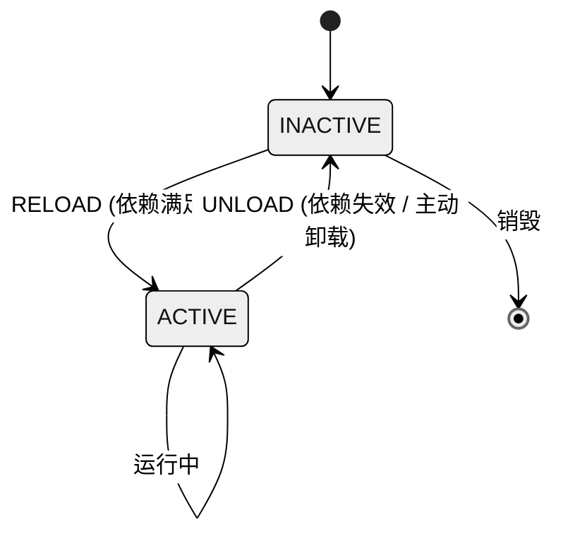
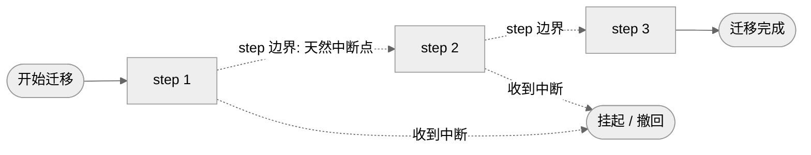
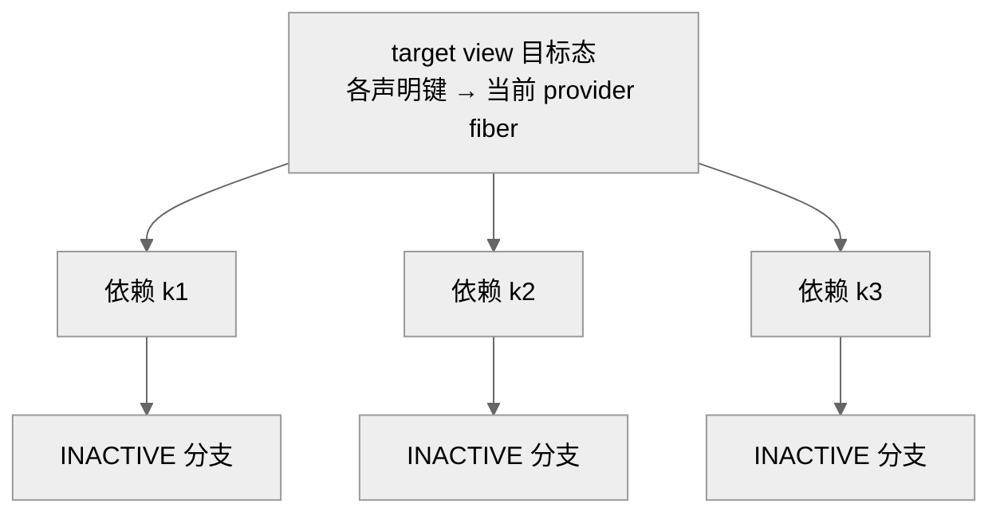
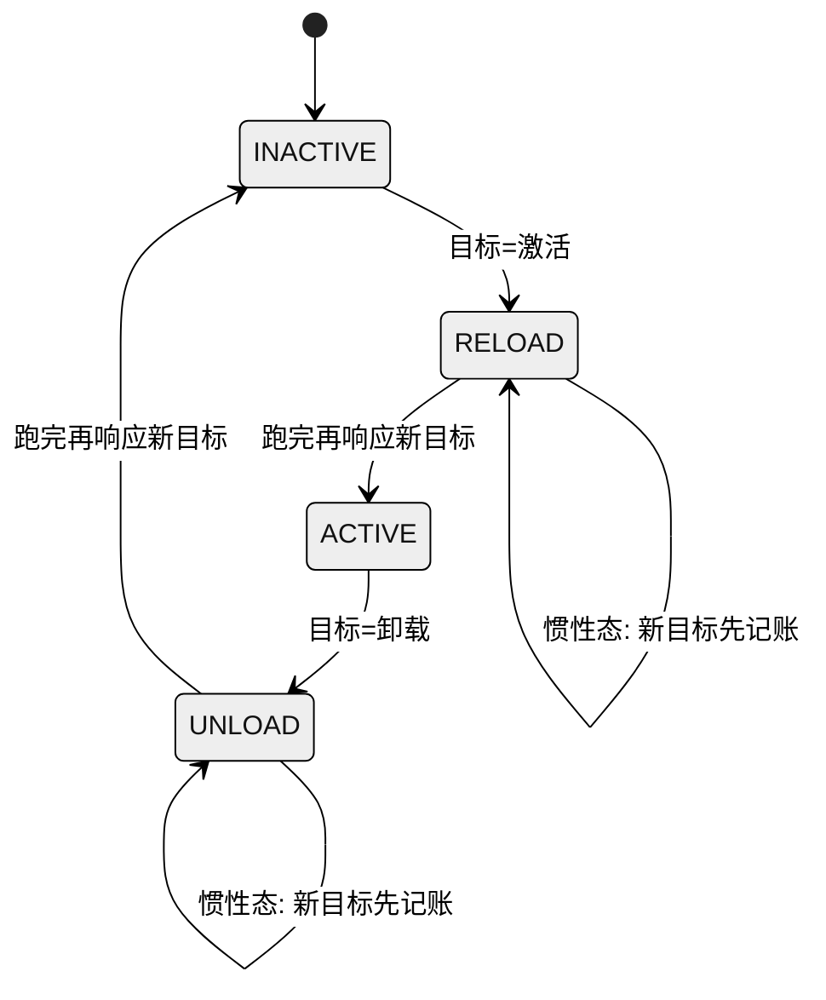
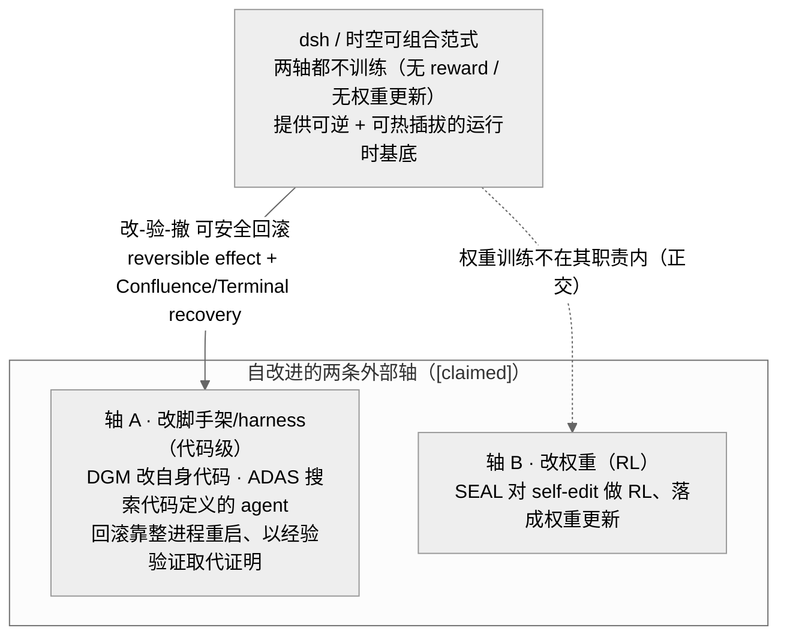

# 论文导读：Spatiotemporal Composability 范式

> 读完能回答：一篇北大 × DeepSeek 的论文，怎么把编程语言理论里的 effect / coeffect「搬到运行时」，用来解释"插件热插拔为什么这么难做对"？它和本仓库解析的 DeepSeek Harness（下称 dsh）又是什么关系？

如果你写过 VSCode 插件，或维护过任何"能装能卸"的插件系统，大概踩过这样的坑：装一个扩展改了一堆全局状态，卸载时却收不干净，最后只能重启进程了事；想让插件 A 依赖插件 B 提供的能力，却发现依赖关系要么写不出来、要么没有类型。这两件看似不相干的麻烦事，被这篇论文归纳成同一个理论问题的两个面。本篇导读带你快速吃透它，并把它和 dsh 的源码机制逐一对上。

---

## 一、论文核心与元信息

**标题**：《A Programming Paradigm for Spatiotemporal Composability》（一种面向 Spatiotemporal Composability 的编程范式）

**作者与单位**：Yifan Shi¹²、Wei Zhang¹、Tianyi Cui²。其中 ¹ 为 **Peking University（北京大学）**，² 为 **DeepSeek-AI**。这是一篇学术界与工业界合著的论文——理论骨架来自北大，工程验证来自 DeepSeek 一侧的实践者。

**TL;DR（Too Long; Didn't Read，直译"太长不看"，即一句话摘要）**：现代软件（从插件系统到 self-evolving agent harness）越来越需要"动态组合"——组件在运行时来了又走——但它的形式基础一直没打牢。论文把编程语言理论里两个经典概念**提升为运行时机制**：把描述"计算如何修改环境"的 **effect** 提升成**可逆的**（revertible），把描述"计算如何依赖环境"的 **coeffect** 提升成**响应式的**（reactive），从而得到一套语言无关、可落地的动态组合范式，并在名为 **Cordis** 的元框架里实现、在拥有 4000+ 社区插件的 **Koishi** 平台上验证。

**为什么值得读**：它给"热插拔为什么难"提供了一套精确的词汇。以前我们只能含糊地说"卸载没收干净""依赖没管好"；这篇论文把前者定义为 **temporal composability**（时间维：卸载时能否完全回滚副作用），把后者定义为 **spatial composability**（空间维：能否声明式地、响应式地管理组件间依赖）。两个维度正交，各自对应 effect 与 coeffect。

**开篇动机（§1）**：论文用 VSCode 插件生态做实证切入。

- **时间维的局限**：扩展一旦加载，其可执行代码无法在运行时卸载——作者统计 top100 扩展中有 **87 个**包含可执行代码、需要重启才能真正卸下。
- **空间维的局限**：扩展间依赖几乎无法表达——top100 中仅 **7 个**声明了 `extensionDependencies`，而拿到别的扩展导出的 API（Application Programming Interface，应用程序编程接口；这里即 `getExtension(...).exports` 拿到的那批导出函数）时**没有类型**。
- 现实里大家的"粗粒度绕过"（coarse-grained workaround）就是重启进程 / 容器：一个模块行为异常就重启整个进程，一个服务依赖就交给编排器管。代价很大——重启会丢掉进程内所有累积状态（缓存、连接、部分计算），重建要数秒到数分钟；为了维持可用性还得堆冗余副本。论文点名 **self-evolving agent harness**（会自我改写、替换自身组件的智能体运行时）是这一需求最尖锐的新场景。

**五条贡献（§1.3，与 PDF（Portable Document Format，可移植文档格式，这里指论文原文的 PDF 文件）第 6 页逐条核对一致）**：

1. **形式化 revertible effects（§3.1）**：每个 context 变换都配一个显式的逆函数，使得 effect tracking 与 recovery 成为**保持组合运算**的操作，从而保证组件移除时**完全的状态恢复**。这是动态时间可组合性的代数基础。
2. **形式化 reactive coeffects（§3.2）**：组件把自己的需求声明为一个 typed dependency set，一套基于"满足性"的通知机制自动把状态变迁分类为 **activating / deactivating / neutral**（激活 / 去激活 / 中性）。这是动态空间可组合性的代数基础。
3. **统一 context 类型（§3.3）**：把 effect context 与 coeffect context 整合为**单一 context type**，由 coeffect 上的 observational equivalence 赋予 effect 以 independence，构成一套面向 Spatiotemporal Composability 的编程范式。
4. **动态组合演算（§4）**：把两种机制合进 component 概念、为其生命周期赋予 operational semantics，元理论把 Spatiotemporal Composability 从单组件推广到交错组件系统。
5. **在 Cordis 中实现（§5）**：一个"Spatiotemporal Composability 元框架"，含 core library（effect tracking + coeffect resolution）与 declarative component loader（config reconciliation + hot module replacement，热模块替换，简称 HMR，指程序运行中直接换掉某个模块而不整体重启）；并以 **Koishi** 聊天机器人平台（4000+ 生产环境社区插件）做案例研究验证。

---

## 二、逐节精读（含关键公式与生命周期图解）

论文共 8 节：1 Introduction、2 Preliminaries、3 Revertible Effects & Reactive Coeffects、4 A Calculus of Dynamic Composition、5 Implementation & Case Study、6 Discussion、7 Related Work、8 Conclusion。这里聚焦第 2、3、4 节的形式化骨架——这是全文最硬也最值钱的部分。

### 2.1 Preliminaries：effect 与 coeffect 的经典分工（§2）

一句话对齐术语：**effect 描述"计算怎样改变环境"，coeffect 描述"计算怎样依赖环境"**。前者的判断形如 $\Gamma\vdash t:T_{\text{effect}}$（可用 monadic 方式，或 algebraic effects + handlers 建模）；后者形如 $\Gamma_{\text{coeffect}}\vdash t:T$。经典理论里这两者都是**编译期、静态、作用于词法固定作用域**的分析——恰恰不覆盖"组件运行时来去"的动态场景。论文接下来做的，就是把这两者各自"提升"到运行时。

### 2.2 Revertible effects：给每个副作用配一个"撤销键"（§3.1）

**核心直觉**：普通的副作用是"泼出去的水"；可逆 effect 要求你在泼水的同时，把"怎么把水收回来"也一并记下来。

论文把 effect context 定义为原状态空间与一族"恢复变换"的乘积：

$$\partial\Gamma := \Gamma \times \mathfrak{F}_\Gamma$$

它的元素是一个 pair $(\gamma,\varphi)$，其中 $\gamma$ 是**当前状态**，$\varphi$ 是**能把状态恢复到初始态的变换**。配套两个操作：`track`（累积新的副作用及其逆）与 `recover`（把 $\varphi$ 应用到 $\gamma$ 上、并将 $\varphi$ 重置为恒等 $\text{id}$）。

一个"effect 函数"被定义为**同时返回新状态和自身的逆**：

$$\mathfrak{E}_\Gamma := \Gamma \to \Gamma \times (\Gamma \to \Gamma)$$

多个 effect 用组合算子 $\diamond$ 串起来时，论文证明 effect tracking 保持这个组合运算——**这正是"完全可恢复"的代数保证**：无论中间叠加了多少层副作用，逆的组合总能精确地退回原点。

打个比方：可逆 effect 像给每一步操作都留了一张"回执"，撤销时按回执逆序作废即可，不必猜"当初到底改了什么"。对使用者来说，这就是"卸载一个组件 = 它从没来过"的底气。

### 2.3 Reactive coeffects：把"我需要什么"变成会被自动通知的声明（§3.2）

coeffect context 被建模为一个**依赖偏函数**（partial function，只对已提供的 key 有定义）：

$$\Sigma := (k:K) \rightharpoonup \mathcal{V}_k$$

配 `get` / `set` 两个操作。**关键洞见**：`set(k,v)` 本身就是 $\Sigma$ 上的一个 effect 函数——也就是说"coeffect 操作即 effect，而 effect 可逆"。这一句把空间维和时间维缝到了一起：管理依赖所引发的状态变化，天然享有可逆性。

组件声明的依赖集 $d$ 是否被满足，由一个满足谓词判定：

$$\sigma \vDash d := \forall k \in d.\; k \in \mathrm{dom}(\sigma)$$

当 context 从 $\sigma$ 变到 $\sigma'$，通知机制 $\mathrm{notify}_d(\sigma,\sigma')$ 会把这次变迁分成三类：

- **activating**：之前不满足、现在满足 → 该激活组件；
- **deactivating**：之前满足、现在不满足 → 该卸载组件；
- **neutral**：满足性没变 → 无需动作。

**一个漂亮的涌现结果**：正确的**空间依赖序**——依赖者必须"在被依赖者之后激活、在被依赖者之前卸载"——不需要专门写调度逻辑，它从 notify 的定义里**自然涌现**。

论文还给了两个进阶结构，dsh 里都能找到对应：

- **isolation realm $\Sigma^{iso}$**：同一个 key 在不同 realm 里解析出不同的值 → 相当于**运行时的 ad-hoc 多态**，用于多租户、测试、沙箱。
- **interception $\Sigma^{inter}$**：对依赖访问附加横切元数据（例如给文件系统访问加"哪些路径可读可写"的策略）；采用**右偏合并**，让外层 context 能"约束"组件而**不必改动组件本身**。类比：像给插座加一个限流保护套，灯泡不用换。

### 2.4 统一 context 与组件生命周期（§3.3 统一 context + §4 演算）

论文用一个**统一的 context 类型**把上述一切收口。组件（component，§4.1 Def.43）被定义为依赖规格、提供集与可逆 effect 的**三元组**：

$$\mathfrak{C}_\Gamma := \mathfrak{D}_\Gamma \times \mathfrak{P}_\Gamma \times \mathfrak{E}^*_\Gamma$$

（$\mathfrak{D}_\Gamma$＝声明依赖 / $\mathfrak{P}_\Gamma$＝可提供键集 / $\mathfrak{E}^*_\Gamma$＝带 witness 的可逆 effect function）；其一次运行实例 **fiber**（Def.44）才携带 parent、自有依赖表、退休标志与那份可变生命周期态。

而全局统一 context 是一个自相似的递归类型：

$$\Gamma_\infty := \mu\Gamma.\; \Gamma \times (\Gamma \to \Gamma) \times \Sigma$$

它自我嵌套（$\Sigma$ 里又装着 context），且 $\Sigma$ **subsumes 一切共享可变态**——一个类型统吃状态、逆、依赖。论文还区分了两种实现风格：**in-place**（原地修改、逆函数非平凡）与 **derived**（返回新 context、逆就是丢弃该 id 对应的派生物，恢复即"扔掉"）。

论文本身只含**两张图**（Fig.1 基础生命周期、Fig.2 含进行中转移的生命周期）。下面用白底 mermaid 呈现四张图解：图 1 与图 4 分别重绘论文这两张图，图 2、图 3 是对 §4 相关概念（迭代式多步迁移、target/committed view 版本化）的补充图解，并非论文的编号图。

#### 图 1：base lifecycle（组件基础生命周期，对应论文 Fig.1）

图注：组件的基础生命周期只有两个稳定态——INACTIVE 与 ACTIVE；两条迁移动作 RELOAD 与 UNLOAD 分别对应 coeffect 通知里的 activating 与 deactivating。UNLOAD 触发时执行可逆 effect 的逆，把副作用完全回滚。

#### 图 2：iterative transition（可中断的多步迁移，图解论文 §4.3.2；补充图，非论文编号图）

图注：一次组件迁移被拆成若干 step，step 之间的边界是天然的可中断点。论文把这套多步执行刻画为 reified delimited continuation（被具体化的定界续延），它正对应主流语言里的 yield——迁移可以在 step 边界暂停、撤回或重来。

#### 图 3：目标态版本化（星形拓扑，图解论文 §4 的 target/committed view；补充图，非论文编号图）

图注：本图是对论文机制的补充图解——论文并未使用"epoch"一词，其对应构造是 committed view $\omega$ 与 target view（Def.44/46），把组件每个声明键映到当前 provider fiber 的**名字**（而非取值快照），二者不一致即说明目标态已陈旧、需要 reload（记 provider 名而非值，正是为了让"另一 fiber 提供相等的值"不被误判为变化）。星形结构里每条依赖各配一条分支通向 INACTIVE，任一依赖失效都能独立触发去激活。

#### 图 4：inertial state machine（惯性态处理异步，对应论文 Fig.2「含进行中转移的生命周期」）

图注：异步是热插拔的头号敌人——组件还在加载途中，目标态又变了怎么办？论文把 RELOAD / UNLOAD 提升为"惯性态"（inertial states）：正在进行的迁移必须跑完，才去响应最新目标态，避免半途切换导致状态错乱。这是把图 1 的两态机在异步世界里做的加固。

### 2.5 与既有范式的对照（§3.3.3 Situating the Context Paradigm）

论文明确把自己和两类主流做法做了对比：

- **vs 函数式 State monad**：monad 需要显式地把状态"穿线"（threading）过每一步，人体工学差；可逆 effect 把逆藏在 context 里，调用方无感。
- **vs 命令式 / OOP（Object-Oriented Programming，面向对象编程）的隐式变更**：React 的 `useEffect` 靠"调用顺序"隐式建立依赖与清理，脆弱；Spring 的 `getBean` 靠运行时反射拿依赖，无类型、无生命周期协调。可逆 effect + 响应式 coeffect 把这些都显式化、可追踪化。

### 2.6 实现与案例（§5）、讨论（§6）要点

**Cordis / Koishi（§5.3）**：Koishi 建立在 Cordis 之上（Koishi 用 v3，本文形式化对应 v4）；论文直言"**Koishi 的 plugin 就是本文说的 component**"。Koishi 有两个独立运行时——服务端 bot 与浏览器里的 web console——都跑在 Cordis 上。作者诚实标注了 threats to validity：这是**单生态、单语言**的验证，性质上是 "existence-and-adoption"（存在性与被采用度）而非定量基准。

**Discussion（§6）**几个值得记住的点：

- **§6.2 service multiplexing**：从 exclusive binding（独占绑定）走向 service broker（服务代理），后者能支撑负载均衡、滚动更新、跨进程调用。
- **§6.3 access control**：`inject` 是"能力请求"，context proxy 是"能力中介"，因而**静态可审批**；interception 做细粒度策略（如 fs（file system，文件系统）元数据）。但论文态度很诚实：**沙箱化不可信组件，需要语言之外的执行边界**（SFI（Software Fault Isolation，软件故障隔离，一种在同一进程内用指令级检查把不可信代码"关"起来的技术）、隔离运行时、沙箱进程、虚拟容器），经由 bridge 接入。
- **§6.4 语言无关性**：时间维需要 closures + 运行时可引入 / 撤回模块（managed 语言用模块注册表、native 用 `dlopen`/`dlclose`、wasm（WebAssembly，一种可在多种宿主里运行的可移植字节码格式）看 embedder）；空间维需要依赖注入（类型层用 typeclass / trait / TS（TypeScript，带静态类型的 JavaScript）module augmentation，运行时用 Proxy / `__get__` / 反射）。
- **§6.5 相互依赖**：出现环 → 静态可预测的"永久 INACTIVE"，而**非死锁**；可分解为单向绑定，代价是组件数增多，用 bundling / 约定接线 / 脚手架缓解。
- **§6.6 依赖类型与版本**：key 靠名义链接会有 interface drift、key collision；三条出路——key namespacing / peer dependencies（Cordis 现用）/ structural compatibility。

---

## 三、论文 ↔ dsh 深度映射（本导读重点）

这一节是本导读的核心：把论文的每个形式化概念，对上 dsh 源码里的具体机制。dsh 侧均标注章号 / 文件与**证据等级**（[verified] 源码可查实、[inferred] 有据推断）。

### 3.1 revertible effects ↔ dsh 的 effect / disposer 体系

论文的"每个 effect 配显式逆、组件移除时完全回滚"，在 dsh 里是**一等机制**：`ctx.effect()` 返回一个 disposer；fiber 在卸载时按 `_disposables` **反序**逐个调用 disposer，精确回退。dsh 的 AGENTS.md 甚至把它立成铁律——**"Registrations are effects"（一切注册皆副作用，故必须可撤销）**。见 Ch02 / Ch03 [verified]。

这与论文 $\mathfrak{E}_\Gamma$ 返回"新态 + 自身逆"、组合算子 $\diamond$ 保持可逆的代数结构，是**同一个东西的两种表述**——论文给形式，dsh 给运行时实现。

### 3.2 reactive coeffects ↔ dsh 的 inject + fiber epoch

论文的 typed dependency context 与满足性通知，对应 dsh 的 `inject`（声明依赖）+ fiber 的 epoch 机制（`_setEpoch` / `_refresh`），以及 PENDING ↔ ACTIVE 的状态切换。见 Ch03 / Ch05 / Ch11。

- **notify 的 activating / deactivating** ↔ epoch 变化触发 dsh 的 `_reload` / `_unload`。依赖刚满足 → `_reload` 激活；依赖失效 → `_unload` 卸载并回滚。
- 论文的 **committed view / target view**（Def.44/46，把声明键映到当前 provider fiber 的名字；见图 3）对应 dsh fiber 里的 epoch 机制——都用"版本"检测"目标态是否陈旧"（注：论文本身不使用"epoch"一词，epoch 是 dsh 侧的实现名）。

### 3.3 idempotent guard 与 effect iterator

- **idempotent guard `idem`** ↔ dsh 的幂等 disposer（Ch03 §4.1 [verified]）：返回的 partial disposer 只生效一次，重复调用无害；generative 版本每次给新 handle。
- **effect iterator** ↔ dsh 的 turn / step 边界（Ch06）。论文把多步迁移刻画为可中断的 delimited continuation，dsh 的一个 turn / step 边界正是这种天然中断点。此处为**类比 [inferred]**——dsh 未必显式实现 continuation，但结构同构。

### 3.4 isolation realm 与 interception

- **isolation realm $\Sigma^{iso}$** ↔ Cordis 的 `isolate` realm / dsh 的 per-session preset（Ch04 / Ch11）：同一 key 在不同 realm 解析不同值，用于多会话隔离。
- **interception $\Sigma^{inter}$**（右偏合并、外层约束组件）↔ dsh 的多处横切策略：fs-observation-policy（Ch14）、sandbox policy（Ch13）、以及 waterfall（Ch05 / Ch09）。这些都是"外层 context 给组件加约束、而不改组件代码"的实例。

### 3.5 统一 context 与 service multiplexing

- **统一 $\Gamma_\infty$** ↔ Cordis 的 `ctx` / dsh 的 fiber：一个自相似类型承载状态、逆与依赖。
- **service multiplexing（§6.2）** ↔ dsh 的多个"注册表 / 提供者"场景：LLM（Large Language Model，大语言模型）适配器注册表（Ch10）、subagent providers（Ch15）、SDK（Software Development Kit，软件开发工具包）与 ACP（Agent Client Protocol，智能体客户端协议，一套让外部编辑器等程序驱动 harness 会话的接口）之间的桥接（Ch17）。这些正是"从独占绑定走向服务代理"的工程化身。

### 3.6 一个诚实立场的共振：沙箱需要语言之外的边界

论文 §6.3 明说：**要真正隔离不可信组件，光靠语言机制不够，必须有语言之外的执行边界**。dsh 采取了完全一致的立场——"steering not containment"（引导而非围栏），真正需要强隔离时接入 E2B（一个把代码放进云端隔离沙箱里执行的外部服务）等外部沙箱（Ch13）。两者在这一点上是同一种工程诚实：可逆 effect 管得住"善意组件的副作用回滚"，管不住"恶意组件的越权"，后者交给进程 / 容器边界。

### 3.7 作者链与"工程验证体"推断

- **Tianyi Cui** 既是本论文的共同作者（² DeepSeek-AI），又是 dsh 的**头号提交者**——git 已核实其 5235 commits [verified]。
- README 里的 paper 链接由 Shigma 提交；**Yifan Shi 可能即 Shigma** [inferred]（音 / 名相合，但未在论文正文取得直接证据，措辞保守）。
- 论文 §8 Conclusion 把 **self-evolving agent harness** 明确列为该范式的未来验证方向（AI agent 持续生成 / 替换自身 harness 组件，用以验证"快速替换下的完全恢复"与"频繁拓扑变化下的依赖协调"）。

把这几条串起来：**dsh 很可能正是这篇论文所构想范式的一个工程验证体**——一个真实的 self-evolving agent harness，其可逆 effect / 响应式 coeffect 机制与论文形式化高度同构，且作者与代码提交者存在交集。这是**有据推断 [inferred]**，本导读在措辞上保持谨慎：论文正文并未点名 dsh，此结论建立在机制同构 + 作者链 + Conclusion 明示方向三条证据之上，而非论文的直接声明。

### 3.8 与 RSI 及「可训练 / 自改进 harness」方向的关系

§3.7 说 dsh「很可能是这套范式的工程验证体」，而论文 §8 又把「self-evolving agent harness（自演化 agent harness）」列为下一步验证方向——这自然引出一个当下很热的问题：**这套形式化，与「递归自我改进」（Recursive Self-Improvement，RSI）、以及「让 harness 变得可训练 / 能自改进」这条路线，到底是什么关系？** 先把外部坐标立起来，再看这项工作卡在哪个位置。

**外部路线分两条正交的轴**（以下外部工作的结论一律记 [claimed]，仅作定位参照）：

- **轴 A——改脚手架 / harness（代码级，不动模型权重）。** 代表作：**Darwin Gödel Machine**（DGM，arXiv:2505.22954，全称 "Darwin Godel Machine: Open-Ended Evolution of Self-Improving Agents"）——一个"迭代修改自身代码、从而也提升自己改代码的能力"的编码 agent，它**明确放弃了原始 Gödel Machine「先证明一处改动有益再采纳」的要求**（自陈"在实践中不可能"），改为**用编码基准经验性验证**（SWE-bench 20%→50%），并强调"所有实验都在 sandboxing + 人类监督下进行" [claimed]；以及 **ADAS**（arXiv:2408.08435，"Automated Design of Agentic Systems"）的 Meta Agent Search——一个 meta-agent 在不断增长的档案上**用代码编排出新 agent**，主张"手工设计的方案终将被学习到的方案取代" [claimed]。
- **轴 B——改模型权重（RL）。** 代表作：**SEAL**（arXiv:2506.10943，"Self-Adapting Language Models"）——模型生成自己的"self-edit"（微调数据 / 优化指令），用**下游表现作为奖励的强化学习循环**训练这一过程，经监督微调落成**持久的权重更新** [claimed]。这条轴训练的是**权重**，不是 harness。

**dsh / 这套范式落在哪？——它两条轴都不做「训练」，它提供的是另一样东西：一个可逆、可热插拔的基底。** 这正是最容易被误读、也最该说清楚的地方。三点可辩护的连接（均记 [inferred]，锚定报告已核实素材）：

1. **「安全的自我修改」＝「可逆 effect」。** 在 dsh 里，模型挂载的动态包（`cordis_define/run/stop`）与框架插件**走同一套可逆 effect / 响应式 coeffect 演算**，`cordis_stop/undefine` 必须 await 到工具 / 监听器 / 服务 / 定时器 / effect 全部 quiescent 才算撤净（见 Ch18 §5、Ch03）。而轴 A 的 DGM / ADAS 恰恰缺这条**时间维**——它们回滚一次坏改动的办法通常是**整进程重启**（正是论文 §1.2.2 点名的痛点："每次自改写全量重启、丢进程内状态"）。可辩护的表述是：**dsh 为「改一版 → 验一版 → 撤回」这个自改进内循环，提供了组件粒度、结构性保证的回滚基底**——但仅覆盖经 `ctx.effect()` 注册的 effect（边界见 Ch03）。
2. **「搜索 harness 配置」需要「安全回滚 + 结果确定」。** 轴 A 本质是在候选脚手架空间里试错：挂上一个候选、评估、再干净地丢弃。论文的 **Confluence（Thm.73，静止态由最终配置唯一决定）** 与 **Terminal recovery（Cor.62，退出组件贡献归零）** 恰好保证"试完能回到干净起点、且最终态不受装卸顺序影响"——这正是 harness 搜索试错—丢弃内循环所需要的性质 [inferred]。
3. **响应式 coeffect ＝ 一个「活的、可热插拔的动作空间」。** 新工具依赖齐了自动激活、依赖撤走自动停用，无需重启（Ch18 §5）。对"在线搜索工具组合"或"对工具集做 RL"而言，这是一个**机械前提**：动作空间可以在会话中途增删而不必重建运行时 [inferred]。

一张图把两轴与 dsh 的位置画清楚：

图 23-3　自改进方向的两条轴与 dsh 的定位。此图要说明的是：dsh 不是"自改进器"，而是轴 A 所需的"可安全回滚、可热插拔"基底——它把自改进试错中"改一版再撤回"那一步做成了结构性保证；对轴 B（改权重的 RL）则正交、不涉及。依据：论文 §1.2.2 / §8、Thm.73 / Cor.62，Ch18 §5，及外部工作 arXiv:2505.22954 / 2408.08435 / 2506.10943（后者仅 [claimed]）。

**但必须把边界钉死，否则极易读成过头话**（以下每条都是防止误读的"这不是什么"）：

- **dsh 不训练任何东西** [inferred]：报告与源码里**没有** RL、没有 reward、没有权重更新、没有在线学习循环。dsh 的"自我修改"是**模型可调用、opt-in、人类监督的开发工具**，不是自主的自改进循环——因此把 dsh 说成"一个 RSI 系统"或"可训练 harness"是过界的。
- **Ch20 的「agent 写代码」是开发流程事实、不是运行时 RSI** [verified→划清]：那说的是"这套代码库主要由编码 agent 在**人设规则、人做终签**下产出"，与"运行时自我改进闭环"是两码事，不能混为一谈。
- **"自我修改更优 / 净收益为正"未经证明** [claimed]：Ch18 明确记录该能力在真实任务上"是否更优"尚无证据，故它保持 opt-in、非默认。
- **论文并未验证 self-evolving harness** [inferred]：它只是**动机 + 未来工作**，真正的实验是 Koishi（§5.3）。
- **"可证明安全的自我修改"是过界表述** [inferred]：其一，可逆性只覆盖经框架注册的 effect，且"逆元确实撤销其 effect"是**作者义务、运行时并不校验**（见 Ch22 §1.7）；其二，承载动态代码的 `node:vm`**"不是安全边界"**（Ch18），模型一旦能挂载代码，其信任级别等同于"能跑 bash"。所以准确说法是"**对协作式 effect 的安全回滚**"，而非"对敌意代码的隔离"。

**一句话收束**：这项工作与 RSI / 可训练 harness 的关系，不是"dsh 会自我进化"，而是——**它把「自改进」这件事最危险的一步「改了之后能不能干净地撤回」从工程自觉变成了结构性保证**。用一句更尖锐的对照：DGM 因"证明每步有益不可行"而**放弃证明、转向经验验证**；这篇论文反其道而行，不去证明"某次自改写更好"，而是证明"无论怎么改，装卸本身在逻辑上是可逆、可收敛的"——**它保证的是自改进的"可回退地基"，而非自改进的"能力增益"**。二者位于不同的轴上，互补而非替代。

**补充源码索引（§3.8）**
- 自我修改机制、`cordis_*` 工具族、`node:vm` 非安全边界、await-quiescent：Ch18「互操作与自我修改」§5（`packages/extensions/README.md`、Agent Note `2026-07-08-self-referential-cordis-toolset.md`）
- 可逆 effect 的产品化、`cordis_run/stop`：Ch03「Spatiotemporal Composability」
- Confluence（Thm.73）/ Terminal recovery（Cor.62）/ §1.2.2 动机 / §1.7 边界 / §8 未来方向：Ch22
- 外部对照（均 [claimed]）：DGM arXiv:2505.22954、ADAS arXiv:2408.08435、SEAL arXiv:2506.10943

---

## 四、与相关工作的定位（据 §7 Related Work）

论文的 Related Work 用一连串"vs"精准划出自己的坐标。理解这些对比，能帮你把这篇工作放进整个学术谱系：

- **vs Effekt**（effects as capabilities）：Effekt 把 effect 当能力，但它是**静态、解释式**的；本文是运行时、可逆的。
- **vs Heunen 的可逆 effect**：Heunen 走 denotational（指称语义）、**全局可逆**；本文是运行时、局部可组合的可逆。
- **vs Orchard 的 graded types**：graded coeffect 也刻画依赖，但**静态**；本文是响应式、运行时的。
- **vs COP（Context-Oriented Programming，面向上下文编程）**：COP 把 context 当一等公民，但它**不追踪也不回滚 activation**；本文两者都做。
- **vs AOP（Aspect-Oriented Programming，面向切面编程）**：AOP 的 pointcut 是 "oblivious & quantified"（组件对被切浑然不觉、且靠模式量化匹配）；Cordis 的 coeffect 是 "declared & traceable"（显式声明、可追踪），且切面**绑定组件生命周期**。
- **vs DSU（Dynamic Software Update，动态软件更新，指程序不停机就替换其运行中的代码）/ Erlang 热更 / HMR**：这些走 **forward migration**（向前迁移状态）；Cordis 走**回滚重放**（revert-and-replay）。
- **vs React useEffect**：受限于 top-level 调用、且**逆不能组合**；本文的逆可组合。
- **vs OSGi / iPOJO**：它们也做 availability-reactive（按可用性响应），但 cleanup 要**手写**、且**同步**；本文自动且可异步。
- **vs FRP（Functional Reactive Programming，函数式响应式编程）/ signals**：FRP 在 **value 层**（值随时间变化）；本文在 **component 层**（组件随依赖满足性激活 / 卸载）。

一句话总结坐标：**别人要么静态、要么只在值层、要么向前迁移不回滚、要么清理靠手写；这篇把"运行时 + 组件层 + 可逆回滚 + 自动响应"四个特性同时占齐了。**

---

## 五、事实核验

按证据来源分列，并标注证据等级。

### 【论文事实】（据 PDF 及已核实 source-truth）

- 标题、作者（Yifan Shi¹²、Wei Zhang¹、Tianyi Cui²）、单位（¹北京大学、²DeepSeek-AI）：已用 Read 打开 PDF **第 1 页**核对一致 [verified]。
- 五条贡献（revertible effects §3.1 / reactive coeffects §3.2 / 统一 context 类型 §3.3 / 动态组合演算 §4 / Cordis 实现 §5 + Koishi 4000+ 插件验证）：已用 Read 打开 PDF **第 6 页**逐条核对一致 [verified]。
- 8 节结构、VSCode 统计（top100 中 87 个含可执行码、7 个声明 extensionDependencies）、各公式定义（$\partial\Gamma$、$\mathfrak{E}_\Gamma$、$\Sigma$、满足谓词、committed/target view、$\Gamma_\infty$ 等）、两张图（Fig.1/Fig.2）语义、§4–§7 论点：来自已核实的 source-truth [claimed by source-truth]。**边界说明**：本导读**未逐页复核**这些公式的排版细节与 §2–§7 全文，公式与图的转述以 source-truth 为准；如需引用到论文原文的精确记号，请回到 PDF 对应小节复核。

### 【报告推断】（dsh 侧映射与关系判断）

- dsh 的 `ctx.effect()` / disposer 反序卸载 / "Registrations are effects" 铁律 ↔ 可逆 effect：Ch02 / Ch03 [verified]。
- `inject` + fiber epoch（`_setEpoch` / `_refresh`）/ PENDING↔ACTIVE ↔ 响应式 coeffect：Ch03 / Ch05 / Ch11 [verified]。
- 幂等 disposer ↔ idempotent guard：Ch03 §4.1 [verified]。
- turn / step 边界 ↔ effect iterator（delimited continuation）：Ch06，结构同构 [inferred]。
- isolate realm / per-session preset ↔ isolation realm（Ch04 / Ch11）；fs-policy / sandbox-policy / waterfall ↔ interception（Ch14 / Ch13 / Ch05 / Ch09）[verified]。
- LLM 适配器注册表 / subagent providers / SDK-ACP ↔ service multiplexing：Ch10 / Ch15 / Ch17 [verified]。
- "steering not containment" + E2B ↔ §6.3 沙箱需外部执行边界：Ch13 [verified]，立场一致性判断 [inferred]。
- Tianyi Cui 为 dsh 头号提交者（5235 commits）且论文共同作者：git 已核实 [verified]。
- Yifan Shi 可能即 Shigma：[inferred]，未取得论文正文直接证据。
- "dsh 是这篇论文构想的工程验证体"：**有据推断 [inferred]**，建立在机制同构 + 作者链 + §8 明示 self-evolving harness 为验证方向三条证据上；论文正文并未点名 dsh。

---

**收尾**：这篇论文最动人的地方，在于它把一个工程界习以为常的"重启大法"，还原成一个有精确形式基础的理论缺口，并给出了"可逆 effect × 响应式 coeffect"这一对优雅的答案。而 §8 那句把 self-evolving agent harness 列为未来验证方向的话，几乎就是为 dsh 这类系统写的注脚——理论与工程，在这里对上了暗号。
