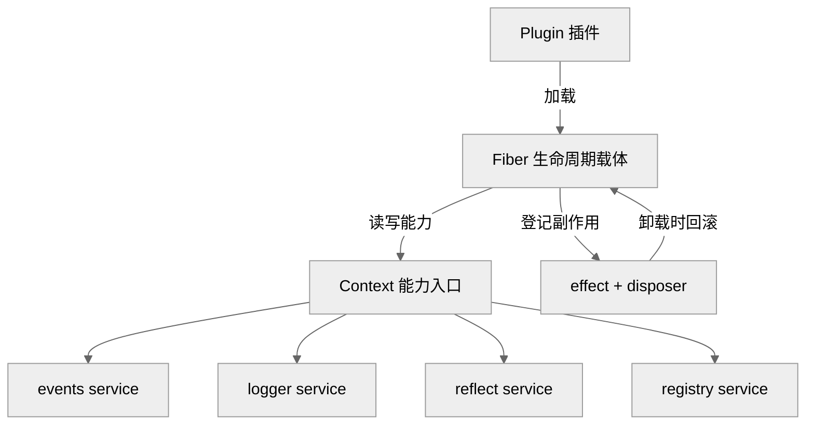
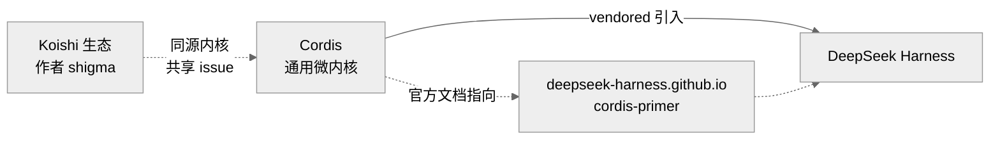
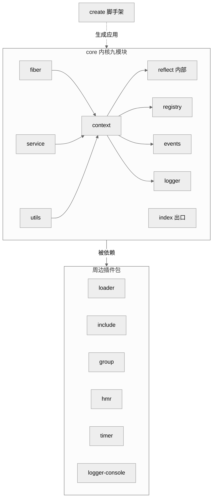
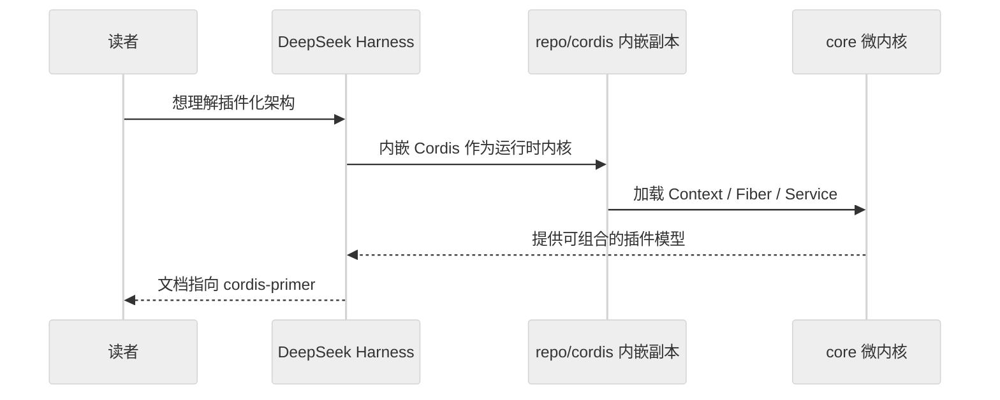

# 第 24 章　Cordis 总览与血缘

> 读完本章你能回答：Cordis 到底是什么框架、它从哪里长出来、由谁维护到什么成熟度，以及它为什么会出现在 DeepSeek Harness（下称 dsh）的代码里。这是 Part V 的开篇，只搭骨架、认门牌——具体的 Context 机制、fiber 生命周期与 dsh 的接入细节，分别留给 Ch25 及之后、Ch29 与 Part III Ch21。

如果你第一次打开 `repo/cordis/`，大概率会愣一下：一个自称"框架"的仓库，核心目录 `packages/core/src/` 一共只有 9 个 `.ts` 文件、不到 1900 行。它不是那种堆满功能的"大而全"库，而更像一台**微内核（microkernel）**——内核只管最小的一组抽象，其余能力全部以插件的形式挂上去。本章先把这台内核的"身份证"看清楚。

## 一、Cordis 是什么

Cordis 的自我定义写在 README 第一行：**"A Meta-Framework of Spatiotemporal Composability"**（可直译为"一个具备时空可组合性的元框架"——"时空"二字的含义本章第一节末尾会拆开讲）`[verified]`（`repo/cordis/README.md:5`）。而 `packages/core` 的包描述用了更朴素的说法——"Meta-Framework for Modern Applications"`[verified]`（`repo/cordis/packages/core/package.json:3`）。

"元框架（meta-framework）"这个词值得拆开讲：它自己不直接实现业务功能，而是提供一套"如何把功能拼装起来"的规则。打个比方，它不是灯泡，而是**插座标准**——规定了灯泡怎么插、怎么拔、拔了以后电路怎么恢复，至于插进来的是台灯还是电扇，它不关心。这套"插拔标准"在 Cordis 里由几个核心概念承担，读源码会反复撞见它们：

- **Context**：一切能力的入口对象。插件拿到的是一个 `Context` 实例，对它读写就等于访问整个应用的能力集（`repo/cordis/packages/core/src/context.ts:9-78`，`[verified]`）。
- **Service**：挂在 Context 上的"具名能力"。内核自带 `events`、`logger`、`reflect`、`registry` 四个内建 service，构造函数里逐个装配（`context.ts:15-18`、`context.ts:43-46`，`[verified]`）。
- **Plugin / Fiber**：插件是被加载的功能单元；`Fiber`（纤程）是插件运行时的**生命周期载体**，管着它的启动、失败、卸载（`repo/cordis/packages/core/src/fiber.ts`，`[verified]`）。
- **effect / disposer**：插件运行时产生的"副作用"（注册监听、占用资源）都通过 `ctx.effect(...)` 登记，返回一个可回收的 disposer；卸载时统一回滚。`Context.effect` 是一个 `unique symbol`（`context.ts:22`，`[verified]`），fiber 里 `effect` 方法的实现集中在 `fiber.ts:277-340`（核心执行器 `_execute` 见 `fiber.ts:229-273`，`[verified]`）。
- **loader / HMR**：把"从配置文件加载插件""热替换（Hot Module Replacement，改代码不重启）"这类能力，做成了独立的插件包 `@cordisjs/plugin-loader`、`@cordisjs/plugin-hmr`（`[verified]`，见下文包清单）。

这些名词现在只需混个脸熟。要记住的一句话是：**Cordis 用一套"可组合、可回收"的插件模型，把一个应用拆成许多能独立装卸的单元**，而"Spatiotemporal Composability"里的"时"，指的正是插件在时间维度上的动态装卸（对应 fiber 的生命周期），"空"则是 Context 在作用域维度上的隔离与派生。

<div style="background: #ffffff !important; background-color: #ffffff !important; padding: 16px; border-radius: 8px; margin: 16px 0;" bgcolor="#ffffff">



<p>图 24-1　Cordis 微内核的五个核心概念：插件经 Fiber 挂到 Context 上，通过内建 service 使用能力，副作用经 effect 登记、卸载时回滚。此图证明"内核只管装拆规则、不管业务"这一定位（依据 context.ts:9-46、fiber.ts）。</p>

</div>

## 二、血缘：它从哪里长出来

Cordis 的版权归属很清楚：MIT 协议，"Copyright (c) 2021-present Shigma"`[verified]`（`repo/cordis/LICENSE:3`），`core` 包作者字段也是 "Shigma <shigma10826@gmail.com>"`[verified]`（`packages/core/package.json:31`）。这位 @shigma 正是聊天机器人框架 **Koishi** 的作者，而 Cordis 通常被理解为"从 Koishi 生态里抽象出来的通用内核"。

这个"从 Koishi 抽取"的说法，一般只能靠社区口径佐证；但在本仓库里，它有**可直接核验的证据**。用 `git log` 翻早期提交，会看到一批 bug 修复的 commit message 直接引用 Koishi 的 issue 编号：

```
git log --all --format="%s %b" | grep -i koishi
# fix: catch dispose error, fix koishijs/koishi#1254
# fix: disposed scopes should not be restarted fix koishijs/koishi#1110
# fix: ensure resolved config is object, fix koishijs/koishi#1081
# fix: immediate dep service causes multiple starts, koishijs/koishi#1130
```

这些提交在修 Cordis 的代码、却挂着 `koishijs/koishi` 的 issue 号，说明 Cordis 与 Koishi 内核在那段时间共享同一批问题——**这是"同源"的硬证据**，而不只是传闻`[verified]`（上述 `git log` 命令可复现）。至于"究竟是先有 Koishi 再抽出 Cordis，还是反向重构"这类**先后顺序与动机**问题，仓库本身无法逐字证明，只能记为 `[inferred]`。

<div style="background: #ffffff !important; background-color: #ffffff !important; padding: 16px; border-radius: 8px; margin: 16px 0;" bgcolor="#ffffff">



<p>图 24-2　血缘与关系锚点：Cordis 与 Koishi 同源（实线为强证据、虚线为推断/文档指向），Cordis 又被 dsh vendored 引入，且其官方文档链接指向 dsh 的站点。此图证明"Cordis 是 dsh 的上游内核"这一关系（依据 README.md:10、core/package.json:31、git log）。</p>

</div>

## 三、九个包与内核九模块

打开 `package.json` 会看到工作区（workspaces）指向 `external/*` 与 `packages/*``[verified]`（`repo/cordis/package.json:7-10`），其中 `external/` 目录实际缺席（workspaces 的 `external/*` glob 匹配为空），实体代码都在 `packages/` 下的 **9 个包**里（`ls packages/` 可复现，`[verified]`）。下表「npm 名」一列，即各包发布到 npm（Node Package Manager，Node 的包管理器与公共包仓库）时使用的名字：

| 包名 | npm 名 | 版本 | 职责 |
| --- | --- | --- | --- |
| core | `cordis` | 4.0.0-rc.8 | 微内核本体 |
| loader | `@cordisjs/plugin-loader` | 1.0.0-rc.5 | 从配置加载插件 |
| include | `@cordisjs/plugin-include` | 1.0.4 | 依赖/包含关系 |
| group | `@cordisjs/plugin-group` | 1.0.0 | 插件分组 |
| hmr | `@cordisjs/plugin-hmr` | 1.0.15 | 热模块替换 |
| timer | `@cordisjs/plugin-timer` | 1.1.2 | 定时器 service |
| utils | `@cordisjs/utils` | 1.0.0 | 通用工具 |
| logger-console | `@cordisjs/plugin-logger-console` | 1.0.0 | 控制台日志导出 |
| create | `create-cordis` | 0.3.0 | 脚手架（创建应用） |

（以上版本号均取自各包 `package.json`，`[verified]`。）一个值得注意的信号：**内核 `cordis` 已到 `4.0.0-rc.8`（rc = release candidate，候选发布版，即尚未正式发版的预备版本），而周边插件多在 `1.x`**——内核经历了多个大版本迭代，插件生态相对年轻。

内核本体 `packages/core/src/` 下是 **9 个模块**（`wc -l packages/core/src/*.ts` 可复现，共约 1848 行，`[verified]`）：

- `context.ts`（78 行）——Context 类与派生（`extend`/`isolate`/`intercept`）。
- `events.ts`（178 行）——事件总线 service。
- `fiber.ts`（486 行，内核最大文件）——插件生命周期与 effect。
- `logger.ts`（246 行）——日志 service。
- `reflect.ts`（281 行）——Context 的 Proxy 反射层（`ReflectService.handler`，见 `context.ts:39`）。
- `registry.ts`（214 行）——插件/service 注册表。
- `service.ts`（80 行）——Service 基类与依赖注入。
- `utils.ts`（278 行）——symbols、DisposableList 等公共设施。
- `index.ts`（7 行）——总出口。

一个容易被忽略的细节：`index.ts` 只 `export` 了 7 个模块——context、events、fiber、logger、registry、service、utils——**唯独没有导出 `reflect`**`[verified]`（`repo/cordis/packages/core/src/index.ts:1-7`）。这暗示 `reflect` 更像内核的"内部机制"而非对外 API（Application Programming Interface，应用编程接口，即一个模块公开给外部调用的入口集合），外部插件不应直接依赖它。

<div style="background: #ffffff !important; background-color: #ffffff !important; padding: 16px; border-radius: 8px; margin: 16px 0;" bgcolor="#ffffff">



<p>图 24-3　包与模块的分层：内核九模块以 Context 为轴心（reflect 未经 index 导出，属内部机制），周边六个功能插件包与一个脚手架环绕内核。此图证明"微内核 + 外挂插件"的仓库形态（依据 index.ts:1-7、各包 package.json）。</p>

</div>

## 四、四年提交轨迹与成熟度

Cordis 已有相当长的开发史。`git rev-list --count HEAD` 给出 **550 次提交**，跨度从 **2022-05-18 到 2026-08-13**，约 4 年 3 个月`[verified]`。按年份切分提交数（`git log --format=%ai` 统计）：

| 年份 | 2022 | 2023 | 2024 | 2025 | 2026 |
| --- | --- | --- | --- | --- | --- |
| 提交数 | 135 | 53 | 197 | 96 | 69（截至 8 月） |

作者结构高度集中：`git shortlog -sn` 显示 **Shigma 一人 537/550**，Hieuzest 7 次，另有 undefined 3、Cyan 2、imccyu 1`[verified]`。这是一个典型的**单一核心作者主导**的项目。仓库规模不大——112 个受版本控制的文件、其中 58 个 `.ts`（`git ls-files | wc -l`、`git ls-files '*.ts' | wc -l`，`[verified]`）。

成熟度上有两个必须直说的信号。其一，README 明写 **"Cordis is under active development. The API is not yet stable and may change without notice."**（仍在活跃开发，API 尚不稳定，可能无预告变更）`[verified]`（`repo/cordis/README.md:7`）。其二，内核版本停在 `4.0.0-rc.8`（rc 即前述候选发布版，尚未正式 4.0）`[verified]`。近期提交也印证了这一点——2026 年 8 月的提交多是 `fix(core)`/`perf(core)` 级别的核心修补，例如 "keep wrapped fiber state canonical (#40)"、"track direct service callers (#35)"（`git log -8`，`[verified]`）。

## 五、与 DeepSeek Harness 的关系锚点

本章开头的问题——"它为什么出现在 dsh 里"——答案的第一个锚点就藏在 README 里。Cordis 的官方文档链接不是指向它自己的域名，而是指向 **`https://deepseek-harness.github.io/deepseek-harness/reference/cordis-primer`**`[verified]`（`repo/cordis/README.md:10`）。也就是说，Cordis 的入门文档被托管在 dsh 的站点下。

反过来，`repo/cordis/` 本身就是 dsh 仓库里的一份 **vendored（内嵌）副本**——dsh 把 Cordis 整个克隆进自己的代码树，作为底层运行时内核使用。这解释了 Part V 存在的意义：要读懂 dsh 的插件化架构，就得先读懂它脚下这台内核。

<div style="background: #ffffff !important; background-color: #ffffff !important; padding: 16px; border-radius: 8px; margin: 16px 0;" bgcolor="#ffffff">



<p>图 24-4　关系时序：dsh 内嵌 Cordis 作为运行时内核并向读者提供 cordis-primer 文档。此图证明本章的落点——理解 dsh 须先理解 Cordis（依据 README.md:10 与 repo/cordis 的内嵌位置）。</p>

</div>

## 小结与衔接

一句话概括本章：**Cordis 是 @shigma 与 Koishi 同源、以约 1900 行核心撑起的 TS（TypeScript，带静态类型的 JavaScript）微内核插件框架**——用 Context/Service/Plugin/Fiber/effect/loader/HMR 一套抽象规定"能力如何装拆"，四年 550 提交、单人主导，目前处于 `4.0.0-rc` 的"机制成型、API 未定"阶段，并被 dsh vendored 为运行时内核。本章只认门牌、点关系；从下一章起，Part V 会逐个拆开这台内核：Context 的派生与隔离、Fiber 的六态生命周期（PENDING/LOADING/ACTIVE/FAILED/DISPOSED/UNLOADING，见 `fiber.ts:78-85`）、Service 的依赖注入、以及 loader/HMR 如何把"改代码不重启"变成现实。而它与 dsh 的接线细节，则由 Ch29 与 Part III Ch21 收尾。

## 源码索引

- `repo/cordis/README.md:5` —— "A Meta-Framework of Spatiotemporal Composability"
- `repo/cordis/README.md:7` —— "API is not yet stable"
- `repo/cordis/README.md:10` —— 文档链接指向 `deepseek-harness.github.io/.../reference/cordis-primer`
- `repo/cordis/LICENSE:3` —— "Copyright (c) 2021-present Shigma"
- `repo/cordis/package.json:7-10` —— workspaces `external/*`、`packages/*`
- `repo/cordis/packages/core/package.json:3` —— "Meta-Framework for Modern Applications"
- `repo/cordis/packages/core/package.json:4` —— version `4.0.0-rc.8`
- `repo/cordis/packages/core/package.json:31` —— author "Shigma"
- `repo/cordis/packages/core/src/context.ts:9-78` —— Context 接口与类
- `repo/cordis/packages/core/src/context.ts:22` —— `Context.effect` unique symbol
- `repo/cordis/packages/core/src/context.ts:43-46` —— 内建 service 装配
- `repo/cordis/packages/core/src/fiber.ts:78-85` —— `FiberState` 六态枚举
- `repo/cordis/packages/core/src/fiber.ts:277-340` —— `effect` 方法实现（执行器 `_execute` 见 `fiber.ts:229-273`）
- `repo/cordis/packages/core/src/index.ts:1-7` —— 出口（不含 reflect）
- 各包 `package.json` —— 9 个包的 npm 名与版本
- git 命令：`git rev-list --count HEAD`（550）、`git log --reverse`（2022-05-18 起）、`git shortlog -sn`（Shigma 537/550）、`git ls-files | wc -l`（112）、`git ls-files '*.ts' | wc -l`（58）、`git log --all --format="%s %b" | grep -i koishi`（Koishi issue 引用；正文列举 4 条示例，实际命中更多）
