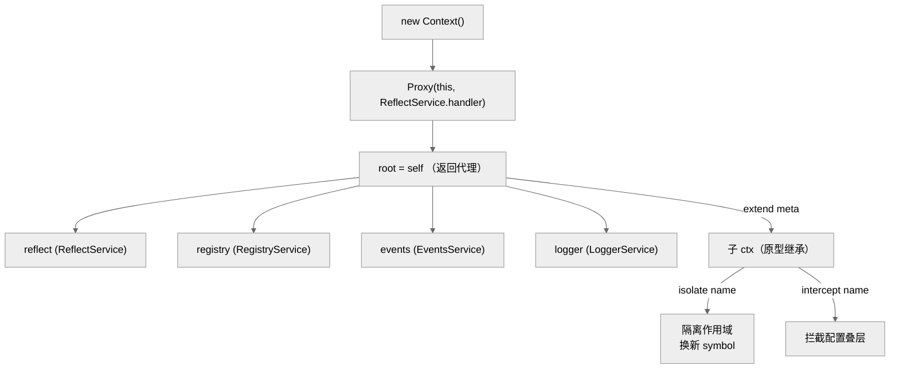
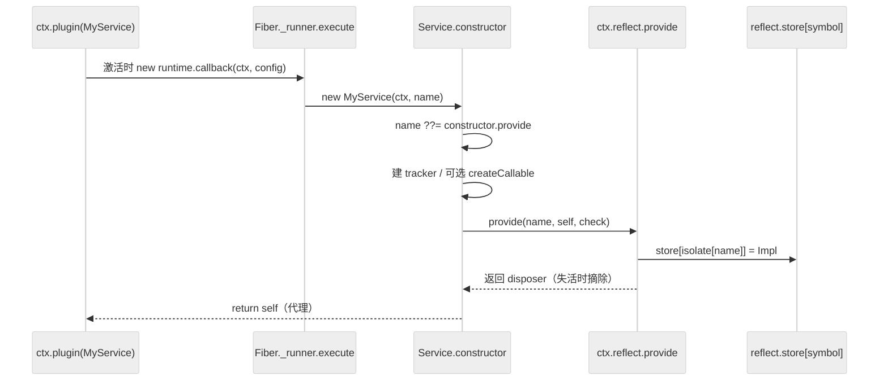
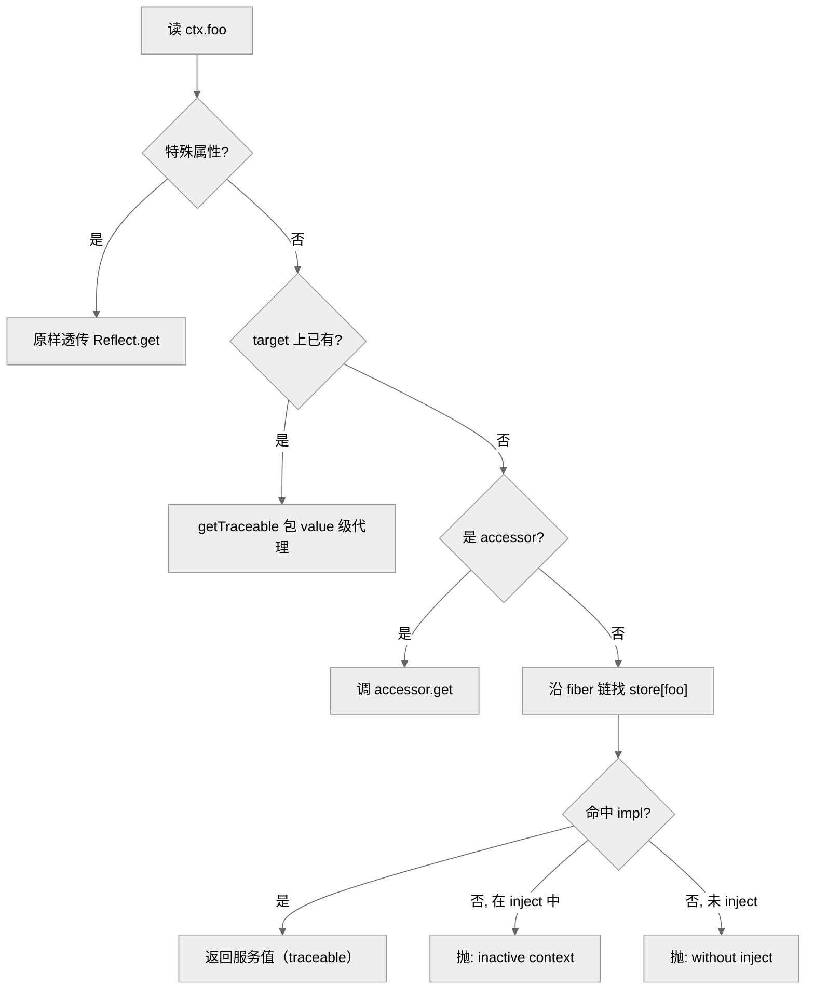
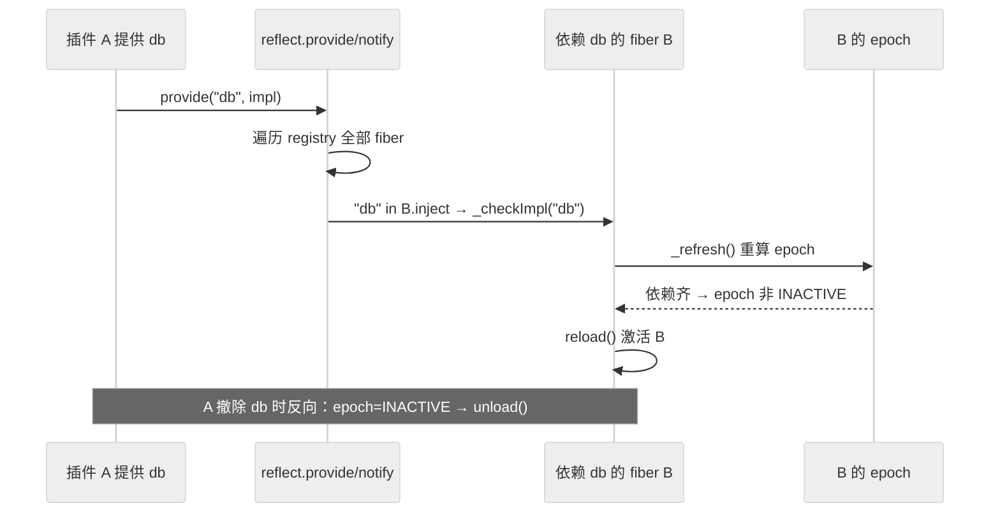

# 第 25 章　Context 与 Service 模型

> 读完能回答：插件代码里那个无处不在的 `ctx` 到底是什么东西？为什么写一句 `ctx.logger`、`ctx.database` 就能拿到服务，而拿不到时又会抛"cannot get property without inject"？一个 `Service` 子类是怎么"一被 new 出来就自动挂到 `ctx` 上"的？以及——`ctx` 明明是同一个变量，为什么每个插件看到的却是"各自的一份"？

上一章我们认了 Cordis 的门牌、点了它与 Koishi/dsh 的血缘；从本章起正式拆内核。第一块要拆的，是 Cordis 里出现频率最高、也最容易被当成"黑盒魔法"的两个词：**Context**（简称 `ctx`）和 **Service**。可以先记一句大白话——`ctx` 是"能力的插座总线"，Service 是"插上去的电器"，而插座标准（哪个名字对应哪个能力）由一套 Proxy 中介在背后维护。本章精读 `context.ts`、`service.ts`、`registry.ts`、`reflect.ts`、`index.ts` 五个文件，它们都不长，加起来六百行左右。

---

## 一、Context 是什么：service 容器 + 稳定 key + ctx 树

`Context` 类本体只有 78 行（`context.ts:21-78`）。它的构造函数做了三件事（`context.ts:36-49`）：初始化两个内部字典 `[symbols.isolate]` 与 `[symbols.intercept]`；把 `this` 包进一个 **Proxy**（`new Proxy(this, ReflectService.handler)`，`context.ts:39`），并让 `root` 指向这个代理；然后依次装配四个内建 service——`reflect`、`registry`、`events`、`logger`（`context.ts:43-46`）。构造函数最后 `return self`（`context.ts:48`），返回的其实是那层 Proxy，不是裸对象。**这一点是理解后面一切的地基**：你手里的每个 `ctx` 都是代理，任何 `ctx.xxx` 都先经过 handler。`[verified]`

所谓"service 容器"，指的就是 `ctx.logger`、`ctx.events`、`ctx.registry`、`ctx.reflect` 这几个字段（在 `interface Context` 里声明，`context.ts:9-19`）。它们不是普通属性，而是**通过名字（字符串 key）解析到服务实例**的稳定访问点——写 `ctx.logger` 永远拿到"当前作用域可见的那个 logger"，哪怕它是别的插件后来才提供的。

"稳定 key"这个词值得展开。Cordis 不用字符串直接做存储键，而是用字符串映射到一个 **symbol**：`ctx[symbols.isolate]` 是一个 `Dict<symbol>`（`context.ts:10`），把服务名（如 `"logger"`）映射到一个唯一 symbol；真正的存储 `reflect.store` 则以这个 symbol 为键（`reflect.ts:135`、`reflect.ts:184-190`）。这样做的好处在下一节的 `isolate` 里才显出来：同一个名字，可以在不同作用域指向不同 symbol，从而"同名不同物"。

`ctx` 还构成一棵**树**。`extend(meta)` 用 `Object.create(getTraceable(this, this))` 派生出一个子 `ctx`，把 `meta` 里的属性定义拷过去（`context.ts:55-63`）。派生是原型继承式的——子 ctx 找不到的属性会沿原型链回落到父 ctx。真正给这棵树"分叉"的是两个方法：`isolate(name)` 复制一份 isolate 表、给某个名字换一个新 symbol（`context.ts:65-69`），于是子树里的这个服务与外界隔离；`intercept(name, config)` 则往 intercept 表里叠一层配置（`context.ts:71-77`）。而每个插件实例专属的 `ctx`，正是 fiber 构造时用 `parent.extend({ fiber: this })` 造出来的（见 Ch26，`fiber.ts:135`）——**ctx 树与 fiber 树是同一棵树的两个视角**：作用域即血缘。

> 为什么重要：把"取一个服务"从"读一个字段"抽象成"按名字在作用域里解析"，Cordis 才能做到热插拔——服务实例换了、被隔离了、还没就绪，`ctx.foo` 这行代码一个字都不用改，解析结果自动跟着变。

图注：Context 构造即"包一层 Proxy + 装配四个内建 service"，extend/isolate/intercept 沿原型链派生出 ctx 树；本图证明 root 返回的是代理而非裸对象（context.ts:36-77）。

---

## 二、Service 抽象：一被构造就注册到 `ctx[key]`

`Service` 是个抽象基类（`service.ts:5`）。它的构造函数签名是 `constructor(protected ctx: Context, name: string)`（`service.ts:18`），关键逻辑压在短短十几行里（`service.ts:18-35`）：

1. `name` 缺省时回落到 `this.constructor['provide']`（`service.ts:19`）——即服务名可以写在类的静态 `provide` 字段上。
2. 建一个 `tracker = { associate: name, property: 'ctx' }`（`service.ts:22-25`），这是给 utils 那层 traceable Proxy 用的元信息（下一节讲）。
3. 若类定义了 `[symbols.invoke]`（可调用服务），用 `createCallable` 把 `self` 变成一个函数对象（`service.ts:26-28`）——这就是为什么某些 service 既能 `ctx.foo.bar()` 又能 `ctx.foo()` 直接调用。
4. **最要害的一行**：`self.ctx.reflect.provide(name, self, this[symbols.check])`（`service.ts:33`）。构造函数不返回裸 `this`，而是先把自己注册进 reflect，再 `return self`（`service.ts:34`）。

也就是说——**"new 一个 Service 子类"这个动作本身，副作用就是把它挂到 `ctx.<name>` 上**。使用者通常不直接 `new`，而是把这个类当插件 `ctx.plugin(MyService)`，由 fiber 在激活时 new 它（`fiber.ts:150-156`）；服务的生命周期于是与 fiber 的 reload/unload 绑定：fiber 失活时 `provide` 注册的 disposer 会把它从 store 里摘掉（`reflect.ts:195-201`）。`[verified]`

`Service` 基类还带两个协议钩子：`[symbols.filter]`（`service.ts:37-39`）用 isolate 表判断"这个 ctx 是否属于本服务的作用域"，是服务可见性的过滤器；`[symbols.resolveConfig]`（`service.ts:51-67`）沿 intercept 原型链自底向上收集配置并合并——这解释了 `ctx.intercept()` 叠的配置最终怎么汇到服务上。此外 `Service[Symbol.hasInstance]` 被特意重写（`service.ts:69-79`），沿 `prototype.constructor` 链手动比对，注释直言 "constructor may be a proxy"（`service.ts:73`）——因为服务构造出来的是 Proxy，原生 `instanceof` 会失灵。`[verified]`

图注：Service 的注册是构造函数的副作用——new 即 provide；本图证明服务实例进入 store 的完整链路与其被 fiber 生命周期托管的事实（service.ts:18-34、reflect.ts:175-201）。

---

## 三、registry：插件/服务注册表与 uid

`RegistryService`（`registry.ts:125-214`）是"哪些插件被装过"的账本。核心是一个私有 `Map<Function, Plugin.Runtime>`（`_internal`，`registry.ts:127`）：键是插件的 callback 函数，值是 `Runtime`（一份 callback + Config schema + `fibers` 列表，`registry.ts:94-99`）。它对外是个类集合接口——`keys/values/entries/forEach/size`（`registry.ts:140-187`），所以 `ctx.registry` 可被枚举，用来盘点当前装了哪些插件。

`plugin()` 是装载入口（`registry.ts:193-213`）：先 `resolve` 出 callback（函数或带 `apply` 的对象，`registry.ts:144-149`），`assertActive` 断言当前 fiber 还活着，找不到 runtime 就新建并入表，然后 `new Fiber(...)` 造一个新实例，最后包一层 `wrapped`（带 `then`）让 `ctx.plugin(...)` 可 `await`（`registry.ts:207-212`）。

`uid` 是实例的全局递增编号，来源是 registry 上的 `counter` getter——每读一次自增一次（`registry.ts:136-138`），fiber 构造时取它作 `this.uid`（`fiber.ts:134`）。uid 兼作"是否存活"的标志：置 `null` 即 DISPOSED（见 Ch26）。删除插件走 `delete()`：从 map 摘键，再逐个 `fiber.dispose()`（`registry.ts:162-171`）——**注册表与生命周期在这里合流**。

---

## 四、reflect：Proxy 中介的属性访问、caller 与 shadow

`ReflectService`（`reflect.ts:61-281`）是整套魔法的中枢，但它**没有从 `index.ts` 导出**（`index.ts:1-7` 只导出 context/events/fiber/logger/registry/service/utils，无 reflect）——它属于内部机制，使用者只通过 `ctx.reflect` 这个实例字段间接接触（该字段在 `interface Context` 里声明，`context.ts:17`）。`[verified]`

它身上挂着两块 Proxy 逻辑，务必分清：

- **Context 级 handler**（`ReflectService.handler`，`reflect.ts:62-133`）：就是第一节里包住 `ctx` 的那层。`get` 拦截 `ctx.<name>`——特殊属性（symbol、`prototype`/`then`、数字串、`_` 开头，见 `isSpecialProperty` `reflect.ts:33-38）直接透传；否则先查 `accessor`，再沿 **fiber 链**向上走 `fiber.store?.[prop]` 找服务实现（`reflect.ts:79-93`）。找不到、且该名字在 `fiber.inject` 里被声明为依赖，就抛 `cannot get required service "x" in inactive context`（`reflect.ts:86-89`）；纯粹没 inject 过，则抛 `cannot get property "x" without inject`（`reflect.ts:71`）。**这就是那句著名报错的出处**。`set` 同理，未经 `provide` 声明的写入会被拒（`reflect.ts:100-124`）。
- **Value 级 traceable**（`getTraceable`/`createTraceable`，在 **utils.ts**）：这正是 `utils.ts` 那层 Proxy 的用处所在——它是 ctx 两层代理里的第二层。当你从一个 ctx 上取出某个带 `tracker` 的值（如一个 service），`getTraceable` 会再包一层代理（`utils.ts:110-118、157-212`），把访问归属到"是哪个 ctx 取的"。其中 **caller-context** 由 `caller = ctx[symbols.shadow] ?? ctx` 决定（`utils.ts:158`），**shadow** 则是"影子 ctx"——`createShadow`（`utils.ts:141-146`）在方法调用时把 `this` 换成携带调用者身份的影子 ctx，从而让服务内部也能知道"是谁在调我"。`Context.extend` 里对 `symbols.shadow` 的透传（`context.ts:56-62`）就是配合这套机制。

一句话概括这两层：**handler 管"按名字找到服务"，traceable 管"记住是谁找的"**。前者实现容器语义，后者实现调用溯源与作用域正确性。

`provide()`（`reflect.ts:175-203`）把服务写进 store：它整个包在 `ctx.fiber.effect(...)` 里（可逆），登记 `props[name]` 类型、给 root 的 isolate 表补一个 symbol（`reflect.ts:184`）、建 `Impl` 存进 `store[key]`，若 fiber 已 ACTIVE 就 `notify`（`reflect.ts:192-194`），并返回一个 async disposer 负责摘除与等待依赖清理（`reflect.ts:195-201`）。构造器里还用 `mixin` 把 reflect/fiber/registry/events 的部分方法直接挂到 ctx 顶层（`reflect.ts:144-147`），这就是 `ctx.on`、`ctx.plugin`、`ctx.effect` 能直接写的原因。

图注：ctx.foo 的解析决策树——两层 Proxy 分工明确；本图证明"without inject / inactive context"两句报错的分支来源（reflect.ts:62-98）。

---

## 五、inject：声明依赖、驱动 fiber 激活

依赖注入是把 Context 容器和 fiber 生命周期缝起来的针脚。声明依赖有两种写法：数组或对象形式的 `inject` 字段（`Inject` 类型，`registry.ts:11`），以及 `@Inject(name, config)` 装饰器（`registry.ts:17-40`，可用于类或方法）。运行期用 `Inject.resolve` 把它们归一成 `{ name: config | null }` 字典（`registry.ts:43-60`）。还有命令式的 `ctx.inject(deps, callback)`（声明在 `registry.ts:120`，实现 `registry.ts:189-191`，本质是装一个带 inject 的匿名插件）。

关键在于 inject **如何驱动激活**。fiber 构造时把 `Inject.resolve(plugin.inject)` 存为 `this.inject`（`registry.ts:207`、`fiber.ts:125`），并对每个依赖名 `_checkImpl`（`fiber.ts:166-168`）。当某个服务被 `provide` 或撤除时，reflect 的 `notify()` 会遍历 registry 里所有 fiber，凡是 `name in fiber.inject` 的就重新 `_checkImpl` 并 `_refresh`（`reflect.ts:205-227`）。`_refresh` 把当前依赖集的取值编码成一个 **epoch 字符串**（拼接各依赖所在 fiber 的 uid，`fiber.ts:385-397`）：只要有一个依赖缺失就置 `INACTIVE`，否则给出一个确定版本号。epoch 从 `INACTIVE` 变为有值 → fiber 激活（reload）；反向 → 失活（unload）。**依赖齐了插件才活，依赖没了插件自动退**——这套 epoch 机制是 Ch26 的主戏，此处只点到它由 inject 触发。`[verified]`

图注：provide 一个服务如何"连锁激活"依赖它的 fiber；本图证明 inject 是 notify→checkImpl→refresh→epoch 这条激活链的入口（reflect.ts:205-227、fiber.ts:371-397）。

---

## 六、承重判断

回头看这套"symbol 隔离表 + 两层 Proxy"的设计，它比"直接把服务当普通字段存"（`ctx.foo = service`）重得多，为什么值得？第一性的答案是：对一个"改代码不重启、插件随时增删"的内核，**作用域隔离与热插拔是硬需求**——直接存字段既做不到 `isolate` 的"同名不同物"，也无法在服务未就绪时给出精确报错、更没法把取值挂到 fiber 链上随生命周期联动，而这些恰是 symbol 键（隔离表 `context.ts:10、65-69`，symbol 键 `reflect.ts:135、184`）加两层 Proxy（`context.ts:39` 与 `utils.ts:157-212`）换来的能力；Proxy 带来的理解与性能成本（栈里全是代理、`instanceof` 要特判）是为这两项能力付的必要代价。[verified]

放到横向视角，这也解释了 dsh 为何愿意把整个 Cordis vendored 进来：多数 agent harness 面向"一次性任务编排"，用显式传参或模块单例已经够；而 Cordis 这套"Context 即依赖注入容器 + Proxy 稳定 key"服务的是"长期运行、插件生态、热重载"的场景，DI（dependency injection，依赖注入——由容器按名字把依赖"送上门"，而不是使用方自己去 new）容器是刚需——两者目标不同、无所谓孰优，dsh 选择 Cordis 正说明它要的是后一种能力。[inferred]

---

## 七、易错点与仍存的局限

- **`ctx.foo` 报错两态别混**：`without inject`（`reflect.ts:71`）= 你压根没声明依赖；`inactive context`（`reflect.ts:86-89`）= 声明了但服务当前不可用。前者改代码加 inject，后者是时序/依赖未就绪问题。
- **`instanceof Service` 不可靠**：服务实例是 Proxy，靠重写的 `Symbol.hasInstance`（`service.ts:69-79`）兜底；自定义类若破坏 constructor 链会失效。`[verified]`
- **reflect 是内部实现，未导出**（`index.ts` 无 reflect 行）——不应把 `ReflectService` 当公开 API（Application Programming Interface，应用编程接口，即一个模块对外公开、承诺稳定的调用入口）直接依赖，只用 `ctx.reflect` 暴露的那几个方法（`get/set/provide/accessor/mixin`，经 mixin 挂到 ctx，`reflect.ts:144`）。`[verified]`
- **同名服务在同作用域重复 provide 会抛**：`service "x" has been registered`（`reflect.ts:187-189`）；跨 isolate 作用域才允许同名。
- **局限**：整套依赖 ES Proxy 与大量 `Symbol.for` 全局符号（`utils.ts:47-71`），调试时栈帧和对象检查都被代理层遮挡；这是 Cordis 用表达力换来的可读性成本，`4.0.0-rc`（rc = release candidate，候选发布版，尚未正式发版）阶段 API 也仍在动（见 Ch24）。`[inferred]`

---

## 小结与衔接

一句话概括本章：**`ctx` 是一层 Proxy 包起来的服务容器，Service 靠构造副作用把自己 `provide` 进 store，reflect 用"名字→symbol→fiber 链"三级解析支撑热插拔与作用域隔离，而 inject 则把服务的有无翻译成 fiber 的激活/失活**。Context 树与 fiber 树是同一棵树——这正好把本章交给下一章：Ch26 会把 fiber 的 epoch 版本号、六态生命周期与可逆 effect 全部展开，解释"依赖齐了才激活、没了就干净回收"在代码里如何成立。至于服务如何跨进程/跨 loader 边界共享，则留给 Ch28 的 loader/HMR。

## 源码索引

- `repo/cordis/packages/core/src/context.ts:9-19` —— `interface Context`：内建 service 字段声明
- `repo/cordis/packages/core/src/context.ts:36-49` —— 构造函数：Proxy 包裹 + 四个内建 service 装配 + `return self`
- `repo/cordis/packages/core/src/context.ts:10` —— `[symbols.isolate]: Dict<symbol>`（稳定 key 表）
- `repo/cordis/packages/core/src/context.ts:55-77` —— `extend` / `isolate` / `intercept`（ctx 树派生）
- `repo/cordis/packages/core/src/service.ts:18-34` —— Service 构造：name 回落 provide、tracker、`reflect.provide` 注册
- `repo/cordis/packages/core/src/service.ts:37-39` —— `[symbols.filter]`：isolate 作用域过滤
- `repo/cordis/packages/core/src/service.ts:51-67` —— `[symbols.resolveConfig]`：intercept 链配置合并
- `repo/cordis/packages/core/src/service.ts:69-79` —— `Symbol.hasInstance` 特判（constructor 可能是 proxy）
- `repo/cordis/packages/core/src/registry.ts:125-214` —— `RegistryService`：`_internal` Map、counter/uid、`plugin()`
- `repo/cordis/packages/core/src/registry.ts:11-60` —— `Inject` 类型 / `@Inject` 装饰器 / `Inject.resolve`
- `repo/cordis/packages/core/src/registry.ts:120` —— `ctx.inject` / `ctx.plugin` 声明
- `repo/cordis/packages/core/src/reflect.ts:61-133` —— `ReflectService.handler`：Context 级 get/set/has
- `repo/cordis/packages/core/src/reflect.ts:33-38` —— `isSpecialProperty`（特殊属性透传规则）
- `repo/cordis/packages/core/src/reflect.ts:71、86-89` —— 两句报错分支
- `repo/cordis/packages/core/src/reflect.ts:135-136、175-203` —— store/props、`provide()`（含 disposer）
- `repo/cordis/packages/core/src/reflect.ts:144-147` —— `mixin` 把 on/plugin/effect 挂到 ctx 顶层
- `repo/cordis/packages/core/src/reflect.ts:205-227` —— `notify()`：驱动依赖 fiber 重算
- `repo/cordis/packages/core/src/utils.ts:110-212` —— `getTraceable`/`createTraceable`：value 级代理与 caller/shadow
- `repo/cordis/packages/core/src/utils.ts:47-71` —— `symbols` 全局符号表
- `repo/cordis/packages/core/src/fiber.ts:125、134、166-168、385-397` —— fiber.inject、uid、_checkImpl、_refresh(epoch)
- `repo/cordis/packages/core/src/index.ts:1-7` —— 出口清单（**不含 reflect**）
