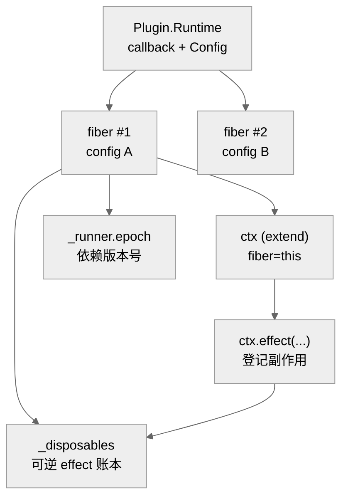
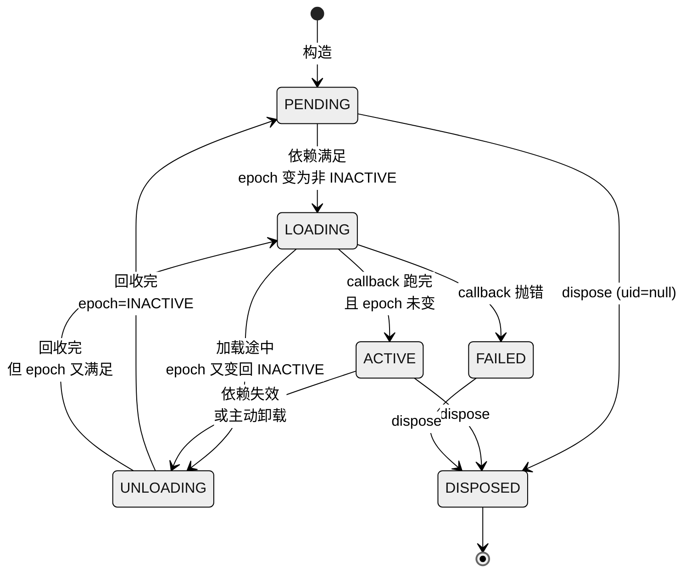
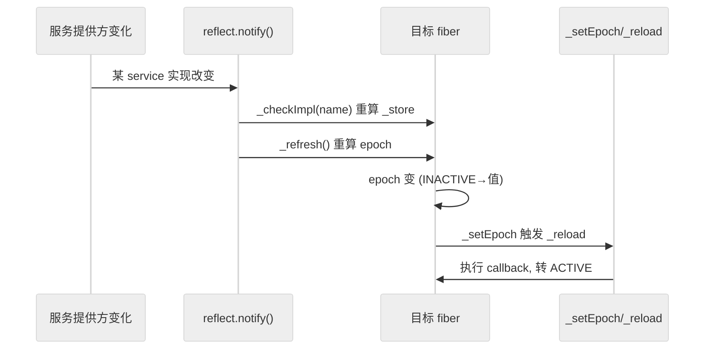
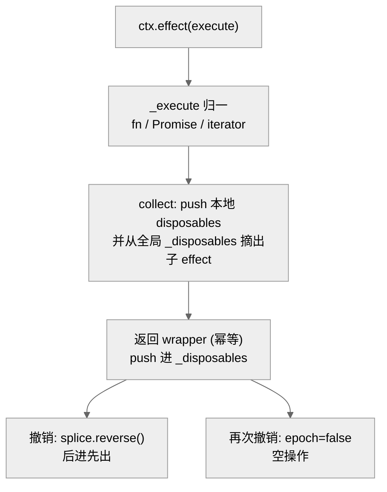

# 第 26 章　Fiber 生命周期与可逆 effect

> 读完能回答：一个插件被 `ctx.plugin()` 装进来之后，运行时到底用什么"载体"来记住它、驱动它、又在依赖消失时把它干净地收走？为什么"卸载一个插件 = 它从没来过"在 Cordis 里不是口号而是代码不变量？以及——这套机制和 Part IV 那篇论文的 revertible effect / reactive coeffect / component lifecycle，是怎么一句句对上的？

本章精读 `repo/cordis/packages/core/src/fiber.ts`（约 486 行，是 core 包里最承重的单文件）。前面几章我们把 Cordis 的 `Context`、`Registry`、服务反射拆开看过；这一章要把它们的运行时"骨架"补上——**fiber**。可以先记一个大白话定义：`ctx.plugin(foo)` 是"声明我要装 foo"，而 fiber 是"foo 这次装进来后，真正活在内存里、有状态、会被激活也会被回收的那个运行实例"。

---

## 一、fiber 是什么：插件实例的运行时载体

在 Cordis 里，`Plugin.Runtime` 是插件的"类"（一份 callback + 一份 Config schema，见 `registry.ts:203`），而 **fiber 是这个类的一次"实例化运行"**。一个插件可以被 `ctx.plugin()` 装载多次（不同配置），于是同一个 runtime 下会挂着多个 fiber——`runtime.fibers` 就是一个 `DisposableList<Fiber>`（`registry.ts:96`）。

fiber 上挂着一个插件实例"活着"所需的全部运行时状态（`fiber.ts:103-120`）：

- `uid`：实例编号，也是"是否还没被销毁"的标志位——一旦置 `null` 即进入 DISPOSED（`fiber.ts:104`）。
- `ctx`：这个插件专属的 `Context`（`parent.extend({ fiber: this })`，`fiber.ts:135`）。**注意这里的自相似**：新 context 里塞了 `fiber: this`，而 context 又暴露 `effect` 方法（`fiber.ts:8-12`）——插件代码里写的 `ctx.effect(...)`，最终就是调到它自己 fiber 的 `effect()`。
- `state`：生命周期状态枚举，初值 `PENDING`（`fiber.ts:107`）。
- `_disposables`：一个 `DisposableList<Disposable>`，登记这个 fiber 激活期间产生的**所有可撤销副作用**（`fiber.ts:113`）。这是"可逆"的账本。
- `inertia`：一个 `Promise<void> | undefined`，表示"当前正在进行的异步迁移"（加载或卸载）。它是 Cordis 处理"迁移途中目标又变了"的关键，后面详述。
- `_runner.epoch`：一个字符串"版本号"，编码了"当前依赖集的取值快照"。它是否等于哨兵 `INACTIVE`（`'__INACTIVE__'`，`fiber.ts:101`），直接决定这个 fiber 该激活还是失活。

fiber 还分两种。**根 fiber**（`runtime` 为 `null`，`fiber.ts:200-212`）是整棵树的锚点：它一出生就是 `ACTIVE`，`ctx` 直接复用 parent，`execute` 是空函数——它不代表任何插件，只是让"所有 effect 都必须挂在某个 fiber 上"这条规则有个根。**普通 fiber**（有 `runtime`）才对应一个真实插件实例，它的 `dispose` 本身就是父 fiber 上的一个 effect（`fiber.ts:170-199`）——也就是说，**装载一个插件，对父级而言就是一次可撤销的副作用**。这个自引用结构（"插件的存在本身是父插件的一个 effect"）是整套热插拔能层层回滚的根基。

> 为什么重要：把"一个插件实例"显式建模成对象，而不是散落在闭包里的一堆回调，Cordis 才能对它做状态查询（`getEffects()`、`name`）、生命周期编排（reload/unload）、以及最关键的——**统一回收**。

图注：一个 runtime（插件"类"）可挂多个 fiber（实例）。每个 fiber 持有专属 ctx、可逆 effect 账本 _disposables、以及依赖版本号 epoch。插件代码里的 ctx.effect() 最终写入本 fiber 的账本——证明"fiber 是插件实例的运行时载体"这一定位。[verified] fiber.ts:103-120, 135, 170

---

## 二、生命周期状态机与 epoch 驱动

### 2.1 六个状态，两条主线

`FiberState` 枚举定义在 `fiber.ts:78-85`：`PENDING`、`LOADING`、`ACTIVE`、`FAILED`、`DISPOSED`、`UNLOADING`。它们不是随便凑的六个词，而是"两个稳定态 + 两个过渡态 + 两个终止/异常态"：

- **稳定态**：`PENDING`（依赖没齐，静静等着）与 `ACTIVE`（依赖齐了，插件正在运行）。
- **过渡态**：`LOADING`（正在执行插件 callback）与 `UNLOADING`（正在逆序回收副作用）。
- **异常/终止**：`FAILED`（加载中抛错）与 `DISPOSED`（被彻底销毁，`uid=null`）。

状态不是到处乱设的，而是由一个纯函数 `_getState()` 从更底层的事实**推导**出来（`fiber.ts:348-353`）：`uid===null` → DISPOSED；有 `_error` → FAILED；`epoch !== INACTIVE` → ACTIVE；否则 PENDING。这里藏着一个刻意的取舍：Cordis 没有另设一个布尔 `active` 字段来表达"未激活"，而是把"是否激活"和"依赖快照版本"合并进同一个 `epoch` 字符串、用哨兵 `INACTIVE` 兜底——热插拔最怕"状态与它的派生状态不一致"，把二者收敛成单一真相源，`_setEpoch` 的相等比较一次就判掉"要不要迁移"，从结构上消除了不一致窗口；state 从 epoch 派生而非另存，正印证这一设计取向（`fiber.ts:101、399-413`）。[verified] 真正写 `state` 字段的唯一入口是 `_updateState()`（`fiber.ts:355-369`）：它先记旧态，跑回调拿新态（回调不返回就用 `_getState()` 兜底），若有变化就 `emit('internal/status', this, oldState)` 广播，并在跨越 ACTIVE 边界时通知本 fiber 提供的服务（`fiber.ts:363-368`）。

> 这意味着：外部想观察"某插件是否就绪"，订阅 `internal/status` 事件即可；而 LOADING/UNLOADING 两个过渡态之所以存在，是为了让"异步加载/卸载途中"有名字可称呼——这正对应论文把迁移动作提升为"惯性态"（Part IV 图 4）。

图注：fiber 生命周期状态机。两条稳定态 PENDING/ACTIVE，过渡态 LOADING/UNLOADING，异常态 FAILED，终止态 DISPOSED。关键在于 LOADING/UNLOADING 都可能"回头"——加载途中依赖没了就转去卸载，卸载途中依赖又回来就转去加载——这正是 epoch 驱动的自愈行为。[verified] fiber.ts:78-85, 348-353, 405-411, 428-433, 451-456, 180

### 2.2 epoch：把"依赖是否满足"压成一个字符串

fiber 怎么知道自己该不该激活？答案是 **epoch**——一个编码了"当前所有依赖各自由谁提供"的字符串。`_refresh()`（`fiber.ts:385-397`）逐个遍历 `this.inject` 声明的依赖：只要有一个在 `_store` 里找不到实现，epoch 直接置 `INACTIVE`；否则把每个依赖提供方的 `fiber.uid` 拼进去（`epoch += ':' + impl.fiber.uid`）。

这个设计有两层巧思。其一，**任一依赖缺失 → 整体 INACTIVE**，天然实现"依赖到齐才激活、任一消失就失活"。其二，epoch 里编码了**提供方的 uid**——也就是说，即使依赖"名字还在"，但换了个提供者（uid 变了），epoch 也会变，从而触发一次 reload。这对应论文里 $\varepsilon_d(\sigma)$ 定义为"依赖当前取值快照"（Part IV 图 3）：不只看"有没有"，还看"是不是同一个"。

`_setEpoch()`（`fiber.ts:399-413`）是驱动状态迁移的开关：新旧 epoch 相等就啥也不做（幂等）；否则更新 epoch，然后——**若 `inertia` 存在（正在迁移中），只记账不动作**（`fiber.ts:403`），把动作推迟到当前迁移结束；否则根据"从 INACTIVE 变为非 INACTIVE（激活）还是反之（失活）"，分别启动 `_reload()`（转 LOADING）或 `_unload()`（转 UNLOADING）。

那 `_store` 又是谁填的？是 reactive coeffect（响应式 coeffect——coeffect 可粗略理解为 effect 的"对偶"：effect 是插件主动对外产生的副作用，coeffect 则是插件对外部环境的"索取/依赖"，"响应式"指这份依赖一旦被满足或撤销，框架会主动"推"通知过来，而不用插件自己轮询）的"通知"端。`ReflectService.notify()`（`reflect.ts:205-227`）在某个服务实现变化时，扫描所有 fiber，对那些 `inject` 了该服务名的，调 `_checkImpl()` 重算 `_store`，再调 `_refresh()`。`_checkImpl()`（`fiber.ts:371-383`）还会跑该服务的 `check` 谓词——不满足就当作没有。于是形成完整闭环：**服务变化 → notify → checkImpl → refresh → setEpoch → reload/unload**。

> 打个比方：epoch 像一张"点名表"，把插件需要的每样东西现在由谁负责登记成一串编号。点名表一变，插件就知道"要么该开工了，要么该收摊了"——它自己不用去轮询谁来了谁走了。

图注：reactive coeffect 的通知链路。服务实现一变，notify 主动找到所有 inject 了它的 fiber，重算依赖快照 epoch，epoch 一变即驱动 reload/unload。插件是被"推"着激活的，不是自己"拉"轮询——这就是"响应式 coeffect"。[verified] reflect.ts:205-227, fiber.ts:371-397

---

## 三、可逆 effect：disposer、反序卸载与幂等

### 3.1 `ctx.effect()` 的契约

`effect()` 是本文件的核心 API（Application Programming Interface，应用编程接口，即对外公开的调用入口）（`fiber.ts:275-340`）。它的契约一句话：**你交给我一个"产生副作用的函数"，我还你一个"撤销这个副作用的 disposer"**。传入的 `execute` 可以返回四种形态之一（`fiber.ts:229-273` 的 `_execute` 负责归一）：一个 disposer 函数、`null`（无副作用）、一个 `Promise<disposer>`、或一个（异步）迭代器逐个 yield disposer。这种多态让"同步注册、异步初始化、多步注册"都走同一条路。

每次 `effect()` 调用会：先 `assertActive()` 确认 fiber 没被销毁（`fiber.ts:224-227`，否则抛 `INACTIVE_EFFECT`）；建一个本地 `disposables` 数组收集本次 effect 内部产生的所有 disposer；跑 `_execute`；最后把一个 `wrapper`（带幂等保护的总 disposer）push 进 fiber 的 `_disposables`（`fiber.ts:338`）。

### 3.2 反序卸载

"可逆"的关键在**顺序**。effect 内部的 `dispose()`（`fiber.ts:281-294`）对收集到的 disposer 做 `disposables.splice(0).reverse()`——**后注册的先撤销**。fiber 整体卸载时，`_unload()`（`fiber.ts:437-458`）调 `this._disposables.clear()`，而 `DisposableList.clear()` 返回的正是 `values.reverse()`（`utils.ts:26-30`）——同样反序。

为什么必须反序？因为副作用常有依赖顺序：先建连接再注册路由，拆的时候必须先撤路由再断连接。反序（后进先出，像栈）保证撤销时每一步的前置条件都还在。这与论文中"组合算子 $\diamond$ 的逆是各分量逆的反序组合"是同一条代数律的运行时体现（参见 Part IV §2.2、§3.1）。

### 3.3 幂等：撤销键只灵一次

`effect()` 返回的 `wrapper`（`fiber.ts:322-326`）带一个守卫：`if (!runner.epoch) return; runner.epoch = false; ...`。这里 `runner.epoch` 是个布尔"是否还没撤销"标志。**重复调用 disposer 是无害的空操作**——第二次进来 `epoch` 已是 `false`，直接返回。这对应论文的 idempotent guard `idem`：撤销键只灵一次，重复按不出事。

还有一处易被忽略的细节：`_execute` 的 `collect` 回调里有 `this._disposables.delete(dispose)`（`fiber.ts:300-306`）。这是**嵌套 effect 的"改挂"**——子 effect 本来会把自己 push 进 fiber 的全局 `_disposables`，但当它是在另一个 effect 内部创建时，要把它从全局账本里摘出来、改挂到父 effect 的本地 `disposables` 下。于是撤销父 effect 时会连带、且按正确顺序撤掉所有子 effect，`meta.children` 也记录了这棵树（`getEffects()`，`fiber.ts:342-346`）。

> 对使用者来说：你只管 `const off = ctx.effect(() => { ...; return cleanup })`，剩下的"按什么顺序清、清几次、嵌套怎么办"框架全包了。这就是为什么 Cordis/dsh 的铁律是"Registrations are effects（一切注册皆副作用，故都要可撤销）"——写副作用时顺手交出撤销键，热插拔的正确性就自动成立。

图注：ctx.effect() 的可逆契约。归一后收集 disposer，返回幂等 wrapper；撤销时反序执行，重复撤销为空操作；嵌套 effect 通过 collect 里的 delete 改挂成父子树。三条性质（反序、幂等、嵌套树）合起来保证"完全回滚"。[verified] fiber.ts:275-340, 300-306, 322-326, utils.ts:26-30

---

## 四、restart / update 与重入卸载

### 4.1 惯性态：迁移途中目标又变了

异步是热插拔的头号敌人。插件的 callback 可能 `await` 半天还没跑完，这时依赖又消失了怎么办？Cordis 的答案是 **inertia（惯性）**：`inertia` 字段持有"当前正在进行的迁移 Promise"。

看 `_reload()`（`fiber.ts:415-435`）：它先快照 `store`，`await` 执行 callback；跑完后在 `_updateState` 里检查——**如果 epoch 在加载期间没变**（`this._runner.epoch === oldEpoch`），就把 `inertia = undefined`，收工（状态推导为 ACTIVE）；**如果变了**（加载途中依赖没了），立刻转身调 `_unload()`，`inertia` 换成卸载 Promise，状态转 UNLOADING。`_unload()`（`fiber.ts:437-458`）对称：回收完检查 epoch，若又变回"该激活"，再转 `_reload()`。

而 `_setEpoch` 里那句 `if (this.inertia) return`（`fiber.ts:403`）是这套机制的闸门：**迁移进行中，新的目标变化只更新 epoch、不立即动作**；等当前迁移在 `_reload`/`_unload` 末尾"回头看"时，再据最新 epoch 决定下一步。这就避免了"加载还没完就并发启动卸载"的撕裂。这正是 Part IV 图 4 的 inertial state machine。

这里其实是在"惯性排队"与"抢占中断"之间做了取舍，而 Cordis 选了前者。根因在于热插拔的第一诉求是"卸载能完全回滚"，而完全回滚要求副作用始终处于已知的完整状态——中断一个跑到一半的异步 callback，已建的连接、已注册的钩子会卡在半成品状态，回滚点根本说不清；惯性态用串行化保证"任一时刻至多一个迁移在跑、且总有明确回滚点"，`_reload`/`_unload` 末尾的 epoch 回看又保证最终会收敛到最新目标，兼顾了正确性与最终一致（`fiber.ts:403、427-434、450-457、460-466`）。[verified]

### 4.2 restart 与 update

`restart()`（`fiber.ts:468-474`）是"强制重来一遍"：`_setEpoch(INACTIVE)` 先失活（触发卸载），紧接 `_refresh()` 重算 epoch（依赖还在的话会重新激活），最后 `await fiber.await()` 等迁移彻底停下。`await()`（`fiber.ts:460-466`）就是"一直 await `inertia` 直到没有惯性任务，若有 `_error` 则抛出"——它把"多次连续迁移"收敛成一个可等待的稳定点。

`update(config)`（`fiber.ts:476-485`）在 restart 基础上换配置：先 `resolveConfig` 校验新配置（失败抛 `ValidationError`），再走 `waterfall('internal/update', ...)` 让外层有机会干预，最后清 `_error`、赋新 `config`、调 `restart()`。于是"改配置"= "带新配置重启"，语义干净。

### 4.3 重入卸载的处理

"重入卸载"指：卸载正在进行时，又有卸载/加载请求进来。Cordis 用三道防线兜住：

1. **effect wrapper 幂等**（`fiber.ts:322-326`）：同一个 disposer 被撞多次，只第一次生效。
2. **惯性闸门**（`fiber.ts:403`）：迁移中的新请求只记 epoch，不并发启动第二个迁移。
3. **迁移末尾回头看**（`fiber.ts:427-434`、`fiber.ts:450-457`）：每段迁移结束后，用最新 epoch 决定要不要再来一轮，形成"串行收敛"而非"并发打架"。

再加上根 fiber 卸载时的 `while (this.inertia) await this.inertia`（`fiber.ts:195-197`），确保销毁前把所有在途迁移排空。构造函数上方那段注释（`fiber.ts:189-194`）还诚实地交代了一个边界：`inertia` 本身不该 reject（`_reload`/`_unload` 都用 `ctx.logger.error` 吞掉工作错误），万一它真 reject，只可能是 logger 自己坏了，此时选择让异常上抛、以进程崩溃作为"诚实结局"——不掩盖不可恢复的故障。

---

## 五、与论文形式化的对应（交叉引用 Part IV）

把本章的运行时机制逐条对回 Part IV 那篇《Spatiotemporal Composability》论文，会发现 fiber.ts 几乎是论文第 3 节的"参考实现"：

| 论文形式化（Part IV） | fiber.ts 运行时机制 | 证据 |
|---|---|---|
| revertible effect：每个 effect 配显式逆，$\diamond$ 组合保持可逆 | `ctx.effect()` 返回 disposer；`_disposables` 反序回收 | [verified] fiber.ts:275-340, 437-458 |
| idempotent guard `idem` | wrapper 的 `epoch=false` 幂等守卫 | [verified] fiber.ts:322-326 |
| reactive coeffect：typed dependency + 满足性通知 | `inject` 声明 + `notify`→`_checkImpl`→`_refresh` | [verified] reflect.ts:205-227, fiber.ts:371-397 |
| epoch $\varepsilon_d(\sigma)$：依赖取值快照做版本号 | `_refresh` 把各依赖提供方 uid 拼成 epoch 字符串 | [verified] fiber.ts:385-397 |
| activating / deactivating 通知 | epoch 跨越 INACTIVE 触发 `_reload` / `_unload` | [verified] fiber.ts:399-413 |
| component lifecycle（base + inertial state machine） | 六态状态机 + `inertia` 惯性排队 | [verified] fiber.ts:78-85, 403, 415-458 |
| 统一 context type $\Gamma_\infty$ | fiber 自相似：ctx 里含 fiber，fiber 又暴露 effect | [verified] fiber.ts:8-12, 135 |

Part IV 图 1（base lifecycle 的 INACTIVE↔ACTIVE 两态）对应本章的 PENDING↔ACTIVE 稳定态；图 4（inertial state machine）对应 LOADING/UNLOADING 两个过渡态加惯性闸门。论文给的是代数与状态机的**形式**，fiber.ts 给的是同一套东西的**运行时实现**——两者可以互为注解。

不过要守住证据边界：术语与机制的一一对应是可核验的（上表 [verified]），但"究竟谁实现了谁、设计孰先孰后"源码无法证明——Part IV §4.3 自陈 Koishi 用 v3、而形式化对应 v4，二者之间存在版本演进错位，因此不宜简单断言"fiber.ts 就是论文的实现"，这层关系只能记为 [inferred]（动机则更弱，属 [claimed]）。

---

## 小结

fiber 是 Cordis 把"一个插件实例的运行时生命"对象化的产物：它用 `_disposables` 记账可逆副作用、用 epoch 字符串把"依赖是否满足"压成一个可比较的版本号、用六态状态机加 `inertia` 惯性闸门把异步热插拔的并发复杂度串行化收敛。三者合起来，让"卸载 = 反序执行所有撤销键 = 回到从未加载的状态"成为一条代码不变量，而非美好愿望。

它也是 Part IV 那篇论文从纸面走进内存的地方：revertible effect ↔ `effect()`/disposer，reactive coeffect ↔ `inject`/`notify`/epoch，component lifecycle ↔ 本章状态机。下一章我们将顺着 `dispose` 是"父 fiber 上一个 effect"这条线，进入 **Registry 与插件加载/卸载的编排**，看多个 fiber 如何在一棵 context 树上协同起落。

## 源码索引

- `repo/cordis/packages/core/src/fiber.ts:78-85` — `FiberState` 六态枚举
- `repo/cordis/packages/core/src/fiber.ts:101` — `INACTIVE` 哨兵常量
- `repo/cordis/packages/core/src/fiber.ts:103-120` — Fiber 字段（uid/state/_disposables/inertia 等）
- `repo/cordis/packages/core/src/fiber.ts:135, 170-199` — ctx.extend 自相似；dispose 作为父 fiber 的 effect
- `repo/cordis/packages/core/src/fiber.ts:200-212` — 根 fiber 分支
- `repo/cordis/packages/core/src/fiber.ts:224-227` — `assertActive` / INACTIVE_EFFECT
- `repo/cordis/packages/core/src/fiber.ts:229-273` — `_execute`：effect 形态归一
- `repo/cordis/packages/core/src/fiber.ts:275-340` — `effect()`：可逆 effect 契约（反序、幂等、嵌套改挂）
- `repo/cordis/packages/core/src/fiber.ts:348-353` — `_getState` 状态推导
- `repo/cordis/packages/core/src/fiber.ts:355-369` — `_updateState` / internal/status 广播
- `repo/cordis/packages/core/src/fiber.ts:371-397` — `_checkImpl` / `_refresh`：epoch 重算
- `repo/cordis/packages/core/src/fiber.ts:399-413` — `_setEpoch`：迁移开关与惯性闸门
- `repo/cordis/packages/core/src/fiber.ts:415-458` — `_reload` / `_unload`：惯性态迁移
- `repo/cordis/packages/core/src/fiber.ts:460-485` — `await` / `restart` / `update`
- `repo/cordis/packages/core/src/utils.ts:4-39` — `DisposableList`（clear 反序）
- `repo/cordis/packages/core/src/reflect.ts:205-227` — `notify`：reactive coeffect 通知链
- `repo/cordis/packages/core/src/registry.ts:96, 203` — `runtime.fibers` / runtime 构造
- Part IV 第 22/23 章 — 论文形式化与 dsh 映射（可逆 effect / reactive coeffect / component lifecycle）
