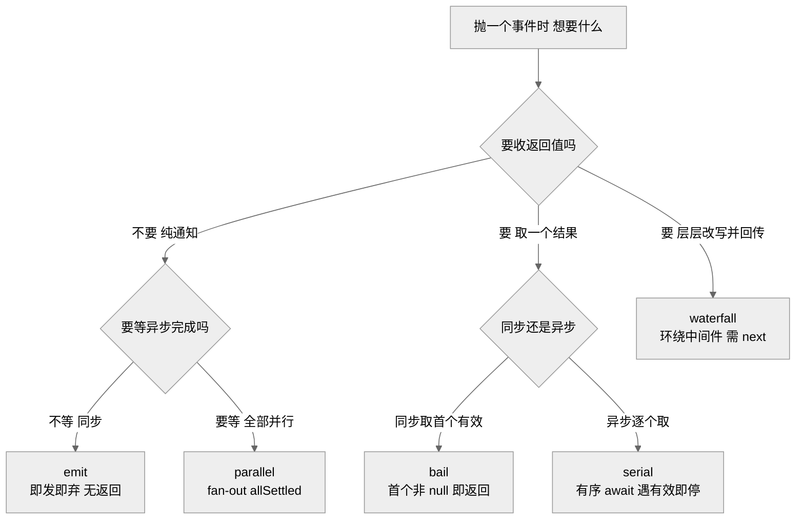
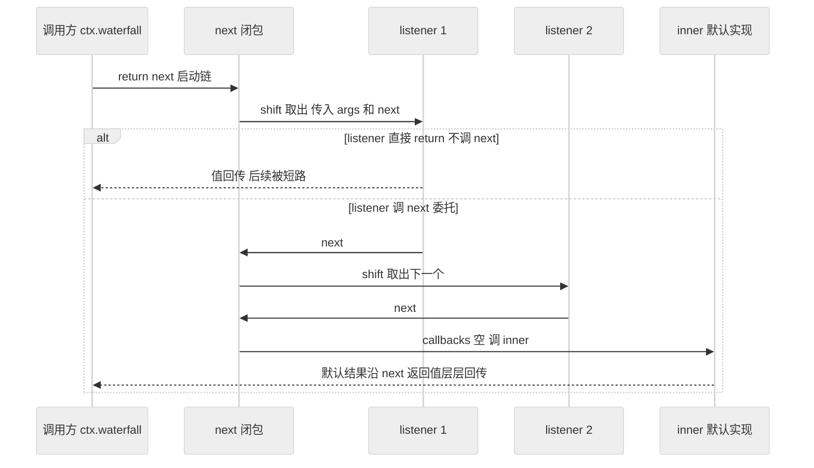
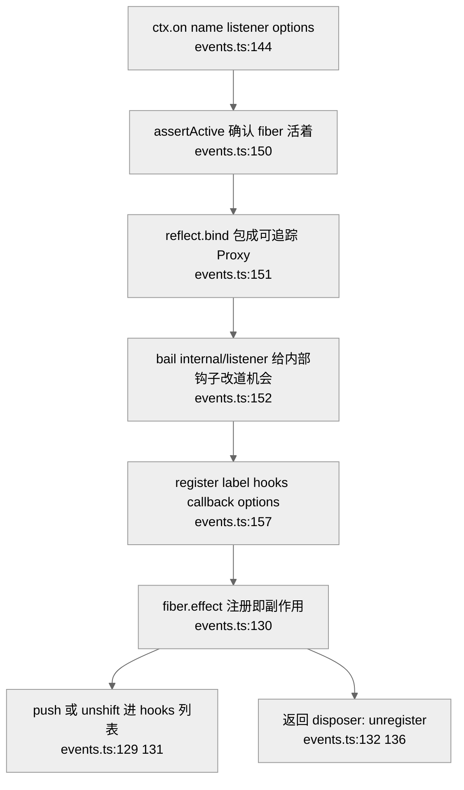
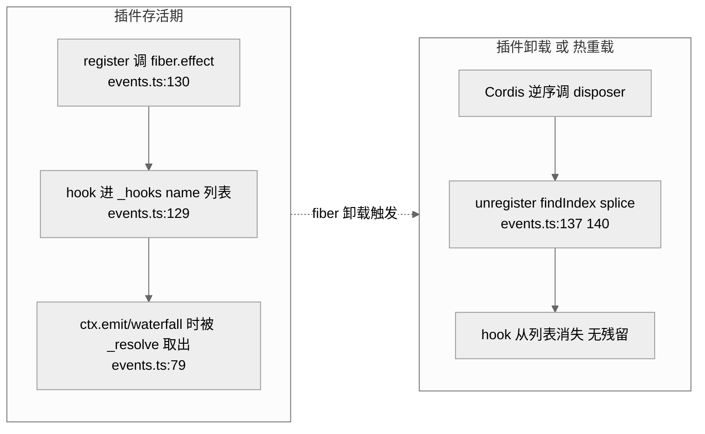

# 第 27 章 · 事件系统：emit/waterfall/serial/parallel/bail

> 本章钻进 Cordis 的事件引擎（就是那个让插件"挂到某个点上干活"的机制）。读完你能回答三个问题：为什么同一套 `ctx.on` 注册，抛事件时却分出五种截然不同的派发语义；一个 listener 注册进去为什么"卸载时能自动撤销、热重载时能自动重来"；以及第 05 章讲 dsh 微内核只用到的那四种 dispatch 模式，落到底座 Cordis 这一层到底怎么实现。全章证据来自 `repo/cordis/packages/core/src/events.ts`（仅 178 行，是整个引擎的全部）。

## 一、本质是什么

先打个比方：事件系统像公司里的"通知机制"。同样是"发个消息"，有的是全员群发喊一嗓子（发完就走），有的是文件走审批流（一个签完传下一个，谁都能打回），有的是同时抄送多个部门（各办各的、最后汇总）。Cordis 把这些"发消息的姿势"固化成五种命名方法，写进一个联合类型 `DispatchMode = 'emit' | 'parallel' | 'serial' | 'bail' | 'waterfall'`（`events.ts:14` `[verified]`）。

`EventsService` 这个类就是引擎本体（`events.ts:45`），由 `Context` 在构造时实例化（`context.ts:45` `this.events = new EventsService(self)` `[verified]`），再通过 reflect 的 mixin 把七个方法挂到每个 `ctx` 上——`this.mixin('events', ['on', 'once', 'parallel', 'emit', 'serial', 'bail', 'waterfall'])`（`reflect.ts:147` `[verified]`）。所以你平时写的 `ctx.emit(...)`、`ctx.waterfall(...)`，本质都是转发到这唯一一个 service 上。

它在 Part V 的定位：第 21、26 章讲的是 Cordis 的"Spatiotemporal Composability"底座（effect 副作用、fiber 生命周期），本章讲的是**建在那个底座之上的通信层**——插件之间、loop 与插件之间靠它对话。

## 二、核心问题与痛点

一个 agent harness 的回合里，"发消息"的需求天差地别。有时只是"告诉大家发生了什么"（生命周期通知），谁也不用回话；有时是"这个工具能不能执行"，必须有人能一票否决；有时是"把请求配置交给大家层层改写"，改完还要把结果传回来；有时是"每个持久化插件都必须落一次盘"，一个都不能漏。

如果只有一种 `emit`，这些需求就全得在业务代码里手写循环、手写 await、手写短路判断，既重复又容易错。痛点因此收敛为：**用一套统一的注册接口（`ctx.on`），配上一组语义清晰的派发方法，让"发消息的意图"直接由方法名表达，而不是散落在各处的 for 循环里。**

## 三、解决思路与方案

方案是把"派发语义"做成五个一等公民方法，每个方法内部封装好"要不要 await、要不要收返回值、能不能中途停下"这三件事的组合。五种模式一句话各记一个画面：`emit` 是广播喇叭（喊完就走），`parallel` 是群发抄送（人人一份、一起等），`serial` 是排队安检（一个个过、遇到"命中"就停），`bail` 是同步版的"问一圈取第一个有效答案"，`waterfall` 是接力赛（每棒能改交接物、也能不传棒直接冲线）。

> 图注：五种模式沿"要不要返回值、要不要 await、能不能短路"三条轴分叉。它证明 Cordis 不是给同一件事起了五个名字，而是把五种真实不同的通信意图各自固化成一个方法——选哪个方法，等于声明了这次通信的契约。

判定"有效返回值"的标准被抽成一个纯函数 `isBailed`：只要值 `!== null && !== false && !== undefined` 就算命中（`events.ts:6-8` `[verified]`）。`serial` 和 `bail` 都靠它决定要不要停下。注意 `0`、`''` 这类 falsy 值在这里算"命中"——这是个容易踩的边界，第五节会细说。

> **ratify-note · 为何把派发语义做成五个方法，而非一个带 mode 参数的 dispatch**
> - 候选解释：A 现方案——五个独立方法 `emit/parallel/serial/bail/waterfall`，各自实现；B 单一 `dispatch(mode, name, ...args)`，内部 switch(mode)；C 只保留 `emit`，短路/改写全由业务代码自理。
> - 各自利弊：A 优在类型签名可逐一精确刻画（`waterfall` 返回 `ReturnType~Events[K]~`、`parallel` 返回 `Promise~void~`、`emit` 返回 `void`，见 `events.ts:19-28` `[verified]`），调用点即文档；缺在五份实现需各自维护。B 省重复，但一个方法要同时表达同步/异步、有无返回值，类型只能退化成 any，短路语义也得靠运行时分支。C 最简，但把语义负担全甩给业务，正是第二节要消灭的痛点。
> - 选定 & 理由：选 A。第一性看，"派发语义"是通信的契约而非运行时选项，把它编码进方法名与类型签名，能让 TypeScript 在编译期就挡住"对 emit 事件取返回值"这类错误；仓库里保留的 `dispatch(type, args)`（`events.ts:83-87`）已标 `@deprecated`，反向印证单一入口不是首选方向。
> - 证据等级：[verified]（五方法与差异化类型签名、`@deprecated` 标记均在源码）+ [inferred]（"契约编进方法名优于运行时 mode"属合理推断，非动机直证）。
> - 残余风险 / pre-mortem：若半年后被证伪，最可能因五种模式仍不够用（例如需要"并行但可短路"），届时要么加第六个方法，要么回退到可配置的组合式 dispatch。

## 四、实现细节关键点

### 4.1 五种 dispatch 的实现逐个看

所有方法都先走同一个 `_resolve(type, args)`（`events.ts:72-81`）：它先判断首参是不是对象/函数，是则当作 `thisArg` 弹出（`events.ts:73`），再弹出事件名，然后按事件名取出 hooks 列表、用 `filter.call` 做作用域过滤，返回 `[thisArg, callbacks]`（`events.ts:79-80` `[verified]`）。顺带在非 `internal/` 事件上 emit 一条 `internal/dispatch` 供诊断（`events.ts:75-77`）。解析完，五种模式各走各的路：

- **emit（即发即弃）**：`for (const callback of callbacks) Reflect.apply(callback, thisArg, args)`，同步循环、无返回、不 await（`events.ts:96-99` `[verified]`）。喊完就走。
- **parallel（扇出）**：`Promise.allSettled(callbacks.map(...Reflect.apply...))`，全部并行启动、一起等；失败的用 `AggregateError` 汇总抛出（`events.ts:89-94` `[verified]`）。用 `allSettled` 而非 `all`，意味着一个 listener 失败不会阻止其他 listener 跑完——这正是"持久化检查点每个都要落一次"的语义基础。
- **serial（有序）**：`for` 里逐个 `await Reflect.apply(...)`，且 `if (isBailed(result)) return result`——**遇到首个有效返回值就停下并返回它**（`events.ts:101-107` `[verified]`）。所以 serial 不是"跑完全部"，而是"按序跑、命中即停"。
- **bail（取首个非 null 返回）**：与 serial 同构，但**同步**、不 await（`events.ts:109-115` `[verified]`）。用于同步问一圈、取第一个给出决定的人。
- **waterfall（环绕中间件）**：最特殊。先 `const inner = args.pop()` 取出最内层的默认实现，构造 `next()`——每次调用 `callbacks.shift()` 取下一个 listener 执行，取完则调 `inner(...args)`；再把 `next` 压回 args 尾部，最后 `return next()` 启动（`events.ts:117-126` `[verified]`）。

> 图注：waterfall 的两条合法走向——短路（listener 不调 `next` 直接 return）与委托（调 `next` 把控制权交给下一棒，最终落到 `inner`）。它证明 `next()` 是链条唯一的推进器：`events.ts:120-122` 里，只有调 `next` 才会 `shift` 出下一个 callback，忘了调就等于把后面所有 listener 连同 `inner` 一起静默跳过。

`serial` 会短路（命中即返回）这一点值得强调：它和 Part II 第 05 章描述的 dsh 用法（`agent/turn-stopping` 作"有序检查点、无 veto、data decides"）并不完全等价——**Cordis 的 serial 原语本身是会 bail 的**（`events.ts:105-106`），dsh 只是在那个事件上通过"让 listener 返回 undefined/让数据决定"来规避短路。原语能力与上层用法要分开看。

### 4.2 注册与 `bind`：on / once / register

注册入口是 `on(name, listener, options)`（`events.ts:144-158`）。它做四件事：先 `assertActive()` 确认当前 fiber 还活着（`events.ts:150`）；再 `listener = this.ctx.reflect.bind(listener)`（`events.ts:151` `[verified]`）；然后 `bail(this.ctx, 'internal/listener', name, listener, options)` 给内部钩子一个改写注册行为的机会（`events.ts:152`，比如 `internal/update` 会被特殊改道，见构造函数 `events.ts:54-69`）；最后落到 `register(...)`（`events.ts:157`）。`once` 则是包一层"先 dispose 自己再调真身"的壳（`events.ts:160-166`）。

这里的 `bind` 不是 `Function.prototype.bind`。`ctx.reflect.bind` 返回一个 `Proxy`，它的 `apply` 陷阱把 `thisArg` 和每个参数都过一遍 `this.trace(...)` 再 `Reflect.apply`（`reflect.ts:271-280` `[verified]`）。"trace"是 Cordis 的可追踪包装：让 listener 里拿到的 `this` 和参数都携带当前上下文血缘，从而支持作用域过滤与追责。所以 `on` 里的这一行，语义是"把 listener 绑到能追踪来源的代理上"，而不是普通的 this 绑定。

> 图注：一次 `ctx.on` 从入口到落库的完整链路。它证明注册不是简单往数组里塞回调——中间要经过可追踪包装（`:151`）、内部钩子改道（`:152`），最终以一个 effect 的形式落地（`:130`），拿到的返回值是能撤销这次注册的 disposer。

### 4.3 注册即 effect，卸载即回滚

`register` 的核心只有三行：它调 `this.ctx.fiber.effect(() => { hooks[method](...); return () => this.unregister(hooks, callback) }, label)`（`events.ts:128-134` `[verified]`）。`effect` 是 Cordis 的副作用原语（`fiber.ts:275-277`）：传入的函数返回一个 disposer，Cordis 记账；当这个 fiber 被卸载或重载时，自动逆序调用所有 disposer。

于是"注册一个 listener"天然是一次副作用：`hooks.push({ ctx, callback, ...options })` 是"做了什么"，返回的 `unregister`（`events.ts:136-142`，用 `findIndex` + `splice` 把这条 hook 摘掉）就是"怎么撤销"。**插件卸载时，它注册过的所有事件监听会被 Cordis 自动摘除，无需插件作者手写清理**——这就是第 05 章 ratify-note 里说的"listener 作为 Cordis effect 天然获得 HMR 与卸载回滚"在事件层的落点。对使用者来说，这意味着热重载一个插件时不会残留幽灵监听器，也不会重复注册。

> 图注：listener 的生老病死全绑在 fiber 的生命周期上。它证明"卸载回滚"不是事件系统自己造的机制，而是复用了 `fiber.effect`（`events.ts:130`）——事件层只负责给出"撤销动作"（`unregister`），记账与逆序执行由 effect 系统兜底。

## 五、易错点与注意事项

- **`isBailed` 把 falsy 也算命中**：`serial`/`bail` 用 `value !== null && !== false && !== undefined` 判定（`events.ts:7`），所以 listener 返回 `0`、`''`、`NaN` 都会**触发短路**。想"不表态、放行下一个"，必须 return `undefined`（或 `null`/`false`），不能随手 return `0`。
- **waterfall 忘记 `next()` = 静默短路**：`next` 是链条唯一推进器（`events.ts:120-122`），只想观测却不 `next()`，会把后续 listener 连同 `inner` 默认实现一起吃掉，且不报错。这是全系统最隐蔽的坑，第 05 章已将其列为结构性负债。
- **`parallel` 的 type 传的是 `'emit'`**：`parallel` 内部调 `_resolve('emit', args)`（`events.ts:90`），`emit` 也是（`events.ts:97`）——这个 `type` 只用于 `internal/dispatch` 诊断事件（`events.ts:75-77`），不影响派发行为，但读源码时别被"parallel 怎么解析成 emit"绕晕。
- **`assertActive` 是硬门禁**：`on` 一进来就 `assertActive()`（`events.ts:150`），在已卸载的 ctx 上注册会直接抛错，防止幽灵监听。
- **`prepend` 决定顺序**：`register` 按 `options.prepend` 选 `unshift`/`push`（`events.ts:129`），而 serial/bail/waterfall 都对顺序敏感——插错位置会改变短路结果。

## 六、竞品 / 横向对比

> **ratify-note · Cordis 事件系统相对 Node EventEmitter / koa-compose 的取舍**
> - 候选解释：A 现方案——五模式内建、注册即 effect（`events.ts` 全貌）；B Node 原生 `EventEmitter`（只有 fire-and-forget 的 `emit` + 手动 `on/off`）；C koa 式 `compose` 中间件（只有洋葱模型，对应 waterfall 一种）。
> - 各自利弊：A 优在把五种通信意图与生命周期回滚一次性内建，`waterfall` 的洋葱模型与 `emit` 的广播共用一套注册；缺在五模式 + `isBailed` 的心智成本高。B 优在极简通用、生态熟；缺在无返回值语义、无短路、无自动卸载，agent harness 要的"可否决/可改写"全得自造。C 优在洋葱模型成熟；缺在只覆盖 waterfall 一种，其余四种仍要另找机制。
> - 选定 & 理由：Cordis 选 A。第一性看，harness 需要的通信谱系（通知/否决/改写/扇出）本就不止一种，且都要吃到 fiber 的卸载回滚；用 B 或 C 都只能覆盖其中一角，剩下的要么手写、要么再引一个库，反而更碎。
> - 证据等级：[verified]（Cordis 侧五模式 + effect 注册在 `events.ts:96-134`）；B/C 的能力边界属通用常识 [inferred]，非本仓库源码可证。
> - 残余风险：若被证伪，最可能因绝大多数插件其实只用到 `emit` + `waterfall` 两种，另三种沦为低频负担，届时可考虑精简模式集。

## 七、仍存在的问题与局限

- **`deprecated dispatch` 仍在**：`events.ts:83-87` 的 `dispatch(type, args)` 已标 `@deprecated`，但代码尚未移除，返回的是 `callback.bind(thisArg)` 数组——属历史包袱，读者容易误当作现役 API。
- **`serial` 语义双关**：Cordis 原语层 serial 会短路（`events.ts:105-106`），而 dsh 上层把它当"无 veto 检查点"用——同一个词在两层含义不同，跨层阅读时是理解陷阱。
- **`isBailed` 的 falsy 边界**：如上所述，`0`/`''` 触发短路是长期潜在 bug 源，机制上无法区分"我返回了数字 0"和"我要短路"，只能靠约定。

### 关于"bind 被改成 Reflect.apply"这一社区说法的核对

社区反推报告曾称：`events.ts` 把 `bind` 改成了 `Reflect.apply`。就本仓库 `repo/cordis/packages/core/src/events.ts`（178 行）逐行核对，实际情况与该说法**不完全吻合，需要拆开讲** `[verified]`：

1. **五种现役 dispatch 方法确实用 `Reflect.apply`**：`parallel`（`:91`）、`emit`（`:98`）、`serial`（`:104`）、`bail`（`:111`）、`waterfall`（`:122`）无一例外调 `Reflect.apply(callback, thisArg, args)`。就"派发时如何调用 callback"而言，`Reflect.apply` 确是现役机制。
2. **`.bind(thisArg)` 并未从文件中消失**：它仍存在于**已废弃**的 `dispatch()` 方法里——`callbacks.map(callback => callback.bind(thisArg))`（`events.ts:86` `[verified]`）。也就是说，"bind 被完全替换掉"这一层意思不成立，`.bind` 作为历史遗留仍在。
3. **`on` 里另有一处 `bind`，但语义不同**：`events.ts:151` 的 `this.ctx.reflect.bind(listener)` 是 reflect 的可追踪 `Proxy` 包装（`reflect.ts:271-280`），既不是 `Function.prototype.bind`、也不是 `Reflect.apply`，与该社区说法讨论的"派发调用方式"不是一回事。
4. **原报告给出的 `events.ts:174`（称此处为 `hook.callback.bind(thisArg)`）在本仓库对不上**：本仓库 `events.ts:174` 是 `Events` 接口成员 `'internal/get'(...)` 的声明（`events.ts:174` `[verified]`），并非任何 `bind` 调用；`.bind(thisArg)` 的实际位置是 `:86`。原报告的行号很可能取自另一个版本或另一份（dsh 侧）文件。

综合：该社区说法**部分成立**（现役派发路径确用 `Reflect.apply`），但**"把 bind 全改掉了"以及"仍在 :174 见 `.bind`"两种表述都与本仓库不符**——`.bind` 在 `:86`（已废弃）仍在，`Reflect.apply` 是五个现役方法的实际调用方式。这是逐行核对后的 `[verified]` 结论，供交叉校验。

## 小结与衔接

Cordis 的事件系统只有一个 `EventsService`、178 行，却撑起了整个 harness 的插件通信。它把"发消息的意图"拆成五种 dispatch 语义——`emit` 广播、`parallel` 扇出、`serial` 有序取首个有效、`bail` 同步取首个有效、`waterfall` 环绕中间件靠 `next()` 层层传递；注册端 `on` 把 listener 经可追踪代理包装、再以 `fiber.effect` 落地，使"注册即副作用、卸载即回滚"免费成立。第 05 章讲 dsh 微内核只挑用了其中 waterfall/serial/parallel/emit 四种（`bail` 未进入回合流词汇表），本章补齐了那四种在底座上的完整实现，也顺带核对了社区关于 `bind`/`Reflect.apply` 的说法。

下一章转向事件系统的服务端——`ctx` 上那些被 mixin 出来的方法从何而来、reflect 如何把一个 service 的能力"投影"到每个上下文，把本章多次出现的 `ctx.reflect.bind`、`mixin('events', ...)` 讲透。

## 源码索引

- `repo/cordis/packages/core/src/events.ts:6-8` — `isBailed`：非 null/false/undefined 即命中
- `events.ts:14` — `DispatchMode` 五模式联合类型
- `events.ts:19-28` — 五方法差异化类型签名（waterfall/parallel/emit 返回类型各异）
- `events.ts:72-81` — `_resolve`：thisArg 弹出、作用域 filter、internal/dispatch 诊断
- `events.ts:83-87` — `@deprecated dispatch`，`callback.bind(thisArg)` 在 `:86`
- `events.ts:89-94` — `parallel`：allSettled + AggregateError
- `events.ts:96-99` — `emit`：同步 for + Reflect.apply、无返回
- `events.ts:101-107` — `serial`：await 逐个 + isBailed 短路（`:105-106`）
- `events.ts:109-115` — `bail`：同步版取首个有效返回
- `events.ts:117-126` — `waterfall`：inner=pop、next=shift、push next、return next()
- `events.ts:128-134` — `register`：`fiber.effect` 包裹，返回 `unregister` 作 disposer
- `events.ts:136-142` — `unregister`：findIndex + splice
- `events.ts:144-158` — `on`：assertActive(`:150`)、`reflect.bind`(`:151`)、internal/listener bail(`:152`)
- `events.ts:160-166` — `once`：先 dispose 再调真身
- `events.ts:169-178` — `Events` 接口（`:174` 为 `internal/get` 声明，非 bind 调用）
- `repo/cordis/packages/core/src/reflect.ts:147` — `mixin('events', ['on','once','parallel','emit','serial','bail','waterfall'])`
- `reflect.ts:271-280` — `bind`：可追踪 `Proxy`，apply 陷阱 trace thisArg 与 args
- `repo/cordis/packages/core/src/context.ts:45` — `this.events = new EventsService(self)`
- `repo/cordis/packages/core/src/fiber.ts:275-277` — `effect` 副作用原语签名
- 本书 Part II 第 05 章 — dsh 微内核仅用 waterfall/serial/parallel/emit 四模式的事件分类法
