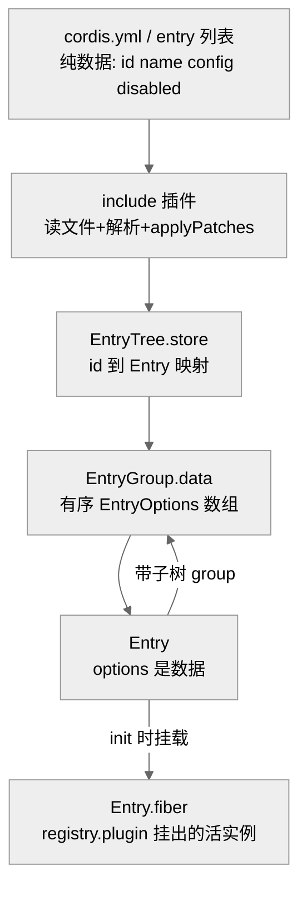
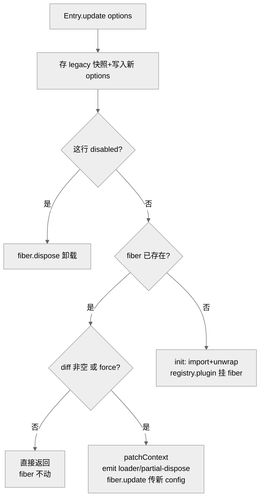
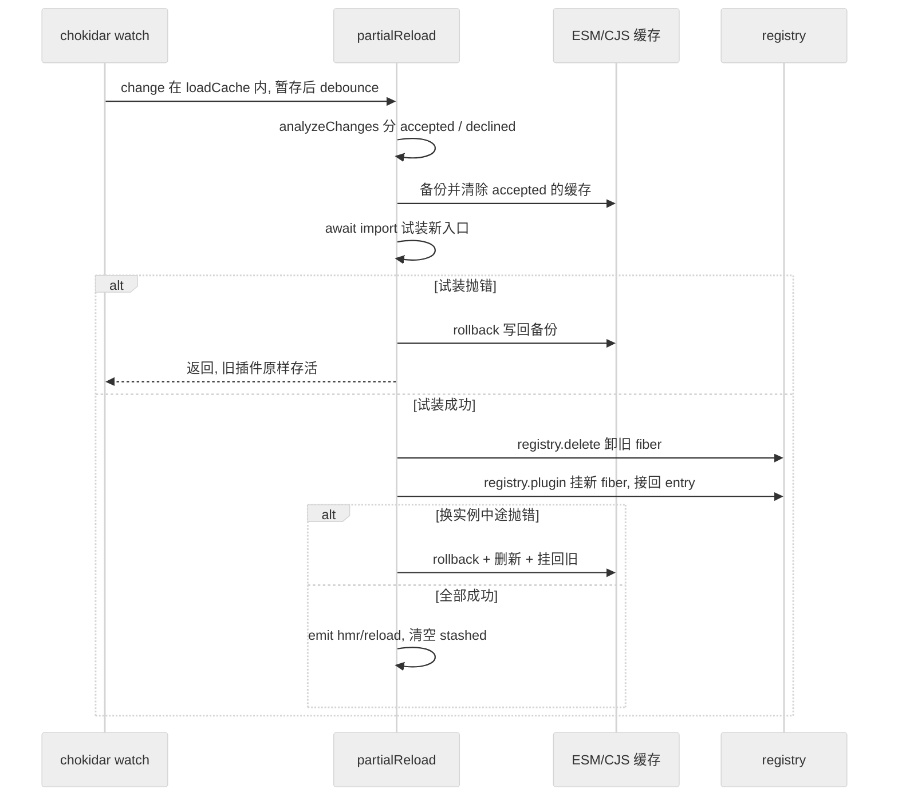
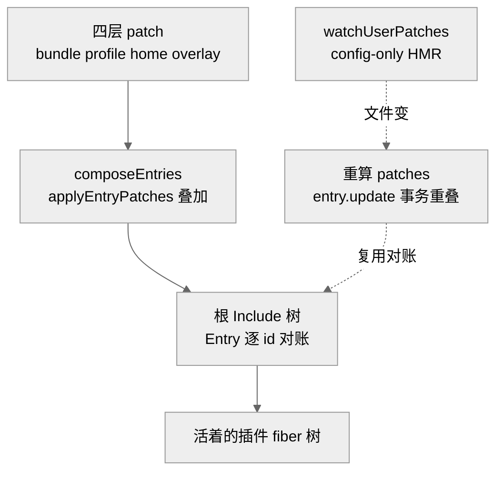

# 第 28 章 · Loader 声明式配置树与 HMR

> 本章讲一件事：一份写在文件里的 `cordis.yml`（一张"要加载哪些插件、各给什么配置"的清单）是怎么变成一棵真正跑着的插件树的，以及当你在编辑器里改了它、或改了某个插件的源码后，进程如何"只换动过的那几块、其余照跑"。读完你应能回答：Loader、Entry、EntryGroup、EntryTree 各是什么；include/group 两个内置插件分别解决什么；HMR（Hot Module Replacement，热模块替换——不重启进程就换掉一块代码）如何做到"卸旧装新还能失败回滚"；以及 Part I Ch04 里 dsh 的 profile/bundle/patch 是怎么骑在这层机制之上的。

Part I 已经反复说"一切皆插件、组件可逆卸载"。但插件写好之后，谁读那份清单、按什么顺序把它们挂起来、改了清单又怎么增量生效？答案就是本章的 Loader 子系统——它是配置（数据）与运行时（Cordis fiber 树）之间的那道翻译层。

## 一、本质：把声明式清单翻译成一棵活的 fiber 树

打个比方：`cordis.yml` 像一张乐高说明书，上面每一行写"用哪个零件、拼在哪、装不装"；Loader 就是照着说明书把零件真正拼起来、并在你改说明书时只重拼动过的那几块的那双手。

Loader 本身也是一个服务插件，通过 `ctx.reflect.provide('loader', this, ...)` 把自己注册进上下文（`packages/loader/src/index.ts:72`）。它继承自 `EntryTree`（`index.ts:47`）——一棵"配置项树"。树上的每个节点是一个 `Entry`（一行清单），每个 `Entry` 可能带一棵子树（`subtree`）或一个子组（`subgroup`）。清单是数据，`Entry.fiber` 才是它在 Cordis 里对应的那个活的插件实例（`packages/loader/src/config/entry.ts:37-44`）。Loader 的工作，就是维护"清单 ↔ fiber"这组映射：清单增一行就 `registry.plugin` 挂一个 fiber，删一行就 `fiber.dispose()` 卸一个，改一行就尽量原地 `update` 而非拆了重装。

> 图注：从文件到活实例的翻译链。左半是"数据平面"（清单），右下 `Entry.fiber` 是"运行平面"（活插件）。证明 Loader 的核心职责就是维护这两个平面之间的一一映射，而非直接执行代码。

## 二、核心问题：配置要能"增删改"，热重载要"不留脏状态"

放到 agent harness 语境，痛点有三层。其一，**配置是活的**：`dsh` 允许运行中启用/禁用一个工具行、换一个模型 provider，这要求树能被增量修改，而不是每次重读整份文件从头挂一遍。其二，**改一行要精确到一行**：改了 `agent-default-model` 的 `config`，不该把整个会话栈拆了重装。其三，**热重载不能留半成品**：改了某个插件源码触发重载，若新代码抛错，进程必须能回到改动前的样子——旧插件还在、旧模块缓存还在，而不是卡在"旧的卸了、新的没起来"的空档。

这三点归结成一个不变量：**任何一次配置变更或热重载，要么整体生效，要么整体回滚**。Cordis 的 effect/disposer 机制（每个注册都返回一个"撤销函数"）是回滚的地基；Loader 与 HMR 则是在这地基上做"事务编排"的那一层。

## 三、解决思路：三层结构 + 逐 id reconciliation

Loader 把树拆成三个协作的类：

- **`Entry`**（`config/entry.ts`）——一行清单。`options` 是数据（`{id, name, config, disabled, inject}`），`fiber` 是它挂出来的活实例。`Entry.update()` 是全章最关键的方法。
- **`EntryGroup`**（`config/group.ts`）——一组有序的 `Entry`，对应 YAML（YAML Ain't Markup Language，一种以缩进表达层级、便于人读写的配置文件格式，`cordis.yml` 就是它）里的一段列表。它负责"这一组内部谁增谁删"的 reconciliation（对账：拿新旧两份清单比对，只动差集）。
- **`EntryTree`**（`config/tree.ts`）——整棵树的门面：`store`（`id→Entry` 索引）、`root`（根 group）、以及 `create/remove/update/resolve` 等按 `id` 定位并落盘（`write()`）的操作（`tree.ts:76-101`）。`id` 用 `:` 分层，`a:b:c` 表示"a 的子树里 b 的子树里的 c"（`tree.ts:56-67`）。

reconciliation 的核心在 `EntryGroup.update(config)`：把新旧两份 `EntryOptions[]` 各建成 `id→options` 的 map，取并集遍历——新 map 里有的就 `create`（已存在则原地更新），旧 map 里独有的就 `remove`（`group.ts:47-64`）。这就是"对账式"更新：不重挂全树，只结算差异。之所以要这么做、而非"清空整组按新清单从头挂一遍"，根因在于 harness 要支持"运行中调一行配置立即生效、其余会话不受打断"：清空重挂会震荡全树、把有状态插件（如已建立的模型会话）无谓重建，而 map 差集加上后文 `Entry.update` 的 `diff` 短路（`group.ts:47-64`、`entry.ts:100-134`）共同保证"变更代价正比于变更量"。[verified]

而单个 `Entry.update()` 决定"这一行到底要不要动 fiber"（`entry.ts:100-134`）：先存一份 `legacy` 快照，写入新 `options`；若这行现在算 `disabled` 就 `fiber?.dispose()` 卸掉；否则比对新旧 `options` 求出变化的键集 `diff`，**只有 `diff` 非空（或强制 `force`）才走 `_patchContext`**，否则直接返回、fiber 纹丝不动。这就是"改一行精确到一行"的实现：没变的行连碰都不碰。

> 图注：`Entry.update` 的判定树（`entry.ts:100-172`）。它证明"改一行只动一行"：只有真正发生变化的行才会走 `_patchContext` 重配置，全新行才走 `init` 挂载，未变行走 `Skip` 分支被完全跳过。

## 四、实现细节：include 组合、group 分组、HMR 三集合

**include：把外部文件变成一棵子树。** `Include` 也继承 `EntryTree`（`packages/include/src/index.ts:48`）。它 `Service.init` 时 `read()` 读文件、`applyPatches()` 叠加补丁、再 `root.update(data)` 把清单交给对账逻辑（`include.ts:166-181`）。它认得 `.yml/.yaml/.json`（JSON，JavaScript Object Notation，一种通用的文本数据格式），并注册了一个自定义 YAML tag `!!js`——把 `!!js expr` 解析成 `{__jsExpr}` 占位、求值时再 `evaluate`（`include.ts:8-16`、`config/utils.ts:4-8`）。这就是 dsh 里"`disabled: !!js process.platform === 'win32'`"能按平台开关一行的底层支持。写回文件走"先写 `.tmp` 再 `rename`"的原子替换（`include.ts:201-202`），避免写到一半被读到半截。

**group：让一行"装下一棵子树"。** `group` 包只是把 loader 的 `Group` 类原样再导出（`packages/group/src/index.ts` 全文仅三行）。`Group` 是个服务：`init` 时 `update(this.config)`、`stop` 时把整组 `remove`（`group.ts:73-88`）。它的意义是让"一组插件"成为清单里的一个可整体启停、可作为 `isolate` 边界的单元——Part I Ch04 里 web bundle 把一批 agent 平面的工具行归到 preset 子树、app-boot 在 `cordis:include` 旁一并注册 `cordis:group` 好让一个组装把 `isolate` realm 同时给到 provider 与 consumer，靠的就是它。

**isolate：给一行配一个"服务命名空间"。** `config/isolate.ts` 挂在 `loader/patch-context` 上，用 `LocalRealm`（后缀 `#id`）与 `GlobalRealm`（后缀 `@label`）为服务符号加后缀，实现"同名服务在不同 realm 里互不串台"，并在 `loader/partial-dispose` 时做 realm 垃圾回收（`isolate.ts:151-168`）。它是"每会话不同能力集却共享一个进程"能成立的关键机制之一。

**HMR：watch → 分类 → 卸旧装新 → 失败回滚。** `packages/hmr/src/index.ts` 是全章最硬核的一段。它 `@Inject('loader')` 与 `@Inject('timer')`，且开头就断言"没有 `--expose-internals` 就没法工作"（`hmr/index.ts:49-85`）——因为它要直接操作 Node ESM（ECMAScript Modules，即 `import`/`export` 那套 JavaScript 原生模块系统）的内部模块缓存 `loadCache`（`packages/loader/src/internal.ts:111-122` 通过内部模块拿到这个 loader，并区分 Node 22 的 v1 与 Node 24 的 v2 两套接口）。

watch 到一次文件变化后，按三条路分流（`hmr/index.ts:127-152`）：① 变的是 **externals**（从进程主入口可达的框架模块）——这类无法热替换，直接 `loader.exit()` 触发整进程重启；② 变的文件在 ESM `loadCache` 里——进 `stashed` 暂存、`debounce`（防抖：把短时间内的多次触发合并成一次，避免连续保存时反复重载）后走 `partialReload()`；③ 变的是某棵 include 的配置文件——调 `include.refresh()` 只重读配置（`hmr/index.ts:143-149`）。

`partialReload()` 的事务性体现在四步（`hmr/index.ts:229-378`）：

1. **分类**：`analyzeChanges()` 把所有文件分成 `accepted`（该重载：改动文件及其上游依赖者）与 `declined`（不该重载：externals 及其纯下游）。这是一个在依赖图上传播的定点迭代（反复传播直到不再有新增、抵达稳定点）——一个文件只要有一个"依赖它的人"被 accept，它自己就被 accept（`hmr/index.ts:174-227`）。
2. **清缓存并备份**：对每个 `accepted` 文件，从 ESM `loadCache` 和 CJS（CommonJS，Node 早期用 `require`/`module.exports` 的模块系统）`require.cache` 里删除，但**先把删掉的对象存进 `esmBackup/cjsBackup`**（`hmr/index.ts:290-309`）。备份就是回滚的本钱。
3. **试装新**：`await import` 重新导入每个受影响的插件入口；**任何一个抛错，立即 `rollback()`（把备份写回缓存）并返回**（`hmr/index.ts:320-329`）——此时旧插件尚未卸载，等于什么都没发生。
4. **换实例**：对每个要重载的插件，先 `registry.delete(旧plugin)` 卸掉旧 fiber，再用新导出 `registry.plugin` 挂新 fiber，并把旧 fiber 的 `entry` 关系接到新 fiber 上（`reload()`，`hmr/index.ts:331-360`）。若这一步中途抛错，进 `catch`：`rollback()` 缓存 + 把已装的新插件删掉 + 用旧 plugin 重新挂回（`hmr/index.ts:361-374`）。全成功才 `emit('hmr/reload')` 并清空 `stashed`。

> 图注：`partialReload` 的事务时序（`hmr/index.ts:229-378`）。两处 `rollback` 分别守住"试装失败"和"换实例失败"，证明该机制的不变量是"要么整体换新、要么整体退回改动前"，不存在"卸了旧的却没装上新的"的中间态。

## 五、易错点与注意事项

- **HMR 强依赖 `--expose-internals`**：拿不到 Node 内部 `loadCache` 就直接抛错（`hmr/index.ts:80-82`）。这是把手伸进 Node 未公开 API（Application Programming Interface，应用编程接口；"未公开"指它不在 Node 对外承诺稳定的接口清单里，随版本可能改动）的代价，也解释了为何它对 Node 主版本敏感（v1/v2 双实现按 Node 主版本号分派，`internal.ts:111-122`；v2 接口定义见 `internal.ts:84-92`）。
- **externals 一律整进程重启**：改到框架自身的代码，HMR 不会尝试热替换，而是 `loader.exit()`（`hmr/index.ts:133`）。热替换只对"叶子插件及其局部依赖"生效。
- **函数插件与服务插件不能混用默认导出**：这条虽在 dsh 侧约定（`packages/CLAUDE.md`"Plugin exports"），但根因在 loader 的 `unwrapExports`（`index.ts:156-163`）如何解 `default` 互操作——混用会让 Loader 丢掉函数插件的具名导出。
- **patch 整替、不深合并**：`applyPatches` 里 `target[key] = value` 是逐顶层键覆盖（`include.ts:157-160`），与 Ch04 所述 dsh 分层 patch 的"整替"语义同源。

## 六、竞品/横向对比

把 Cordis 的 HMR 放到前端的 Vite/webpack 模块级 HMR（靠 `import.meta.hot.accept` 手动声明边界）与 Node `--watch`（文件一变就重启整进程）旁边看，取舍就清楚了。就 harness"长驻进程 + 有状态会话 + 一切皆可逆插件"的目标，Cordis 式方案是自洽解——它把"重载单位"对齐到 fiber/effect 模型，于是"卸载"天然等于"跑 disposer"，失败回滚不需要额外机制（`hmr/index.ts:311-374` 的 rollback 与 reload，[verified]）；Vite 的手动 accept 边界（回滚语义弱、主要靠刷新页面兜底）与 Node `--watch` 的整进程重启（丢掉全部进程内状态）都无法满足"改一个工具、其余会话照跑"这个诉求。代价是它依赖 Node 未公开的内部 API、只在服务端 harness 语境适用（前端两者的能力边界属通用二手认知，[claimed]）。

## 七、仍存在的问题与局限

一个必须直说的可靠性边界是**模块级热重载**：改插件源码触发的 fiber 重挂涉及大量隐式状态迁移（`reload()` 手工接 `entry` 关系，`hmr/index.ts:331-337`），边界条件多。dsh 侧的实际选择因此偏保守——web bundle 禁用了共享的 module-reload `hmr` 行（注释明写"its reload lifecycle is untested"），另挂一个 `root: []` 的"只 watch 配置、不 watch 模块"的 HMR 实例（`apps/cli/src/profile-boot.ts:272-284`）。也就是说，"配置热重载"被当作可靠契约，而"模块热重载"被当作尚在验证的能力（cordis 侧的 config 分支见 `hmr/index.ts:143-149`）。[verified]

其余已知边界：`analyzeChanges` 的定点迭代对超大依赖图是 O(依赖数 × 传播轮数)，极端情形有性能上限（`hmr/index.ts:190-222`）；`loadCache` 的 v1/v2 差异靠版本号硬分派，Node 再变内部结构就要再补一路。

## 八、呼应 Part I Ch04：dsh 如何骑在这层之上

Ch04 讲的 profile/bundle/patch，落到本章就是三个动作的组合。**装配**：dsh 用 `mountRootInclude` 注册 `cordis:include`/`cordis:group` 两个 builtin 并挂载 include（`packages/boot/app-boot/README.md:18`），include 读的那份 YAML 正是 `composeEntries` 把 `[bundlePatches, profile.patches, homePatches, overlays]` 四层经 `applyEntryPatches` 叠出来的（`apps/cli/src/profile-boot.ts:151`）——即本章 include 的 `applyPatches`（`include.ts:101-164`）在 dsh 侧的同源实现。**patch**：dsh 的每一条 patch，最终就是往 include 树里 `insert` 一行或按 `id` 覆盖一行。**热重载**：dsh 在进程 settle（安顿就绪）后 `ctx.loader.create({name: '@deepseek-ai/cordis-plugin-hmr', config: {root: []}})` 挂一个只盯配置的 HMR（`profile-boot.ts:283`），再用 `watchUserPatches` 把用户 patch 文件的变化"事务式"重新叠加回根 include——它重算完整 patch 列表后调 `entry.update({config: {...includeConfig, patches}})`（`packages/boot/app-boot/src/index.ts:241-253`），正好复用本章 `Entry.update → EntryGroup.update` 的逐 id 对账。于是"改一行 `cordis.patch.yml`、长驻界面上立即生效、其余会话不受扰"这条 Ch04 承诺的契约，其可逆性与增量性完全建立在本章的机制上。

> 图注：dsh 的 profile/bundle/patch（上链）与用户 patch 热重载（下环）都收敛到本章的 include 树 + `Entry.update` 对账。证明 Ch04 的"改一行换整块能力、且长驻界面即时生效"并非独立机制，而是本章 Loader/HMR 的应用。

## 小结与衔接

本章把 Loader 子系统拆成三层：`EntryTree` 管索引与落盘、`EntryGroup` 做逐 id 对账、`Entry.update` 判定单行是原地重配还是重挂还是跳过；include 把外部 YAML/JSON（含 `!!js`）翻译成子树并原子写回，group 让"一组插件"成为可整体启停与隔离的单元，isolate 给行配服务命名空间。HMR 则在 Cordis 的 effect/disposer 地基上做事务式热重载：watch 分流、依赖图分类、清缓存留备份、试装失败即回滚、换实例失败再回滚，守住"要么整体换新、要么退回改动前"的不变量。dsh 的 profile/bundle/patch 与用户 patch 热重载，都是这套机制的应用而非另起炉灶。

Part V 至此讲清了"配置如何变成活的树、又如何被热更新"。这也回收了 Part I Ch04 留下的那个黑盒——`--dump-config` 打印的那份数据，正是本章 include 树将要装配的输入。

## 源码索引

- packages/loader/src/index.ts:47（继承 EntryTree）,55（fromInternal）,72（provide loader）,74-124（internal/update、internal/plugin、self-dispose）,156-163（unwrapExports）
- packages/loader/src/internal.ts:84-92（v1/v2 resolve）,111-122（fromInternal 按 Node 版本取内部 loadCache）
- packages/loader/src/config/tree.ts:6-31（store/root/entries）,56-67（resolve 按 `:` 分层）,76-101（create/remove/update + write）,103-120（import：cordis: builtin 与 internal.import）
- packages/loader/src/config/entry.ts:34-44（Entry 字段）,64-73（disabled 沿父链）,84-92（_patchContext + loader/patch-context）,100-134（update：legacy/diff/短路）,158-172（_init：import→unwrap→registry.plugin）
- packages/loader/src/config/group.ts:19-28（create：ensureId+update）,47-64（update：新旧 map 差集对账）,73-88（Group 服务 init/stop）
- packages/loader/src/config/isolate.ts:47-65（Local/GlobalRealm）,87-149（loader/patch-context 七步）,151-168（realm GC）
- packages/loader/src/config/utils.ts:4-8（evaluate）,10-24（interpolate/isJsExpr）
- packages/include/src/index.ts:8-16（!!js YAML tag）,48-74（Include 继承 EntryTree）,85-99（read）,101-164（applyPatches：insert/id 覆盖）,166-181（Service.init）,187-190（refresh）,201-216（原子写回 tmp+rename）
- packages/group/src/index.ts:1-3（原样再导出 Group）
- packages/hmr/src/index.ts:31-42（loadDependencies）,49-85（Inject loader/timer + expose-internals 断言）,97-153（watch 三分流）,174-227（analyzeChanges 定点迭代）,229-378（partialReload：清缓存/备份/试装/换实例/两处 rollback）
- packages/hmr/src/error.ts:10-35（esbuild 构建失败的 code frame）
- （dsh 侧呼应）apps/cli/src/profile-boot.ts:151（composeEntries 四层）,272-284（禁用共享 hmr、挂 config-only HMR）
- （dsh 侧呼应）packages/boot/app-boot/src/index.ts:232-265（watchUserPatches：entry.update 事务重叠）；README.md:18,30 — mountRootInclude、并注册 cordis:group
