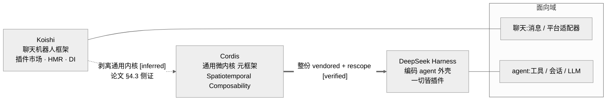
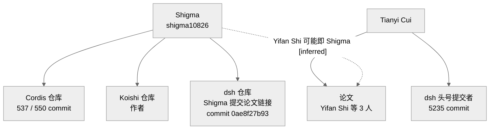
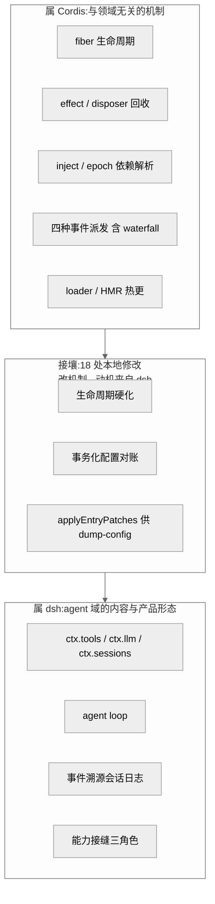
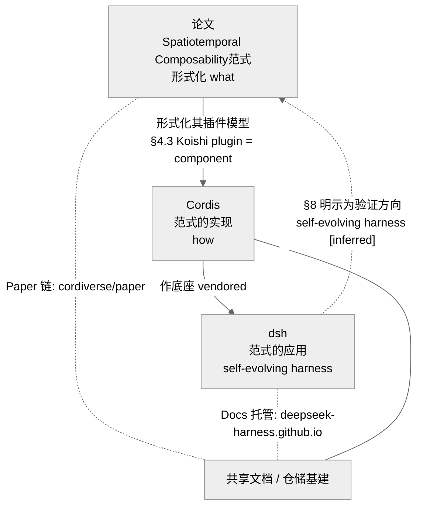

# 第 29 章 · Cordis、Koishi 与 DeepSeek Harness 三者关系（收官）

> 读到这里，你已经拆过 `dsh` 的 agent loop、会话溯源、能力接缝，也读过它脚下那块叫 Cordis 的微内核主板，还啃完了那篇把这套机制形式化的论文。剩下一个问题没被正面回答:**这三样东西——一个聊天机器人框架、一个通用内核、一个 AI 实验室的 agent 外壳——到底是什么关系?** 为什么一家顶级 AI 实验室会把自己的旗舰 agent harness 建在一个社区聊天机器人框架抽出来的内核上?本章作为 Part V 的收官,不再钻单个机制,而是把镜头拉到最远,把「血缘、作者、采用、论文、边界」这五条线一次性理清——读完你应能对任何人讲明白 `dsh`、Cordis、Koishi、那篇论文各自站在哪、彼此怎么连。
>
> 采用过程的技术细节(18 处本地修改逐条、门禁链路)已在 [第 21 章](../Part%20III%20Comparative%20Analysis/21-参考底座Cordis深度对比.md)讲透,本章只做**关系层的总结与对照**,不重复展开。证据分三档:`[verified]` 源码/LICENSE/git/官方 README 可证 · `[inferred]` 合理推断 · `[claimed]` 二手口径未证实;承重判断走 ratify-note 并守证据边界。

## 一、一条血缘链:Koishi → Cordis → dsh

先把最容易被说岔的部分定死。三者是一条**单向的抽象—采用链**,不是平行的三个项目:

- **Koishi** 是起点——一个成熟的跨平台聊天机器人框架,带插件市场、HMR(热模块替换,即改代码不重启就生效)`[verified]`(全网调研已核实 koishi 官方 README)。它早年把「插件、服务、上下文」这套依赖注入机制打磨成熟。
- **Cordis** 是中间的抽象产物——把 Koishi 里与「聊天」无关的那层通用内核剥离出来,成为一个领域中立的微内核框架,自述「A Meta-Framework of Spatiotemporal Composability」(Spatiotemporal Composability元框架)`[verified]`(`repo/cordis/README.md:5`)。所谓元框架,就是「用来搭框架的框架」:它自己不做具体业务,只提供组织插件、注入依赖、干净卸载的底座。
- **DeepSeek Harness** 是终点的采用者——它没把 Cordis 当普通 npm 依赖装,而是把整份源码搬进 `vendor/`、锁在 `4.0.0-rc.7`、rescope 成 `@deepseek-ai/cordis`,再在其上特化出一个跑编码 agent 的外壳 `[verified]`(`vendor/README.md` 清单表)。

「Cordis 抽象自 Koishi」这一步,两家 README 并未逐字互相点名,只能记为 `[inferred]`;但有一条**一手实锤**把它顶得很稳:论文 §4.3 直接写「**Koishi 的 plugin 就是本文说的 component**」,且说明 Koishi 建立在 Cordis 之上(Koishi 用 v3,论文形式化对应 v4)`[verified]`(第 23 章摘录 `:185`)。也就是说,「Koishi—Cordis 同源、Cordis 是更底层的那一层」这件事,连论文自己都承认了。

图 29-1 血缘链。同一套「插件 / 服务 / 上下文」DI 内核,先在 Koishi 里成熟,抽象成领域中立的 Cordis,再被 dsh 整份搬入并特化为 agent 底座。实线为 vendored 事实可证;虚线「抽象自 Koishi」为推断,但有论文 §4.3「plugin 即 component」一手侧证托底。

## 二、作者线:Shigma 一人贯穿三者

血缘链之所以能顺理成章,是因为背后站着同一批人。这条**作者线**有几个可直接读到的一手节点:

- **Cordis 的绝对主导者是 Shigma**:vendored 与本仓的 LICENSE 版权人都写 `Copyright (c) 2021-present Shigma` `[verified]`(`repo/cordis/LICENSE:3`);git 统计更直接——Cordis 仓库 550 个 commit 里,Shigma 一人占 **537** 个 `[verified]`(`repo/cordis` git log)。这不是「参与者之一」,是「几乎一个人写完」。
- **Shigma 同时是 Koishi 的作者** `[verified]`(全网调研已核实)。作者同一性,正是「Cordis 与 Koishi 同源」这个推断最省假设的支点。
- **Shigma 本人是 dsh 仓库的直接提交者** `[verified]`:`dsh` README 里那条论文链接,正是 Shigma 亲手提交的——commit `0ae8f27b93`「docs: add link to preview paper」,作者 `shigma10826@gmail.com`,同一提交还把仓库原先内置的 `docs/cordis-paper.pdf`(1.24MB)删掉、改为外链预印本 `[verified]`(`repo/deepseek-harness` git show)。
- **论文的共同作者 Tianyi Cui,正是 dsh 的头号提交者**——git 核实其 **5235** commits,稳居第一 `[verified]`(`repo/deepseek-harness` git log)。

把这几点连起来:Cordis 的作者(Shigma)下场给 dsh 提交代码,论文的作者(Tianyi Cui)是 dsh 的头号贡献者。**Cordis↔dsh↔论文的人事交集不是猜测,是 git 里躺着的事实。**

图 29-2 作者线。实线均为 git / LICENSE 可证的一手关系:Shigma 主导 Cordis 与 Koishi 并给 dsh 提交论文链接,Tianyi Cui 既是论文共同作者又是 dsh 头号提交者。唯一虚线「Yifan Shi 即 Shigma」为音名相合的推断,未取得论文正文直接证据。

> **ratify-note · 「Yifan Shi 即 Cordis 作者 Shigma」怎么写**
> - 候选解释:A 断言「论文第一作者 Yifan Shi 就是 Shigma」;B 记为推断、标 `[inferred]`,不下定论;C 完全不提,只说「论文由北大×DeepSeek 三人合著」。
> - 各自利弊:A 优——若成立则作者链完全闭合、叙事最漂亮;缺——论文正文未出现「Shigma」字样,拼音「Shi」与「Shigma」的相合是弱证据,断言即越界。B 优——既点出这条很可能存在的强关联,又不把弱证据当铁证,符合证据边界;缺——留一个悬念。C 优——最保守零风险;缺——丢掉了读者理解「作者深度参与」的关键线索,而 Shigma 亲手提交论文链接这件事本已 `[verified]`,回避反而失真。
> - 选定 & 理由:选 B。第一性上,「Shigma 提交论文链接」是 git 可证的一手事实 `[verified]`,足以说明作者深度介入;而「Yifan Shi=Shigma」是在此之上的一层身份合并,只有音名旁证,应停在 `[inferred]`。
> - 证据等级:Shigma 提交论文链接 `[verified]`(commit `0ae8f27b93`);Yifan Shi=Shigma `[inferred]`(音名相合,无正文直证)。
> - 残余风险 / pre-mortem:若日后被证伪,最可能是 Yifan Shi 与 Shigma 实为两人——本章因此只主张「Shigma 深度参与 dsh」这条硬事实,把身份合并留作推断,不影响任何承重结论。

## 三、dsh 如何采用 Cordis(关系层对照)

采用的技术细节(vendored `cordis@4.0.0-rc.7`、rescope 到 `@deepseek-ai/cordis`、18 条本地修改、回并上游 PR#41)第 21 章已逐条讲清。这里只从**关系层**给一张对照表,把「dsh 对 Cordis 做了什么、动机指向谁」一次看全:

| 动作 | 内容 | 与 Cordis 的关系 | 证据 |
|---|---|---|---|
| vendored | 整份源码搬入 `vendor/`,锁 `4.0.0-rc.7` | 从「使用者」升级为「框架层拥有者」:可审计、可打补丁、可锁版本 | `[verified]` `vendor/README.md:3` |
| rescope | `cordis`→`@deepseek-ai/cordis`,全部 `private:true` | 发布 harness 时框架层一并发布,避免在 npm 抢注上游包名 | `[verified]` `vendor/README.md:5` |
| 18 处本地修改 | 生命周期硬化、事务化配置对账、HMR 防死锁、纯函数 `applyEntryPatches` 等 | 改的是 Cordis **机制**,动机全来自 dsh **产品需求** | `[verified]` `vendor/README.md:33-50` |
| 回并上游 PR#41 | 惰性配置解析:依赖激活后才解析 config | 双向关系——dsh 不只取用,也把补丁回流上游 | `[verified]` `vendor/README.md:47` |
| 门禁上锁 | `verify-vendored-links` 断言无 registry 副本 | 把「框架层完全自持」从口号变成可执行约束 | `[verified]` `vendor/README.md:5` |

一句话总结这层关系:**dsh 不是被动地「用」Cordis,而是把 Cordis「收编」进自己的代码库、按 agent 场景改造、再把部分改造回流给上游作者(而作者又正好在给 dsh 提交代码)**。这是一种远比「npm install」紧密的采用姿态。

## 四、边界划分:谁属通用底座,谁属领域产品

理解三者关系,最实用的一把尺子是**边界**——同一份运行时里,哪些代码属于 Cordis 这个通用底座、哪些才是 dsh 这个 agent 产品自己的加工。判据很简单:

- **属 Cordis(机制层)**:凡是「插件怎么挂/卸/热更、服务怎么被发现、事件怎么派发、依赖怎么解析」这类**与领域无关的机制**——`fiber` 生命周期、`effect`/disposer 回收、`inject`/epoch 依赖解析、四种事件派发模式、loader/HMR 热更。
- **属 dsh(产品层)**:凡是「tools/llm/sessions 这些具体服务、agent loop、事件溯源会话日志、能力接缝三角(Service Definition/Provider/Consumer)」这类**具体内容与产品形态**。
- **接壤地带(18 处本地修改)**:它们改的是 Cordis 的机制,动机却全来自 dsh 的产品需求(工具干跑 `--dump-config`、Windows 持久化、agent 场景的并发卸载)。这条接壤带,正是「vendored 而非依赖」最能发力的地方——若走 npm,这些改动无处安放。

图 29-3 边界划分。左块的机制属 Cordis 通用底座,右块的具体服务与产品形态属 dsh,中间的 18 处修改改的是 Cordis 机制、动机却来自 dsh 需求。这条边界也解释了为何 dsh 的插件很难原样搬到别的 Cordis 应用上——它们绑定的是右块的 agent 语义。

## 五、论文—Cordis—dsh 的三角

最后一条线,是那篇论文如何把三者钉成一个闭环三角。三个顶点各司其职:

- **论文《A Programming Paradigm for Spatiotemporal Composability》**是**形式化的范式**——它把「时间可组合性(可逆 effect,任何加载都能干净卸载)」与「空间可组合性(响应式 coeffect,依赖变化自动协调)」形式化,由北大×DeepSeek-AI 三人合著 `[verified]`(第 23 章 `:13`)。它形式化的对象正是 Cordis 的插件范式,§4.3 明说「Koishi 的 plugin 即本文的 component」,并把 Koishi/Cordis 作为存在性验证案例(§4.3、§5)`[verified]`(第 23 章 `:185`)。
- **Cordis 是范式的实现**——一个真跑起来的Spatiotemporal Composability内核,自述就叫「A Meta-Framework of Spatiotemporal Composability」,与论文标题同一措辞 `[verified]`(`repo/cordis/README.md:5`)。
- **dsh 是范式的应用**——论文 §8 明确把「**自演化 agent harness**」列为该范式的下一个验证方向(让 AI agent 在少人监督下连续生成/替换自身组件),而 dsh 恰是这样一个 harness,其 self-modification 能力让 agent 挂载/卸载自己的插件 `[verified]`(第 23 章 `:239`;dsh `packages/self-modification`)。

三个顶点还共享同一套**文档与仓储基础设施**,这是最硬的一手佐证:Cordis 自己的 README 把 **Paper 指向 `github.com/cordiverse/paper`**(与 Cordis 同属 cordiverse 组织)、把 **Documentation 指向 `deepseek-harness.github.io`** `[verified]`(`repo/cordis/README.md:9-10`、`repo/cordis/packages/core/README.md:9-10`)。也就是说,Cordis 的文档就托管在 DeepSeek Harness 的站点上——底座与产品共用一个 github.io,这本身就是三者一体的证据。

图 29-4 三角关系。论文形式化范式、Cordis 实现范式、dsh 应用范式,三者首尾相接成环;且 Cordis 的 README 把 Paper 与 Documentation 分别指向 cordiverse/paper 与 deepseek-harness.github.io,底座与产品共享同一套文档基建。虚线「dsh 是论文验证方向」为推断——论文正文未点名 dsh,结论建立在机制同构+作者链+§8 明示方向三条证据上。

> **ratify-note · 「dsh 是论文所构想范式的工程验证体」这一承重判断**
> - 候选解释:A 断言「dsh 就是论文验证的那个 self-evolving harness」;B 记为「有据推断 `[inferred]`」,列明支撑证据但不当作论文声明;C 只讲论文与 Cordis 的关系,不牵扯 dsh。
> - 各自利弊:A 优——叙事闭环最强;缺——论文正文并未点名 dsh,断言等于替论文下结论,越过证据边界。B 优——把三条实证(机制同构、作者链交集、§8 明示自演化 harness 为验证方向)如实摆出,又不冒充论文原话;缺——结论保留推断性。C 优——最保守;缺——丢掉本章最有价值的洞察,而三条支撑证据均已 `[verified]`,回避反而是信息损失。
> - 选定 & 理由:选 B。第一性上,论文 §8 把自演化 harness 列为验证方向 `[verified]`、Tianyi Cui 兼任论文作者与 dsh 头号提交者 `[verified]`、dsh 具备 self-modification 能力 `[verified]`——三条独立证据同向,使「dsh 是该范式工程验证体」成为最省假设的解释,但论文未直接声明,故停在 `[inferred]`。
> - 证据等级:三条支撑证据各自 `[verified]`;合成结论 `[inferred]`。
> - 残余风险 / pre-mortem:若被证伪,最可能是论文作者心中的「验证方向」另有其指、dsh 只是恰好符合描述而非被论文特指——本章因此只说「很可能是」,不写成论文的断言。

## 六、对读者的启示:想懂 dsh,必先懂 Cordis

把五条线收束成一句给读者的话:**`dsh` 的绝大多数「独特设计」,其实是 Cordis 机制在 agent 场景里的具体投影。** 你在前面章节看到的那些让人印象深刻的东西——「一切皆插件」「agent loop 本身可替换」「改配置不重启」「能力接缝三角」——追到底,靠的都是 Cordis 的 `fiber` 生命周期、epoch 依赖解析、waterfall 事件、loader/HMR。不先建立对 Cordis 这层「主板」的理解,读 dsh 就会把「本属底座的通用机制」误当成「dsh 的独门发明」,也就看不清哪里是它真正的产品创新(agent 域的服务、会话溯源、self-modification)、哪里只是站在巨人肩上。

反过来这也解释了本研究的编排逻辑:Part I 先立「一切皆插件与 Cordis 底座」,Part IV 用一整篇讲论文范式,直到 Part V 才把 Cordis 单独深挖、并在本章收口。顺序不是随意的——**底座在前,产品在后;范式在前,实现在后。**

一句话收束整个 Part V:Cordis 给了 `dsh` 一块经得起审计的主板,论文给了这块主板一套形式化的说明书,而 `dsh` 则在主板上焊出了一台专门跑 agent、还能改造自己的机器。三者同宗、同人、同一套文档基建——理解了这层「聊天框架抽出内核、内核被论文形式化、内核又被 agent 外壳采用」的血缘,你对 DeepSeek Harness 的认识,才算真正落到了地基上。

## 源码索引

- `repo/cordis/LICENSE:3` — Cordis 版权人 `Copyright (c) 2021-present Shigma` `[verified]`
- `repo/cordis` git log — Cordis 550 commit 中 Shigma 占 537 `[verified]`
- `repo/cordis/README.md:5,9-10` — 「Meta-Framework of Spatiotemporal Composability」自述;Paper 指向 `cordiverse/paper`、Docs 指向 `deepseek-harness.github.io` `[verified]`
- `repo/cordis/packages/core/README.md:9-10` — 同上文档/论文链接 `[verified]`
- `repo/deepseek-harness` git show `0ae8f27b93` — Shigma(`shigma10826@gmail.com`)提交论文链接、删除内置 pdf `[verified]`
- `repo/deepseek-harness` git log — Tianyi Cui 5235 commit(头号提交者)`[verified]`
- `vendor/README.md:3,5,17,33-50,47` — vendored 动机、rescope、清单表、18 处本地修改、回并 PR#41 `[verified]`
- 第 21 章《参考底座 Cordis 深度对比》 — 采用细节、门禁链路、fiber 状态机(本章不重复)
- 第 23 章《论文与 dsh 映射》`:13,185,239` — 论文作者/单位、§4.3 plugin=component、§8 自演化 harness 验证方向 `[verified]`/`[inferred]`
