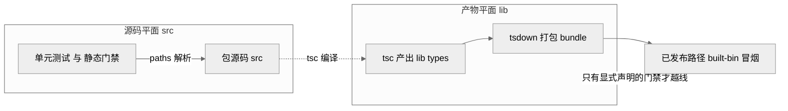
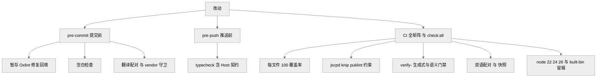

# 第 30 章 · 贡献流程与工程门禁

> 上一部分谈的是「谁在写代码、为什么这么写」；本章把镜头拉近到操作台面，回答一个更朴素的问题——**当你（或一个 agent）真的要往这个仓库里塞一行改动时，从 `pnpm install` 到被合并进主干，中间要过哪些关、每一关卡的是什么。** 这是一份可照着做的规范与门禁清单，而非理念综述。

## 一、本质是什么

先打个比方。传统开源项目像一栋允许访客随意进出、靠门房（reviewer）人工盘问的大楼；`dsh` 更像一座**自动化工厂**：入口先立着一块牌子「暂不对外收货」，内部则布满一道道传感器闸门——每道闸门只认一件可机器判定的事，不合格就亮红灯、流水线自动停。本章讲的就是这套工厂的入口规则和闸门排布。

它的本质可以拆成三句话。其一，**贡献口径是收敛的**：项目处于发布前（pre-release）阶段，明文声明「暂时无法接受外部 Pull Request（PR，拉取请求——把一批改动打包请求合入主干的单位）」`[verified]`（`CONTRIBUTING.md:9`）。其二，**开发姿态是「地基优先」**：既然还没有外部消费者依赖，宁可为正确的地基而大改，也不为「少动几处」去堆兼容垫片 `[verified]`（`AGENTS.md:5,7`）。其三，**规矩尽量编译成会失败的命令**：每一条机器可查的约定，都配一条「违规就以非零退出码结束」的命令 `[verified]`（`quality-gates.md:15`）。三者叠加，构成了「进得来的人少、但进来后每步都被机器盯着」的工程形态。

## 二、核心问题与痛点

这套规范要解决的痛点，和第 20 章讲的「agent 无长期记忆、易漂移」是同一根源，但落点完全不同——第 20 章问「凭什么说这是 AI 写的、纪律背后是什么理念」，本章只问「具体怎么操作」。落到工程层，痛点有三个很具体的形态：

1. **本地与 CI 的重复劳动**。一个改动，提交时、推送时、CI（Continuous Integration，持续集成——每次改动自动拉起整套检查的流水线）里可能把同一批检查跑三遍。全套 pre-push 会拖慢每一次发布、放大无关的本地抖动，而 CI 马上又要重跑一遍，等于白等 `[verified]`（`fast-local-git-hooks.md:9`）。
2. **源码平面与产物平面的错配**。仓库同时存在「源码（`src`）」和「构建产物（`lib/`）」两套文件；一旦测试或门禁不小心走到产物平面，就可能加载模块单例的第二份副本，或让一个只在装好 `lib/` 的机器上能跑、在干净检出上崩溃的 bug 悄悄溜过 `[verified]`（`cordis-config-source-plane-resolution-gate.md:9`）。
3. **散文约定的不可靠**。写在文档里的「请记得……」对不知疲倦、每次会话都像新人的执行者几乎无效——早期确有连类型检查都没过的测试进了主干，只能靠人工事后逮到 `[verified]`（`quality-gates.md:11-12`）。

## 三、解决思路与机制

**本地开发起步。** 前置条件是 Node.js 22.19+ 或 24+（CI 覆盖 22.19 / 24 / 26）、经 Corepack 启用的 pnpm（仓库钉死 `pnpm@11.7.0`）`[verified]`（`development.md:11-12`、`AGENTS.md:62`）。首次只需在仓库根跑 `pnpm install`——它顺带通过 `scripts/install-lefthook.mjs` 装好 worktree 局部的 Lefthook 钩子和翻译配对的 Git 合并驱动；跑一次 `pnpm run typecheck` 成功即算装好 `[verified]`（`development.md:18-40`）。真实 API 演示与 e2e 测试要 `DEEPSEEK_API_KEY`，无 key 时对应用例自跳过 `[verified]`（`development.md:92-99`）。

**TypeScript 工程布局：两张「脸」。** 仓库把包分进两个隔离的聚合程序——Host（宿主）与 Client（客户端），分别登记在 `tsconfig.host.json` 与 `tsconfig.client.json`；根 `tsconfig.json` 只是「方案根」（solution root），不构成程序 `[verified]`（`development.md:44-53`）。为什么非拆不可？因为两侧都用相同的键对 cordis 的 `Context` 接口做「声明合并」（declaration merging）但注入不同服务；若一个程序同时看见两套合并，就会报冲突。由此推出三条纪律：`tsconfig.base.json` 永不加 `include`/`files`；跑全仓语义分析的脚本必须显式喂某一张脸的配置、绝不喂根方案；新包只登记进一个聚合 `[verified]`（`development.md:56-62`）。唯一例外是 `api/remotes`——它的 Client 入口要等 Host 端 Typert 先生成 `/remote` 声明才能编译，于是构建被排成严格次序：Host tsc → Host tsdown（跑 Typert）→ Client tsc → Client tsdown → Web `[verified]`（`development.md:64-76`、`api-remotes-generated-contract-build.md:15-28`）。

**源码平面 vs 产物平面，绝不混用。** 这是贯穿测试与门禁的一条硬线：静态门禁与测试通过 `tsconfig` 的 `paths` 把工作区导入解析到 `src`，且必须在干净树（没有 `lib/`）上通过；确实要消费构建产物的门禁，必须显式声明这个依赖 `[verified]`（`AGENTS.md:116`、`testing.md:37-39`）。

> 图注：此图说明「两平面不混」的机制——日常测试与静态门禁只认 `src`（走 `paths`），构建产物 `lib/` 只被明确声明依赖的门禁（如已发布二进制冒烟）消费；越线是错配 bug 的温床 `[verified]`（`testing.md:37-39`、`AGENTS.md:116`）。

**门禁分层：本地薄、CI 厚。** Lefthook 的三个钩子（`pre-commit`、`pre-merge-commit`、`pre-push`）是快速本地检查点，只拦「便宜、高把握」的缺陷；exhaustive（穷尽）覆盖归 CI `[verified]`（`fast-local-git-hooks.md:15-19`）。

## 四、门禁清单（逐条对照）

以下按「在哪触发」分层列出，每条给出证据锚点。

**A. 提交前（lefthook `pre-commit`）** `[verified]`（`lefthook.yml:5-39`）：
- 翻译配对：对暂存的 `*.i18n.yaml` 校验双语记录一致性 `[verified]`（`lefthook.yml:8-11`）。
- 暂存 lint：用**无项目（project-free）** 的 `.oxlintrc.staged.json` 剖面（`typeAware: false`）验证暂存的 TS/JS 并施加安全修复、限次重试后回填暂存区 `[verified]`（`lefthook.yml:17-22`、`.oxlintrc.staged.json`）。
- 第三方声明：某暂存文件是 `THIRD_PARTY_NOTICES.md` 的输入时就地重生成 `[verified]`（`lefthook.yml:30-32`）。
- 空白错误：`git diff --cached --check` 拒绝暂存的空白错误 `[verified]`（`lefthook.yml:34-35`）。
- vendor 清单守卫：改动 `vendor/*/src` 必须同带清单更新 `[verified]`（`lefthook.yml:37-38`）。

**B. 推送前（lefthook `pre-push`）**：只跑 `pnpm run typecheck`——它先完成 Host lib 阶段（含 Typert 生成的契约）再做 Client 类型检查 `[verified]`（`lefthook.yml:52-55`、`fast-local-git-hooks.md:15`）。刻意不含测试、快照、文档检查、构建、hygiene `[verified]`（`development.md:115`）。

**C. CI 全矩阵与 `pnpm run check:all`**（本地穷尽预演，独立于钩子）`[verified]`（`development.md:117`）：
- **每文件 100% 覆盖率**：`test:coverage`（v8）对 `packages/*/*/src` 逐文件要求 100%；执行不到的防御分支用一行 `/* v8 ignore */` 注明理由跳过，而非删码 `[verified]`（`testing.md:10`、`quality-gates.md:20`、`package.json:35`）。
- **Oxlint**：类型感知的 TS 规则 + 风格与重复逻辑检查，vendored 代码排除 `[verified]`（`quality-gates.md:18`）。
- **jscpd**：跨文件克隆检测，`minTokens: 60`、`minLines: 6`，覆盖包生产 TS 与脚本 `[verified]`（`package.json:33`、`.jscpd.json`）。
- **hygiene**：knip（死代码/死依赖）+ publint（包正确性）+ workspace constraints + NodeNext 消费者类型检查 + `verify-cordis-config` 等一串 `&&` 链 `[verified]`（`package.json:129`、`package.json:63`）。其中 `verify-cordis-config` 的 `validateSourcePlaneResolution` 强制每个 cordis.yml 里配置的工作区包都解析到 `.ts` 源文件，命中 `.d.ts`（掉进产物平面）即红 `[verified]`（`cordis-config-source-plane-resolution-gate.md:13`）。
- **双语门禁**：`verify-translation-pairing` 并入 `doc-sync`，用记录双方 git blob 哈希的 `.i18n.yaml` sidecar 把「翻译漂移」变成纯内容比对可查 `[verified]`（`bilingual-docs-and-pairing-gate.md:14-15`）。
- **生成式门禁（generate + `--check`）**：大量文档/契约由源码生成再校验新鲜度，如 `verify-cordis-api`（`gen-cordis-api.ts --check`）、`verify-tool-catalog`、`verify-scoped-events` 等 `[verified]`（`package.json:104-125`）。更进一步，`gen-doc-graphs` 与 `gen-scoped-events` 借 `TypeScriptProject` 展开整个项目引用图、用 `TypeChecker` 提取强类型事实（谁是 `Context`、哪些事件名到达转发点），把「事件词汇表完整性」这类语义不变量做成会失败的命令 `[verified]`（`typescript-program-backed-semantic-gates.md:23-45`）。
- **运行时不变量**：`verify-package-invariants` 要求每个工作区包都有 `./invariant` 伴随插件，要么注册对可观测事件/可变数据的检查、要么导出以 `No runtime invariant:` 开头解释为何无可查的空 installer `[verified]`（`invariants.md:59`）。

> 图注：此图说明门禁的「薄本地、厚 CI」分工——钩子只留低延迟高把握项，穷尽覆盖、平台矩阵与产物冒烟归 CI，避免本地与 CI 三重重复劳动 `[verified]`（`fast-local-git-hooks.md:15-19`、`development.md:119-121`）。

**测试策略要点。** 分层为：单元（`test`）、覆盖率闸（`test:coverage`）、真实 API e2e（`test:e2e`，无 key 自跳过）、无 key 快照（`test:snapshot`）、浏览器快照（`test:web`）`[verified]`（`testing.md:8-13`）。两条易被忽略的操作规约：其一，**子进程启动模式**——CI 与「有构建」的测试道从 `lib/` 经共享双模启动器跑例子/配置子进程，不要手写 `--import tsx`；不加载 Cordis 的协议/系统夹具用 Node 直接跑可擦除的 `.ts`；只有以「源码路径解析」为被测对象的测试才可选 `src`，且须在测试里声明该契约 `[verified]`（`testing.md:41-46`）。其二，**每个非平凡的模型/协议/人可见改动，须在同一 PR 里经可运行例子的快照套件加/改一个无 key 场景**——包测试、e2e 断言、mock 组合都不能替代装配后的 transcript `[verified]`（`testing.md:47-49`）。

## 五、易错点与注意事项

- **别默认跑全套**。为一次提交或推送重复一个已通过的检查、或动辄 `check:all`，是反模式；应「按改动面挑最小必要检查」，穷尽覆盖交给 CI `[verified]`（`development.md:115-117`）。
- **干净树上必须绿**。若一个门禁在装了 `lib/` 时才过、在干净检出上崩，多半是踩了源码/产物错配——`verify-cordis-config` 正是为堵这类而生 `[verified]`（`cordis-config-source-plane-resolution-gate.md:9-13`）。
- **新单文件子路径导出要配 `paths`**。从 cordis.yml 引用一个新的 `/prompt`、`/surface` 之类子路径时，须在 `tsconfig.base.json` 的 `paths` 显式加映射，否则会掉进 `lib/` 回退 `[verified]`（`cordis-config-source-plane-resolution-gate.md:26`）。
- **TODO 标记分级**：`FIXME`（应阻塞发布）> `TODO`（尽快修）> `XXX`（也许某天），按紧迫度选对标签 `[verified]`（`development.md:153-161`）。
- **100% 覆盖率会诱出「无断言测试」**：覆盖率只证明行跑过、不证明行为对；仓库把变异测试列为计划中的对冲 `[verified]`（`quality-gates.md:28`）。

## 六、横向对比

与多数同类 harness 相比，差异不在「有没有 `AGENTS.md`」，而在**约定是否被编译成会失败的命令**。业界常见做法是把风格与流程写进 README/贡献指南，靠 reviewer 记忆执行；`dsh` 则把「双语一致、每文件 100% 覆盖、事件词汇表完整、配置解析到源码平面」这类都做成红/绿命令 `[verified]`（`quality-gates.md:15`）。另一处对比是贡献口径：许多项目以「欢迎 PR」为默认姿态，`dsh` 反其道，明确「暂不收外部 PR」，转而引导社区去做插件、写文章、在 Discussions 反馈 `[verified]`（`CONTRIBUTING.md:9-19`）。这与「地基优先于波及面」的发布前立场自洽——没有外部消费者，才敢自由重命名、重构而不加垫片 `[verified]`（`AGENTS.md:5,7`）。需说明：闭源头部厂商内部很可能有更成熟却未公开的门禁，这里只作「公开可见范围内更成体系」的有限主张 `[claimed]`。

## 七、局限

1. **本地绿不代表全矩阵绿**。快本地钩子放弃了「推送即穷尽」的保证，缺陷可能在推送后才由 CI 逮到；这是「快」换来的代价，仓库要求 agent 自行挑对证据、reviewer 评估这份挑选是否匹配改动 `[verified]`（`fast-local-git-hooks.md:36`）。
2. **语义门禁有启动成本**。展开扁平化 `ts.Program` 比逐文件解析更耗启动时间与内存，且依赖一份有效的根项目图 `[verified]`（`typescript-program-backed-semantic-gates.md:64`）。
3. **门禁本身是要维护的代码**。这些闸门自己也会随目录变动、依赖升级而漂移；双语门禁又把每篇文档的维护成本乘以二 `[verified]`（`quality-gates.md:27`）。
4. **发布口径会变**。「暂不收外部 PR」与「foundation over blast radius」都绑定发布前阶段——后者明文写着「首个 tagged 发布时删除本节」，一旦正式发布，本章多条规约（尤其贡献口径与随意重构的自由度）都会随之改写 `[verified]`（`AGENTS.md:7`）。

## 小结与衔接

本章把「进入这个仓库要过的关」摊平成一张可操作清单：起步只需 `pnpm install` + 一次 `typecheck`；写码时守住 Host/Client 两张脸与源码/产物两平面；提交经薄本地钩子、推送做增量 typecheck、CI 扛穷尽矩阵；而贯穿始终的信条是「机器可查的约定都要有会失败的命令」。它与第 20 章互为表里——那一章讲这套纪律为何存在、映射什么理念，本章讲它具体长什么样、怎么照着做。

## 源码索引

- `CONTRIBUTING.md:9-19`（暂不收外部 PR 的贡献口径与替代参与方式）
- `AGENTS.md:5,7`（发布前「foundation over blast radius」立场，:7 含「首个 tagged 发布时删除本节」）、`:62`（`pnpm install` 与 node ^22.19 || >=24）、`:110`（依赖优于手写）、`:116`（源码平面 vs 产物平面）、`:117`（编译器脸显式、单聚合）、`:122`（非平凡改动附 Agent Note）
- `docs/development.md:11-40`（前置条件、首次安装与 lefthook/合并驱动装配、typecheck 完成判据）、`:44-76`（Host/Client 两聚合布局、`api/remotes` 例外、构建次序）、`:88`（hygiene 中 publint 消费 `lib/`）、`:92-99`（`DEEPSEEK_API_KEY` 与 `.env`）、`:107-117`（lefthook 三钩子与 CI 分工、`check:all`）、`:119-121`（CI 门禁分道）、`:153-161`（`FIXME`/`TODO`/`XXX` 分级）
- `docs/testing.md:8-13`（测试分层）、`:37-39`（测试解析只走源码平面）、`:41-46`（子进程启动模式）、`:47-49`（何时必须加快照）
- `lefthook.yml:5-39`（pre-commit：翻译配对/暂存 Oxlint/第三方声明/空白/vendor 守卫）、`:52-55`（pre-push typecheck）
- `.oxlintrc.staged.json`（`typeAware: false` 的无项目暂存剖面）、`.jscpd.json`（`minTokens 60`/`minLines 6`）
- `package.json:33`（duplication/jscpd）、`:35`（test:coverage 覆盖率闸）、`:63`（knip）、`:107`（gen-cordis-api 生成器）/`:108`（verify-cordis-api `--check`）、`:104-125`（gen/verify --check 生成式门禁族）、`:129`（hygiene `&&` 链）
- `.agents/notes/implemented/process/2026-06-11-quality-gates.md:11-12,15,18-22,27-28`（自述与早期教训、机械命令信条、门禁清单、维护成本与无断言测试对冲）
- `.agents/notes/implemented/process/2026-07-22-fast-local-git-hooks.md:9,15-19,36`（快本地钩子的边界与代价）
- `.agents/notes/implemented/process/2026-07-14-typescript-program-backed-semantic-gates.md:23-45,64`（`TypeScriptProject` + `TypeChecker` 语义门禁、启动成本）
- `.agents/notes/implemented/process/2026-07-30-cordis-config-source-plane-resolution-gate.md:9-13,26`（`validateSourcePlaneResolution` 源码平面解析闸）
- `.agents/notes/implemented/process/2026-08-08-api-remotes-generated-contract-build.md:15-28`（Host→Client 构建次序与生成契约）
- `.agents/notes/implemented/process/2026-07-02-bilingual-docs-and-pairing-gate.md:14-15`（`.i18n.yaml` blob 哈希双语配对门禁）
- `docs/subsystems/invariants.md:59`（`verify-package-invariants` 运行时不变量伴随契约）
