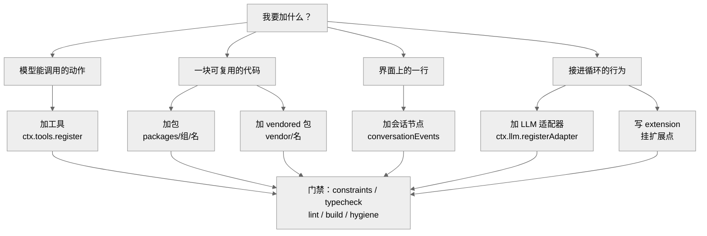
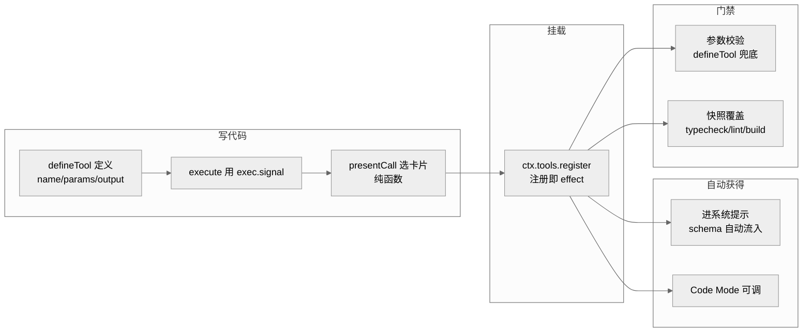

# 第 31 章 · 修改配方：给 dsh 加一样东西

前面几章拆过 dsh 的骨架：工具怎么被模型看到（Ch09）、模型输出如何被抽象成中立的流式词汇（Ch10）、能力接缝的三角色怎么拼（Ch11）。这一章换个视角——不再问"它是怎么设计的"，而是问"我要往里塞一样新东西，手该往哪儿伸"。dsh 官方在 `docs/cookbook/` 下放了七份修改类 how-to（另有两篇评审/stacked-PR 流程手册见第 32 章），本章把它们提炼成一套统一心智模型，再用"加一个工具"串一遍端到端流程。

## 一、统一心智模型：一次改动的三个坐标

dsh 的第一原则是"一切皆插件"（CLAUDE.md 开篇）。所以无论你加的是工具、包、适配器还是会话节点，动作本质都一样：**写一个 Cordis 插件（`name`/`inject`/`apply`），把它挂到某个已存在的扩展点上**。区别只在于三个坐标各自落在哪里：

1. **接缝坐标**——你的东西在能力接缝的哪个角色上？Ch11 讲过接缝是"服务定义 / 服务提供者 / 消费者"三件套 [verified]（`docs/capability-seams.md:412` 表头列出 `Owner`（定义）、`Implementations`（提供者）、`Direct consumers`（消费者）三列）。加工具 = 往 `ctx.tools` 这个消费点注册；加 LLM 适配器 = 给 `ctx.llm` 接缝补一个提供者 [verified]（`docs/capability-seams.md:415`）。
2. **文件坐标**——这次改动要碰哪些文件？一个新东西往往不止一个 `.ts`：可能还要动 `package.json`、根 `tsconfig`、README、manifest 表。
3. **门禁与契约坐标**——哪些自动化门禁会拦你？你要满足哪些"跨边界契约"（参数校验、协议顺序、纯函数约束）？

把这三个坐标想清楚，六个配方就是同一张地图上的六个落点。

图 31-1　"给 dsh 加一样东西"的决策落点：先按"加的是什么"选配方，六条路最终都汇入同一组门禁。

## 二、七个配方逐一

### 配方 1：加一个工具

最小形态就是一个插件：声明 `name`、`inject = ['tools']`、在 `apply` 里 `ctx.tools.register(defineTool({...}))` [verified]（`docs/cookbook/adding-a-tool.md:9`-`36`）。`defineTool` 是给一方工具用的类型化辅助函数，签名在 `packages/core/tools/src/schema.ts:545` [verified]。

关键在于它把一堆契约帮你兜住了：

- **参数自动校验**——`defineTool` 会拿模型生成的 `arguments` 对着你声明的 schema 校验（类型、必填、字面量约束等），所以进入 `execute` 时 `args` 已是可信的类型化值 [verified]（`docs/cookbook/adding-a-tool.md:42`）。
- **返回一个规范 JSON 值，而不是拼给人看的字符串**——`output.schema` 声明形状，`execute` 只返回那个值，`output.render` 负责给模型看的文字 [verified]（`:45`）。这样 Code Mode 里 `await tools.<name>(args)` 能直接拿到结构化结果 [verified]（`:61`-`65`）。
- **UI 卡片是设计的一部分**，要一开始就决定用 `generic`/`terminal`/`diff` 哪种，且 `presentCall`/`presentResult` 必须是 `args`（加结果）的纯函数，因为它们在实时流和回放时都会跑 [verified]（`:73`-`86`）。
- **长时任务**走 `ctx.jobs.start()` 而非阻塞 `execute` [verified]（`:53`），对应 `ctx.jobs` 接缝，`tool-bash` 是参考实现 [verified]（`docs/capability-seams.md:459`）。

注册是"效果式"的：销毁插件 fiber 就自动注销工具 [verified]（`docs/cookbook/adding-a-tool.md:38`）——这正是 Ch11 说的"注册即 effect"。

### 配方 2：加一个包

当你的东西大到值得独立成 `@deepseek-ai/dsh-<name>` 包时，走这份逐文件清单。骨架是四件套：`package.json`、`tsconfig.json`、`src/index.ts`、`README.md` [verified]（`docs/cookbook/adding-a-package.md:9`-`21`）。

这里有两处最容易漏、且被门禁盯着的地方：

- **`package.json` 不变量**——`private: true`、版本对齐根包、`type: module`、`main`/`types` 指向 `lib/`，以及 `@deepseek-ai/cordis` 必须同时进 `peerDependencies` 和 `devDependencies`。这些由 `pnpm run constraints`（`scripts/check-workspace-constraints.ts`）强制 [verified]（`:25`）。
- **在根配置里登记**——新包要加进 `tsconfig.host.json` 或 `tsconfig.client.json` 的 `references`（二选一，一个普通包只属于一个聚合）[verified]（`:34`）。这背后是 Ch11 提过的 Host/Client 双聚合规则：两侧都对 Cordis `Context` 做声明合并，塞进同一个 `ts.Program` 会撞键 [verified]（`docs/development.md:56`）。

选包名时还有一整张"角色词表"（`Controller`/`Store`/`Registry`/`Runtime`/`Provider`……）帮你命名"当前真实存在的职责" [verified]（`:51`-`69`）。最后跑一串校验：`pnpm install` → `doc-sync` → `constraints && typecheck && lint` → `build && hygiene` [verified]（`:111`-`115`）。

### 配方 3：加一个 vendored 包

dsh 不把上游 Cordis 包当 npm 依赖装，而是把源码钉死复制进 `vendor/` [verified]（`docs/cookbook/adding-a-vendored-package.md:5`）。所以这份配方和配方 2 形似而神不同：

- 源码拷进 `vendor/<dir>/src/`（上游 `src/` 原样），`package.json` 设 `private: true`、改 scope 但保留上游 `version`/`exports`/`type` [verified]（`:9`-`32`）。
- 根配置登记点不同：`tsconfig.base.json` 的 `paths` 加一行映射，`tsconfig.host.json` 的 `references` 加一条（vendored 代码只从 Host 聚合入图）[verified]（`:40`-`41`）。
- 有一道专属门禁：`scripts/check-vendor-manifest.sh` 这个 pre-commit hook 会检查——只要 `vendor/*/src` 被 staged 而 `vendor/README.md` 没一起 staged，就失败 [verified]（`:49`）。所以更新 manifest 表要和源码同一次提交。

一句话记忆：vendored 包 = "钉死的第三方源码"，动它必须连 manifest 一起动。

### 配方 4：加一个 LLM 适配器

这是给 `ctx.llm` 接缝补一个提供者。形态是：继承 `LlmAdapter`、实现 `async * stream()`，然后在插件里 `ctx.llm.registerAdapter(['my-provider'], new MyAdapter(...))` [verified]（`docs/cookbook/adding-an-llm-adapter.md:9`-`21`）。基类与方法在 `packages/llm/llm/src/index.ts:180`（`LlmAdapter`）、`:232`（抽象 `stream`）、`:338`（`registerAdapter`）[verified]。

难点全在"协议义务"——这是两个已有实现共同验证过的契约，不是你能随意发挥的地方 [verified]（`:25`-`35`）：

- `usage` 必须在 `finish` **之前**发，`finish` 之后什么都不能再发；
- 工具调用的 `arguments` 全程是原始 JSON 字符串，用 `argumentsDelta` 分片流出；
- 错误只有两条正道：从 `stream()` `throw`（传输/协议失败，用带稳定 code 的 `LlmError`），或用 `finish {kind:'error'|'aborted'}` 结束（提供方在带内报错）；
- 无法支持的选项要 `throw LlmError(..., 'UNSUPPORTED')`，不能默默丢弃。

动手前先读 `packages/llm/llm/src/types.ts:312` 的 `StreamChunk` 定义，它记录了两个适配器都对齐过的协议约定 [verified]（`docs/cookbook/adding-an-llm-adapter.md:5`）。密钥走 cordis-native 的 Config + 环境变量回退，绝不在代码里读密钥文件 [verified]（`:23`）。

### 配方 5：加一个会话节点

这是六个里最"前端"的一个：往 Web Client 聊天视图加一行业务自己拥有的内容 [verified]（`docs/cookbook/adding-a-conversation-node.md:5`）。心智模型是"事件族 → Context → State → 渲染节点"：

1. **先设计一个可回放的事件族**，选一个稳定的业务 id（如 `reviewId`），让 `start`/`progress`/`end` 每个事件都带上它 [verified]（`:9`-`23`）。这呼应 CLAUDE.md 的铁律"模型可见 ⟺ 有日志"——能到界面的东西必须能从 session 日志重建。
2. **实现 `ConversationNodeDefinition`**：`match` 是身份提取器（只看当前事件，返回 id 和角色），`start`/`update` 折叠出 State，`buildViewNode` 产出渲染节点 [verified]（`:121`-`201`、`:196`）。
3. 三条摄入路径（打开时重放、往前翻一页、追加一条实时事件）决定了性能约束：正常追加路径上**不许**遍历整个事件窗口或所有 Context——只做 `D` 次当前事件匹配加一次常数级查表 [verified]（`:208`-`218`）。

如果只是普通的 CLI 界面而非 Web Client，那属于配方 6 里的"UI 插件"——监听 `session/event` 就够了 [verified]（`docs/cookbook/extension-cookbook.md:37`）。

### 配方 6：写一个 extension

这是最泛的一类，`extension-cookbook.md` 给了几种插件形态的参考骨架：工具插件、hook 插件、UI 插件、外部协议驱动 [verified]（`docs/cookbook/extension-cookbook.md:7`-`89`）。以"权限门"为例，一个 hook 插件就是在 `tools/pre-execute` 这个 waterfall 扩展点上挂监听，返回 `{kind:'deny'|'allow'}` 类型化决策：要终局否决就 `return {kind:'deny'}` 短路，否则调 `next()` 委派下一监听 [verified]（`:23`-`30`）。所谓"native hook"就是挂在拦截点上的普通 Cordis 插件，不需要外部协议 [verified]（`:13`）。

这份文档最有价值的是末尾那张"功能 → 机制映射表"：`/loop`、压缩、计划模式、MCP、子 agent、定时任务……每一个产品功能都对应"某个扩展点上的一个监听"，没有一行改动 agent 循环本身 [verified]（`:101`-`129`）。这正是微内核主张的可核查版本——想加什么功能，先来这张表找"该挂哪个点"。

### 配方 7：加一个设置卡片

想让用户在 **Web 设置页**里改你插件的配置（呼应第 17 章 §九的 `ctx.settings`），走这份配方。心智很简单——**注册即配对**：用 `register(ns, schema, …)` 声明一个设置命名空间（Host 半），再在同一个包里放浏览器半（`src/client/`，`export` 为 `./client` 并以 `dsh.client` 声明），两半按命名空间自动配对成一张卡片，仓库里**不需要任何改动**：Host 服务每个已注册命名空间，Plugins 区按命名空间给卡片配位 `[verified]`（`docs/cookbook/adding-a-settings-card.md:5-7`）。`packages/client/ui-theme` 是可照抄的两半打包范例，本区自带的卡片在 `packages/client/ui-settings-plugins` `[verified]`（`docs/cookbook/adding-a-settings-card.md:7`）。

## 三、端到端小例子：加一个 `read_file` 工具

把配方 1 走完整，看一次改动到底涉及哪些文件、卡在哪些门禁：

1. **写插件**——在某个工具包的 `src/` 下新建模块，`export const name`、`export const inject = ['tools']`、`export function apply(ctx)` 里 `ctx.tools.register(defineTool({...}))`。`execute(args, exec)` 里用 `exec.signal` 传给 `readFile` 以响应取消 [verified]（`docs/cookbook/adding-a-tool.md:29`-`33`、`:47`）。
2. **定 schema 和 UI**——`parameters` 声明 `path`（必填）、`limit`（默认可选）；`output.schema` 声明返回字符串；因为是读文件，`presentCall` 用 `generic` 卡片并带上 `locations`，让编辑器能跳转 [verified]（`:74`）。
3. **不做的事**——不要把部署策略写进工具，权限判断交给 `tools/pre-execute`（配方 6 的权限门）[verified]（`:59`）；不要返回给人读的散文让调用方去解析 id [verified]（`:45`）。
4. **过门禁**——按仓库测试策略补一条快照覆盖（模型/UI 可见的改动需要）[verified]（`:92`-`94`）；跑 `typecheck`/`lint`/`build`。
5. **白拿两样东西**——工具在系统提示里自动出现（schema 自动流入装配）[verified]（`docs/cookbook/extension-cookbook.md:112`）；Code Mode 里 `await tools.read_file(args)` 自动可用，无需额外集成 [verified]（`docs/cookbook/adding-a-tool.md:61`）。

图 31-2　加 `read_file` 工具的端到端流程：左边写三件事，中间一次注册，右边两样自动获得，下方两道门禁把关。

## 四、小结

六个配方，一套心智模型：**写一个插件，选准接缝角色，认清要碰的文件和拦你的门禁**。加工具挂 `ctx.tools`、加适配器补 `ctx.llm` 提供者、加会话节点走 `conversationEvents`、加包走逐文件清单、加 vendored 包多一道 manifest 门、写 extension 去查"功能→机制"表——它们都是同一张地图上的落点。真正需要背下来的不是某个 API，而是那几条跨边界契约：参数进 `execute` 前已校验、返回规范 JSON 值、UI 呈现是纯函数、模型可见必有日志、注册即 effect。守住这些，动手就不慌。

## 源码索引

- `docs/cookbook/adding-a-tool.md:9`-`36`（最小形态）、`:40`-`49`（execute 契约）、`:53`（长时任务）、`:59`（策略外置）、`:61`-`65`（Code Mode）、`:73`-`86`（UI 卡片纯函数）、`:92`-`94`（校验）[verified]
- `docs/cookbook/adding-a-package.md:9`-`25`（骨架与不变量）、`:34`（根配置登记）、`:51`-`69`（角色词表）、`:111`-`115`（校验序列）[verified]
- `docs/cookbook/adding-a-vendored-package.md:9`-`32`（拷源码）、`:40`-`41`（根配置）、`:49`（manifest 门禁）[verified]
- `docs/cookbook/adding-an-llm-adapter.md:9`-`21`（形态）、`:23`（密钥）、`:25`-`35`（协议义务）[verified]
- `docs/cookbook/adding-a-conversation-node.md:9`-`23`（事件族）、`:121`-`201`（Definition）、`:208`-`218`（三条摄入路径）[verified]
- `docs/cookbook/adding-a-settings-card.md:5-7`（设置卡片：注册即配对，仓库零改动）[verified]
- `docs/cookbook/extension-cookbook.md:23`-`30`（权限门 hook）、`:37`（UI 插件）、`:101`-`129`（功能→机制映射表）[verified]
- `docs/capability-seams.md:412`（接缝目录表头三角色）、`:415`（`ctx.llm`）、`:459`（`ctx.jobs`）[verified]
- `docs/development.md:44`-`62`（Host/Client 双聚合与项目引用图）[verified]
- `packages/core/tools/src/schema.ts:545`（`defineTool` 签名）[verified]
- `packages/llm/llm/src/index.ts:180`（`LlmAdapter`）、`:232`（抽象 `stream`）、`:338`（`registerAdapter`）[verified]
- `packages/llm/llm/src/types.ts:312`（`StreamChunk`）[verified]
