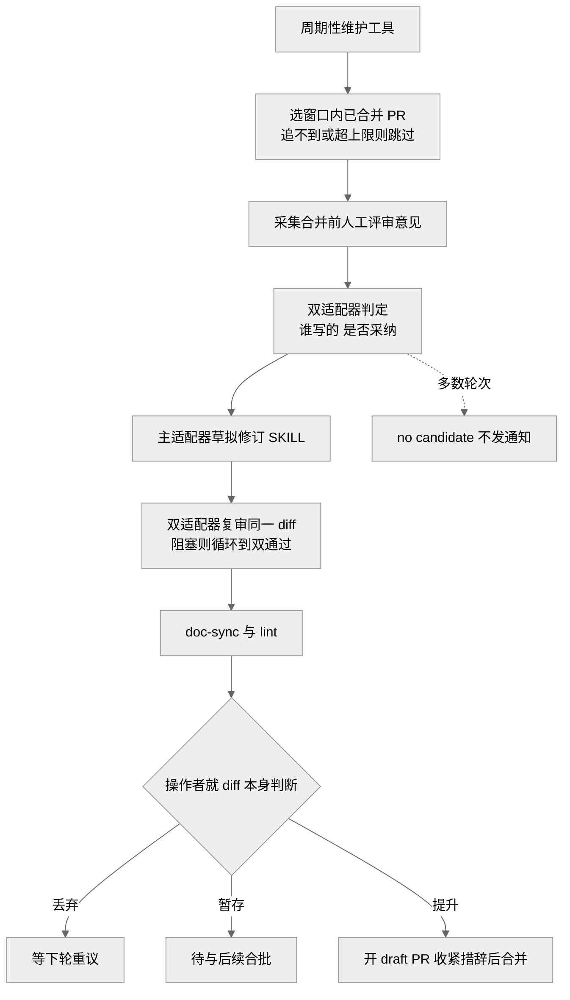
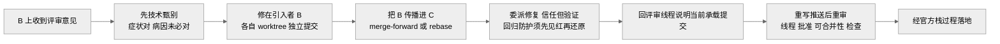

# 第 32 章 · 代码评审与 stacked-PR 工作流

> 第 20 章从元层证明了"`dsh` 是一个主要由编码 agent 写出来的代码库"，并介绍了记录层（Agent Note）、复盘层（postmortem）、门禁层（gates）三层制度。本章把镜头对准**流程操作**这一环：一段改动写完之后，它要怎么被评审、怎么在一串互相依赖的 PR 里回应意见、又怎么最终落进主干。这些不是抽象理念，而是仓库里四个可被 agent 直接调用的 skill（打包好的操作说明书）加两篇 cookbook（操作手册）写死的固定动作。
>
> 证据分级贯穿全章：`[verified]` 有源码/行号可证 · `[inferred]` 合理推断 · `[claimed]` 二手口径。凡涉及"为什么这么设计"的动机判断，一律弱化措辞并标注等级。

## 一、本质：评审也要"能跨会话传递"

先接住第 20 章的一个核心难点：当写代码的主力是"大量并行、没有长期记忆、不断换班"的 agent 时，靠资深工程师脑子里的经验来把关评审，是行不通的——每个新 session 都像刚入职的新人，上一次评审踩过的坑不会自动带到下一次。

`dsh` 的解法和它对待其他纪律一样：**把评审判断力打包成 skill，把落地流程写死成手册**。本章覆盖的四个 skill 与两篇 cookbook，本质上就是四张"发给每个新 session 的说明书"——评审时看哪些点（`dsh-code-review`）、一串叠放 PR 怎么依次合并（`dsh-merging-stacked-prs`）、怎么在这串 PR 上回应评审意见（配套 cookbook）、推送前跑哪些最小检查（`dsh-pre-push-checks`），以及主动找可删可简之处（`dsh-find-simplifications`）。它们把散文约定翻译成了可复用的固定步骤，正好接住"约定无法靠记忆传递"这个痛点 `[inferred]`。

## 二、代码评审的关注点纪律

`dsh-code-review` 这个 skill 开门见山地把自己定位成"**指南，不是完整清单**"：评审前先核实 PR 真实的 base（基线分支）和 head（当前分支），跑一条 `change-scope` 脚本把改动范围和"脏层"标出来，再去读足够的周边代码理解设计；而且明确要求"**correctness（正确性）、lifecycle（生命周期）、security（安全）、被破坏的必需行为**优先于风格问题——一份只带一个有实据的阻塞点的短评审，好过一长串吹毛求疵" `[verified]`（`.agents/skills/dsh-code-review/SKILL.md:8`）。这一条定了整套评审的调性：宁缺毋滥。

它把关注点分成两类。一类是**阻塞项**（blocking requirements），共 6 条，是不满足就不该放行的硬线：新增散文（注释、文档、提示词、面向用户的字符串）必须过语义评审、文档要与代码同步更新、核心类型文档要跟着改、注册项要能被 disposal（销毁）测试证明会清理干净、invariant（运行时不变量检查）必须断言"真正拥有的关系"而非仅仅检查方法是否存在、以及作者确实在本地跑过相关检查 `[verified]`（`:20-27`）。另一类是**人工检查**（manual checks），十几条，都是"代码本身看不出、必须靠人判断"的东西——比如追踪一个被改接口的两侧、检查异步 setup/回调/进程/拆卸里的竞态与取消、以及一个很有意思的反向规则：给通用服务加的新公开方法如果只有一个内部调用方，那属于不必要的 API 膨胀，应该改成在构造时把私有能力交给那个调用方 `[verified]`（`:29-45`）。报告发现时，局部缺陷放在最紧的 diff 行内、跨切面的架构问题用 PR 级评论；收到评审时则"逐条验证、在技术层面修正或反驳，不做表演式附和" `[verified]`（`:47-49`）。

**维护式评审：评审规则本身也要被评审。** 这套评审标准不是一次性写死的。有一篇 cookbook 专门讲 `dsh-code-review` 这个 skill 怎么被持续更新：由**单一指定操作者**手动运行一个私有的周期性维护工具，每天跑一次、留两个 UTC 日的重叠窗口，另有一个七天窗口的每周补跑 `[verified]`（`docs/cookbook/maintaining-dsh-code-review.md:5,9`）。工具的流程是：选出窗口内已合并、且合并提交能从 `origin/master` 追溯到的 PR（追不到的、或超过 250 提交采集上限的，记进 `skipped-pulls.json` 跳过而非中止整轮），采集合并前的人工评审意见，由两个独立配置的评审适配器分别判定"谁写的、改动有没有采纳它",再对照当前 skill；主适配器起草一份修订版 `SKILL.md`，两个适配器都评审同一份 diff，有阻塞发现就循环到双方都通过，最后跑 `doc-sync` 与 `lint` 才算成功 `[verified]`（`:11-15`）。

关键在于人的角色：工具产出的只是候选 diff，操作者必须"**就 diff 本身的价值来读，不能因为'评审器批准了'就放行**"，专门盯清单臃肿、历史叙事、从单个事件过度外推、以及与现有内容重复的覆盖 `[verified]`（`:23`）；然后三选一——丢弃、暂存待批、或提升为一个 draft PR；而且"**不得原样提交适配器输出**"，提升时收紧措辞、删掉只在源 PR 语境下才成立的例子、把规则折进已有条目，都是被期待的动作，正是为了保住流程所依赖的"评审判断" `[verified]`（`:34-48`）。多数轮次其实**不产出候选**——那是常态，工具在日志里记一句"no candidate"、不发通知，"没有更新的日子是流程在正常工作，不是卡住了" `[verified]`（`:50-52`）。

> 图注：此图证明评审规则的更新是一条"**机器起草、双适配器把关、人做最终决定**"的收敛回路，而非人工一次性拍板——工具只产候选，放行权始终在操作者手里，且"没有候选"是常态（`docs/cookbook/maintaining-dsh-code-review.md:11-52`）。

## 三、原生 stacked-PR：一串叠放的小 PR 依次落地

当一个改动太大、可以拆成"下面一层是上面一层的前置"的若干小 PR 时，就形成了一个 **stacked-PR（叠放式 PR）**：记作 `A ← B ← C`，B 以 A 的分支为 base、C 以 B 为 base，像叠盘子一样，每层单独评审、单独合并。`dsh` 的纪律是：**同仓库内的依赖链，落地前必须先用 GitHub 原生的叠放 PR 能力串起来**，把"栈怎么排序、CI 怎么跑、合并状态怎么算、剩余层怎么重定向 base"这些烦心事交给平台，而不是自己用 `gh pr merge` + `gh pr edit` 手工复刻栈语义 `[verified]`（`.agents/skills/dsh-merging-stacked-prs/SKILL.md:3,7-8`）。

`dsh-merging-stacked-prs` 这个 skill 把落地拆成六个阶段：

1. **要求原生栈支持**：动 GitHub 状态前先跑 `gh stack --version`，官方扩展或服务端栈功能不可用就**硬停**，绝不退回逐个手工合并；栈要求所有 head 分支在同一仓库，跨 fork 的链也硬停 `[verified]`（`:10-12`）。
2. **补齐缺失的栈成员**：拉当前 PR 元数据和精确 head OID（提交哈希），用 GraphQL 查 `PullRequest.stack` 和 `stackEntry.position`——"这个官方对象，而不是仅凭 base 分支推断，才是栈成员的权威"；作者全一致就自动按自底向上顺序 `gh stack link`，作者不一致则先问用户 `[verified]`（`:14-20,50-66`）。
3. **仅在需要时刷新**：不为"有刷新机制"就重写分支；真需要更新 trunk（主干）时，二选一——原生级联 rebase（`gh stack sync`/`gh stack rebase`，会带租约保护地强推）或增量 merge-forward（把 trunk 并入最底层、再逐层向上传播），任何历史重写后都要重新拉取精确 head、重新审未解决的评审线程/批准/可合并性/检查 `[verified]`（`:68-75`）。
4. **合并前预检范围**：临合并前再查一次官方栈，要求每个选中 PR 都 open、非 draft、顺序正确、满足评审与检查要求；"一个就绪的顶层不能证明它的依赖也就绪" `[verified]`（`:77-81`）。
5. **通过栈 API 合并**：`gh stack merge <栈号> --yes --merge`，GitHub 自底向上合并并自动重定向剩余上层；绝不传 `--delete-branch`、不手工重定向、不退回 `gh pr merge` `[verified]`（`:83-99`）。
6. **验证落地状态**：等每个选中 PR 报 `MERGED`（排队中不算落地）；删分支只在单独的最后一轮做，且删前要求 GitHub 报告"没有开着的 PR 还拿它当 base"（`gh pr list --base <branch>` 返回 0 才行）`[verified]`（`:101-117`）。

## 四、在 stack 上回应评审：修在引入处，再往上游流

评审意见可能同时落在栈里的好几个 PR 上。配套 cookbook `responding-to-pr-review-on-a-stack` 专管"修哪里、怎么传播"（落地本身归上面那个 skill）`[verified]`（`docs/cookbook/responding-to-pr-review-on-a-stack.md:5`）。它有五条 ground rules（基本规则），其中最要紧的一条是：**修复要落在"引入了这个问题"的那个 PR 上，然后向上游传播**——即使 B 上报的问题所涉的文件在 C 里也有，也要修在 B、再把 B 并进 C；如果反过来在下游 C 上原地修，就会让 B 一直在发着没修的代码，还把修复对 B 的评审者藏了起来 `[verified]`（`:11`）。其余四条：每个 PR 的修复在各自 worktree（工作树）里做、不共享 checkout；GitHub 的栈对象才是权威、别把"分支链凑巧对上"当成官方栈；每个评审修复保持一个独立提交、不把已评审的修复 amend（修订）掉出历史；merge-forward 还是 rebase 都可以但要"有意地"选，重写推送必须用租约保护、禁裸 `--force` `[verified]`（`:9-14`）。

回应流程本身也写得很细：先在技术层面 triage（甄别）每条意见——"报对了症状也可能诊断错病因"；映射到引入处修好、按顺序传播到每个受影响的子层；对**委派给子 agent 的修复要"信任但验证"**——"子 agent 的报告描述的是意图，不一定是真正落地的东西",要亲自在真实的树上重跑门禁，对回归防护测试还要证明它在未修的代码上确实会**失败**（引入回归、看它变红、再还原）——"一个两种情况下都通过的防护什么都没防住";回复要发在评审线程里（用 `gh api ...replies`）而非顶层评论、说明修复和承载它的当前提交；任何重写推送后都要重读未解决线程、批准、可合并性和检查——"被强推过的提交 OID 或过时的行内锚点，不再是该发现仍已解决的当前证据" `[verified]`（`:16-32`）。

> 图注：此图证明栈上回应评审的核心是"**修在引入处、向上游流、每步都在真实树上验证**"，而非在方便的层随手改——下游原地修会让引入者继续发着坏代码并对其评审者隐藏修复（`docs/cookbook/responding-to-pr-review-on-a-stack.md:11,22-24`）。

## 五、两个配套 skill：找简化 与 推送前检查

**`dsh-find-simplifications`——主动做减法。** 它把一句"找找哪里能简化"变成有证据支撑的 Agent Note（或本地 TODO/FIXME/XXX 标记），专治死代码、重复、投机性通用化、过度构建、加了又删、以及"手写了一个成熟依赖已提供的东西"这几类表面 `[verified]`（`.agents/skills/dsh-find-simplifications/SKILL.md:3`）。它反复强调"是指南不是清单：跟着代码走、保持判断、宁可几个证实的候选也不要一堆薄猜测" `[verified]`（`:7-8`）。什么算强候选？——某个公开方法/事件/配置开关/包/测试产物**没有生产消费者**、两处表示镜像同一个事实、一个 seam（能力接缝）的方法所有实现都得支持却没人用、手写代码重复了成熟 npm 包或 Node 内建等 `[verified]`（`:18-32`）；同时给了硬约束：双 LLM 适配器、双持久化后端默认视为**有意为之**，别当"低成本"就删 `[verified]`（`:15`）。写之前必须把消费者分成生产语料/非生产语料/模糊语料三类、先用 `rg` 搜精确符号再读调用点、想法虽对但太小的就落成一行带稳定标签的 TODO 而非 Agent Note `[verified]`（`:64-80,116-121`）。

**`dsh-pre-push-checks`——挑最小必要检查。** 它的立场是"推送前**跑一次**相关的本地证据"，而不是反射性地把整仓测试套跑一遍 `[verified]`（`.agents/skills/dsh-pre-push-checks/SKILL.md:8`）。它先说清 git hook（钩子）本就很窄：pre-commit 修暂存区 lint、查空白、护 vendored 源元数据，pre-push 只跑增量类型检查，穷尽覆盖和平台矩阵归 CI `[verified]`（`:8`）。然后教你**按改动的表面挑证据**：包/脚本行为跑其所属的 Vitest 文件、文档/Agent Note 跑 `doc-sync`、模型或用户可见输出跑对应的无密钥快照、公开导出/构建配置跑 `build` 加相关 hygiene、真实 provider 行为跑 e2e——"没有超出 hook 的通用本地基线，每个行为变更都需要那个会因它的回归而失败的最窄检查" `[verified]`（`:27-37`）;并明确"别只因为接着要 commit/push 就重复一个已通过的检查，尤其别在推送前单独再跑一次类型检查去重复 pre-push hook" `[verified]`（`:37`）。它还有唯一的次序例外——`gh stack sync` 会在校验前就把级联 rebase 推出去，所以规定"**事后立即校验**每个被重写的层、在通过前保持所有 PR 不合并、不因命令成功就宣称栈已就绪" `[verified]`（`:8,66-81`）;历史重写只用 `--force-with-lease`（发现远端已变就中止）、禁裸 `--force` `[verified]`（`:68`）。

## 六、四个 skill 各自何时触发

四个 skill 的 frontmatter（文件头元数据）里的 `description` 字段就是它们的触发条件，agent 据此自动选用 `[verified]`：

- **`dsh-code-review`**：评审 `deepseek-harness` 仓的一个 PR 时（`.agents/skills/dsh-code-review/SKILL.md:3`）。
- **`dsh-merging-stacked-prs`**：落地一串依赖 PR、合并一个 base 是另一个开着的 PR 分支的 PR，或请求里提到 "stacked PRs"/"PR stack"/"dependent PRs" 时（`.agents/skills/dsh-merging-stacked-prs/SKILL.md:3`）。
- **`dsh-find-simplifications`**：在仓里找非显而易见的简化候选、写简化类 Agent Note 或行内 TODO、审计合并被取代的 Agent Note、或折入别的 PR 的简化想法时（`.agents/skills/dsh-find-simplifications/SKILL.md:3`）。
- **`dsh-pre-push-checks`**：推送、强推、标记 ready for review、宣称检查通过之前，以及 `gh stack sync` 刚推出重写分支之后（`.agents/skills/dsh-pre-push-checks/SKILL.md:3`）。

再加两篇 cookbook：`responding-to-pr-review-on-a-stack` 在栈上回应评审时看，`maintaining-dsh-code-review` 由评审 skill 的维护操作者看。这几件东西刚好覆盖一个改动从"写完—自查—推送—评审—回应—落地"的完整流程，且彼此有清晰分工：回应 cookbook 管"修在哪、怎么传播",合并 skill 管"链接检查与落地",互不重叠 `[verified]`（`responding-to-pr-review-on-a-stack.md:5`、`dsh-merging-stacked-prs/SKILL.md:8`）。

## 小结与衔接

本章把第 20 章讲的"制度"落到了"操作"：评审有一套"正确性优先、宁缺毋滥、连评审规则本身都被双适配器加人来周期性维护"的纪律；一串互相依赖的改动被拆成原生 stacked-PR，交给 GitHub 管排序/CI/合并，回应评审时严守"修在引入处、向上游流、每步真实验证";外围还有主动做减法的 `find-simplifications` 和挑最小检查的 `pre-push-checks`。这些之所以要做成可调用的 skill 与手册，根子还是那句话——当执行者是没有长期记忆、不断换班的 agent 时，评审经验和落地纪律只能靠仓库结构本身传下去，而不能靠人脑 `[inferred]`。下一章将继续沿 Part VI 的"流程操作"主线，看仓库另一组面向 agent 的工作流。

## 源码索引

- `docs/cookbook/maintaining-dsh-code-review.md:5,9`（单一操作者 + 每日两 UTC 日重叠/每周七天窗口）、`:11-15`（选 PR/采集意见/双适配器/主适配器草拟/doc-sync+lint）、`:23`（就 diff 本身读、不因"评审器批准"放行）、`:34-48`（丢弃/暂存/提升 三选一 + 不得原样提交适配器输出）、`:50-52`（no candidate 是常态）、`:59-60`（适配器故障/交接）
- `docs/cookbook/responding-to-pr-review-on-a-stack.md:5`（本手册管修复放置与传播、落地归合并 skill）、`:9-14`（五条 ground rules）、`:11`（修在引入者再向上游流）、`:16-32`（甄别/委派信任但验证/回评审线程/重写后重审/verify）
- `.agents/skills/dsh-code-review/SKILL.md:3`（触发：评审 PR）、`:8`（指南非清单、正确性/生命周期/安全优先）、`:20-27`（6 条阻塞项）、`:29-45`（人工检查）、`:47-49`（报告与收评审时逐条验证不表演式附和）
- `.agents/skills/dsh-merging-stacked-prs/SKILL.md:3`（触发条件）、`:7-12`（走原生栈、gh stack --version 硬停）、`:50-66`（链接缺失成员）、`:68-75`（仅需要时刷新）、`:77-81`（预检范围）、`:83-99`（栈 API 合并）、`:101-117`（验证落地与删分支）、`:119-127`（清单）
- `.agents/skills/dsh-find-simplifications/SKILL.md:3`（触发条件）、`:7-8`（指南非清单）、`:15`（双适配器/双后端默认有意）、`:18-32`（强候选判据）、`:64-80`（证明或否决）、`:99-121`（写 Agent Note / 行内 TODO）
- `.agents/skills/dsh-pre-push-checks/SKILL.md:3`（触发条件）、`:8`（跑一次相关证据 + git hook 很窄 + sync 事后立即校验）、`:27-37`（按表面挑证据、不重复已过检查）、`:66-81`（force-with-lease 与 post-sync 校验序列）
