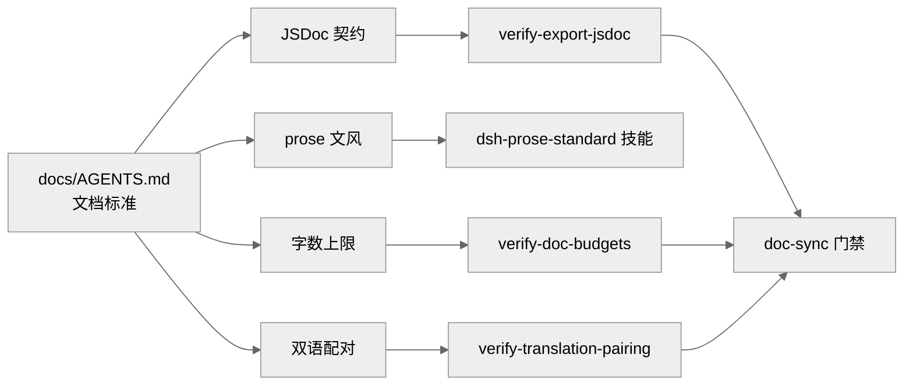
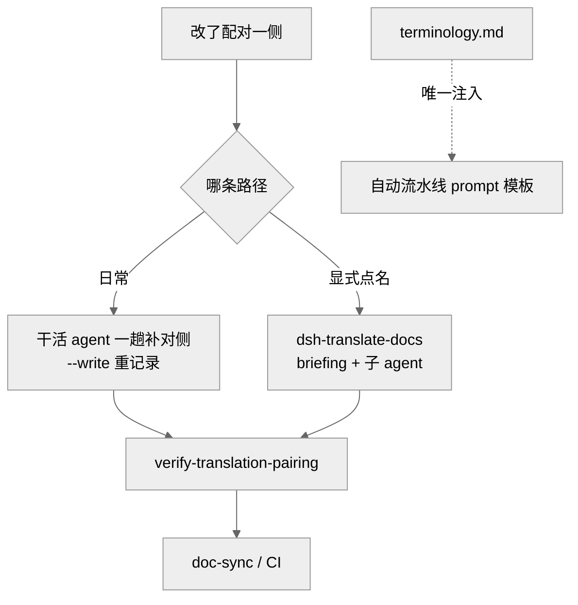

# 第 33 章 · 文档与双语规范

前面的章节反复出现一个现象：DeepSeek Harness 里几乎每一条工程约定，最后都会落到一个能自动执行的门禁（gate，自动化检查）上。文档也不例外。这一章讲的就是这套"文档如何写、如何译、如何不腐烂"的规范，以及它靠哪些脚本被固化下来。核心的一手材料集中在 `docs/i18n/`、`docs/AGENTS.md`、`docs/rescope.md` 与 `.agents/skills/dsh-*` 这几处技能（skill）说明里。

理解这套规范，最好先记住它的底层信念：**规则不能只写在文档里，还要有一个脚本能判它对错。** 下面逐层拆开。

## 一、文档标准：一处事实、一个家

`docs/AGENTS.md` 是文档标准的总纲。它先给出一张分层表，把每一类事实分派到唯一的"家"：根 `AGENTS.md` 放每次会话都要读的常驻规则，架构图放 `architecture.md`，类型定义放 `subsystems/`，决策理由放 Agent Note，事故复盘放 `postmortem/``[verified]`（`docs/AGENTS.md:19-32`）。它明确要求"每条事实只有一个家，别处一律用链接指过去"`[verified]`（`docs/AGENTS.md:17`）。

对写代码的人来说，最贴身的一条是 JSDoc 契约。根 `AGENTS.md` 规定：每个模块和导出都要有描述其非显然契约的 JSDoc，函数型导出还必须带 `@param`／`@returns`，并点名由 `verify-export-jsdoc` 强制执行`[verified]`（`AGENTS.md:138`）。这个门禁不是摆设——`scripts/verify-export-jsdoc.ts` 会用 TypeScript 编译器遍历每个非 vendored 包的导出，函数与公有类方法缺参数或返回值文档就报错，遇到无法归类的导出形式直接判失败（fail closed，即默认拒绝）`[verified]`（`scripts/verify-export-jsdoc.ts:1-8`）。它也留了合理豁免：插件协议槽位（`Config`、`inject`、`name`、`reusable`、`apply`）作为顶层导出时不强制文档，因为这些槽位的说明归属在声明它们的 Service Definition（服务定义）或类上`[verified]`（`scripts/verify-export-jsdoc.ts:17-21`）。具体到"缺 `@param`""标签写了却对不上任何参数（陈旧标签）"这类判据，则在 `scripts/jsdoc.ts` 里逐条生成诊断`[verified]`（`scripts/jsdoc.ts:150-155`）。

标准还对"文字本身怎么写"立了规矩，这正是 `dsh-prose-standard`（prose 标准，即文风标准）技能负责的部分。它的核心命题是：**先写够，把契约（约定）说全，再删掉推理过程、重复与装饰**`[verified]`（`.agents/skills/dsh-prose-standard/SKILL.md:8`）。它给"契约"下了精确定义——调用方、被调方、实现方、生产方或消费方所依赖的义务、不变量、前置条件、后置条件或兼容承诺`[verified]`（同上 `:8`）。最有辨识度的一条是对几个"黑话词"的管制：`contract`、`boundary`、`shape`、`surface`、`seam`、`gate`、`vocabulary` 都是"用前先检查"的词，不是禁用词——先问"有没有更精确的词能说清这个事实"，比如写 `response fields`（响应字段）而不是 `response shape`，写 `JSON validation` 而不是 `validation boundary``[verified]`（`.agents/skills/dsh-prose-standard/SKILL.md:10`、`AGENTS.md:140`）。根 `AGENTS.md` 把这条压得更直白：不要用比喻，`contract` 只留给真正的义务，`boundary` 只留给真实的进程、协议、安全、事务或生命周期边界`[verified]`（`AGENTS.md:140`）。

`dsh-prose-standard` 还按"文字所在位置"列了必备覆盖：公有 JSDoc 要写清返回区分、抛出、副作用、所有权、时序与取消；内部注释解释非局部结构与不变量、竞态顺序、安全边界；测试只解释非显然的设计动机`[verified]`（`.agents/skills/dsh-prose-standard/SKILL.md:44-51`）。这是一份"该写什么"的正向清单，而不只是"删到多短"的减法。

与之配套的是一张"slop（劣质文字）清单"，`dsh-doc-standards` 技能会拿它当审计项逐条扫：同一规则出现在多个家、叙述历史或战争故事（"以前""现在""不再"）、在散文里标实现状态、手抄本应由生成器产出的目录、以及把推导过程当文档留下`[verified]`（`docs/AGENTS.md:59-72`、`.agents/skills/dsh-doc-standards/SKILL.md:36-48`）。篇幅这一维也被门禁盯着：`verify-doc-budgets` 依据 `scripts/doc-budgets.manifest.json` 里的字数上限，超标或缺文件就判红，并规定了"先搬家、再精简、最后才抬高上限"的处理顺序`[verified]`（`docs/AGENTS.md:49-57`）。

下面这张图把"一条文档规则如何被门禁固化"串起来。

图 33-1　文档标准不是纯口头约定：JSDoc、字数、双语配对各自落到一个可执行脚本，最终汇入 doc-sync 一次跑齐（依据 docs/AGENTS.md:49、scripts/run-gates.ts:606-627）。

## 二、双语门禁与 i18n 流程

这个仓库的文档面向公司内外的人和 agent（智能体），所以每篇在范围内的文档都同时维护英文和简体中文两份`[verified]`（`docs/i18n/README.md:5`）。这套双语机制的骨架是"配对约定"（pairing contract）。

**一对文档 = 三个同目录兄弟文件**：英文 `foo.md`、中文 `foo.zh.md`，外加一致性记录 `foo.i18n.yaml``[verified]`（`docs/i18n/README.md:10`）。两种语言权威对等——中文优先或英文优先都合法，被修改的那一侧就是本次更新的源`[verified]`（`docs/i18n/README.md:9`）。`foo.i18n.yaml` 里记的是两侧"上次被确认说的是同一件事"时各自的 git blob hash（`git hash-object` 的结果），而不是 commit hash，因此同一个 PR 里改动也能算出一致性`[verified]`（`docs/i18n/README.md:11-18`）。

门禁 `verify-translation-pairing` 把这份约定机械地执行下来：范围内每篇文档必须有完整的三件套，两侧当前 blob hash 必须等于记录值（改了任一侧却没重新确认就判红），中文侧要带英文回链，且两侧的"结构签名"（structural signature——标题层级、代码块、表格行列数、列表种类、有序列表起点、条目数、链接目标）必须一一对应`[verified]`（`docs/i18n/README.md:24-32`、`scripts/verify-translation-pairing.ts:1-11`）。它同时诚实地声明了自己的边界：**门禁通过只代表"在这份内容上确认过一致"，不代表这次确认本身正确**——译得对不对、术语准不准，仍是评审人的另一半责任`[verified]`（`docs/i18n/README.md:40`）。这一整套 gate 由 `doc-sync` 统一编排跑起来`[verified]`（`scripts/run-gates.ts:626`）。

怎么译，由 `translation-rules.md` 定，它借用 RFC 2119 的强度分级：MUST／MUST NOT 是门禁或评审阻断级，SHOULD 需给出偏离理由，MAY 自由裁量`[verified]`（`docs/i18n/translation-rules.md:5`）。忠实性要求"对侧必须说源侧所说的——不加不减"，行文却要读起来像目标语言里原生的技术写作，而非逐字对译`[verified]`（`docs/i18n/translation-rules.md:9-10`）。排版规则针对中文侧，来自 MDN、Kubernetes、Vue、中文文案排版指北等跨项目共识：中西文之间留一个半角空格、中文正文用全角标点、并列项用顿号、第二人称用"你"不用"您"`[verified]`（`docs/i18n/translation-rules.md:43-51`）。

术语由 `terminology.md` 兜底，双向绑定。它分三类：缩写类（`API`、`LLM`）、英文类（`agent`、`seam`、`fixture` 中英文里都保留英文）、双语类（`adapter`→适配器、`contract`→约定）`[verified]`（`docs/i18n/terminology.md:11-77`）。每行还带"首次出现"括注格式和"不要译作"禁译栏——比如 `seam` 禁译"接缝"、`Agent Note` 禁译"智能体注记／笔记"`[verified]`（`docs/i18n/terminology.md:36,59`）。

这里有一个容易被忽略但很关键的分工：`translation-prompt.md` 是**自动翻译流水线**的 prompt（提示词）模板，从 `# Translation Prompt` 起的正文会逐字进入模型请求，所以它本身不参与双语配对`[verified]`（`docs/i18n/translation-prompt.md:3`）。流水线渲染时只把 `terminology.md` 整表填入 `{{terminology}}` 占位符，不注入任何其他仓库文件——`translation-rules.md` 约束的是人和 agent，不注入模板`[verified]`（`docs/i18n/translation-prompt.md:5-15,126`）。而**日常配对更新**走的是另一条轻量路径：改了配对文档任一侧的 PR，同一 PR 里由干活的 agent 一次性、一趟直接把对侧补齐并用 `--write <pair>` 重记录，不调用翻译技能`[verified]`（`docs/i18n/README.md:38,58-60`）。只有用户显式点名，才会走 `dsh-translate-docs` 那套更重的、带 briefing（简报）与子 agent 的扩展流程`[verified]`（`.agents/skills/dsh-translate-docs/SKILL.md:11-12`）。

下图梳理这两条路径。

图 33-2　双语更新有两条路：日常一趟直译＋重记录，扩展流程按需点名；术语表是自动流水线唯一注入的仓库文件（依据 docs/i18n/README.md:58、translation-prompt.md:5）。

## 三、思维链泄漏、文档站同步与 vendored 改名

`dsh-trim-cot-leakage`（剔除思维链泄漏）技能处理一类特殊的坏文字：**视角停留在写作当时那次会话、而不是仓库当前状态**的散文——引用只有那次会话看得到的东西（`(decision 7)`、`design §4.7`）、叙述改动而非状态（"以前""不再"）、或对着已经离场的评审人辩解`[verified]`（`.agents/skills/dsh-trim-cot-leakage/SKILL.md:7-8`）。它给出一个判定标准：**站在 HEAD、没有任何会话记录或 PR 讨论的读者，能否解析每一处引用、验证每一条断言？** 不能，就把留得下的事实用仓库视角重述、删掉其余`[verified]`（`.agents/skills/dsh-trim-cot-leakage/SKILL.md:10-12`）。它列了八类泄漏，也明确列了"不算泄漏"的保留项——issue 引用、Agent Note 里对已合并 PR 的引证、抑制理由（如空 `catch` 的解释）都要保留`[verified]`（`.agents/skills/dsh-trim-cot-leakage/SKILL.md:14-38`）。

`dsh-doc-site-sync`（文档站同步）技能守的是文档站与仓库的关系：**仓库 Markdown 是唯一可编辑的内容源，网站只是被测试的投影**。`website/docs.ts` 挑选公开页，`scripts/project-doc-site.ts` 把它们重写进一次性的 `website/.generated/` 树，VitePress 再构建这棵树`[verified]`（`.agents/skills/dsh-doc-site-sync/SKILL.md:8`）。它规定绝不为网站建 `zh-CN/` 之类语言目录——`foo.zh.md` 投影到根路由，`foo.md` 投影到 `/en/``[verified]`（同上 `:10`）；也规定绝不手改 `.generated/`，而是改上游的 Markdown 或生成器`[verified]`（同上 `:27`）。校验用 `pnpm docs:check` 与 `doc-sync``[verified]`（同上 `:66-79`）。

最后是 `rescope`（vendored 包改名）。Cordis 框架及其基础库以源码形式 vendored 在 `vendor/` 下，并改到 `@deepseek-ai` scope 发布——因为每个 harness 包都把框架声明为对等依赖（peer dependency），发布 harness 就会连带发布这层框架，若沿用上游名就会在 npm 注册表上抢占（squat）这些名字`[verified]`（`docs/rescope.md:5`）。`docs/rescope.md` 是那张名字映射表（`cordis`→`@deepseek-ai/cordis` 等）`[verified]`（`docs/rescope.md:9-21`）。改名不是手工做的：`scripts/rescope-vendor.ts` 拥有映射并执行改写，只重写带引号定界的完整包名 token，因此不会误伤 `cordis.yml`、Loader 的 `cordis:` 内建前缀、或名字里本就含 `cordis` 的 harness 包`[verified]`（`docs/rescope.md:44`、`scripts/rescope-vendor.ts:9-15`）。`pnpm run rescope-vendor:check` 断言改名后的状态（无残留、每处精确编辑都落地、再跑一次 `--apply` 应为空操作），并被编入 **hygiene** 门禁`[verified]`（`scripts/rescope-vendor.ts:25-29`、`scripts/run-gates.ts:573`；`docs/rescope.md:49` 亦明写 "runs in the hygiene gate"）。

把这三者放在一起看，会发现同一种设计哲学贯穿始终：**每一条"应该怎样"的规范，背后都挂着一个能判它对错的脚本，再由 `doc-sync` 一次跑齐。** 规范因此不靠人自觉记忆，而靠门禁在每个 PR 上复述——这正是整套文档与双语体系不腐烂的原因。

## 源码索引

- `docs/AGENTS.md:17-32` — 分层表：一处事实、一个家
- `docs/AGENTS.md:40-45` — 一行一段、ts 块编译、配对同改、JSDoc 完整契约、直接措辞
- `docs/AGENTS.md:49-57` — `verify-doc-budgets` 与字数上限、搬家—精简—抬高顺序
- `docs/AGENTS.md:59-75` — slop 清单与机器可检链接
- `AGENTS.md:138,139` — `verify-export-jsdoc` 强制、`contract/boundary/shape` 管制与禁比喻
- `scripts/verify-export-jsdoc.ts:1-8,17-21` — JSDoc 门禁与协议槽位豁免、fail closed
- `scripts/jsdoc.ts:150-161` — 缺 `@param`／陈旧标签／`@returns` 判据
- `docs/i18n/README.md:9-32` — 配对约定：三件套、blob hash、结构签名
- `docs/i18n/README.md:38,40,58-60` — 轻量直译路径、门禁边界、分工
- `docs/i18n/translation-rules.md:5-51` — RFC 2119 分级、忠实性、中文排版
- `docs/i18n/terminology.md:11-77` — 术语三类、首次出现与禁译栏
- `docs/i18n/translation-prompt.md:3-15,126` — 流水线模板、`{{terminology}}` 唯一注入
- `.agents/skills/dsh-prose-standard/SKILL.md:7-51` — 契约定义、黑话词管制、按位置的必备覆盖
- `.agents/skills/dsh-doc-standards/SKILL.md:36-48` — slop 审计工作流
- `.agents/skills/dsh-trim-cot-leakage/SKILL.md:7-38` — HEAD 读者判定、八类泄漏与保留项
- `.agents/skills/dsh-doc-site-sync/SKILL.md:8-27,66-79` — 网站为投影、禁改 `.generated/`、校验
- `.agents/skills/dsh-translate-docs/SKILL.md:11-12` — 扩展流程仅限显式点名
- `docs/rescope.md:5-21,44` — 改名动机、映射表、脚本拥有映射
- `scripts/rescope-vendor.ts:9-29` — token 改写规则与 `--check`
- `scripts/run-gates.ts:573`（hygiene 编 `rescope-vendor:check`）、`604-627`（doc-sync 编 `verify-export-jsdoc`/`verify-translation-pairing`/`verify-doc-budgets` 等）
