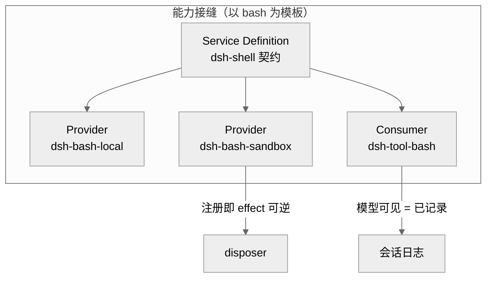

# 第 34 章 · 设计决策地图

一个软件仓库真正的「设计」，往往不在代码里，而在那些「我们为什么没那样做」的取舍里。DeepSeek Harness（下称 dsh）把这些取舍显式地写了下来——它的 `.agents/notes/` 目录里，躺着五百余篇 **Agent Note（架构决策记录，Architecture Decision Record，简称 ADR）**。第 20 章已经讲过这套笔记体系的方法论与计数，本章不重复那个；本章要做的是打开这座宝库，抽样精读若干篇「承重」的决策，看看 dsh 到底做过哪些有代表性的选择，又从中提炼出哪些反复出现的设计原则。

按主题分，实现态（`implemented/`）的笔记共约 505 篇 [verified `repo/deepseek-harness/.agents/notes/implemented/`]：architecture 129、feature 170、bug-fix 77、process 69、simplification 48、testing 12。另有 `proposed/`（提案态）25 篇、`rejected/`（已拒）11 篇、`archived/`（归档）142 篇 [verified]。数量不是重点——重点是它们连缀出的那张「决策地图」。

## 一、一篇笔记长什么样：格式与生命周期

每篇笔记由**三元组**构成：英文 `.md`、中文 `.zh.md`、以及记录一致性哈希的 `.i18n.yaml` 边车文件 [verified `.../implemented/architecture/2026-06-13-capability-seams.{md,zh.md,i18n.yaml}`]。文件名前缀是「首次提案日期」，路径的两个维度都有含义：顶层文件夹是**生命周期**（状态），下一层是**分类**（决策的种类）[verified `.../notes/README.md:9-19`]。

生命周期像一条单向的河：一篇笔记从 `proposed/` 出发，落地后移入 `implemented/`；提案若被否掉则进 `rejected/`；实现态的笔记若「其理由已不太可能指导未来工作」，就整组迁入冻结的 `archived/`。实现态笔记必须**与真实代码保持同步**——代码改了路径、改了默认值，笔记要在同一次改动里跟着改，但**只改事实、不改决策**；推翻决策要另写新笔记并交叉链接，而非就地改写 [verified `.../notes/README.md:11-19`、`.../implemented/AGENTS.md:5-13`]。

分类维度是一个**封闭集合**，由 `scripts/agent-note-tree.ts` 定死，门禁拒绝任何其他文件夹 [verified `.../notes/README.md:23`]。六个类别里，architecture 与 process 的分界很有意思：前者关乎「我们发布的源码」（包如何关联、运行时词汇是什么），后者关乎「围绕代码的工具与流程」（门禁、包管理器、vendoring）——而刻意没有 `refactor` 类，因为它与 simplification 重叠，后者的判别式「可观察行为是否改变」已经覆盖了它 [verified `.../notes/README.md:30-34`]。

正文骨架也被机器门禁固定住。实现态笔记以 `## Problem`（动机）开头，随后是 `## Decision`（用现在时描述已落地的现实）、若干自由段、`## Alternatives considered`（备选方案，**强制**）、`## Consequences`（这笔交易付出了什么、又买到了什么）[verified `.../notes/README.md:93-111`]。反过来，`## Proposal`、`## Plan`、`## Acceptance criteria` 这些「提案腔」在实现态笔记里是被门禁拒绝的——落地了就该用现在时描述现实，而非继续谈计划 [verified `.../notes/README.md:103`]。其中「备选方案」是灵魂：README 直言「一个不记录它击败了什么的决策，是在邀请重新争论——而这正是笔记要防止的失败」[verified `.../notes/README.md:111`]。

<div style="background: #ffffff !important; background-color: #ffffff !important; padding: 16px; border-radius: 8px; margin: 16px 0;" bgcolor="#ffffff">

```mermaid
%%{init: {'theme':'neutral'}}%%
flowchart LR
  P["proposed 提案"] -->|落地| I["implemented 已实现"]
  P -->|否决| R["rejected 已拒"]
  I -->|价值耗尽| A["archived 冻结"]
  I -->|事实变化| I
  I -.->|推翻决策| N["新笔记 + 交叉链接"]
  subgraph 每篇 = 三元组
    E[".md 英文"]
    Z[".zh.md 中文"]
    Y[".i18n.yaml 哈希"]
  end
```

图 34-1　笔记的生命周期与三元组结构。注意 `implemented` 的自环——它随代码事实就地更新；而推翻决策必须开新笔记，旧笔记冻结但不删。

</div>

## 二、六主题抽样：dsh 做过的代表性取舍

**architecture（结构决策）。** 最承重的一篇是「能力接缝」（capability seam）：一个可替换能力被拆成**三个角色**——Service Definition（服务定义，拥有契约与词汇）、Service Provider（服务提供者，一种具体实现）、Consumer（消费者，模型与插件编程的对象）。理由是这三者「以不同速率、因不同原因变化」，捆在一起会互相牵连：把本地执行器换成沙箱执行器，本不该动到模型看见的工具 schema [verified `.../implemented/architecture/2026-06-13-capability-seams.md:9-25`]。「事件溯源会话」把追加日志定为唯一真相源，而「会话持久化」则把它做成一个抽象服务接缝——直接持久化既有的 `SessionEvent`，不引入平行的「持久化消息」类型，并用 JSONL 与 SQLite 两套后端跑同一份 `runPersistenceContract` 契约测试 [verified `.../implemented/architecture/2026-06-14-session-persistence.md:15-24`]。「内容块词汇」则让消息成为一串带类型的内容块（`text`/`reasoning`/`tool-call`/`tool-result`），并用「可合并扩展映射」让插件通过声明合并新增块类型——映射成本被推到各个 adapter，而非渗进核心 [verified `.../implemented/architecture/2026-06-11-content-block-vocabulary.md:13`]。

**feature（新能力）。** 「自指的 cordis 工具集」把整个插件运行时交到模型手里：`cordis_inspect` 只读地巡视活运行时、`cordis_mount` 在 `node:vm` 里挂载一个临时插件、`cordis_unmount` 卸载到静默。它坦承这不是安全边界，而是「与 bash 同等信任」的开发期工具；真正的设计难点是三条正确性约束：注册时即校验 schema、让模型能读到服务的真实签名（生成式 API 目录）、以及一切挂载都必须可完全释放 [verified `.../implemented/feature/2026-07-08-self-referential-cordis-toolset.md:9-17`]。「沙箱」这篇巨长的笔记则给出产品级路径：一个接缝、一条按平台排序的本地后端链、一个消费者，外加两个杠杆——每次调用一次的「升级重试」与按会话的运行时模式；关键是「一切从叶子 `cordis.yml` 组合，什么都不碰 `agent-loop`」[verified `.../implemented/feature/2026-07-06-sandbox.md:16-17`]。

**process（围绕代码的流程）。** 「机械化质量门禁优先于文字约定」这篇立下基调：本仓库主要由编码 Agent 开发，而 Agent 遵守「会退出非零的命令」远比遵守文字约定可靠——每条 AGENTS.md 里可机器校验的承诺，都要配一个会失败的命令 [verified `.../implemented/process/2026-06-11-quality-gates.md:11-15`]。「用维护良好的依赖替代手搓」则纠正了一种从未被正式决定的「别加依赖」的隐性文化，把引入依赖重新定义为一种**简化**，前提是净删除自有代码、依赖健康、边界契合 [verified `.../implemented/process/2026-07-26-dependencies-over-hand-rolling.md:13-20`]。

**simplification（做减法）。** 「按 fsspec 风格切分文件系统接缝」把一个大而全的 `FileSystem` 服务拆成四层：工具执行器、观察策略插件、provider 契约、本地 provider——让「读窗口/编号行/已观察状态」这些面向模型的策略不再被每个未来后端继承 [verified `.../implemented/simplification/2026-06-26-fsspec-style-fs-seam.md:22-33`]。「删除 TUI 包」则是一次干净的减法：终端 UI 失去了唯一的组合入口后，被连同快照、补丁依赖、SDK 脚手架一起删除，且**不留兼容包或别名**——因为「移动代码并不提供当前的产品需求」[verified `.../implemented/simplification/2026-08-04-remove-tui-package.md:14-33`]。

**testing（测试策略）。** 「面向协议形状代码的属性测试」用 `fast-check` 为 chunk 流、事件日志、schema 转换等组合爆炸的输入撒网，笔记开篇就写着「属性套件首次运行就抓到一个真实的 BlockAssembler 重复 `block-end` 缺陷」[verified `.../implemented/testing/2026-06-11-property-based-testing.md:7,25`]。「CI 中的真实 API e2e」则坚持：无密钥套件只证明管道、不证明产品，故单开一个带密钥的工作流，并用「预检失败要响」把「密钥缺失」从隐形的假绿变成可见的失败 [verified `.../implemented/testing/2026-06-19-real-api-e2e-ci.md:9-15,43-44`]。

**bug-fix（补缺）。** 一个精巧的例子：「空模型响应是可重试的失败」。provider 偶尔返回一个格式良好、却零内容块的完成流；若 adapter 把它当作成功的 `stop`，循环就会记一条空消息、结束回合，重试永不触发，goal 驱动会白白消耗一轮。修法是让 adapter 在边界上把它分类为 `EMPTY_RESPONSE` 失败，复用既有的重试机制，保持 `agent-loop` 与 provider 无关 [verified `.../implemented/bug-fix/2026-07-24-empty-model-response-is-retryable.md:9-22`]。

## 三、跨越多篇笔记的设计原则

抽样读到这里，几条反复出现的原则已经浮现。

**其一，一切皆插件、无特权内核。** 「微内核事件分类法」把循环的扩展点定义为带明确 dispatch 模式的类型化事件（waterfall/serial/parallel/emit），并明确「`dsh-agent-loop` 是唯一的具体循环插件，且它自身也可替换，外部任何东西都不得依赖它」[verified `.../implemented/architecture/2026-06-11-microkernel-event-taxonomy.md:13-21`]。沙箱笔记反复强调「什么都不碰 `agent-loop`」[verified `.../implemented/feature/2026-07-06-sandbox.md:17`]，自指工具集甚至把整个运行时交给模型——都印证内核没有特权。

**其二，注册即 effect、可逆。** 能力接缝的注册表 `register()` 返回一个 disposer [verified `.../implemented/architecture/2026-06-13-capability-seams.md`、CLAUDE.md「Registrations are effects」]；user-settings 接缝特意让 `register()` 跑在注册者的 fiber 上，「释放注册者就移除其命名空间与监听器」[verified `.../implemented/architecture/2026-07-28-user-settings-seam.md:19`]；自指工具集的 `cordis_unmount` 更是「卸载到每一个工具、监听器、服务、定时器、effect 都静默为止」[verified `.../implemented/feature/2026-07-08-self-referential-cordis-toolset.md:25`]。可逆是这套架构能让模型安全「自我改造」的前提。

**其三，模型可见 ⟺ 已记录。** 凡是能到达模型请求的东西，都必须能从会话日志重建。内容块词汇、事件溯源会话是其地基；沙箱笔记明确「mount/unmount 通过其 `tool/call`/`tool/result` 对可见，无需新增会话事件」[verified `.../implemented/feature/2026-07-08-self-referential-cordis-toolset.md:59`]；空响应修复也靠「失败必须落成一条真实的回合失败事件」来堵住假成功 [verified `.../implemented/bug-fix/2026-07-24-empty-model-response-is-retryable.md:22`]。

**其四，接缝三角色可替换。** 从 bash（`dsh-shell`/`dsh-bash-local`/`dsh-tool-bash`）到会话持久化（接口/JSONL/SQLite）、文件系统四层切分、双 LLM adapter，「定义—提供者—消费者」的三角反复出现；接缝的纪律是「消费者永不 import provider 专属类型」[verified `.../implemented/architecture/2026-06-13-capability-seams.md:19`、`.../implemented/simplification/2026-06-26-fsspec-style-fs-seam.md:108`]。

**其五，证据驱动的门禁。** 质量门禁、真实 API e2e、属性测试三篇共同说明：dsh 不信任「文字约定」与「happy path 全覆盖」，而信任会失败的命令与对抗性输入——「每文件 100% 覆盖只证明每行跑过，不证明每种交织正确」[verified `.../implemented/testing/2026-06-11-property-based-testing.md:11`]。

**其六，双实现验证中立性。** 「两个 LLM adapter 作为设计验证的孪生」把这条讲透：只用一个 adapter，「provider 中立」的说法就无从验证，那个实现碰巧做的一切都会悄悄变成事实规范；故从一开始就用两套不同内部实现的 adapter 顶住同一份 `StreamChunk` 契约——「任何 StreamChunk 词汇无法为两个实现同时表达的东西，都是核心词汇的缺陷」[verified `.../implemented/architecture/2026-06-13-twin-llm-adapters.md:9-18`]。笔记还诚实记下代价：孪生让 adapter 与 e2e 的维护量翻倍，换来的是「持续的接缝中立性验证」以及一个现成的第二实现范例 [verified 同上:27]。会话持久化的 JSONL/SQLite 双后端跑同一份契约、沙箱在 Linux/macOS 上并列 bwrap/Landlock/Seatbelt 三种 runner，都是同一手法的变体——**用第二个真实实现，逼出第一个实现悄悄藏起来的假设**。

这几条原则并非各自独立，而是互相加固：正因为「注册即 effect、可逆」，模型才敢在自指工具集里挂载又卸载插件；正因为「模型可见 ⟺ 已记录」，会话才能被无损重放、被 fork、被跨进程浏览。它们共同服务于一个更朴素的目标——让一个主要由 Agent 开发、也供 Agent 运行的系统，在长期演化中不塌陷。

<div style="background: #ffffff !important; background-color: #ffffff !important; padding: 16px; border-radius: 8px; margin: 16px 0;" bgcolor="#ffffff">



图 34-2　能力接缝的三角色，与两条贯穿原则的交汇：消费者只依赖定义、不碰 provider；执行痕迹落进日志，注册可被释放。换 provider（本地 → 沙箱）不动消费者的工具 schema。

</div>

## 四、被拒与归档：为何也是资产

`rejected/` 只有 11 篇，却分量十足。最好的例子是「被 2026-07 NIH 审计否决的依赖替换」：一次覆盖每个包组的十路并行调研，逐一追问「某个成熟外部包能否净删除这块手搓代码」；正面结论各自成为提案，而**负面裁决被冻结在这一篇里**，逐条写明为何某个「看着能换」的手搓其实是承重的——比如 `vscode-jsonrpc` 无法表达配置化的 `maxMessageBytes` 上限、且是 CJS 而本仓库处处 ESM [verified `.../rejected/simplification/2026-07-26-dependency-swaps-rejected-by-nih-audit.md:9-21`]。它自陈价值：「调研的全部意义在于，下一次审计从这些裁决出发，而非从头重推」[verified 同上:76]。被拒笔记因此像疫苗——防止团队反复提同一个诱人的错误提案；README 也规定：只在它仍能阻止一个「可信的错误」时保留，否则整组删除 [verified `.../notes/README.md:14,38`]。

`archived/` 有 142 篇，价值在于**冻结历史**。归档只允许极少的元数据改动，之后整组三元组「永久冻结，不得编辑、翻译、重排或当作现行权威」[verified `.../notes/README.md:40-42`]。这解决了长寿仓库的一个真问题：老决策既不该继续维护、又不该被抹掉。删除 TUI 包时，笔记就明确「那些归档的 TUI 实现记录仍冻结，但不再是受支持包清单的权威」[verified `.../implemented/simplification/2026-08-04-remove-tui-package.md:19`]——历史被诚实保留，同时不再误导现状。

## 小结

把五百余篇笔记压成一句话：dsh 的设计不是一堆孤立的聪明主意，而是**同几条原则在不同能力上的反复应用**——无特权内核、可逆的 effect、模型可见即已记录、三角色接缝、证据驱动的门禁、双实现验证中立性。更难得的是，它连「没走的路」都存了档：被拒的记录防止重复争论，归档的记录冻结历史。对读者而言，这张地图的用法很实际——想改动某个子系统前，先去对应主题下找那篇「承重」的笔记，读它的 `Alternatives considered`，你多半会发现你想到的方案，前人已经掂量过了。

## 源码索引

- 笔记体系与格式：`repo/deepseek-harness/.agents/notes/README.md`、`.../implemented/AGENTS.md`
- architecture：`.../implemented/architecture/2026-06-13-capability-seams.md`、`2026-06-14-session-persistence.md`、`2026-06-11-content-block-vocabulary.md`、`2026-06-11-microkernel-event-taxonomy.md`、`2026-06-13-twin-llm-adapters.md`
- feature：`.../implemented/feature/2026-07-08-self-referential-cordis-toolset.md`、`2026-07-06-sandbox.md`
- process：`.../implemented/process/2026-06-11-quality-gates.md`、`2026-07-26-dependencies-over-hand-rolling.md`
- simplification：`.../implemented/simplification/2026-06-26-fsspec-style-fs-seam.md`、`2026-08-04-remove-tui-package.md`
- testing：`.../implemented/testing/2026-06-11-property-based-testing.md`、`2026-06-19-real-api-e2e-ci.md`
- bug-fix：`.../implemented/bug-fix/2026-07-24-empty-model-response-is-retryable.md`
- architecture：`.../implemented/architecture/2026-07-28-user-settings-seam.md`
- rejected：`.../rejected/simplification/2026-07-26-dependency-swaps-rejected-by-nih-audit.md`
- 根约定：`repo/deepseek-harness/CLAUDE.md`（AGENTS.md）
